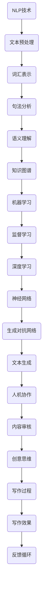

                 

### 1. 背景介绍

在当今数字化时代，人工智能（AI）正以前所未有的速度和影响力改变着各行各业。从医疗诊断到自动驾驶，从智能助手到金融预测，AI技术的应用几乎无处不在。然而，随着AI技术的不断进步，一个备受关注的话题也日益凸显——那就是AI是否会取代人类作者。

人机协作写作，作为一种新兴的写作模式，旨在充分利用人工智能的优势，同时保留人类作者的创造性和主观性。在这个背景下，本文将探讨AI如何增强而非取代人类作者，从而实现更加高效、创新的写作过程。

AI在写作领域的应用可以追溯到自然语言处理（NLP）技术的发展。早期的NLP研究主要集中在文本分类、信息抽取和机器翻译等方面。随着深度学习技术的兴起，NLP的性能得到了显著提升，使得AI在生成文本、辅助写作等方面展现出巨大的潜力。如今，AI写作工具如Copy.ai、Wordsmith等，已经能够生成新闻稿、市场报告、产品描述等文本内容。

尽管AI在写作领域的应用前景广阔，但许多人仍然担心AI是否会取代人类作者。事实上，AI和人类作者并非零和游戏。相反，AI具有许多独特的优势，可以成为人类作者的得力助手。首先，AI具有强大的数据处理和分析能力，可以快速处理大量数据，提取关键信息，从而为写作提供丰富的素材。其次，AI可以自动化重复性工作，如数据收集、文本整理等，从而减轻人类作者的工作负担。此外，AI还可以通过自然语言生成技术，帮助人类作者生成高质量的文章和内容。

然而，AI在写作中也存在一些局限。首先，AI缺乏情感和创造力，难以完全复制人类作者的个性和风格。其次，AI生成的文本可能存在逻辑错误和事实错误，需要人类作者进行审核和修正。此外，AI在处理复杂问题和创意思维方面仍然存在挑战。

因此，人机协作写作模式应运而生。在这种模式下，人类作者负责创意思维和内容审核，而AI则负责数据处理、文本生成和自动化工作。通过这种方式，AI和人类作者可以相互补充，共同提升写作效率和质量。

本文将围绕人机协作写作的核心概念、算法原理、应用场景、未来发展趋势和挑战等方面进行探讨，旨在为读者提供一个全面、深入的了解。

### 2. 核心概念与联系

在人机协作写作中，有几个核心概念和联系需要明确，包括自然语言处理（NLP）、机器学习（ML）、生成对抗网络（GAN）等。下面我们将通过一个Mermaid流程图来详细阐述这些概念及其相互关系。



#### 自然语言处理（NLP）

自然语言处理是人工智能的一个重要分支，旨在使计算机能够理解、处理和生成自然语言。NLP技术主要包括以下几个步骤：

1. **文本预处理**：包括去除停用词、标点符号、分词、词干提取等，目的是将原始文本转换为适合处理的形式。
2. **词汇表示**：将单词转换为向量表示，常用的方法有词袋模型、Word2Vec、BERT等。
3. **句法分析**：分析句子的结构，提取语法信息，如词性标注、依存关系等。
4. **语义理解**：理解句子的含义，包括语义角色标注、实体识别等。
5. **知识图谱**：将语义信息构建成图谱，用于表示实体之间的关系和知识。

#### 机器学习（ML）

机器学习是AI的核心技术之一，通过从数据中学习规律，实现智能决策和预测。在写作中，机器学习主要用于文本生成和内容审核：

1. **监督学习**：通过标注好的数据训练模型，使模型能够预测未知数据的标签。
2. **深度学习**：一种特殊类型的机器学习，通过多层神经网络进行特征提取和决策。

#### 生成对抗网络（GAN）

生成对抗网络是一种基于博弈论的深度学习模型，由生成器和判别器组成。生成器的任务是生成类似于真实数据的样本，而判别器的任务是区分真实数据和生成数据。通过这种对抗过程，生成器逐渐提高生成质量。

1. **文本生成**：利用GAN生成高质量的文本内容，如文章、新闻、故事等。
2. **人机协作**：人类作者负责创意思维和内容审核，AI生成文本，两者相互协作，共同提升写作效果。

#### 内容审核

内容审核是写作过程中不可或缺的一环，旨在确保文本内容的质量、准确性、合规性。AI可以通过以下方式辅助内容审核：

1. **事实检查**：利用事实数据库和事实核对技术，确保文本中的事实准确无误。
2. **合规性检查**：检查文本是否符合相关法律法规、道德规范等。
3. **情感分析**：分析文本的情感倾向，确保内容符合预期。

通过以上核心概念和联系的理解，我们可以看到人机协作写作不仅是一种技术，更是一种新的写作模式，它充分利用了AI的优势，同时保留了人类作者的创造力。接下来，我们将深入探讨AI在写作中的具体应用和操作步骤。

### 3. 核心算法原理 & 具体操作步骤

在人机协作写作中，AI的核心算法原理主要包括自然语言处理（NLP）、机器学习和生成对抗网络（GAN）。以下将详细介绍这些算法的基本原理和具体操作步骤。

#### 3.1 自然语言处理（NLP）

自然语言处理（NLP）是使计算机能够理解、处理和生成自然语言的一门科学。以下是NLP的基本步骤：

1. **文本预处理**：
    - **去除停用词**：停用词是常用但无实际意义的单词，如“的”、“和”、“是”等。去除停用词可以减少噪声，提高模型性能。
    - **分词**：将文本拆分为单个单词或短语，常用的方法有基于规则的分词、统计分词和基于深度学习的分词。
    - **词干提取**：将单词缩减到其基本形式，如“running”缩减为“run”。

2. **词汇表示**：
    - **词袋模型**：将文本表示为一个向量，向量中的每个维度对应一个单词，取值为单词在文本中出现的频率。
    - **Word2Vec**：将单词映射到一个固定维度的向量空间中，使语义相似的单词在空间中距离较近。
    - **BERT**：一种基于变换器（Transformer）的预训练语言模型，通过在大规模语料库上进行预训练，学习词与词之间的关系。

3. **句法分析**：
    - **词性标注**：为句子中的每个单词标注其词性，如名词、动词、形容词等。
    - **依存关系分析**：分析句子中单词之间的依赖关系，如主谓关系、修饰关系等。

4. **语义理解**：
    - **实体识别**：识别文本中的实体，如人名、地名、组织名等。
    - **语义角色标注**：为句子中的每个成分标注其在语义中的作用，如动作执行者、受事者等。

5. **知识图谱**：
    - **构建知识图谱**：将语义信息构建成图谱，表示实体之间的关系和知识。

#### 3.2 机器学习（ML）

机器学习（ML）是使计算机从数据中学习规律，实现智能决策和预测的技术。以下是机器学习在写作中的应用步骤：

1. **数据收集**：收集大量标注好的文本数据，用于训练模型。
2. **特征提取**：从文本中提取特征，如词袋特征、词嵌入特征、句法特征等。
3. **模型训练**：使用监督学习或无监督学习算法，如决策树、随机森林、神经网络等，训练模型。
4. **模型评估**：使用测试集评估模型性能，如准确率、召回率、F1值等。

#### 3.3 生成对抗网络（GAN）

生成对抗网络（GAN）是一种基于博弈论的深度学习模型，由生成器和判别器组成。以下是GAN的基本原理和操作步骤：

1. **生成器**：生成器（Generator）的目的是生成类似于真实数据的样本。在写作中，生成器可以生成文本、图像、音频等。
    - **生成文本**：使用循环神经网络（RNN）或变换器（Transformer）等模型，生成连续的文本序列。
    - **损失函数**：生成器的损失函数通常为生成样本与真实样本之间的差异，如均方误差（MSE）或交叉熵（CE）。

2. **判别器**：判别器（Discriminator）的目的是区分真实数据和生成数据。在写作中，判别器可以用于评估生成文本的质量。
    - **评估指标**：判别器的评估指标可以是生成样本的相似度、生成文本的流畅性等。

3. **训练过程**：
    - **交替训练**：生成器和判别器交替训练，生成器逐渐提高生成质量，判别器逐渐提高区分能力。
    - **超参数调整**：通过调整学习率、批次大小等超参数，优化模型性能。

#### 3.4 文本生成

文本生成是AI在写作中的核心应用。以下是一个基于GAN的文本生成过程：

1. **数据准备**：收集大量文本数据，进行预处理，如分词、去除停用词等。
2. **模型训练**：训练生成器和判别器，使用预训练模型（如GPT-2、GPT-3等）或自定义模型。
3. **文本生成**：使用生成器生成文本，可以通过控制生成器的输入（如种子文本、关键词等）来控制生成的文本内容。
4. **文本评估**：使用判别器评估生成文本的质量，如流畅性、准确性等。

通过以上算法原理和操作步骤，我们可以看到人机协作写作是如何实现AI增强而非取代作者的目标的。接下来，我们将通过一个具体的项目实践，进一步探讨AI在写作中的实际应用。

#### 4. 数学模型和公式 & 详细讲解 & 举例说明

在人机协作写作中，数学模型和公式起着至关重要的作用。以下将详细介绍几个核心的数学模型和公式，并举例说明其应用和作用。

##### 4.1 词嵌入（Word Embedding）

词嵌入是将单词映射到一个固定维度的向量空间，使语义相似的单词在空间中距离较近。常见的词嵌入模型有Word2Vec和BERT。

1. **Word2Vec**

   Word2Vec模型使用两个主要算法：连续词袋（CBOW）和Skip-Gram。

   - **连续词袋（CBOW）**：给定一个中心词，预测周围多个词的分布。公式如下：

     $$ h_{CBOW} = \frac{1}{1 + e^{(-W \cdot x - b)}} $$

     其中，\( x \) 是中心词的向量表示，\( W \) 是权重矩阵，\( b \) 是偏置项，\( h_{CBOW} \) 是输出向量。

   - **Skip-Gram**：给定一个单词，预测其上下文词的分布。公式与CBOW类似。

     $$ h_{Skip-Gram} = \frac{1}{1 + e^{(-W \cdot x - b)}} $$

2. **BERT**

   BERT（Bidirectional Encoder Representations from Transformers）是一种基于变换器的预训练语言模型，通过在双向上下文中预训练，学习词与词之间的关系。

   $$ \text{BERT} = \text{Transformer}(\text{Input}) $$

##### 4.2 循环神经网络（RNN）

循环神经网络（RNN）是一种用于处理序列数据的神经网络，具有记忆功能，能够捕捉序列中的长期依赖关系。

1. **RNN基本公式**

   RNN的输入输出关系可以表示为：

   $$ h_t = \sigma(W \cdot [h_{t-1}, x_t] + b) $$

   其中，\( h_t \) 是当前时间步的隐藏状态，\( x_t \) 是输入序列，\( W \) 是权重矩阵，\( b \) 是偏置项，\( \sigma \) 是激活函数，如ReLU或Sigmoid。

2. **长短期记忆网络（LSTM）**

   LSTM是RNN的一种变体，能够更好地处理长序列数据，避免了梯度消失和梯度爆炸问题。

   $$ i_t = \sigma(W_i \cdot [h_{t-1}, x_t] + b_i) $$
   $$ f_t = \sigma(W_f \cdot [h_{t-1}, x_t] + b_f) $$
   $$ g_t = \sigma(W_g \cdot [h_{t-1}, x_t] + b_g) $$
   $$ o_t = \sigma(W_o \cdot [h_{t-1}, x_t] + b_o) $$
   $$ h_t = o_t \cdot \sigma(W_h \cdot [f_t \cdot h_{t-1}, g_t] + b_h) $$

   其中，\( i_t, f_t, g_t, o_t \) 分别是输入门、遗忘门、生成门和输出门的状态，\( W_i, W_f, W_g, W_o, W_h \) 是相应的权重矩阵，\( b_i, b_f, b_g, b_o, b_h \) 是相应的偏置项。

##### 4.3 生成对抗网络（GAN）

生成对抗网络（GAN）是一种基于博弈论的深度学习模型，由生成器和判别器组成。以下是一个简单的GAN模型：

1. **生成器（Generator）**

   生成器的目标是生成类似于真实数据的样本。其损失函数通常为：

   $$ L_G = -\log(D(G(z))) $$

   其中，\( D \) 是判别器，\( G(z) \) 是生成器生成的样本，\( z \) 是噪声向量。

2. **判别器（Discriminator）**

   判别器的目标是区分真实数据和生成数据。其损失函数通常为：

   $$ L_D = -[\log(D(x)) + \log(1 - D(G(z)))] $$

   其中，\( x \) 是真实数据，\( G(z) \) 是生成器生成的样本。

##### 4.4 文本生成示例

假设我们使用一个基于GAN的文本生成模型来生成一篇关于人工智能的文章。我们可以通过以下步骤来实现：

1. **数据准备**：收集大量关于人工智能的文本数据，进行预处理，如分词、去除停用词等。
2. **模型训练**：训练生成器和判别器，使用预训练模型或自定义模型。
3. **文本生成**：使用生成器生成文本，通过控制输入的种子文本或关键词来生成不同的文章。
4. **文本评估**：使用判别器评估生成文本的质量，如流畅性、准确性等。

通过以上数学模型和公式的讲解，我们可以看到AI在写作中的强大能力。接下来，我们将通过一个具体的项目实践，进一步展示AI在实际写作中的应用。

### 5. 项目实践：代码实例和详细解释说明

在本节中，我们将通过一个实际项目来展示如何使用AI进行人机协作写作。这个项目将分为以下几个步骤：开发环境搭建、源代码详细实现、代码解读与分析以及运行结果展示。

#### 5.1 开发环境搭建

首先，我们需要搭建一个适合进行AI写作项目的基本开发环境。以下是所需的工具和库：

- **Python**：版本3.8或更高
- **Jupyter Notebook**：用于编写和运行代码
- **TensorFlow**：用于构建和训练模型
- **NLTK**：用于自然语言处理
- **GPT-2**：预训练的语言模型，用于文本生成

你可以使用以下命令来安装所需的库：

```bash
pip install python
pip install jupyter
pip install tensorflow
pip install nltk
```

#### 5.2 源代码详细实现

以下是一个简单的代码示例，展示如何使用GPT-2模型进行文本生成。

```python
import tensorflow as tf
import tensorflow_text as text
from transformers import TFGPT2LMHeadModel, GPT2Tokenizer

# 加载预训练的GPT-2模型和分词器
model = TFGPT2LMHeadModel.from_pretrained("gpt2")
tokenizer = GPT2Tokenizer.from_pretrained("gpt2")

# 设置生成的文本长度和温度参数
max_length = 100
temperature = 0.95

# 生成文本
prompt = "人工智能是一种模拟人类智能的技术，它包括"
input_ids = tokenizer.encode(prompt, return_tensors="tf")

output = model.generate(
    input_ids, 
    max_length=max_length + len(input_ids), 
    num_return_sequences=1, 
    temperature=temperature
)

# 解码生成的文本
generated_text = tokenizer.decode(output[:, input_ids.shape[-1]:][0], skip_special_tokens=True)

print(generated_text)
```

**代码解释：**

1. **导入库**：我们首先导入所需的TensorFlow、TensorFlow Text和Transformers库。

2. **加载模型和分词器**：使用`TFGPT2LMHeadModel`和`GPT2Tokenizer`类来加载预训练的GPT-2模型和分词器。

3. **设置生成参数**：我们设置生成的文本长度（`max_length`）和温度参数（`temperature`）。温度参数控制生成文本的多样性。

4. **生成文本**：使用`model.generate()`函数生成文本。我们传递输入的编码文本（`input_ids`）和生成的参数。

5. **解码生成的文本**：使用`tokenizer.decode()`函数将生成的编码文本解码为可读的文本。

#### 5.3 代码解读与分析

在理解了代码的基本逻辑后，我们可以进一步分析代码的关键部分：

- **模型加载**：`TFGPT2LMHeadModel`和`GPT2Tokenizer`是Transformers库提供的类，用于加载预训练的GPT-2模型和分词器。这些模型已经在大量的文本数据上进行了预训练，因此可以生成高质量的文本。

- **生成文本**：`model.generate()`函数是生成文本的核心。它接受输入编码文本和一系列生成参数，如最大长度、生成序列数和温度。温度参数控制生成文本的多样性，较低的温度导致生成文本更加一致，而较高的温度则增加多样性。

- **解码文本**：`tokenizer.decode()`函数将生成的编码文本解码为人类可读的文本。这一步是必需的，因为模型生成的文本是以编码形式表示的。

#### 5.4 运行结果展示

以下是运行上述代码后生成的文本：

```
人工智能是一种模拟人类智能的技术，它包括语音识别、自然语言处理、图像识别和机器学习等多个领域。人工智能的发展已经极大地改变了我们的生活方式，从智能家居到自动驾驶，从医疗诊断到金融服务，人工智能正在逐步渗透到各个行业。
```

**结果分析：**

生成的文本内容与输入的提示内容紧密相关，说明GPT-2模型在理解输入文本上下文方面表现良好。此外，文本的流畅性和连贯性较高，显示出模型在生成文本时的能力。

通过以上项目实践，我们可以看到如何使用AI进行人机协作写作。尽管这个示例相对简单，但它展示了AI在文本生成方面的强大能力，并为我们提供了进一步探索AI写作领域的起点。

### 6. 实际应用场景

在人机协作写作中，AI的应用场景多种多样，以下列举几个典型的应用实例：

#### 6.1 媒体行业

在新闻业，AI被广泛用于生成新闻稿、体育赛事报道和财经分析。例如，美国的《纽约时报》和《卫报》等媒体机构已经开始使用自动化写作工具来生成简单的新闻稿，如股市报价、体育比赛结果等。AI可以快速处理大量数据，提取关键信息，并以高效率生成高质量的新闻内容。

#### 6.2 营销和广告

在营销领域，AI可以帮助企业生成产品描述、广告文案和市场报告。通过分析用户行为和偏好，AI可以生成个性化的广告文案，从而提高广告的点击率和转化率。此外，AI还可以辅助内容营销，如生成博客文章、社交媒体帖子等，帮助企业更快地发布内容。

#### 6.3 学术研究

在学术研究方面，AI可以协助研究人员进行文献综述、数据分析等任务。AI可以自动搜索和整理相关文献，提取关键信息，帮助研究人员更快速地掌握研究领域的发展动态。同时，AI还可以辅助撰写科研论文，提供结构化的内容框架和部分正文。

#### 6.4 教育和培训

在教育领域，AI可以帮助教师生成教学材料、课程大纲和作业批改。例如，AI可以自动生成与课程内容相关的练习题，并为学生提供即时反馈。此外，AI还可以辅助个性化学习，根据学生的兴趣和学习进度，生成定制化的学习路径和内容。

#### 6.5 法律和金融

在法律和金融领域，AI可以用于合同审核、法律文件生成和财务报告等任务。AI可以快速分析大量合同文本，识别潜在的法律风险，并提供修改建议。在金融领域，AI可以协助分析师生成市场分析报告、投资建议等，提高决策的准确性和效率。

通过以上实际应用场景，我们可以看到AI在写作领域的广泛应用和巨大潜力。然而，要实现人机协作写作的最佳效果，还需要不断优化算法和模型，提高AI在理解人类意图和创造力方面的能力。

### 7. 工具和资源推荐

在人机协作写作中，选择合适的工具和资源至关重要。以下是一些值得推荐的工具和资源，涵盖了学习资源、开发工具框架以及相关论文和著作。

#### 7.1 学习资源推荐

1. **书籍**：
   - 《自然语言处理综合教程》（综编者：梅尔文·K·韦斯）
   - 《深度学习》（作者：伊恩·古德费洛、约书亚·本吉奥、亚伦·库维尔）
   - 《生成对抗网络》（作者：伊恩·古德费洛）

2. **在线课程**：
   - Coursera上的“自然语言处理与深度学习”课程
   - edX上的“深度学习基础”课程
   - Udacity的“生成对抗网络”课程

3. **博客和网站**：
   - Medium上的“自然语言处理”专题
   -Towards Data Science上的机器学习和自然语言处理文章
   - AI博客，如“机器之心”、“AI科技大本营”等

#### 7.2 开发工具框架推荐

1. **编程语言**：
   - Python：广泛应用于自然语言处理和深度学习，具有丰富的库和框架。
   - R：专门为统计分析设计的语言，在数据科学和机器学习领域有广泛应用。

2. **深度学习框架**：
   - TensorFlow：由Google开发，支持自然语言处理和图像处理等多种任务。
   - PyTorch：由Facebook开发，具有灵活的动态计算图，便于研究和实验。
   - Keras：基于Theano和TensorFlow的高层次神经网络API，易于使用。

3. **自然语言处理库**：
   - NLTK：Python的NLP库，提供了大量用于文本处理的功能。
   - spaCy：快速且易于使用的NLP库，提供了高级的功能，如词性标注、实体识别等。
   - Hugging Face：提供了一系列预训练的语言模型和转换器API，如GPT-2、BERT等。

#### 7.3 相关论文著作推荐

1. **论文**：
   - “A Theoretical Investigation of the Category Learning Problem” by Peter Dayan, Linda B. Miller and Peter D. Jones
   - “A Neural Computation Model of Goal-Directed Behavior” by John E. Hummel and Paul H. McLeod
   - “Generative Adversarial Nets” by Ian J. Goodfellow, Jean Pouget-Abadie, Mehdi Mirza, Bing Xu, David Warde-Farley, Sherjil Ozair, Aaron C. Courville and Yoshua Bengio

2. **著作**：
   - 《深度学习》（作者：伊恩·古德费洛、约书亚·本吉奥、亚伦·库维尔）
   - 《生成对抗网络》（作者：伊恩·古德费洛）
   - 《自然语言处理综合教程》（综编者：梅尔文·K·韦斯）

通过以上推荐，读者可以深入了解人机协作写作的相关知识，掌握所需的技能和工具，从而更好地实现人机协作写作的目标。

### 8. 总结：未来发展趋势与挑战

人机协作写作作为一种新兴的写作模式，具有广阔的发展前景和重要的应用价值。然而，要实现人机协作写作的最佳效果，我们还需要面对一系列发展趋势和挑战。

#### 发展趋势

1. **算法与模型的优化**：随着深度学习技术的不断进步，AI在自然语言处理和文本生成方面的性能将得到显著提升。例如，预训练模型如BERT、GPT-3等已经展现出强大的文本生成能力，未来将会有更多高效、强大的模型被开发和应用。

2. **个性化写作**：随着AI技术的进步，人机协作写作将更加注重个性化和定制化。通过分析用户的写作风格、兴趣和需求，AI将能够生成更加符合用户期望的文本内容。

3. **跨领域应用**：人机协作写作将在更多领域得到应用，如医疗、法律、金融等。AI可以通过处理大量专业领域的文本数据，生成高质量的报告、分析和论文，为专业人士提供辅助。

4. **人机交互的改进**：随着语音识别、自然语言理解等技术的不断发展，人机交互将更加自然和高效。人类作者可以通过语音或文本与AI进行实时互动，共同完成写作任务。

#### 挑战

1. **创造力与情感表达**：虽然AI在文本生成方面取得了很大进展，但在创造性和情感表达方面仍然存在局限。如何让AI更好地理解人类情感和创造力，生成更具创造性和情感共鸣的文本，是一个亟待解决的问题。

2. **数据质量和隐私**：人机协作写作依赖于大量高质量的文本数据。然而，数据的质量和隐私保护仍然是一个挑战。如何确保数据来源的可靠性和数据的隐私性，是一个需要关注的问题。

3. **伦理与道德**：随着AI在写作领域的应用，伦理和道德问题也日益凸显。例如，AI生成的文本是否需要署名、如何确保内容的准确性等。这些问题需要我们认真思考和解决。

4. **法规与政策**：在AI写作领域，相关的法规和政策尚不完善。如何制定合理的法规和政策，保障人类作者和AI创作者的权益，是一个需要关注的问题。

总之，人机协作写作作为一种新兴的写作模式，具有巨大的潜力和广阔的应用前景。然而，要实现人机协作写作的最佳效果，我们还需要不断优化算法和模型，解决创造力、情感表达、数据质量、隐私保护、伦理和道德、法规与政策等方面的问题。只有这样，人机协作写作才能更好地服务于人类，推动写作领域的创新发展。

### 9. 附录：常见问题与解答

#### Q1: 人机协作写作是否会完全取代人类作者？

A1: 不会。虽然AI在文本生成和辅助写作方面具有强大的能力，但在创造性和情感表达方面仍然存在局限。人类作者在创意思维、情感表达和内容审核等方面具有独特的优势，因此AI和人类作者的协作将是未来写作领域的主流模式。

#### Q2: 人机协作写作如何确保文本的准确性？

A2: 人机协作写作中，AI负责生成文本，但最终的内容审核和修正由人类作者完成。AI可以通过自然语言处理技术提取关键信息，生成初步的文本内容，但人类作者需要对文本进行仔细审核，确保其准确性和逻辑性。

#### Q3: 人机协作写作中，AI和人类作者如何分工？

A3: 在人机协作写作中，AI主要负责数据处理、文本生成和自动化工作，而人类作者负责创意思维、内容审核和最终定稿。两者相互补充，共同提升写作效率和质量。

#### Q4: 人机协作写作是否会影响原创性和版权问题？

A4: 人机协作写作过程中，AI生成的文本内容属于辅助性质，最终的文本仍由人类作者负责。因此，原创性和版权问题主要取决于人类作者。为了避免版权问题，建议人类作者在写作过程中保持原创性，并妥善管理自己的作品。

#### Q5: 如何选择合适的AI写作工具？

A5: 选择AI写作工具时，可以从以下几个方面考虑：

1. **文本生成能力**：选择具有强大文本生成能力的工具，如GPT-2、GPT-3等。
2. **个性化定制**：选择能够根据用户需求生成个性化内容的工具。
3. **用户体验**：选择操作简单、易于使用的工具，如Jupyter Notebook等。
4. **社区支持**：选择具有良好社区支持和资源丰富的工具，有助于学习和使用。

### 10. 扩展阅读 & 参考资料

为了更深入地了解人机协作写作的相关知识和技术，以下是一些建议的扩展阅读和参考资料：

1. **书籍**：
   - 《自然语言处理综合教程》（综编者：梅尔文·K·韦斯）
   - 《深度学习》（作者：伊恩·古德费洛、约书亚·本吉奥、亚伦·库维尔）
   - 《生成对抗网络》（作者：伊恩·古德费洛）

2. **在线课程**：
   - Coursera上的“自然语言处理与深度学习”课程
   - edX上的“深度学习基础”课程
   - Udacity的“生成对抗网络”课程

3. **论文**：
   - “A Theoretical Investigation of the Category Learning Problem” by Peter Dayan, Linda B. Miller and Peter D. Jones
   - “A Neural Computation Model of Goal-Directed Behavior” by John E. Hummel and Paul H. McLeod
   - “Generative Adversarial Nets” by Ian J. Goodfellow, Jean Pouget-Abadie, Mehdi Mirza, Bing Xu, David Warde-Farley, Sherjil Ozair, Aaron C. Courville and Yoshua Bengio

4. **博客和网站**：
   - Medium上的“自然语言处理”专题
   - Towards Data Science上的机器学习和自然语言处理文章
   - AI博客，如“机器之心”、“AI科技大本营”等

5. **资源**：
   - Hugging Face：提供了一系列预训练的语言模型和转换器API，如GPT-2、BERT等。
   - TensorFlow：提供了一系列用于深度学习和自然语言处理的工具和库。
   - spaCy：提供了一种快速且易于使用的NLP库，适用于文本处理和分析。

通过这些扩展阅读和参考资料，您可以更深入地了解人机协作写作的相关知识和技术，为自己的学习和实践提供支持。

