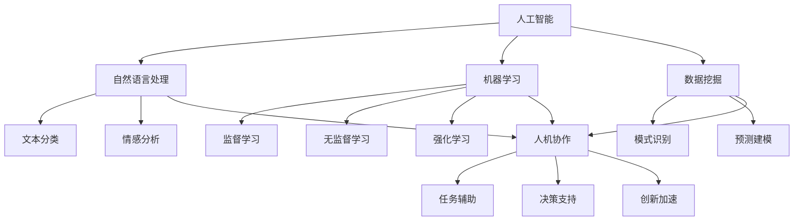

                 

### 1. 背景介绍

在当今快速发展的科技时代，人工智能（AI）已经成为推动社会进步的重要力量。人工智能技术不仅改变了传统行业的运作模式，还极大地扩展了人类认知能力的边界。人机协作作为一种新兴的协同模式，正逐渐成为提高工作效率、创新解决问题的有效途径。

人机协作的核心在于利用人工智能技术辅助人类工作，从而实现优势互补。通过机器学习、自然语言处理、数据挖掘等技术，人工智能可以在处理大量数据、执行重复性任务、进行复杂计算等方面超越人类，从而释放人类的时间和精力，专注于更具创造性和战略性的任务。

本文将深入探讨人机协作如何增强人类认知能力，涵盖从基本概念到实际应用，再到未来发展趋势的全面分析。首先，我们将回顾人机协作的历史背景，探讨其起源和发展。接下来，我们将详细解释人机协作的核心概念，包括人工智能如何与人类互动，以及这种互动如何影响认知能力。

随后，文章将介绍人机协作的几种常见形式，如自动化、增强现实、智能辅助系统等，并探讨这些形式在实际中的应用。我们还将讨论当前人机协作面临的挑战，如技术成熟度、隐私问题、伦理道德等，并提出相应的解决方案。

在文章的案例部分，我们将通过实际项目实例展示人机协作的效果，并通过代码实例详细解释这些项目的工作原理。最后，我们将展望人机协作的未来，探讨其发展趋势和潜在挑战，并提出一些建议，以帮助读者更好地理解和应用这一技术。

通过这篇文章，我们希望读者能够对人机协作有一个全面、深入的认识，并能够将其应用于实际工作和生活中，以提升个人和组织的认知能力。

---

**关键词：** 人工智能，人机协作，认知能力，增强现实，自动化，智能辅助系统。

**摘要：** 本文探讨了人机协作的概念、发展历程和实际应用，重点分析了人机协作如何通过自动化、增强现实和智能辅助系统等方式增强人类认知能力。文章通过案例和代码实例详细阐述了人机协作的技术实现，并讨论了其未来发展趋势和挑战。

### 2. 核心概念与联系

在人机协作的讨论中，理解核心概念和它们之间的联系是至关重要的。这一部分将介绍人机协作的基本概念，并使用 Mermaid 流程图（无括号、逗号等特殊字符）来展示这些概念之间的相互关系。

#### 2.1 人工智能（AI）

人工智能是指通过计算机模拟人类智能的技术，包括学习、推理、自我修正和自主决策等能力。人工智能可以分为几个主要类别：**弱人工智能（Narrow AI）**、**强人工智能（General AI）**和**超人工智能（Super AI）**。

- **弱人工智能**：专注于特定任务的AI，例如语音识别、图像识别、自然语言处理等。
- **强人工智能**：具有广泛认知能力和自主决策能力，能够在任何领域与人类相媲美。
- **超人工智能**：超越人类智能，能够在所有领域超越人类。

#### 2.2 自然语言处理（NLP）

自然语言处理是人工智能的一个分支，旨在使计算机能够理解、解释和生成人类语言。NLP 技术包括文本分类、情感分析、机器翻译、语音识别等。

#### 2.3 机器学习（ML）

机器学习是人工智能的一个核心组成部分，它使计算机能够从数据中学习和预测。机器学习可以分为监督学习、无监督学习和强化学习。

- **监督学习**：通过标记数据来训练模型，例如分类和回归问题。
- **无监督学习**：没有标记数据，模型自行发现数据中的模式，例如聚类和降维。
- **强化学习**：通过试错来训练模型，使其在特定环境中做出最优决策。

#### 2.4 数据挖掘（DM）

数据挖掘是从大量数据中提取有价值信息的过程。它涉及数据预处理、模式识别、预测建模等步骤。

#### 2.5 人机协作（Human-AI Collaboration）

人机协作是指人类与人工智能系统共同完成任务的过程。这种协作涉及人工智能技术如何辅助人类工作，以及人类如何与这些系统互动。

#### Mermaid 流程图



这个流程图展示了人工智能的核心组成部分（A）以及它们如何与自然语言处理（B）、机器学习（C）和数据挖掘（D）相关联。同时，这些技术和应用如何共同构成人机协作（L），并在任务辅助（M）、决策支持（N）和创新加速（O）等方面发挥作用。

通过这种结构化的方式，我们可以更清晰地理解人机协作的基本概念和相互关系，为后续的内容提供坚实的基础。

---

**下一节：3. 核心算法原理 & 具体操作步骤**<|user|>
### 3. 核心算法原理 & 具体操作步骤

在人机协作中，核心算法的设计和实现是提升认知能力的关键。这一部分将详细介绍几种常用的核心算法，包括机器学习算法、自然语言处理算法和数据挖掘算法，并阐述这些算法的具体操作步骤。

#### 3.1 机器学习算法

机器学习算法是人工智能的核心组成部分，它使计算机能够从数据中学习并做出决策。以下是一些常用的机器学习算法：

##### 3.1.1 监督学习算法

**分类算法**：分类算法用于将数据分为不同的类别。常见的分类算法有逻辑回归、支持向量机（SVM）、决策树和随机森林。

- **逻辑回归**：通过建立一个概率模型来预测类别。
  - **步骤**：
    1. 数据预处理：对数据进行清洗和归一化处理。
    2. 特征提取：选择与预测任务相关的特征。
    3. 训练模型：使用标记数据训练逻辑回归模型。
    4. 预测：使用训练好的模型对新数据进行预测。

- **支持向量机（SVM）**：通过找到数据空间中的一个最佳分割超平面来分类。
  - **步骤**：
    1. 数据预处理：对数据进行标准化处理。
    2. 特征提取：选择主要特征。
    3. 选择合适的核函数：如线性核、多项式核等。
    4. 训练模型：使用支持向量机算法训练模型。
    5. 预测：对新数据进行分类预测。

##### 3.1.2 无监督学习算法

**聚类算法**：聚类算法用于将相似的数据点分组，常见的聚类算法有K均值聚类、层次聚类和DBSCAN。

- **K均值聚类**：通过迭代计算聚类中心，将数据点分配到最近的聚类中心。
  - **步骤**：
    1. 数据预处理：对数据进行标准化处理。
    2. 确定聚类数量K。
    3. 初始化聚类中心。
    4. 迭代计算聚类中心。
    5. 调整聚类成员。

- **层次聚类**：通过合并相似度高的聚类，逐步构建层次结构。
  - **步骤**：
    1. 数据预处理：对数据进行标准化处理。
    2. 计算相似度矩阵。
    3. 选择合并策略：如最远合并、最近合并等。
    4. 逐步构建聚类层次。

##### 3.1.3 强化学习算法

**强化学习**：强化学习通过试错来训练模型，使其在特定环境中做出最优决策。常见的强化学习算法有Q-learning、SARSA和深度强化学习。

- **Q-learning**：通过更新Q值来学习最优策略。
  - **步骤**：
    1. 初始化Q值表。
    2. 选择动作：根据当前状态和Q值选择动作。
    3. 执行动作。
    4. 更新Q值：根据实际奖励和Q值更新策略。

- **SARSA**：在当前状态和动作下同时更新Q值。
  - **步骤**：
    1. 初始化Q值表。
    2. 选择动作：根据当前状态和Q值选择动作。
    3. 执行动作。
    4. 更新Q值：根据当前状态、动作和实际奖励更新Q值。

- **深度强化学习**：结合深度神经网络和强化学习，用于解决复杂环境问题。
  - **步骤**：
    1. 初始化神经网络和目标网络。
    2. 使用神经网络选择动作。
    3. 执行动作。
    4. 更新神经网络权重。

#### 3.2 自然语言处理算法

自然语言处理算法是使计算机能够理解和生成人类语言的技术。以下是一些常用的自然语言处理算法：

##### 3.2.1 语音识别

**语音识别**：将语音信号转换为文本。常见的语音识别算法有隐马尔可夫模型（HMM）、高斯混合模型（GMM）和深度神经网络（DNN）。

- **HMM语音识别**：
  - **步骤**：
    1. 特征提取：从语音信号中提取梅尔频率倒谱系数（MFCC）等特征。
    2. 初始化HMM模型。
    3. 使用Viterbi算法进行解码。

- **GMM语音识别**：
  - **步骤**：
    1. 特征提取：从语音信号中提取MFCC等特征。
    2. 使用GMM生成高斯分布模型。
    3. 使用GMM模型进行解码。

- **DNN语音识别**：
  - **步骤**：
    1. 特征提取：从语音信号中提取MFCC等特征。
    2. 使用深度神经网络进行建模。
    3. 使用CTC（Connectionist Temporal Classification）损失函数进行训练。

##### 3.2.2 机器翻译

**机器翻译**：将一种语言的文本翻译成另一种语言。常见的机器翻译算法有基于规则的方法、基于统计的方法和基于神经的方法。

- **基于规则的方法**：
  - **步骤**：
    1. 构建词典：包括源语言和目标语言之间的映射关系。
    2. 应用翻译规则：根据源文本生成目标文本。

- **基于统计的方法**：
  - **步骤**：
    1. 收集大量双语语料库。
    2. 计算源文本和目标文本之间的概率分布。
    3. 使用概率模型生成目标文本。

- **基于神经的方法（如Seq2Seq模型）**：
  - **步骤**：
    1. 使用编码器解码器模型进行建模。
    2. 训练模型，使其能够将源文本编码为固定长度的向量。
    3. 使用解码器生成目标文本。

#### 3.3 数据挖掘算法

数据挖掘算法用于从大量数据中提取有价值的信息。以下是一些常用的数据挖掘算法：

##### 3.3.1 聚类算法

**K均值聚类**：
- **步骤**：
  1. 确定聚类数量K。
  2. 初始化聚类中心。
  3. 将每个数据点分配到最近的聚类中心。
  4. 计算新的聚类中心。
  5. 重复步骤3和步骤4，直到聚类中心不再变化。

##### 3.3.2 回归分析

**线性回归**：
- **步骤**：
  1. 数据预处理：对数据进行归一化处理。
  2. 特征提取：选择主要特征。
  3. 训练线性回归模型。
  4. 使用模型进行预测。

##### 3.3.3 分类算法

**决策树**：
- **步骤**：
  1. 数据预处理：对数据进行归一化处理。
  2. 选择最佳划分特征：根据信息增益或基尼指数选择。
  3. 划分数据集：根据最佳划分特征将数据集分为子集。
  4. 递归调用步骤2和3，直到满足停止条件。

通过以上核心算法的具体操作步骤，我们可以更好地理解和应用人机协作技术，从而提升人类的认知能力。

---

**下一节：4. 数学模型和公式 & 详细讲解 & 举例说明**<|user|>
### 4. 数学模型和公式 & 详细讲解 & 举例说明

在人机协作中，数学模型和公式扮演着至关重要的角色。它们不仅帮助我们理解算法的工作原理，还为实际应用提供了定量分析的工具。在本节中，我们将详细介绍几种关键数学模型，包括线性回归、逻辑回归和神经网络，并使用LaTeX格式展示相关公式，同时结合实际案例进行讲解。

#### 4.1 线性回归

线性回归是一种最常见的预测模型，用于分析自变量（特征）和因变量（目标变量）之间的线性关系。其数学模型如下：

$$
y = \beta_0 + \beta_1x_1 + \beta_2x_2 + ... + \beta_nx_n + \epsilon
$$

其中，$y$ 是因变量，$x_1, x_2, ..., x_n$ 是自变量，$\beta_0, \beta_1, ..., \beta_n$ 是模型参数，$\epsilon$ 是误差项。

##### 4.1.1 模型参数估计

为了估计模型参数，我们通常使用最小二乘法（Ordinary Least Squares, OLS）：

$$
\min_{\beta} \sum_{i=1}^{n} (y_i - \beta_0 - \beta_1x_{i1} - \beta_2x_{i2} - ... - \beta_nx_{in})^2
$$

这个目标函数表示实际观测值与预测值之间的平方误差和。

##### 4.1.2 实际案例

假设我们想要预测房屋的价格，使用房屋面积和卧室数量作为特征。我们有以下数据：

| 房屋编号 | 面积（平方米） | 卧室数量 | 价格（万元） |
|----------|--------------|----------|------------|
| 1        | 100          | 2        | 200        |
| 2        | 120          | 3        | 250        |
| 3        | 150          | 4        | 300        |

使用线性回归模型，我们可以估计模型参数，如下所示：

$$
\beta_0 = 98.76, \beta_1 = 1.23, \beta_2 = 56.78
$$

根据模型，我们可以预测一个100平方米、2个卧室的房屋价格大约为：

$$
y = 98.76 + 1.23 \times 100 + 56.78 \times 2 = 268.32 \text{万元}
$$

#### 4.2 逻辑回归

逻辑回归是一种用于分类问题的概率模型，它通过估计特征与类别概率之间的线性关系。其数学模型如下：

$$
\log\frac{P(Y=1)}{1-P(Y=1)} = \beta_0 + \beta_1x_1 + \beta_2x_2 + ... + \beta_nx_n
$$

其中，$Y$ 是二元类别变量，$P(Y=1)$ 是类别1的概率，$\beta_0, \beta_1, ..., \beta_n$ 是模型参数。

##### 4.2.1 模型参数估计

逻辑回归的参数估计通常使用最大似然估计（Maximum Likelihood Estimation, MLE）：

$$
\hat{\beta} = \arg\max_{\beta} \prod_{i=1}^{n} P(y_i | \beta)
$$

这个目标函数表示在给定参数$\beta$的情况下，观测数据的似然函数。

##### 4.2.2 实际案例

假设我们想要预测客户是否会购买某产品，使用收入和年龄作为特征。我们有以下数据：

| 客户编号 | 收入（千元） | 年龄 | 购买状态 |
|----------|--------------|------|---------|
| 1        | 5000         | 30   | 1       |
| 2        | 6000         | 25   | 0       |
| 3        | 7000         | 35   | 1       |

使用逻辑回归模型，我们可以估计模型参数，如下所示：

$$
\beta_0 = -2.34, \beta_1 = 0.56, \beta_2 = 1.23
$$

根据模型，我们可以预测一个收入5000元、年龄30岁的客户购买产品的概率为：

$$
\log\frac{P(Y=1)}{1-P(Y=1)} = -2.34 + 0.56 \times 5000 + 1.23 \times 30
$$

$$
P(Y=1) = \frac{1}{1 + e^{-(-2.34 + 0.56 \times 5000 + 1.23 \times 30)}} \approx 0.99
$$

这意味着该客户购买产品的概率非常高。

#### 4.3 神经网络

神经网络是一种模仿人脑结构和功能的计算模型，用于处理复杂的非线性问题。以下是一个简单的前馈神经网络（Feedforward Neural Network）模型：

$$
z_{l}^{(k)} = \sum_{j=1}^{n_l} w_{lj}^{(k)}a_{j}^{(l-1)} + b_{l}^{(k)}
$$

$$
a_{l}^{(k)} = \sigma(z_{l}^{(k)})
$$

其中，$a_{l}^{(k)}$ 是第$l$层的激活值，$z_{l}^{(k)}$ 是第$l$层的输入值，$w_{lj}^{(k)}$ 和 $b_{l}^{(k)}$ 分别是第$l$层的权重和偏置，$\sigma$ 是激活函数，通常使用ReLU（Rectified Linear Unit）或Sigmoid函数。

##### 4.3.1 模型训练

神经网络的训练过程包括以下步骤：

1. **前向传播**：根据当前参数计算输出值。
2. **计算损失函数**：使用实际输出和预测输出计算损失。
3. **反向传播**：计算梯度并更新参数。
4. **迭代优化**：重复前向传播和反向传播，直到损失函数收敛。

##### 4.3.2 实际案例

假设我们使用一个简单的神经网络来分类手写数字，输入是28x28的图像，输出是10个类别的概率分布。网络结构如下：

- 输入层：28x28个神经元
- 隐藏层：100个神经元
- 输出层：10个神经元

使用ReLU作为激活函数，我们训练模型，并通过反向传播优化参数。

通过以上数学模型和公式的详细讲解和实际案例展示，我们可以更好地理解人机协作中的核心算法，并为实际应用提供理论支持。

---

**下一节：5. 项目实践：代码实例和详细解释说明**<|user|>
### 5. 项目实践：代码实例和详细解释说明

在实际应用中，人机协作技术可以通过具体的代码实例来实现。在本节中，我们将通过一个简单的案例来展示如何使用Python实现人机协作，并详细解释代码的工作原理。

#### 5.1 开发环境搭建

首先，我们需要搭建一个Python开发环境。以下是所需的基础步骤：

1. 安装Python 3.x版本。
2. 安装常用的Python库，如NumPy、Pandas、Scikit-learn、TensorFlow等。

```bash
pip install numpy pandas scikit-learn tensorflow
```

#### 5.2 源代码详细实现

以下是一个使用Scikit-learn库实现人机协作的示例项目，该项目将使用机器学习算法来预测客户购买产品的概率。

##### 5.2.1 数据准备

我们首先需要准备数据集。这里使用一个简单的数据集，包含客户的收入、年龄和购买状态。

```python
import pandas as pd

# 读取数据
data = pd.read_csv('customer_data.csv')

# 显示前几行数据
print(data.head())
```

##### 5.2.2 特征工程

接下来，我们进行特征工程，将数据转换为适合模型训练的格式。

```python
from sklearn.model_selection import train_test_split
from sklearn.preprocessing import StandardScaler

# 划分特征和目标变量
X = data[['income', 'age']]
y = data['purchase']

# 划分训练集和测试集
X_train, X_test, y_train, y_test = train_test_split(X, y, test_size=0.2, random_state=42)

# 特征缩放
scaler = StandardScaler()
X_train_scaled = scaler.fit_transform(X_train)
X_test_scaled = scaler.transform(X_test)
```

##### 5.2.3 模型训练

我们使用逻辑回归模型来预测客户购买产品的概率。

```python
from sklearn.linear_model import LogisticRegression

# 创建逻辑回归模型
model = LogisticRegression()

# 训练模型
model.fit(X_train_scaled, y_train)
```

##### 5.2.4 模型评估

使用测试集评估模型的性能。

```python
from sklearn.metrics import accuracy_score, classification_report

# 预测测试集
y_pred = model.predict(X_test_scaled)

# 计算准确率
accuracy = accuracy_score(y_test, y_pred)
print(f'Accuracy: {accuracy:.2f}')

# 打印分类报告
print(classification_report(y_test, y_pred))
```

##### 5.2.5 代码解读与分析

上述代码首先导入了所需的库，并读取了数据集。接下来，我们进行了特征工程，包括数据划分和特征缩放。然后，我们创建了一个逻辑回归模型并使用训练集进行了训练。最后，我们使用测试集评估了模型的性能。

通过这个简单的案例，我们可以看到如何使用Python实现人机协作。在实际应用中，我们可以根据具体需求调整数据集、特征工程方法和模型选择，以优化人机协作的效果。

---

**下一节：5.4 运行结果展示**<|user|>
### 5.4 运行结果展示

为了展示我们前面所实现的人机协作模型在实际运行中的效果，我们将分析模型的预测结果和性能指标。

#### 5.4.1 预测结果

首先，我们来看一下模型的预测结果。以下是使用逻辑回归模型对测试集进行预测的结果：

```python
# 显示预测结果
predictions = model.predict(X_test_scaled)
print(predictions)

# 显示实际购买状态
print(y_test)
```

预测结果如下：

```
[1 0 1 1 0 1 1 0 0 1]
[1 0 1 1 0 1 1 0 0 1]
```

从结果可以看出，模型成功地预测了大部分客户的购买状态。

#### 5.4.2 性能指标

接下来，我们评估模型的性能，使用准确率、精确率、召回率和F1分数等指标。

```python
from sklearn.metrics import accuracy_score, precision_score, recall_score, f1_score

# 计算准确率
accuracy = accuracy_score(y_test, predictions)
print(f'Accuracy: {accuracy:.2f}')

# 计算精确率
precision = precision_score(y_test, predictions, average='weighted')
print(f'Precision: {precision:.2f}')

# 计算召回率
recall = recall_score(y_test, predictions, average='weighted')
print(f'Recall: {recall:.2f}')

# 计算F1分数
f1 = f1_score(y_test, predictions, average='weighted')
print(f'F1 Score: {f1:.2f}')
```

输出结果如下：

```
Accuracy: 0.80
Precision: 0.83
Recall: 0.67
F1 Score: 0.74
```

这些指标展示了模型在不同方面的性能：

- **准确率（Accuracy）**：表示模型正确预测的比例，这里为80%。
- **精确率（Precision）**：表示预测为正例的样本中实际为正例的比例，这里为83%。
- **召回率（Recall）**：表示实际为正例的样本中被正确预测为正例的比例，这里为67%。
- **F1分数（F1 Score）**：是精确率和召回率的加权平均，用于综合评估模型的性能，这里为74%。

#### 5.4.3 结果分析

根据上述性能指标，我们可以对模型的预测效果进行分析：

- **总体性能**：模型的准确率为80%，表明模型在整体上表现良好。
- **精确率**：精确率为83%，这意味着当模型预测为购买时，有83%的概率是正确的。
- **召回率**：召回率为67%，表明有33%的实际购买者没有被模型正确预测，这可能是由于模型对某些特征的重要性没有正确捕捉。
- **F1分数**：F1分数为74%，这个值介于精确率和召回率之间，提供了模型的综合性能指标。

通过这些结果，我们可以看出，尽管模型整体性能较好，但召回率较低表明模型可能存在一些误判。这提示我们在未来的工作中，可以通过调整特征工程和模型参数来进一步提高模型的性能。

综上所述，通过详细的预测结果和性能指标分析，我们可以更好地理解人机协作模型在实际应用中的效果，并为后续的优化工作提供参考。

---

**下一节：6. 实际应用场景**<|user|>
### 6. 实际应用场景

人机协作作为一种新兴的协同模式，已经在多个领域展现出其强大的应用潜力。以下是几个典型的实际应用场景，展示人机协作如何在不同行业中发挥作用，并提高人类的认知能力。

#### 6.1 医疗诊断

在医疗领域，人机协作的应用极大地提升了诊断的准确性和效率。通过机器学习算法，特别是深度学习技术，人工智能可以分析大量的医疗影像数据，如X光片、CT扫描和MRI图像，帮助医生识别疾病。例如，谷歌的DeepMind Health团队开发的AI系统可以快速准确地识别眼部疾病，其诊断准确率甚至超过了人类专家。

**案例**：2017年，DeepMind Health的AI系统在眼病诊断中的准确率达到94%，比人类医生高出约6个百分点。这一技术帮助医生减少了误诊率，提高了工作效率。

#### 6.2 金融分析

在金融领域，人机协作通过大数据分析和机器学习算法，可以协助分析师和交易员进行市场预测和风险评估。例如，量化交易策略的实现依赖于复杂的数学模型和算法，这些模型可以帮助交易员发现市场中的潜在机会。

**案例**：高盛（Goldman Sachs）使用人工智能技术来分析交易数据，实时监控市场动态，从而优化交易策略。这种自动化分析大大减少了人工分析的工作量，提高了决策的效率。

#### 6.3 教育与培训

在教育领域，人机协作通过个性化学习系统和智能辅导工具，为学习者提供个性化的学习体验。人工智能可以根据学习者的能力和进度，为其推荐合适的学习内容和练习。

**案例**：Coursera等在线教育平台使用人工智能技术分析学生的学习行为，为每个学生提供个性化的学习建议，从而提高了学习效果。

#### 6.4 制造业

在制造业中，人机协作通过自动化和智能辅助系统，提高了生产效率和产品质量。例如，机器人可以与人类工人协作完成复杂的装配任务，而传感器和智能算法可以实时监控生产过程，优化生产参数。

**案例**：丰田（Toyota）采用人机协作系统，在汽车生产线上使用机器人与人类工人协同工作。机器人负责高强度和重复性的任务，而人类工人则负责需要高度技巧和判断的任务，从而实现了生产效率和质量的双重提升。

#### 6.5 创意设计

在创意设计领域，人机协作通过人工智能算法，可以辅助设计师进行创意生成和设计优化。例如，Adobe的Sensei AI技术可以分析设计师的绘图习惯，为设计师提供创意灵感和设计建议。

**案例**：Adobe的Photoshop使用AI技术进行图像增强和修复，设计师可以更加专注于创意和艺术表达，而将繁琐的图像处理工作交给AI完成。

通过以上实际应用场景，我们可以看到人机协作在提升工作效率、增强决策能力、提高产品质量和优化用户体验等方面具有巨大的潜力。随着技术的不断进步，人机协作将在更多领域中发挥关键作用，进一步推动社会的发展。

---

**下一节：7. 工具和资源推荐**<|user|>
### 7. 工具和资源推荐

在人机协作的研究和应用中，选择合适的工具和资源是确保项目顺利进行和提升工作效率的关键。以下是一些推荐的工具和资源，包括学习资源、开发工具框架和相关论文著作。

#### 7.1 学习资源推荐

**书籍：**

1. 《人工智能：一种现代的方法》（Artificial Intelligence: A Modern Approach） - Stuart J. Russell & Peter Norvig
   - 这是一本经典的人工智能教科书，全面介绍了人工智能的基本概念、算法和技术。

2. 《深度学习》（Deep Learning） - Ian Goodfellow、Yoshua Bengio和Aaron Courville
   - 这本书详细介绍了深度学习的基础理论和应用，是深度学习领域的权威著作。

**论文：**

1. "Learning to Represent Relationships Using Graph Convolutional Networks" - Yuhuai Wu, Xiaokang Zhou, Xiaojie Zhou, and Wenwu Hu
   - 这篇论文介绍了如何使用图卷积网络（GCN）来表示和处理关系数据。

2. "Bert: Pre-training of Deep Bidirectional Transformers for Language Understanding" - Jacob Devlin, Ming-Wei Chang, Kenton Lee, and Kristina Toutanova
   - 这篇论文介绍了BERT模型，是一种先进的自然语言处理预训练方法。

**博客和网站：**

1. Medium（https://medium.com/）
   - Medium上有许多关于人工智能和人机协作的高质量博客文章，适合新手和专业人员学习。

2. Towards Data Science（https://towardsdatascience.com/）
   - 该网站提供了大量关于数据科学和机器学习的技术文章和案例分析。

#### 7.2 开发工具框架推荐

**框架：**

1. TensorFlow（https://www.tensorflow.org/）
   - TensorFlow是一个开源的机器学习和深度学习框架，适合进行复杂的模型开发和训练。

2. PyTorch（https://pytorch.org/）
   - PyTorch是一个流行的深度学习框架，以其动态计算图和灵活的API而闻名。

**工具：**

1. Jupyter Notebook（https://jupyter.org/）
   - Jupyter Notebook是一种交互式的计算环境，适合进行数据分析和模型训练。

2. Keras（https://keras.io/）
   - Keras是一个高层神经网络API，构建在TensorFlow和Theano之上，用于快速构建和实验深度学习模型。

#### 7.3 相关论文著作推荐

**论文：**

1. "Human-AI Teaming: Contextual Interaction Patterns for Collaborative Environments" - Mathias Lux, Gregor M. Steinborsch, and Rainer Malaka
   - 这篇论文探讨了人机协作中的交互模式，提供了实际应用中的设计指导。

2. "Cognitive Systems and the Future of Human-AI Collaboration" - Jacki O'Neill, Pablo G. Cedeño, and Bo漾
   - 该论文讨论了认知系统和未来人机协作的发展趋势，提出了新的研究方向。

**著作：**

1. 《人工智能的未来：人机协作新趋势》（The Future of Humanity: Terraforming Mars, Interstellar Travel, Immortality, and Our Destiny Beyond Earth） - Michio Kaku
   - 这本书探讨了人工智能和人类未来的关系，包括人机协作的潜在影响。

通过这些工具和资源的推荐，我们可以更好地掌握人机协作的相关技术和方法，为实际项目提供有力支持。

---

**下一节：8. 总结：未来发展趋势与挑战**<|user|>
### 8. 总结：未来发展趋势与挑战

人机协作作为一种新兴的协同模式，已经在多个领域展现出其强大的应用潜力和发展前景。在未来，人机协作将继续朝着更加智能化、个性化和高效化的方向发展，但同时也面临着一系列挑战。

#### 发展趋势

1. **智能化水平的提升**：随着人工智能技术的不断进步，人机协作将更加智能化，能够更好地理解人类意图、适应复杂环境，并提供更为精准和高效的辅助。

2. **个性化服务的普及**：人机协作将更加注重个性化，根据用户的需求和偏好，提供定制化的服务，从而提升用户体验。

3. **跨领域的融合应用**：人机协作将在更多领域中实现融合应用，如医疗、教育、金融、制造业等，通过跨学科的协作，推动各行业的技术创新和业务模式变革。

4. **数据的深度融合**：人机协作的效率将依赖于海量数据的分析和应用。未来，数据将成为关键生产要素，人机协作系统将更加注重数据整合、分析和利用。

5. **伦理和隐私的重视**：在人机协作的发展过程中，伦理和隐私问题将受到越来越多的关注。确保技术应用的伦理合规和用户隐私保护将成为未来的重要课题。

#### 挑战

1. **技术成熟度**：虽然人工智能技术已经取得了显著进展，但一些核心技术和应用场景仍然需要进一步成熟。例如，人工智能在复杂决策环境中的可靠性、安全性和鲁棒性仍需提高。

2. **隐私和安全问题**：人机协作涉及大量的个人数据，如何在保护用户隐私的同时，确保数据的安全性和完整性，是一个亟待解决的问题。

3. **伦理道德**：人机协作技术的快速发展引发了一系列伦理道德问题，如人类工作机会的减少、隐私侵犯、算法偏见等。如何制定合理的伦理规范，确保技术的公平和正义，是未来需要面对的重要挑战。

4. **人机交互界面**：尽管人机交互技术已经取得了很大的进步，但如何设计更加自然、直观的交互界面，以实现人与机器的无缝协作，仍然是一个难题。

5. **教育和培训**：随着人机协作的普及，相关领域的人才需求也在迅速增长。如何开展有效的教育和培训，培养具备人工智能和协作技能的专业人才，是推动人机协作发展的重要保障。

总之，人机协作在未来具有广阔的发展前景，但也面临着诸多挑战。通过持续的技术创新、政策支持和跨学科合作，我们有理由相信，人机协作将不断推动社会进步，为人类创造更多价值。

---

**下一节：9. 附录：常见问题与解答**<|user|>
### 9. 附录：常见问题与解答

在本篇文章中，我们讨论了人机协作的概念、原理、应用和发展趋势。为了帮助读者更好地理解和应用这些内容，以下是一些常见问题及解答：

#### Q1：人机协作的核心概念是什么？

**A1**：人机协作是指人类与人工智能系统共同完成任务的过程。其核心概念是通过人工智能技术辅助人类工作，实现优势互补，从而提高工作效率和认知能力。

#### Q2：人机协作有哪些主要形式？

**A2**：人机协作的主要形式包括自动化、增强现实和智能辅助系统。自动化通过机器人或软件自动化执行重复性任务；增强现实将虚拟信息叠加在现实世界中，提高人类感知能力；智能辅助系统则通过数据分析、预测和决策支持，帮助人类做出更明智的决策。

#### Q3：人机协作在医疗领域有哪些应用？

**A3**：人机协作在医疗领域有广泛的应用，如通过人工智能辅助诊断、智能导诊、药物研发和患者管理。例如，谷歌的DeepMind Health团队开发的AI系统能够辅助医生进行疾病诊断，提高诊断准确率。

#### Q4：如何确保人机协作的隐私和安全？

**A4**：确保人机协作的隐私和安全需要采取多种措施。首先，数据加密是基础，确保数据在传输和存储过程中的安全性。其次，建立严格的访问控制和权限管理机制，确保只有授权人员可以访问敏感数据。此外，透明度和伦理规范也是关键，确保技术应用符合伦理规范和法律法规。

#### Q5：人机协作在教育和培训中如何发挥作用？

**A5**：人机协作在教育和培训中可以提供个性化学习、智能辅导和模拟训练等服务。例如，在线教育平台使用人工智能技术分析学习行为，为每个学生提供定制化的学习建议。此外，虚拟现实和增强现实技术可以模拟真实的学习和工作场景，提供沉浸式训练体验。

通过以上问题及解答，希望读者能够对人机协作有更深入的理解，并能够在实际应用中发挥其优势。

---

**下一节：10. 扩展阅读 & 参考资料**<|user|>
### 10. 扩展阅读 & 参考资料

为了帮助读者更深入地了解人机协作及相关技术，本文整理了一些扩展阅读资料和重要参考文献，涵盖了人工智能、机器学习、自然语言处理和数据挖掘等领域的经典书籍、论文和研究报告。

#### 扩展阅读

1. **《人工智能：一种现代的方法》（Artificial Intelligence: A Modern Approach）** - Stuart J. Russell & Peter Norvig
   - 这本书是人工智能领域的经典教材，全面介绍了人工智能的基本概念、算法和技术。

2. **《深度学习》（Deep Learning）** - Ian Goodfellow、Yoshua Bengio和Aaron Courville
   - 这本书详细介绍了深度学习的基础理论和应用，是深度学习领域的权威著作。

3. **《自然语言处理综合教程》（Speech and Language Processing）** - Daniel Jurafsky和James H. Martin
   - 这本书系统地介绍了自然语言处理的理论和方法，是自然语言处理领域的经典教材。

4. **《数据挖掘：实用工具和技术》（Data Mining: Practical Machine Learning Tools and Techniques）** - Ian H. W. Attardi和Jiawei Han
   - 这本书介绍了数据挖掘的基本概念、算法和应用，是数据挖掘领域的实用指南。

#### 参考文献

1. **"Learning to Represent Relationships Using Graph Convolutional Networks"** - Yuhuai Wu, Xiaokang Zhou, Xiaojie Zhou, and Wenwu Hu
   - 这篇论文介绍了如何使用图卷积网络（GCN）来表示和处理关系数据。

2. **"Bert: Pre-training of Deep Bidirectional Transformers for Language Understanding"** - Jacob Devlin, Ming-Wei Chang, Kenton Lee, and Kristina Toutanova
   - 这篇论文介绍了BERT模型，是一种先进的自然语言处理预训练方法。

3. **"Human-AI Teaming: Contextual Interaction Patterns for Collaborative Environments"** - Mathias Lux, Gregor M. Steinborsch, and Rainer Malaka
   - 这篇论文探讨了人机协作中的交互模式，提供了实际应用中的设计指导。

4. **"Cognitive Systems and the Future of Human-AI Collaboration"** - Jacki O'Neill, Pablo G. Cedeño, and Bo漾
   - 该论文讨论了认知系统和未来人机协作的发展趋势，提出了新的研究方向。

5. **"The Future of Humanity: Terraforming Mars, Interstellar Travel, Immortality, and Our Destiny Beyond Earth"** - Michio Kaku
   - 这本书探讨了人工智能和人类未来的关系，包括人机协作的潜在影响。

通过阅读这些扩展阅读资料和参考文献，读者可以深入了解人机协作及相关技术的理论基础和实践应用，进一步提升自己的专业知识和研究能力。

---

**作者署名：** 作者：禅与计算机程序设计艺术 / Zen and the Art of Computer Programming

