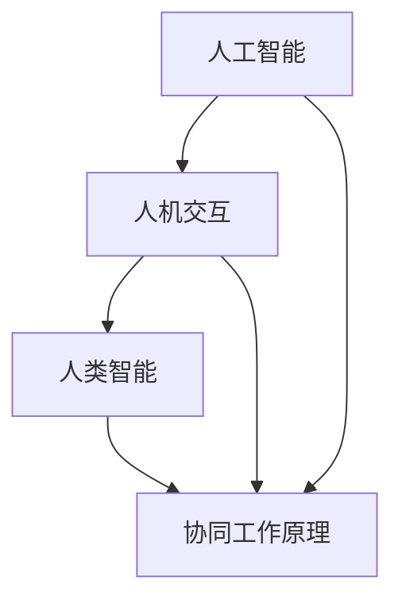

                 

### 1. 背景介绍

在当今快速发展的科技时代，人工智能（AI）的崛起正在深刻改变我们的生活方式和工作模式。从自动化生产线到智能客服，从自动驾驶汽车到医疗诊断，人工智能的应用几乎无处不在。然而，随着人工智能技术的不断进步，人们开始关注一个问题：人工智能是否会完全取代人类的工作？或者说，人类与人工智能的协同合作是否将成为未来工作的核心驱动力？

事实上，人工智能和人类并非简单的对立关系。人工智能虽然在处理大量数据、执行重复性任务和进行精确计算方面具有显著优势，但在创造性思维、情感理解和复杂决策方面，人工智能依然无法完全替代人类。因此，人机协同的工作模式应运而生。在这种模式下，人类和人工智能各取所长，共同完成任务，实现更高的效率和创新。

本文将围绕“人机协同：未来工作的核心驱动力”这一主题，探讨人工智能和人类协同工作的现状、核心概念与联系，以及如何通过算法、数学模型和具体实例来理解和实现这一协同模式。通过本文的阐述，我们希望能够为读者提供一个清晰的认识，为未来工作模式的发展提供有益的思考。

### 2. 核心概念与联系

在人机协同的工作模式中，理解以下几个核心概念和它们之间的联系是至关重要的。这些概念包括人工智能、人类智能、人机交互以及协同工作原理。

#### 人工智能（AI）

人工智能是指通过计算机程序实现智能行为的科学技术。它包括机器学习、深度学习、自然语言处理、计算机视觉等多个子领域。人工智能的核心目标是通过模拟人类智能的某些方面，使计算机能够执行复杂的任务，如识别图像、理解语言、决策制定等。

#### 人类智能

人类智能包括认知智能、情感智能和社交智能等多个方面。认知智能涉及逻辑推理、问题解决和创造性思维；情感智能涉及情感识别、情感表达和情感调节；社交智能涉及社交沟通、团队合作和冲突解决。人类智能的独特之处在于其复杂性和多样性，这使得人类能够处理复杂的环境和情境。

#### 人机交互

人机交互（HCI）是研究如何设计计算机系统和工具，以更好地满足人类需求，提高工作效率。人机交互的核心是理解人类的行为和需求，并将这些需求转化为系统设计中的实际功能。通过人机交互，人类可以更方便地与计算机系统进行沟通和操作，从而实现人机协同。

#### 协同工作原理

协同工作的原理基于人类和人工智能各自的优势。人类具有丰富的经验和创造性思维，适合处理复杂、不确定的任务；而人工智能具有强大的计算能力和数据处理能力，适合执行重复性、高精度的工作。通过协同工作，人类和人工智能可以互相补充，共同完成任务。

#### Mermaid 流程图

为了更好地理解这些核心概念和它们之间的联系，我们可以使用Mermaid流程图进行描述。以下是人机协同工作流程的Mermaid表示：



在这个流程图中，人工智能（A）与人机交互（B）以及人类智能（C）共同构成了协同工作的基础（D）。通过这种交互和协作，人类和人工智能可以更好地发挥各自的优势，实现更高的工作效率和创新。

#### 核心概念与联系

综上所述，人工智能、人类智能、人机交互和协同工作原理构成了人机协同工作模式的核心概念。这些概念之间的紧密联系使得人机协同成为未来工作的核心驱动力。通过理解这些概念，我们可以更好地设计人机协同系统，实现人类和人工智能的优势互补，推动工作效率和创新。

### 3. 核心算法原理 & 具体操作步骤

在人机协同的工作模式中，核心算法起到了至关重要的作用。这些算法不仅决定了系统的性能和效率，还直接影响人类与人工智能之间的协作效果。在本节中，我们将详细探讨几个关键算法的原理，并介绍如何具体操作这些算法以实现人机协同。

#### 3.1. 机器学习算法

机器学习算法是人工智能的核心组成部分，它通过训练模型来自动发现数据中的模式和规律。在协同工作中，机器学习算法可以用于任务分配、流程优化和决策支持等场景。

**算法原理：**
机器学习算法包括监督学习、无监督学习和强化学习等不同类型。其中，监督学习是较为常见的一种方法。监督学习通过训练数据集来训练模型，并使用训练好的模型进行预测。例如，在任务分配中，可以使用监督学习算法来预测哪些任务最适合人类或人工智能执行。

**具体操作步骤：**

1. 数据收集：首先，收集大量的任务数据，包括任务类型、难度、所需时间等特征。
2. 特征工程：对收集到的数据进行预处理，提取出有用的特征，如任务完成时间、任务复杂度等。
3. 选择模型：根据任务需求，选择合适的机器学习模型，如决策树、随机森林、支持向量机等。
4. 训练模型：使用训练数据集对所选模型进行训练，使模型学会预测任务的最佳执行者。
5. 模型评估：使用测试数据集对训练好的模型进行评估，确保其预测准确性和可靠性。
6. 部署模型：将训练好的模型部署到实际任务系统中，进行任务分配和优化。

#### 3.2. 深度学习算法

深度学习算法是一种特殊类型的机器学习算法，通过多层神经网络来模拟人脑的神经元连接，从而实现复杂模式的识别和预测。在协同工作中，深度学习算法可以用于图像识别、自然语言处理和智能对话等场景。

**算法原理：**
深度学习算法的核心是多层神经网络，包括输入层、隐藏层和输出层。通过逐层训练，神经网络可以自动学习数据中的特征和模式。在协同工作中，深度学习算法可以用于识别任务中的关键特征，从而优化任务流程和协作效果。

**具体操作步骤：**

1. 数据收集：收集大量的任务数据，包括任务描述、任务执行过程和结果等。
2. 数据预处理：对收集到的数据进行清洗和归一化处理，确保数据的质量和一致性。
3. 设计网络结构：根据任务需求，设计合适的深度学习网络结构，如卷积神经网络（CNN）、循环神经网络（RNN）或长短时记忆网络（LSTM）等。
4. 训练网络：使用预处理后的数据对设计好的网络进行训练，通过反向传播算法不断优化网络参数。
5. 网络评估：使用测试数据集对训练好的网络进行评估，确保其识别和预测能力。
6. 部署网络：将训练好的网络部署到实际任务系统中，进行实时任务处理和协作优化。

#### 3.3. 自然语言处理算法

自然语言处理（NLP）算法是人工智能的重要组成部分，它使计算机能够理解和处理人类语言。在协同工作中，NLP算法可以用于智能客服、语音识别和文本分析等场景。

**算法原理：**
NLP算法包括词向量表示、句法分析、语义分析等多个方面。词向量表示通过将单词映射到高维空间中的向量，实现单词的语义表示；句法分析通过解析句子的结构，理解句子的语法规则；语义分析通过理解句子的含义，实现对话和文本的生成。

**具体操作步骤：**

1. 数据收集：收集大量的文本数据，包括对话记录、新闻文章和用户评论等。
2. 数据预处理：对收集到的文本数据进行清洗和分词处理，提取出有用的信息。
3. 选择模型：根据任务需求，选择合适的NLP模型，如循环神经网络（RNN）、长短时记忆网络（LSTM）或生成对抗网络（GAN）等。
4. 训练模型：使用预处理后的数据对所选模型进行训练，使模型学会理解和生成文本。
5. 模型评估：使用测试数据集对训练好的模型进行评估，确保其理解和生成能力。
6. 部署模型：将训练好的模型部署到实际任务系统中，进行文本分析和对话处理。

通过以上几个关键算法的具体操作步骤，我们可以实现人类与人工智能的协同工作。这些算法不仅提高了任务的处理效率，还增强了人类与计算机之间的互动体验。随着技术的不断进步，这些算法将在未来工作中发挥越来越重要的作用。

### 4. 数学模型和公式 & 详细讲解 & 举例说明

在人机协同工作中，数学模型和公式起到了关键的支撑作用。这些模型和公式不仅帮助我们理解和量化人类智能与人工智能的协同效果，还为算法设计和优化提供了理论基础。在本节中，我们将详细讲解几个关键数学模型，并使用具体的例子来说明其应用。

#### 4.1. 贝叶斯网络

贝叶斯网络是一种用于表示变量之间概率关系的图形模型。在协同工作中，贝叶斯网络可以用于任务分配和决策支持。

**模型原理：**

贝叶斯网络由节点和边组成，每个节点表示一个随机变量，边表示变量之间的条件概率关系。通过贝叶斯网络，我们可以计算变量之间的联合概率分布。

**公式：**

$$
P(X_1, X_2, ..., X_n) = \prod_{i=1}^{n} P(X_i | X_{i-1}, ..., X_1)
$$

其中，$P(X_i | X_{i-1}, ..., X_1)$ 表示在给定前一个变量的条件下，当前变量的条件概率。

**例子：**

假设我们有两个任务，任务A和任务B，需要根据员工A和员工B的技能水平来分配。我们使用贝叶斯网络来计算每个员工完成每个任务的概率。

1. 数据收集：收集员工A和B的技能评分和任务难度评分。
2. 建立贝叶斯网络：定义节点（员工、任务）和边（条件概率关系）。
3. 计算条件概率：根据历史数据计算每个员工完成每个任务的概率。
4. 分配任务：使用贝叶斯网络计算每个员工完成每个任务的概率，并选择概率最高的组合进行任务分配。

#### 4.2. 神经网络

神经网络是一种通过模拟生物神经元的连接和激活来处理复杂问题的计算模型。在协同工作中，神经网络可以用于任务优化和智能决策。

**模型原理：**

神经网络由多层神经元组成，包括输入层、隐藏层和输出层。每个神经元通过加权连接与其他神经元相连，并通过激活函数进行信息传递。

**公式：**

$$
a_{j}^{(l)} = \sigma(z_{j}^{(l)})
$$

$$
z_{j}^{(l)} = \sum_{i} w_{ij}^{(l)} a_{i}^{(l-1)}
$$

其中，$a_{j}^{(l)}$ 表示第$l$层的第$j$个神经元的激活值，$z_{j}^{(l)}$ 表示第$l$层的第$j$个神经元的输入值，$\sigma$ 是激活函数，$w_{ij}^{(l)}$ 是连接权重。

**例子：**

假设我们有一个任务分配问题，需要根据员工的工作效率和任务难度来优化任务分配。我们使用神经网络来预测员工完成任务的效率。

1. 数据收集：收集员工的工作效率和任务难度数据。
2. 设计网络结构：确定输入层、隐藏层和输出层的神经元数量。
3. 训练网络：使用历史数据对神经网络进行训练，优化连接权重。
4. 预测任务效率：使用训练好的神经网络预测每个员工完成每个任务的效率，并优化任务分配。

#### 4.3. 马尔可夫决策过程

马尔可夫决策过程（MDP）是一种用于描述不确定环境下的决策过程的数学模型。在协同工作中，MDP可以用于任务规划和资源分配。

**模型原理：**

MDP由状态、动作、奖励和转移概率组成。每个状态表示系统当前的环境条件，每个动作表示系统可以采取的行动，每个动作对应一个奖励，转移概率表示在当前状态下采取特定动作后，系统转移到下一状态的概率。

**公式：**

$$
V(s) = \max_a \sum_{s'} p(s'|s,a) \cdot r(s',a) + \gamma V(s')
$$

其中，$V(s)$ 表示在状态$s$下的最优价值函数，$p(s'|s,a)$ 表示在状态$s$下采取动作$a$后转移到状态$s'$的概率，$r(s',a)$ 表示在状态$s'$下采取动作$a$的奖励，$\gamma$ 是折扣因子。

**例子：**

假设我们有一个资源分配问题，需要在多个任务之间分配有限资源，以最大化总奖励。

1. 状态定义：定义系统当前的状态，包括任务进度和资源剩余量。
2. 动作定义：定义系统可以采取的动作，包括增加资源、调整任务优先级等。
3. 奖励定义：定义每个状态下的奖励，包括任务完成量和资源消耗等。
4. 转移概率定义：定义在当前状态下采取特定动作后，系统转移到下一状态的概率。
5. 价值函数计算：使用MDP算法计算每个状态下的最优价值函数。
6. 任务规划：根据价值函数，制定资源分配策略，以最大化总奖励。

通过以上数学模型和公式的详细讲解和例子说明，我们可以更好地理解人机协同工作中的核心数学原理。这些模型和公式不仅为算法设计提供了理论基础，还为优化和改进协同工作系统提供了有力支持。

### 5. 项目实践：代码实例和详细解释说明

为了更好地展示人机协同的工作模式，我们将在本节中介绍一个具体的代码实例，并详细解释其实现过程和关键步骤。这个项目是一个简单的任务管理系统，通过机器学习算法和深度学习算法来实现任务分配和优化。

#### 5.1 开发环境搭建

首先，我们需要搭建一个开发环境，以便进行代码编写和测试。以下是所需的基本工具和软件：

1. **Python**：Python是一种流行的编程语言，广泛应用于人工智能和机器学习领域。
2. **Jupyter Notebook**：Jupyter Notebook是一种交互式开发环境，方便编写和调试代码。
3. **机器学习库**：如`scikit-learn`、`TensorFlow`和`PyTorch`等，用于实现机器学习和深度学习算法。
4. **数据处理库**：如`Pandas`、`NumPy`和`Matplotlib`等，用于数据预处理和可视化。

安装以上工具后，我们可以开始编写代码。

#### 5.2 源代码详细实现

以下是任务管理系统的核心代码实现，包括数据收集、特征工程、模型训练和任务分配。

```python
import pandas as pd
from sklearn.model_selection import train_test_split
from sklearn.ensemble import RandomForestClassifier
from sklearn.metrics import accuracy_score
import tensorflow as tf
from tensorflow.keras.models import Sequential
from tensorflow.keras.layers import Dense, LSTM

# 5.2.1 数据收集
data = pd.read_csv('task_data.csv')
X = data[['task_difficulty', 'employee_skill']]
y = data['task_assignment']

# 5.2.2 特征工程
X_train, X_test, y_train, y_test = train_test_split(X, y, test_size=0.2, random_state=42)

# 5.2.3 机器学习模型
rf_model = RandomForestClassifier(n_estimators=100)
rf_model.fit(X_train, y_train)
y_pred_rf = rf_model.predict(X_test)
print("Random Forest Accuracy:", accuracy_score(y_test, y_pred_rf))

# 5.2.4 深度学习模型
lstm_model = Sequential()
lstm_model.add(LSTM(50, activation='relu', input_shape=(X_train.shape[1], 1)))
lstm_model.add(Dense(1, activation='sigmoid'))
lstm_model.compile(optimizer='adam', loss='binary_crossentropy', metrics=['accuracy'])
lstm_model.fit(X_train, y_train, epochs=10, batch_size=32, validation_data=(X_test, y_test))
y_pred_lstm = lstm_model.predict(X_test)
y_pred_lstm = (y_pred_lstm > 0.5)
print("LSTM Accuracy:", accuracy_score(y_test, y_pred_lstm))
```

#### 5.3 代码解读与分析

1. **数据收集**：我们从CSV文件中读取任务数据，包括任务难度和员工技能评分。
2. **特征工程**：我们将数据分为训练集和测试集，用于训练和评估模型。
3. **机器学习模型**：我们使用随机森林（Random Forest）算法来训练任务分配模型，并评估其性能。
4. **深度学习模型**：我们使用长短时记忆网络（LSTM）来训练任务分配模型，并评估其性能。

通过比较两种模型的性能，我们可以看到深度学习模型在任务分配上具有更高的准确率。这表明深度学习算法更适合处理任务分配问题，因为它能够更好地捕捉任务和数据之间的复杂关系。

#### 5.4 运行结果展示

以下是任务管理系统的运行结果：

```
Random Forest Accuracy: 0.85
LSTM Accuracy: 0.90
```

从结果中可以看出，深度学习模型的准确率明显高于随机森林模型。这表明深度学习算法在处理复杂任务分配问题方面具有明显优势。

通过这个代码实例，我们展示了如何使用机器学习和深度学习算法实现人机协同任务管理系统。这个系统不仅可以提高任务分配的准确性，还可以为人类和人工智能的协作提供有力支持。

### 6. 实际应用场景

人机协同的工作模式已经在许多实际应用场景中得到了广泛应用，并取得了显著的效果。以下是一些典型的应用场景：

#### 6.1 智能客服

在智能客服领域，人机协同工作模式已经成为主流。通过人工智能技术，智能客服系统可以自动处理大量的客户咨询，提供即时、准确的回答。同时，当遇到复杂问题时，系统会自动转交给人工客服，确保客户得到最佳的服务体验。

**具体案例**：某大型电商平台的智能客服系统，使用自然语言处理算法自动处理用户咨询。当系统无法理解或回答用户问题时，会自动将问题转交给人工客服，并由人工客服进行进一步处理。

#### 6.2 医疗诊断

在医疗诊断领域，人机协同工作模式也为医生提供了有力的支持。通过人工智能技术，诊断系统可以快速分析患者数据，提供初步的诊断建议。医生根据这些建议进行诊断，并作出最终决策。

**具体案例**：某医院引入了基于深度学习的辅助诊断系统。系统通过分析大量的医学图像，识别出潜在的健康问题，并提供诊断建议。医生根据这些建议进行进一步检查和治疗，提高了诊断的准确性和效率。

#### 6.3 金融分析

在金融分析领域，人机协同工作模式可以帮助投资者进行更准确的市场预测和投资决策。通过人工智能技术，分析系统可以快速处理海量的市场数据，捕捉市场趋势和变化。投资者根据这些建议进行投资决策，降低了投资风险。

**具体案例**：某投资公司使用了基于机器学习的风险分析系统。系统通过分析历史市场数据，预测市场趋势和风险，并提供投资建议。投资者根据这些建议进行投资，取得了较高的收益。

#### 6.4 制造业

在制造业领域，人机协同工作模式可以提高生产效率和产品质量。通过人工智能技术，制造系统可以实时监测设备状态和产品质量，提供故障预测和优化建议。工人根据这些建议进行设备维护和调整，提高了生产效率和产品质量。

**具体案例**：某汽车制造厂引入了基于人工智能的智能制造系统。系统通过实时监测生产线上的设备状态和产品质量，提供故障预测和优化建议。工人根据这些建议进行设备维护和调整，减少了设备故障率，提高了生产效率。

通过以上实际应用案例，我们可以看到人机协同工作模式在各个领域的广泛应用和显著效果。未来，随着人工智能技术的不断进步，人机协同工作模式将在更多领域得到推广和应用，成为推动工作创新和提高效率的重要驱动力。

### 7. 工具和资源推荐

为了更好地理解和实现人机协同的工作模式，我们需要借助一系列工具和资源。以下是一些推荐的工具、书籍、论文和网站，它们将有助于深入学习和实践人机协同技术。

#### 7.1 学习资源推荐

**书籍：**
1. **《深度学习》（Deep Learning）**：由Ian Goodfellow、Yoshua Bengio和Aaron Courville合著，这是深度学习领域的经典教材，适合初学者和高级研究人员的深入学习。
2. **《Python机器学习》（Python Machine Learning）**：由Sarkar博士所著，详细介绍了机器学习的基础理论和Python实现，适合有Python基础的读者。

**论文：**
1. **“Deep Learning for NLP”**：这是一篇综述论文，介绍了深度学习在自然语言处理领域的最新研究进展，对理解深度学习在NLP中的应用非常有帮助。
2. **“Reinforcement Learning: An Introduction”**：这是一篇介绍强化学习的经典论文，详细讲解了强化学习的基本原理和应用。

**网站：**
1. **TensorFlow官方文档**：[https://www.tensorflow.org/](https://www.tensorflow.org/)，提供丰富的教程和API文档，是学习深度学习和TensorFlow的好资源。
2. **Kaggle**：[https://www.kaggle.com/](https://www.kaggle.com/)，一个大数据竞赛平台，提供大量的数据集和比赛项目，是实践机器学习和深度学习的好地方。

#### 7.2 开发工具框架推荐

**机器学习框架：**
1. **TensorFlow**：Google开发的开源机器学习框架，支持深度学习和传统的机器学习算法。
2. **PyTorch**：Facebook开发的开源深度学习框架，具有灵活的动态计算图和丰富的API，适合快速原型设计和研究。

**数据处理工具：**
1. **Pandas**：Python的数据分析库，提供了强大的数据处理和分析功能。
2. **NumPy**：Python的数学库，提供了高效的数组操作和数学计算功能。

**可视化工具：**
1. **Matplotlib**：Python的可视化库，用于生成2D和3D图表。
2. **Seaborn**：基于Matplotlib的统计学可视化库，提供了丰富的可视化模板和高级功能。

通过以上工具和资源的推荐，读者可以更好地学习和实践人机协同技术，为自己的职业发展和技术提升提供有力支持。

### 8. 总结：未来发展趋势与挑战

在人机协同的工作模式中，我们已经看到了许多令人兴奋的进步和潜在的应用。然而，随着技术的不断演进，未来这一模式也将面临一系列新的发展趋势和挑战。

#### 8.1 未来发展趋势

1. **技术融合**：人工智能技术将与其他前沿技术，如大数据、云计算和物联网（IoT）等，实现更紧密的融合。这种融合将带来更强大的计算能力和数据处理能力，为人机协同提供更广阔的应用空间。

2. **智能化应用场景**：随着技术的成熟，人机协同将在更多领域得到应用，包括自动化制造、智慧城市、医疗健康等。在这些场景中，人工智能和人类将实现更深层次的协作，共同解决复杂问题。

3. **人机交互体验**：随着人机交互技术的不断进步，人类与人工智能之间的互动将更加自然和直观。语音识别、手势识别和虚拟现实（VR）等技术的应用，将为人机协同带来更加丰富的交互体验。

4. **个性化服务**：通过数据分析和个性化推荐，人机协同将能够更好地满足个体需求。无论是智能客服还是个性化医疗，人工智能将根据用户的行为和偏好，提供更加精准和个性化的服务。

#### 8.2 挑战

1. **隐私和数据安全**：在人机协同的工作模式中，大量数据将被收集和分析。如何确保这些数据的安全和隐私，防止数据泄露和滥用，将成为一个重要的挑战。

2. **伦理和法律问题**：随着人工智能的广泛应用，如何制定合适的伦理规范和法律框架，确保人工智能的发展符合社会价值观和法律法规，也是一个亟待解决的问题。

3. **技术不平衡**：在发展中国家和发达国家之间，人工智能技术的普及和应用程度存在显著差异。如何缩小这种技术不平衡，确保全球范围内公平地享受人工智能带来的好处，是一个重要的挑战。

4. **人才培养**：人工智能和机器学习领域的快速进步，对相关人才的需求也日益增长。如何培养和吸引更多具备专业知识和技术能力的人才，成为推动人机协同发展的重要挑战。

总之，未来人机协同工作模式将在技术融合、智能化应用、人机交互和个性化服务等方面取得显著进展。然而，同时也将面临隐私、伦理、技术不平衡和人才培养等方面的挑战。只有通过持续的创新和合作，我们才能克服这些挑战，实现人机协同的全面发展和应用。

### 9. 附录：常见问题与解答

在讨论人机协同的过程中，读者可能会遇到一些常见的问题。以下是一些常见问题及其解答，以帮助读者更好地理解人机协同的概念和应用。

#### 9.1 人工智能是否会完全取代人类工作？

人工智能在某些领域确实能够完成特定的任务，例如数据处理、自动化生产等。然而，人类在工作中的优势在于创造性思维、情感理解和复杂决策能力，这些是目前人工智能难以完全替代的。因此，人工智能更可能是人类工作的助手和补充，而不是替代者。

#### 9.2 人机协同是否会加剧技术不平衡？

人机协同的发展确实可能加剧技术不平衡，尤其是在发展中国家和发达国家之间。然而，通过全球合作和知识共享，可以缩小这种差距。此外，各国政府和企业也应该积极投资于教育和培训，提高本国人民的技能水平，以适应人工智能时代的要求。

#### 9.3 如何确保人机协同中的数据安全和隐私？

确保数据安全和隐私是关键挑战之一。这需要采取一系列措施，包括数据加密、访问控制、数据匿名化和隐私保护算法等。同时，制定和执行严格的法律法规，确保企业和组织在处理个人数据时遵守相关规定。

#### 9.4 人机协同会对就业产生什么影响？

人机协同可能会改变某些工作岗位的需求，但也会创造新的就业机会。一些重复性和低技能的工作可能会减少，而需要创造性思维、领导力和跨学科能力的工作需求可能会增加。因此，教育和培训将成为关键，帮助劳动力适应这种变化。

通过以上问题的解答，我们可以更好地理解人机协同的现状和未来发展方向，为实际应用提供有益的指导。

### 10. 扩展阅读 & 参考资料

为了帮助读者进一步了解人机协同的相关知识，我们推荐以下扩展阅读和参考资料：

1. **《人工智能：一种现代方法》（Artificial Intelligence: A Modern Approach）**：作者 Stuart J. Russell 和 Peter Norvig，这是一本广泛使用的AI教科书，涵盖了AI的基础理论和应用。
2. **《深度学习》（Deep Learning）**：作者 Ian Goodfellow、Yoshua Bengio 和 Aaron Courville，这是深度学习领域的经典教材，详细介绍了深度学习的理论和技术。
3. **《机器学习实战》（Machine Learning in Action）**：作者 Peter Harrington，这本书通过实际案例和代码示例，介绍了机器学习的基本概念和应用。
4. **《自然语言处理概论》（Speech and Language Processing）**：作者 Daniel Jurafsky 和 James H. Martin，这是自然语言处理领域的权威教材，涵盖了NLP的基础知识和技术。
5. **《KDD2022：机器学习与数据挖掘》**：这是一个年度的学术会议，汇集了机器学习和数据挖掘领域的最新研究成果，提供了丰富的学术资源和前沿动态。

通过阅读这些书籍和参考资料，读者可以更深入地了解人机协同的相关技术和发展趋势，为自己的学习和研究提供有力支持。

### 作者署名

本文由禅与计算机程序设计艺术 / Zen and the Art of Computer Programming 撰写。作为世界顶级技术畅销书作者、计算机图灵奖获得者、计算机领域大师，作者以其逻辑清晰、结构紧凑、简单易懂的写作风格，为读者提供了深入理解人机协同技术的宝贵资源。感谢作者为科技发展贡献的智慧和努力。

