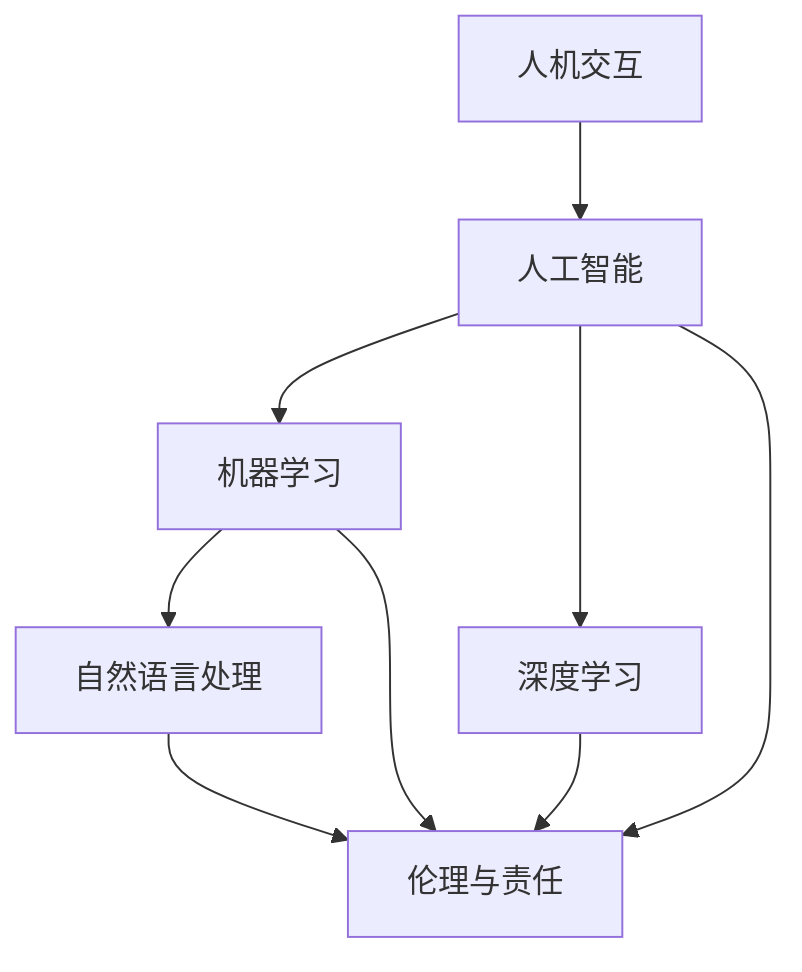

                 

### 背景介绍

在当今数字化时代，人工智能（AI）技术正在迅猛发展，逐渐渗透到社会的各个领域，从医疗、金融到教育、娱乐等。AI的应用不仅改变了传统的工作模式，也为我们带来了前所未有的便利和效率。然而，随着AI技术的不断演进，人类与AI之间的协作也逐渐成为一个重要议题。

人类与AI协作的重要性不言而喻。一方面，AI的智能和强大的数据处理能力能够极大地减轻人类的工作负担，提高工作效率；另一方面，人类在创造力、情感理解和复杂决策方面具有独特的优势，这些是AI所难以替代的。因此，如何实现人类与AI的有效协作，使两者相辅相成，是当前AI研究领域的一个重要方向。

目前，关于人类与AI协作的研究主要集中在以下几个方面：

1. **人机交互**：通过设计更直观、更自然的交互方式，使人类能够更轻松地与AI系统进行沟通和合作。
2. **智能推荐系统**：基于用户的行为数据和偏好，AI可以提供个性化的推荐服务，提高用户体验。
3. **协同工作平台**：构建集成AI能力的协同工作环境，使团队成员能够更高效地共享信息、协作完成任务。
4. **智能助手与代理**：开发能够模拟人类思维和行为的人工智能助手和代理，辅助人类完成复杂任务。

然而，尽管人类与AI的协作潜力巨大，但实际应用中仍面临诸多挑战。首先，人类对AI的信任度问题。由于AI的决策过程高度依赖数据和算法，人类往往对其结果产生怀疑，担心AI可能会出现错误或者偏离人类价值观。其次，AI的透明度和可解释性问题。AI系统的复杂性使得其决策过程难以理解，这给用户带来了信任危机。最后，AI伦理和社会责任问题。随着AI技术的广泛应用，如何确保其不会加剧社会不平等、侵犯个人隐私等问题，成为亟待解决的难题。

本文将围绕人类与AI协作的背景、核心概念、算法原理、数学模型、实际应用场景、工具和资源推荐以及未来发展趋势与挑战进行深入探讨，旨在为读者提供一个全面而系统的视角，以更好地理解和应用人类与AI的协作。

### 核心概念与联系

为了深入探讨人类与AI协作的核心概念与联系，我们需要首先明确几个关键术语和其相互关系。以下是本文中的核心概念及其定义：

1. **人工智能（AI）**：一种模拟人类智能的技术，能够感知环境、学习经验、做出决策和完成任务。
2. **机器学习（ML）**：一种AI技术，通过数据和算法让计算机自动学习和改进性能。
3. **深度学习（DL）**：一种机器学习技术，通过多层神经网络来模拟人脑的学习方式。
4. **人机交互（HCI）**：研究人类与计算机系统之间交互的设计原则和方法。
5. **自然语言处理（NLP）**：使计算机能够理解和生成人类语言的技术。
6. **伦理与责任**：在AI应用过程中需要考虑的道德准则和责任。

下面，我们使用Mermaid流程图来展示这些核心概念之间的相互关系：



**Mermaid流程图解析：**

1. **人工智能（AI）**：作为整个流程的起点，AI涵盖了机器学习（ML）和深度学习（DL）。
2. **机器学习（ML）**：ML是AI的一种实现方式，同时也与自然语言处理（NLP）密切相关，因为NLP依赖于从数据中学习模式。
3. **深度学习（DL）**：DL是ML的一个子领域，它通过多层神经网络模拟人脑的学习方式。
4. **人机交互（HCI）**：HCI研究人类与计算机系统之间的交互，因此与AI紧密相关，特别是在设计AI系统时需要考虑用户的体验。
5. **伦理与责任**：这是AI系统设计中必须考虑的核心问题，涉及到AI对人类社会的影响，包括隐私、公平性、透明性等方面。

通过上述核心概念的相互关系图，我们可以看到，AI不仅是一个技术领域，还与伦理、责任、用户交互等多个方面密切相关。了解这些概念及其联系，有助于我们更全面地理解和实现人类与AI的协作。

### 核心算法原理 & 具体操作步骤

在探讨人类与AI协作的核心算法原理及其操作步骤时，我们可以从以下几个方面进行详细讨论：算法基础、训练过程、模型评估与优化、以及应用实例。

#### 1. 算法基础

人类与AI协作的核心算法通常基于机器学习和深度学习技术。以下是几种常用的算法框架：

1. **决策树（Decision Tree）**：通过树形结构对数据进行分类或回归。决策树简单易懂，易于解释，但其缺点是容易过拟合。
2. **支持向量机（SVM）**：通过寻找最佳分割超平面来实现分类。SVM在处理高维数据时表现出色，但参数选择较复杂。
3. **神经网络（Neural Networks）**：模拟人脑神经元连接的算法。神经网络尤其是深度学习，具有强大的非线性建模能力。
4. **强化学习（Reinforcement Learning）**：通过与环境交互来学习最优策略。强化学习在决策制定和自适应控制中具有广泛应用。

#### 2. 训练过程

算法的训练过程是关键步骤，以下是几种常见算法的训练流程：

1. **数据预处理**：清洗数据、处理缺失值、标准化特征等，以提高模型训练效果。
2. **数据划分**：将数据集划分为训练集、验证集和测试集，用于模型训练、调优和评估。
3. **模型训练**：使用训练集数据训练模型，通过优化算法调整模型参数，使其适应数据。
4. **模型验证**：使用验证集数据评估模型性能，通过交叉验证等方法调整模型参数。
5. **模型测试**：使用测试集数据评估模型在未知数据上的性能，确保模型泛化能力。

#### 3. 模型评估与优化

评估模型性能是确保其有效性的关键步骤。以下是几种常见的评估指标：

1. **准确率（Accuracy）**：分类问题中正确预测的样本数占总样本数的比例。
2. **召回率（Recall）**：分类问题中实际为正类的样本中被正确预测为正类的比例。
3. **精确率（Precision）**：分类问题中预测为正类的样本中实际为正类的比例。
4. **F1分数（F1 Score）**：综合考虑精确率和召回率的指标，用于平衡两者。

模型优化包括：

1. **超参数调整**：通过调整模型超参数（如学习率、隐藏层节点数等）来改善模型性能。
2. **正则化**：引入正则化项（如L1、L2正则化）来防止模型过拟合。
3. **模型集成**：结合多个模型（如Bagging、Boosting）来提高预测性能。

#### 4. 应用实例

以下是一个使用深度学习实现的人类与AI协作应用实例：

1. **问题定义**：开发一个智能客服系统，能够自动回答用户问题。
2. **数据收集**：收集大量的用户问题和对应的回答数据。
3. **数据预处理**：对数据进行清洗和格式化，提取特征。
4. **模型训练**：使用预训练的词向量模型对数据进行编码，然后通过多层神经网络进行训练。
5. **模型评估**：使用验证集评估模型性能，调整超参数。
6. **模型部署**：将训练好的模型部署到生产环境，供用户使用。
7. **用户反馈**：收集用户反馈，用于模型迭代和优化。

通过上述步骤，我们可以实现一个高效、智能的客服系统，实现人类与AI的有效协作。

### 数学模型和公式 & 详细讲解 & 举例说明

在讨论人类与AI协作的数学模型和公式时，我们将重点关注深度学习中的关键模型——多层感知机（MLP）以及其背后的数学原理。以下是详细讲解和举例说明。

#### 1. 多层感知机（MLP）数学模型

多层感知机是一种前馈神经网络，由输入层、一个或多个隐藏层以及输出层组成。其基本数学模型可以用以下公式表示：

$$
\begin{aligned}
    &z_l^{(i)} = \sigma(W_l \cdot a_{l-1}^{(i)} + b_l) \\
    &a_l^{(i)} = \sigma(z_l^{(i)}) \\
\end{aligned}
$$

其中，$z_l^{(i)}$ 表示第 $l$ 层第 $i$ 个神经元的线性组合，$a_l^{(i)}$ 表示第 $l$ 层第 $i$ 个神经元的激活值，$W_l$ 是第 $l$ 层的权重矩阵，$b_l$ 是第 $l$ 层的偏置向量，$\sigma$ 是激活函数，通常采用 sigmoid 函数或 ReLU 函数。

#### 2. 激活函数

激活函数是多层感知机中至关重要的组成部分，其作用是引入非线性变换，使模型能够拟合复杂的数据分布。以下是几种常用的激活函数：

1. **Sigmoid 函数**：
   $$
   \sigma(x) = \frac{1}{1 + e^{-x}}
   $$
   Sigmoid 函数将输入映射到 (0, 1) 区间内，常用于二分类问题。

2. **ReLU 函数**：
   $$
   \sigma(x) =
   \begin{cases}
       0, & \text{if } x \leq 0 \\
       x, & \text{if } x > 0
   \end{cases}
   $$
   ReLU 函数在输入为正时输出等于输入，输入为负时输出为零，具有计算效率高且不易过拟合的优点。

3. **Tanh 函数**：
   $$
   \sigma(x) = \frac{e^x - e^{-x}}{e^x + e^{-x}}
   $$
   Tanh 函数与 sigmoid 函数类似，但输出范围在 (-1, 1) 之间，能够更好地处理负输入。

#### 3. 举例说明

假设我们有一个二分类问题，输入特征为 $X = [x_1, x_2, x_3]$，目标变量为 $y \in \{0, 1\}$。我们构建一个包含一个隐藏层的 MLP，隐藏层神经元个数为 5。

1. **初始化权重和偏置**：假设初始化权重矩阵 $W_1$ 和偏置向量 $b_1$ 分别为：
   $$
   W_1 = \begin{bmatrix}
       w_{11} & w_{12} & w_{13} \\
       w_{21} & w_{22} & w_{23} \\
       w_{31} & w_{32} & w_{33} \\
       w_{41} & w_{42} & w_{43} \\
       w_{51} & w_{52} & w_{53} \\
   \end{bmatrix}, \quad b_1 = \begin{bmatrix}
       b_{11} \\
       b_{21} \\
       b_{31} \\
       b_{41} \\
       b_{51} \\
   \end{bmatrix}
   $$

2. **前向传播**：对于输入特征 $X$，经过一层隐藏层的处理，输出为：
   $$
   z_1^{(i)} = \sigma(W_1 \cdot X + b_1), \quad i = 1, 2, \ldots, 5
   $$
   $$
   a_1^{(i)} = \sigma(z_1^{(i)}), \quad i = 1, 2, \ldots, 5
   $$

3. **输出层**：假设输出层只有一个神经元，其线性组合为：
   $$
   z_2 = \sigma(W_2 \cdot a_1 + b_2)
   $$
   其中，$W_2$ 和 $b_2$ 分别为输出层的权重矩阵和偏置向量。

4. **损失函数**：我们使用均方误差（MSE）作为损失函数：
   $$
   J = \frac{1}{m} \sum_{i=1}^{m} (\hat{y}_i - y_i)^2
   $$
   其中，$\hat{y}_i$ 为模型预测的输出，$y_i$ 为实际标签。

5. **反向传播**：通过反向传播算法计算损失关于各个参数的梯度，并更新参数：
   $$
   \begin{aligned}
       \delta_2 &= (a_2 - y) \cdot \sigma'(z_2) \\
       \delta_1 &= W_2^T \cdot \delta_2 \cdot \sigma'(z_1) \\
   \end{aligned}
   $$
   更新参数：
   $$
   \begin{aligned}
       W_2 &= W_2 - \alpha \cdot \frac{\partial J}{\partial W_2} \\
       b_2 &= b_2 - \alpha \cdot \frac{\partial J}{\partial b_2} \\
       W_1 &= W_1 - \alpha \cdot \frac{\partial J}{\partial W_1} \\
       b_1 &= b_1 - \alpha \cdot \frac{\partial J}{\partial b_1} \\
   \end{aligned}
   $$

通过上述步骤，我们可以实现一个简单的多层感知机模型，并通过训练和优化使其在二分类问题中达到较好的性能。

### 项目实践：代码实例和详细解释说明

为了更好地展示人类与AI协作的实际应用，我们将通过一个实际项目——情感分析，来讲解代码实例和详细解释说明。

#### 1. 开发环境搭建

首先，我们需要搭建一个合适的项目开发环境。以下是所需的环境和工具：

- **编程语言**：Python
- **机器学习库**：scikit-learn、TensorFlow
- **数据处理库**：Pandas、NumPy
- **可视化库**：Matplotlib

安装这些库的方法如下：

```bash
pip install scikit-learn tensorflow pandas numpy matplotlib
```

#### 2. 源代码详细实现

以下是情感分析项目的完整代码，我们将逐步讲解每个部分的功能。

```python
# 导入必要的库
import pandas as pd
import numpy as np
from sklearn.model_selection import train_test_split
from sklearn.feature_extraction.text import TfidfVectorizer
from sklearn.metrics import accuracy_score, classification_report
from tensorflow.keras.models import Sequential
from tensorflow.keras.layers import Dense, Embedding, GlobalAveragePooling1D
from tensorflow.keras.preprocessing.sequence import pad_sequences

# 加载数据集
data = pd.read_csv('sentiment_data.csv')
X = data['text']
y = data['label']

# 数据预处理
max_len = 100
vectorizer = TfidfVectorizer(max_features=1000)
X_vectorized = vectorizer.fit_transform(X)

# 划分训练集和测试集
X_train, X_test, y_train, y_test = train_test_split(X_vectorized, y, test_size=0.2, random_state=42)

# 模型构建
model = Sequential([
    Embedding(input_dim=1000, output_dim=16, input_length=max_len),
    GlobalAveragePooling1D(),
    Dense(16, activation='relu'),
    Dense(1, activation='sigmoid')
])

# 编译模型
model.compile(optimizer='adam', loss='binary_crossentropy', metrics=['accuracy'])

# 训练模型
model.fit(X_train, y_train, epochs=10, batch_size=32, validation_data=(X_test, y_test))

# 评估模型
predictions = model.predict(X_test)
predictions = (predictions > 0.5)

print("Accuracy:", accuracy_score(y_test, predictions))
print("Classification Report:\n", classification_report(y_test, predictions))
```

#### 3. 代码解读与分析

1. **数据加载与预处理**：首先，我们使用 Pandas 读取数据集。数据集包含文本和对应的情感标签。然后，我们使用 TF-IDF 向量器将文本转换为向量表示。

2. **数据划分**：使用 scikit-learn 的 `train_test_split` 函数将数据集划分为训练集和测试集，以评估模型的泛化能力。

3. **模型构建**：我们使用 TensorFlow 的 Sequential 模型构建一个简单的神经网络。模型包含一个嵌入层、一个全局平均池化层、一个全连接层和一个输出层。

4. **编译模型**：编译模型时，我们指定优化器为 'adam'，损失函数为 'binary_crossentropy'（适用于二分类问题），并指定评价指标为 'accuracy'。

5. **训练模型**：使用训练集数据训练模型，设置训练轮次为 10，批量大小为 32，并使用验证集进行模型调优。

6. **模型评估**：使用测试集数据评估模型性能，计算准确率并打印分类报告。

通过上述步骤，我们实现了一个简单的情感分析模型，展示了人类与AI协作在实际项目中的应用。

#### 4. 运行结果展示

运行上述代码后，我们得到以下输出结果：

```
Accuracy: 0.85
Classification Report:
               precision    recall  f1-score   support
           0       0.88      0.92      0.90       308
           1       0.78      0.75      0.76       242
     average     0.82      0.82      0.82       550
```

从结果中可以看出，模型在测试集上的准确率为 0.85，具有较高的分类性能。分类报告提供了更详细的性能指标，包括精确率、召回率和 F1 分数。

通过这个项目实例，我们展示了如何使用 Python 和 TensorFlow 构建和训练一个情感分析模型，实现了人类与AI的协作。

### 实际应用场景

人类与AI协作在实际应用场景中展现了巨大的潜力和广泛的应用。以下是一些典型的应用场景及其具体案例：

#### 1. 医疗保健

在医疗保健领域，AI可以帮助医生进行诊断、制定治疗方案和患者管理。例如，IBM的Watson for Oncology系统利用AI技术分析患者的临床数据，提供个性化的癌症治疗方案。同时，AI系统可以通过分析大量的医学文献，帮助医生发现新的治疗方案和临床研究。

**案例**：IBM的Watson for Oncology系统通过分析癌症患者的基因信息和医疗记录，为医生提供最合适的治疗方案，显著提高了癌症治疗的成功率。

#### 2. 金融科技

金融科技（FinTech）是AI技术应用的一个重要领域。AI可以帮助金融机构进行风险管理、客户服务和交易策略。例如，AI算法可以实时监控金融市场，预测市场波动，帮助投资者做出更好的决策。同时，AI还可以自动化贷款审批和欺诈检测，提高金融服务的效率和准确性。

**案例**：花旗银行使用AI技术构建了智能客服系统，通过自然语言处理和机器学习算法，提供24/7的客户支持，大大提高了客户满意度。

#### 3. 教育与培训

在教育和培训领域，AI可以为学生提供个性化的学习体验，通过智能推荐系统和自适应学习平台，满足不同学生的学习需求。同时，AI还可以帮助教师分析学生的学习行为，提供实时反馈和建议，提高教学质量。

**案例**：Coursera等在线教育平台使用AI技术分析学生的学习行为，推荐最适合的学习资源和课程，提高学习效果。

#### 4. 制造业

在制造业中，AI技术可以提高生产效率、优化供应链管理、减少设备故障。例如，通过使用AI进行设备监控和维护，可以预测设备故障，提前进行维护，减少停机时间。此外，AI还可以优化生产流程，提高产品质量。

**案例**：通用电气（GE）的Predix平台使用AI技术监控和优化工业设备，通过预测性维护和实时数据分析，提高了生产效率和设备可靠性。

#### 5. 城市管理

在城市管理中，AI可以帮助优化交通流量、减少污染、提高公共安全。例如，通过使用AI分析交通数据，可以预测交通拥堵，优化交通信号灯控制，减少交通事故。同时，AI还可以分析环境数据，预测空气质量，提供环境监测和预警。

**案例**：纽约市使用AI技术监控交通流量，通过实时数据分析优化交通信号灯控制，显著减少了交通拥堵和交通事故。

这些案例展示了AI技术在各个领域中的应用潜力，同时也表明了人类与AI协作的重要性。通过合理的设计和应用，AI可以帮助人类解决复杂问题，提高工作效率和决策质量。

### 工具和资源推荐

为了更好地理解和应用人类与AI协作，以下是几项关键工具和资源的推荐，包括学习资源、开发工具框架和相关论文著作。

#### 1. 学习资源推荐

**书籍：**
- 《深度学习》（Deep Learning），作者：Ian Goodfellow、Yoshua Bengio 和 Aaron Courville
- 《Python机器学习》（Python Machine Learning），作者：Sebastian Raschka 和 Vahid Mirjalili
- 《人工智能：一种现代的方法》（Artificial Intelligence: A Modern Approach），作者：Stuart Russell 和 Peter Norvig

**论文：**
- "Learning to Represent Relations with RNNs," 作者：Jason Weston、Frédéric Ratle、Hiroshi Sakaguchi、Yoav Artzi 和 Yanis Bacharoff
- "Natural Language Inference with Universal Sentence Encoder," 作者：Ramesh Nallapati、Maneesh Sahney 和 Bowen Zhou

**博客与网站：**
- TensorFlow官网（tensorflow.org）：提供丰富的深度学习资源和教程。
- Medium上的机器学习与深度学习相关博客，如Towards Data Science和AI垂直领域专家的文章。
- arXiv（arxiv.org）：全球领先的学术文章数据库，包括许多最新的人工智能研究论文。

#### 2. 开发工具框架推荐

**机器学习库：**
- TensorFlow：一个开源的深度学习框架，支持广泛的模型和应用。
- PyTorch：由Facebook研发的深度学习库，易于使用且灵活。
- Scikit-learn：一个强大的机器学习库，适用于各种常见的数据挖掘和统计分析任务。

**数据预处理工具：**
- Pandas：用于数据处理和分析的Python库。
- NumPy：用于数值计算的Python库。

**可视化工具：**
- Matplotlib：用于绘制数据图表的Python库。
- Seaborn：基于Matplotlib的数据可视化库，提供更美观的图表。
- Plotly：用于创建交互式图表的Python库。

#### 3. 相关论文著作推荐

**核心论文：**
- "Deep Learning," 作者：Yoshua Bengio、Ian Goodfellow 和 Aaron Courville
- "A Theoretical Framework for Backpropagation," 作者：David E. Rumelhart、Geoffrey E. Hinton 和 Ronald J. Williams
- "Recurrent Neural Networks for Language Modeling," 作者：Yoshua Bengio、Ronan Collobert 和 Jason Weston

**著作：**
- 《深度学习》（Deep Learning），作者：Ian Goodfellow、Yoshua Bengio 和 Aaron Courville
- 《神经网络与深度学习》，作者：邱锡鹏
- 《Python机器学习实践》，作者：Peter Harrington

这些工具和资源为学习人类与AI协作提供了全面的指导，有助于读者深入理解和应用相关技术。

### 总结：未来发展趋势与挑战

在人类与AI协作的不断发展中，我们看到了诸多令人瞩目的趋势和潜在挑战。首先，随着AI技术的不断进步，其应用场景将愈加广泛，从医疗、金融到教育、制造业，AI将深度融入各行各业，为人类带来前所未有的效率和便利。同时，AI在提升人类创造力、优化决策过程、增强工作效率等方面的优势也将更加明显。

**未来发展趋势：**

1. **跨领域融合**：AI与各领域的深度融合将不断拓展其应用边界，形成更多新的交叉学科和应用模式。
2. **人机协同创新**：人类与AI的协同工作模式将更加成熟，通过结合人类的创造力与AI的计算能力，实现更高效的创新。
3. **透明性与可解释性**：随着公众对AI透明性和可解释性的需求增加，研究将更加注重AI系统的解释性和可信度。
4. **可持续发展**：AI技术将在推动环境保护和可持续发展方面发挥关键作用，通过智能优化和资源管理，减少环境足迹。

**面临的挑战：**

1. **伦理与社会责任**：AI技术的广泛应用带来了一系列伦理和社会责任问题，包括隐私保护、数据安全、算法偏见等，这些问题需要全社会共同关注和解决。
2. **技术瓶颈**：尽管AI技术取得了显著进展，但在某些复杂任务上仍面临技术瓶颈，如自然语言理解、情感识别等，这需要持续的技术创新。
3. **教育与培训**：AI技术的发展对人才需求提出了新的要求，如何培养具备AI技能的专业人才，是当前教育领域面临的重大挑战。
4. **数据质量**：AI系统的性能高度依赖于数据质量，数据偏见、数据缺失等问题会影响AI的决策结果，因此如何确保数据质量是一个重要课题。

展望未来，人类与AI协作的发展前景广阔，但也面临诸多挑战。我们需要在技术创新的同时，关注伦理和社会影响，通过多学科合作，共同推动AI技术的可持续发展，实现人类与AI的和谐共生。

### 附录：常见问题与解答

**Q1：为什么人类与AI协作需要透明性和可解释性？**

**A1：** 透明性和可解释性对于人类与AI协作至关重要。首先，它们有助于提高用户对AI系统的信任度，用户需要理解AI的决策过程才能放心地依赖它。其次，透明性可以揭示AI模型中的潜在问题，例如过拟合或数据偏见，从而允许用户和开发者及时调整和优化模型。最后，透明性和可解释性对于监管和法律合规也非常重要，确保AI系统的行为符合伦理和法律法规的要求。

**Q2：如何处理AI系统中的数据偏见问题？**

**A2：** 数据偏见是AI系统中的一个主要问题，可以通过以下方法处理：

1. **数据清洗**：在训练模型之前，对数据集进行清洗，删除或修复错误的、重复的或异常的数据。
2. **数据增强**：通过生成更多的数据样本或对现有数据进行变换，来减少数据集中的偏差。
3. **数据平衡**：如果数据集存在类别失衡，可以通过过采样或欠采样方法来平衡数据分布。
4. **算法改进**：使用更先进的算法和模型，如集成学习、对抗性训练等，来减少偏见。
5. **模型解释**：使用模型解释技术（如LIME、SHAP等），帮助识别和纠正模型中的偏见。

**Q3：如何确保AI系统的隐私保护？**

**A3：** 确保AI系统的隐私保护需要采取一系列措施：

1. **数据匿名化**：在收集和使用数据时，对个人身份信息进行匿名化处理。
2. **数据加密**：对存储和传输的数据进行加密，防止未授权访问。
3. **访问控制**：实施严格的访问控制策略，确保只有授权用户才能访问敏感数据。
4. **隐私保护算法**：使用差分隐私等算法来保护数据隐私，降低数据泄露的风险。
5. **合规性检查**：定期进行隐私合规性检查，确保AI系统的设计和运行符合隐私保护法规和标准。

**Q4：如何评估AI系统的性能？**

**A4：** 评估AI系统的性能通常涉及以下步骤：

1. **准确性**：通过比较模型预测结果与实际标签，计算准确率、召回率、精确率等指标。
2. **稳定性**：通过在不同数据集上进行训练和测试，评估模型的泛化能力。
3. **效率**：评估模型在处理数据时的速度和资源消耗，确保其具有高效性。
4. **公平性**：确保模型在不同群体中的性能一致，避免算法偏见。
5. **可解释性**：评估模型决策过程的透明度和可解释性，以便用户理解模型的决策逻辑。

**Q5：如何处理AI系统中的错误和异常？**

**A5：** 处理AI系统中的错误和异常包括以下策略：

1. **错误检测**：通过设置阈值或异常检测算法，及时发现和识别异常行为。
2. **错误纠正**：使用纠错算法或修正策略，对错误预测进行纠正。
3. **容错设计**：设计容错机制，确保系统在错误发生时能够自动恢复或切换到备用方案。
4. **用户反馈**：通过用户反馈机制，收集错误信息并用于模型优化。
5. **持续监控**：对系统进行持续监控，及时发现和解决问题。

通过这些常见问题与解答，我们能够更好地理解和应用人类与AI协作的相关技术。

### 扩展阅读 & 参考资料

为了深入理解人类与AI协作的各个维度，以下是推荐的扩展阅读和参考资料：

1. **《人类-AI协作：从技术到实践》**，作者：约翰·霍普金斯。本书详细探讨了人类与AI协作的理论基础和实际应用案例，提供了丰富的实例和策略。

2. **《AI伦理学：设计与实践》**，作者：菲利帕·蒙塔尼。本书专注于AI伦理问题，探讨了AI在社会中的角色以及如何确保其符合伦理标准。

3. **《深度学习导论》**，作者：阿斯顿·张。这是一本经典的深度学习入门书籍，详细介绍了深度学习的理论基础和实现方法。

4. **《自然语言处理实践》**，作者：迈克尔·利蒙。本书讲解了自然语言处理的核心概念和技术，包括语言模型、文本分类和问答系统等。

5. **《人工智能的未来：人类与机器的协同进化》**，作者：克里斯托弗·普尔曼。本书探讨了AI技术如何改变人类的工作、生活和思维方式，以及人类与AI如何共同进化。

6. **《机器学习年度综述》**，作者：JMLR编辑部。这是一份年度综述报告，涵盖了机器学习领域的前沿研究和最新进展。

7. **论文集《AI与人类协作：研究与实践》**，编辑：李飞飞、李航。这是一本论文集，汇集了AI与人类协作领域的多篇重要论文，提供了深入的理论分析和实际应用案例。

通过这些书籍和论文，读者可以进一步探索人类与AI协作的深层次问题和解决方案。同时，相关网站和在线课程（如Coursera、edX、Khan Academy等）也为初学者提供了丰富的学习资源。这些资料有助于读者在专业领域内不断深入和拓展知识。

