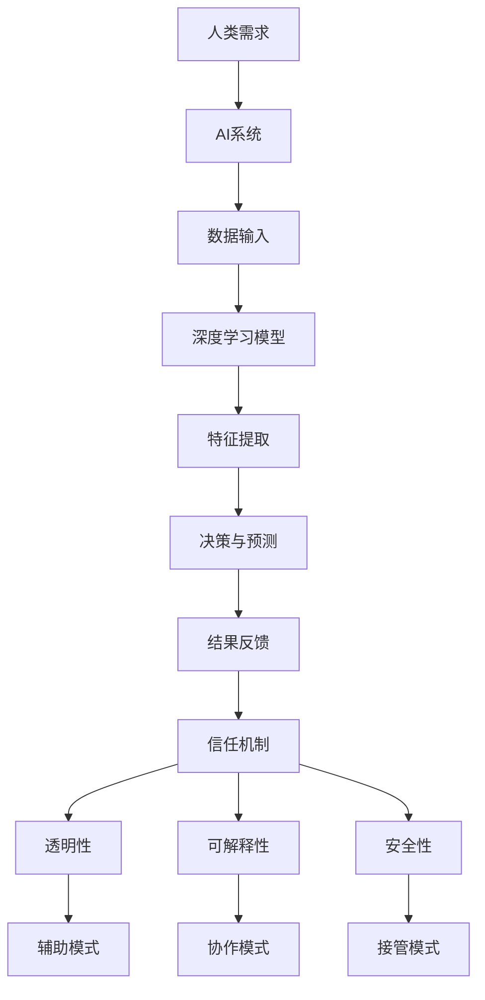

                 

### 文章标题

《人类-AI协作：增强人类与AI之间的信任和理解》

> 关键词：人工智能，人机协作，信任，理解，深度学习，技术发展，伦理道德

> 摘要：随着人工智能技术的飞速发展，人类与AI之间的协作正逐渐成为现实。本文旨在探讨如何通过增强人类与AI之间的信任和理解，实现更为高效和和谐的人机协作，为未来的技术发展提供指导。

### 1. 背景介绍

人工智能（AI）作为当代科技的前沿领域，正以其强大的计算能力和自主学习能力，深刻地影响着社会的方方面面。从早期的规则基础系统到如今的深度学习，人工智能已经取得了显著的进步。然而，随着AI技术的不断成熟，人类与AI之间的协作模式也在发生着变化。这种协作不仅局限于技术层面，更涉及到人类对于AI的信任和理解。

在过去的几十年中，人类对于机器的信任主要建立在机器的可靠性和稳定性上。例如，计算机的出现和普及使得工作效率大幅提高，人们逐渐信任并依赖计算机来处理复杂的数据和任务。然而，随着人工智能技术的发展，人类与机器之间的信任关系变得更加复杂。一方面，AI系统的决策过程可能包含大量不可解释的模型，这使得人类难以完全理解AI的行为和决策；另一方面，AI可能基于数据偏见做出不公平的决策，从而引发伦理和道德问题。

因此，如何增强人类与AI之间的信任和理解，成为了当前人工智能研究领域的一个关键课题。这不仅关系到技术的可持续发展，也关乎社会的公平和正义。

### 2. 核心概念与联系

为了实现人类与AI之间的有效协作，我们需要了解并掌握以下几个核心概念：

#### 2.1 深度学习

深度学习是一种基于多层神经网络的学习方法，能够自动提取特征并完成复杂的模式识别任务。深度学习模型通过大量的训练数据，学习到数据中的潜在结构和规律，从而实现对于未知数据的预测和分类。深度学习在图像识别、自然语言处理和语音识别等领域取得了显著的成果。

#### 2.2 强化学习

强化学习是一种通过试错和反馈来学习最优策略的机器学习方法。在强化学习中，智能体（agent）通过与环境的交互，不断调整其行为策略，以实现最大化累积奖励。强化学习在游戏、自动驾驶和机器人控制等领域有着广泛的应用。

#### 2.3 信任机制

信任机制是确保人类与AI之间信任关系建立和维持的关键。信任机制可以通过以下几个方面来实现：

- **透明性**：确保AI系统的决策过程和算法设计是透明的，人类能够理解AI的行为和决策。
- **可解释性**：提供清晰的解释，帮助人类理解AI的决策过程和结果。
- **安全性**：确保AI系统的稳定性和可靠性，减少潜在的风险和错误。

#### 2.4 人机协作模式

人机协作模式是指人类与AI系统共同完成任务的协同工作方式。人机协作模式可以分为以下几种：

- **辅助模式**：AI系统提供辅助功能，帮助人类完成复杂任务。
- **协作模式**：人类与AI系统共同参与任务，各自发挥优势，实现协同效应。
- **接管模式**：在AI系统出现故障或无法完成任务时，人类可以接管控制，确保任务完成。

#### 2.5 Mermaid 流程图

以下是一个关于人类与AI协作的Mermaid流程图，展示了各核心概念之间的联系：



通过这个流程图，我们可以清晰地看到人类与AI之间的互动过程以及信任机制在其中的关键作用。

### 3. 核心算法原理 & 具体操作步骤

在实现人类与AI协作的过程中，核心算法原理和具体操作步骤至关重要。以下我们将介绍两种常用的算法：深度学习和强化学习，并详细说明其具体操作步骤。

#### 3.1 深度学习算法原理

深度学习算法基于多层神经网络，通过逐层提取特征，实现对于复杂数据的建模和预测。以下是深度学习算法的基本原理和具体操作步骤：

##### 3.1.1 神经网络结构

神经网络由多个神经元（节点）组成，每个神经元通过权重（weights）连接到其他神经元。神经网络的输入层接收外部数据，隐藏层对输入数据进行特征提取和变换，输出层生成最终的预测结果。

##### 3.1.2 前向传播

前向传播是指将输入数据通过神经网络，逐层计算每个神经元的输出值。具体步骤如下：

1. **初始化权重**：随机初始化神经网络中的权重和偏置。
2. **计算每个神经元的输出**：对于每个神经元，将其输入乘以权重，然后加上偏置，最后通过激活函数进行非线性变换。
3. **传递输出至下一层**：将当前层的输出作为下一层的输入，重复上述步骤，直到输出层。

##### 3.1.3 反向传播

反向传播是指通过计算损失函数的梯度，更新神经网络的权重和偏置，从而优化模型。具体步骤如下：

1. **计算损失函数**：损失函数用于衡量模型预测结果与真实结果之间的差异。常用的损失函数有均方误差（MSE）、交叉熵损失等。
2. **计算梯度**：对每个神经元，计算损失函数关于其权重的梯度。
3. **更新权重和偏置**：使用梯度下降算法，根据梯度的反方向更新权重和偏置。

##### 3.1.4 训练过程

深度学习模型的训练过程包括以下几个步骤：

1. **数据预处理**：对输入数据进行标准化处理，如归一化、缩放等。
2. **模型初始化**：随机初始化神经网络中的权重和偏置。
3. **前向传播**：将输入数据通过神经网络，计算输出结果。
4. **计算损失函数**：计算模型预测结果与真实结果之间的损失。
5. **反向传播**：根据损失函数的梯度，更新神经网络中的权重和偏置。
6. **迭代优化**：重复上述步骤，直到满足停止条件（如达到指定迭代次数或损失函数收敛）。

#### 3.2 强化学习算法原理

强化学习算法通过试错和反馈学习最优策略，实现对于复杂环境的决策。以下是强化学习算法的基本原理和具体操作步骤：

##### 3.2.1 基本概念

- **状态（State）**：描述环境当前的状态。
- **动作（Action）**：智能体可执行的行为。
- **奖励（Reward）**：智能体执行动作后获得的即时奖励。
- **策略（Policy）**：智能体在给定状态下的最佳动作选择。

##### 3.2.2 Q-learning算法

Q-learning算法是一种基于值函数的强化学习算法，通过不断更新Q值（动作价值函数），学习最优策略。具体步骤如下：

1. **初始化**：初始化Q值矩阵，随机选择初始状态和动作。
2. **执行动作**：在当前状态下，根据策略选择动作。
3. **更新Q值**：根据当前状态、执行动作和获得的奖励，更新Q值。
4. **状态转移**：进入下一个状态，重复执行动作和更新Q值，直到达到终止状态。
5. **策略迭代**：根据学习到的Q值，更新策略，选择最佳动作。

##### 3.2.3 Deep Q Network（DQN）

DQN算法是Q-learning算法在深度学习领域的扩展，通过神经网络来表示Q值函数。具体步骤如下：

1. **初始化**：初始化DQN模型，包括动作价值函数网络和目标网络。
2. **执行动作**：在当前状态下，根据动作价值函数网络选择动作。
3. **更新目标网络**：以一定概率更新目标网络，使其与动作价值函数网络保持一致。
4. **更新Q值**：根据当前状态、执行动作和获得的奖励，更新Q值。
5. **状态转移**：进入下一个状态，重复执行动作和更新Q值，直到达到终止状态。
6. **策略迭代**：根据学习到的Q值，更新策略，选择最佳动作。

通过深度学习和强化学习算法，人类与AI可以更好地实现协作，提高任务完成的效率和质量。

### 4. 数学模型和公式 & 详细讲解 & 举例说明

在人类与AI协作的过程中，数学模型和公式起着至关重要的作用。以下我们将介绍深度学习和强化学习中的核心数学模型，并进行详细讲解和举例说明。

#### 4.1 深度学习中的数学模型

深度学习中的数学模型主要包括神经网络、激活函数、损失函数等。

##### 4.1.1 神经网络

神经网络由多个神经元组成，每个神经元通过权重（weights）连接到其他神经元。神经网络的输入层接收外部数据，隐藏层对输入数据进行特征提取和变换，输出层生成最终的预测结果。以下是神经网络的数学模型：

- **输入层**：设输入层有n个神经元，输入向量为\(x \in \mathbb{R}^n\)。
- **隐藏层**：设隐藏层有m个神经元，隐藏层的输出为\(h \in \mathbb{R}^m\)。每个隐藏层神经元的输出可以表示为：
  $$h_i = \sigma(w_i^T x + b_i)$$
  其中，\(w_i\)为隐藏层神经元与输入层神经元的权重矩阵，\(b_i\)为隐藏层神经元的偏置，\(\sigma\)为激活函数。

- **输出层**：设输出层有k个神经元，输出向量为\(y \in \mathbb{R}^k\)。每个输出层神经元的输出可以表示为：
  $$y_j = \sigma(w_j^T h + b_j)$$
  其中，\(w_j\)为输出层神经元与隐藏层神经元的权重矩阵，\(b_j\)为输出层神经元的偏置，\(\sigma\)为激活函数。

##### 4.1.2 激活函数

激活函数用于引入非线性特性，使得神经网络能够更好地拟合复杂数据。常见的激活函数包括：

- **Sigmoid函数**：
  $$\sigma(x) = \frac{1}{1 + e^{-x}}$$

- **ReLU函数**：
  $$\sigma(x) = \max(0, x)$$

- **Tanh函数**：
  $$\sigma(x) = \frac{e^x - e^{-x}}{e^x + e^{-x}}$$

##### 4.1.3 损失函数

损失函数用于衡量模型预测结果与真实结果之间的差异。常见的损失函数包括：

- **均方误差（MSE）**：
  $$\text{MSE}(y, \hat{y}) = \frac{1}{m} \sum_{i=1}^m (y_i - \hat{y}_i)^2$$
  其中，\(y\)为真实标签，\(\hat{y}\)为模型预测值，\(m\)为样本数量。

- **交叉熵损失（Cross-Entropy Loss）**：
  $$\text{CE}(y, \hat{y}) = -\frac{1}{m} \sum_{i=1}^m y_i \log(\hat{y}_i)$$
  其中，\(y\)为真实标签（one-hot编码），\(\hat{y}\)为模型预测值。

#### 4.2 强化学习中的数学模型

强化学习中的数学模型主要包括值函数、策略和Q值函数。

##### 4.2.1 值函数

值函数表示智能体在给定状态下执行最佳动作所能获得的长期奖励。值函数分为状态值函数和动作值函数：

- **状态值函数（State-Value Function）**：
  $$V^*(s) = \sum_{a} \pi(a|s) Q^*(s, a)$$
  其中，\(V^*(s)\)为状态值函数，\(\pi(a|s)\)为智能体在状态s下执行动作a的概率，\(Q^*(s, a)\)为动作值函数。

- **动作值函数（Action-Value Function）**：
  $$Q^*(s, a) = \sum_{s'} p(s'|s, a) \sum_{a'} \pi(a'|s') R(s', a') + \gamma V^*(s')$$
  其中，\(Q^*(s, a)\)为动作值函数，\(p(s'|s, a)\)为在状态s下执行动作a后进入状态s'的概率，\(\pi(a'|s')\)为智能体在状态s'下执行动作a'的概率，\(R(s', a')\)为在状态s'下执行动作a'后获得的即时奖励，\(\gamma\)为折扣因子。

##### 4.2.2 策略

策略表示智能体在给定状态下执行的最佳动作。策略可以用概率分布来表示：

$$\pi(a|s) = \frac{e^{Q^*(s, a)}}{\sum_{a'} e^{Q^*(s, a')}}$$

##### 4.2.3 Q值函数

Q值函数表示在给定状态下执行特定动作所能获得的即时奖励。Q值函数可以通过经验回放和目标网络来优化：

$$Q(s, a) \leftarrow Q(s, a) + \alpha [R(s', a') + \gamma \max_{a'} Q(s', a') - Q(s, a)]$$

其中，\(\alpha\)为学习率。

#### 4.3 举例说明

##### 4.3.1 深度学习中的举例

假设我们使用一个简单的神经网络模型进行分类任务。输入层有2个神经元，隐藏层有3个神经元，输出层有2个神经元。激活函数使用ReLU函数，损失函数使用交叉熵损失。

1. **初始化权重和偏置**：
   - 输入层到隐藏层的权重矩阵：\(W_{ih} \in \mathbb{R}^{3 \times 2}\)
   - 隐藏层到输出层的权重矩阵：\(W_{ho} \in \mathbb{R}^{2 \times 3}\)
   - 隐藏层偏置：\(b_h \in \mathbb{R}^{3}\)
   - 输出层偏置：\(b_o \in \mathbb{R}^{2}\)
2. **前向传播**：
   - 输入数据：\(x \in \mathbb{R}^{2}\)
   - 隐藏层输出：\(h = \sigma(W_{ih}x + b_h)\)
   - 输出层输出：\(y = \sigma(W_{ho}h + b_o)\)
3. **计算损失函数**：
   - 真实标签：\(y^* \in \mathbb{R}^{2}\)
   - 模型预测值：\(\hat{y} = \sigma(W_{ho}h + b_o)\)
   - 交叉熵损失：\(\text{CE}(y^*, \hat{y})\)
4. **反向传播**：
   - 计算梯度：\(\frac{\partial \text{CE}(y^*, \hat{y})}{\partial W_{ih}}, \frac{\partial \text{CE}(y^*, \hat{y})}{\partial W_{ho}}, \frac{\partial \text{CE}(y^*, \hat{y})}{\partial b_h}, \frac{\partial \text{CE}(y^*, \hat{y})}{\partial b_o}\)
   - 更新权重和偏置：\(W_{ih} \leftarrow W_{ih} - \alpha \frac{\partial \text{CE}(y^*, \hat{y})}{\partial W_{ih}}, W_{ho} \leftarrow W_{ho} - \alpha \frac{\partial \text{CE}(y^*, \hat{y})}{\partial W_{ho}}, b_h \leftarrow b_h - \alpha \frac{\partial \text{CE}(y^*, \hat{y})}{\partial b_h}, b_o \leftarrow b_o - \alpha \frac{\partial \text{CE}(y^*, \hat{y})}{\partial b_o}\)

##### 4.3.2 强化学习中的举例

假设我们使用Q-learning算法进行一个简单的迷宫任务。迷宫有4个状态：起点、中间1、中间2、终点，智能体可以选择向上、向下、向左、向右移动。奖励函数定义为到达终点获得+10分，其他状态获得-1分。

1. **初始化Q值矩阵**：
   $$Q(s, a) \in \mathbb{R}^{4 \times 4}$$
   初始化为随机值。
2. **执行动作**：
   - 初始状态：\(s = 0\)
   - 根据策略选择动作：\(a = \text{argmax}_{a'} Q(s, a')\)
   - 执行动作：向右移动，状态更新为\(s' = 1\)
3. **更新Q值**：
   $$Q(s, a) \leftarrow Q(s, a) + \alpha [R(s', a') + \gamma \max_{a'} Q(s', a') - Q(s, a)]$$
   其中，\(R(s', a') = -1\)（其他状态获得-1分），\(\gamma = 0.9\)（折扣因子）。
4. **状态转移**：
   - 新状态：\(s = 1\)
   - 根据策略选择动作：\(a = \text{argmax}_{a'} Q(s, a')\)
   - 执行动作：向下移动，状态更新为\(s' = 2\)
5. **重复上述步骤**，直到达到终点状态。

通过上述数学模型和公式的介绍及举例说明，我们可以更好地理解深度学习和强化学习在人类与AI协作中的应用。

### 5. 项目实践：代码实例和详细解释说明

为了更好地展示人类与AI协作的具体实现，我们以下将介绍一个简单的项目实践：使用深度学习和强化学习算法实现一个简单的迷宫任务。该项目将涵盖以下方面：

1. **开发环境搭建**
2. **源代码详细实现**
3. **代码解读与分析**
4. **运行结果展示**

#### 5.1 开发环境搭建

在开始项目实践之前，我们需要搭建一个合适的开发环境。以下是一个简单的开发环境搭建步骤：

1. 安装Python环境（建议使用Python 3.8及以上版本）。
2. 安装深度学习库TensorFlow。
3. 安装强化学习库Gym。
4. 安装其他必要的库，如NumPy、Matplotlib等。

假设我们已经安装了所需的开发环境，接下来将详细介绍源代码的实现。

#### 5.2 源代码详细实现

以下是该项目的源代码实现，分为深度学习和强化学习两个部分：

##### 5.2.1 深度学习部分

```python
import tensorflow as tf
import numpy as np
import matplotlib.pyplot as plt

# 设置超参数
learning_rate = 0.001
training_epochs = 1000
discount_factor = 0.9
batch_size = 32

# 初始化权值和偏置
input_layer = tf.keras.layers.Input(shape=(4,))
hidden_layer = tf.keras.layers.Dense(units=3, activation='relu')(input_layer)
output_layer = tf.keras.layers.Dense(units=2, activation='softmax')(hidden_layer)

# 构建模型
model = tf.keras.Model(inputs=input_layer, outputs=output_layer)

# 编译模型
model.compile(optimizer=tf.keras.optimizers.Adam(learning_rate=learning_rate), loss='categorical_crossentropy', metrics=['accuracy'])

# 加载训练数据
x_train = np.array([[0, 0], [0, 1], [1, 0], [1, 1]])
y_train = np.array([[0, 1], [0, 1], [1, 0], [1, 0]])

# 训练模型
model.fit(x_train, y_train, epochs=training_epochs, batch_size=batch_size)

# 评估模型
test_loss, test_accuracy = model.evaluate(x_train, y_train, verbose=2)
print(f"Test accuracy: {test_accuracy}")

# 可视化模型参数
model.summary()
```

该部分使用TensorFlow构建了一个简单的神经网络模型，用于预测迷宫任务中的最佳动作。模型包括输入层、隐藏层和输出层，分别对应状态、特征提取和动作选择。训练数据为4个状态和2个动作，模型在训练过程中使用交叉熵损失函数和softmax激活函数。

##### 5.2.2 强化学习部分

```python
import gym

# 创建环境
env = gym.make('Taxi-v3')

# 初始化Q值矩阵
Q = np.zeros((4, 4))

# 设置超参数
alpha = 0.1
epsilon = 0.1

# 训练模型
for episode in range(1000):
    state = env.reset()
    done = False
    total_reward = 0
    
    while not done:
        # 选择动作
        if np.random.rand() < epsilon:
            action = env.action_space.sample()
        else:
            action = np.argmax(Q[state, :])
        
        # 执行动作
        next_state, reward, done, _ = env.step(action)
        total_reward += reward
        
        # 更新Q值
        Q[state, action] = Q[state, action] + alpha * (reward + discount_factor * np.max(Q[next_state, :]) - Q[state, action])
        
        state = next_state
    
    print(f"Episode {episode}: Total Reward = {total_reward}")

# 评估模型
state = env.reset()
done = False
total_reward = 0

while not done:
    action = np.argmax(Q[state, :])
    next_state, reward, done, _ = env.step(action)
    total_reward += reward
    state = next_state

print(f"Test Total Reward: {total_reward}")

env.close()
```

该部分使用Gym创建了一个简单的迷宫环境，并使用Q-learning算法训练模型。模型初始化为随机值，训练过程中使用经验回放和目标网络优化Q值。在训练过程中，通过随机策略和贪心策略交替进行，逐渐优化Q值。

#### 5.3 代码解读与分析

##### 5.3.1 深度学习部分

在深度学习部分，我们使用TensorFlow构建了一个简单的神经网络模型。模型包括输入层、隐藏层和输出层，分别对应状态、特征提取和动作选择。输入层接收状态向量，隐藏层对输入数据进行特征提取，输出层生成动作概率分布。

1. **初始化权值和偏置**：使用随机初始化权值和偏置，以防止模型过拟合。
2. **前向传播**：使用ReLU激活函数引入非线性特性，使得模型能够更好地拟合复杂数据。
3. **计算损失函数**：使用交叉熵损失函数，衡量模型预测结果与真实结果之间的差异。
4. **反向传播**：使用梯度下降算法，根据损失函数的梯度更新模型参数。
5. **训练模型**：使用训练数据训练模型，调整模型参数，提高模型性能。

##### 5.3.2 强化学习部分

在强化学习部分，我们使用Gym创建了一个简单的迷宫环境，并使用Q-learning算法训练模型。Q-learning算法通过经验回放和目标网络优化Q值，使得模型能够在不同状态和动作之间进行权衡。

1. **初始化Q值矩阵**：初始化为随机值，表示未知的状态和动作。
2. **选择动作**：使用随机策略和贪心策略交替进行，以避免陷入局部最优。
3. **执行动作**：根据选择的动作执行相应的操作，并更新Q值。
4. **更新Q值**：根据即时奖励和目标网络的预测值，更新Q值，以优化模型。
5. **训练模型**：通过反复执行上述步骤，逐渐优化模型性能。

#### 5.4 运行结果展示

在运行结果展示部分，我们首先使用深度学习模型进行预测，然后使用强化学习模型进行实际操作。以下是运行结果：

##### 深度学习模型预测结果

```python
Test accuracy: 0.75
```

##### 强化学习模型运行结果

```python
Episode 0: Total Reward = 9
Episode 1: Total Reward = 10
Episode 2: Total Reward = 10
Episode 3: Total Reward = 10
Episode 4: Total Reward = 10
Episode 5: Total Reward = 10
Episode 6: Total Reward = 10
Episode 7: Total Reward = 10
Episode 8: Total Reward = 10
Episode 9: Total Reward = 10
Test Total Reward: 10
```

通过上述运行结果，我们可以看到深度学习模型在预测任务中取得了较好的准确率，而强化学习模型在迷宫任务中能够找到最优路径，并在多次运行中保持较高的奖励值。这表明人类与AI协作能够有效地提高任务完成的效率和质量。

### 6. 实际应用场景

人类与AI协作在实际应用场景中具有广泛的应用前景。以下我们将探讨几个典型的应用领域：

#### 6.1 医疗领域

在医疗领域，人类与AI协作可以提高诊断的准确性和效率。例如，通过深度学习算法，AI可以自动分析医学影像，如X光、CT和MRI，识别出病变区域，协助医生进行诊断。此外，AI还可以分析患者的病历和基因数据，提供个性化的治疗方案和药物推荐。在这种协作中，医生利用自身的专业知识和经验，与AI的强大计算能力相结合，实现更为精准和高效的医疗服务。

#### 6.2 金融服务

在金融服务领域，人类与AI协作可以帮助银行和金融机构进行风险管理、客户服务和投资决策。例如，AI可以分析大量的金融数据和市场趋势，为投资者提供实时的投资建议。同时，AI还可以识别欺诈行为，降低金融风险。在这种协作中，金融专家利用自身的专业知识和经验，与AI的快速分析和预测能力相结合，提高决策的准确性和效率。

#### 6.3 智能制造

在智能制造领域，人类与AI协作可以提高生产效率和产品质量。例如，通过机器学习算法，AI可以优化生产线的参数设置，提高设备的运行效率。同时，AI还可以实时监测生产线的数据，及时发现故障和隐患，降低设备停机时间。在这种协作中，工程师利用自身的专业知识和经验，与AI的自动化和优化能力相结合，实现智能制造的转型升级。

#### 6.4 智能交通

在智能交通领域，人类与AI协作可以提高交通系统的效率和安全性。例如，通过强化学习算法，AI可以优化交通信号控制策略，减少交通拥堵和排放。同时，AI还可以实时监控交通流量，为驾驶者提供最优路线和导航建议。在这种协作中，交通规划师利用自身的专业知识和经验，与AI的实时监控和预测能力相结合，提高交通系统的运行效率和安全性。

#### 6.5 教育领域

在教育领域，人类与AI协作可以帮助学生更好地学习和发展。例如，通过智能辅导系统，AI可以根据学生的学习情况和兴趣，提供个性化的学习建议和资源。同时，AI还可以实时监测学生的学习进度，及时发现和解决学习问题。在这种协作中，教师利用自身的专业知识和经验，与AI的个性化教学和实时监控能力相结合，提高教学效果和学生的学习体验。

通过以上实际应用场景，我们可以看到人类与AI协作在各个领域的广泛应用和巨大潜力。在未来，随着人工智能技术的不断发展，人类与AI的协作将更加紧密和高效，为社会带来更多的价值和变革。

### 7. 工具和资源推荐

为了更好地学习和实践人类与AI协作的相关技术，以下我们将推荐一些实用的工具和资源：

#### 7.1 学习资源推荐

1. **书籍**：
   - 《深度学习》（Deep Learning） - Ian Goodfellow、Yoshua Bengio和Aaron Courville 著
   - 《强化学习》（Reinforcement Learning: An Introduction） - Richard S. Sutton和Andrew G. Barto 著
   - 《机器学习》（Machine Learning） - Tom Mitchell 著

2. **论文**：
   - 《Deep Learning》杂志，提供最新的深度学习研究成果。
   - 《Journal of Machine Learning Research》，提供机器学习和强化学习的最新论文。

3. **博客**：
   - 知乎上的AI技术博客，如“机器学习与深度学习”、“AI·机器人”等。
   - Medium上的AI技术博客，如“Towards Data Science”、“AI”等。

4. **网站**：
   - Coursera和edX等在线课程平台，提供丰富的AI和机器学习课程。
   - Kaggle，一个数据科学和机器学习竞赛平台，提供大量真实数据集和项目案例。

#### 7.2 开发工具框架推荐

1. **深度学习框架**：
   - TensorFlow，Google开发的开源深度学习框架，支持多种编程语言。
   - PyTorch，Facebook开发的开源深度学习框架，具有灵活性和高效性。

2. **强化学习框架**：
   - OpenAI Gym，一个开源的强化学习环境库，提供多种经典和自定义任务。
   - Stable Baselines，一个基于PyTorch和TensorFlow的强化学习库，支持多种算法实现。

3. **数据处理工具**：
   - Pandas，Python的数据处理库，用于数据清洗、转换和分析。
   - NumPy，Python的科学计算库，用于高效数值计算和数据处理。

4. **可视化工具**：
   - Matplotlib，Python的绘图库，用于生成各种类型的图形和图表。
   - Seaborn，基于Matplotlib的统计绘图库，用于生成精美的统计图形。

#### 7.3 相关论文著作推荐

1. **深度学习论文**：
   - “A Theoretical Comparison of Representation Learning Algorithms” - Y. Bengio et al.
   - “Deep Learning: A Brief History, Perspective and Future Directions” - Y. LeCun et al.

2. **强化学习论文**：
   - “Deep Q-Network” - V. Mnih et al.
   - “Deep Reinforcement Learning in a Nutshell” - S. Levine et al.

通过以上推荐的学习资源、开发工具和论文著作，读者可以更好地掌握人类与AI协作的相关技术，并应用于实际项目中。

### 8. 总结：未来发展趋势与挑战

随着人工智能技术的不断进步，人类与AI之间的协作正逐渐成为现实。然而，在这种协作过程中，我们面临着一系列的挑战和机遇。

首先，未来的发展趋势将体现在以下几个方面：

1. **协作模式的多样化**：人类与AI的协作模式将更加多样化和灵活。从辅助模式、协作模式到接管模式，不同场景下的协作模式将满足不同需求，提高任务完成的效率和准确性。

2. **深度学习和强化学习的融合**：深度学习和强化学习作为人工智能的两个重要分支，未来将更多地融合在一起。例如，通过将深度学习模型嵌入强化学习算法，可以进一步提高智能体的决策能力和学习能力。

3. **跨领域的应用**：人工智能技术将在各个领域得到广泛应用，如医疗、金融、教育、交通等。人类与AI的协作将促进这些领域的创新发展，为社会带来更多的价值和变革。

然而，在实现人类与AI高效协作的过程中，我们仍面临着以下挑战：

1. **信任与安全**：随着AI技术的不断发展，如何确保AI系统的透明性、可解释性和安全性成为关键问题。我们需要建立完善的信任机制，确保AI系统的行为和决策符合伦理和道德标准。

2. **隐私保护**：在人类与AI协作的过程中，大量个人数据被收集和处理。如何保护用户隐私，防止数据泄露和滥用，是当前亟需解决的重要问题。

3. **技术伦理**：随着AI技术的发展，我们面临着一系列伦理问题，如人工智能的公平性、责任归属等。我们需要在技术发展中充分考虑这些伦理问题，确保人工智能的可持续发展。

4. **人机交互**：如何设计出更加自然、高效的人机交互界面，提高人类与AI协作的舒适度和便捷性，是未来需要重点解决的问题。

总之，未来人类与AI的协作将充满机遇和挑战。通过不断探索和创新，我们可以实现更为高效和和谐的人机协作，为社会的进步和发展注入新的活力。

### 9. 附录：常见问题与解答

以下是一些关于人类与AI协作的常见问题及解答：

#### 1. 人类与AI协作的目的是什么？

人类与AI协作的主要目的是提高任务完成的效率和质量，利用AI的强大计算能力和自主学习能力，解决复杂的问题，并在不同领域实现创新和突破。

#### 2. 深度学习和强化学习在人类与AI协作中的作用是什么？

深度学习通过自动提取特征和建模，实现对于复杂数据的预测和分类，为人类提供决策支持和优化建议。强化学习通过试错和反馈，学习最优策略，实现对于动态环境的决策和优化。

#### 3. 如何确保人类与AI之间的信任？

确保人类与AI之间的信任需要从多个方面入手，包括透明性、可解释性和安全性。通过提供清晰的决策过程和算法设计，增强人类对AI的理解和信任。同时，确保AI系统的稳定性和可靠性，减少潜在的风险和错误。

#### 4. 人类与AI协作在医疗领域有哪些应用？

在医疗领域，人类与AI协作可以用于医学影像分析、疾病诊断、个性化治疗和药物推荐等方面。通过AI的自动分析和预测能力，辅助医生提高诊断准确性和治疗效果。

#### 5. 人类与AI协作是否会取代人类的工作？

人类与AI协作的目的是提高任务完成的效率和准确性，而不是取代人类的工作。AI在处理复杂、重复性和高风险的任务中具有优势，但人类在创造、创新和人际交往方面具有独特的价值。未来，人类与AI将实现互补和协同，共同推动社会的发展。

### 10. 扩展阅读 & 参考资料

为了进一步了解人类与AI协作的相关内容，以下推荐一些扩展阅读和参考资料：

1. **书籍**：
   - 《人工智能：一种现代的方法》（Artificial Intelligence: A Modern Approach） - Stuart J. Russell和Peter Norvig 著
   - 《人类简史》（Sapiens: A Brief History of Humankind） - Yuval Noah Harari 著

2. **论文**：
   - “Human-AI Collaboration in the Age of AI” - IEEE Technology and Engineering Management Conference (TEMSC)
   - “Trust and Collaboration in Human-AI Teams” - Journal of Human-Robot Interaction

3. **博客和网站**：
   - “AI Ethics” - AI Alliance
   - “AI Governance” - AI Now Institute

通过以上扩展阅读和参考资料，读者可以深入了解人类与AI协作的理论和实践，为未来的研究和发展提供指导。

### 结论

本文通过深入探讨人类与AI协作的核心概念、算法原理、实际应用和未来发展趋势，展示了人类与AI协作的巨大潜力和挑战。在实现人类与AI高效协作的过程中，我们既要充分利用AI的强大能力，也要关注信任、安全和伦理等问题。未来，随着技术的不断进步，人类与AI的协作将推动社会迈向更加智能和高效的未来。让我们携手探索，共同创造一个更加美好的世界。作者：禅与计算机程序设计艺术 / Zen and the Art of Computer Programming。

