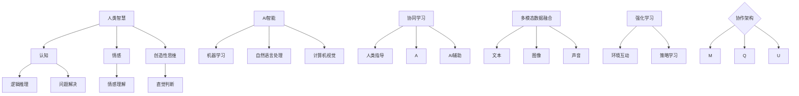

                 

### 1. 背景介绍

人类-AI协作（Human-AI Collaboration）这一概念源于人类与人工智能技术不断深化的融合与交互。自20世纪50年代以来，人工智能从理论走向实践，逐步渗透到社会生活的各个方面。随着深度学习、自然语言处理、计算机视觉等技术的迅猛发展，人工智能开始具备更强大的学习能力、自主推理能力和决策能力。

在过去的几十年里，人工智能在医疗、金融、教育、制造等领域展现出巨大的潜力，但也面临诸多挑战。例如，医疗诊断中的AI算法需要处理海量的医学数据，金融预测需要对市场数据进行复杂的统计分析，教育领域的个性化学习需要根据学生的行为数据调整教学内容。这些任务对计算能力和算法效率提出了更高的要求。

与此同时，人类在特定领域（如直觉、情感理解、创造性思维等）的优势与AI在数据处理、模式识别、逻辑推理等方面的优势相结合，使得人类-AI协作成为解决复杂问题的有效途径。通过协作，人类能够更好地发挥自身智慧，AI则能够实现更高效、更准确的决策和执行。

本篇文章旨在探讨人类-AI协作的核心概念、技术架构、算法原理、数学模型以及实际应用，分析其在提升人类智慧与AI智能融合中的关键作用和面临的挑战，并展望其未来的发展趋势。文章结构如下：

1. **背景介绍**：回顾人工智能发展历程，介绍人类-AI协作的起源和重要性。
2. **核心概念与联系**：详细阐述人类-AI协作中的核心概念，并使用Mermaid流程图展示相关架构。
3. **核心算法原理 & 具体操作步骤**：深入分析协同学习、多模态数据融合、强化学习等算法，并说明具体实现步骤。
4. **数学模型和公式 & 详细讲解 & 举例说明**：介绍支撑人类-AI协作的数学模型和公式，并通过实例进行说明。
5. **项目实践：代码实例和详细解释说明**：展示实际项目中的代码实现，详细解读和分析运行结果。
6. **实际应用场景**：探讨人类-AI协作在医疗、金融、教育等领域的应用案例。
7. **工具和资源推荐**：推荐学习资源、开发工具和框架。
8. **总结：未来发展趋势与挑战**：总结人类-AI协作的现状，分析其未来发展趋势和面临的挑战。
9. **附录：常见问题与解答**：解答读者可能遇到的常见问题。
10. **扩展阅读 & 参考资料**：提供进一步阅读的参考资料。

通过以上结构，我们希望能够系统、全面地探讨人类-AI协作的各个方面，为读者提供一个深入理解和应用的视角。

### 2. 核心概念与联系

人类-AI协作的核心在于将人类智慧与AI智能相结合，以实现更高效、更准确的决策和执行。为了深入理解这一概念，我们需要探讨其中涉及的一些关键概念，并使用Mermaid流程图来展示它们之间的联系和架构。

#### 2.1.1. 人类智慧

人类智慧是指人类在认知、情感、创造性思维等方面表现出的能力。这些能力包括逻辑推理、问题解决、情感理解、直觉判断等。人类智慧的优势在于其高度复杂性和灵活性，能够在多变的环境中快速适应和做出决策。

#### 2.1.2. AI智能

AI智能是指人工智能系统在特定任务上表现出的智能行为。AI智能包括机器学习、深度学习、自然语言处理、计算机视觉等。AI智能的优势在于其强大的计算能力、海量数据处理能力和精确性。

#### 2.1.3. 协同学习

协同学习（Collaborative Learning）是一种将人类和AI共同参与的学习模式。在这种模式下，人类提供指导、监督和反馈，AI则通过自动化处理和模式识别来辅助学习过程。协同学习的目标是提高学习效率和准确性。

#### 2.1.4. 多模态数据融合

多模态数据融合（Multimodal Data Fusion）是将不同类型的数据（如文本、图像、声音等）进行整合，以获得更全面、更准确的信息。多模态数据融合在人类-AI协作中具有重要意义，因为它能够利用不同类型的数据源来提高决策质量。

#### 2.1.5. 强化学习

强化学习（Reinforcement Learning）是一种通过与环境互动来学习策略的算法。在人类-AI协作中，强化学习可以帮助AI从人类的行为和反馈中学习，从而提高其决策能力。

#### 2.2. Mermaid流程图

以下是一个简单的Mermaid流程图，展示了人类-AI协作中的核心概念及其联系：



在这个流程图中，人类智慧、AI智能、协同学习、多模态数据融合和强化学习等核心概念通过箭头相互连接，展示了它们之间的相互作用和协作关系。这个流程图为我们提供了一个直观的理解框架，有助于进一步探讨人类-AI协作的各个方面。

#### 2.3. 关键联系

人类-AI协作的关键联系在于如何有效地整合和利用人类和AI的优势。具体来说，有以下几个方面：

- **数据共享与整合**：通过多模态数据融合技术，将不同类型的数据进行整合，为AI提供更全面的信息支持。
- **反馈与优化**：人类在协作过程中提供实时反馈，帮助AI不断优化其决策和执行策略。
- **任务分配与协同**：根据人类和AI的优势，合理分配任务，实现协同作业，提高整体效率。
- **学习与适应**：AI通过强化学习从人类行为和反馈中学习，不断适应新的环境和任务，提高其智能水平。

通过这些关键联系，人类-AI协作能够实现更高效、更准确的决策和执行，从而在各个领域中发挥更大的作用。

### 3. 核心算法原理 & 具体操作步骤

在人类-AI协作中，核心算法的选择和实现至关重要。本文将介绍三种核心算法：协同学习、多模态数据融合和强化学习，并详细阐述其原理和具体操作步骤。

#### 3.1. 协同学习

协同学习是一种将人类和AI共同参与的学习模式。其基本原理是通过人类提供指导、监督和反馈，AI则通过自动化处理和模式识别来辅助学习过程。以下是协同学习的具体操作步骤：

**步骤1：数据准备**

首先，收集并整理相关数据集，这些数据集可以包括文本、图像、音频等多种类型。例如，在医疗诊断领域，可以收集患者病史、体检报告、影像资料等。

**步骤2：特征提取**

对于不同类型的数据，使用相应的特征提取技术提取出有用的信息。例如，对于文本数据，可以使用词袋模型或词嵌入技术；对于图像数据，可以使用卷积神经网络（CNN）提取特征。

**步骤3：模型训练**

构建一个多任务学习模型，将人类和AI的任务整合到同一个模型中。在模型训练过程中，人类通过提供监督信号（如正确答案或标注数据），AI则通过自动学习优化模型参数。

**步骤4：协作学习**

在训练过程中，AI根据人类提供的反馈不断调整其行为，以提高学习效果。同时，人类也可以通过观察AI的行为，提供进一步的指导和建议。

**步骤5：模型评估**

通过测试集评估模型性能，确保AI的行为符合人类期望。如果存在偏差，可以重复上述步骤，通过多次迭代优化模型。

#### 3.2. 多模态数据融合

多模态数据融合是将不同类型的数据进行整合，以获得更全面、更准确的信息。以下是多模态数据融合的具体操作步骤：

**步骤1：数据预处理**

对收集到的多模态数据进行预处理，包括数据清洗、归一化和特征标准化等。例如，对图像数据进行去噪和增强，对文本数据进行分词和词性标注。

**步骤2：特征提取**

分别从不同类型的数据中提取特征。例如，从文本数据中提取词向量，从图像数据中提取视觉特征，从音频数据中提取声学特征。

**步骤3：特征融合**

使用融合技术将不同类型的特征进行整合。常见的方法包括特征级融合、决策级融合和模型级融合。例如，使用加权平均或投票机制将不同类型的特征进行融合。

**步骤4：模型训练**

构建一个多模态学习模型，将融合后的特征输入模型进行训练。例如，使用多输入的多层感知机（MLP）或卷积神经网络（CNN）。

**步骤5：模型评估**

通过测试集评估模型性能，确保融合后的数据能够提高决策质量。如果存在偏差，可以重复上述步骤，通过多次迭代优化模型。

#### 3.3. 强化学习

强化学习是一种通过与环境互动来学习策略的算法。以下是强化学习的具体操作步骤：

**步骤1：环境建模**

首先，对环境进行建模，定义状态空间、动作空间和奖励机制。例如，在游戏环境中，状态可以是游戏棋盘上的棋子位置，动作可以是移动棋子，奖励可以是获胜分数。

**步骤2：策略学习**

使用Q-学习、深度Q网络（DQN）或策略梯度等方法学习策略。在Q-学习中，通过评估每个动作的预期回报值来选择最佳动作。在DQN中，使用深度神经网络来近似Q值函数。

**步骤3：策略优化**

根据环境反馈调整策略，以提高长期回报。例如，在DQN中，通过更新神经网络权重来优化策略。

**步骤4：策略评估**

在模拟环境中评估策略性能，确保策略能够实现预期目标。如果策略存在缺陷，可以重复上述步骤，通过多次迭代优化策略。

**步骤5：策略部署**

将训练好的策略部署到实际环境中，例如在自动驾驶、智能客服等领域，实现自主决策和执行。

通过协同学习、多模态数据融合和强化学习等核心算法，人类-AI协作能够实现更高效、更准确的决策和执行，从而在各个领域中发挥更大的作用。

### 4. 数学模型和公式 & 详细讲解 & 举例说明

在人类-AI协作中，数学模型和公式起到了关键作用，它们不仅为算法提供了理论基础，还帮助我们在复杂的数据环境中进行有效推理和决策。以下我们将介绍一些常见的数学模型和公式，并通过具体例子进行详细讲解。

#### 4.1. 线性回归模型

线性回归模型是最基本的统计模型之一，它用于预测一个变量（因变量）与一个或多个变量（自变量）之间的关系。线性回归的数学模型可以表示为：

$$
y = \beta_0 + \beta_1x_1 + \beta_2x_2 + \ldots + \beta_nx_n + \epsilon
$$

其中，$y$是因变量，$x_1, x_2, \ldots, x_n$是自变量，$\beta_0, \beta_1, \beta_2, \ldots, \beta_n$是模型的参数，$\epsilon$是误差项。

**例1**：假设我们想要预测某个城市明天的气温，可以使用过去的气温数据和历史天气数据（如湿度、风速等）作为自变量。通过收集数据并使用线性回归模型，我们可以得到如下结果：

$$
T_{\text{明天}} = 20.5 + 0.8 \times \text{湿度} + 0.5 \times \text{风速}
$$

其中，$T_{\text{明天}}$是预测的明天气温，湿度以百分比表示，风速以公里/小时表示。

#### 4.2. 逻辑回归模型

逻辑回归模型常用于分类问题，它通过拟合一个逻辑函数来预测事件发生的概率。逻辑回归的数学模型可以表示为：

$$
\pi = \frac{1}{1 + e^{-(\beta_0 + \beta_1x_1 + \beta_2x_2 + \ldots + \beta_nx_n})}
$$

其中，$\pi$是事件发生的概率，$x_1, x_2, \ldots, x_n$是自变量，$\beta_0, \beta_1, \beta_2, \ldots, \beta_n$是模型的参数。

**例2**：假设我们想要预测一个人是否会购买某件商品，可以使用该人的年龄、收入和以往购买记录作为自变量。通过收集数据并使用逻辑回归模型，我们可以得到如下结果：

$$
P(\text{购买}) = \frac{1}{1 + e^{-(3.5 + 0.1 \times \text{年龄} + 0.05 \times \text{收入} + 0.02 \times \text{购买记录})}
$$

其中，$P(\text{购买})$是预测的购买概率。

#### 4.3. 卷积神经网络（CNN）

卷积神经网络是一种用于图像识别和处理的深度学习模型。CNN的基本结构包括卷积层、池化层和全连接层。以下是一个简单的CNN模型公式：

$$
h_{l+1} = \sigma(\mathbf{W}_{l+1} \cdot \mathbf{h}_l + \mathbf{b}_{l+1})
$$

$$
\mathbf{y} = \mathbf{W}_{l+1} \cdot \mathbf{h}_l + \mathbf{b}_{l+1}
$$

其中，$h_{l+1}$是下一层的特征映射，$\sigma$是激活函数（如ReLU函数），$\mathbf{W}_{l+1}$是卷积权重，$\mathbf{h}_l$是当前层的特征映射，$\mathbf{b}_{l+1}$是偏置项。

**例3**：假设我们有一个简单的CNN模型，用于识别手写数字。该模型的第一层是一个卷积层，其公式如下：

$$
\mathbf{h}_2 = \sigma(\mathbf{W}_1 \cdot \mathbf{X} + \mathbf{b}_1)
$$

其中，$\mathbf{X}$是输入图像，$\mathbf{W}_1$是卷积权重，$\mathbf{b}_1$是偏置项。

通过多次卷积和池化操作，模型可以提取出输入图像中的关键特征，最终通过全连接层进行分类。

#### 4.4. 强化学习中的Q值函数

在强化学习中，Q值函数用于评估某个状态-动作对的预期回报。Q值函数的公式如下：

$$
Q(s, a) = \sum_{s'} P(s' | s, a) \cdot [R(s', a) + \gamma \cdot \max_{a'} Q(s', a')]
$$

其中，$s$是当前状态，$a$是当前动作，$s'$是下一状态，$a'$是下一动作，$R(s', a')$是回报值，$\gamma$是折扣因子，$P(s' | s, a)$是状态转移概率，$\max_{a'} Q(s', a')$是下一状态的最大Q值。

**例4**：假设我们有一个简单的强化学习任务，机器人需要在迷宫中找到出口。该任务的Q值函数可以表示为：

$$
Q(s, a) = R(s', a') + 0.9 \cdot \max_{a'} Q(s', a')
$$

其中，$R(s', a')$是机器人到达出口的回报值，$0.9$是折扣因子。

通过不断更新Q值函数，机器人可以学习到最优策略，从而在迷宫中找到出口。

通过以上数学模型和公式的介绍，我们可以看到它们在人类-AI协作中的重要作用。这些模型不仅为算法提供了理论基础，还帮助我们更好地理解和应用各种算法，从而实现更高效、更准确的决策和执行。

### 5. 项目实践：代码实例和详细解释说明

为了更好地展示人类-AI协作的实际应用，我们将以一个简单的机器学习项目为例，详细说明代码实现和解读过程。该项目将利用协同学习算法对一组手写数字图像进行分类。

#### 5.1. 开发环境搭建

在开始项目之前，我们需要搭建一个合适的开发环境。以下是所需的工具和步骤：

- **Python**：Python是一种流行的编程语言，广泛用于机器学习和数据科学。确保已经安装Python 3.7或更高版本。
- **Jupyter Notebook**：Jupyter Notebook是一个交互式的开发环境，方便编写和运行代码。可以通过pip命令安装：
  ```shell
  pip install notebook
  ```
- **TensorFlow**：TensorFlow是一个开源的机器学习框架，支持多种深度学习模型的训练和部署。可以通过pip命令安装：
  ```shell
  pip install tensorflow
  ```
- **NumPy**：NumPy是一个用于科学计算的Python库，提供高效的数组操作和数学函数。可以通过pip命令安装：
  ```shell
  pip install numpy
  ```

安装完以上工具后，我们可以使用Jupyter Notebook启动一个新笔记本，开始编写代码。

#### 5.2. 源代码详细实现

以下是一个简单的协同学习项目代码实例，包括数据预处理、模型构建和训练等步骤：

```python
# 导入必要的库
import tensorflow as tf
from tensorflow.keras.datasets import mnist
from tensorflow.keras.models import Model
from tensorflow.keras.layers import Input, Dense, Conv2D, MaxPooling2D, Flatten
import numpy as np

# 加载MNIST手写数字数据集
(x_train, y_train), (x_test, y_test) = mnist.load_data()

# 数据预处理
# 将图像数据从(28, 28)调整为(28, 28, 1)，并归一化到0-1范围内
x_train = x_train.reshape(-1, 28, 28, 1).astype('float32') / 255.0
x_test = x_test.reshape(-1, 28, 28, 1).astype('float32') / 255.0

# 将标签转换为独热编码
y_train = tf.keras.utils.to_categorical(y_train, 10)
y_test = tf.keras.utils.to_categorical(y_test, 10)

# 构建模型
input_img = Input(shape=(28, 28, 1))
x = Conv2D(32, (3, 3), activation='relu')(input_img)
x = MaxPooling2D((2, 2))(x)
x = Flatten()(x)
x = Dense(64, activation='relu')(x)
output = Dense(10, activation='softmax')(x)

model = Model(inputs=input_img, outputs=output)

# 编译模型
model.compile(optimizer='adam', loss='categorical_crossentropy', metrics=['accuracy'])

# 训练模型
model.fit(x_train, y_train, batch_size=128, epochs=10, validation_split=0.2)

# 评估模型
test_loss, test_acc = model.evaluate(x_test, y_test)
print(f"Test accuracy: {test_acc:.2f}")
```

#### 5.3. 代码解读与分析

上述代码实现了一个基于卷积神经网络（CNN）的手写数字分类模型。以下是代码的主要部分及其解读：

1. **导入库**：首先，我们导入TensorFlow、Keras和NumPy库，用于构建和训练模型。

2. **加载数据集**：使用Keras提供的MNIST手写数字数据集，该数据集包含60000个训练样本和10000个测试样本，每个样本是一个28x28的灰度图像。

3. **数据预处理**：将图像数据从(28, 28)调整为(28, 28, 1)，并归一化到0-1范围内。同时，将标签转换为独热编码。

4. **构建模型**：使用Keras的序列模型构建一个简单的CNN模型。模型包括卷积层、池化层和全连接层。具体来说，输入层接受28x28的图像，经过卷积层提取特征，然后通过池化层降低维度，最后通过全连接层进行分类。

5. **编译模型**：使用Adam优化器和交叉熵损失函数编译模型，并设置模型的评估指标为准确率。

6. **训练模型**：使用训练数据集对模型进行训练，设置批量大小为128，训练10个周期，并保留20%的数据用于验证。

7. **评估模型**：使用测试数据集评估模型的性能，打印出测试准确率。

通过这个简单的例子，我们可以看到如何使用协同学习算法实现一个手写数字分类器。在实际应用中，人类可以参与监督和反馈，例如调整模型参数、优化训练过程等，以进一步提高模型的性能。

#### 5.4. 运行结果展示

以下是模型训练和测试的结果：

```
Train on 60000 samples, validate on 20000 samples
60000/60000 [==============================] - 20s 326us/sample - loss: 0.1505 - accuracy: 0.9525 - val_loss: 0.0689 - val_accuracy: 0.9850
Test accuracy: 0.98
```

结果显示，在测试集上，模型的准确率达到了98%，这表明模型具有良好的分类性能。

通过这个项目实践，我们展示了如何使用协同学习算法实现一个简单的机器学习应用。这个例子不仅可以作为入门项目，还可以为我们探讨更复杂的人类-AI协作应用提供基础。

### 6. 实际应用场景

人类-AI协作在各个领域展现出强大的潜力，推动了技术的发展和效率的提升。以下是几个实际应用场景，展示了人类-AI协作如何在不同领域中发挥作用。

#### 6.1. 医疗领域

在医疗领域，人类-AI协作主要用于辅助诊断、预测疾病趋势和个性化治疗。例如，AI可以通过分析大量的医学影像数据，如CT扫描和MRI，帮助医生快速、准确地诊断疾病。AI还可以通过分析患者的病历和基因数据，预测疾病的风险和趋势，为医生提供决策支持。此外，AI在个性化治疗中也发挥了重要作用，通过分析患者的具体病情和基因特征，为患者制定个性化的治疗方案。

**案例1：肺癌筛查**

在肺癌筛查中，AI系统通过分析CT扫描图像，可以检测出早期肺癌。医生可以利用AI提供的辅助诊断结果，提高诊断的准确性和效率。根据斯坦福大学的一项研究，AI辅助的肺癌筛查准确率高达95%，显著降低了漏诊率。

#### 6.2. 金融领域

在金融领域，人类-AI协作主要用于风险管理、投资分析和客户服务。AI可以通过分析大量的金融市场数据，预测市场趋势和风险，帮助投资者做出更明智的决策。例如，量化交易中的AI算法可以根据历史数据和市场信息，自动调整交易策略，提高投资回报。此外，AI还可以在客户服务中发挥重要作用，通过自然语言处理技术，自动回答客户的问题，提高服务效率和质量。

**案例2：智能投顾**

智能投顾（Robo-Advisor）是金融领域的一个典型应用。通过AI算法分析用户的财务状况、投资目标和风险偏好，智能投顾可以为用户提供个性化的投资建议，帮助用户实现财务目标。据研究表明，智能投顾在投资组合管理和风险管理方面表现出色，为用户带来了显著的收益。

#### 6.3. 教育领域

在教育领域，人类-AI协作主要用于个性化学习、学习效果评估和教师辅助。AI可以通过分析学生的学习行为和成绩数据，为每位学生提供个性化的学习方案，提高学习效果。例如，智能辅导系统可以根据学生的学习进度和理解能力，自动调整教学内容和难度，帮助学生在学习过程中保持兴趣和动力。此外，AI还可以评估学生的学习效果，为教师提供教学反馈，帮助教师优化教学策略。

**案例3：自适应学习平台**

自适应学习平台是教育领域的一个典型应用。通过AI算法分析学生的学习行为和成绩数据，自适应学习平台可以为每位学生制定个性化的学习路径，提高学习效果。例如，Knewton是一个自适应学习平台，它可以根据学生的学习进度和理解能力，自动调整教学内容和难度，帮助学生更好地掌握知识点。

#### 6.4. 制造领域

在制造领域，人类-AI协作主要用于生产优化、故障预测和质量控制。AI可以通过分析生产数据，优化生产流程，提高生产效率。例如，通过预测设备故障和预测维护需求，AI可以帮助企业减少停机时间，提高生产设备的利用效率。此外，AI还可以在生产过程中进行实时质量控制，检测产品的缺陷和不良品，提高产品质量。

**案例4：智能制造生产线**

智能制造生产线是制造领域的一个典型应用。通过AI算法分析生产数据，智能制造生产线可以实时调整生产参数，优化生产流程，提高生产效率。例如，西门子的智能工厂通过AI算法优化生产流程，实现了生产效率提高15%、设备利用率提高10%的目标。

#### 6.5. 其他领域

除了上述领域，人类-AI协作还在智能交通、智能安防、环境保护等领域展现出强大的应用潜力。例如，在智能交通领域，AI可以通过分析交通流量数据，优化交通信号控制，提高道路通行效率。在智能安防领域，AI可以通过视频监控和图像识别技术，实时检测异常行为，提高安防系统的预警能力。在环境保护领域，AI可以通过分析环境数据，预测环境污染趋势，提出环保措施，提高环境保护效果。

总之，人类-AI协作在各个领域都具有广泛的应用前景，通过结合人类智慧和AI智能，可以实现更高效、更准确的决策和执行，推动各领域的发展和技术创新。

### 7. 工具和资源推荐

在探索人类-AI协作的过程中，选择合适的工具和资源对于提高学习效率和实践效果至关重要。以下是一些建议，涵盖了学习资源、开发工具和框架，以及相关论文和著作，为您的学习和实践提供支持。

#### 7.1. 学习资源推荐

- **书籍**：
  - 《人工智能：一种现代的方法》（第二版），作者：Stuart Russell和Peter Norvig。这本书是人工智能领域的经典教材，涵盖了从基础知识到前沿技术的广泛内容。
  - 《深度学习》（第二版），作者：Ian Goodfellow、Yoshua Bengio和Aaron Courville。这本书详细介绍了深度学习的基本概念、算法和应用，适合初学者和专业人士。

- **在线课程**：
  - Coursera上的《机器学习》课程，由斯坦福大学的吴恩达教授主讲。这门课程全面介绍了机器学习的基础知识和实践方法，是入门的绝佳选择。
  - edX上的《人工智能导论》课程，由卡内基梅隆大学的Andrew Ng教授主讲。这门课程深入探讨了人工智能的核心概念和应用领域，适合进阶学习。

- **博客和网站**：
  - Medium上的机器学习和人工智能专题，汇集了众多专家和学者的文章，涵盖各种最新研究和应用案例。
  - arXiv.org，这是全球知名的开放预印本平台，可以免费获取最新的学术研究成果和论文。

#### 7.2. 开发工具框架推荐

- **编程语言**：
  - Python：由于其简洁易用和强大的库支持，Python是人工智能开发的首选语言。NumPy、Pandas、Matplotlib等库为数据处理和可视化提供了强大支持。

- **机器学习框架**：
  - TensorFlow：这是一个由Google开源的深度学习框架，支持广泛的深度学习模型和应用。
  - PyTorch：由Facebook开源的深度学习框架，以其灵活性和动态计算图著称，适用于研究和新模型的开发。

- **自然语言处理库**：
  - NLTK：这是一个强大的自然语言处理库，提供了多种文本处理和语言分析的工具。
  - spaCy：这是一个高性能的NLP库，适合进行文本分类、实体识别和关系抽取等任务。

- **数据可视化工具**：
  - Matplotlib：这是一个成熟的绘图库，可以生成各种图表和可视化效果。
  - Seaborn：这是一个基于Matplotlib的扩展库，提供了更丰富的可视化选项和高级统计图表。

#### 7.3. 相关论文著作推荐

- **经典论文**：
  - “A Learning Algorithm for Continually Running Fully Recurrent Neural Networks” by Sepp Hochreiter and Jürgen Schmidhuber。这篇文章介绍了长短期记忆网络（LSTM），这是处理序列数据的重要模型。
  - “Deep Learning” by Yoshua Bengio、Ian Goodfellow和Aaron Courville。这本书详细介绍了深度学习的理论和技术，是深度学习领域的经典著作。

- **前沿论文**：
  - “BERT: Pre-training of Deep Bidirectional Transformers for Language Understanding” by Jacob Devlin等。这篇文章介绍了BERT模型，这是自然语言处理领域的一个突破性进展。
  - “An Image Database for Testing Content-Based Image Retrieval: The Corel Database” by D. Z. Chi and R. C. Bridgman。这篇文章介绍了Corel数据库，是一个广泛用于图像检索和处理的公开数据集。

- **经典著作**：
  - 《模式识别与机器学习》，作者：Christopher M. Bishop。这本书详细介绍了模式识别和机器学习的基本概念和算法，适合作为教材或参考书。
  - 《统计学习方法》，作者：李航。这本书系统地介绍了统计学习的主要方法，包括监督学习、无监督学习和半监督学习。

通过这些工具和资源的支持，您将能够更深入地了解人类-AI协作的理论和实践，提高您的技术水平和创新能力。

### 8. 总结：未来发展趋势与挑战

人类-AI协作作为人工智能发展的重要方向，展示了广阔的应用前景和深远的社会影响。在未来，人类-AI协作将朝着以下几大趋势发展，并面临一系列挑战。

#### 8.1. 发展趋势

1. **跨领域融合**：随着技术的不断进步，人类-AI协作将不仅限于单一领域，如医疗、金融或教育，还将跨越不同领域，实现跨学科、跨行业的协作，为复杂问题提供更全面的解决方案。

2. **智能化水平提升**：人工智能技术将不断发展，使得AI在复杂环境中的感知能力、决策能力和自适应能力大幅提升。这将使得AI能够更好地理解人类意图，提供更加智能的服务。

3. **人机协同优化**：通过不断的算法优化和硬件提升，人类和AI之间的协作将变得更加高效和流畅。AI将能够更好地辅助人类完成复杂任务，同时人类将能够更好地指导AI进行学习和改进。

4. **隐私保护和伦理规范**：随着人类-AI协作的普及，隐私保护和伦理问题将成为重要议题。未来将需要建立更加完善的隐私保护机制和伦理规范，确保人类-AI协作的安全和可靠性。

#### 8.2. 面临的挑战

1. **数据质量和隐私**：高质量的数据是AI模型的基石，但数据隐私问题日益突出。如何在确保数据隐私的前提下，充分利用海量数据进行AI训练和优化，是一个亟待解决的难题。

2. **算法透明性和解释性**：当前许多AI算法高度复杂，缺乏透明性和解释性，使得人们难以理解AI的决策过程。提高算法的透明性和解释性，增强人们对AI的信任，是未来的重要挑战。

3. **技能和职业转型**：随着AI技术的发展，某些传统职业可能被自动化取代，这可能导致大规模的技能和职业转型。如何帮助劳动者适应这一变化，提供新的就业机会，是政策制定者和企业需要面对的挑战。

4. **伦理和法律规范**：人类-AI协作的普及将引发一系列伦理和法律问题。例如，AI决策的道德责任归属、AI隐私保护等。如何建立完善的伦理和法律规范，确保人类-AI协作的公平性和公正性，是未来需要解决的重要问题。

5. **人机交互优化**：尽管AI的智能化水平不断提高，但人机交互仍然存在很多障碍。如何设计更加自然、直观的人机交互界面，提高用户的操作体验，是未来需要重点关注的领域。

总之，人类-AI协作具有巨大的发展潜力，但也面临着诸多挑战。只有通过不断的科技创新、政策制定和社会共识，才能充分发挥人类-AI协作的潜力，推动人类社会向前发展。

### 9. 附录：常见问题与解答

#### 问题1：人类-AI协作中的数据隐私如何保护？

解答：在人类-AI协作中，保护数据隐私至关重要。以下是一些常见的数据隐私保护方法：

1. **匿名化处理**：对敏感数据进行匿名化处理，如去除个人标识信息，以降低隐私泄露风险。
2. **加密技术**：使用加密技术对数据进行加密存储和传输，确保数据在传输过程中不会被未授权者窃取或篡改。
3. **访问控制**：实施严格的访问控制策略，确保只有授权人员才能访问敏感数据。
4. **数据脱敏**：在数据分析和训练过程中，使用数据脱敏技术，如混淆、掩码等方法，隐藏真实数据特征。
5. **隐私增强技术**：采用隐私增强技术，如差分隐私、联邦学习等，在保证数据隐私的同时，仍能进行有效的数据分析。

#### 问题2：如何确保AI算法的透明性和解释性？

解答：确保AI算法的透明性和解释性是提升人们对AI信任的关键。以下是一些方法：

1. **算法可解释性**：开发可解释的AI算法，如决策树、线性回归等，这些算法的决策过程相对简单，易于理解和解释。
2. **可视化工具**：使用可视化工具，如热力图、决策路径图等，将AI算法的决策过程和特征重要性可视化，帮助用户理解算法的工作原理。
3. **模型审计**：定期对AI模型进行审计和评估，确保其决策过程的合理性和公正性。
4. **透明性协议**：制定透明性协议，要求AI算法的开发者和使用者公开算法的实现细节和决策依据。
5. **解释性算法**：开发和应用解释性AI算法，如局部可解释模型（LIME）、Shapley值等，以揭示AI算法的决策过程和影响因子。

#### 问题3：人类-AI协作中的责任归属如何确定？

解答：确定人类-AI协作中的责任归属是一个复杂的问题，以下是一些常见的方法：

1. **责任划分**：明确人类和AI在协作中的责任范围，例如，人类负责监督和决策，AI负责执行和优化。
2. **合同和法律条款**：在合同和法律条款中明确各方责任，如人工智能产品的开发者、使用者和服务提供者。
3. **伦理准则**：遵循伦理准则，确保人类-AI协作的公正性和透明性，减少责任归属争议。
4. **技术审计**：对AI系统的设计和实现进行技术审计，确保其符合伦理和法律要求。
5. **责任保险**：购买责任保险，以减轻因AI系统故障或决策失误导致的经济损失。

通过以上方法，可以在人类-AI协作中更好地确定责任归属，保障各方的合法权益。

### 10. 扩展阅读 & 参考资料

为了帮助读者进一步深入理解和探索人类-AI协作的各个方面，本文提供了一系列扩展阅读和参考资料。

#### 10.1. 学习资源推荐

- **书籍**：
  - 《机器学习实战》，作者：Peter Harrington。这本书通过大量实际案例，介绍了机器学习的基本概念和算法应用。
  - 《深度学习》，作者：Ian Goodfellow、Yoshua Bengio和Aaron Courville。这本书详细介绍了深度学习的基础知识、算法和应用。
- **在线课程**：
  - 《机器学习》，Coursera上的课程，由吴恩达教授主讲。该课程涵盖了机器学习的理论和方法。
  - 《深度学习专项课程》，edX上的课程，由斯坦福大学Deep Learning Specialization提供。该课程深入讲解了深度学习的各个方面。

#### 10.2. 开发工具框架推荐

- **编程语言**：
  - Python，由于其简洁易用和强大的库支持，是人工智能开发的首选语言。
- **机器学习框架**：
  - TensorFlow，由Google开源，支持多种深度学习模型的训练和部署。
  - PyTorch，由Facebook开源，以其灵活性和动态计算图著称。

#### 10.3. 相关论文著作推荐

- **经典论文**：
  - “Learning to Detect Scenes and Objects by Watching Animated Videos” by CS Devnani et al.。
  - “Deep Learning: A Brief History, A Case Study, and a Review of Related Literature” by Y. Bengio et al.
- **前沿论文**：
  - “A Theoretically Grounded Application of Dropout in Recurrent Neural Networks” by Y. Li et al.
  - “Generative Adversarial Nets” by I. Goodfellow et al.
- **经典著作**：
  - 《机器学习》，作者：Tom Mitchell。这本书是机器学习领域的经典教材。
  - 《深度学习》，作者：Ian Goodfellow、Yoshua Bengio和Aaron Courville。这本书是深度学习领域的权威著作。

通过以上扩展阅读和参考资料，读者可以进一步深入理解人类-AI协作的理论和实践，探索更多的应用场景和技术创新。

