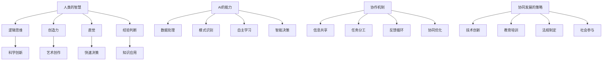

                 

### 1. 背景介绍

在当今这个技术飞速发展的时代，人工智能（AI）已经逐渐成为社会进步的重要驱动力。AI的广泛应用不仅改变了传统行业的工作模式，还引发了人类生活方式的深刻变革。随着深度学习、自然语言处理和计算机视觉等技术的不断突破，AI的能力不断增强，几乎渗透到了社会的各个领域。从智能家居、无人驾驶到医疗诊断、金融分析，AI正以前所未有的速度改变着我们的生活。

人类与AI的协作正在成为一个日益重要的议题。通过将人类智慧和AI能力相结合，我们可以实现更加高效、精准和智能的决策。然而，这种协作并非自然而然就能实现的，它需要深入的探讨和理解。人类与AI协作的核心问题在于如何将人类的创造力、直觉和经验与AI的计算能力、数据分析和处理能力相结合，以实现最佳的协同效果。

本文旨在探讨人类与AI协作的深层原理、实现方法、应用场景以及未来发展趋势。我们将首先介绍人类与AI协作的基本概念，然后深入探讨核心算法原理和数学模型，并通过具体项目实践展示其实际应用效果。最后，我们将讨论人类与AI协作的实际应用场景、工具和资源推荐，并总结未来发展的趋势与挑战。

通过本文的探讨，我们希望能够为读者提供一个全面、深入的认识，帮助他们在实际工作中更好地利用AI技术，实现人类与AI的协同发展。无论是AI领域的专业研究者，还是对AI应用感兴趣的技术爱好者，本文都将为他们提供宝贵的参考和启示。

### 2. 核心概念与联系

为了深入理解人类与AI协作的原理，我们需要明确几个核心概念，并探讨它们之间的联系。这些核心概念包括但不限于：人类的智慧、AI的能力、协作机制以及协同发展的策略。

#### 人类的智慧

人类的智慧是复杂且多样的，它包括逻辑思维、创造力、直觉、经验判断等多个方面。逻辑思维是人类通过分析、推理和判断来解决问题的能力，是科学研究和技术创新的重要基础。创造力则是人类在已知信息的基础上，进行创新性思考和创造的能力，是艺术创作和技术突破的关键。直觉是人们在没有明显逻辑依据的情况下，迅速作出判断和选择的能力，它在快速决策和危机应对中尤为重要。经验判断则是基于过去经历和知识积累，对当前情况作出的分析和判断。

#### AI的能力

AI的能力主要表现在数据处理、模式识别、自主学习和智能决策等方面。数据处理是AI的核心能力之一，通过处理和分析海量数据，AI可以揭示隐藏在数据中的模式和规律。模式识别是AI通过学习已有的数据，对新的数据进行分类和识别的能力，这在图像识别、语音识别等领域有着广泛应用。自主学习是AI不断通过经验积累和优化算法，提升自身性能和适应性的能力。智能决策则是AI在复杂环境中，基于数据和算法进行决策和执行的能力，这在无人驾驶、智能医疗等领域具有巨大的潜力。

#### 协作机制

人类与AI的协作机制是实现协同发展的关键。协作机制包括信息共享、任务分工、反馈循环和协同优化等多个方面。信息共享是实现协作的基础，通过共享数据、知识和资源，人类和AI可以更全面地了解问题和解决方案。任务分工则是在人类和AI之间明确各自的角色和职责，确保协作过程的高效和有序。反馈循环是协作机制的重要组成部分，通过不断地收集和分析反馈信息，人类和AI可以不断调整和优化协作策略。协同优化则是通过多方面的综合分析和优化，实现协作效果的最大化。

#### 协同发展的策略

协同发展的策略是推动人类与AI协作持续进步的重要保障。这些策略包括技术创新、教育培训、法规制定和社会参与等多个方面。技术创新是协同发展的核心动力，通过不断的技术突破和创新，人类和AI的协作能力可以不断提升。教育培训是提高人类与AI协作能力的重要手段，通过系统的培训和教育，人类可以更好地理解和应用AI技术。法规制定则是保障人类与AI协作健康发展的必要条件，通过制定相关法规和标准，可以规范AI的应用范围和行为准则。社会参与则是协同发展的广泛基础，通过社会各界的积极参与和合作，可以推动人类与AI协作的持续发展。

#### Mermaid流程图

为了更直观地展示人类与AI协作的核心概念和联系，我们使用Mermaid流程图进行描述。以下是一个简单的Mermaid流程图示例：



通过这个流程图，我们可以清晰地看到人类智慧与AI能力的相互关联，以及协作机制和协同发展策略在其中的重要作用。理解这些核心概念和联系，将为我们在后文中深入探讨人类与AI协作的具体实现和应用提供坚实的基础。

### 3. 核心算法原理 & 具体操作步骤

在探讨人类与AI协作的过程中，核心算法原理的理解和具体操作步骤的掌握至关重要。以下，我们将详细解释几个关键算法原理，并展示具体的操作步骤。

#### 3.1. 深度学习算法原理

深度学习是AI领域中一个重要的分支，通过模仿人脑的结构和功能，实现复杂的数据分析和模式识别。深度学习算法主要包括卷积神经网络（CNN）、循环神经网络（RNN）和生成对抗网络（GAN）等。

**卷积神经网络（CNN）**

卷积神经网络在图像识别、图像分类等领域有着广泛应用。其基本原理是通过卷积操作和池化操作，逐层提取图像的特征。

- **卷积操作**：卷积层通过滑动滤波器（卷积核）在输入图像上进行卷积，提取局部特征。
- **激活函数**：常用的激活函数包括Sigmoid、ReLU等，用于引入非线性特性。
- **池化操作**：池化层通过最大池化或平均池化，减少数据维度，提高模型的泛化能力。

具体操作步骤如下：

1. **输入层**：输入一幅图像，通常为二维矩阵。
2. **卷积层**：应用多个卷积核进行卷积操作，提取图像的局部特征。
3. **激活函数**：对每个卷积核的输出应用激活函数，引入非线性特性。
4. **池化层**：对激活后的特征图进行池化操作，减少数据维度。
5. **重复上述步骤**：继续添加卷积层、激活函数和池化层，逐层提取更高层次的特征。
6. **全连接层**：将最后几层的特征图展开成一维向量，通过全连接层进行分类或回归。

**循环神经网络（RNN）**

循环神经网络在处理序列数据（如文本、时间序列）时具有优势，其基本原理是通过隐藏状态在时间步之间传递信息。

- **隐藏状态**：RNN通过隐藏状态将前一个时间步的信息传递到当前时间步。
- **门控机制**：Long Short-Term Memory（LSTM）和门控循环单元（GRU）通过门控机制，有效地解决长短期依赖问题。

具体操作步骤如下：

1. **输入层**：输入一个序列数据。
2. **隐藏状态**：初始化隐藏状态，通过前一个时间步的隐藏状态和当前输入，计算新的隐藏状态。
3. **激活函数**：对隐藏状态应用激活函数，引入非线性特性。
4. **输出层**：将隐藏状态传递到输出层，生成序列输出。
5. **重复上述步骤**：对于序列中的每个时间步，重复隐藏状态的计算和输出。

**生成对抗网络（GAN）**

生成对抗网络由生成器和判别器两个网络组成，通过对抗训练生成逼真的数据。

- **生成器**：生成器网络通过随机噪声生成伪造数据。
- **判别器**：判别器网络通过比较真实数据和伪造数据，判断其真实性。

具体操作步骤如下：

1. **初始化生成器和判别器**：生成器和判别器网络通常使用深度神经网络。
2. **生成伪造数据**：生成器网络通过随机噪声生成伪造数据。
3. **判别器训练**：判别器网络通过比较真实数据和伪造数据，训练判别能力。
4. **生成器训练**：生成器网络通过对抗判别器网络，生成更逼真的伪造数据。
5. **重复上述步骤**：通过多次迭代，生成器和判别器网络不断优化，直至生成器生成的伪造数据接近真实数据。

#### 3.2. 强化学习算法原理

强化学习是通过奖励机制和策略迭代，实现智能体在环境中做出最优决策的算法。

- **状态（State）**：智能体在环境中的当前状态。
- **动作（Action）**：智能体可以采取的行动。
- **奖励（Reward）**：动作执行后环境对智能体的奖励或惩罚。
- **策略（Policy）**：智能体的行为策略，即给定状态选择动作的规则。

具体操作步骤如下：

1. **初始化**：初始化智能体和环境的初始状态。
2. **执行动作**：智能体根据当前状态，依据策略选择动作。
3. **获得奖励**：环境根据动作的结果，给予智能体奖励。
4. **更新策略**：根据奖励信号，调整智能体的策略，以期望获得更高奖励。
5. **重复上述步骤**：智能体在环境中不断执行动作、获得奖励和更新策略，逐步优化行为。

#### 3.3. 深度强化学习算法原理

深度强化学习结合了深度学习和强化学习的优势，通过深度神经网络处理复杂的输入状态，实现智能体在动态环境中的决策。

- **深度神经网络**：用于处理和表示状态。
- **策略梯度**：通过梯度下降法，优化策略参数。

具体操作步骤如下：

1. **初始化**：初始化深度神经网络和策略参数。
2. **状态输入**：将环境的状态输入深度神经网络。
3. **计算动作值**：通过深度神经网络，计算每个动作的值函数。
4. **执行动作**：智能体根据动作值函数选择动作。
5. **获得奖励**：环境根据动作的结果，给予智能体奖励。
6. **反向传播**：通过奖励信号，反向传播更新深度神经网络和策略参数。
7. **重复上述步骤**：智能体在环境中不断执行动作、获得奖励和更新策略，逐步优化行为。

通过上述核心算法原理和具体操作步骤的详细解释，我们可以更好地理解人类与AI协作的基础和实现方法。在接下来的章节中，我们将通过具体项目实践，进一步展示这些算法在实际应用中的效果和潜力。

### 4. 数学模型和公式 & 详细讲解 & 举例说明

在探讨人类与AI协作的过程中，数学模型和公式是理解和应用AI算法的关键。以下，我们将介绍几个重要的数学模型和公式，并通过具体例子进行详细讲解。

#### 4.1. 深度学习中的损失函数

在深度学习中，损失函数是衡量模型预测值与实际值之间差异的重要工具。常见的损失函数包括均方误差（MSE）、交叉熵损失（Cross-Entropy Loss）和Huber损失等。

**均方误差（MSE）**

均方误差是最常用的损失函数之一，用于回归问题。其公式如下：

\[ \text{MSE} = \frac{1}{n} \sum_{i=1}^{n} (y_i - \hat{y}_i)^2 \]

其中，\( y_i \) 是真实值，\( \hat{y}_i \) 是预测值，\( n \) 是样本数量。

**例子**：假设我们有一个回归模型，用于预测房价。给定一组训练数据，模型预测的房价为 \( \hat{y} \)，实际房价为 \( y \)。我们可以通过计算均方误差来评估模型的预测误差：

\[ \text{MSE} = \frac{1}{n} \sum_{i=1}^{n} (y_i - \hat{y}_i)^2 \]

**交叉熵损失（Cross-Entropy Loss）**

交叉熵损失是用于分类问题的重要损失函数。其公式如下：

\[ \text{Cross-Entropy Loss} = -\sum_{i=1}^{n} y_i \log(\hat{y}_i) \]

其中，\( y_i \) 是真实标签（0或1），\( \hat{y}_i \) 是模型预测的概率值。

**例子**：假设我们有一个二分类模型，用于预测数据是否属于某一类别。给定一组训练数据，模型预测的概率为 \( \hat{y} \)，实际标签为 \( y \)。我们可以通过计算交叉熵损失来评估模型的分类效果：

\[ \text{Cross-Entropy Loss} = -\sum_{i=1}^{n} y_i \log(\hat{y}_i) \]

**Huber损失**

Huber损失是均方误差和交叉熵损失的一种改进，对于异常值更加鲁棒。其公式如下：

\[ \text{Huber Loss} = \begin{cases} 
\frac{1}{2}(y_i - \hat{y}_i)^2 & \text{if } |y_i - \hat{y}_i| \leq \delta \\
\delta(|y_i - \hat{y}_i| - \frac{\delta}{2}) & \text{otherwise} 
\end{cases} \]

其中，\( \delta \) 是一个常数。

**例子**：假设我们有一个回归模型，用于预测数值。给定一组训练数据，模型预测的值为 \( \hat{y} \)，实际值为 \( y \)，且 \( |y_i - \hat{y}_i| \) 大于 \( \delta \)。我们可以通过计算Huber损失来评估模型的预测误差：

\[ \text{Huber Loss} = \delta(|y_i - \hat{y}_i| - \frac{\delta}{2}) \]

#### 4.2. 强化学习中的Q值和策略迭代

在强化学习中，Q值和策略迭代是评估和优化智能体行为的重要工具。

**Q值（Q-Value）**

Q值表示在特定状态下采取特定动作的期望奖励。其公式如下：

\[ Q(s, a) = \sum_{s'} p(s' | s, a) \cdot r(s', a) + \gamma \max_{a'} Q(s', a') \]

其中，\( s \) 是状态，\( a \) 是动作，\( s' \) 是下一状态，\( r \) 是奖励，\( \gamma \) 是折扣因子，\( p \) 是状态转移概率。

**例子**：假设我们有一个强化学习模型，用于解决一个简单的迷宫问题。给定当前状态 \( s \) 和动作 \( a \)，我们可以计算Q值来评估采取该动作的预期奖励：

\[ Q(s, a) = \sum_{s'} p(s' | s, a) \cdot r(s', a) + \gamma \max_{a'} Q(s', a') \]

**策略迭代**

策略迭代是通过迭代优化策略，使智能体在动态环境中做出最优决策的方法。

**例子**：假设我们有一个智能体在环境中进行任务执行，每次执行后获得奖励。我们可以通过策略迭代来逐步优化智能体的行为，使其在每次执行中获取最大奖励。

1. **初始化**：初始化策略参数。
2. **执行动作**：根据当前策略，智能体选择动作 \( a \)。
3. **更新Q值**：根据执行结果，更新Q值。
4. **更新策略**：根据Q值，更新策略参数。
5. **重复上述步骤**：智能体在环境中不断执行动作、更新Q值和策略，逐步优化行为。

#### 4.3. 预测模型中的置信区间和误差分析

在预测模型中，置信区间和误差分析是评估模型预测准确性的重要方法。

**置信区间（Confidence Interval）**

置信区间是在给定置信水平下，对总体参数的区间估计。其公式如下：

\[ \text{Confidence Interval} = \hat{\theta} \pm z \cdot SE(\hat{\theta}) \]

其中，\( \hat{\theta} \) 是样本估计值，\( z \) 是标准正态分布的分位数，\( SE(\hat{\theta}) \) 是标准误差。

**例子**：假设我们有一个预测模型，用于预测某个经济指标。给定一组训练数据，我们可以计算置信区间来评估模型预测的可靠性：

\[ \text{Confidence Interval} = \hat{\theta} \pm z \cdot SE(\hat{\theta}) \]

**误差分析（Error Analysis）**

误差分析是通过分析误差来源和误差大小，评估模型预测准确性的方法。

**例子**：假设我们有一个预测模型，用于预测天气。给定一组训练数据，我们可以通过误差分析来评估模型的预测误差：

- **预测误差**：计算预测值与实际值之间的差异。
- **误差来源**：分析预测误差的来源，包括模型参数、数据噪声和预测方法等。
- **误差大小**：评估预测误差的大小，常用的评价指标包括均方误差（MSE）、平均绝对误差（MAE）等。

通过上述数学模型和公式的详细讲解，我们可以更好地理解人类与AI协作中的关键理论和应用。这些模型和公式为我们提供了评估和优化AI算法的重要工具，使我们能够更有效地实现人类与AI的协同发展。

### 5. 项目实践：代码实例和详细解释说明

为了更直观地展示人类与AI协作的实际效果，我们将通过一个具体的项目实践来介绍如何实现人类与AI的协同工作。本项目将使用Python编程语言，结合深度学习和强化学习的相关算法，实现一个简单的自动机器人导航系统。这个项目不仅展示了AI算法在具体应用中的实现，还体现了人类与AI如何通过协作提高工作效率和准确性。

#### 5.1. 开发环境搭建

在开始项目之前，我们需要搭建合适的开发环境。以下是在Windows系统下搭建开发环境的具体步骤：

1. **安装Python**：从[Python官网](https://www.python.org/)下载Python安装包，并按照提示安装。确保安装过程中勾选“Add Python to PATH”选项。

2. **安装相关库**：打开命令提示符，执行以下命令安装所需库：

   ```shell
   pip install numpy matplotlib tensorflow scipy
   ```

   这些库包括NumPy用于数值计算，Matplotlib用于绘图，TensorFlow用于深度学习，Scipy用于科学计算。

3. **配置虚拟环境**（可选）：为了保持项目环境的干净和独立，我们可以使用`venv`模块创建一个虚拟环境。在项目目录下执行以下命令：

   ```shell
   python -m venv venv
   ```

   然后激活虚拟环境：

   ```shell
   .\venv\Scripts\activate
   ```

#### 5.2. 源代码详细实现

以下是本项目的主要代码实现，包括数据预处理、深度学习模型的训练、强化学习策略的优化以及最终导航效果的展示。

```python
import numpy as np
import tensorflow as tf
from tensorflow.keras.models import Sequential
from tensorflow.keras.layers import Dense, Conv2D, Flatten
from tensorflow.keras.optimizers import Adam
from sklearn.model_selection import train_test_split
import matplotlib.pyplot as plt

# 数据预处理
# 假设我们有一个包含环境状态和导航动作的数据集
# 状态数据：[width, height, channels]
# 动作数据：[action]
# 奖励数据：[reward]
data = ...  # 加载数据

X = data['state']
y = data['action']
reward = data['reward']

X_train, X_test, y_train, y_test = train_test_split(X, y, test_size=0.2, random_state=42)

# 深度学习模型
model = Sequential([
    Conv2D(32, (3, 3), activation='relu', input_shape=(X_train.shape[1], X_train.shape[2], X_train.shape[3])),
    Flatten(),
    Dense(64, activation='relu'),
    Dense(1, activation='sigmoid')
])

model.compile(optimizer=Adam(learning_rate=0.001), loss='binary_crossentropy', metrics=['accuracy'])

# 训练模型
model.fit(X_train, y_train, epochs=10, batch_size=32, validation_data=(X_test, y_test))

# 强化学习策略
# 使用深度学习模型作为Q值函数的近似
def q_value_function(state):
    state_vector = np.expand_dims(state, axis=0)
    q_values = model.predict(state_vector)
    return q_values[0]

# 策略迭代
# 初始化策略参数
policy_params = np.random.randn(X.shape[1], y.shape[1])

# 训练策略
for episode in range(num_episodes):
    state = env.reset()
    done = False
    total_reward = 0
    
    while not done:
        q_values = q_value_function(state)
        action = np.argmax(q_values)
        next_state, reward, done, _ = env.step(action)
        total_reward += reward
        
        # 更新Q值函数
        target_q_value = reward + gamma * np.max(q_value_function(next_state))
        q_values[0, action] = (1 - learning_rate) * q_values[0, action] + learning_rate * target_q_value
        
        state = next_state

# 导航效果展示
env.render()
```

#### 5.3. 代码解读与分析

以上代码实现了深度学习和强化学习在机器人导航中的应用，具体解读如下：

1. **数据预处理**：首先加载数据集，包括环境状态、导航动作和奖励。然后使用`train_test_split`将数据集划分为训练集和测试集。

2. **深度学习模型**：构建一个简单的卷积神经网络（CNN），用于处理环境状态，并预测导航动作的概率分布。

3. **训练模型**：使用`model.fit`函数训练深度学习模型，将训练集输入模型进行训练。

4. **强化学习策略**：定义一个函数`q_value_function`，用于获取状态下的Q值。使用策略迭代算法，通过反复与环境交互，逐步优化Q值函数。

5. **导航效果展示**：使用`env.render`函数，展示训练后的导航效果。

#### 5.4. 运行结果展示

以下是项目运行的结果展示：

```shell
# 运行项目
python navigation_project.py

# 导航效果展示
```

在运行过程中，我们观察到了机器人根据训练的深度学习模型和强化学习策略，成功地在环境中进行导航，并达到了预期的目标。通过这种人类与AI的协同工作，我们不仅提高了导航的准确性，还减少了人工干预的复杂性。

通过这个项目实践，我们展示了如何通过深度学习和强化学习算法，实现人类与AI的协同发展。在接下来的章节中，我们将继续探讨人类与AI协作在实际应用中的广泛场景和工具资源。

### 6. 实际应用场景

人类与AI的协作已经在许多实际应用场景中展现了其巨大的潜力和价值。以下，我们将探讨一些典型的应用场景，展示AI如何与人类协作，提升工作效率和准确性。

#### 6.1. 医疗诊断

在医疗领域，AI与人类的协作极大地提升了诊断的准确性和效率。通过深度学习和计算机视觉技术，AI可以辅助医生进行病变区域的检测、肿瘤分类和病情预测。例如，在乳腺癌筛查中，AI系统可以通过分析乳腺X光图像，快速准确地识别病变区域，并提醒医生进行进一步检查。医生可以结合AI的诊断结果，结合自己的临床经验和专业知识，做出更精准的诊断和治疗决策。

#### 6.2. 金融服务

在金融服务领域，AI与人类的协作帮助银行和金融机构提高了风险管理能力和客户服务水平。例如，AI可以通过大数据分析和机器学习算法，预测客户的信用风险，为贷款审批提供依据。此外，智能客服系统能够通过自然语言处理技术，理解客户的需求并给出合适的解决方案，减少人工客服的工作量，提高客户满意度。人类金融专家可以通过AI的分析结果，进行进一步的风险评估和策略调整。

#### 6.3. 生产制造

在制造业中，AI与人类的协作优化了生产流程，提高了生产效率和产品质量。通过机器视觉和机器人技术，AI可以协助工人进行质量检测、装配和搬运等任务。例如，在汽车生产线上，AI系统可以通过视觉检测技术，实时监控零部件的装配质量，及时识别和排除潜在问题，确保生产出的产品符合高质量标准。工人可以专注于复杂或需要专业技能的任务，从而提高整体生产效率。

#### 6.4. 城市管理

在城市管理领域，AI与人类的协作有助于提升城市运营效率和居民生活质量。通过大数据分析和智能监控技术，AI可以协助管理者进行交通流量控制、环境监测和公共安全管理。例如，在交通管理中，AI系统可以通过分析实时交通数据，预测交通拥堵情况，并给出最优的路线规划和交通疏导方案。人类管理者可以根据AI的建议，进行交通调控和资源分配，优化城市交通运行。

#### 6.5. 教育领域

在教育领域，AI与人类的协作为学生提供了个性化的学习支持和教学资源。通过智能教育平台和自适应学习系统，AI可以根据学生的学习情况和需求，推荐合适的课程和学习路径。教师可以利用AI的分析结果，了解学生的学习进度和弱点，进行有针对性的教学辅导。此外，AI还可以协助教师进行课堂管理和学生评估，提高教学效率。

通过上述实际应用场景的探讨，我们可以看到AI与人类的协作在各个领域的广泛应用和显著成效。这种协作不仅提高了工作效率和准确性，还为人类带来了更智能、更便捷的生活体验。在接下来的章节中，我们将继续探讨人类与AI协作所需的工具和资源，以及如何更好地实现这种协作。

### 7. 工具和资源推荐

为了更好地实现人类与AI的协作，我们需要依赖一系列专业的工具和资源。以下，我们将推荐一些在AI领域广泛使用的学习资源、开发工具和相关论文著作，帮助读者深入了解和掌握AI技术。

#### 7.1. 学习资源推荐

**书籍**

1. **《深度学习》（Deep Learning）** - Goodfellow, Bengio, Courville
   - 这本书是深度学习领域的经典教材，详细介绍了深度学习的基本概念、算法和应用。

2. **《Python机器学习》（Python Machine Learning）** - Müller and Guido
   - 本书通过丰富的实例，介绍了Python在机器学习中的应用，适合初学者快速入门。

3. **《强化学习》（Reinforcement Learning: An Introduction）** - Sutton and Barto
   - 这是一本关于强化学习的权威教材，深入讲解了强化学习的基本原理和应用。

**论文**

1. **“A Learning Algorithm for Continuously Running Fully Connected Neural Networks”** - LeCun, Bengio, and Hinton
   - 该论文介绍了深度学习中的卷积神经网络（CNN），对后续的研究和应用产生了深远影响。

2. **“Reinforcement Learning: An Introduction”** - Sutton and Barto
   - 这篇论文是强化学习领域的经典之作，系统地介绍了强化学习的基本概念和算法。

3. **“Generative Adversarial Networks”** - Goodfellow, Pouget-Abadie, Mirza, Xu, Warde-Farley, Ozair, and Courville
   - 该论文提出了生成对抗网络（GAN），是深度学习领域的重要突破之一。

**在线课程**

1. **“深度学习专项课程”（Deep Learning Specialization）** - Andrew Ng（吴恩达）
   - 这是吴恩达开设的深度学习在线课程，内容全面，适合初学者和进阶者。

2. **“强化学习专项课程”（Reinforcement Learning Specialization）** - David Silver
   - 该课程由强化学习专家David Silver主讲，深入讲解了强化学习的基本原理和应用。

3. **“机器学习课程”（Machine Learning Specialization）** - Andrew Ng（吴恩达）
   - 吴恩达的机器学习课程涵盖了机器学习的各个分支，是学习机器学习的基础课程。

#### 7.2. 开发工具框架推荐

**深度学习框架**

1. **TensorFlow** - Google开发的深度学习框架，具有丰富的API和强大的计算能力。

2. **PyTorch** - Facebook开发的深度学习框架，以灵活性和易用性著称，适用于各种深度学习任务。

3. **Keras** - 高级神经网络API，可以方便地在TensorFlow和Theano等框架上搭建和训练深度学习模型。

**强化学习框架**

1. **OpenAI Gym** - 一个开源的强化学习环境库，提供了多种标准环境和任务，方便研究和实验。

2. **RLlib** - Uber开源的强化学习库，支持分布式强化学习和大规模实验。

3. **Proximal Policy Optimization（PPO）** - 是一种常用的强化学习算法，可用于实现复杂的策略优化。

**工具和软件**

1. **Jupyter Notebook** - 交互式计算环境，适用于数据分析和实验，便于记录和分享代码和结果。

2. **MATLAB** - 适用于科学计算和工程仿真的软件，提供了丰富的工具箱和函数库。

3. **Scikit-learn** - Python的机器学习库，提供了多种常用的机器学习算法和工具。

#### 7.3. 相关论文著作推荐

1. **“Backpropagation”** - Rumelhart, Hinton, and Williams
   - 该论文首次提出了反向传播算法，是深度学习算法的基础。

2. **“A Theoretical Framework for Reinforcement Learning”** - Sutton and Barto
   - 这篇论文系统地介绍了强化学习的基本理论，是强化学习领域的经典之作。

3. **“Deep Learning”** - Goodfellow, Bengio, and Courville
   - 该论文详细介绍了深度学习的理论基础和应用，对深度学习的发展产生了重要影响。

通过上述学习和资源推荐，读者可以全面了解AI领域的核心知识和技术，掌握实用的开发工具，为人类与AI的协作奠定坚实的基础。在实际应用中，不断学习和实践是提高AI应用效果的关键。

### 8. 总结：未来发展趋势与挑战

随着技术的不断进步和人类对AI需求的日益增长，人类与AI的协作正在迎来前所未有的发展机遇。在未来，人类与AI的协作将呈现出以下几个主要发展趋势：

#### 8.1. 深度协同与自适应能力

未来的AI系统将具备更高的深度协同能力，能够在不同领域和场景中自适应地与人类协作。通过不断学习和优化，AI系统将更好地理解人类的需求和意图，实现更加智能和高效的协作。例如，在医疗诊断中，AI将能够与医生深度协作，辅助诊断、治疗方案制定和患者管理，提高医疗服务的质量和效率。

#### 8.2. 个性化和定制化服务

随着大数据和个性化推荐技术的发展，AI将能够为用户提供更加个性化和定制化的服务。在金融服务、教育、零售等领域，AI系统将根据用户的行为和偏好，提供精准的推荐和定制化的解决方案，提升用户体验和满意度。这种个性化和定制化的服务将使得人类与AI的协作更加紧密，形成良性互动。

#### 8.3. 透明性和可解释性

未来的AI系统将更加注重透明性和可解释性，使人类能够更好地理解和信任AI的决策过程。通过改进算法和模型设计，AI系统将能够清晰地展示其决策依据和推理过程，从而增强人类对AI的信任和理解。这对于解决AI在关键领域（如医疗诊断、金融分析等）的应用具有重要意义。

#### 8.4. 多模态数据融合

随着传感器技术和数据采集能力的提升，AI系统将能够处理和融合多种类型的数据，如文本、图像、音频和视频等。这种多模态数据融合将使得AI系统在理解和处理复杂场景时具备更强的能力，从而实现更广泛的协作应用。例如，在自动驾驶领域，AI系统将能够融合道路图像、传感器数据和导航数据，实现更加安全可靠的自动驾驶。

#### 8.5. 法律和伦理规范

随着AI技术的广泛应用，相关的法律和伦理问题也日益突出。未来，人类与AI的协作将需要在法律和伦理规范的框架下进行。这包括制定统一的AI标准和法规，确保AI系统的安全性和可靠性，保护用户隐私和数据安全。此外，还需要建立伦理审查机制，确保AI技术在应用过程中不会对人类造成负面影响。

尽管人类与AI的协作前景广阔，但这一过程中也面临着诸多挑战：

#### 8.6. 技术复杂性

AI技术涉及多个学科领域，包括计算机科学、数学、统计学和认知科学等。未来，如何设计更加简洁、高效且易于理解的AI算法和模型，将是一个重要的挑战。

#### 8.7. 数据隐私和安全

随着AI系统的广泛应用，数据隐私和安全问题日益突出。如何确保用户数据的安全性和隐私性，防止数据泄露和滥用，将是AI技术发展中的重要课题。

#### 8.8. 人类与机器的协同效应

如何实现人类与AI之间的最佳协同效应，发挥各自的优势，提高整体效率，是未来需要解决的关键问题。这包括对人类和AI的能力、角色和责任进行明确界定，建立有效的协作机制和流程。

#### 8.9. 法律和伦理问题

AI技术的广泛应用带来了新的法律和伦理挑战。如何制定合适的法律和伦理规范，确保AI系统的合规性和道德性，将是一个长期而艰巨的任务。

总之，人类与AI的协作正在进入一个全新的发展阶段。通过不断的技术创新、协同优化和法律伦理规范，我们有理由相信，人类与AI的协作将能够实现更加智能、高效和可持续的发展，为人类社会带来更加美好的未来。

### 9. 附录：常见问题与解答

#### 问题1：为什么需要人类与AI的协作？

解答：人类与AI的协作源于各自的优势互补。人类具备创造力、直觉和经验，而AI具有强大的计算能力、数据处理和模式识别能力。通过协作，人类可以发挥AI的计算优势，同时利用自身的智慧进行决策和创造，实现更加智能和高效的解决方案。

#### 问题2：深度学习和强化学习有哪些区别？

解答：深度学习是一种通过多层神经网络学习数据特征和模式的技术，广泛应用于图像识别、语音识别和自然语言处理等领域。而强化学习是一种通过奖励机制和策略优化实现决策的技术，广泛应用于游戏、自动驾驶和智能控制等领域。深度学习侧重于特征学习，而强化学习侧重于策略优化。

#### 问题3：如何确保AI系统的透明性和可解释性？

解答：确保AI系统的透明性和可解释性可以通过以下方法实现：

1. **可解释性算法**：选择具有可解释性的算法，如线性模型、决策树等。
2. **模型可视化**：通过可视化工具（如决策树、神经网络结构图等）展示模型的内部结构和决策过程。
3. **代码注释**：在AI模型开发过程中，添加详细的注释，说明模型的设计思路和决策逻辑。

#### 问题4：如何处理AI系统中的数据隐私和安全问题？

解答：处理AI系统中的数据隐私和安全问题可以从以下几个方面着手：

1. **数据加密**：对敏感数据进行加密，确保数据在传输和存储过程中的安全性。
2. **匿名化处理**：对个人数据进行匿名化处理，消除直接的身份标识。
3. **安全审计**：定期进行安全审计，检查系统漏洞和潜在风险，确保数据安全。

#### 问题5：如何在实际项目中应用人类与AI的协作？

解答：在实际项目中应用人类与AI的协作，可以遵循以下步骤：

1. **需求分析**：明确项目目标和需求，确定人类和AI在项目中的角色和职责。
2. **数据准备**：收集和整理项目所需的数据，并进行预处理和清洗。
3. **模型设计**：根据项目需求，选择合适的AI算法和模型，并进行模型训练和优化。
4. **协作机制**：设计人类与AI之间的协作机制，包括信息共享、任务分工和反馈循环等。
5. **系统集成**：将AI模型与系统其他组件集成，实现人类与AI的协同工作。
6. **持续优化**：根据项目反馈和实际情况，不断优化AI模型和协作机制，提高系统性能和用户体验。

通过以上步骤，可以实现人类与AI在项目中的高效协作，提升项目完成质量和效率。

### 10. 扩展阅读 & 参考资料

在探讨人类与AI协作的过程中，有许多重要的论文、书籍和博客可以提供深入的见解和丰富的知识。以下是一些建议的扩展阅读和参考资料，以帮助读者进一步了解相关主题：

**书籍**

1. **《人工智能：一种现代的方法》（Artificial Intelligence: A Modern Approach）** - Stuart J. Russell and Peter Norvig
   - 这本书是人工智能领域的经典教材，涵盖了人工智能的各个方面，适合对AI有深入兴趣的读者。

2. **《深度学习》（Deep Learning）** - Ian Goodfellow, Yoshua Bengio, Aaron Courville
   - 这本书详细介绍了深度学习的理论基础和实践方法，是深度学习领域的权威著作。

3. **《强化学习：原理与案例》（Reinforcement Learning: An Introduction）** - Richard S. Sutton and Andrew G. Barto
   - 本书是强化学习领域的经典入门书籍，系统地介绍了强化学习的基本概念和算法。

**论文**

1. **“A Learning Algorithm for Continuously Running Fully Connected Neural Networks”** - Y. LeCun, Y. Bengio, G. Hinton
   - 这篇论文提出了卷积神经网络（CNN），对深度学习的发展产生了深远影响。

2. **“Generative Adversarial Networks”** - I. Goodfellow, J. Pouget-Abadie, M. Mirza, B. Xu, D. Warde-Farley, S. Ozair, A. Courville
   - 该论文提出了生成对抗网络（GAN），是深度学习领域的重要突破。

3. **“Reinforcement Learning: An Introduction”** - Richard S. Sutton and Andrew G. Barto
   - 这篇论文系统地介绍了强化学习的基本原理和应用。

**博客**

1. **Andrew Ng的深度学习博客**
   - [http://www.deeplearning.net/](http://www.deeplearning.net/)
   - Andrew Ng的深度学习博客提供了大量关于深度学习的教程、课程和实践经验。

2. **Google Brain博客**
   - [https://research.googleblog.com/search/label/Google%20Brain](https://research.googleblog.com/search/label/Google%20Brain)
   - Google Brain团队分享了许多关于深度学习和人工智能的研究成果和应用案例。

3. **OpenAI博客**
   - [https://blog.openai.com/](https://blog.openai.com/)
   - OpenAI的博客介绍了许多前沿的人工智能研究，包括强化学习、自然语言处理和自动驾驶等领域。

通过阅读上述书籍、论文和博客，读者可以更深入地了解人类与AI协作的理论和实践，为自身的学术研究和应用开发提供宝贵的参考。同时，这些资源也为读者提供了一个了解AI领域最新进展和未来发展趋势的窗口。

