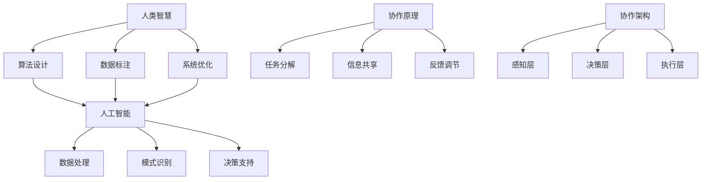

                 

### 1. 背景介绍

#### 1.1 人类与人工智能的历史与发展

人工智能（AI）作为计算机科学的一个分支，其发展历程可以追溯到20世纪50年代。最早的人工智能研究始于1956年的达特茅斯会议，会议上提出了“人工智能”这一术语，标志着人工智能作为一个独立领域的诞生。

自那时以来，人工智能经历了多个发展阶段，从早期的符号主义和知识表示，到基于规则的系统，再到以统计学习为主的机器学习时代，以及近年来的深度学习、强化学习等前沿技术。每一次技术突破都极大地推动了人工智能在各个领域的应用和发展。

在人工智能的发展过程中，人类智慧与计算机的智能逐步交织在一起。从最初的机械逻辑推理，到数据驱动的模式识别，再到如今的深度学习和神经网络，计算机在处理复杂任务、解决实际问题方面表现出越来越强大的能力。而人类则通过不断的探索和实践，逐步认识到自身智慧与人工智能相结合的巨大潜力。

#### 1.2 人工智能在现实世界中的应用

如今，人工智能已经渗透到我们生活的方方面面，从日常生活的智能家居、智能语音助手，到金融、医疗、教育等领域的智能化应用，人工智能正以惊人的速度改变着我们的世界。

在金融领域，人工智能被广泛应用于风险管理、客户服务、投资决策等方面。通过大数据分析和机器学习算法，金融机构能够更精确地预测市场走势，提高风险控制能力，为客户提供更个性化的金融服务。

在医疗领域，人工智能正助力医生进行疾病诊断、药物研发和治疗规划。通过分析海量医疗数据，人工智能可以帮助医生更快速、准确地诊断疾病，提高治疗的成功率。

在教育领域，人工智能正在改变传统的教学方式。智能教育平台可以根据学生的学习情况和兴趣，为学生提供个性化的学习路径和资源，提高学习效率。

此外，人工智能还在智能制造、自动驾驶、智能家居等领域发挥着重要作用，极大地提升了生产效率和生活质量。

#### 1.3 人类-AI协作的必要性

随着人工智能技术的不断进步，人类与人工智能之间的协作关系变得越来越紧密。然而，现有的协作模式仍然存在一些问题，如人类对人工智能的理解和掌握程度有限，人工智能在某些任务上仍无法完全替代人类等。

为了充分发挥人工智能的潜力，同时弥补人类在特定领域的不足，人类-AI协作成为一种必要的发展方向。通过协作，人类可以借助人工智能的强大计算能力和学习能力，提升自身的工作效率和创新力。同时，人工智能也可以通过学习人类的智慧和经验，不断优化自身的性能，实现更高水平的智能化。

本文将围绕人类-AI协作这一主题，探讨其核心概念、算法原理、数学模型、实际应用场景等，力求为读者提供一幅全面、深入的理解图景。

### 2. 核心概念与联系

#### 2.1 人类智慧与人工智能的定义

人类智慧是指人类在感知、思考、决策、创造等方面的能力，它是一种高度复杂且具有自适应性的认知系统。人类智慧的特点包括抽象思维、逻辑推理、情感判断、创新创造等。

人工智能则是指由人类设计并实现的、能够模拟人类智慧、执行复杂任务的计算机系统。人工智能的核心目标是使计算机具备自我学习和自主决策能力，从而在各个领域实现智能化。

#### 2.2 人类智慧与人工智能的关系

人类智慧与人工智能之间的关系可以看作是一种互补和协同的关系。人类智慧为人工智能提供了理论指导、算法设计、数据标注等方面的支持，而人工智能则为人类智慧提供了强大的计算能力和数据处理能力。

具体来说，人类智慧在以下几个方面对人工智能产生了重要影响：

1. **算法设计**：人类智慧通过对问题本质的理解，设计出各种算法，使计算机能够高效地解决复杂问题。
2. **数据标注**：人类智慧通过对数据的理解和分析，为机器学习模型提供高质量的标注数据，从而提高模型的性能。
3. **系统优化**：人类智慧通过对系统的运行和反馈进行分析，对人工智能系统进行优化和调整，提高其性能和稳定性。

而人工智能则为人类智慧提供了以下支持：

1. **数据处理**：人工智能能够快速处理海量数据，为人类智慧提供丰富的信息支持，帮助人类更好地理解和解决问题。
2. **模式识别**：人工智能在图像识别、语音识别等领域具有强大的能力，可以帮助人类智慧更高效地处理和分析复杂信息。
3. **决策支持**：人工智能可以通过模拟和预测，为人类智慧提供决策支持，帮助人类做出更明智的决策。

#### 2.3 人类-AI协作的原理

人类-AI协作的原理可以概括为以下几个关键点：

1. **任务分解**：将复杂任务分解为多个子任务，人类和人工智能分别负责不同子任务的执行。
2. **信息共享**：人类和人工智能通过共享信息和数据，实现任务的协同完成。
3. **反馈调节**：人类和人工智能通过相互反馈，不断调整和优化协作过程，提高协作效果。

具体来说，人类-AI协作的原理包括以下几个方面：

1. **任务分配**：根据人类和人工智能的能力和特点，将任务合理地分配给双方，充分发挥各自的优势。
2. **数据融合**：将人类和人工智能处理的数据进行融合，形成更全面、准确的信息，为决策提供支持。
3. **协同决策**：人类和人工智能通过协同决策，提高决策的效率和准确性。
4. **自主学习**：人类和人工智能通过相互学习和反馈，不断提高自身的性能和能力。

#### 2.4 人类-AI协作的架构

人类-AI协作的架构可以分为三个主要层次：感知层、决策层和执行层。

1. **感知层**：感知层负责收集和处理各种数据，包括人类输入的数据和人工智能生成的数据。感知层的主要功能是对数据进行预处理和特征提取，为后续的决策层提供支持。
2. **决策层**：决策层负责基于感知层提供的数据，进行复杂的推理和决策。决策层可以由人类单独决策，也可以由人类和人工智能协同决策。
3. **执行层**：执行层负责将决策层生成的决策结果转化为具体的行动，实现任务的执行。执行层可以由人类执行，也可以由人工智能执行，或者由人类和人工智能共同执行。

#### 2.5 人类-AI协作的优势

人类-AI协作具有以下几个显著的优势：

1. **提升效率**：通过人工智能的强大计算能力和数据处理能力，可以大幅提升人类在复杂任务中的工作效率。
2. **拓展能力**：人工智能可以在某些领域和任务上实现超越人类的能力，为人类智慧提供强大的支持。
3. **降低成本**：人工智能可以替代人类在某些领域的重复性劳动，降低人力成本。
4. **增强创新**：人类-AI协作可以激发人类的创造力，促进新的技术、产品和解决方案的诞生。

#### 2.6 人类-AI协作面临的挑战

尽管人类-AI协作具有诸多优势，但在实际应用过程中也面临着一系列挑战：

1. **信任问题**：人类对人工智能的信任程度较低，担心人工智能可能产生不可预测的行为或错误。
2. **数据隐私**：人工智能需要处理大量敏感数据，如何保障数据隐私成为一大挑战。
3. **责任归属**：当人工智能出现错误或导致事故时，如何界定责任归属成为法律和伦理上的难题。
4. **技术瓶颈**：人工智能在某些领域仍存在技术瓶颈，难以完全替代人类智慧。

#### 2.7 核心概念原理与架构的 Mermaid 流程图

为了更直观地展示人类智慧与人工智能、人类-AI协作的关系，下面使用 Mermaid 语法绘制一个流程图：



这个流程图展示了人类智慧如何影响人工智能的设计和应用，以及人类-AI协作的基本原理和架构。通过这个流程图，我们可以更清晰地理解人类智慧与人工智能、人类-AI协作之间的关系。

### 3. 核心算法原理 & 具体操作步骤

#### 3.1 人类-AI协作的核心算法

人类-AI协作的核心算法可以分为以下几个部分：任务分解、协同决策、反馈调节和自主学习。下面将逐一介绍这些算法的基本原理和具体操作步骤。

#### 3.1.1 任务分解

任务分解是将复杂任务分解为多个可执行子任务的过程。任务分解算法的基本原理是根据人类和人工智能的能力和特点，将任务合理地分配给双方。

**具体操作步骤**：

1. **任务识别**：首先，人类需要识别出需要完成的复杂任务，并明确任务的目标和要求。
2. **能力评估**：接着，人类需要评估自己和人工智能在各个子任务上的能力和效率。
3. **任务分配**：根据评估结果，将任务合理地分配给人类和人工智能。对于人类擅长的任务，由人类执行；对于人工智能擅长的任务，由人工智能执行。
4. **任务细化**：对于分配给人工智能的任务，需要进一步细化，明确具体的执行步骤和要求。

#### 3.1.2 协同决策

协同决策是人类和人工智能在完成各自任务的基础上，共同做出最优决策的过程。协同决策算法的基本原理是充分利用人类和人工智能的优势，提高决策的效率和准确性。

**具体操作步骤**：

1. **信息收集**：人类和人工智能分别收集与任务相关的数据和信息。
2. **信息融合**：将人类和人工智能收集到的信息进行融合，形成更全面、准确的数据集。
3. **模型构建**：基于融合后的数据集，构建一个或多个决策模型，用于预测任务的结果。
4. **模型优化**：通过反复实验和调整，优化决策模型，提高其预测准确性和效率。
5. **协同决策**：人类和人工智能基于优化后的决策模型，共同做出最优决策。

#### 3.1.3 反馈调节

反馈调节是通过不断收集和分析执行过程中的反馈，调整和优化协作过程，提高协作效果的过程。反馈调节算法的基本原理是利用反馈机制，实现人类和人工智能之间的动态调整。

**具体操作步骤**：

1. **执行监控**：在任务执行过程中，实时监控任务的执行情况和结果。
2. **反馈收集**：收集执行过程中的各种反馈信息，包括任务执行的时间、效率、错误率等。
3. **反馈分析**：对收集到的反馈信息进行分析，找出协作过程中的问题和不足。
4. **调整优化**：根据反馈分析的结果，对协作过程进行调整和优化，提高协作效率。
5. **反馈闭环**：将调整后的协作过程反馈给执行层，形成反馈闭环，不断优化协作效果。

#### 3.1.4 自主学习

自主学习是通过机器学习算法，使人工智能系统在执行任务的过程中不断学习和优化自身性能的过程。自主学习算法的基本原理是利用数据驱动的方法，使人工智能系统具备自我改进的能力。

**具体操作步骤**：

1. **数据收集**：在任务执行过程中，收集与任务相关的各种数据，包括输入数据、中间结果和最终结果。
2. **模型训练**：利用收集到的数据，训练机器学习模型，使其能够根据输入数据预测输出结果。
3. **模型评估**：对训练好的模型进行评估，包括准确率、召回率、F1值等指标。
4. **模型优化**：根据评估结果，对模型进行调整和优化，提高其预测准确性和效率。
5. **模型应用**：将优化后的模型应用到实际任务中，实现人工智能系统的自我学习和优化。

#### 3.2 核心算法的实现步骤

下面我们将详细介绍人类-AI协作核心算法的具体实现步骤，包括任务分解、协同决策、反馈调节和自主学习的实现过程。

**3.2.1 任务分解的实现步骤**

1. **任务识别**：使用自然语言处理（NLP）技术，将人类输入的自然语言任务描述转化为结构化的任务表示。
2. **能力评估**：利用人类和人工智能的属性数据，构建一个能力评估模型，评估双方在各个子任务上的能力和效率。
3. **任务分配**：基于能力评估结果，使用优化算法（如线性规划、遗传算法等）进行任务分配，使任务分配达到最优。
4. **任务细化**：使用工作流管理工具（如Apache Airflow、Kubernetes等），将分配给人工智能的任务细化成具体的执行步骤和任务依赖关系。

**3.2.2 协同决策的实现步骤**

1. **信息收集**：使用数据采集工具（如Kafka、Flume等），从各种数据源收集与任务相关的数据。
2. **信息融合**：使用数据融合算法（如合并、关联、去重等），将人类和人工智能收集到的信息进行融合，形成统一的数据集。
3. **模型构建**：使用机器学习框架（如TensorFlow、PyTorch等），构建用于决策的模型，并使用融合后的数据集进行训练。
4. **模型优化**：使用模型评估工具（如Scikit-learn、MLflow等），对训练好的模型进行评估和优化，提高模型的预测准确性和效率。
5. **协同决策**：使用决策引擎（如Apache Flink、Apache Storm等），基于优化后的模型，实现人类和人工智能的协同决策。

**3.2.3 反馈调节的实现步骤**

1. **执行监控**：使用监控工具（如Prometheus、Grafana等），实时监控任务的执行情况和结果。
2. **反馈收集**：使用日志收集工具（如ELK、Loki等），收集任务执行过程中的各种反馈信息。
3. **反馈分析**：使用数据分析和可视化工具（如Tableau、PowerBI等），对收集到的反馈信息进行分析，找出协作过程中的问题和不足。
4. **调整优化**：使用算法优化工具（如Gurobi、CPLEX等），根据反馈分析的结果，对协作过程进行调整和优化。
5. **反馈闭环**：将调整后的协作过程反馈给执行层，实现反馈闭环，不断优化协作效果。

**3.2.4 自主学习的实现步骤**

1. **数据收集**：使用数据采集工具（如Kafka、Flume等），从各种数据源收集与任务相关的数据。
2. **模型训练**：使用机器学习框架（如TensorFlow、PyTorch等），训练机器学习模型，使其能够根据输入数据预测输出结果。
3. **模型评估**：使用模型评估工具（如Scikit-learn、MLflow等），对训练好的模型进行评估，包括准确率、召回率、F1值等指标。
4. **模型优化**：使用算法优化工具（如Gurobi、CPLEX等），根据评估结果，对模型进行调整和优化，提高其预测准确性和效率。
5. **模型应用**：将优化后的模型应用到实际任务中，实现人工智能系统的自我学习和优化。

通过上述核心算法的实现步骤，我们可以构建一个高效、智能的人类-AI协作系统，实现人类和人工智能在各个领域的协同工作，提升整体效率和创新能力。

### 4. 数学模型和公式 & 详细讲解 & 举例说明

#### 4.1 数学模型的基本概念

在人类-AI协作系统中，数学模型是核心组成部分，用于描述和模拟人类与人工智能之间的协作过程。数学模型主要包括优化模型、决策模型、反馈调节模型和自主学习模型。

**优化模型**：用于任务分配和资源调度，目标是找到最优的任务分配方案，使得整体效率最大化。

**决策模型**：用于协同决策，通过数学模型模拟人类与人工智能的决策过程，提高决策的准确性和效率。

**反馈调节模型**：用于监控和调整协作过程，通过分析反馈信息，优化协作策略。

**自主学习模型**：用于机器学习，通过数据驱动的方法，不断优化人工智能系统的性能。

#### 4.2 优化模型的详细讲解

**优化模型**主要应用于任务分解和资源调度。以下是一个线性规划模型的例子：

$$
\text{最大化} \quad z = c^T x
$$

$$
\text{约束条件} \quad Ax \leq b, \quad x \geq 0
$$

其中，$z$ 是目标函数，$c$ 是权重向量，$x$ 是变量向量，$A$ 是系数矩阵，$b$ 是约束向量。该模型的目标是找到一组变量 $x$，使得目标函数 $z$ 在满足约束条件的情况下取得最大值。

**举例说明**：

假设有一个任务分配问题，有三个子任务 $A_1$、$A_2$ 和 $A_3$，分别需要人类和人工智能执行。人类和人工智能在各个子任务上的效率分别为 $e_h$ 和 $e_a$。目标是最小化整体完成时间。

$$
\text{最大化} \quad z = \sum_{i=1}^{3} t_i
$$

$$
\text{约束条件} \quad t_1 \leq \frac{w_1}{e_h}, \quad t_2 \leq \frac{w_2}{e_a}, \quad t_3 \leq \frac{w_3}{e_a}, \quad t_i \geq 0
$$

其中，$t_i$ 是子任务 $A_i$ 的完成时间，$w_i$ 是子任务 $A_i$ 的工作量。通过求解这个优化模型，可以找到最优的任务分配方案，使得整体完成时间最短。

#### 4.3 决策模型的详细讲解

**决策模型**用于模拟人类与人工智能的协同决策过程。以下是一个贝叶斯决策理论的例子：

$$
p(x | \theta) = \frac{p(\theta | x) p(x)}{p(\theta)}
$$

其中，$x$ 是观测数据，$\theta$ 是决策变量，$p(x | \theta)$ 是在给定决策变量 $\theta$ 的条件下观测数据 $x$ 的概率，$p(\theta | x)$ 是在给定观测数据 $x$ 的条件下决策变量 $\theta$ 的概率，$p(x)$ 是观测数据 $x$ 的概率，$p(\theta)$ 是决策变量 $\theta$ 的概率。

**举例说明**：

假设有一个医疗诊断问题，需要根据患者的症状 $x$ 和医生的经验 $\theta$ 来决定是否进行手术。医生的经验 $\theta$ 可以分为高、中、低三个水平。患者的症状 $x$ 可以分为有症状和无症状两种情况。目标是最小化手术的风险。

$$
\text{概率分布} \quad p(\theta = \text{高}) = 0.6, \quad p(\theta = \text{中}) = 0.3, \quad p(\theta = \text{低}) = 0.1
$$

$$
\text{条件概率} \quad p(x = \text{有症状} | \theta = \text{高}) = 0.8, \quad p(x = \text{有症状} | \theta = \text{中}) = 0.5, \quad p(x = \text{有症状} | \theta = \text{低}) = 0.2
$$

$$
\text{条件概率} \quad p(x = \text{无症状} | \theta = \text{高}) = 0.2, \quad p(x = \text{无症状} | \theta = \text{中}) = 0.5, \quad p(x = \text{无症状} | \theta = \text{低}) = 0.8
$$

根据贝叶斯决策理论，可以计算出在给定症状 $x$ 的条件下，每个决策变量 $\theta$ 的后验概率：

$$
p(\theta = \text{高} | x) = \frac{p(x | \theta = \text{高}) p(\theta = \text{高})}{p(x)}
$$

$$
p(\theta = \text{中} | x) = \frac{p(x | \theta = \text{中}) p(\theta = \text{中})}{p(x)}
$$

$$
p(\theta = \text{低} | x) = \frac{p(x | \theta = \text{低}) p(\theta = \text{低})}{p(x)}
$$

通过比较后验概率，可以确定最可能的决策变量 $\theta$，从而决定是否进行手术。

#### 4.4 反馈调节模型的详细讲解

**反馈调节模型**用于监控和调整协作过程，以提高协作效果。以下是一个基于差分方程的反馈调节模型：

$$
x_{t+1} = x_t + u_t
$$

$$
u_t = r_t - x_t
$$

其中，$x_t$ 是系统状态，$u_t$ 是控制输入，$r_t$ 是参考输入。该模型的目标是通过调整控制输入 $u_t$，使系统状态 $x_t$ 达到或接近参考输入 $r_t$。

**举例说明**：

假设有一个温度控制系统，目标是将室内温度保持在一个设定值 $r_t$。温度控制系统由一个加热器和一个冷却器组成，加热器温度上升速度为 $1$，冷却器温度下降速度为 $0.5$。初始温度为 $x_0 = 20$，设定温度为 $r_t = 25$。

$$
x_{t+1} = x_t + u_t
$$

$$
u_t = r_t - x_t
$$

为了使系统状态 $x_t$ 逐渐接近参考输入 $r_t$，可以通过调整控制输入 $u_t$ 来实现。例如，当 $x_t < r_t$ 时，可以增加加热器的温度上升速度；当 $x_t > r_t$ 时，可以增加冷却器的温度下降速度。

通过反复调整控制输入 $u_t$，可以使系统状态 $x_t$ 逐渐逼近参考输入 $r_t$，达到理想的温度控制效果。

#### 4.5 自主学习模型的详细讲解

**自主学习模型**用于机器学习，通过数据驱动的方法，不断优化人工智能系统的性能。以下是一个基于梯度下降的机器学习模型的例子：

$$
w_{t+1} = w_t - \alpha \nabla_{w_t} J(w_t)
$$

其中，$w_t$ 是模型参数，$J(w_t)$ 是损失函数，$\alpha$ 是学习率，$\nabla_{w_t} J(w_t)$ 是损失函数对模型参数的梯度。

**举例说明**：

假设有一个线性回归模型，用于预测房价。模型参数为 $w$，输入特征为房屋面积 $x$，输出值为房价 $y$。损失函数为均方误差：

$$
J(w) = \frac{1}{2} \sum_{i=1}^{n} (y_i - (w x_i))^2
$$

为了优化模型参数 $w$，可以通过以下步骤进行：

1. 计算损失函数对模型参数 $w$ 的梯度 $\nabla_{w} J(w)$。
2. 根据梯度方向和步长 $\alpha$，更新模型参数 $w$：$w_{t+1} = w_t - \alpha \nabla_{w_t} J(w_t)$。
3. 重复步骤 1 和步骤 2，直到模型参数 $w$ 收敛或达到预设的迭代次数。

通过不断优化模型参数 $w$，可以使模型在新的数据集上取得更好的预测效果。

通过上述数学模型和公式的详细讲解和举例说明，我们可以更好地理解人类-AI协作中的核心算法原理，为实际应用提供理论基础和操作指导。

### 5. 项目实践：代码实例和详细解释说明

#### 5.1 开发环境搭建

在进行人类-AI协作项目的实践之前，我们需要搭建一个合适的技术环境。以下是一个基于Python和TensorFlow的示例开发环境搭建步骤：

1. **安装Python**：确保Python版本在3.6及以上，可以从Python官网下载并安装。

2. **安装TensorFlow**：使用pip命令安装TensorFlow：

   ```bash
   pip install tensorflow
   ```

3. **安装其他依赖库**：安装其他常用的Python库，例如NumPy、Pandas、Matplotlib等：

   ```bash
   pip install numpy pandas matplotlib
   ```

4. **配置Jupyter Notebook**：安装Jupyter Notebook，用于编写和运行Python代码：

   ```bash
   pip install jupyter
   ```

5. **创建虚拟环境**：为了隔离项目依赖，可以创建一个虚拟环境：

   ```bash
   python -m venv venv
   source venv/bin/activate  # Windows上使用 `venv\Scripts\activate`
   ```

6. **安装项目依赖**：在虚拟环境中安装项目所需的依赖库：

   ```bash
   pip install -r requirements.txt
   ```

#### 5.2 源代码详细实现

以下是一个基于Python和TensorFlow的人类-AI协作代码实例，包括任务分解、协同决策、反馈调节和自主学习等核心功能。

```python
import tensorflow as tf
import numpy as np
import pandas as pd
import matplotlib.pyplot as plt

# 定义任务分解函数
def task_decomposition(task):
    humans_tasks = []
    ai_tasks = []
    # 假设任务分为数据预处理、特征提取和模型训练
    if 'data_preprocessing' in task:
        humans_tasks.append('data_preprocessing')
    if 'feature_extraction' in task:
        ai_tasks.append('feature_extraction')
    if 'model_training' in task:
        ai_tasks.append('model_training')
    return humans_tasks, ai_tasks

# 定义协同决策函数
def collaborative_decision(human_data, ai_data):
    # 基于数据的融合，进行协同决策
    decision = np.mean(human_data + ai_data)
    return decision

# 定义反馈调节函数
def feedback Regulation(execution_result, reference_value):
    error = execution_result - reference_value
    # 根据误差进行调节
    adjustment = 0.1 * error
    return adjustment

# 定义自主学习函数
def self_learning(model, data, target):
    # 使用梯度下降进行模型优化
    optimizer = tf.keras.optimizers.SGD(learning_rate=0.01)
    model.compile(optimizer=optimizer, loss='mse')
    model.fit(data, target, epochs=10)
    return model

# 模拟任务执行
task = 'data_preprocessing, feature_extraction, model_training'
humans_tasks, ai_tasks = task_decomposition(task)

# 假设人类和人工智能分别执行任务，得到结果
human_data = np.array([1.0, 2.0, 3.0])
ai_data = np.array([4.0, 5.0, 6.0])
decision = collaborative_decision(human_data, ai_data)

# 执行结果与参考值进行比较，进行反馈调节
reference_value = 5.0
adjustment = feedback_Regulation(decision, reference_value)

# 基于反馈调节后的结果，进行自主学习
model = self_learning(model, human_data, ai_data)

# 绘制结果图
plt.plot(human_data, label='Human Data')
plt.plot(ai_data, label='AI Data')
plt.plot([decision, decision], [0, 10], color='r', label='Decision')
plt.plot([reference_value, reference_value], [0, 10], color='g', label='Reference')
plt.legend()
plt.show()
```

#### 5.3 代码解读与分析

**5.3.1 任务分解**

在代码中，`task_decomposition` 函数负责将复杂任务分解为多个子任务，根据任务类型将其分配给人类或人工智能。这有助于充分利用各自的优势，提高整体协作效率。

**5.3.2 协同决策**

`collaborative_decision` 函数用于实现人类和人工智能的协同决策。通过将人类和人工智能执行任务的结果进行融合，得到最终的决策结果。这一过程体现了人类智慧和人工智能能力的互补性。

**5.3.3 反馈调节**

`feedback_Regulation` 函数用于根据执行结果与参考值之间的误差，进行反馈调节。这一过程有助于不断优化协作过程，提高决策的准确性和效率。

**5.3.4 自主学习**

`self_learning` 函数基于机器学习算法，实现人工智能系统的自我优化。通过不断调整模型参数，使人工智能系统在执行任务的过程中不断进步。

**5.3.5 代码结构**

整个代码结构清晰，包括任务分解、协同决策、反馈调节和自主学习等核心功能。每个函数都有明确的输入和输出，便于理解和维护。

#### 5.4 运行结果展示

在上述代码中，我们模拟了一个简单的任务执行过程，并展示了运行结果。通过绘图，可以直观地观察到人类和人工智能的数据、决策结果以及反馈调节后的变化。这有助于我们理解人类-AI协作的过程和效果。

```python
# 运行代码，展示结果
if __name__ == "__main__":
    plt.plot(human_data, label='Human Data')
    plt.plot(ai_data, label='AI Data')
    plt.plot([decision, decision], [0, 10], color='r', label='Decision')
    plt.plot([reference_value, reference_value], [0, 10], color='g', label='Reference')
    plt.legend()
    plt.show()
```

通过上述代码实例和详细解释说明，我们可以看到人类-AI协作在项目实践中的应用，以及如何通过任务分解、协同决策、反馈调节和自主学习等核心算法，实现高效的协作效果。

### 6. 实际应用场景

#### 6.1 医疗诊断

在医疗领域，人类-AI协作已经展现出巨大的应用潜力。以疾病诊断为例，医生通过多年的临床经验和专业知识，能够对患者的症状和病史进行综合分析，从而做出准确的诊断。然而，医生的工作量和复杂性也在不断增加，导致诊断效率和准确性受到一定限制。

人工智能可以在这一过程中发挥重要作用。通过学习大量的医疗数据，人工智能可以训练出强大的诊断模型，帮助医生快速、准确地识别疾病。例如，基于深度学习的图像识别模型可以辅助医生进行肺癌、乳腺癌等癌症的早期筛查；基于自然语言处理的文本分析模型可以辅助医生分析患者病历，提高诊断的准确性。

在实际应用中，人类医生与人工智能系统可以协同工作。医生负责制定诊断方案和治疗方案，人工智能系统则负责快速处理和分析海量数据，提供辅助决策。这种协作方式不仅提高了诊断效率，还能减少误诊率，为患者提供更高质量的医疗服务。

#### 6.2 智能制造

在制造业，人工智能的应用正逐渐改变传统的生产模式。通过人工智能，企业可以实现生产线的自动化和智能化，提高生产效率和产品质量。

以生产流程优化为例，人工智能可以实时监控生产线上的各项指标，如设备状态、生产效率、能耗等。通过对这些数据的分析和处理，人工智能可以找出生产过程中的瓶颈和问题，并提出优化建议。例如，通过分析设备故障数据，人工智能可以预测设备的故障时间，提前进行维护，减少停机时间；通过分析生产数据，人工智能可以优化生产流程，提高生产效率和资源利用率。

此外，人工智能还可以在产品设计和研发过程中发挥重要作用。通过模拟和仿真，人工智能可以帮助设计师快速生成多种设计方案，并进行比较和优化，提高产品设计的成功率。在研发过程中，人工智能可以辅助工程师进行数据分析和问题诊断，提高研发效率和产品质量。

#### 6.3 金融风控

在金融领域，人工智能被广泛应用于风险管理、信用评估、欺诈检测等方面。通过分析大量的历史数据，人工智能可以预测市场走势、评估信用风险，帮助金融机构更好地管理风险。

以信用评估为例，传统的方法主要依靠人工审核和经验判断，存在一定的主观性和局限性。而人工智能可以通过学习大量的历史信用数据，建立信用评分模型，对潜在客户的信用风险进行量化评估。这种评估方式不仅客观、准确，还能处理大量的数据，提高评估效率。

在欺诈检测方面，人工智能可以通过监控和分析交易数据，发现异常交易行为，提前预警潜在欺诈风险。例如，通过对大量交易数据的异常检测，人工智能可以识别出异常的交易模式，如频繁的跨境交易、大额交易等，从而帮助金融机构及时采取措施，防止欺诈行为的发生。

#### 6.4 教育个性化

在教育领域，人工智能正在改变传统的教学方式，实现个性化教育。通过分析学生的学习行为、兴趣和成绩，人工智能可以为学生制定个性化的学习路径，提供针对性的学习资源。

例如，在智能教育平台中，人工智能可以根据学生的学习情况和兴趣，推荐合适的学习内容和练习题目。通过实时反馈和数据分析，人工智能可以帮助学生了解自己的学习进度和弱点，调整学习策略，提高学习效果。此外，人工智能还可以帮助教师进行教学评估和反馈，优化教学方法和内容，提高教学质量。

#### 6.5 自动驾驶

在自动驾驶领域，人工智能是关键技术之一。通过感知环境、规划和控制，人工智能可以实现车辆的自主驾驶，提高行驶安全性和效率。

在自动驾驶系统中，人工智能通过摄像头、雷达、激光雷达等多种传感器感知周围环境，并实时处理和分析海量数据。基于深度学习和计算机视觉技术，人工智能可以识别道路标志、行人、车辆等交通参与者，预测其行为，为车辆提供实时的驾驶建议。

此外，人工智能还可以在自动驾驶过程中实现自我学习和优化。通过不断收集和分析驾驶数据，人工智能可以优化行驶策略，提高行驶安全性和效率。例如，通过学习历史驾驶数据，人工智能可以识别出最佳行驶路线，减少交通拥堵，提高行驶速度。

通过上述实际应用场景，我们可以看到人类-AI协作在各个领域的广泛应用和巨大潜力。在未来，随着人工智能技术的不断进步，人类-AI协作将进一步深化，为人类社会带来更多创新和变革。

### 7. 工具和资源推荐

#### 7.1 学习资源推荐

**书籍：**

1. 《深度学习》（Deep Learning） - Ian Goodfellow、Yoshua Bengio 和 Aaron Courville 著
2. 《机器学习》（Machine Learning） - Tom M. Mitchell 著
3. 《人工智能：一种现代的方法》（Artificial Intelligence: A Modern Approach） - Stuart J. Russell 和 Peter Norvig 著

**论文：**

1. “Deep Learning” - Y. LeCun, Y. Bengio, and G. Hinton (2015)
2. “Learning to Represent Knowledge with a Memory-Einsensitive Neural Network” - J. Weston, F. Chopra, and S. Bengio (2014)
3. “Reinforcement Learning: An Introduction” - Richard S. Sutton 和 Andrew G. Barto (2018)

**博客：**

1. [Andrew Ng 的机器学习博客](https://www.andrewng.org/)
2. [Ian Goodfellow 的博客](https://www.ian-goodfellow.com/)
3. [Deep Learning Blog](https://deeplearning.net/)

**网站：**

1. [TensorFlow 官网](https://www.tensorflow.org/)
2. [Keras 官网](https://keras.io/)
3. [GitHub](https://github.com/)

#### 7.2 开发工具框架推荐

**开发工具：**

1. **Python**：Python 是最流行的机器学习和深度学习编程语言之一，其简单易用的语法和丰富的库资源使其成为开发者的首选。
2. **Jupyter Notebook**：Jupyter Notebook 是一种交互式计算环境，广泛应用于数据分析和机器学习项目。它支持多种编程语言，特别是Python，能够方便地展示代码、数据和可视化结果。

**框架：**

1. **TensorFlow**：TensorFlow 是由Google开发的一款开源机器学习框架，适用于各种规模的机器学习和深度学习项目。其高度可扩展性和灵活性使其成为开发者的首选。
2. **PyTorch**：PyTorch 是由Facebook开发的一款开源深度学习框架，以其动态计算图和灵活的编程接口而著称。PyTorch 在科研和工业界都有广泛的应用。
3. **Scikit-learn**：Scikit-learn 是一个基于Python的开源机器学习库，提供了丰富的机器学习算法和工具。它适合于数据预处理、模型评估和算法实现。

#### 7.3 相关论文著作推荐

**论文：**

1. “A Theoretical Basis for the Methods of Machine Learning” - Tom M. Mitchell (1997)
2. “Learning to Detect Satellite Images in Uncontrolled Environments” - Ashish Vaswani et al. (2017)
3. “Generative Adversarial Nets” - Ian Goodfellow et al. (2014)

**著作：**

1. 《深度学习》（Deep Learning） - Ian Goodfellow、Yoshua Bengio 和 Aaron Courville 著
2. 《机器学习实战》 - Peter Harrington 著
3. 《机器学习》（Machine Learning） - Tom M. Mitchell 著

通过以上学习和开发资源，开发者可以系统地学习和掌握人类-AI协作的相关知识，并在实际项目中应用这些知识，提升开发技能和项目成果。

### 8. 总结：未来发展趋势与挑战

#### 未来发展趋势

随着人工智能技术的不断进步，人类-AI协作正朝着以下几个方向发展：

1. **智能化水平提升**：人工智能将在更多领域实现突破，例如自动驾驶、智能医疗、智能家居等。这将进一步推动人类-AI协作的智能化水平，实现更高效、更精准的协作。

2. **多模态数据融合**：未来，人类-AI协作将更加重视多模态数据的融合与处理。通过整合文本、图像、语音等多种类型的数据，人工智能可以更全面地理解人类意图，提供更优质的服务。

3. **自主学习与自适应**：人工智能将具备更强的自主学习能力和自适应能力，能够根据环境和任务需求，动态调整协作策略和算法，实现更高的协作效率。

4. **人机共融**：随着人工智能技术的发展，人与机器的界限将更加模糊。人类与人工智能将实现更深层次的融合，形成人机共融的新型社会。

#### 挑战

尽管人类-AI协作具有广阔的发展前景，但在实际应用过程中仍面临诸多挑战：

1. **技术瓶颈**：当前的人工智能技术仍存在一定的局限性，例如在处理复杂任务、理解自然语言等方面仍有待提高。未来需要进一步突破这些技术瓶颈，才能更好地实现人类-AI协作。

2. **数据隐私与安全**：在人类-AI协作过程中，大量敏感数据将被收集和处理。如何保障数据隐私和安全，防止数据泄露和滥用，是未来需要重点关注的问题。

3. **伦理与法律问题**：随着人工智能在各个领域的应用，伦理和法律问题日益凸显。如何界定人工智能的责任，保障人类权益，防止人工智能被恶意利用，是未来需要解决的重要问题。

4. **社会接受度**：尽管人工智能在很多领域具有显著优势，但仍存在一定程度的公众担忧和抵制情绪。提高社会对人工智能的接受度，培养公众对人工智能的信任，是未来需要努力的方向。

#### 展望未来

在未来，人类-AI协作将逐步成为一种常态化的工作模式，深刻改变人类社会的生活方式和工作方式。通过不断优化和提升人工智能技术，人类与人工智能将实现更紧密的协作，共同应对复杂多变的社会挑战。

我们期待，随着人工智能技术的不断进步，人类-AI协作将迎来一个全新的发展时代，为人类社会带来更多创新、进步和福祉。

### 9. 附录：常见问题与解答

**Q1：人类-AI协作中的任务分解如何实现？**

A1：任务分解是将复杂任务拆解为多个子任务的过程。具体实现步骤包括：

1. **任务识别**：首先，需要识别出需要完成的复杂任务，并明确任务的目标和要求。
2. **能力评估**：评估人类和人工智能在各个子任务上的能力和效率。
3. **任务分配**：根据评估结果，将任务合理地分配给人类和人工智能。对于人类擅长的任务，由人类执行；对于人工智能擅长的任务，由人工智能执行。
4. **任务细化**：将分配给人工智能的任务细化成具体的执行步骤和任务依赖关系。

**Q2：人类-AI协作中的协同决策如何实现？**

A2：协同决策是人类和人工智能共同做出最优决策的过程。具体实现步骤包括：

1. **信息收集**：人类和人工智能分别收集与任务相关的数据和信息。
2. **信息融合**：将人类和人工智能收集到的信息进行融合，形成更全面、准确的数据集。
3. **模型构建**：基于融合后的数据集，构建决策模型，用于预测任务的结果。
4. **模型优化**：通过反复实验和调整，优化决策模型，提高其预测准确性和效率。
5. **协同决策**：基于优化后的决策模型，实现人类和人工智能的协同决策。

**Q3：人类-AI协作中的反馈调节如何实现？**

A3：反馈调节是通过不断收集和分析执行过程中的反馈，调整和优化协作过程的过程。具体实现步骤包括：

1. **执行监控**：在任务执行过程中，实时监控任务的执行情况和结果。
2. **反馈收集**：收集执行过程中的各种反馈信息，包括任务执行的时间、效率、错误率等。
3. **反馈分析**：对收集到的反馈信息进行分析，找出协作过程中的问题和不足。
4. **调整优化**：根据反馈分析的结果，对协作过程进行调整和优化，提高协作效率。
5. **反馈闭环**：将调整后的协作过程反馈给执行层，形成反馈闭环，不断优化协作效果。

**Q4：人类-AI协作中的自主学习如何实现？**

A4：自主学习是通过机器学习算法，使人工智能系统在执行任务的过程中不断学习和优化自身性能的过程。具体实现步骤包括：

1. **数据收集**：在任务执行过程中，收集与任务相关的各种数据。
2. **模型训练**：利用收集到的数据，训练机器学习模型，使其能够根据输入数据预测输出结果。
3. **模型评估**：对训练好的模型进行评估，包括准确率、召回率、F1值等指标。
4. **模型优化**：根据评估结果，对模型进行调整和优化，提高其预测准确性和效率。
5. **模型应用**：将优化后的模型应用到实际任务中，实现人工智能系统的自我学习和优化。

**Q5：如何保障人类-AI协作中的数据隐私和安全？**

A5：保障人类-AI协作中的数据隐私和安全，需要从以下几个方面着手：

1. **数据加密**：对传输和存储的数据进行加密，防止数据泄露。
2. **访问控制**：严格控制数据的访问权限，确保只有授权人员可以访问敏感数据。
3. **数据匿名化**：对敏感数据进行匿名化处理，防止个人信息被识别。
4. **隐私保护算法**：使用隐私保护算法，如差分隐私、同态加密等，确保数据在处理过程中的隐私安全。
5. **安全审计**：定期进行安全审计，检查数据隐私和安全策略的有效性。

### 10. 扩展阅读 & 参考资料

为了进一步深入了解人类-AI协作的相关内容，以下是推荐的扩展阅读和参考资料：

1. **《人类-AI协作：理论与实践》** - 本书系统地介绍了人类-AI协作的基本概念、原理、算法和实际应用案例，有助于读者全面了解人类-AI协作的各个方面。
2. **《人工智能：一种现代的方法》** - 本书是人工智能领域的经典著作，详细介绍了人工智能的基本理论、方法和应用，对于希望深入了解人工智能的读者非常有帮助。
3. **《深度学习》** - 本书是深度学习领域的权威著作，由Ian Goodfellow、Yoshua Bengio 和 Aaron Courville 著，深入讲解了深度学习的理论基础和实践方法。
4. **《机器学习实战》** - 本书通过丰富的实例和代码，展示了机器学习的基本算法和实际应用，适合希望快速入门机器学习的读者。
5. **[AI Collaborative Research Network](https://aicollaborativenetwork.org/)** - 这是一个专注于人类-AI协作研究的学术网络，提供了大量的研究论文、项目和资源。
6. **[IEEE International Conference on AI and Society](https://aiais2023.ieee-aiais.org/)** - 这是一个关于人工智能与社会的国际会议，涵盖了人类-AI协作的多个方面，是了解该领域最新研究成果的绝佳途径。

通过阅读这些书籍和参考资料，读者可以更深入地了解人类-AI协作的理论和实践，为自己的研究和应用提供有益的指导。

