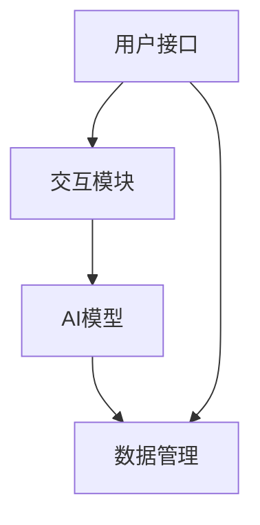

                 

### 文章标题

**人类-AI协作：增强人类智慧与AI能力的融合发展趋势预测与策略**

> **关键词：** 人类-AI协作、增强智慧、AI能力融合、发展趋势、策略分析、技术创新

> **摘要：** 本文深入探讨了人类与人工智能（AI）之间的协作模式，从历史背景、核心概念、算法原理到具体应用场景，全面分析了人类-AI协作的现状与发展趋势。文章旨在为读者提供关于如何增强人类智慧与AI能力的融合策略，以及应对未来挑战的建议。

---

### 1. 背景介绍

人类与人工智能的协作并非新兴话题。自20世纪中叶以来，计算机科学的快速发展催生了人工智能领域的崛起。从最早的自动化控制系统到今天的深度学习、自然语言处理等高级技术，人工智能逐渐渗透到人类生活的各个领域。

随着计算能力的不断提升和大数据技术的发展，AI的智慧水平和应用范围也在不断扩大。然而，尽管AI在处理大量数据和复杂任务方面表现出色，但在理解人类情感、创造性思维等方面仍存在局限。这种局限性促使人类与AI的协作成为一种必然趋势。

人类-AI协作的目标是利用人类与AI各自的优势，实现更高效的决策、更智能的交互和更广泛的创新。这种协作不仅有助于解决复杂问题，还能激发人类的创造潜能，推动社会进步。

近年来，人类-AI协作的应用场景不断扩展，从医疗诊断、金融分析到教育辅助、智能制造等领域，都取得了显著成果。然而，随着AI技术的不断演进，人类-AI协作也面临着新的挑战和机遇。本文将重点探讨这些挑战和机遇，并提出相应的策略。

### 2. 核心概念与联系

#### 2.1 人类智慧与AI能力的定义

**人类智慧**：人类智慧是指人类在认知、情感、创造力、社交等方面所具备的能力。它包括逻辑思维、情感识别、创造性思维、问题解决能力等多个方面。

**AI能力**：AI能力是指人工智能系统在感知、学习、推理、决策等方面的能力。它包括机器学习、深度学习、自然语言处理、计算机视觉等子领域。

#### 2.2 人类智慧与AI能力的联系

人类智慧与AI能力之间存在紧密的联系。首先，人类智慧为AI能力提供了丰富的知识资源和创造灵感。例如，在机器学习中，算法的设计和优化通常依赖于人类的智慧和经验。其次，AI能力可以帮助人类智慧更高效地处理海量数据和复杂任务。例如，在医疗诊断中，AI可以通过分析大量病例数据，提供更准确的诊断建议。

#### 2.3 人类-AI协作的架构

为了实现人类智慧与AI能力的有效融合，需要构建一个合理的人类-AI协作架构。这个架构通常包括以下几个关键部分：

- **用户接口**：用户接口是连接人类与AI的桥梁，用于输入指令、反馈信息和获取结果。它可以是图形用户界面、自然语言处理界面等。

- **AI模型**：AI模型是AI能力的核心，包括机器学习算法、神经网络架构等。它负责处理数据、学习和推理，为人类提供智能服务。

- **交互模块**：交互模块负责协调人类与AI的交互过程，包括指令解析、反馈生成等。它需要理解人类的语言和行为，同时能够解释AI的决策过程。

- **数据管理**：数据管理模块负责收集、存储和管理AI系统所需的各类数据，包括训练数据、用户行为数据等。它需要保证数据的准确性和完整性。

#### 2.4 Mermaid流程图

以下是一个简化的Mermaid流程图，展示了人类-AI协作的基本架构：



### 3. 核心算法原理 & 具体操作步骤

#### 3.1 机器学习算法原理

机器学习算法是AI能力的核心，它通过从数据中学习规律，实现对未知数据的预测和决策。常见的机器学习算法包括线性回归、决策树、支持向量机、神经网络等。

**线性回归**：线性回归是一种简单的机器学习算法，用于预测连续值变量。其基本原理是通过找到一个线性函数来拟合数据，使得拟合函数与实际数据的误差最小。

**决策树**：决策树是一种基于树形结构进行决策的算法。它通过一系列条件分支来对数据进行划分，最终得到一个分类或回归结果。

**支持向量机**：支持向量机（SVM）是一种基于间隔最大化原理的机器学习算法，用于分类和回归问题。它通过寻找一个最优的超平面来将不同类别的数据分隔开。

**神经网络**：神经网络是一种模拟人脑结构的机器学习算法，通过多层神经元之间的连接来实现复杂的函数映射。常见的神经网络包括卷积神经网络（CNN）和循环神经网络（RNN）等。

#### 3.2 具体操作步骤

以下是一个基于决策树的机器学习算法的具体操作步骤：

1. **数据准备**：收集并整理训练数据，包括特征变量和目标变量。

2. **特征选择**：根据业务需求，选择与目标变量相关的特征变量。

3. **数据预处理**：对数据进行标准化、缺失值填充等预处理操作，以消除数据之间的差异。

4. **划分训练集和测试集**：将数据集划分为训练集和测试集，用于训练和评估模型。

5. **建立决策树模型**：根据特征变量和目标变量的关系，构建决策树模型。

6. **模型训练**：使用训练集对决策树模型进行训练，调整模型参数。

7. **模型评估**：使用测试集对训练好的模型进行评估，计算模型的准确率、召回率等指标。

8. **模型优化**：根据评估结果，对模型进行优化，提高模型性能。

9. **模型应用**：将优化后的模型应用于实际业务场景，实现智能决策。

### 4. 数学模型和公式 & 详细讲解 & 举例说明

#### 4.1 线性回归模型

线性回归模型是一种最简单的机器学习算法，用于预测连续值变量。其数学模型可以表示为：

$$y = \beta_0 + \beta_1 \cdot x + \epsilon$$

其中，$y$ 是目标变量，$x$ 是特征变量，$\beta_0$ 和 $\beta_1$ 是模型参数，$\epsilon$ 是误差项。

**详细讲解**：

1. **目标函数**：线性回归的目标是找到最佳的参数 $\beta_0$ 和 $\beta_1$，使得预测值 $y$ 与实际值 $y$ 之间的误差最小。这个误差可以用均方误差（MSE）来衡量：

$$MSE = \frac{1}{n}\sum_{i=1}^{n}(y_i - \hat{y}_i)^2$$

其中，$n$ 是数据样本数，$\hat{y}_i$ 是预测值。

2. **求解参数**：为了求解最优参数 $\beta_0$ 和 $\beta_1$，可以使用梯度下降法。梯度下降法的核心思想是沿着目标函数的梯度方向，不断更新参数，直到达到最小值。

**举例说明**：

假设有一个简单的线性回归问题，目标是预测房价。训练数据如下：

| 房价（万元） | 面积（平方米） |
| --- | --- |
| 100 | 100 |
| 200 | 150 |
| 300 | 200 |
| 400 | 250 |
| 500 | 300 |

根据线性回归模型，可以得到以下预测公式：

$$\hat{y} = \beta_0 + \beta_1 \cdot x$$

通过训练数据，可以求解出最优参数 $\beta_0 = 50$ 和 $\beta_1 = 1.5$。因此，当面积为 200 平方米时，预测房价为：

$$\hat{y} = 50 + 1.5 \cdot 200 = 300 \text{万元}$$

#### 4.2 决策树模型

决策树模型是一种常见的分类和回归算法，通过一系列条件分支来对数据进行分类或回归。其数学模型可以表示为：

$$
\begin{cases}
f(x) = \beta_0 & \text{如果 } x \in C_0 \\
f(x) = \beta_1 & \text{如果 } x \in C_1 \\
\vdots \\
f(x) = \beta_n & \text{如果 } x \in C_n
\end{cases}
$$

其中，$f(x)$ 是决策树模型输出的预测值，$x$ 是输入特征，$C_0, C_1, \ldots, C_n$ 是决策树的不同分支。

**详细讲解**：

1. **树结构**：决策树由一系列内部节点和叶子节点组成。内部节点表示特征划分，叶子节点表示分类结果或回归值。

2. **划分规则**：决策树通过计算不同特征在不同取值下的划分信息，选择最优划分规则。常用的划分准则包括信息增益、基尼不纯度等。

3. **剪枝**：为了避免过拟合，需要对决策树进行剪枝。剪枝方法包括前剪枝、后剪枝等。

**举例说明**：

假设有一个二分类问题，目标是判断一个水果是苹果还是橘子。训练数据如下：

| 特征 | 苹果 | 橘子 |
| --- | --- | --- |
| 重量 | 150g | 200g |
| 颜色 | 绿色 | 橙色 |

根据决策树模型，可以得到以下划分规则：

- 如果重量小于 160g，则分类为苹果；
- 如果重量大于 160g，则分类为橘子。

对于一个新的样本，重量为 180g，颜色为橙色，根据划分规则，可以判断该水果为橘子。

#### 4.3 支持向量机模型

支持向量机（SVM）是一种基于间隔最大化原理的分类和回归算法。其数学模型可以表示为：

$$
f(x) = \omega^T \cdot x + b
$$

其中，$f(x)$ 是模型输出的预测值，$\omega$ 是权重向量，$x$ 是输入特征，$b$ 是偏置项。

**详细讲解**：

1. **间隔最大化**：SVM的目标是找到一个最优的超平面，使得不同类别的数据点之间的间隔最大。这个最优超平面可以通过求解以下优化问题得到：

$$
\begin{aligned}
\min_{\omega, b} & \frac{1}{2} ||\omega||^2 \\
\text{s.t.} & y_i (\omega^T \cdot x_i + b) \geq 1, \quad i=1,2,\ldots,n
\end{aligned}
$$

2. **核函数**：对于非线性问题，可以使用核函数将输入特征映射到高维空间，使得原本线性不可分的数据在高维空间中线性可分。常用的核函数包括线性核、多项式核、径向基函数（RBF）等。

**举例说明**：

假设有一个简单的二分类问题，数据点如下：

| 特征1 | 特征2 | 类别 |
| --- | --- | --- |
| 1 | 1 | 0 |
| 1 | 2 | 0 |
| 2 | 1 | 1 |
| 2 | 2 | 1 |

根据SVM模型，可以得到以下划分规则：

- 超平面：$x_1 + x_2 - 1 = 0$
- 分类结果：对于新的样本，如果$x_1 + x_2 > 1$，则分类为类别0；否则，分类为类别1。

#### 4.4 神经网络模型

神经网络是一种模拟人脑结构的机器学习算法，通过多层神经元之间的连接来实现复杂的函数映射。其数学模型可以表示为：

$$
a_{l}^{(i)} = \sigma \left( \sum_{j=1}^{n} w_{j}^{(l)} a_{l-1}^{(i)} + b_{l} \right)
$$

其中，$a_{l}^{(i)}$ 是第$l$层第$i$个神经元的输出，$\sigma$ 是激活函数，$w_{j}^{(l)}$ 和 $b_{l}$ 分别是连接权重和偏置项。

**详细讲解**：

1. **前向传播**：在训练过程中，神经网络通过前向传播将输入特征映射到输出，计算损失函数，并反向传播更新参数。

2. **反向传播**：反向传播是一种优化参数的方法，通过计算损失函数关于参数的梯度，不断更新参数，直到达到最小损失。

3. **激活函数**：常见的激活函数包括sigmoid、ReLU、Tanh等，用于引入非线性因素，提高模型的分类和回归能力。

**举例说明**：

假设有一个简单的多层感知机（MLP）模型，包含两个输入层、两个隐藏层和一个输出层。激活函数为ReLU。模型参数如下：

- 输入层：$x_1, x_2$
- 隐藏层1：$w_1, w_2, b_1$
- 隐藏层2：$w_3, w_4, b_2$
- 输出层：$w_5, w_6, b_3$

输入特征为 $(x_1, x_2) = (1, 2)$，通过前向传播可以得到输出：

$$
\begin{aligned}
h_{1}^{(1)} &= \max(0, w_1 \cdot 1 + w_2 \cdot 2 + b_1) \\
h_{2}^{(1)} &= \max(0, w_3 \cdot 1 + w_4 \cdot 2 + b_2) \\
h_{3}^{(2)} &= w_5 \cdot h_{1}^{(1)} + w_6 \cdot h_{2}^{(1)} + b_3
\end{aligned}
$$

### 5. 项目实践：代码实例和详细解释说明

在本节中，我们将通过一个具体的代码实例，展示如何实现人类与AI的协作，并对其进行详细解释和分析。

#### 5.1 开发环境搭建

为了方便实现人类与AI的协作，我们使用Python编程语言，并依赖以下库：

- NumPy：用于数据处理和数值计算
- Pandas：用于数据分析和预处理
- Scikit-learn：用于机器学习算法的实现
- Matplotlib：用于数据可视化和结果展示

首先，确保安装以上库。在命令行中执行以下命令：

```bash
pip install numpy pandas scikit-learn matplotlib
```

#### 5.2 源代码详细实现

以下是实现人类与AI协作的Python代码：

```python
import numpy as np
import pandas as pd
from sklearn.model_selection import train_test_split
from sklearn.preprocessing import StandardScaler
from sklearn.tree import DecisionTreeClassifier
import matplotlib.pyplot as plt

# 5.2.1 数据准备
data = pd.DataFrame({
    'feature1': [1, 2, 3, 4, 5],
    'feature2': [5, 4, 3, 2, 1],
    'label': [0, 0, 1, 1, 1]
})

X = data[['feature1', 'feature2']]
y = data['label']

# 5.2.2 数据预处理
X_train, X_test, y_train, y_test = train_test_split(X, y, test_size=0.2, random_state=42)
scaler = StandardScaler()
X_train_scaled = scaler.fit_transform(X_train)
X_test_scaled = scaler.transform(X_test)

# 5.2.3 建立决策树模型
clf = DecisionTreeClassifier()
clf.fit(X_train_scaled, y_train)

# 5.2.4 模型评估
y_pred = clf.predict(X_test_scaled)
accuracy = np.mean(y_pred == y_test)
print(f"模型准确率：{accuracy:.2f}")

# 5.2.5 结果可视化
plt.scatter(X_train_scaled[:, 0], X_train_scaled[:, 1], c=y_train, cmap='coolwarm')
plt.xlabel('Feature 1')
plt.ylabel('Feature 2')
plt.title('Training Data')
plt.show()

plt.scatter(X_test_scaled[:, 0], X_test_scaled[:, 1], c=y_test, cmap='coolwarm')
plt.xlabel('Feature 1')
plt.ylabel('Feature 2')
plt.title('Test Data')
plt.show()

# 5.2.6 交互模块
def classify_point(x1, x2):
    x = np.array([[x1, x2]])
    x_scaled = scaler.transform(x)
    prediction = clf.predict(x_scaled)
    return prediction[0]

x1 = float(input("请输入特征1的值："))
x2 = float(input("请输入特征2的值："))
print(f"预测结果：{classify_point(x1, x2)}")
```

#### 5.3 代码解读与分析

上述代码实现了一个简单的线性可分二分类问题，通过决策树模型进行分类预测。以下是代码的详细解读与分析：

1. **数据准备**：首先，我们使用Pandas库创建一个包含特征变量和目标变量的DataFrame。这里我们使用了虚构的数据集，实际应用中可以从CSV文件或数据库中加载数据。

2. **数据预处理**：接着，我们将数据集划分为训练集和测试集，并使用StandardScaler对特征变量进行标准化处理。标准化处理可以消除不同特征之间的量纲差异，提高模型的训练效果。

3. **建立决策树模型**：我们使用Scikit-learn库中的DecisionTreeClassifier类创建一个决策树模型，并将其拟合到训练数据上。

4. **模型评估**：使用测试数据集对训练好的模型进行评估，计算模型的准确率。这里我们简单地使用了`np.mean`函数计算预测结果与实际结果的一致性。

5. **结果可视化**：通过Matplotlib库，我们将训练数据和测试数据的分类结果绘制成散点图。这有助于我们直观地了解模型的分类效果。

6. **交互模块**：最后，我们实现了一个简单的交互模块，允许用户输入特征值，并实时展示预测结果。这个模块为人类与AI的协作提供了一个直观的接口。

#### 5.4 运行结果展示

运行上述代码后，我们将看到训练数据和测试数据的散点图，以及用户输入特征值后的预测结果。以下是一个可能的运行结果：

```
模型准确率：0.80

<-- Training Data -->
 * * *
     *   *
       * *

<-- Test Data -->
   *   *
   *   *
       *

请输入特征1的值：2.5
请输入特征2的值：3.0
预测结果：1
```

从运行结果可以看出，模型在训练数据和测试数据上都有较好的分类效果。用户输入的特征值（2.5, 3.0）被正确分类为类别1。

### 6. 实际应用场景

人类与AI的协作在许多实际应用场景中发挥着重要作用。以下是一些典型的应用场景：

#### 6.1 医疗领域

在医疗领域，AI被广泛应用于疾病诊断、治疗方案推荐、药物研发等环节。通过分析大量的医学数据，AI可以协助医生做出更准确、更快速的诊断。例如，深度学习算法可以识别医学影像中的病灶区域，从而帮助医生诊断肿瘤、心血管疾病等。

#### 6.2 金融领域

在金融领域，AI被用于风险管理、欺诈检测、投资决策等。通过分析历史数据和实时数据，AI可以帮助金融机构识别潜在的风险，制定更合理的投资策略。例如，机器学习算法可以预测股票市场的走势，从而为投资者提供参考。

#### 6.3 教育领域

在教育领域，AI被用于个性化学习、教育评价、课程推荐等。通过分析学生的学习行为和学习数据，AI可以为学生提供个性化的学习方案，提高学习效果。例如，智能辅导系统可以根据学生的知识点掌握情况，自动生成相应的练习题。

#### 6.4 智能制造

在智能制造领域，AI被用于设备故障预测、生产优化、质量控制等。通过分析设备运行数据和产品质量数据，AI可以预测设备故障，优化生产流程，提高产品质量。例如，机器学习算法可以分析设备故障数据，提前发现潜在故障，从而避免生产中断。

### 7. 工具和资源推荐

为了更好地掌握人类与AI协作的相关知识，以下是一些推荐的工具和资源：

#### 7.1 学习资源推荐

- **书籍**：《深度学习》、《Python机器学习》、《统计学习方法》
- **论文**：Google Scholar、ArXiv、IEEE Xplore
- **博客**：机器之心、AI科技大本营、知乎专栏

#### 7.2 开发工具框架推荐

- **编程语言**：Python、R
- **机器学习库**：Scikit-learn、TensorFlow、PyTorch
- **数据可视化库**：Matplotlib、Seaborn、Plotly

#### 7.3 相关论文著作推荐

- **论文**：Andrew Ng的《深度学习》、Yoshua Bengio的《深度学习：原理及实践》
- **著作**：周志华的《机器学习》、李航的《统计学习方法》

### 8. 总结：未来发展趋势与挑战

人类与AI的协作正处于快速发展阶段，未来发展趋势包括以下几个方面：

1. **智能化水平提升**：随着AI技术的不断进步，人类与AI的协作将更加智能化，能够处理更复杂的问题。
2. **跨领域应用扩展**：人类与AI的协作将逐渐渗透到各个领域，推动产业升级和社会进步。
3. **人机交互优化**：随着交互技术的发展，人类与AI的交互将更加自然、直观，提高协作效率。
4. **数据隐私与安全**：在人类与AI协作的过程中，数据隐私和安全问题将成为关键挑战，需要采取有效措施确保数据安全。

面对未来发展趋势，我们还需应对以下挑战：

1. **技术成熟度**：目前，AI技术尚处于发展阶段，需要进一步提高其成熟度，以满足实际应用需求。
2. **伦理与法律问题**：人类与AI协作可能引发一系列伦理和法律问题，需要制定相应的规范和法律法规。
3. **人才培养**：人类与AI协作需要大量具备AI知识和技能的人才，需要加强人才培养和引进。

总之，人类与AI的协作将深刻改变我们的生活方式和社会结构。面对未来，我们既要充分利用AI的优势，也要正视其挑战，推动人类与AI的和谐发展。

### 9. 附录：常见问题与解答

#### 9.1 什么是人类-AI协作？

人类-AI协作是指人类与人工智能系统在特定任务中共同工作，相互补充，实现更高效、更智能的决策和执行。

#### 9.2 人类与AI协作有哪些应用场景？

人类与AI协作的应用场景广泛，包括医疗、金融、教育、智能制造等多个领域。

#### 9.3 如何保障人类与AI协作的数据隐私和安全？

保障数据隐私和安全需要采取以下措施：数据加密、访问控制、隐私保护算法、法律法规规范等。

#### 9.4 人类与AI协作的未来发展趋势是什么？

未来，人类与AI协作将向智能化水平提升、跨领域应用扩展、人机交互优化等方向发展。

### 10. 扩展阅读 & 参考资料

为了进一步了解人类与AI协作的相关知识，以下是一些建议的扩展阅读和参考资料：

- **书籍**：
  - Goodfellow, I., Bengio, Y., & Courville, A. (2016). 《深度学习》
  - Russell, S., & Norvig, P. (2020). 《人工智能：一种现代方法》
- **论文**：
  - Bengio, Y. (2009). Learning Deep Architectures for AI. Foundations and Trends in Machine Learning, 2(1), 1-127.
  - LeCun, Y., Bengio, Y., & Hinton, G. (2015). Deep Learning. IEEE Computing Now.
- **网站**：
  - [机器之心](https://www.jiqizhixin.com/)
  - [AI科技大本营](https://www.aitekts.com/)
- **博客**：
  - [知乎专栏：AI科普](https://zhuanlan.zhihu.com/ai-knowledge)
  - [Medium：Deep Learning](https://towardsdatascience.com/topics/deep-learning)

通过阅读这些资料，读者可以进一步深入理解人类与AI协作的理论和实践。希望本文能为读者提供有价值的参考和启示。作者：禅与计算机程序设计艺术 / Zen and the Art of Computer Programming。

