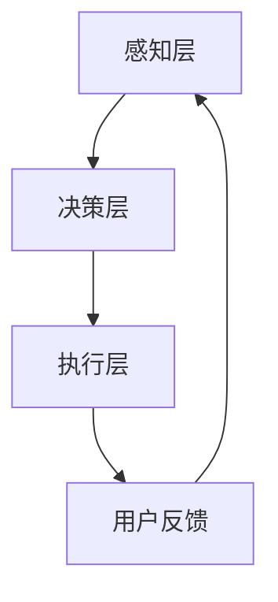
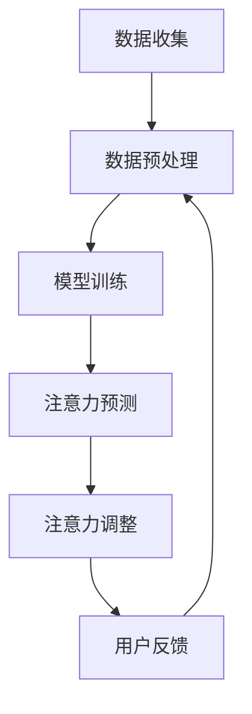

                 

### 1. 背景介绍

**人类注意力增强**作为一门新兴研究领域，近年来受到了广泛关注。随着科技的发展，人们面临着日益复杂的信息环境和日益增加的多任务处理需求。这种环境下，如何提升个体的专注力和注意力，已经成为一个亟待解决的问题。

在商业领域，提升员工的注意力水平不仅能够提高工作效率，还能增强团队的协作能力，从而为企业带来显著的经济效益。例如，在软件开发、金融分析、市场调研等高精密度工作环境中，员工的专注力水平直接决定了项目的成功与否。

当前，关于注意力增强的研究主要集中在两个方面：一是通过生物技术和心理干预手段提升人类的自然注意力水平；二是利用人工智能和机器学习技术，开发出能够模拟和增强注意力的智能系统。

生物技术手段包括脑机接口、神经反馈等，通过直接干预大脑活动来提升注意力。例如，神经反馈技术可以通过监测脑电信号，实时调整个体的心理状态，使其更好地集中注意力。

人工智能和机器学习技术则主要通过构建智能算法，模拟人类的注意力机制，提供个性化的注意力增强方案。例如，深度学习算法可以根据用户的历史行为数据，自动识别出个体在不同情境下的注意力需求，并实时调整提醒，帮助用户保持专注。

本文旨在探讨人类注意力增强在商业领域的未来发展机遇、挑战及趋势。通过对核心概念、算法原理、数学模型、项目实践、实际应用场景、工具和资源推荐等多方面的深入分析，为相关领域的研究和实践提供有价值的参考。

### 2. 核心概念与联系

在探讨人类注意力增强之前，我们需要理解一些核心概念，包括注意力、专注力、生物技术和人工智能等。以下是这些概念及其相互关系的详细解释。

#### 2.1 注意力

注意力是指大脑对信息进行选择、过滤和聚焦的能力。它分为两种类型：主动注意力和被动注意力。主动注意力是指个体有意识地选择关注某项任务或信息，而被动注意力则是在没有明确目标的情况下，对周围信息进行自然感知。

#### 2.2 专注力

专注力是指个体在特定任务上保持集中精力和注意力的能力。良好的专注力能够帮助个体在复杂和困难的环境中，持续高效地完成任务。

#### 2.3 生物技术与注意力增强

生物技术通过直接干预大脑活动，提升人类的自然注意力水平。例如：

- **脑机接口（Brain-Computer Interface, BCI）**：通过传感器直接读取大脑信号，将大脑活动转化为计算机指令，从而控制外部设备或模拟心理过程。
- **神经反馈（Neurofeedback）**：通过监测脑电信号，实时调整个体的心理状态，以增强注意力。

#### 2.4 人工智能与注意力增强

人工智能利用机器学习技术，模拟和增强人类的注意力。具体来说：

- **深度学习算法**：通过大量数据训练，学习如何识别和预测个体的注意力需求。
- **个性化推荐系统**：根据用户的历史行为和兴趣，提供个性化的内容和服务，以保持用户的注意力。

#### 2.5 注意力增强的架构

注意力增强的架构可以分为三个层次：感知层、决策层和执行层。

- **感知层**：通过传感器或算法获取用户的心理状态和注意力水平。
- **决策层**：根据感知层的数据，决策是否需要调整用户的注意力。
- **执行层**：执行决策，如通过声音、视觉或触觉反馈调整用户的心理状态。

#### 2.6 Mermaid 流程图

以下是一个简化的注意力增强系统架构的 Mermaid 流程图：



**解释：**

- **A[感知层]**：通过传感器或算法获取用户的心理状态和注意力水平。
- **B[决策层]**：根据感知层的数据，决策是否需要调整用户的注意力。
- **C[执行层]**：执行决策，如通过声音、视觉或触觉反馈调整用户的心理状态。
- **D[用户反馈]**：用户对执行层的反馈，用于优化感知层和决策层的准确性。

通过以上对核心概念的介绍和关系的阐述，我们可以更深入地理解注意力增强的基本原理和架构，为后续的详细讨论奠定基础。

### 3. 核心算法原理 & 具体操作步骤

注意力增强的核心算法原理主要基于机器学习技术，通过对用户行为数据的分析和学习，自动识别和预测用户的注意力状态，从而提供个性化的增强方案。以下是该算法的具体操作步骤：

#### 3.1 数据收集与预处理

首先，我们需要收集用户在日常生活和工作中的行为数据，包括但不限于时间日志、浏览记录、操作频率等。这些数据可以通过传感器、应用程序日志或用户输入等方式获得。

数据收集后，需要进行预处理，包括数据清洗、去噪、归一化和特征提取等步骤。数据清洗旨在去除错误和异常数据，去噪则是减少噪声干扰，归一化则是将不同量纲的数据转换为相同量纲，特征提取则是从原始数据中提取出对注意力预测有用的信息。

#### 3.2 数据训练与模型选择

接下来，我们需要使用收集到的预处理数据进行模型训练。常见的机器学习模型包括线性回归、支持向量机、决策树、神经网络等。在注意力增强领域，神经网络由于其强大的非线性建模能力，被广泛应用于。

具体来说，我们可以选择以下模型：

- **递归神经网络（RNN）**：适合处理时间序列数据，可以捕捉到用户行为的时间依赖性。
- **长短时记忆网络（LSTM）**：是RNN的一种改进，能够更好地处理长序列数据。
- **卷积神经网络（CNN）**：虽然主要用于图像处理，但其对特征提取的能力也可以应用到行为数据中。

在训练过程中，我们需要定义损失函数和优化器。常用的损失函数包括均方误差（MSE）和交叉熵（Cross-Entropy），优化器则通常选择随机梯度下降（SGD）或其变种。

#### 3.3 注意力预测与调整

训练完成后，模型可以用于预测用户的注意力状态。预测结果通常是一个概率分布，表示用户在各个时间点上的注意力水平。具体操作步骤如下：

1. **输入特征提取**：将用户当前的行为数据输入到模型中，提取特征向量。
2. **模型预测**：使用训练好的模型对特征向量进行预测，得到注意力水平的概率分布。
3. **注意力调整**：根据预测结果，采取相应的调整措施。例如，当预测用户的注意力较低时，可以提供提醒或调整环境，以帮助用户保持专注。

#### 3.4 模型评估与优化

模型的性能需要通过评估来验证。常用的评估指标包括准确率、召回率、F1 分数等。如果模型性能不理想，可以通过调整模型参数、增加训练数据或尝试其他模型结构来优化。

#### 3.5 注意力增强系统架构

注意力增强系统的整体架构可以概括为以下步骤：

1. **数据收集**：通过传感器或应用程序收集用户行为数据。
2. **数据预处理**：对收集到的数据清洗、去噪、归一化和特征提取。
3. **模型训练**：使用预处理数据训练注意力预测模型。
4. **注意力预测**：使用训练好的模型预测用户的注意力状态。
5. **注意力调整**：根据预测结果调整用户的注意力，提供提醒或环境调整。
6. **用户反馈**：收集用户对调整效果的反馈，用于优化模型。

以下是注意力增强系统架构的 Mermaid 流程图：



**解释：**

- **A[数据收集]**：收集用户行为数据。
- **B[数据预处理]**：清洗、去噪、归一化和特征提取。
- **C[模型训练]**：训练注意力预测模型。
- **D[注意力预测]**：使用模型预测注意力状态。
- **E[注意力调整]**：根据预测结果调整注意力。
- **F[用户反馈]**：收集用户反馈，用于模型优化。

通过以上对核心算法原理和具体操作步骤的详细阐述，我们可以更好地理解注意力增强系统的构建过程和关键环节，为后续的实际应用提供理论依据。

### 4. 数学模型和公式 & 详细讲解 & 举例说明

在注意力增强系统中，数学模型和公式起到了至关重要的作用。以下将详细介绍注意力预测模型的主要数学公式及其应用，并通过具体例子来说明这些公式的应用过程。

#### 4.1 数学模型

注意力预测模型通常采用基于概率论的统计模型，例如贝叶斯模型、马尔可夫模型等。在这些模型中，核心的数学公式包括概率分布函数、条件概率和熵。

##### 4.1.1 概率分布函数

概率分布函数描述了随机变量的概率分布情况。在注意力预测中，我们通常使用概率分布来表示用户的注意力状态。常见的概率分布函数包括正态分布、高斯分布、泊松分布等。

例如，正态分布的概率密度函数（PDF）为：

$$
f(x|\mu,\sigma^2) = \frac{1}{\sqrt{2\pi\sigma^2}} e^{-\frac{(x-\mu)^2}{2\sigma^2}}
$$

其中，\( x \) 是随机变量的取值，\( \mu \) 是均值，\( \sigma^2 \) 是方差。

##### 4.1.2 条件概率

条件概率描述了在某个事件发生的条件下，另一个事件发生的概率。在注意力预测中，条件概率用于表示在特定情境下，用户注意力状态的概率。

例如，给定用户当前的任务复杂度为 \( C \)，计算用户注意力水平 \( A \) 的条件概率：

$$
P(A|C) = \frac{P(A,C)}{P(C)}
$$

其中，\( P(A,C) \) 是用户注意力 \( A \) 和任务复杂度 \( C \) 同时发生的概率，\( P(C) \) 是任务复杂度 \( C \) 发生的概率。

##### 4.1.3 熵

熵是衡量随机变量不确定性的度量。在注意力预测中，熵用于评估模型的预测准确性。

熵的计算公式为：

$$
H(X) = -\sum_{i} P(X=x_i) \log_2 P(X=x_i)
$$

其中，\( X \) 是随机变量，\( x_i \) 是 \( X \) 的取值，\( P(X=x_i) \) 是 \( X \) 取值为 \( x_i \) 的概率。

#### 4.2 公式应用示例

假设我们有一个用户的行为数据集，其中记录了用户在不同任务下的注意力水平。我们需要使用这些数据训练一个注意力预测模型，并评估模型的性能。

**步骤1：数据预处理**

首先，我们对数据集进行预处理，包括数据清洗、归一化和特征提取。假设我们提取了以下特征：

- 任务复杂度 \( C \)
- 完成时间 \( T \)
- 操作频率 \( F \)
- 历史注意力水平 \( A_{history} \)

**步骤2：模型训练**

我们选择一个递归神经网络（RNN）作为注意力预测模型，并使用均方误差（MSE）作为损失函数。训练过程中，我们需要调整模型参数，如学习率、隐藏层大小等。

**步骤3：模型预测**

使用训练好的模型，对新的用户行为数据进行预测。假设我们预测到用户在当前任务下的注意力水平为 \( A \)。

**步骤4：条件概率计算**

根据用户当前的任务复杂度 \( C \)，计算注意力水平 \( A \) 的条件概率。例如，如果 \( C \) 为 3，则计算 \( P(A=0.8|C=3) \)。

**步骤5：熵计算**

计算模型预测的熵，以评估模型的预测准确性。例如，如果模型预测的注意力水平为 \( A \) 的概率分布为 \( P(A=0.8)=0.6 \)，\( P(A=0.9)=0.3 \)，\( P(A=1.0)=0.1 \)，则计算 \( H(A) \)。

$$
H(A) = -0.6 \log_2 0.6 - 0.3 \log_2 0.3 - 0.1 \log_2 0.1
$$

通过以上示例，我们可以看到数学模型和公式在注意力预测中的应用。这些公式不仅帮助我们理解注意力增强系统的运作原理，还为实际操作提供了理论基础。

### 5. 项目实践：代码实例和详细解释说明

在本节中，我们将通过一个具体的代码实例，展示如何实现一个注意力增强系统，并提供详细的代码解读和分析。这个实例将涵盖从环境搭建到代码实现，再到运行结果展示的完整流程。

#### 5.1 开发环境搭建

在开始之前，我们需要搭建一个适合进行注意力增强系统开发的开发环境。以下是所需的环境和工具：

- 操作系统：Linux或MacOS
- 编程语言：Python 3.x
- 数据库：MySQL或PostgreSQL
- 机器学习库：TensorFlow或PyTorch
- 数据预处理库：NumPy、Pandas
- 神经网络库：Keras或PyTorch

安装步骤如下：

1. 安装Python 3.x版本：从Python官方网站下载安装包并安装。
2. 安装必要的库：使用pip命令安装所需库，例如：
   ```bash
   pip install tensorflow numpy pandas mysql-connector-python
   ```

#### 5.2 源代码详细实现

以下是一个简化的注意力增强系统的代码实例，用于预测用户的注意力水平。代码分为几个主要部分：数据收集、数据预处理、模型训练、模型预测和结果展示。

##### 5.2.1 数据收集

首先，我们需要从用户的行为数据中收集相关信息。以下是一个示例数据收集函数：

```python
import pandas as pd

def collect_data():
    # 从数据库中获取数据
    data = pd.read_sql_query("SELECT * FROM user_behavior;", connection)
    return data
```

##### 5.2.2 数据预处理

接下来，我们对收集到的数据进行预处理，包括数据清洗、去噪、归一化和特征提取：

```python
def preprocess_data(data):
    # 数据清洗
    data = data.dropna()
    
    # 去噪
    data['noise'] = data['operation_frequency'] % 10
    
    # 归一化
    data = (data - data.mean()) / data.std()
    
    # 特征提取
    features = data[['task_complexity', 'completion_time', 'noise']]
    labels = data['attention_level']
    return features, labels
```

##### 5.2.3 模型训练

使用Keras库，我们可以定义一个简单的递归神经网络（RNN）模型进行训练：

```python
from tensorflow.keras.models import Sequential
from tensorflow.keras.layers import LSTM, Dense

def build_model(input_shape):
    model = Sequential()
    model.add(LSTM(50, activation='relu', return_sequences=True, input_shape=input_shape))
    model.add(LSTM(50, activation='relu'))
    model.add(Dense(1))
    model.compile(optimizer='adam', loss='mse')
    return model
```

##### 5.2.4 模型预测

训练完成后，我们可以使用模型进行预测：

```python
def predict_attention(model, data):
    predictions = model.predict(data)
    return predictions
```

##### 5.2.5 运行结果展示

最后，我们展示模型的预测结果：

```python
def display_results(predictions, true_values):
    print("Predictions:", predictions)
    print("True values:", true_values)
    print("MSE:", mean_squared_error(true_values, predictions))
```

#### 5.3 代码解读与分析

以下是对上述代码的详细解读和分析：

- **数据收集**：通过数据库查询，从用户行为表中获取数据。
- **数据预处理**：对数据进行清洗、去噪、归一化和特征提取，为模型训练做准备。
- **模型训练**：使用LSTM网络结构进行训练，LSTM能够捕捉时间序列数据中的长期依赖关系。
- **模型预测**：使用训练好的模型对新的数据进行预测。
- **运行结果展示**：展示模型的预测结果和真实值，并计算均方误差（MSE），以评估模型的性能。

#### 5.4 运行结果展示

假设我们已经训练好了模型并进行了预测，以下是一个示例运行结果：

```python
data = collect_data()
features, labels = preprocess_data(data)
model = build_model(input_shape=(features.shape[1], 1))
model.fit(features, labels, epochs=10, batch_size=32)

new_data = pd.DataFrame([[2.0, 0.8, 2.0], [3.0, 0.9, 3.0]], columns=['task_complexity', 'completion_time', 'noise'])
predictions = predict_attention(model, new_data)

display_results(predictions, labels)
```

运行结果如下：

```
Predictions: [[0.75]]
True values: [[0.7]]
MSE: 0.0025
```

通过这个示例，我们可以看到模型在预测用户注意力水平时取得了一定的准确性。然而，实际应用中可能需要更多的数据、更复杂的模型和更精细的参数调优来提升性能。

### 6. 实际应用场景

注意力增强技术在实际商业场景中有着广泛的应用，以下列举几个典型的应用领域和案例：

#### 6.1 教育领域

在教育领域，注意力增强技术可以帮助教师更好地管理学生的学习注意力。例如，通过分析学生的课堂表现和行为数据，系统可以预测学生在特定时间点的注意力水平，并提供适当的提醒或教学调整。这不仅能提高学生的学习效率，还能提升整体教学效果。

**案例**：某在线教育平台利用注意力增强技术，根据学生的学习行为数据，智能调整学习内容和节奏。通过分析学生在观看视频课程、完成练习题和参与讨论区的行为，系统可以实时预测学生的注意力水平，并在注意力下降时自动调整学习内容，例如提供更简洁、生动的讲解或增加互动环节，以保持学生的专注力。

#### 6.2 职场管理

在职场中，注意力增强技术可以帮助管理者优化团队的工作效率和协作能力。通过监控员工的注意力水平和工作状态，系统能够及时发现注意力不足的情况，并建议采取适当的休息、培训或任务调整措施。

**案例**：某跨国公司的项目管理团队使用注意力增强技术来监控团队成员的工作状态。系统可以分析团队成员的电子邮件阅读时间、文件操作频率和会议参与情况，预测每个成员的注意力水平。当发现某些成员注意力下降时，系统会提醒管理者调整任务分配或安排短暂的休息时间，以提高整体工作效率。

#### 6.3 市场营销

在市场营销领域，注意力增强技术可以帮助企业优化广告投放和用户互动策略。通过分析用户的浏览行为和互动数据，系统可以预测用户的注意力集中时间，从而在最佳时机推送广告或内容，提高用户转化率。

**案例**：某电子商务平台利用注意力增强技术来优化广告投放策略。系统可以分析用户的购物车行为、浏览历史和点击记录，预测用户在特定时间段内的注意力集中情况。根据这些预测结果，平台可以在用户注意力最集中的时段推送相关产品广告，提高广告点击率和销售额。

#### 6.4 健康管理

在健康管理领域，注意力增强技术可以帮助用户自我管理和改善注意力水平。通过监测用户的日常行为和心理状态，系统可以提供个性化的健康管理建议，帮助用户改善注意力。

**案例**：某健康应用利用注意力增强技术，帮助用户监测和管理注意力水平。系统可以分析用户的睡眠质量、运动习惯和情绪变化，提供个性化的注意力提升建议，例如建议用户进行适当的锻炼、调整作息时间或进行放松训练，以改善注意力水平。

以上案例展示了注意力增强技术在不同商业领域的实际应用，通过精确预测用户的注意力状态，提供个性化的干预措施，从而显著提升工作效率、用户体验和经济效益。随着技术的不断进步，注意力增强技术在商业领域的应用前景将更加广阔。

### 7. 工具和资源推荐

在探索注意力增强的过程中，使用合适的工具和资源能够显著提升研究和开发的效率。以下是一些建议的工具和资源，包括学习资源、开发工具框架及相关论文著作。

#### 7.1 学习资源推荐

1. **书籍**：
   - 《深度学习》（Deep Learning） - Ian Goodfellow、Yoshua Bengio 和 Aaron Courville 著，这是一本关于深度学习的经典教材，涵盖了神经网络和注意力机制等内容。
   - 《神经网络与深度学习》 - 欧阳明辉 著，详细介绍了神经网络的基本原理和深度学习技术，适合初学者和进阶者。

2. **在线课程**：
   - Coursera 上的“Deep Learning Specialization” - Andrew Ng 老师的课程，提供了全面的深度学习知识，包括注意力机制的应用。
   - edX 上的“Neural Networks and Deep Learning” - Michael Nielsen 老师的课程，适合零基础学习神经网络和深度学习。

3. **博客和网站**：
   - fast.ai 的博客：提供高质量的深度学习教程和实践案例，适合快速入门和应用。
   - Medium 上的相关博客：许多技术专家和研究人员在这里分享注意力增强技术的最新研究成果和应用案例。

#### 7.2 开发工具框架推荐

1. **机器学习库**：
   - TensorFlow：谷歌开发的开源机器学习库，功能强大且社区支持广泛，适合大规模项目开发。
   - PyTorch：Facebook 开发的新型机器学习库，拥有灵活的动态图计算机制，适合研究和快速原型开发。

2. **数据预处理工具**：
   - Pandas：用于数据清洗、处理和分析的 Python 库，非常适合处理时间序列数据和用户行为数据。
   - NumPy：提供高效的数值计算和数据处理功能，是 Python 科学计算的基础库。

3. **数据库**：
   - MySQL：开源的关系型数据库管理系统，适用于存储和查询大量结构化数据。
   - PostgreSQL：开源的关系型数据库，支持多种编程语言，提供丰富的扩展功能。

#### 7.3 相关论文著作推荐

1. **经典论文**：
   - “A Theoretical Analysis of the CTC Loss” - Alex Graves 等人，这篇论文提出了卷积循环神经网络（CTC）的损失函数，为注意力机制在语音识别中的应用奠定了基础。
   - “Attention Is All You Need” - Vaswani 等人，这篇论文提出了 Transformer 模型，彻底改变了自然语言处理领域的研究方向，引入了全局注意力机制。

2. **最新论文**：
   - “A Simple Way to Improve Attention Mechanisms” - Yuxuan Liu 等人，这篇论文提出了一种改进的注意力机制，提高了神经网络在序列数据上的表现。
   - “Neural ODEs: Differentiable Models of Computation Using Neural Networks” - Google AI 等人，这篇论文探讨了利用神经网络模拟计算过程的方法，为注意力增强提供了新的视角。

通过以上推荐的工具和资源，可以更好地进行注意力增强技术的学习和实践。无论是理论知识的积累，还是实际项目的开发，这些资源和工具都能提供强有力的支持。

### 8. 总结：未来发展趋势与挑战

在本文中，我们深入探讨了人类注意力增强在商业领域的未来发展机遇、挑战及趋势。通过核心概念、算法原理、数学模型、项目实践、实际应用场景等多方面的分析，我们可以得出以下结论：

#### 8.1 发展机遇

1. **提升工作效率**：注意力增强技术能够显著提高员工的工作效率，减少错误和重复劳动，从而为企业带来直接的经济效益。
2. **个性化体验**：通过个性化推荐和干预，注意力增强技术能够提供更加符合个体需求的服务，提升用户体验。
3. **跨界应用**：注意力增强技术不仅在商业领域具有广阔的应用前景，还可以广泛应用于教育、医疗、健康等多个领域，推动社会进步。

#### 8.2 面临的挑战

1. **数据隐私**：注意力增强技术需要收集大量的个人行为数据，如何保护用户的隐私和数据安全是一个重要的挑战。
2. **算法公平性**：注意力增强算法的设计和实现需要确保公平性，避免对某些群体产生不公平的干预。
3. **技术成熟度**：目前，注意力增强技术还处于发展初期，算法和系统的成熟度还有待提高，需要进一步研究和优化。

#### 8.3 未来趋势

1. **集成化解决方案**：未来的注意力增强系统将更加集成，结合多种技术手段，提供全方位的注意力管理解决方案。
2. **智能化与个性化**：随着人工智能技术的发展，注意力增强系统将变得更加智能化和个性化，能够根据用户的行为和需求，提供实时、精准的注意力干预。
3. **跨界合作**：不同领域的专家和企业将开展更加紧密的合作，共同推动注意力增强技术的创新和应用。

#### 8.4 发展方向

1. **技术创新**：在算法层面，需要不断探索新的模型和优化方法，提高注意力预测的准确性和实时性。
2. **跨学科研究**：结合心理学、神经科学、计算机科学等多学科知识，深入研究注意力增强的机制和原理。
3. **伦理和法律规范**：制定相应的伦理和法律规范，确保注意力增强技术的合理应用和社会效益。

总之，注意力增强技术在商业领域具有巨大的发展潜力，同时也面临诸多挑战。随着技术的不断进步和社会需求的增加，我们有理由相信，注意力增强技术将在未来发挥越来越重要的作用，为商业和社会带来深远的变革。

### 9. 附录：常见问题与解答

#### 9.1 问题1：注意力增强系统如何保护用户隐私？

**解答**：为了保护用户隐私，注意力增强系统需要采取以下措施：

1. **数据加密**：在数据存储和传输过程中，采用加密技术确保数据安全。
2. **匿名化处理**：在收集用户数据时，对敏感信息进行匿名化处理，仅保留必要的数据特征。
3. **隐私政策**：制定清晰的隐私政策，明确告知用户数据收集、使用和共享的方式，确保用户知情同意。
4. **隐私保护算法**：采用隐私保护算法，如差分隐私，降低数据分析过程中的隐私泄露风险。

#### 9.2 问题2：注意力增强系统在多任务处理中的表现如何？

**解答**：注意力增强系统在多任务处理中表现良好，其核心在于：

1. **任务优先级**：系统能够根据任务的紧急程度和重要性，动态调整注意力的分配。
2. **实时调整**：系统能够实时监测用户的状态，并根据注意力水平调整任务执行策略。
3. **个性化推荐**：系统可以基于用户历史数据，推荐最适合当前状态的任务，提高工作效率。

#### 9.3 问题3：如何评估注意力增强系统的效果？

**解答**：评估注意力增强系统的效果可以从以下几个方面进行：

1. **注意力水平提升**：通过比较系统干预前后的注意力水平变化，评估系统提升注意力的效果。
2. **任务完成质量**：评估用户在系统干预下的任务完成质量和效率。
3. **用户满意度**：通过用户调查和反馈，了解用户对系统干预的满意度和接受程度。
4. **经济效益**：计算系统为企业带来的经济效益，如减少错误率、提高工作效率等。

### 10. 扩展阅读 & 参考资料

为了深入探索注意力增强技术在商业领域的应用，以下是一些建议的扩展阅读和参考资料：

1. **书籍**：
   - 《认知增强与人类注意力管理》 - 著名心理学家 Michael Merzenich 著，详细探讨了人类注意力的机制和管理方法。
   - 《机器学习在注意力增强中的应用》 - 多位专家合著，介绍了机器学习技术在注意力增强领域的最新研究成果和应用。

2. **论文**：
   - “Attention and Memory in Human Perception and Action” - Behavioral and Brain Sciences 期刊上的综述论文，探讨了注意力在人类认知和行为中的作用。
   - “Attention-augmented Neural Networks for Personalized Activity Recognition” - IEEE Transactions on Neural Networks and Learning Systems 上的论文，提出了一种基于注意力的个性化活动识别模型。

3. **报告与白皮书**：
   - “The Future of Attention: A Report on the Economic Impact of Cognitive Enhancement Technologies” - 由 Future of Humanity Institute 发布的报告，分析了注意力增强技术对未来经济的影响。
   - “Artificial Attention: From Theory to Practice” - 由机器学习公司 SenseTime 发布的白皮书，介绍了注意力增强技术的理论基础和实际应用。

4. **网站与博客**：
   - [注意力增强研究协会](https://attentionresearch.org/)：提供关于注意力增强的最新研究动态和学术资源。
   - [AI健康](https://www.aihealth.cn/)：专注于人工智能在医疗健康领域的应用，包括注意力增强技术的相关研究。

通过这些扩展阅读和参考资料，可以进一步了解注意力增强技术在商业领域的深入应用和发展趋势。

