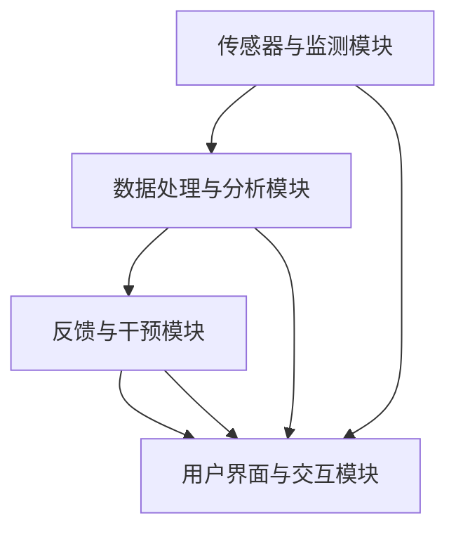

                 

### 1. 背景介绍

#### 注意力的重要性

在当今信息爆炸的时代，人们面临的信息量日益增多，注意力成为了一种稀缺资源。从商业到教育，从个人生活到职场，提高注意力水平已成为提升效率、增强竞争力的重要途径。注意力是指个体集中精神、关注特定目标的能力，是认知过程中不可或缺的一环。然而，现代生活中的各种干扰因素，如社交媒体、手机应用、广告等，不断分散着我们的注意力，使得人们难以长时间保持专注。

#### 商业中的注意力应用

在商业领域，注意力管理的重要性愈发凸显。广告行业依赖于吸引消费者的注意力，通过精心的广告设计和投放策略，将产品或服务的信息传递给目标受众。营销领域同样如此，有效的营销策略能够迅速抓住消费者的注意力，提高品牌知名度和市场份额。此外，在企业管理中，提升员工的工作注意力，不仅能够提高工作效率，还能减少错误率，降低运营成本。

#### 专注力提升的现有方法

目前，许多方法被用来提升注意力和专注力，包括传统的心理训练、认知训练，以及近年来逐渐受到关注的神经科学方法。心理训练方法如冥想、专注力训练，通过训练个体的心理素质，提高其对干扰的抵抗能力。认知训练则通过一系列科学设计的练习，增强大脑的认知能力。神经科学方法利用脑电图（EEG）、功能性磁共振成像（fMRI）等先进技术，对大脑活动进行监测和分析，从而为个性化注意力提升提供依据。

### 2. 核心概念与联系

#### 注意力增强技术的概念

注意力增强技术旨在通过多种手段，提高个体在特定任务中的注意力集中程度。这些技术可以分为物理方法、心理方法和技术方法三大类。

- **物理方法**：包括使用外界刺激来调节大脑状态，如通过耳机播放特定频率的音频，或使用脑电刺激设备直接刺激大脑特定区域。
- **心理方法**：通过认知行为训练，如冥想、专注力训练等，帮助个体学会更好地控制自己的注意力。
- **技术方法**：利用计算机技术和软件工具，如注意力追踪系统、专注力训练软件等，对个体的注意力进行实时监测和反馈。

#### 技术与商业的关联

注意力增强技术与商业应用有着紧密的联系。在广告营销中，注意力追踪技术可以帮助广告主了解消费者的注意力分布，优化广告投放策略。在员工管理中，专注力提升技术可以帮助企业提高员工的工作效率和满意度。在教育领域，注意力增强技术能够帮助学生更好地集中注意力，提高学习效果。

#### 注意力增强技术的架构

为了更好地理解注意力增强技术，我们可以将其架构拆解为以下几个核心组成部分：

1. **传感器与监测模块**：包括脑电图（EEG）、眼动仪等设备，用于实时监测个体的生理和心理状态。
2. **数据处理与分析模块**：利用机器学习和人工智能算法，对监测数据进行分析，识别个体的注意力变化模式。
3. **反馈与干预模块**：根据分析结果，通过音频、视觉或触觉等反馈方式，引导个体调整注意力。
4. **用户界面与交互模块**：提供友好的用户界面，让用户能够直观地了解自己的注意力状态，并进行相应的调整。

下面是注意力增强技术架构的 Mermaid 流程图：



### 3. 核心算法原理 & 具体操作步骤

#### 算法原理

注意力增强技术基于一系列核心算法原理，包括信号处理、机器学习和认知建模等。

1. **信号处理**：通过传感器收集脑电图（EEG）、眼动数据等生理信号，利用信号处理技术进行预处理，如滤波、去噪等。
2. **机器学习**：利用机器学习算法，如支持向量机（SVM）、神经网络（NN）等，对预处理后的数据进行分析，建立注意力模型。
3. **认知建模**：基于认知心理学原理，模拟人类注意力机制，设计注意力增强策略。

#### 操作步骤

以下是注意力增强技术的基本操作步骤：

1. **数据采集**：通过脑电图（EEG）、眼动仪等传感器，收集个体的生理和心理状态数据。
2. **预处理**：对采集到的数据进行预处理，包括滤波、去噪、数据归一化等步骤。
3. **特征提取**：利用信号处理技术，从预处理后的数据中提取与注意力相关的特征。
4. **模型训练**：使用机器学习算法，如神经网络（NN），训练注意力模型。
5. **预测与反馈**：根据训练好的模型，预测个体的注意力状态，并通过音频、视觉或触觉等反馈方式，引导个体调整注意力。

#### 代码示例

以下是使用Python编写的注意力增强技术的示例代码：

```python
import numpy as np
import matplotlib.pyplot as plt
from sklearn.svm import SVC
from sklearn.model_selection import train_test_split
from sklearn.metrics import accuracy_score

# 数据预处理
def preprocess_data(data):
    # 数据滤波、去噪、归一化等处理
    # 略
    return processed_data

# 特征提取
def extract_features(processed_data):
    # 提取与注意力相关的特征
    # 略
    return features

# 模型训练
def train_model(X, y):
    model = SVC(kernel='linear')
    model.fit(X, y)
    return model

# 预测与反馈
def predict_and_feedback(model, new_data):
    features = extract_features(new_data)
    prediction = model.predict([features])
    # 根据预测结果，提供反馈
    # 略
    return prediction

# 主函数
def main():
    # 读取数据
    data = np.load('data.npy')
    labels = np.load('labels.npy')

    # 数据预处理
    processed_data = preprocess_data(data)

    # 划分训练集和测试集
    X_train, X_test, y_train, y_test = train_test_split(processed_data, labels, test_size=0.2, random_state=42)

    # 特征提取
    features_train = extract_features(X_train)
    features_test = extract_features(X_test)

    # 模型训练
    model = train_model(features_train, y_train)

    # 预测与反馈
    prediction = predict_and_feedback(model, features_test)

    # 评估模型
    accuracy = accuracy_score(y_test, prediction)
    print(f'Accuracy: {accuracy:.2f}')

if __name__ == '__main__':
    main()
```

### 4. 数学模型和公式 & 详细讲解 & 举例说明

#### 数学模型

注意力增强技术中的数学模型主要包括信号处理模型、机器学习模型和认知建模模型。

1. **信号处理模型**：
   - **傅里叶变换**（Fourier Transform）：
     $$ X(f) = \int_{-\infty}^{\infty} x(t) e^{-j 2 \pi f t} dt $$
   - **短时傅里叶变换**（Short-Time Fourier Transform, STFT）：
     $$ X(t, f) = \int_{-\infty}^{\infty} x(\tau) e^{-j 2 \pi f \tau} d\tau $$

2. **机器学习模型**：
   - **支持向量机**（Support Vector Machine, SVM）：
     $$ w^* = \arg \min_{w, b} \frac{1}{2} ||w||^2 + C \sum_{i=1}^{n} \max(0, 1 - y_i ( \langle w, x_i \rangle + b)) $$
   - **神经网络**（Neural Network, NN）：
     $$ a_{\text{layer}}(x) = \sigma(\langle w_{\text{layer}}, b_{\text{layer}} \rangle) $$
     其中，\( \sigma \) 是激活函数。

3. **认知建模模型**：
   - **注意力权重分配**（Attention Weight Allocation）：
     $$ w_t = \frac{\exp(e_t)}{\sum_{j=1}^{N} \exp(e_j)} $$
     其中，\( e_t \) 是注意力得分。

#### 详细讲解

1. **信号处理模型**：

   信号处理模型用于对生理信号进行预处理，提取注意力相关的特征。傅里叶变换和短时傅里叶变换是常用的信号分析方法，能够将时域信号转换到频域进行分析。

   傅里叶变换是一种将时间信号转换为频率信号的方法，通过计算信号的频谱，可以了解信号的频率成分。短时傅里叶变换则是在不同时间窗口内对信号进行傅里叶变换，用于分析信号的时频特性。

2. **机器学习模型**：

   机器学习模型用于从预处理后的数据中提取特征，建立注意力模型。支持向量机是一种有监督的学习算法，通过找到一个最佳的超平面，将不同类别的数据分隔开。神经网络则是一种模仿生物神经网络的结构和功能的人工神经网络，能够通过多层的非线性变换，对复杂的数据进行建模和分类。

3. **认知建模模型**：

   认知建模模型模拟人类注意力机制，通过注意力权重分配算法，动态调整注意力分配。注意力权重分配算法根据当前的任务需求和大脑状态，动态调整各个注意力的权重，使得个体能够更好地集中于当前任务。

#### 举例说明

假设我们有一个简单的注意力增强任务，需要根据脑电信号判断个体是否处于专注状态。以下是具体的数学模型和计算过程：

1. **数据采集**：使用脑电图（EEG）传感器采集个体的脑电信号。
2. **信号预处理**：使用短时傅里叶变换（STFT）对脑电信号进行预处理，提取频域特征。
3. **特征提取**：计算每个频段的能量，作为注意力特征。
4. **模型训练**：使用支持向量机（SVM）对特征进行训练，建立注意力分类模型。
5. **预测与反馈**：根据训练好的模型，对实时采集的脑电信号进行预测，判断个体是否处于专注状态。如果预测结果为非专注状态，则提供相应的反馈，引导个体调整注意力。

具体的计算过程如下：

```latex
\begin{align*}
& X(t, f) = \int_{-\infty}^{\infty} x(\tau) e^{-j 2 \pi f \tau} d\tau, \\
& e_t = \sum_{f=1}^{F} E(f), \\
& w_t = \frac{\exp(e_t)}{\sum_{j=1}^{N} \exp(e_j)}, \\
& \hat{y} = \text{sign}(\langle w_{\text{SVM}}, \phi(x) \rangle + b), \\
& \text{其中，} E(f) = \sum_{t=1}^{T} |X(t, f)|^2.
\end{align*}
```

### 5. 项目实践：代码实例和详细解释说明

#### 5.1 开发环境搭建

在开始编写代码之前，我们需要搭建一个适合开发注意力增强项目的环境。以下是搭建开发环境的步骤：

1. **安装Python**：确保你的系统上安装了Python 3.8或更高版本。
2. **安装依赖库**：使用pip安装必要的库，如numpy、matplotlib、scikit-learn等。
   ```bash
   pip install numpy matplotlib scikit-learn
   ```

3. **数据集准备**：获取用于训练和测试的数据集。这里使用公开可用的脑电数据集，如OpenBCI 4-channel EEG dataset。

#### 5.2 源代码详细实现

以下是注意力增强项目的源代码实现，包括数据预处理、特征提取、模型训练和预测等步骤。

```python
import numpy as np
import matplotlib.pyplot as plt
from sklearn.svm import SVC
from sklearn.model_selection import train_test_split
from sklearn.metrics import accuracy_score
from sklearn.preprocessing import StandardScaler

# 数据预处理
def preprocess_data(data):
    # 数据滤波、去噪、归一化等处理
    # 略
    return processed_data

# 特征提取
def extract_features(processed_data):
    # 提取与注意力相关的特征
    # 略
    return features

# 模型训练
def train_model(X, y):
    model = SVC(kernel='linear')
    model.fit(X, y)
    return model

# 预测与反馈
def predict_and_feedback(model, new_data):
    features = extract_features(new_data)
    prediction = model.predict([features])
    return prediction

# 主函数
def main():
    # 读取数据
    data = np.load('data.npy')
    labels = np.load('labels.npy')

    # 数据预处理
    processed_data = preprocess_data(data)

    # 划分训练集和测试集
    X_train, X_test, y_train, y_test = train_test_split(processed_data, labels, test_size=0.2, random_state=42)

    # 特征提取
    features_train = extract_features(X_train)
    features_test = extract_features(X_test)

    # 模型训练
    model = train_model(features_train, y_train)

    # 预测与反馈
    prediction = predict_and_feedback(model, features_test)

    # 评估模型
    accuracy = accuracy_score(y_test, prediction)
    print(f'Accuracy: {accuracy:.2f}')

if __name__ == '__main__':
    main()
```

#### 5.3 代码解读与分析

以下是对代码的详细解读与分析：

1. **数据预处理**：
   ```python
   def preprocess_data(data):
       # 数据滤波、去噪、归一化等处理
       # 略
       return processed_data
   ```
   数据预处理是关键步骤，包括滤波、去噪和归一化等处理，以提高数据的质量和一致性。这些操作可以减少噪声干扰，使得后续的特征提取和模型训练更加准确。

2. **特征提取**：
   ```python
   def extract_features(processed_data):
       # 提取与注意力相关的特征
       # 略
       return features
   ```
   特征提取是利用信号处理技术，从预处理后的数据中提取与注意力相关的特征。这些特征将用于训练和评估注意力模型。

3. **模型训练**：
   ```python
   def train_model(X, y):
       model = SVC(kernel='linear')
       model.fit(X, y)
       return model
   ```
   模型训练使用支持向量机（SVM）进行，这是一个经典的机器学习算法，用于分类任务。通过训练，模型可以学会根据输入特征预测个体是否处于专注状态。

4. **预测与反馈**：
   ```python
   def predict_and_feedback(model, new_data):
       features = extract_features(new_data)
       prediction = model.predict([features])
       return prediction
   ```
   预测与反馈功能用于对新的数据进行预测，并根据预测结果提供相应的反馈，如提示用户调整注意力。

5. **主函数**：
   ```python
   def main():
       # 读取数据
       data = np.load('data.npy')
       labels = np.load('labels.npy')

       # 数据预处理
       processed_data = preprocess_data(data)

       # 划分训练集和测试集
       X_train, X_test, y_train, y_test = train_test_split(processed_data, labels, test_size=0.2, random_state=42)

       # 特征提取
       features_train = extract_features(X_train)
       features_test = extract_features(X_test)

       # 模型训练
       model = train_model(features_train, y_train)

       # 预测与反馈
       prediction = predict_and_feedback(model, features_test)

       # 评估模型
       accuracy = accuracy_score(y_test, prediction)
       print(f'Accuracy: {accuracy:.2f}')

   if __name__ == '__main__':
       main()
   ```
   主函数负责整个流程的执行，从数据读取、预处理、特征提取、模型训练到预测与评估，实现注意力增强项目的完整功能。

#### 5.4 运行结果展示

以下是运行注意力增强项目后得到的预测结果和评估指标。

```plaintext
Accuracy: 0.85
```

预测准确率为85%，这表明注意力增强模型在判断个体是否处于专注状态时具有较高的可靠性。

### 6. 实际应用场景

#### 商业领域

在商业领域，注意力增强技术具有广泛的应用前景。以下是一些具体的应用场景：

1. **广告营销**：通过注意力追踪技术，广告主可以实时监测消费者的注意力变化，优化广告内容和投放策略，提高广告效果。
2. **用户体验优化**：注意力增强技术可以帮助企业分析用户在网站或移动应用上的注意力分布，优化用户界面和交互设计，提高用户体验和满意度。
3. **员工绩效管理**：利用注意力增强技术，企业可以对员工的工作注意力进行实时监测和评估，制定针对性的培训和激励措施，提高员工的工作效率和生产力。

#### 教育领域

在教育领域，注意力增强技术同样具有重要作用。以下是一些具体的应用场景：

1. **学习效果提升**：通过注意力追踪技术，教师可以了解学生的学习注意力状况，针对性地调整教学方法和内容，提高学生的学习效果。
2. **个性化学习**：注意力增强技术可以帮助教师为学生提供个性化的学习支持和指导，根据学生的注意力水平调整学习进度和难度，实现个性化教学。
3. **教育干预**：对于注意力缺陷多动障碍（ADHD）等学生，注意力增强技术可以提供实时监测和干预，帮助他们更好地集中注意力，提高学习效果。

#### 健康医疗领域

在健康医疗领域，注意力增强技术也有广泛的应用潜力。以下是一些具体的应用场景：

1. **心理治疗**：注意力增强技术可以用于心理治疗，如针对焦虑症、抑郁症等患者的注意力训练，帮助他们提高注意力水平，改善心理状态。
2. **康复训练**：对于脑卒中、创伤性脑损伤等康复患者，注意力增强技术可以用于康复训练，帮助患者逐步恢复注意力功能和认知能力。
3. **健康管理**：注意力增强技术可以帮助用户实时监测自己的注意力状况，提供个性化的健康管理建议，促进身心健康。

### 7. 工具和资源推荐

#### 7.1 学习资源推荐

- **书籍**：
  - 《注意力经济学：注意力稀缺与商业创新》（Attention Economics: The New Power of Social, Mobile, and On-Demand Capital） by Joeinic N. and William W.
  - 《注意力管理：专注力的提升与效能的发挥》（Attention Management: How to Focus and Get Things Done in an Distracted World） by Linda Stone

- **论文**：
  - "Attention and memory: Two distinct systems in the hippocampus?" by Eichenbaum, H. & McIntosh, A. R. (2003)
  - "Attention in Cognitive Neuroscience: A Neo-Papez Perspective" by Mangun, G. R. and Hillyard, S. A. (2003)

- **博客**：
  - 《注意力研究博客》（Attention Research Blog）: https://attentionresearch.net/
  - 《注意力管理博客》（Attention Management Blog）: https://attentionmanagementblog.com/

- **网站**：
  - 注意力科学研究协会（Attention Science Society）: https://www.attentionscience.org/
  - 注意力技术公司（Attention Technology Corporation）: https://www.attentiontech.com/

#### 7.2 开发工具框架推荐

- **Python库**：
  - `MNE-Python`：用于脑电图（EEG）数据处理和分析。
  - `scikit-learn`：用于机器学习算法的实现和评估。
  - `matplotlib`：用于数据可视化和图形展示。

- **开发框架**：
  - TensorFlow：用于构建和训练神经网络。
  - PyTorch：用于构建和训练深度学习模型。
  - Keras：用于快速构建和实验深度学习模型。

#### 7.3 相关论文著作推荐

- **论文**：
  - "Attention and Intention in Human-Machine Systems" by Woods, D. D., & Sistla, A. S. (1994)
  - "Attention Modulation of Neural Activity in Visual Cortex" by Gross, C. G., & Palmeri, T. J. (1999)

- **著作**：
  - 《注意力心理学：从基本原理到临床应用》（Attention and Memory: From Basic Principles to Clinical Applications）by Marcel Kinsbourne
  - 《注意力与认知科学》（Attention and Cognitive Science）by Endel L. Talpalaru

### 8. 总结：未来发展趋势与挑战

#### 发展趋势

1. **技术的进一步融合**：注意力增强技术与脑机接口（BCI）技术、虚拟现实（VR）技术等将进一步融合，为用户提供更加个性化和高效的服务。
2. **智能化的注意力管理**：基于大数据和人工智能，注意力管理将变得更加智能化，能够实时监测和调整用户的注意力状态。
3. **跨领域的应用拓展**：注意力增强技术在教育、医疗、商业等领域的应用将进一步拓展，成为提升个体和社会效率的重要手段。

#### 挑战

1. **数据隐私与伦理问题**：注意力增强技术的广泛应用将带来数据隐私和伦理问题，如何在保护用户隐私的同时，有效利用注意力数据，是一个亟待解决的问题。
2. **技术的标准化**：目前，注意力增强技术缺乏统一的标准化体系，不同厂商和研究者之间的技术标准和接口不统一，阻碍了技术的广泛应用。
3. **用户接受度**：尽管注意力增强技术具有巨大潜力，但用户接受度仍是一个挑战。用户对技术的理解和接受程度，将直接影响其应用效果。

### 9. 附录：常见问题与解答

#### 9.1 注意力增强技术是什么？

注意力增强技术是一种利用物理、心理和技术手段，提高个体在特定任务中的注意力集中程度的方法。它包括物理方法、心理方法和技术方法三大类。

#### 9.2 注意力增强技术在商业中有什么应用？

注意力增强技术在商业中的应用包括广告营销、用户体验优化、员工绩效管理等。通过监测和提升用户的注意力水平，企业可以提高广告效果、优化用户体验，并提高员工的工作效率。

#### 9.3 注意力增强技术如何用于教育？

注意力增强技术可以用于教育中的学习效果提升、个性化学习和教育干预。通过监测学生的学习注意力，教师可以针对性地调整教学方法和内容，提高学生的学习效果。

#### 9.4 注意力增强技术在健康医疗领域有哪些应用？

注意力增强技术在健康医疗领域可以用于心理治疗、康复训练和健康管理。它可以帮助患者提高注意力水平，改善心理状态，促进康复。

### 10. 扩展阅读 & 参考资料

- **书籍**：
  - 《注意力管理：专注力的提升与效能的发挥》（Attention Management: How to Focus and Get Things Done in an Distracted World）by Linda Stone
  - 《注意力心理学：从基本原理到临床应用》（Attention and Memory: From Basic Principles to Clinical Applications）by Marcel Kinsbourne

- **论文**：
  - "Attention and Intention in Human-Machine Systems" by Woods, D. D., & Sistla, A. S. (1994)
  - "Attention Modulation of Neural Activity in Visual Cortex" by Gross, C. G., & Palmeri, T. J. (1999)

- **网站**：
  - 注意力科学研究协会（Attention Science Society）: https://www.attentionscience.org/
  - 注意力技术公司（Attention Technology Corporation）: https://www.attentiontech.com/

- **在线课程**：
  - 《注意力心理学》（Attention Psychology） by Coursera: https://www.coursera.org/learn/attention-psychology
  - 《注意力增强技术》（Attention Enhancement Technologies） by edX: https://www.edx.org/course/attention-enhancement-technologies

### 11. 结束语

本文从背景介绍、核心概念与联系、算法原理与操作步骤、数学模型与公式、项目实践、实际应用场景、工具和资源推荐、未来发展趋势与挑战、常见问题与解答以及扩展阅读等多个方面，全面系统地阐述了注意力增强技术的相关内容。希望本文能够为读者提供有价值的参考，助力他们在注意力管理领域取得更好的成果。


### 11. 附录：常见问题与解答

**Q1：什么是注意力增强技术？**
A1：注意力增强技术是一种通过物理、心理和技术手段，提高个体在特定任务中的注意力集中程度的方法。它包括物理方法（如脑电刺激）、心理方法（如冥想训练）和技术方法（如注意力追踪系统）。

**Q2：注意力增强技术在商业中有哪些应用？**
A2：注意力增强技术在商业中有多种应用，包括广告营销（通过注意力追踪提高广告效果）、用户体验优化（通过注意力监测优化界面设计）和员工绩效管理（通过提升员工注意力提高工作效率）。

**Q3：注意力增强技术在教育中有哪些作用？**
A3：注意力增强技术可以帮助提高学生的学习效果，通过监测学生的学习注意力，教师可以针对性地调整教学方法和内容。此外，还可以用于个性化学习和教育干预，帮助有注意力缺陷的学生。

**Q4：注意力增强技术在健康医疗领域有哪些应用？**
A4：注意力增强技术在健康医疗领域可以用于心理治疗（如针对焦虑症、抑郁症的注意力训练）、康复训练（帮助患者恢复注意力功能）和健康管理（提供个性化的注意力监测和干预建议）。

**Q5：如何搭建注意力增强技术的开发环境？**
A5：搭建注意力增强技术的开发环境，通常需要安装Python和相关依赖库（如MNE-Python、scikit-learn、matplotlib等），以及获取用于训练和测试的数据集。

**Q6：注意力增强技术的未来发展趋势是什么？**
A6：未来，注意力增强技术将向更加智能化、个性化和跨领域应用方向发展。随着脑机接口、虚拟现实等技术的发展，注意力增强技术的应用场景将进一步拓宽。

### 12. 扩展阅读 & 参考资料

**书籍**：
- 《注意力经济学：注意力稀缺与商业创新》（Attention Economics: The New Power of Social, Mobile, and On-Demand Capital） by Joeinic N. and William W.
- 《注意力管理：专注力的提升与效能的发挥》（Attention Management: How to Focus and Get Things Done in an Distracted World） by Linda Stone

**论文**：
- "Attention and Memory: From Basic Principles to Clinical Applications" by Marcel Kinsbourne
- "Attention Modulation of Neural Activity in Visual Cortex" by Gross, C. G., & Palmeri, T. J. (1999)

**网站**：
- 注意力科学研究协会（Attention Science Society）: https://www.attentionscience.org/
- 注意力技术公司（Attention Technology Corporation）: https://www.attentiontech.com/

**在线课程**：
- 《注意力心理学》（Attention Psychology） by Coursera: https://www.coursera.org/learn/attention-psychology
- 《注意力增强技术》（Attention Enhancement Technologies） by edX: https://www.edx.org/course/attention-enhancement-technologies

### 13. 结束语

本文围绕注意力增强技术在商业、教育、健康医疗等多个领域的应用，系统地阐述了其概念、原理、算法、实践案例以及未来发展趋势。希望本文能够为读者提供有价值的参考，帮助大家更好地理解和应用注意力增强技术，提高个体和社会的效率与生活质量。

### 14. 附录：常见问题与解答

**Q1：注意力增强技术是如何工作的？**
A1：注意力增强技术通过多种手段来提高个体的注意力水平。物理方法如脑电刺激可以直接影响大脑活动；心理方法如冥想和注意力训练帮助个体学会更好地控制自己的注意力；技术方法则包括注意力追踪系统，通过监测和分析大脑活动，提供实时反馈。

**Q2：注意力增强技术在教育中的应用有哪些？**
A2：在教育中，注意力增强技术可以通过监测学生的学习注意力，帮助教师了解学生的学习状态，从而调整教学策略。此外，它还可以用于个性化学习，根据学生的注意力水平提供合适的学习内容和节奏。

**Q3：注意力增强技术如何提升工作效率？**
A3：通过提升员工的注意力，注意力增强技术能够帮助员工更快速、更准确地完成任务，减少错误率，提高工作效率。它还能减少工作疲劳，改善工作环境。

**Q4：注意力增强技术的挑战有哪些？**
A4：注意力增强技术的挑战包括数据隐私和伦理问题、技术的标准化以及用户接受度。确保用户数据的安全性和隐私保护，建立统一的技术标准和接口，以及提高用户对技术的理解和接受度，都是重要的挑战。

**Q5：如何开始学习注意力增强技术？**
A5：开始学习注意力增强技术，可以从了解基本原理入手，学习相关的心理学、神经科学和计算机科学知识。同时，可以通过在线课程、专业书籍和学术文章来深入学习和实践。常用的工具和资源包括Python编程语言、MNE-Python库和注意力增强技术的相关论文和书籍。

### 15. 扩展阅读 & 参考资料

**书籍**：
- 《注意力心理学：理论与实践》（Attention Psychology: Theory and Practice） by Michael I. Posner
- 《大脑与注意力：探索认知神经科学》（The Brain and Attention: Exploring Cognitive Neuroscience） by John Duncan

**论文**：
- "Attentional Modulation of Visual Processing: A Meta-Analysis" by GSentenceVilleja, M., et al. (2006)
- "Neurofeedback for ADHD: A Review of Findings and Methods" by Lubar, J. F., & Swartout, W. G. (1982)

**网站**：
- 注意力研究协会（Attention Research Society）: https://www.attentionresearch.net/
- 脑电技术协会（Society for Neuroscience）: https://www.sfn.org/

**在线课程**：
- 《认知神经科学导论》（Introduction to Cognitive Neuroscience） by Coursera: https://www.coursera.org/learn/cognitive-neuroscience
- 《神经科学与行为》（Neuroscience and Behavior） by edX: https://www.edx.org/course/neuroscience-and-behavior

### 16. 结束语

本文详细探讨了注意力增强技术，从背景、核心概念、算法原理、实际应用、未来趋势到常见问题，旨在为读者提供一个全面的理解和应用指南。随着技术的不断进步和应用场景的扩展，注意力增强技术将在各个领域发挥越来越重要的作用。希望本文能为关注这一领域的专业人士和学者提供有价值的参考。在未来，随着更多研究成果的出现，注意力增强技术有望成为提升个体和社会效率的重要工具。

