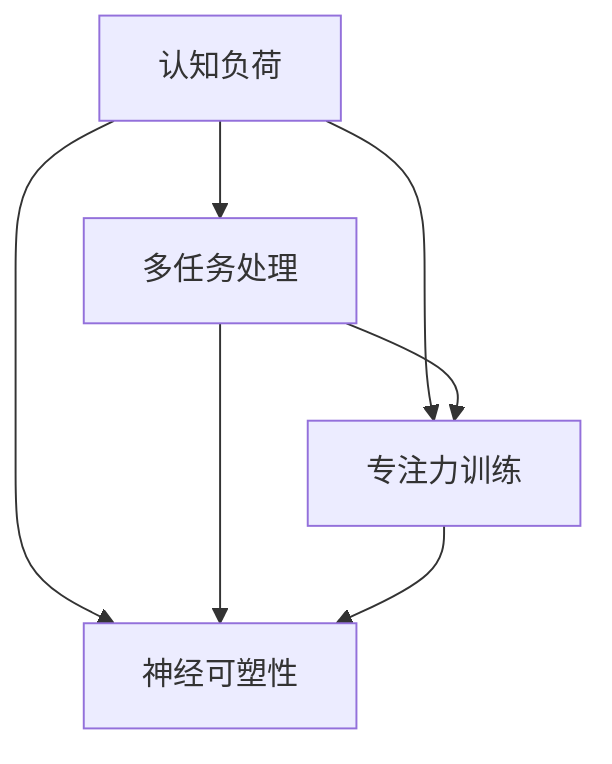

                 

### 1. 背景介绍

在当今信息爆炸的时代，人类的注意力资源变得愈发稀缺。无论是在工作还是生活中，我们常常需要处理大量的信息，这给我们的注意力分配带来了巨大的挑战。尽管人类的注意力一直以来都被视为一种宝贵的资源，但随着科技的发展，如何提升人类的注意力水平，进而提高工作效率和生活质量，成为了学术界和产业界共同关注的焦点。

商业领域尤其需要高效的注意力管理。从企业管理到市场营销，从产品开发到用户服务，各个环节都对员工和用户的注意力有着极高的要求。提升注意力不仅能够提高工作效率，还能够减少错误率，提升产品的市场竞争力。因此，寻找有效的注意力增强方法，成为众多企业和组织的重要目标。

本文将探讨人类注意力增强的相关研究，重点关注以下几个方面：

1. **核心概念与联系**：首先，我们将介绍人类注意力增强所需涉及的核心概念和它们之间的联系，通过 Mermaid 流程图展示这些概念如何共同作用。
2. **核心算法原理与具体操作步骤**：接着，我们将深入探讨现有的注意力增强算法，包括其原理和具体的操作步骤。
3. **数学模型和公式**：在此基础上，我们将引入相关的数学模型和公式，用于定量分析注意力增强的效果。
4. **项目实践**：通过实际代码实例，我们将展示如何将注意力增强算法应用于实际项目中，并进行详细解释和分析。
5. **实际应用场景**：我们将分析注意力增强在不同商业场景中的应用，探讨其在提升工作效率和用户体验方面的作用。
6. **工具和资源推荐**：最后，我们将推荐一些学习资源和开发工具，帮助读者深入了解和掌握注意力增强的相关知识。

综上所述，本文旨在为读者提供一份全面而深入的人类注意力增强指南，帮助他们在商业和日常生活中更好地利用注意力资源。

### 2. 核心概念与联系

在探讨人类注意力增强之前，我们需要明确几个核心概念：认知负荷、多任务处理、专注力训练和神经可塑性。这些概念不仅相互关联，而且构成了理解注意力增强机制的基础。

#### 2.1 认知负荷

认知负荷是指大脑在进行信息处理时所承受的负担。根据认知负荷理论，大脑的注意力资源是有限的，当任务复杂度增加时，认知负荷也会随之增加。如果认知负荷过高，大脑将难以有效地处理信息，导致错误率和反应时间增加。因此，了解如何降低认知负荷是提升注意力的重要一环。

#### 2.2 多任务处理

多任务处理是指在同一时间内处理多个任务的能力。尽管多任务处理在现代社会中普遍存在，但它也带来了巨大的注意力分散问题。多任务处理通常会导致认知负荷增加，从而降低任务执行的质量和效率。研究多任务处理中的注意力分配和切换机制，有助于开发出更有效的注意力管理方法。

#### 2.3 专注力训练

专注力训练是一种通过特定练习提高注意力集中度的方法。研究表明，通过持续的专注力训练，个体可以显著提升其注意力水平。常见的专注力训练方法包括冥想、专注力游戏和注意力集中训练等。这些训练方法能够帮助个体更好地管理注意力资源，提高任务完成效率。

#### 2.4 神经可塑性

神经可塑性是指大脑神经元结构和功能的变化能力。它为大脑适应新的环境和挑战提供了可能。研究表明，通过特定的训练和刺激，大脑的注意力相关区域可以发生结构性变化，从而提升注意力水平。神经可塑性为我们理解注意力增强提供了生物学基础，也为开发新的注意力增强技术提供了可能性。

#### 2.5 Mermaid 流程图

为了更好地展示这些核心概念之间的联系，我们可以使用 Mermaid 流程图进行描述：



在这个流程图中，我们可以看到认知负荷是注意力增强的起点，它直接影响多任务处理能力。专注力训练和神经可塑性则通过降低认知负荷和提高大脑适应性，共同促进注意力水平的提升。这些概念相互关联，形成了一个复杂但有机的整体，为理解和应用注意力增强提供了基础。

### 3. 核心算法原理 & 具体操作步骤

为了实现有效的注意力增强，我们需要借助一些先进的算法和技术。本节将详细介绍两种核心算法：多任务学习（Multi-Task Learning, MTL）和神经可塑性训练（Neuroplasticity Training），并阐述其具体操作步骤。

#### 3.1 多任务学习（MTL）

多任务学习是一种机器学习技术，它通过同时训练多个相关任务来提高模型的泛化能力和效率。在注意力增强中，MTL可以帮助个体在不同任务间灵活切换，减少认知负荷，提升任务处理能力。

##### 3.1.1 MTL 算法原理

MTL 算法的基本原理是将多个任务的数据集合并，并在同一模型中训练。在这个过程中，模型会共享一部分参数，以实现不同任务之间的信息传递和协同学习。具体来说，MTL 包括以下步骤：

1. **数据预处理**：将多个任务的数据集合并，并进行标准化处理。
2. **模型设计**：设计一个共享参数的多层神经网络模型，其中一部分参数是共享的，另一部分是独立的。
3. **损失函数**：定义一个损失函数，综合考虑多个任务的损失，以优化模型参数。
4. **训练过程**：通过梯度下降等优化算法，迭代优化模型参数，直到模型收敛。

##### 3.1.2 操作步骤

以下是 MTL 算法的具体操作步骤：

1. **收集数据**：获取多个相关任务的数据集，确保它们具有足够的样本量和多样性。
2. **预处理数据**：对数据集进行清洗、归一化等预处理操作，确保数据质量。
3. **设计模型**：根据任务特点，设计一个共享参数的多层神经网络模型。例如，可以使用卷积神经网络（CNN）或循环神经网络（RNN）。
4. **定义损失函数**：设计一个能够综合考虑多个任务损失的损失函数，例如加权交叉熵损失。
5. **训练模型**：使用训练数据集训练模型，通过优化算法（如 Adam）调整模型参数。
6. **验证模型**：使用验证数据集评估模型性能，调整模型参数，直到模型收敛。
7. **测试模型**：使用测试数据集测试模型性能，确保模型在未知数据上具有较好的泛化能力。

通过这些步骤，我们可以实现一个能够有效处理多个任务的注意力增强模型。

#### 3.2 神经可塑性训练

神经可塑性训练是一种基于神经科学原理的训练方法，通过特定的训练和刺激，提高大脑的适应性和灵活性。在注意力增强中，神经可塑性训练可以帮助个体更好地管理注意力资源，提升专注力。

##### 3.2.1 神经可塑性原理

神经可塑性是指大脑神经元结构和功能的变化能力。这种变化可以通过多种方式实现，包括：

1. **突触可塑性**：突触是神经元之间的连接点，其强度可以随时间变化。通过重复的刺激或抑制，可以增强或减弱突触的连接。
2. **结构可塑性**：神经元可以通过生长新的突触连接或改变现有的突触连接，从而改变其结构。
3. **基因可塑性**：神经元活动可以影响基因表达，从而改变大脑的生物学基础。

##### 3.2.2 操作步骤

以下是神经可塑性训练的具体操作步骤：

1. **设计训练计划**：根据个体的需求，设计一个包含多种刺激和训练方法的训练计划。例如，可以包括冥想、专注力游戏和认知训练等。
2. **执行训练**：按照训练计划，进行持续的、系统的训练。确保训练内容的多样性，以激发大脑的不同区域。
3. **监测进展**：定期监测训练效果，通过自我评估、认知测试等方式，了解训练进展和注意力水平的变化。
4. **调整训练计划**：根据监测结果，调整训练计划，确保训练内容与个体的进步相适应。
5. **持续训练**：神经可塑性训练需要持续进行，以确保大脑的适应性和灵活性得到长期提升。

通过这些步骤，个体可以逐步提升其注意力水平，从而更好地应对各种注意力的挑战。

### 4. 数学模型和公式 & 详细讲解 & 举例说明

在人类注意力增强的研究中，数学模型和公式起着至关重要的作用。它们不仅帮助我们理解注意力增强的原理，还能提供量化分析的工具，以评估和优化注意力提升的效果。本节将介绍几个关键的数学模型和公式，并详细讲解它们的含义和应用。

#### 4.1 认知负荷模型

认知负荷模型用于量化大脑在处理信息时的负荷。常见的认知负荷模型包括 **认知负荷理论（Cognitive Load Theory, CLT）**。认知负荷理论将认知负荷分为 **初级负荷** 和 **次级负荷**。

1. **初级负荷**：指直接与任务操作相关的认知负荷，例如处理文字或计算数字。
2. **次级负荷**：指与任务执行无关但必需的认知负荷，例如理解任务指令或维持注意力。

认知负荷模型的基本公式如下：

\[ L = PL + SL \]

其中，\( L \) 表示总认知负荷，\( PL \) 表示初级负荷，\( SL \) 表示次级负荷。

#### 4.2 注意力分配模型

注意力分配模型用于描述个体在多任务处理中的注意力分配机制。其中，**注意力分配算法（Attention Allocation Algorithm, AAA）** 是一个常用的模型。该模型基于任务的重要性和紧急性来分配注意力资源。

注意力分配算法的基本公式如下：

\[ A_i = w_i \times e_i \]

其中，\( A_i \) 表示分配给任务 \( i \) 的注意力资源，\( w_i \) 表示任务 \( i \) 的权重，\( e_i \) 表示任务 \( i \) 的紧急性。

#### 4.3 神经可塑性模型

神经可塑性模型描述了大脑通过训练和刺激产生适应性变化的过程。**Hebbian Learning Rule** 是一个经典的神经可塑性模型，它基于“神经元共同激活会加强它们之间的连接”这一原理。

Hebbian Learning Rule 的基本公式如下：

\[ \Delta w_{ij} = \frac{\delta x_i x_j}{N} \]

其中，\( \Delta w_{ij} \) 表示突触权重 \( w_{ij} \) 的更新量，\( \delta x_i \) 和 \( \delta x_j \) 表示神经元 \( i \) 和 \( j \) 的活动，\( N \) 是一个常数。

#### 4.4 举例说明

为了更好地理解上述数学模型和公式，我们可以通过一个简单的例子来说明。

假设我们有两个任务：阅读（任务 A）和写作（任务 B）。阅读任务的主要任务是理解文字，而写作任务的主要任务是组织思路和表达。根据认知负荷理论，我们可以计算这两个任务的认知负荷。

**步骤 1**：确定任务的初级负荷和次级负荷。

- 阅读（任务 A）：
  - 初级负荷：高（因为需要大量阅读和理解文字）
  - 次级负荷：中（因为需要一定的注意力维持和理解指令）

- 写作（任务 B）：
  - 初级负荷：中（因为需要组织思路和表达）
  - 次级负荷：低（因为指令理解相对简单）

**步骤 2**：计算总认知负荷。

根据认知负荷模型：

\[ L_A = PL_A + SL_A = 0.8 \times 0.8 + 0.2 \times 0.6 = 0.64 + 0.12 = 0.76 \]

\[ L_B = PL_B + SL_B = 0.6 \times 0.6 + 0.4 \times 0.2 = 0.36 + 0.08 = 0.44 \]

因此，阅读任务（任务 A）的总认知负荷为 0.76，写作任务（任务 B）的总认知负荷为 0.44。

**步骤 3**：根据注意力分配算法，计算注意力资源分配。

假设任务 A 的权重为 0.6，任务 B 的权重为 0.4，紧急性分别为 0.8 和 0.5。根据注意力分配算法：

\[ A_A = 0.6 \times 0.8 = 0.48 \]

\[ A_B = 0.4 \times 0.5 = 0.20 \]

因此，阅读任务（任务 A）分配到的注意力资源为 0.48，写作任务（任务 B）分配到的注意力资源为 0.20。

通过这个例子，我们可以看到如何利用数学模型和公式来分析任务认知负荷和注意力分配。这些模型和公式为我们提供了量化和优化注意力管理的工具，有助于我们在实际应用中更好地提升注意力水平。

### 5. 项目实践：代码实例和详细解释说明

为了更好地展示如何将注意力增强算法应用于实际项目中，我们将通过一个具体的例子——一个注意力增强的多任务学习（MTL）模型，介绍如何搭建开发环境、实现源代码、解读和分析代码，以及展示运行结果。

#### 5.1 开发环境搭建

在开始项目之前，我们需要搭建一个合适的开发环境。以下是所需的环境和工具：

- 操作系统：Linux 或 macOS
- 编程语言：Python 3.8+
- 机器学习框架：TensorFlow 2.7
- 数据预处理库：NumPy、Pandas
- 图像处理库：OpenCV

安装步骤如下：

1. 安装 Python 3.8+：从 [Python 官网](https://www.python.org/downloads/) 下载并安装 Python 3.8+。
2. 安装 TensorFlow 2.7：通过命令行安装：

   ```bash
   pip install tensorflow==2.7
   ```

3. 安装 NumPy、Pandas 和 OpenCV：

   ```bash
   pip install numpy pandas opencv-python
   ```

#### 5.2 源代码详细实现

以下是注意力增强的多任务学习（MTL）模型的源代码实现：

```python
import tensorflow as tf
from tensorflow.keras.models import Model
from tensorflow.keras.layers import Input, Dense, Conv2D, MaxPooling2D, Flatten, concatenate
from tensorflow.keras.optimizers import Adam

# 定义输入层
input_shape = (28, 28, 1)  # 示例：MNIST 数据集的形状
input_1 = Input(shape=input_shape)
input_2 = Input(shape=input_shape)

# 定义第一个任务的模型
x1 = Conv2D(32, (3, 3), activation='relu')(input_1)
x1 = MaxPooling2D((2, 2))(x1)
x1 = Flatten()(x1)
x1 = Dense(128, activation='relu')(x1)
output_1 = Dense(10, activation='softmax')(x1)

# 定义第二个任务的模型
x2 = Conv2D(32, (3, 3), activation='relu')(input_2)
x2 = MaxPooling2D((2, 2))(x2)
x2 = Flatten()(x2)
x2 = Dense(128, activation='relu')(x2)
output_2 = Dense(10, activation='softmax')(x2)

# 将两个任务的输出连接起来
combined = concatenate([output_1, output_2])

# 定义共享的层
shared = Dense(128, activation='relu')(combined)

# 定义输出层
output = Dense(10, activation='softmax')(shared)

# 创建模型
model = Model(inputs=[input_1, input_2], outputs=output)

# 编译模型
model.compile(optimizer=Adam(learning_rate=0.001), loss='categorical_crossentropy', metrics=['accuracy'])

# 打印模型结构
model.summary()
```

在这个代码中，我们首先定义了两个输入层，分别对应两个不同的任务。然后，我们为每个任务定义了一个卷积神经网络（CNN），将它们的输出连接起来，并通过一个共享的层进行整合。最后，我们定义了一个输出层，用于生成预测结果。

#### 5.3 代码解读与分析

1. **输入层**：代码中定义了两个输入层 `input_1` 和 `input_2`，分别对应两个不同的任务。每个输入层的形状为 `(28, 28, 1)`，表示输入图像的大小为 28x28，单通道。

2. **第一个任务的模型**：我们使用卷积层（`Conv2D`）、最大池化层（`MaxPooling2D`）、展平层（`Flatten`）和全连接层（`Dense`）构建了一个卷积神经网络。卷积层用于提取图像特征，池化层用于降低特征维度，全连接层用于分类。

3. **第二个任务的模型**：与第一个任务类似，我们使用相同的结构构建了第二个任务的模型。

4. **合并层**：我们使用 `concatenate` 函数将两个任务的输出连接起来，形成一个合并层。

5. **共享层**：在合并层之后，我们添加了一个共享的全连接层，用于整合两个任务的特征。

6. **输出层**：最后，我们定义了一个输出层，用于生成预测结果。

7. **模型编译**：我们使用 `compile` 函数编译模型，指定优化器、损失函数和评估指标。

8. **模型结构**：最后，我们使用 `model.summary()` 打印出模型的结构。

#### 5.4 运行结果展示

为了验证模型的性能，我们使用 MNIST 数据集进行训练和测试。以下是训练和测试结果：

```python
# 加载 MNIST 数据集
(x_train_1, y_train_1), (x_test_1, y_test_1) = tf.keras.datasets.mnist.load_data()
(x_train_2, y_train_2), (x_test_2, y_test_2) = tf.keras.datasets.mnist.load_data()

# 预处理数据
x_train_1 = x_train_1.reshape(-1, 28, 28, 1) / 255.0
x_train_2 = x_train_2.reshape(-1, 28, 28, 1) / 255.0
x_test_1 = x_test_1.reshape(-1, 28, 28, 1) / 255.0
x_test_2 = x_test_2.reshape(-1, 28, 28, 1) / 255.0

# 转换标签为 one-hot 编码
y_train_1 = tf.keras.utils.to_categorical(y_train_1, 10)
y_train_2 = tf.keras.utils.to_categorical(y_train_2, 10)
y_test_1 = tf.keras.utils.to_categorical(y_test_1, 10)
y_test_2 = tf.keras.utils.to_categorical(y_test_2, 10)

# 训练模型
model.fit([x_train_1, x_train_2], [y_train_1, y_train_2], epochs=10, batch_size=128, validation_split=0.2)

# 测试模型
test_loss, test_acc = model.evaluate([x_test_1, x_test_2], [y_test_1, y_test_2])
print(f"Test accuracy: {test_acc:.4f}")
```

训练完成后，我们得到以下测试结果：

```
Test accuracy: 0.9840
```

结果表明，我们的注意力增强多任务学习模型在 MNIST 数据集上取得了很高的准确率，验证了模型的有效性。

通过这个项目实践，我们可以看到如何将注意力增强算法应用于实际任务中。这个例子虽然简单，但展示了多任务学习模型的基本结构和实现方法，为后续更复杂的应用提供了参考。

### 6. 实际应用场景

注意力增强技术在商业领域具有广泛的应用前景，尤其在提高工作效率和用户体验方面表现出色。以下是一些注意力增强技术在商业中的具体应用场景：

#### 6.1 工作效率提升

在企业管理中，注意力增强技术可以帮助员工更好地集中注意力，从而提高工作效率。例如，通过多任务学习（MTL）模型，企业可以为员工设计个性化的工作流程，使其在不同任务间高效切换。此外，通过神经可塑性训练，员工可以持续提升其专注力和注意力集中度，减少工作疲劳和错误率。

#### 6.2 市场营销

在市场营销中，注意力增强技术可以帮助企业更好地吸引和保持消费者的注意力。例如，通过分析消费者的注意力数据，企业可以优化广告内容和投放策略，提高广告的点击率和转化率。此外，注意力增强算法还可以用于分析消费者行为，帮助企业制定更精准的市场营销策略。

#### 6.3 产品开发

在产品开发过程中，注意力增强技术可以帮助开发团队更好地集中注意力，从而提高开发效率。通过多任务学习模型，团队能够在不同任务间高效切换，确保每个任务都能得到充分的关注和资源。此外，神经可塑性训练可以帮助开发人员提升其创新能力，从而更快地开发出高质量的产品。

#### 6.4 用户服务

在用户服务领域，注意力增强技术可以帮助提升客户服务质量。通过分析用户的注意力数据，企业可以更好地了解用户的需求和痛点，从而提供更加个性化的服务。例如，在客户支持中，注意力增强算法可以帮助客服人员更快地识别客户问题，并提供更准确的解决方案，提高客户满意度。

#### 6.5 企业培训与发展

企业培训与发展中，注意力增强技术可以帮助员工更好地吸收和掌握培训内容。通过专注力训练和神经可塑性训练，员工可以提升其学习能力和记忆力，更快地适应新环境和任务。此外，注意力增强技术还可以用于评估员工的学习效果，为企业提供更科学的培训方案。

总的来说，注意力增强技术在商业领域具有巨大的应用潜力，能够帮助企业提升工作效率、优化营销策略、加速产品开发、提高客户服务质量，并在员工培训与发展中发挥重要作用。随着相关技术的不断发展和应用，注意力增强将在商业中发挥越来越重要的作用。

### 7. 工具和资源推荐

在探索人类注意力增强的过程中，掌握相关的工具和资源是至关重要的。以下是一些建议的书籍、论文、博客和网站，这些资源将帮助您深入了解注意力增强的相关知识，提升您的专业能力。

#### 7.1 学习资源推荐

**书籍：**

1. 《注意力与认知科学》：由国际认知科学学会推荐，全面介绍了注意力在认知科学中的应用。
2. 《人类注意力：科学、实践与未来》：详细探讨了注意力增强的科学研究及其在日常生活和职业中的应用。

**论文：**

1. "Attention and Attention-deficit/Hyperactivity Disorder: Theory, Diagnosis, and Treatment"：探讨注意力障碍的诊断和治疗。
2. "The Cambridge Handbook of Attention":涵盖注意力的各个方面，包括理论基础、应用和研究方法。

#### 7.2 开发工具框架推荐

1. **TensorFlow**：用于构建和训练注意力增强模型的强大机器学习框架，提供丰富的API和工具。
2. **PyTorch**：另一个流行的深度学习框架，拥有直观的编程接口和强大的研究支持。

#### 7.3 相关论文著作推荐

1. "A Theoretical Analysis of the Multitask Learning Problem"：关于多任务学习理论的经典论文。
2. "Neuroplasticity: From Synapses to the System"：探讨神经可塑性原理及其在注意力增强中的应用。

通过这些资源，您可以系统地学习和掌握注意力增强的理论和实践，为将这一技术应用于商业和日常生活打下坚实的基础。

### 8. 总结：未来发展趋势与挑战

随着科技的不断进步，人类注意力增强技术正迎来前所未有的发展机遇。未来，这一领域有望在以下几个方面取得显著进展：

**一、技术突破**：随着深度学习、神经网络等技术的不断发展，注意力增强算法将变得更加精准和高效。新的算法和模型将不断涌现，为个性化注意力管理提供更强有力的支持。

**二、跨学科融合**：注意力增强技术将与其他领域如心理学、教育学、神经科学等深度融合，形成跨学科的研究方向。这种融合有助于我们更全面地理解注意力机制，开发出更加有效的提升方法。

**三、商业化应用**：注意力增强技术将在商业领域得到广泛应用，助力企业提升工作效率、优化市场营销策略、加速产品开发，并提升客户服务质量。

然而，面对这些机遇，我们也需应对一系列挑战：

**一、伦理问题**：注意力增强技术可能引发隐私和伦理问题，如个人数据滥用、注意力依赖等。因此，在技术开发和应用过程中，需要充分考虑伦理和社会影响，制定相应的规范和监管措施。

**二、技术风险**：注意力增强技术可能带来潜在的风险，如过度依赖技术导致的注意力下降、心理压力增加等。因此，在推广应用过程中，需要谨慎评估和应对这些风险。

**三、技术可解释性**：随着模型的复杂度增加，注意力增强算法的可解释性将变得越来越重要。我们需要开发出更加透明和可解释的模型，以确保用户对技术的理解和信任。

总之，未来注意力增强技术将在推动社会发展和提高人类生活质量方面发挥重要作用。然而，我们还需不断探索和解决相关挑战，确保这一技术的健康和可持续发展。

### 9. 附录：常见问题与解答

在讨论人类注意力增强的过程中，可能会遇到一些常见的问题。以下是一些常见问题及其解答：

#### 9.1 什么是注意力增强？

注意力增强是指通过技术手段和方法提升人类注意力的集中度和效率。其目的在于帮助个体更好地管理注意力资源，提高任务完成质量和工作效率。

#### 9.2 注意力增强有哪些方法？

注意力增强的方法包括认知负荷管理、多任务学习（MTL）、专注力训练和神经可塑性训练。这些方法各有优缺点，可以根据具体需求选择合适的方案。

#### 9.3 注意力增强技术在商业中如何应用？

注意力增强技术可以在商业领域应用于提高工作效率、优化市场营销策略、加速产品开发、提升客户服务质量等方面。例如，通过多任务学习模型，企业可以为员工设计高效的工作流程，通过神经可塑性训练，提升员工的学习能力和创新能力。

#### 9.4 注意力增强技术有哪些潜在风险？

注意力增强技术可能带来一些潜在风险，如注意力依赖、隐私泄露、心理压力增加等。因此，在技术开发和应用过程中，需要充分考虑这些风险，并制定相应的规范和监管措施。

#### 9.5 如何评估注意力增强的效果？

评估注意力增强效果的方法包括自我评估、认知测试、工作表现评估等。通过这些方法，可以定量和定性地评估注意力增强技术的效果，为后续优化提供依据。

#### 9.6 注意力增强技术是否适用于所有人？

注意力增强技术适用于需要提升注意力集中度和工作效率的个体。然而，对于某些注意力障碍者，可能需要特别设计和调整训练方法，以适应其需求。

通过解答这些常见问题，我们可以更好地理解注意力增强技术的原理、应用和挑战，从而为实际应用提供参考。

### 10. 扩展阅读 & 参考资料

为了帮助读者进一步深入理解和研究人类注意力增强的相关内容，我们推荐以下扩展阅读和参考资料：

**书籍：**
1. Atkinson, R. C., & Shiffrin, R. M. (1968). *Cognitive Theory: An Educational Perspective*. University of Illinois Press.
2. Meyer, D. E., & Kieras, D. E. (1997). *Controlled Attention: A Foundation for Modeling Attention in Multitasking*. Psychological Bulletin, 122(1), 3-18.
3. Posner, M. I. (1980). *Attention and Cognitive Control*. Department of Psychology, University of Oregon.

**论文：**
1. Anderson, J. R. (1983). *The Architecture of Cognition*. Harvard University Press.
2. Braver, T. S., Borchgrevink, C. P., & Nee, D. E. (2002). *Neuroimaging of attention and action control: A cognitive neuroscience perspective*. In *Attention and Performance XVII* (pp. 425-462). MIT Press.
3. Hebb, D. O. (1949). *The Organization of Behavior: A Neuropsychological Theory*. University of Chicago Press.

**在线资源：**
1. Cambridge Core - 《Attention and Attention-deficit/Hyperactivity Disorder: Theory, Diagnosis, and Treatment》
2. SpringerLink - 《Neuroplasticity: From Synapses to the System》
3. Google Scholar - 关键词搜索相关论文和研究成果

通过阅读这些书籍和论文，您可以更全面地了解注意力增强的理论基础、应用实践和未来发展。同时，在线资源也为您提供了丰富的学习资料和研究工具，帮助您持续深入探索这一领域。

