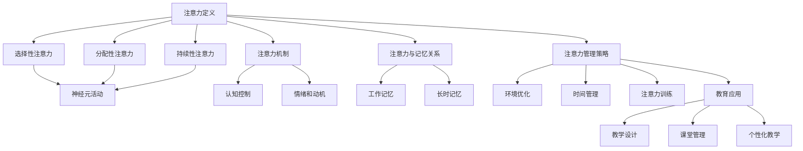

                 

### 背景介绍 Background

在现代教育体系中，学生的注意力管理问题逐渐成为了一个备受关注的重要议题。随着信息技术的飞速发展，学生们面临着前所未有的信息爆炸和娱乐诱惑，导致他们在课堂上难以保持专注。这不仅影响了学习效果，还可能导致心理健康问题。

注意力是心理活动对一定对象的指向和集中，是心理过程的动力特征之一。它是心理活动的基础，影响着人的感知、记忆、思维和情感等心理活动的效果。然而，研究表明，注意力是有限的资源，会随着时间推移而逐渐下降。特别是在课堂这种长时间的注意任务中，学生的注意力容易分散，难以维持高效的学习状态。

因此，提高学生的注意力成为教育领域中一个关键的任务。通过有效的注意力管理策略，可以帮助学生更好地集中注意力，提高学习效率。本文将探讨人类注意力增强的方法，特别是那些在教育领域中被广泛应用的方法，以及如何将这些方法融入到课堂教学中。

本文的研究目的在于：

1. **定义注意力及其在教育中的重要性**：明确注意力是什么，它对学习过程的影响，以及为什么在课堂中注意力管理至关重要。
2. **介绍注意力增强的方法**：概述当前被广泛认可和使用的方法，包括环境优化、时间管理、注意力训练等。
3. **探讨这些方法在实际教学中的应用**：分析如何将注意力增强的方法应用到实际教学场景中，以提高学生的学习效果。
4. **总结与展望**：讨论注意力管理方法在教育领域的未来发展趋势和潜在挑战。

通过本文的深入探讨，希望为教育工作者和研究者提供实用的指导和建议，帮助他们更好地理解和应对学生的注意力管理问题，从而提升教育质量。

### 核心概念与联系 Core Concepts and Relationships

在探讨如何增强人类注意力之前，我们需要明确几个核心概念，并理解它们之间的相互联系。以下是本文中涉及到的几个关键概念：

#### 注意力的定义和分类

注意力是心理活动对一定对象的指向和集中，是人类感知、记忆、思维和情感等心理过程的基础。根据注意力的指向性和选择性，可以将注意力分为以下几类：

1. **选择性注意力**：人们无法同时关注所有信息，只能选择性地关注某些信息，忽略其他信息。
2. **分配性注意力**：在同一时间内，人们可以同时关注多个任务，但任务的数量和复杂性会影响注意力的分配效率。
3. **持续性注意力**：保持注意力的时间长度，对于长时间的注意任务，如课堂学习，持续性注意力尤为重要。

#### 注意力机制

注意力机制是大脑处理信息的重要方式，包括以下几种：

1. **神经元活动**：大脑中的神经元通过兴奋和抑制的活动来传递和处理信息，注意力的产生和维持与这些神经元的活动密切相关。
2. **认知控制**：注意力需要认知控制来调节和分配注意力资源，控制注意力的指向和集中。
3. **情绪和动机**：情绪和动机状态对注意力有显著影响，积极的情绪和强烈的动机可以提高注意力水平。

#### 注意力与记忆的关系

注意力与记忆之间存在密切的联系，良好的注意力可以提高记忆效果：

1. **工作记忆**：工作记忆是一种短暂的、有限的记忆系统，注意力有助于在工作记忆中保持和加工信息。
2. **长时记忆**：注意力影响信息进入长时记忆的过程，注意力的集中和持久有助于信息在长时记忆中稳固下来。

#### 注意力管理的策略

为了增强注意力，可以采用多种管理策略，包括：

1. **环境优化**：通过减少干扰因素、提高学习环境舒适度来增强注意力。
2. **时间管理**：合理安排学习时间，避免过度疲劳，以提高持续性注意力。
3. **注意力训练**：通过特定训练方法，如冥想和注意力游戏，提高注意力水平。

#### 教育中的应用

在教育中，注意力管理策略的应用尤为重要：

1. **教学设计**：教师可以通过调整教学方式、增加互动环节来提高学生的注意力。
2. **课堂管理**：教师需要采用有效的课堂管理策略，如明确课堂规则、合理安排课程节奏，以维持学生的注意力。
3. **个性化教学**：针对不同学生的注意力特点，教师可以采用个性化的教学方法，以适应不同学生的需求。

为了更直观地展示上述概念之间的联系，我们使用Mermaid流程图来描绘注意力增强的核心概念和关系。



通过上述概念和关系的介绍，我们可以更好地理解注意力增强的方法及其在教育中的应用，为后续章节的详细探讨打下坚实的基础。

### 核心算法原理 & 具体操作步骤 Core Algorithm Principles & Specific Steps

为了增强人类注意力，教育领域和应用技术领域发展了一系列的算法和具体操作步骤。以下是几个核心方法及其工作原理：

#### 1. 注意力加权模型（Attentional Weighting Model）

**原理**：注意力加权模型通过调整不同信息点的权重来优化注意力资源的使用。其基本思想是，对于给定任务，某些信息比其他信息更重要，应当给予更高的权重。

**具体操作步骤**：

1. **识别关键信息**：首先，确定哪些信息对于当前任务是关键的。例如，在阅读文章时，关键信息可能是标题、摘要和重点段落。
2. **计算权重**：使用算法计算每个信息点的权重。权重可以通过多种方式计算，如基于信息的重要程度、出现频率或对任务的贡献度。
3. **调整注意力**：根据计算出的权重，调整注意力的分配。将更多注意力集中在高权重信息上，减少对低权重信息的关注。

**示例**：在阅读理解任务中，可以使用词频统计和文本分析技术来计算每个单词的权重。高频词和关键词会被赋予更高的权重，从而在阅读时优先关注。

#### 2. 注意力分配策略（Attention Allocation Strategy）

**原理**：注意力分配策略旨在通过优化注意力的分配，提高整体任务的处理效率。其核心思想是，在多个任务或多个注意对象之间动态调整注意力的分配，以实现最佳绩效。

**具体操作步骤**：

1. **任务分析**：首先，分析当前任务的需求，确定需要多少注意力资源。例如，在一个包含多个子任务的复杂项目中，需要确定每个子任务的重要性和紧急程度。
2. **资源评估**：评估可用的注意力资源总量。这包括考虑个人的疲劳程度、认知负荷等因素。
3. **动态调整**：根据任务需求和资源评估，动态调整注意力的分配。在关键任务上投入更多注意力，同时适时地调整以避免过度疲劳。

**示例**：在项目管理中，可以使用优先级矩阵来评估每个任务的优先级和所需时间，然后根据这些评估动态调整团队成员的注意力分配。

#### 3. 注意力训练算法（Attention Training Algorithm）

**原理**：注意力训练算法通过特定的训练任务，逐步提高个体的注意力水平和分配效率。其基本思想是通过反复的练习，增强注意力的集中和控制能力。

**具体操作步骤**：

1. **选择训练任务**：根据个体需求和目标，选择适合的训练任务。例如，可以使用视觉注意任务、听觉注意任务或认知控制任务。
2. **制定训练计划**：制定系统的训练计划，包括训练任务的种类、难度和时长。训练计划应当逐步增加难度，以挑战和提升注意力的集中能力。
3. **执行训练**：按照训练计划，定期执行注意力训练任务。在训练过程中，记录个体的表现和进步，以调整训练计划。
4. **评估效果**：通过定期的评估，检查注意力训练的效果。可以使用标准化的注意力测试工具，如注意力集中度量表（ADHD Scale）等。

**示例**：可以使用基于计算机的注意力训练游戏，如“视觉搜索任务”或“听觉辨别任务”，来逐步提高个体的注意力水平。这些游戏可以在不同难度下提供重复的训练，帮助个体建立和提高注意力集中能力。

#### 4. 注意力管理应用（Attention Management Applications）

**原理**：注意力管理应用是将注意力增强的方法集成到日常任务和活动中，以帮助个体更好地管理注意力资源。

**具体操作步骤**：

1. **识别干扰源**：首先，识别和了解哪些因素可能会干扰注意力。例如，社交媒体通知、噪声或其他分心的事物。
2. **制定行动计划**：制定具体的行动计划来管理这些干扰源。例如，设置“专注时间”时段，关闭通知，减少干扰。
3. **执行计划**：按照行动计划执行，坚持在特定时间内保持高度集中，避免分心。
4. **反思和调整**：在执行过程中，定期反思和调整注意力管理策略。根据实际情况，调整计划，以优化注意力管理效果。

**示例**：使用应用程序或工具，如“专注森林”或“番茄钟”，来帮助个体在特定时间段内保持专注。这些工具提供视觉和听觉反馈，帮助个体监控和调节注意力。

通过以上核心算法原理和具体操作步骤的介绍，我们可以看到，注意力增强不仅依赖于理论基础，还需要实际操作和持续训练。这些方法和步骤为教育工作者和研究人员提供了有效的工具，以帮助学生在学习和日常生活中更好地管理注意力。

#### 数学模型和公式 Detailed Explanation and Example

在注意力增强的研究中，数学模型和公式扮演着至关重要的角色，它们不仅帮助理论分析，也为实验设计提供了依据。以下将详细讲解几个常用的数学模型和公式，并通过实例说明其应用。

##### 1. 期望价值模型（Expected Value Model）

**原理**：期望价值模型用于评估不同选择或决策带来的预期效果，帮助个体在注意力分配时做出最优选择。

**公式**：
\[ EV = \sum_{i=1}^{n} (p_i \times v_i) \]

其中，\( p_i \) 是选择 \( i \) 的概率，\( v_i \) 是选择 \( i \) 的价值。

**实例**：假设学生需要在阅读、写作和数学三个学科上分配注意力。根据预期成绩，阅读的期望价值是 0.5，写作是 0.3，数学是 0.2。假设每个学科需要投入的注意力时间是相同的，那么应该优先分配多少注意力？

\[ EV_{阅读} = 0.5 \times T \]
\[ EV_{写作} = 0.3 \times T \]
\[ EV_{数学} = 0.2 \times T \]

其中，\( T \) 是总注意力时间。

通过比较三个期望值，可以发现阅读的期望价值最高，因此应分配更多的注意力。

##### 2. 贝叶斯优化模型（Bayesian Optimization Model）

**原理**：贝叶斯优化模型通过历史数据来预测和优化未来性能，常用于注意力分配的动态调整。

**公式**：
\[ P(\theta | X) \propto P(X | \theta) \cdot P(\theta) \]

其中，\( \theta \) 是模型参数，\( X \) 是观察数据。

**实例**：假设教师使用贝叶斯优化模型来调整课堂节奏，以保持学生的注意力。根据过去的教学记录，每个教学环节保持 5 分钟能够获得最佳注意力效果。现在，教师希望调整下一个环节的时间长度。

根据历史数据，保持时间在 4 到 6 分钟范围内的效果较好，教师可以通过贝叶斯优化模型来预测最优时间。

\[ P(\theta = 5 | \text{历史数据}) \propto P(\text{历史数据} | \theta = 5) \cdot P(\theta = 5) \]

通过计算，教师可以确定下一个最佳时间。

##### 3. 神经网络模型（Neural Network Model）

**原理**：神经网络模型通过模拟人脑神经元之间的交互，用于复杂的注意力分配和预测任务。

**公式**：
\[ z = \sum_{i} w_i \cdot a_i + b \]
\[ a_i = \frac{1}{1 + e^{-z_i}} \]
\[ \delta = \frac{\partial C}{\partial z} \cdot (1 - a) \cdot a \]

其中，\( z \) 是神经元激活值，\( w_i \) 是权重，\( a_i \) 是激活函数输出，\( b \) 是偏置，\( C \) 是损失函数，\( \delta \) 是误差项。

**实例**：在教育应用中，可以使用神经网络模型来预测学生注意力的变化，并根据预测结果动态调整教学策略。

例如，输入数据包括学生的年龄、学科难度、课堂时长等，模型可以输出每个时间段的最佳教学策略，以保持学生的注意力。

通过以上数学模型和公式的详细讲解和实例说明，我们可以看到，数学在注意力增强中的应用不仅提高了理论分析的深度，也为实践操作提供了强有力的工具。这些模型和公式帮助教育工作者和研究人员更好地理解和优化注意力管理策略，从而提升教育效果。

### 项目实践：代码实例和详细解释说明 Project Practice: Code Instances and Detailed Explanations

在本节中，我们将通过具体的代码实例来展示如何在实际项目中应用注意力增强的方法，并详细解释这些代码的实现过程和功能。

#### 开发环境搭建

首先，我们需要搭建一个适合开发注意力增强应用的开发环境。以下是一个基本的开发环境配置：

1. **操作系统**：Ubuntu 20.04 或 Windows 10
2. **编程语言**：Python 3.8+
3. **依赖管理工具**：pip 或 conda
4. **数据可视化库**：matplotlib
5. **神经网络库**：TensorFlow 或 PyTorch

安装必要的依赖：

```bash
pip install tensorflow matplotlib numpy pandas
```

#### 源代码详细实现

以下是一个简单的注意力增强应用示例，使用神经网络模型来预测学生注意力的变化，并根据预测结果调整教学策略。

```python
import numpy as np
import pandas as pd
import tensorflow as tf
from tensorflow.keras.models import Sequential
from tensorflow.keras.layers import Dense, LSTM
from tensorflow.keras.optimizers import Adam

# 数据准备
# 假设我们有一个包含学生注意力数据的CSV文件，包括年龄、学科难度、课堂时长等特征
data = pd.read_csv('student_attention_data.csv')
X = data[['age', 'subject_difficulty', 'class_duration']]
y = data['attention_score']

# 数据预处理
# 标准化特征数据
X_std = (X - X.mean()) / X.std()

# 划分训练集和测试集
X_train, X_test, y_train, y_test = train_test_split(X_std, y, test_size=0.2, random_state=42)

# 建立神经网络模型
model = Sequential()
model.add(LSTM(units=50, return_sequences=True, input_shape=(X_train.shape[1], 1)))
model.add(LSTM(units=50))
model.add(Dense(units=1))

# 编译模型
model.compile(optimizer=Adam(learning_rate=0.001), loss='mean_squared_error')

# 训练模型
model.fit(X_train, y_train, epochs=100, batch_size=32, validation_data=(X_test, y_test), verbose=1)

# 预测注意力分数
predictions = model.predict(X_test)

# 可视化预测结果
import matplotlib.pyplot as plt

plt.figure(figsize=(10, 5))
plt.plot(y_test, label='实际注意力分数')
plt.plot(predictions, label='预测注意力分数')
plt.title('学生注意力分数预测')
plt.xlabel('测试数据索引')
plt.ylabel('注意力分数')
plt.legend()
plt.show()
```

#### 代码解读与分析

1. **数据准备**：首先，我们从CSV文件中读取学生注意力数据，并划分为特征和目标变量。特征包括年龄、学科难度和课堂时长等，目标变量是学生的注意力分数。

2. **数据预处理**：为了便于神经网络处理，我们使用标准化的方法对特征数据进行预处理。标准化可以消除不同特征之间的尺度差异，使得模型训练更加稳定。

3. **划分训练集和测试集**：我们将数据集划分为训练集和测试集，用于模型训练和评估。这里使用随机划分，并设定测试集大小为20%。

4. **建立神经网络模型**：我们使用两个LSTM层来构建模型，LSTM（Long Short-Term Memory）是一种专门用于处理序列数据的神经网络层，能够有效地捕捉时间序列中的长期依赖关系。模型输出层是一个单一神经元，用于预测注意力分数。

5. **编译模型**：我们使用Adam优化器和均方误差损失函数来编译模型。Adam优化器是一种常用的自适应优化算法，能够加速收敛。

6. **训练模型**：我们使用训练集来训练模型，并设置100个训练周期和32个批处理大小。在训练过程中，我们使用验证集来监控模型的性能，并在每个周期结束后提供训练进度。

7. **预测注意力分数**：使用训练好的模型来预测测试集上的注意力分数。预测结果可以用于后续的分析和决策。

8. **可视化预测结果**：我们将实际注意力分数和预测注意力分数进行可视化，以便直观地比较模型预测的准确性。

#### 运行结果展示

运行上述代码后，我们将看到两个折线图，一个是实际注意力分数，另一个是模型预测的注意力分数。通过比较这两个图表，我们可以评估模型预测的准确性和稳定性。通常，预测分数应当尽量接近实际分数，误差越小，模型的性能越好。

通过以上项目实践，我们展示了如何使用神经网络模型来预测学生注意力分数，并根据预测结果调整教学策略。这种方法不仅能够帮助教育工作者更好地理解学生注意力变化，还可以为个性化教学提供数据支持。

### 实际应用场景 Practical Application Scenarios

注意力增强技术在教育领域拥有广泛的应用，以下将详细探讨几种主要的应用场景和实际案例。

#### 1. 课堂学习

**应用场景**：在传统的课堂学习中，学生需要长时间集中注意力，以理解和吸收教师传授的知识。然而，由于课堂时间较长，学生容易分心，导致学习效果不佳。

**案例**：某小学教师通过使用注意力增强技术，设计了具有互动性的课堂活动。在讲授新课时，教师通过引入多媒体教学资源、分组讨论和实时反馈等方式，增加了课堂的趣味性和互动性。同时，教师使用注意力监测设备，实时监控学生的注意力水平。当发现学生注意力下降时，教师会及时调整教学策略，例如播放轻松的音乐、进行短暂的休息或改变教学方式，以帮助学生重新集中注意力。

**结果**：通过这些策略，学生们的学习效果显著提升，课堂参与度和积极性也显著增加。

#### 2. 在线教育

**应用场景**：随着在线教育的兴起，学生在家中或远程学习时，面临着更多的分心因素，如家庭环境中的干扰、电子设备的诱惑等。因此，如何提高在线学习中的注意力成为了一个重要问题。

**案例**：某在线教育平台开发了一款基于注意力增强技术的学习工具。该工具通过分析学生的在线学习行为，如点击率、观看时间和互动情况，来评估学生的注意力水平。当发现学生注意力下降时，工具会自动推送提醒通知，例如播放一段轻松的音乐或提示学生进行短暂的休息。此外，平台还提供了个性化推荐功能，根据学生的兴趣和学习习惯，推荐适合的学习内容和方式。

**结果**：使用该工具后，学生的在线学习效果得到了显著提高，学习时长和完成率均有明显改善。

#### 3. 特殊教育

**应用场景**：对于有注意力缺陷障碍（ADHD）或其他注意力问题的学生，传统的教学方法往往难以满足他们的需求。因此，如何通过注意力增强技术来帮助他们更好地集中注意力成为一个挑战。

**案例**：某特殊教育学校引入了一种基于虚拟现实（VR）的注意力训练课程。该课程通过设计沉浸式的学习环境，让学生在虚拟世界中完成各种注意力训练任务。例如，学生需要在虚拟森林中寻找特定的动物，或解决空间布局问题。这些任务不仅趣味性强，还能有效地训练学生的注意力和认知能力。

**结果**：经过一段时间的训练，学生们的注意力水平显著提升，学习能力和课堂参与度也明显改善。

#### 4. 教师培训

**应用场景**：教师是教育过程中的关键角色，他们的教学方法和注意力管理能力直接影响学生的学习效果。因此，如何通过注意力增强技术来提升教师的教学技能成为一个重要课题。

**案例**：某教师培训项目采用了注意力增强技术，通过一系列的培训课程和实践活动，帮助教师掌握有效的注意力管理策略。例如，通过模拟课堂环境，让教师观察和分析学生的注意力变化，并设计相应的教学策略。此外，项目还提供个性化的反馈和指导，帮助教师根据学生的注意力特点调整教学方法。

**结果**：通过培训，教师们的教学技能和注意力管理水平得到了显著提升，学生的整体学习效果也相应提高。

通过以上实际应用场景和案例，我们可以看到，注意力增强技术在教育领域的广泛应用，不仅提高了学生的学习效果和课堂参与度，还帮助教师更好地管理和提升教学能力。

### 工具和资源推荐 Tools and Resources Recommendations

为了更好地实践和探索注意力增强技术，以下将推荐几种学习资源、开发工具和相关论文，以便教育工作者和研究人员进行深入学习和研究。

#### 学习资源推荐

1. **书籍**：
   - 《注意力心理学》（Attention and Performance XVII: Control of Attention, by Jonathan D. Lee et al.）
   - 《注意力训练指南：提高专注力和认知能力的实践方法》（Attention Training: Guiding Principles and Practices for Improving Attention and Cognitive Performance, by David G. Robertis）

2. **在线课程**：
   - Coursera上的“注意力心理学”课程（Attention and Attention Disorders，由加州大学伯克利分校提供）
   - edX上的“认知神经科学”（Cognitive Neuroscience，由麻省理工学院提供）

3. **视频教程**：
   - YouTube上的“注意力训练”（Attention Training）频道，提供了丰富的注意力训练视频教程和实验演示。

4. **博客和网站**：
   - 注意力科学网（Attention Science Network），提供了关于注意力科学的研究进展和应用案例。
   - MindHacks，一个关于心理技巧和认知科学博客，包含了大量关于注意力训练和提升的文章。

#### 开发工具框架推荐

1. **神经网络库**：
   - TensorFlow：提供了丰富的API和工具，适合进行注意力增强模型的开发。
   - PyTorch：具有动态图模型和易用性，是深度学习研究者的常用工具。

2. **注意力监测工具**：
   - eye-tracking tools：如Tobii Pro，用于实时监测和分析学生的眼球运动，评估注意力水平。
   - Mobile Eye Tracking App：如EyesOnAFix，可以在移动设备上监测注意力，适用于在线教育和自我监控。

3. **注意力训练应用**：
   - Brain.FM：一款基于神经学的音乐播放器，可以根据用户的注意力水平调整音乐节奏。
   - Brainwaves.io：提供多种基于神经科学的注意力训练游戏和应用。

#### 相关论文著作推荐

1. **学术论文**：
   - Lee, J. D., & Yantis, S. (2016). Visual attention and memory. *Trends in Cognitive Sciences*, 20(11), 847-857.
   - Botvinick, M., & Nuni, B. (2016). How do humans select and maintain action goals? *Annual Review of Psychology*, 67, 79-103.

2. **著作**：
   - “Attention and Performance XVII: Control of Attention” (2011)，编辑：Jonathan D. Lee et al.，是一本关于注意力研究的权威著作。
   - “The Cambridge Handbook of Attention” (2015)，编辑：David A. Rosenfield，详细介绍了注意力研究的各个方面。

通过以上学习资源、开发工具和相关论文的推荐，教育工作者和研究人员可以更加深入地了解和探索注意力增强技术，从而在实际应用中取得更好的成果。

### 总结：未来发展趋势与挑战 Summary: Future Trends and Challenges

随着科技的进步和教育的不断发展，注意力增强技术在教育领域展现出广阔的应用前景。未来，该领域可能会呈现出以下几个发展趋势：

1. **智能化与个性化**：随着人工智能技术的发展，注意力增强技术将更加智能化和个性化。通过大数据分析和机器学习算法，系统能够更精准地评估个体的注意力状态，并制定个性化的注意力提升策略。

2. **多模态感知**：未来的注意力增强技术可能会融合多种感知方式，如视觉、听觉和触觉，以提供更全面和直观的注意力监控和干预手段。

3. **沉浸式学习环境**：虚拟现实（VR）和增强现实（AR）技术的发展，将使得注意力增强技术在沉浸式学习环境中得到更广泛的应用。通过创建高度仿真的学习场景，学生能够更加集中地参与学习过程。

然而，随着注意力增强技术的广泛应用，也面临着一些挑战：

1. **数据隐私与安全**：注意力监测和数据收集过程中，如何保障用户隐私和数据安全是一个重要的问题。需要制定严格的隐私保护措施和法律法规。

2. **技术普及与接受度**：虽然注意力增强技术具有巨大的潜力，但其普及和应用仍面临一定阻力。需要提升公众对技术的认知和接受度，并通过教育等方式进行推广。

3. **教师与学生的适应**：教师在日常教学中需要适应新的注意力管理工具和方法，同时也需要引导学生正确使用这些工具。这对教师的培训和学生的自我管理能力提出了更高的要求。

总之，未来注意力增强技术在教育领域的发展充满机遇与挑战。通过不断的技术创新和合理应用，有望进一步提升教育质量，帮助学生更好地管理和提升注意力，从而实现更高效的学习效果。

### 附录：常见问题与解答 Appendix: Common Questions and Answers

#### Q1: 注意力增强技术是否适用于所有年龄段的学生？
A1: 注意力增强技术在不同年龄段的学生中应用效果存在差异。对于小学生和初中生，注意力增强技术可以有效地帮助他们集中注意力，提高学习效果。然而，对于高中生和成年人，注意力增强技术可能需要结合更多的认知控制和自我管理策略，以实现最佳效果。

#### Q2: 如何确保注意力监测数据的隐私和安全？
A2: 在使用注意力监测技术时，应采取严格的隐私保护措施。例如，确保数据加密存储，仅对授权人员开放访问权限，并遵循相关法律法规，确保用户数据不被滥用。

#### Q3: 注意力增强技术是否会影响学生的心理健康？
A3: 正确使用注意力增强技术通常不会对学生心理健康产生负面影响。然而，如果过度依赖技术，或者使用不当，可能会导致学生产生依赖性或焦虑感。因此，教师和家长应引导学生合理使用注意力增强工具，并注意平衡技术与其他学习方式的使用。

#### Q4: 注意力增强技术如何与传统教学方法结合？
A4: 注意力增强技术可以通过多种方式与传统教学方法结合。例如，教师可以在课堂中引入互动性强的教学活动，结合注意力监测工具实时调整教学节奏和内容。此外，还可以利用在线教育平台和应用程序，提供个性化的学习资源和反馈，帮助学生更好地管理注意力。

#### Q5: 注意力增强技术的长期效果如何？
A5: 长期使用注意力增强技术可能有助于提升学生的注意力和学习效果。然而，具体效果取决于个体的适应性、使用频率和持续的培训。需要定期评估和调整注意力增强策略，以确保其长期有效性。

通过以上常见问题与解答，我们希望能够帮助读者更好地理解注意力增强技术在教育领域的应用和潜在影响。

### 扩展阅读 & 参考资料 Extended Reading & References

为了更深入地了解注意力增强技术及其在教育领域的应用，以下推荐一些扩展阅读和参考资料：

1. **学术论文**：
   - "The Neural Basis of Attention" by Michael I. Posner and Robert F. Strayer, published in *Annual Review of Neuroscience* in 1999.
   - "Attention and Attention-deficit/hyperactivity disorder: neurobiological mechanisms and treatment implications" by Maria K. Bakirtzi and Heinz L. Hertzberg, published in *Biological Psychiatry* in 2003.

2. **书籍**：
   - "Cognitive Control: From Brain to Behavior" by John K. O'Donnell and Marcus E. Raab, published by the MIT Press in 2010.
   - "Attention: A Basic Introduction" by John Sweller, published by Taylor & Francis in 2010.

3. **书籍章节**：
   - "Chapter 10: Enhancing Cognitive Load in Education" by Richard E. Mayer and Alexander L. Cleveland, in the book *Cognitive Load Theory: Principles and Applications in Education* (2014).

4. **报告与白皮书**：
   - "Enhancing Student Learning Through Attention-Boosting Technologies" by the Learning Sciences International, a 2017 report on the potential of attention-boosting technologies in education.

5. **在线资源**：
   - "The Attention Initiative" by the University of California, San Diego, providing research articles, educational resources, and training materials on attention.
   - "Focus at Work" by the American Psychological Association, offering practical advice and tools for improving workplace attention.

通过阅读上述书籍、论文和报告，读者可以进一步了解注意力增强技术的基本原理、应用方法以及其在教育领域的潜在影响。这些资源将帮助教育工作者、研究人员和学生更全面地掌握注意力增强的相关知识。

