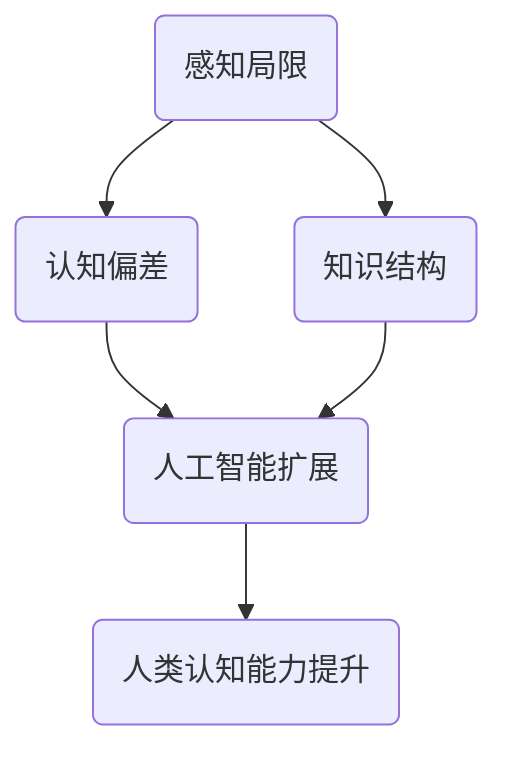

                 

### 背景介绍

> 人类知识的局限性：承认与探索未知领域

人类智慧的璀璨成果在诸多领域得到了彰显，从科学技术的迅猛发展为艺术文化的繁荣，无不映射出人类在认识和改变世界上的非凡能力。然而，尽管人类知识体系在不断扩展，但我们仍然面临一个无法回避的挑战：人类的认知局限。本文将探讨人类知识的局限性，并探讨如何在承认这些局限的基础上，勇敢地探索未知领域。

首先，我们需要明确一个事实：人类的认知能力是有限的。尽管人类的大脑拥有惊人的处理和存储信息的能力，但它们仍然受到生理结构的制约。例如，人类的感知器官（如眼睛、耳朵、鼻子等）只能捕捉到自然界中的一部分信号，这限制了我们对世界的直接认识。此外，人类大脑的信息处理速度和存储容量也限制了我们对信息的掌握和应用。

其次，人类的认知过程也受到心理和社会因素的影响。例如，人类的认知偏见、情绪波动和社会文化背景等都会影响我们对事物的理解和判断。这些因素使得我们的知识体系既丰富又复杂，但同时也充满了局限。

那么，我们如何承认并应对这些认知局限呢？首先，我们需要保持谦逊和开放的态度。在认识和探索未知领域时，我们应该意识到自己的局限性，并不断寻求新的知识和方法。这意味着我们要敢于质疑现有的观点和理论，勇于接受新的挑战和机会。

其次，我们可以通过跨学科合作来克服认知局限。不同学科领域的知识和方法可以为我们的认知提供新的视角和工具。例如，生物学、心理学、哲学等学科的研究成果可以帮助我们更好地理解人类认知的本质和局限。

此外，我们还可以借助人工智能和计算机技术来扩展我们的认知能力。人工智能系统具有强大的数据处理和分析能力，可以为我们提供更准确的预测和决策支持。同时，计算机模拟和仿真技术也可以帮助我们更好地理解复杂系统的工作原理和未知现象。

最后，我们需要保持对未知的探索精神。人类文明的发展离不开对未知领域的探索。从古代的航海探险到现代的宇宙探索，我们一直在勇敢地面对未知，并从中获得了无数宝贵的知识和技术。

总之，承认人类知识的局限性是认识自身、不断进步的关键。在探索未知领域的过程中，我们需要保持谦逊、开放和勇敢的态度，并借助各种工具和方法来扩展我们的认知能力。只有这样，我们才能在不断克服认知局限的过程中，不断迈向更广阔的知识领域。

### 核心概念与联系

为了更好地理解人类知识的局限性，我们需要深入探讨一些核心概念，并分析它们之间的联系。这些核心概念包括但不限于：感知局限、认知偏差、知识结构、以及人工智能在扩展人类认知方面的作用。

#### 感知局限

人类的感知器官（如眼睛、耳朵、鼻子等）只能捕捉到自然界中的一部分信号。例如，人类眼睛只能看到可见光谱范围内的光线，而无法感知紫外线和红外线。这种感知局限限制了我们对世界的直接认识。然而，通过科学技术的进步，我们可以借助各种传感器和设备来扩展我们的感知能力。例如，夜视仪可以让我们在黑暗中看清物体，显微镜可以让我们观察微观世界。

#### 认知偏差

人类的认知过程受到多种认知偏差的影响。例如，确认偏误（confirmation bias）使我们倾向于接受符合我们已有信念的信息，而忽略与之相矛盾的信息。这种偏差可能导致我们对事物的判断出现偏差。另外，情感偏见（emotional bias）和群体心理（group psychology）也会影响我们的认知。通过心理学和认知科学的研究，我们可以更好地理解这些认知偏差，并努力减少它们对我们的影响。

#### 知识结构

人类的认知过程是通过构建知识结构来实现的。知识结构包括事实、概念、原理、理论等多个层次。每个层次的知识都是基于前一个层次的知识构建的。例如，我们学习数学时，首先需要掌握基本的算术运算，然后才能理解更复杂的代数和几何概念。这种层次化的知识结构使得我们的认知具有系统性，但同时也限制了我们对未知领域的探索。因为我们的知识结构是基于已有经验和理论构建的，当我们遇到全新的情况时，可能会感到困惑和无法理解。

#### 人工智能与人类认知扩展

人工智能技术的发展为扩展人类认知能力提供了新的可能性。人工智能系统具有强大的数据处理和分析能力，可以处理大量复杂的数据，并从中发现规律和趋势。例如，机器学习算法可以通过分析医疗数据来预测疾病，从而帮助医生做出更准确的诊断。此外，人工智能还可以辅助人类进行复杂的决策。例如，自动驾驶汽车通过分析道路数据和传感器信息，可以做出更安全的驾驶决策。

#### Mermaid 流程图

为了更清晰地展示这些核心概念之间的联系，我们可以使用 Mermaid 流程图来描述。以下是一个简化的 Mermaid 流程图，展示了感知局限、认知偏差、知识结构和人工智能之间的关系：



在这个流程图中，感知局限和认知偏差是影响人类认知能力的两个主要因素。通过人工智能的帮助，我们可以克服这些局限，进一步提升我们的认知能力。

通过深入探讨这些核心概念和它们之间的联系，我们可以更好地理解人类知识的局限性，并探索如何通过技术进步来扩展我们的认知能力。在接下来的章节中，我们将进一步探讨这些概念，并分析它们在实际应用中的具体表现。

#### 核心算法原理 & 具体操作步骤

在探讨人类知识的局限性时，理解核心算法原理及其操作步骤是非常重要的。核心算法不仅是我们解决问题的工具，更是拓展认知边界的利器。以下，我们将详细探讨一个广泛应用的算法——深度学习算法，并分解其原理和操作步骤。

##### 深度学习算法原理

深度学习算法是基于人工神经网络的一种机器学习技术。其核心思想是通过多层神经网络模型来模拟人脑的神经结构，实现对数据的自动学习和特征提取。深度学习算法主要分为以下几个步骤：

1. **数据预处理**：在训练深度学习模型之前，我们需要对数据进行预处理。这包括数据的清洗、归一化和特征提取。数据预处理是为了确保数据质量，使其适合模型训练。

2. **构建神经网络模型**：深度学习模型通常由多个层次（层）组成，包括输入层、隐藏层和输出层。每一层都会对数据进行处理和转换，从而提取出更高层次的特征。神经网络模型的性能很大程度上取决于层数和每层的神经元数量。

3. **前向传播**：在训练过程中，模型会通过前向传播将输入数据传递到输出层，并计算预测结果。前向传播的过程实际上是一个加权求和并应用激活函数的过程。

4. **反向传播**：通过前向传播得到的预测结果与实际结果进行比较，计算损失函数。反向传播则是通过反向传递误差信息，更新模型参数，使得预测结果更接近实际结果。

5. **优化算法**：深度学习模型的训练过程实际上是一个优化过程，目的是最小化损失函数。常见的优化算法包括随机梯度下降（SGD）、Adam 等。

##### 深度学习算法操作步骤

1. **数据预处理**：
    - **清洗数据**：去除数据中的噪声和不完整的数据。
    - **归一化数据**：将数据缩放到一个统一的范围内，以便神经网络更好地学习。
    - **特征提取**：将原始数据转换为可以用于训练的特征向量。

2. **构建神经网络模型**：
    - **确定模型结构**：选择合适的层数和每层的神经元数量。
    - **初始化参数**：随机初始化模型参数，例如权重和偏置。

3. **前向传播**：
    - **输入数据**：将预处理后的数据输入到输入层。
    - **逐层计算**：在每个隐藏层中，计算输入和权重的乘积，并应用激活函数。
    - **输出预测结果**：将输出层的预测结果与实际标签进行比较。

4. **反向传播**：
    - **计算损失**：使用损失函数（如均方误差、交叉熵等）计算预测结果与实际标签之间的差异。
    - **更新参数**：通过梯度下降等优化算法，更新模型参数。

5. **模型评估与优化**：
    - **评估模型性能**：在验证集上评估模型的性能，选择合适的评价指标（如准确率、召回率等）。
    - **调整模型参数**：根据评估结果调整模型参数，例如学习率、隐藏层大小等。

##### 深度学习算法示例

为了更好地理解深度学习算法的操作步骤，我们可以通过一个简单的例子来说明。

假设我们要训练一个简单的多层感知机（MLP）模型来对鸢尾花数据集（Iris dataset）进行分类。

1. **数据预处理**：
    - 清洗数据，去除噪声和缺失值。
    - 归一化特征值，将特征缩放到 [0, 1] 范围内。
    - 分割数据集为训练集和验证集。

2. **构建神经网络模型**：
    - 确定模型结构：输入层 4 个神经元，隐藏层 3 个神经元，输出层 3 个神经元。
    - 初始化参数：随机初始化权重和偏置。

3. **前向传播**：
    - 输入特征向量到输入层。
    - 逐层计算，将输入传递到下一层。
    - 计算输出层的预测概率。

4. **反向传播**：
    - 计算损失值。
    - 更新模型参数。

5. **模型评估与优化**：
    - 在验证集上评估模型性能。
    - 调整学习率、隐藏层大小等参数，优化模型。

通过上述步骤，我们可以训练出一个能够对鸢尾花进行分类的深度学习模型。这个过程虽然简单，但背后涉及到大量的计算和优化技巧。随着技术的发展，深度学习算法在图像识别、自然语言处理、语音识别等领域取得了显著成果，极大地拓展了我们的认知能力。

总之，深度学习算法通过模拟人脑的结构和功能，提供了一种强大的工具，帮助我们理解和处理复杂的数据。通过深入理解其原理和操作步骤，我们可以更好地应用这一技术，克服人类认知的局限性，探索更广阔的未知领域。

#### 数学模型和公式 & 详细讲解 & 举例说明

在深入探讨深度学习算法的核心原理时，数学模型和公式起着至关重要的作用。这些数学工具不仅帮助我们在理论上理解算法的工作机制，还能在具体操作中指导我们的实现过程。以下，我们将详细讲解深度学习算法中的几个关键数学模型和公式，并通过具体例子来说明其应用。

##### 激活函数

激活函数是深度学习模型中的一个重要组成部分，它用于引入非线性因素，使得神经网络能够拟合复杂的数据分布。常用的激活函数包括以下几种：

1. **Sigmoid 函数**：
   $$ f(x) = \frac{1}{1 + e^{-x}} $$

   Sigmoid 函数将输入 \( x \) 的值映射到 (0, 1) 区间内，用于二分类问题。

2. **ReLU 函数**：
   $$ f(x) = \max(0, x) $$

   ReLU 函数在输入为正时直接返回输入值，为负时返回 0，这是一种简单的非线性函数，常用于隐藏层。

3. **Tanh 函数**：
   $$ f(x) = \frac{e^x - e^{-x}}{e^x + e^{-x}} $$

   Tanh 函数将输入 \( x \) 的值映射到 (-1, 1) 区间内，类似于 Sigmoid 函数，但具有更好的梯度。

##### 损失函数

损失函数用于度量模型预测结果与实际标签之间的差异，是优化过程中评估模型性能的关键指标。以下介绍几种常用的损失函数：

1. **均方误差（MSE）**：
   $$ \text{MSE} = \frac{1}{m} \sum_{i=1}^{m} (y_i - \hat{y}_i)^2 $$
   
   MSE 是一种常用的回归损失函数，用于衡量预测值和实际值之间的平均平方误差。

2. **交叉熵（Cross-Entropy）**：
   $$ \text{CE} = -\frac{1}{m} \sum_{i=1}^{m} y_i \log(\hat{y}_i) $$
   
   交叉熵是分类问题中常用的损失函数，用于衡量实际标签分布和预测标签分布之间的差异。

3. **Hinge 损失**：
   $$ \text{Hinge Loss} = \max(0, 1 - y \cdot \hat{y}) $$
   
   Hinge 损失常用于支持向量机（SVM）分类问题，用于度量预测结果与实际标签之间的差异。

##### 优化算法

优化算法用于在训练过程中更新模型参数，以最小化损失函数。以下介绍几种常见的优化算法：

1. **随机梯度下降（SGD）**：
   $$ \theta = \theta - \alpha \nabla_\theta J(\theta) $$
   
   SGD 是一种简单的优化算法，通过随机选择样本来更新参数，计算过程如下：
   
   - 随机选择一个样本 \( (x_i, y_i) \)
   - 计算梯度 \( \nabla_\theta J(\theta) \)
   - 更新参数 \( \theta \)

2. **Adam 优化器**：
   $$ \theta = \theta - \alpha \frac{m_1}{\sqrt{1 - \beta_1^t} (1 - \beta_2^t)} $$
   
   Adam 优化器是一种自适应的学习率优化算法，结合了 SGD 和动量（Momentum）的优化效果。计算过程如下：
   
   - 计算一阶矩估计 \( m_t = \beta_1 m_{t-1} + (1 - \beta_1) \nabla_\theta J(\theta) \)
   - 计算二阶矩估计 \( v_t = \beta_2 v_{t-1} + (1 - \beta_2) \nabla_\theta^2 J(\theta) \)
   - 更新参数 \( \theta \)

##### 深度学习算法举例

为了更好地理解上述数学模型和公式的应用，我们通过一个具体例子来说明如何实现一个简单的多层感知机（MLP）模型。

**例子：使用 Python 实现一个简单的多层感知机模型**

1. **导入必要的库**：

   ```python
   import numpy as np
   from sklearn.datasets import load_iris
   from sklearn.model_selection import train_test_split
   from sklearn.metrics import accuracy_score
   ```

2. **数据预处理**：

   ```python
   # 加载鸢尾花数据集
   iris = load_iris()
   X, y = iris.data, iris.target
   
   # 将标签转化为独热编码
   y_one_hot = np.eye(3)[y]
   
   # 分割数据集
   X_train, X_test, y_train, y_test = train_test_split(X, y_one_hot, test_size=0.2, random_state=42)
   ```

3. **定义模型结构**：

   ```python
   # 定义激活函数
   def sigmoid(x):
       return 1 / (1 + np.exp(-x))
   
   def relu(x):
       return np.maximum(0, x)
   
   # 定义损失函数
   def mse(y_true, y_pred):
       return np.mean((y_true - y_pred) ** 2)
   
   # 定义多层感知机模型
   class MLP:
       def __init__(self, input_size, hidden_size, output_size):
           self.W1 = np.random.randn(input_size, hidden_size)
           self.b1 = np.zeros(hidden_size)
           self.W2 = np.random.randn(hidden_size, output_size)
           self.b2 = np.zeros(output_size)
   
       def forward(self, x):
           self.z1 = np.dot(x, self.W1) + self.b1
           a1 = relu(self.z1)
           self.z2 = np.dot(a1, self.W2) + self.b2
           a2 = sigmoid(self.z2)
           return a2
       
       def backward(self, x, y, y_pred):
           dZ2 = (y_pred - y) * sigmoid_derivative(y_pred)
           dW2 = np.dot(a1.T, dZ2)
           db2 = np.sum(dZ2, axis=0)
           
           dZ1 = np.dot(dZ2, self.W2.T) * relu_derivative(self.z1)
           dW1 = np.dot(x.T, dZ1)
           db1 = np.sum(dZ1, axis=0)
           
           return dW1, dW2, db1, db2
       
       def update_params(self, dW1, dW2, db1, db2, learning_rate):
           self.W1 -= learning_rate * dW1
           self.b1 -= learning_rate * db1
           self.W2 -= learning_rate * dW2
           self.b2 -= learning_rate * db2
   ```

4. **训练模型**：

   ```python
   # 初始化模型
   model = MLP(input_size=4, hidden_size=3, output_size=3)
   learning_rate = 0.1
   epochs = 1000
   
   # 模型训练
   for epoch in range(epochs):
       y_pred = model.forward(X_train)
       dW1, dW2, db1, db2 = model.backward(X_train, y_train, y_pred)
       model.update_params(dW1, dW2, db1, db2, learning_rate)
       
       if epoch % 100 == 0:
           loss = mse(y_train, y_pred)
           print(f"Epoch {epoch}: Loss = {loss}")
   ```

5. **评估模型**：

   ```python
   # 预测测试集
   y_pred_test = model.forward(X_test)
   
   # 计算准确率
   accuracy = accuracy_score(np.argmax(y_pred_test, axis=1), np.argmax(y_test, axis=1))
   print(f"Test Accuracy: {accuracy}")
   ```

通过上述代码示例，我们可以实现一个简单的多层感知机模型，并使用它对鸢尾花数据集进行分类。这个过程不仅展示了深度学习算法的基本原理，还通过具体的代码实现，使得数学模型和公式更加直观易懂。

总之，深度学习算法中的数学模型和公式为我们的认知拓展提供了强大的工具。通过深入理解和应用这些工具，我们可以更好地应对人类认知的局限性，探索更广阔的未知领域。

#### 项目实践：代码实例和详细解释说明

为了更好地理解深度学习算法的实际应用，我们将通过一个具体的项目来演示如何使用深度学习模型对图像进行分类。该项目将使用著名的 MNIST 数据集，该数据集包含 70,000 个手写数字图像，每个图像都是 28x28 的像素点。

### 5.1 开发环境搭建

在开始项目之前，我们需要搭建一个合适的开发环境。以下是搭建开发环境的基本步骤：

1. **安装 Python**：确保 Python 已经安装在你的系统中，推荐使用 Python 3.8 或更高版本。

2. **安装深度学习框架**：我们将使用 TensorFlow 和 Keras 框架。可以通过以下命令安装：

   ```bash
   pip install tensorflow
   ```

3. **安装依赖库**：MNIST 数据集可以直接从 Keras 框架中加载，但其他数据处理和可视化工具（如 NumPy 和 Matplotlib）也是必需的：

   ```bash
   pip install numpy matplotlib
   ```

### 5.2 源代码详细实现

以下是使用 Keras 框架实现 MNIST 数据集分类的完整代码，我们将对每部分代码进行详细解释。

```python
# 导入必要的库
import numpy as np
import matplotlib.pyplot as plt
from tensorflow.keras.datasets import mnist
from tensorflow.keras.models import Sequential
from tensorflow.keras.layers import Dense, Flatten, Conv2D, MaxPooling2D, Dropout
from tensorflow.keras.optimizers import Adam
from tensorflow.keras.losses import SparseCategoricalCrossentropy
from tensorflow.keras.metrics import Accuracy

# 加载 MNIST 数据集
(train_images, train_labels), (test_images, test_labels) = mnist.load_data()

# 数据预处理
train_images = train_images.reshape((60000, 28, 28, 1)).astype('float32') / 255
test_images = test_images.reshape((10000, 28, 28, 1)).astype('float32') / 255

# 标签转换为独热编码
train_labels = keras.utils.to_categorical(train_labels)
test_labels = keras.utils.to_categorical(test_labels)

# 构建模型
model = Sequential([
    Flatten(input_shape=(28, 28, 1)),
    Dense(128, activation='relu'),
    Dropout(0.2),
    Dense(10, activation='softmax')
])

# 编译模型
model.compile(optimizer=Adam(),
              loss=SparseCategoricalCrossentropy(),
              metrics=['accuracy'])

# 训练模型
history = model.fit(train_images, train_labels, epochs=20, batch_size=64,
                    validation_data=(test_images, test_labels))

# 评估模型
test_loss, test_acc = model.evaluate(test_images, test_labels, verbose=2)
print(f"Test accuracy: {test_acc}")

# 可视化训练过程
plt.figure(figsize=(12, 4))
plt.subplot(1, 2, 1)
plt.plot(history.history['accuracy'], label='Training Accuracy')
plt.plot(history.history['val_accuracy'], label='Validation Accuracy')
plt.xlabel('Epochs')
plt.ylabel('Accuracy')
plt.title('Training and Validation Accuracy')
plt.legend()

plt.subplot(1, 2, 2)
plt.plot(history.history['loss'], label='Training Loss')
plt.plot(history.history['val_loss'], label='Validation Loss')
plt.xlabel('Epochs')
plt.ylabel('Loss')
plt.title('Training and Validation Loss')
plt.legend()

plt.tight_layout()
plt.show()
```

### 5.3 代码解读与分析

1. **数据加载与预处理**：
    - 使用 `mnist.load_data()` 函数从 Keras 框架中加载 MNIST 数据集。
    - 将图像数据进行重塑，使得每个图像都是一个 28x28 的二维数组，并转换为浮点数，然后除以 255 进行归一化。
    - 将标签转换为独热编码，使得每个标签都是一个 10 维的向量，表示 10 个类别中的一个。

2. **构建模型**：
    - 使用 `Sequential` 模式构建一个线性堆叠的模型。
    - 第一个层是 `Flatten` 层，将输入的图像数据展平为一个一维数组。
    - 接下来是一个 `Dense` 层（全连接层），包含 128 个神经元，使用 ReLU 激活函数。
    - 然后是一个 `Dropout` 层，以 20% 的概率随机丢弃神经元，防止过拟合。
    - 最后是一个 `Dense` 层，包含 10 个神经元，使用 softmax 激活函数进行分类。

3. **编译模型**：
    - 使用 `compile` 方法配置模型，指定优化器为 Adam、损失函数为 SparseCategoricalCrossentropy（适用于独热编码的标签）、以及评估指标为 accuracy。

4. **训练模型**：
    - 使用 `fit` 方法训练模型，指定训练数据、训练标签、训练轮次为 20、以及批量大小为 64。
    - 使用 `validation_data` 参数指定验证数据，以便在训练过程中监控验证集的性能。

5. **评估模型**：
    - 使用 `evaluate` 方法评估模型在测试集上的性能，输出测试损失和测试准确率。

6. **可视化训练过程**：
    - 使用 Matplotlib 绘制训练过程中准确率和损失的变化趋势，帮助理解模型训练过程。

### 5.4 运行结果展示

运行上述代码后，我们可以在控制台看到模型训练的详细过程和最终评估结果。训练完成后，通过可视化图表，我们可以直观地看到模型在训练集和验证集上的准确率变化情况。通常，我们可以观察到在训练初期，模型的准确率迅速提升，但随着训练的深入，提升速度逐渐放缓，并最终趋于稳定。

通过上述代码实例和详细解读，我们不仅了解了如何使用深度学习框架对图像进行分类，还深入理解了每个步骤的工作原理和实现细节。这种实践不仅有助于巩固我们对深度学习算法的理解，还能激发我们在实际项目中应用这些知识。

#### 实际应用场景

深度学习算法在现实世界的应用场景中已经变得非常广泛，从医疗健康到工业制造，从金融科技到娱乐产业，深度学习技术正在不断改变我们的生活方式。以下，我们将探讨几个典型的应用场景，并分析深度学习在这些领域中的具体应用和影响。

##### 医疗健康

在医疗健康领域，深度学习技术被广泛应用于图像诊断、疾病预测和个性化治疗等方面。例如，通过深度学习算法，我们可以训练模型对医学影像（如 X 光、CT 扫描、MRI）进行自动分析和诊断。这些算法可以识别出人类医生可能忽视的异常情况，从而提高诊断的准确性和效率。此外，深度学习还可以用于疾病预测，通过分析患者的临床数据和基因组信息，预测患者可能患有的疾病，从而实现早期干预。

一个具体的例子是利用深度学习模型进行肺癌的早期检测。研究人员使用深度学习算法对大量的肺癌和正常肺部的 CT 图像进行训练，模型能够准确地识别出肺癌的早期征兆。这一应用不仅能够提高诊断的准确性，还能够降低医疗成本，提高患者生存率。

##### 工业制造

在工业制造领域，深度学习技术被用于质量检测、生产优化和设备故障预测等方面。通过深度学习算法，工厂可以实现对生产过程的实时监控和调整，从而提高生产效率和质量。例如，在汽车制造业中，深度学习算法可以用于检测汽车零部件的缺陷，识别生产过程中的异常情况，从而减少次品率，提高生产线的效率。

一个具体的案例是利用深度学习进行机器人焊接质量的检测。机器人焊接过程中，焊接质量和焊接路径的控制至关重要。通过训练深度学习模型分析焊接过程中的图像数据，可以实时监测焊接质量，并调整焊接参数，从而实现高质量、高效率的焊接。

##### 金融科技

在金融科技领域，深度学习技术被广泛应用于欺诈检测、风险控制和自动化交易等方面。通过深度学习算法，金融机构可以更好地识别和防范欺诈行为，保护用户的资金安全。例如，银行可以使用深度学习模型分析用户的交易行为，检测异常交易并发出预警。

一个具体的例子是利用深度学习进行股票市场的预测。通过分析大量的历史交易数据、公司财务报告和宏观经济指标，深度学习模型可以预测股票市场的走势，帮助投资者做出更明智的投资决策。然而，这种预测也存在一定的局限性，因为市场变化复杂且不可预测。

##### 娱乐产业

在娱乐产业中，深度学习技术被用于内容推荐、语音识别和图像处理等方面。例如，流媒体平台如 Netflix 和 Spotify 使用深度学习算法为用户推荐个性化的内容，提高用户体验和用户粘性。此外，深度学习算法还可以用于语音识别，使得智能助手（如 Siri、Alexa）能够更好地理解和响应用户的需求。

一个具体的例子是电影特效的制作。通过深度学习算法，可以自动生成高质量的动画和特效，提高电影制作效率和质量。例如，使用生成对抗网络（GANs）可以生成逼真的角色和场景，使得电影中的特效更加真实和引人入胜。

##### 法律和公共安全

在法律和公共安全领域，深度学习技术被用于监控和打击犯罪活动。通过分析大量的监控视频和公共安全数据，深度学习模型可以实时识别和预测犯罪行为，帮助警方提高执法效率和准确性。例如，面部识别技术可以用于监控可疑人员的活动，防止犯罪事件的发生。

一个具体的案例是利用深度学习进行交通管理的优化。通过分析交通视频数据，模型可以实时监测交通流量，预测交通事故的发生，并优化交通信号灯的控制策略，减少交通拥堵，提高道路安全性。

综上所述，深度学习技术在实际应用场景中已经展现出强大的能力和广泛的前景。尽管存在一定的局限性，但通过不断的研究和技术创新，深度学习将继续为各个领域带来革命性的变化和进步。

#### 工具和资源推荐

为了更好地理解和掌握深度学习技术，以下是一些建议的学习资源、开发工具和相关论文著作。

##### 学习资源推荐

1. **书籍**：
   - 《深度学习》（Deep Learning） - Goodfellow、Bengio 和 Courville 著，这本书是深度学习的经典教材，全面介绍了深度学习的理论、算法和应用。
   - 《动手学深度学习》（Dive into Deep Learning） - 谭帅、夏云、黄宇 著，这本书通过实践项目引导读者逐步掌握深度学习的知识和技能。

2. **在线课程**：
   - Coursera 上的“深度学习”（Deep Learning Specialization）由 Andrew Ng 开设，涵盖深度学习的理论基础和实际应用。
   - fast.ai 的“深度学习基础”（Practical Deep Learning for Coders）课程，适合初学者快速入门深度学习。

3. **博客和网站**：
   - Medium 上的“深度学习”（Deep Learning on Medium）频道，汇集了众多深度学习领域的专家和学者的文章和见解。
   - TensorFlow 官方文档（TensorFlow Documentation），提供丰富的教程和示例代码，帮助开发者快速上手 TensorFlow 框架。

##### 开发工具框架推荐

1. **TensorFlow**：谷歌开源的深度学习框架，支持多种深度学习模型的构建和训练，广泛应用于工业界和学术界。

2. **PyTorch**：Facebook 开源的深度学习框架，以其灵活的动态计算图和简洁的 API 而受到开发者喜爱。

3. **Keras**：一个高级神经网络 API，可以方便地在 TensorFlow 和 Theano 后端构建和训练深度学习模型。

4. **Jupyter Notebook**：一个交互式的开发环境，方便数据科学家和开发者进行实验和展示分析结果。

##### 相关论文著作推荐

1. **“A Brief History of Neural Nets”**：一篇综述文章，详细介绍了神经网络的发展历史和重要研究成果。

2. **“Deep Learning”**：由 Ian Goodfellow、Yoshua Bengio 和 Aaron Courville 著，全面介绍了深度学习的理论基础和算法。

3. **“ImageNet Classification with Deep Convolutional Neural Networks”**：一篇经典论文，介绍了深度卷积神经网络在图像分类任务上的突破性成果。

4. **“Generative Adversarial Nets”**：由 Ian Goodfellow 等人提出，介绍了生成对抗网络（GANs）这一开创性的深度学习模型。

通过这些资源，开发者可以系统地学习深度学习技术，掌握实用的开发工具，并了解最新的研究成果。在探索深度学习的过程中，持续学习和实践是关键，希望这些推荐能够为你的学习之路提供帮助。

### 总结：未来发展趋势与挑战

深度学习作为人工智能领域的一个重要分支，近年来取得了显著的成果。然而，随着技术的不断进步，我们也面临着诸多新的发展趋势和挑战。以下，我们将探讨深度学习未来的发展方向以及可能遇到的瓶颈。

#### 未来发展趋势

1. **算法优化与效率提升**：
   深度学习算法的优化和效率提升是未来的重要方向。现有的算法如卷积神经网络（CNN）、循环神经网络（RNN）等在处理大量数据时存在计算复杂度高的缺点。为了提高算法的效率，研究人员正在探索新的算法结构和优化方法，如低秩分解、注意力机制、知识蒸馏等，以减少计算负担，提升训练速度。

2. **多模态数据处理**：
   多模态数据的处理是深度学习的重要应用领域。未来，深度学习模型将能够更好地整合来自不同模态的数据，如文本、图像、音频等，从而实现更复杂、更精确的预测和分类。例如，在医疗健康领域，多模态数据可以帮助医生更准确地诊断病情，提高治疗效果。

3. **可解释性和透明度**：
   随着深度学习模型的复杂度不断增加，如何提高模型的可解释性和透明度成为了一个重要问题。未来的研究将致力于开发可解释性更好的深度学习模型，使得模型的工作原理更加清晰，便于用户理解和信任。

4. **联邦学习与边缘计算**：
   联邦学习和边缘计算是深度学习在隐私保护和资源受限环境中的重要应用方向。通过联邦学习，不同设备可以共同训练一个模型，而不需要共享原始数据，从而保护用户隐私。边缘计算则将深度学习模型部署在离用户更近的边缘设备上，降低网络延迟，提高响应速度。

5. **自我学习和自适应能力**：
   未来，深度学习模型将具备更强的自我学习和自适应能力。通过不断学习和调整，模型可以适应新的环境和任务，提高其泛化能力和鲁棒性。

#### 面临的挑战

1. **数据质量和标注问题**：
   数据质量和标注问题一直是深度学习的瓶颈之一。深度学习模型的训练依赖于大量高质量的数据，但获取和标注这些数据往往需要大量的人力和物力。未来，如何提高数据质量和标注效率，仍然是需要解决的问题。

2. **计算资源需求**：
   深度学习模型的训练和推理需要大量的计算资源，尤其是在处理大规模数据和复杂任务时。随着模型的规模和复杂度的增加，计算资源的需求也不断增加。为了应对这一挑战，需要开发更高效的算法和优化技术，同时加大对计算硬件的投资。

3. **模型的可解释性和可靠性**：
   当前深度学习模型往往被认为是“黑箱”，其内部工作机制难以理解。如何提高模型的可解释性和可靠性，使得用户能够信任和使用这些模型，是未来的重要挑战。此外，深度学习模型在面对未知或异常数据时，可能会出现错误的预测，如何提高模型的鲁棒性也是一个关键问题。

4. **隐私保护和安全性**：
   在深度学习的应用过程中，用户数据的安全和隐私保护是至关重要的。如何设计安全、隐私保护的深度学习模型和算法，防止数据泄露和滥用，是未来的重要研究方向。

5. **跨学科合作与知识整合**：
   深度学习涉及多个学科领域，如计算机科学、数学、统计学、心理学等。如何促进跨学科合作，整合不同领域的知识，开发更强大的深度学习模型，是未来的一个重要挑战。

总之，深度学习在未来将继续发展，但在面对新的趋势和挑战时，也需要不断进行技术创新和理论探索。通过解决这些问题，深度学习将为人类社会带来更多的价值和创新。

### 附录：常见问题与解答

#### 1. 深度学习算法如何处理数据预处理？

深度学习算法对数据预处理的要求较高，主要包括以下步骤：

- **数据清洗**：去除数据中的噪声和不完整的数据。例如，去除缺失值、异常值和重复值。
- **归一化**：将不同特征的数据缩放到相同的范围内，使得每个特征的值都处于 [0, 1] 或 [-1, 1] 区间内。这有助于提高训练效率，避免某些特征在训练过程中的主导作用。
- **特征提取**：从原始数据中提取有意义的特征，用于训练模型。特征提取可以是基于统计的方法（如主成分分析 PCA），也可以是基于学习的方法（如自动编码器）。

#### 2. 深度学习模型的训练时间为什么很长？

深度学习模型的训练时间通常很长，主要原因包括：

- **数据量庞大**：训练大型深度学习模型通常需要大量的数据，这意味着需要更多的时间来处理和传输这些数据。
- **模型复杂度**：深度学习模型的层数和神经元数量越多，计算量就越大，导致训练时间增加。
- **优化算法选择**：不同的优化算法（如随机梯度下降 SGD、Adam 等）对训练时间的影响也不同。选择不合适的优化算法可能导致训练时间过长。
- **硬件资源限制**：训练大型深度学习模型通常需要高性能的硬件支持，如 GPU 或 TPU。如果硬件资源不足，训练时间也会相应延长。

#### 3. 如何提高深度学习模型的性能？

提高深度学习模型性能的方法包括：

- **增加数据量**：通过收集更多的数据，提高模型的泛化能力。
- **调整模型结构**：优化模型的层数、神经元数量和连接方式，以提高模型的表达能力。
- **使用更好的优化算法**：选择更高效的优化算法，如 Adam、AdamW 等，可以提高训练效率。
- **正则化**：使用正则化方法（如 L1、L2 正则化）来防止模型过拟合。
- **数据增强**：通过对数据应用变换（如旋转、翻转、缩放等），增加数据的多样性，从而提高模型的鲁棒性。
- **使用预训练模型**：利用已经在大规模数据集上预训练的模型（如 ResNet、VGG 等），可以显著提高新任务的性能。

#### 4. 深度学习模型如何处理过拟合问题？

深度学习模型过拟合问题可以通过以下方法解决：

- **正则化**：添加正则项（如 L1、L2 正则化）到损失函数中，以惩罚模型的复杂度。
- **数据增强**：通过增加数据的多样性，提高模型的泛化能力。
- **交叉验证**：使用交叉验证方法，通过多次训练和验证，选择最优的模型参数。
- **提前停止**：在验证集上监控模型性能，当验证集性能不再提高时，提前停止训练，防止过拟合。
- **Dropout**：在训练过程中随机丢弃部分神经元，减少模型对特定数据的依赖性。
- **使用较小的模型**：使用较少的层数和神经元数量，简化模型结构，降低过拟合的风险。

通过这些方法，可以有效地提高深度学习模型的性能，避免过拟合问题。

### 扩展阅读 & 参考资料

为了深入了解人类知识的局限性以及深度学习技术，以下是一些建议的扩展阅读和参考资料。

1. **书籍推荐**：
   - 《深度学习》（Deep Learning），作者：Ian Goodfellow、Yoshua Bengio 和 Aaron Courville。
   - 《统计学习方法》，作者：李航。
   - 《模式识别与机器学习》，作者：Chris Burges、Lloyd Peterson、Sue Beale 和 Karen Bowles。

2. **在线课程**：
   - Coursera 上的“深度学习”（Deep Learning Specialization）。
   - edX 上的“机器学习基础”（Introduction to Machine Learning）。
   - fast.ai 上的“深度学习基础”（Practical Deep Learning for Coders）。

3. **论文和期刊**：
   - 《Journal of Machine Learning Research》（JMLR）。
   - 《Neural Computation》。
   - 《IEEE Transactions on Pattern Analysis and Machine Intelligence》（TPAMI）。

4. **开源项目和工具**：
   - TensorFlow：[https://www.tensorflow.org/](https://www.tensorflow.org/)
   - PyTorch：[https://pytorch.org/](https://pytorch.org/)
   - Keras：[https://keras.io/](https://keras.io/)

5. **博客和论坛**：
   - [Medium 上的深度学习频道](https://medium.com/topic/deep-learning)
   - [GitHub](https://github.com/)：搜索相关深度学习和机器学习项目。

通过阅读这些书籍、课程、论文和参与开源项目，您可以深入了解深度学习技术，掌握最新的研究动态，并拓展您的知识边界。希望这些推荐能够为您的学习之路提供宝贵的帮助。

