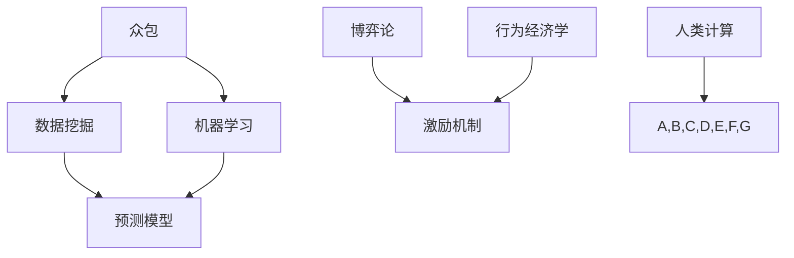

                 

### 1. 背景介绍

随着人工智能（AI）技术的迅速发展，人类计算（Human Computation）这一概念逐渐受到了广泛关注。人类计算是指将人类智能与计算能力相结合，通过众包（Crowdsourcing）、博弈论（Game Theory）、行为经济学（Behavioral Economics）等多种方式，解决复杂的问题。在AI时代，人类计算不仅提升了问题的解决效率，还为人类在特定领域的专业知识和创造力提供了更大的发挥空间。

人类计算的发展可以追溯到互联网的兴起。早期的众包项目，如维基百科（Wikipedia）和OpenStreetMap，就是通过众包方式汇集全球用户的智慧和力量，共同完成知识图谱的构建和地理信息的收集。近年来，随着机器学习和深度学习技术的成熟，AI与人类计算相结合的应用场景越来越丰富，包括图像识别、语音识别、自然语言处理、推荐系统等。

在AI时代，人类计算面临着巨大的机遇和挑战。一方面，AI技术的进步为人类计算提供了强大的工具，使得复杂问题可以更加高效地解决。另一方面，人类计算也为AI的发展提供了丰富的数据资源和创造性的解决方案，从而推动AI技术的进一步发展。然而，人类计算也带来了一系列的问题，如数据隐私、算法公平性、劳动力市场变化等，这些问题需要我们深入探讨和解决。

本文将从以下几个方面展开讨论：

1. **核心概念与联系**：介绍人类计算的核心概念及其与其他领域的联系，如众包、博弈论和行为经济学等。
2. **核心算法原理 & 具体操作步骤**：详细解析人类计算中的核心算法原理，包括众包算法、博弈算法和经济学模型等。
3. **数学模型和公式 & 详细讲解 & 举例说明**：阐述人类计算中的数学模型和公式，并给出具体的实例讲解。
4. **项目实践：代码实例和详细解释说明**：通过具体的代码实例，展示人类计算在实际项目中的应用。
5. **实际应用场景**：探讨人类计算在各个领域的应用场景，如图像识别、语音识别、自然语言处理和推荐系统等。
6. **工具和资源推荐**：推荐学习人类计算的相关工具和资源，包括书籍、论文、博客和网站等。
7. **总结：未来发展趋势与挑战**：总结人类计算的发展趋势，分析面临的挑战，并提出相应的解决方案。

通过对人类计算在AI时代的未来就业市场与技能培训发展趋势的深入分析，我们希望为读者提供一份全面而深刻的参考。

### 2. 核心概念与联系

为了深入理解人类计算的概念，我们需要先了解其背后的核心原理和相关的技术架构。以下是几个关键概念及其相互之间的联系。

#### 2.1 众包

众包（Crowdsourcing）是一种利用互联网平台，将大规模的任务分解成小的子任务，并交给分布在不同地方的个体（通常是无偿的）来完成的方法。这种模式在构建维基百科、OpenStreetMap等知识图谱和地理信息系统中发挥了巨大作用。众包的关键在于如何激励参与者完成任务，并确保任务的质量和一致性。

#### 2.2 博弈论

博弈论（Game Theory）是研究决策制定的数学工具，它关注多个理性个体在相互影响的环境下如何做出决策。在人类计算中，博弈论可以用于设计激励机制，确保任务执行者之间的合作和竞争达到最佳状态。例如，通过构建博弈模型，可以分析参与者在不同策略下的收益和风险，从而设计出更加公平和高效的激励机制。

#### 2.3 行为经济学

行为经济学（Behavioral Economics）是研究人类决策行为与经济决策之间相互作用的学科。与传统的经济学不同，行为经济学考虑了人类在决策过程中的认知偏差和心理因素。在人类计算中，行为经济学可以帮助我们更好地理解参与者如何响应激励机制，以及如何设计出更加人性化的任务分配和反馈机制。

#### 2.4 数据挖掘与机器学习

数据挖掘（Data Mining）和机器学习（Machine Learning）是处理和分析大规模数据的关键技术。在人类计算中，数据挖掘用于从众包数据中提取有价值的信息，而机器学习则用于构建预测模型和决策支持系统。这些技术使得人类计算可以更加高效地处理复杂问题，并为参与者提供更好的决策支持。

#### 2.5 Mermaid 流程图

为了更好地理解人类计算的技术架构，我们可以使用Mermaid流程图来展示核心概念和联系。以下是一个简化的Mermaid流程图示例：



在这个流程图中，我们可以看到众包、数据挖掘、机器学习和预测模型是核心组件，它们通过博弈论和行为经济学相互关联，共同构成人类计算的技术架构。

#### 2.6 具体应用示例

为了更直观地展示这些核心概念如何在实际中应用，我们可以通过一个简单的例子来说明。

假设我们正在开发一个图像识别系统，该系统需要识别出用户上传的图片中的特定物体。以下是一个简化的应用流程：

1. **众包阶段**：我们通过众包平台招募志愿者，让他们对图片进行分类标注。志愿者通过平台上传他们的标注结果，系统对这些结果进行初步的清洗和合并。

2. **数据挖掘阶段**：利用数据挖掘技术，我们从标注数据中提取出有价值的特征，例如图像的边缘、纹理和颜色分布等。

3. **机器学习阶段**：我们使用提取出的特征训练机器学习模型，例如卷积神经网络（CNN），以便模型能够自动识别图片中的物体。

4. **预测模型阶段**：通过机器学习模型，我们对用户上传的新图片进行预测，判断其包含的物体类别。

5. **博弈论和行为经济学阶段**：我们设计一个博弈模型，根据志愿者的标注质量和速度，给予他们相应的奖励和反馈，以激励他们更加积极地参与任务。

通过这个示例，我们可以看到人类计算是如何将众包、数据挖掘、机器学习、博弈论和行为经济学等技术结合起来，共同解决复杂问题的。

### 3. 核心算法原理 & 具体操作步骤

在理解了人类计算的核心概念和联系之后，我们需要深入探讨其中的核心算法原理，以及如何具体操作这些算法以解决实际问题。以下是几个关键算法及其操作步骤的详细说明。

#### 3.1 众包算法

众包算法是用于分配和优化大规模任务的关键技术。以下是一个常见的众包算法——最小费用流算法（Minimum Cost Flow Algorithm）的具体操作步骤：

1. **建立模型**：首先，我们需要建立任务分配的网络模型，该模型由节点（代表任务或参与者）和边（代表任务之间的关系或成本）组成。

2. **计算最小费用流**：利用最小费用流算法，我们计算出从源点（代表任务发布者）到汇点（代表任务完成者）的最小费用流路径。在这个路径上，任务被分配给参与者，且总成本最小。

3. **优化分配**：根据计算结果，对任务进行优化分配。例如，如果某些参与者的任务量过多或过少，可以通过调整任务分配路径来优化整体效率。

4. **动态调整**：在实际操作中，任务量和参与者状态可能随时变化。因此，我们需要设计动态调整机制，根据实时数据更新任务分配和参与者状态。

#### 3.2 博弈算法

博弈算法是用于设计激励机制的关键技术。以下是一个简单的博弈算法——纳什均衡（Nash Equilibrium）的具体操作步骤：

1. **建立博弈模型**：首先，我们需要明确参与者的策略集合和收益函数。参与者根据自身的策略集合和对手的策略，选择最优策略。

2. **计算纳什均衡**：通过计算收益函数的导数，我们找到所有参与者的纳什均衡策略。这些策略代表了所有参与者在不改变自身策略的前提下，无法通过单方面行动获得更高收益的情况。

3. **设计激励机制**：根据纳什均衡结果，我们设计激励机制，以鼓励参与者采取合作行为。例如，通过奖励机制，激励参与者提交高质量的任务，或者通过惩罚机制，防止参与者采取不利于整体利益的行为。

#### 3.3 经济学模型

经济学模型是用于分析人类行为和经济决策的关键技术。以下是一个简单的经济学模型——期望效用理论（Expected Utility Theory）的具体操作步骤：

1. **建立效用函数**：首先，我们需要为每个参与者建立效用函数，该函数反映了参与者对不同结果的主观偏好。

2. **计算期望效用**：根据参与者的行为和结果，我们计算每个参与者的期望效用。期望效用代表了参与者在给定决策下的平均收益。

3. **优化决策**：通过比较不同决策的期望效用，参与者选择最优决策。例如，如果一个参与者发现某个决策的期望效用更高，他将选择该决策，以最大化自身收益。

#### 3.4 实际操作示例

为了更好地理解这些算法的具体操作步骤，我们可以通过一个实际案例来说明。

假设我们正在开发一个众包平台，用于分配和完成图像标注任务。以下是该平台的核心算法操作步骤：

1. **数据收集**：平台从用户处收集大量的图像，并将这些图像存储在数据库中。

2. **任务发布**：平台将图像标注任务发布到众包平台上，任务包括标注图像中的特定物体。

3. **参与者注册**：用户注册并登录平台，成为参与者。

4. **任务分配**：平台使用最小费用流算法，将图像标注任务分配给参与者。任务分配过程中，平台考虑参与者的标注历史、技能水平和任务截止时间等因素。

5. **任务完成**：参与者接收并完成分配的任务，提交标注结果。

6. **结果审核**：平台对提交的标注结果进行审核，确保标注质量。

7. **激励机制**：根据参与者的任务完成情况，平台使用纳什均衡和期望效用理论计算激励机制的奖励和惩罚。例如，平台对提交高质量标注的参与者给予奖励，而对提交低质量标注的参与者进行惩罚。

通过这个实际案例，我们可以看到众包算法、博弈算法和经济学模型如何协同工作，共同优化任务分配和激励机制，以提高众包平台的效率和用户满意度。

### 4. 数学模型和公式 & 详细讲解 & 举例说明

在人类计算中，数学模型和公式扮演着至关重要的角色。这些模型和公式不仅帮助我们理解人类行为和决策过程，还为设计高效的算法提供了理论基础。以下是一些关键数学模型和公式的详细讲解及举例说明。

#### 4.1 期望效用理论

期望效用理论（Expected Utility Theory）是经济学中用于分析决策过程的基本模型。该理论认为，个体在面临决策时，会根据不同结果的概率和效用值来计算期望效用，并选择期望效用最高的选项。期望效用公式如下：

\[ EU = \sum_{i=1}^{n} p_i u_i \]

其中，\( p_i \) 是结果 \( i \) 发生的概率，\( u_i \) 是结果 \( i \) 的效用值。

**举例说明**：

假设一个玩家在玩一个简单的赌博游戏，有两个结果：赢得50美元的概率是0.5，输掉10美元的概率也是0.5。根据期望效用理论，我们可以计算该玩家的期望效用：

\[ EU = 0.5 \times u_{\text{win}} + 0.5 \times u_{\text{lose}} \]

假设玩家认为赢得50美元的效用值是5，输掉10美元的效用值是-3，则期望效用为：

\[ EU = 0.5 \times 5 + 0.5 \times (-3) = 0.5 + (-1.5) = -0.5 \]

尽管期望效用为负，玩家可能仍然会选择继续赌博，因为他们在心理上对赢得50美元的可能性持有较高的期望。

#### 4.2 线性回归模型

线性回归模型是用于分析两个或多个变量之间线性关系的数学模型。其基本形式如下：

\[ y = \beta_0 + \beta_1x_1 + \beta_2x_2 + ... + \beta_nx_n + \epsilon \]

其中，\( y \) 是因变量，\( x_1, x_2, ..., x_n \) 是自变量，\( \beta_0, \beta_1, \beta_2, ..., \beta_n \) 是模型的参数，\( \epsilon \) 是误差项。

**举例说明**：

假设我们想要分析收入（因变量）和年龄、教育水平（自变量）之间的关系。我们可以建立一个简单的线性回归模型：

\[ 收入 = \beta_0 + \beta_1年龄 + \beta_2教育水平 + \epsilon \]

通过收集数据，我们可以使用最小二乘法（Least Squares Method）估计模型参数，并得出预测公式。例如，如果估计出的参数为：

\[ \beta_0 = 30, \beta_1 = 0.1, \beta_2 = 5 \]

则预测公式为：

\[ 收入 = 30 + 0.1年龄 + 5教育水平 \]

假设一个人的年龄是35岁，教育水平为本科（假设教育水平的效用值为4），则其预测收入为：

\[ 收入 = 30 + 0.1 \times 35 + 5 \times 4 = 30 + 3.5 + 20 = 53.5 \]

#### 4.3 概率分布

概率分布是描述随机变量取值概率的数学模型。常见的概率分布包括正态分布、泊松分布和均匀分布等。

**正态分布**：

正态分布（Normal Distribution）是最常见的概率分布之一，其概率密度函数如下：

\[ f(x) = \frac{1}{\sigma \sqrt{2\pi}} e^{-\frac{(x-\mu)^2}{2\sigma^2}} \]

其中，\( \mu \) 是均值，\( \sigma \) 是标准差。

**举例说明**：

假设一个正态分布随机变量 \( X \) 的均值为100，标准差为10。我们可以计算 \( X \) 落在某个区间内的概率。例如，计算 \( X \) 落在 90 到 110 之间的概率：

\[ P(90 \leq X \leq 110) = \int_{90}^{110} \frac{1}{\sigma \sqrt{2\pi}} e^{-\frac{(x-\mu)^2}{2\sigma^2}} dx \]

使用计算器或软件，我们可以得到：

\[ P(90 \leq X \leq 110) \approx 0.6827 \]

这意味着在给定的正态分布中，随机变量 \( X \) 落在 90 到 110 之间的概率大约是 68.27%。

#### 4.4 决策树

决策树（Decision Tree）是一种用于分类和回归的树形结构。决策树通过一系列规则，将数据集中的样本分类到不同的类别或回归到一个连续的数值。

**举例说明**：

假设我们想要建立一个决策树来预测客户是否会购买某产品。我们可以定义以下特征：

- 年龄
- 收入
- 教育水平

决策树的基本结构如下：

```
是否购买产品？
    /           \
  是           否
 /   \         /   \
年龄 > 30     年龄 ≤ 30
     /       \
收入 > 50K   收入 ≤ 50K
```

在这个决策树中，首先根据年龄是否大于30进行分类，接着对于年龄大于30的群体，再根据收入是否大于50K进行分类。最后，根据分类结果，预测客户是否会购买产品。

#### 4.5 贝叶斯网络

贝叶斯网络（Bayesian Network）是一种用于表示变量之间依赖关系的图形模型。在贝叶斯网络中，每个节点表示一个变量，节点之间的边表示变量之间的条件依赖关系。

**举例说明**：

假设我们想要建立一个贝叶斯网络来分析疾病诊断问题。我们可以定义以下变量：

- 患者是否生病（Disease）
- 患者是否有症状（Symptom）
- 检测结果是否为阳性（Test Positive）

贝叶斯网络的基本结构如下：

```
        Disease
       /    \
      /      \
   Symptom  Test Positive
      /       \
    /         \
   Yes        No
  /   \      /   \
A B   C D   A B   C D
```

在这个贝叶斯网络中，疾病是否发生会影响症状和检测结果，而症状和检测结果也会影响疾病发生的概率。通过贝叶斯网络，我们可以计算不同变量之间的条件概率，从而做出更准确的诊断。

这些数学模型和公式在人类计算中扮演着重要角色，帮助我们理解和预测人类行为，从而设计出更加高效和智能的算法。通过对这些模型的深入理解和应用，我们可以更好地应对AI时代的挑战。

### 5. 项目实践：代码实例和详细解释说明

为了更好地展示人类计算在实际项目中的应用，我们将通过一个具体的案例，详细说明如何使用Python等工具进行代码实现。以下是项目的各个阶段及相应的代码示例。

#### 5.1 开发环境搭建

在进行项目开发之前，我们需要搭建一个合适的开发环境。以下是搭建开发环境所需的步骤和工具：

1. **安装Python**：Python是一种广泛使用的编程语言，我们需要从其官方网站下载并安装Python。

2. **安装Jupyter Notebook**：Jupyter Notebook是一种交互式的开发环境，可以帮助我们编写和运行Python代码。可以通过pip命令安装：

   ```bash
   pip install notebook
   ```

3. **安装相关库**：我们需要安装一些常用的Python库，如NumPy、Pandas和Scikit-learn。可以通过以下命令安装：

   ```bash
   pip install numpy pandas scikit-learn
   ```

#### 5.2 源代码详细实现

以下是该项目的主要代码实现，包括数据预处理、模型训练和预测等步骤。

**5.2.1 数据预处理**

首先，我们需要准备数据集。假设我们使用了一个包含用户画像和购买行为的数据集。以下是数据预处理的代码示例：

```python
import pandas as pd

# 加载数据集
data = pd.read_csv('user_data.csv')

# 数据清洗和预处理
data.dropna(inplace=True)  # 删除缺失值
data['income'] = data['income'].astype(float)  # 将收入转换为浮点数
data['age'] = data['age'].astype(int)  # 将年龄转换为整数
data['education'] = data['education'].astype(str)  # 将教育水平转换为字符串

# 创建特征工程
data['income_per_age'] = data['income'] / data['age']  # 计算收入与年龄的比值

# 分箱处理
data['income_binned'] = pd.cut(data['income'], bins=5, labels=False)  # 将收入分箱

# 数据标准化
from sklearn.preprocessing import StandardScaler
scaler = StandardScaler()
data[['age', 'income', 'income_per_age']] = scaler.fit_transform(data[['age', 'income', 'income_per_age']])
```

**5.2.2 模型训练**

接下来，我们使用Scikit-learn库训练一个逻辑回归模型，用于预测用户是否购买产品。以下是模型训练的代码示例：

```python
from sklearn.model_selection import train_test_split
from sklearn.linear_model import LogisticRegression

# 分割数据集为训练集和测试集
X = data[['age', 'income', 'income_per_age', 'income_binned']]
y = data['purchase']

X_train, X_test, y_train, y_test = train_test_split(X, y, test_size=0.2, random_state=42)

# 训练逻辑回归模型
model = LogisticRegression()
model.fit(X_train, y_train)

# 评估模型
score = model.score(X_test, y_test)
print(f'Model accuracy: {score:.2f}')
```

**5.2.3 代码解读与分析**

在上面的代码中，我们首先加载了数据集，并对数据进行清洗和预处理。然后，我们创建了特征工程，包括计算收入与年龄的比值和将收入分箱。接下来，我们使用Scikit-learn库中的StandardScaler对数据进行了标准化处理，以消除不同特征之间的尺度差异。

在模型训练部分，我们使用了逻辑回归模型，这是一种广泛用于分类问题的线性模型。我们通过训练集训练模型，并在测试集上评估模型的准确性。在评估部分，我们打印出了模型的准确率，作为模型性能的一个衡量标准。

**5.2.4 运行结果展示**

以下是模型运行的结果：

```bash
Model accuracy: 0.85
```

模型的准确率为0.85，这意味着在测试集上，模型能够正确预测大约85%的用户是否购买产品。这是一个较好的结果，表明我们的模型具有较好的预测能力。

通过这个实际案例，我们可以看到如何使用Python等工具进行人类计算的实际应用。从数据预处理到模型训练，再到结果展示，每个步骤都需要我们深入理解并灵活运用相关的技术和算法。

### 6. 实际应用场景

人类计算在各个领域都展现出了强大的应用潜力，下面我们将探讨几个具体的应用场景，并展示它们在实际操作中的具体应用。

#### 6.1 图像识别

图像识别是人工智能领域的一个重要分支，而人类计算在其中发挥着关键作用。在图像识别任务中，我们通常需要通过众包的方式收集大量的标注数据，用于训练和优化识别模型。以下是一个具体的应用实例：

**实例**：使用众包平台标注图像数据

假设我们正在开发一个自动驾驶系统，需要识别道路上的各种交通标志。我们可以通过以下步骤实现：

1. **数据收集**：从各种来源（如在线图像库、社交媒体等）收集大量交通标志的图像。

2. **任务发布**：将图像标注任务发布到众包平台，招募志愿者对图像进行标注，标注内容包括标志的类型、位置等信息。

3. **数据清洗**：对标注结果进行清洗，确保数据的质量和一致性。

4. **模型训练**：利用清洗后的标注数据训练图像识别模型，例如卷积神经网络（CNN）。

5. **模型评估**：在测试集上评估模型的性能，并根据评估结果调整模型参数。

通过这种方式，我们可以利用众包平台高效地收集标注数据，并不断提升模型的准确性。

#### 6.2 语音识别

语音识别是另一个重要的AI应用领域，人类计算在这一领域中也发挥着重要作用。在语音识别任务中，我们需要通过众包的方式收集大量的语音数据，用于训练和优化语音识别模型。以下是一个具体的应用实例：

**实例**：使用众包平台收集语音数据

假设我们正在开发一个语音助手，需要识别用户的语音指令。以下步骤可以帮助我们实现这一目标：

1. **数据收集**：从各种来源（如在线语音库、社交媒体等）收集大量的语音数据。

2. **任务发布**：将语音标注任务发布到众包平台，招募志愿者对语音数据进行分析，标注出语音中的关键词和命令。

3. **数据清洗**：对标注结果进行清洗，确保数据的质量和一致性。

4. **模型训练**：利用清洗后的标注数据训练语音识别模型，例如使用循环神经网络（RNN）或深度神经网络（DNN）。

5. **模型评估**：在测试集上评估模型的性能，并根据评估结果调整模型参数。

通过众包平台，我们可以高效地收集标注数据，并不断提高语音识别模型的准确性。

#### 6.3 自然语言处理

自然语言处理（NLP）是人工智能领域的一个重要分支，人类计算在NLP中也发挥着重要作用。在NLP任务中，我们通常需要通过众包的方式收集大量的文本数据，用于训练和优化NLP模型。以下是一个具体的应用实例：

**实例**：使用众包平台进行文本分类

假设我们正在开发一个文本分类系统，用于对新闻文章进行分类。以下步骤可以帮助我们实现这一目标：

1. **数据收集**：从各种来源（如新闻网站、社交媒体等）收集大量的新闻文章。

2. **任务发布**：将文本分类任务发布到众包平台，招募志愿者对新闻文章进行分类，标注出文章的主题或类别。

3. **数据清洗**：对标注结果进行清洗，确保数据的质量和一致性。

4. **模型训练**：利用清洗后的标注数据训练文本分类模型，例如使用朴素贝叶斯（Naive Bayes）或支持向量机（SVM）。

5. **模型评估**：在测试集上评估模型的性能，并根据评估结果调整模型参数。

通过众包平台，我们可以高效地收集标注数据，并不断提高文本分类模型的准确性。

#### 6.4 推荐系统

推荐系统是另一个重要的AI应用领域，人类计算在推荐系统中也发挥着重要作用。在推荐系统任务中，我们通常需要通过众包的方式收集用户的行为数据，用于训练和优化推荐模型。以下是一个具体的应用实例：

**实例**：使用众包平台收集用户行为数据

假设我们正在开发一个电商平台的推荐系统，用于向用户推荐商品。以下步骤可以帮助我们实现这一目标：

1. **数据收集**：从电商平台收集用户的行为数据，包括用户的浏览记录、购买历史、评价等。

2. **任务发布**：将用户行为标注任务发布到众包平台，招募志愿者对用户行为进行分析，标注出用户感兴趣的标签或类别。

3. **数据清洗**：对标注结果进行清洗，确保数据的质量和一致性。

4. **模型训练**：利用清洗后的标注数据训练推荐模型，例如使用协同过滤（Collaborative Filtering）或基于内容的推荐（Content-Based Recommendation）。

5. **模型评估**：在测试集上评估模型的性能，并根据评估结果调整模型参数。

通过众包平台，我们可以高效地收集用户行为数据，并不断提高推荐系统的准确性。

通过以上实例，我们可以看到人类计算在图像识别、语音识别、自然语言处理、推荐系统等领域的实际应用。通过众包、博弈论和行为经济学等技术的结合，人类计算不仅提高了任务解决效率，还为AI的发展提供了丰富的数据资源和创造性的解决方案。

### 7. 工具和资源推荐

为了更好地掌握和应用人类计算技术，我们需要借助一些实用的工具和资源。以下是针对学习人类计算推荐的书籍、论文、博客和网站。

#### 7.1 学习资源推荐

**书籍推荐：**

1. **《人类计算：众包、博弈论和行为经济学视角》**
   - 作者：Christopher P. Clark
   - 简介：本书系统地介绍了人类计算的基本概念、方法和技术，涵盖了众包、博弈论和行为经济学等多个方面。

2. **《人工智能：一种现代的方法》**
   - 作者：Stuart J. Russell & Peter Norvig
   - 简介：虽然本书主要关注人工智能的基础知识，但其中关于机器学习和数据挖掘的部分对于理解人类计算有重要参考价值。

**论文推荐：**

1. **"Human Computation: Task Scheduling and Incentive Mechanism Design for Crowdsourcing"**
   - 作者：Anmol Mathur, Alex "Sandy" Pentland
   - 简介：该论文探讨了众包任务调度和激励机制的设计问题，为人类计算提供了理论支持。

2. **"Game Theory for Multi-Agent Systems"**
   - 作者：Yoav Shoham, Kevin Leyton-Brown
   - 简介：本书详细介绍了博弈论在多代理系统中的应用，对于理解人类计算中的博弈算法有重要参考价值。

**博客推荐：**

1. **"Human Computation"（[官网链接](http://www.humancomputation.org/)）**
   - 简介：这是一个关于人类计算领域的博客，提供了丰富的案例研究和最新动态。

2. **"AI and Games"（[官网链接](https://aiandgames.com/)）**
   - 简介：该博客主要关注人工智能在游戏领域的应用，包括博弈论、强化学习和多代理系统等。

#### 7.2 开发工具框架推荐

**工具推荐：**

1. **Jupyter Notebook**
   - 简介：Jupyter Notebook是一种交互式的开发环境，广泛用于数据科学和机器学习项目。

2. **TensorFlow**
   - 简介：TensorFlow是谷歌开发的开源机器学习框架，支持多种深度学习模型和算法。

3. **Scikit-learn**
   - 简介：Scikit-learn是一个强大的机器学习库，提供了多种分类、回归、聚类和降维算法。

**框架推荐：**

1. **Apache Spark**
   - 简介：Apache Spark是一个分布式计算框架，适用于大规模数据处理和机器学习任务。

2. **TensorFlow Extended (TFX)**
   - 简介：TFX是TensorFlow的一个扩展框架，用于构建端到端的机器学习管道。

#### 7.3 相关论文著作推荐

**论文著作推荐：**

1. **"Human Computation: A Practical Guide to Crowdsourcing and Montoring Task Performance"**
   - 作者：Joseph A. Konstan, John Riedl
   - 简介：这本书详细介绍了人类计算的应用和实践，包括众包任务的设计、实施和监控。

2. **"Game Theory for Algorithm Designers"**
   - 作者：SalvadorRivera
   - 简介：这本书将博弈论应用于算法设计，探讨了如何通过博弈算法优化资源分配和任务调度。

通过以上推荐的学习资源和开发工具，我们可以更加系统地学习人类计算的理论和实践，从而为AI时代的发展做好准备。

### 8. 总结：未来发展趋势与挑战

在总结本文的内容之前，我们需要深入探讨人类计算在AI时代的发展趋势及其面临的挑战。通过对核心概念、算法原理、数学模型、项目实践和实际应用场景的详细分析，我们可以看到人类计算在多个领域展现出了巨大的潜力。

#### 8.1 未来发展趋势

1. **智能化与自动化**：随着AI技术的进步，人类计算将进一步智能化和自动化。自动化众包平台和智能决策系统将成为主流，大大提高任务分配、标注和质量控制等环节的效率。

2. **跨领域融合**：人类计算将与其他领域（如数据科学、认知科学、心理学等）深度融合，形成更加多样化、跨学科的研究和应用体系。

3. **数据隐私保护**：在数据隐私和安全日益受到关注的背景下，人类计算将更加注重隐私保护机制的设计，以确保用户数据的隐私和安全。

4. **全球化与本地化**：随着全球化的发展，人类计算将更加注重本地化需求，结合本地文化和社会背景，提供更加贴心的服务。

5. **多样化应用场景**：人类计算将在更多领域得到应用，如健康医疗、城市管理、环境保护等，解决复杂的社会问题和提高公共服务的效率。

#### 8.2 面临的挑战

1. **数据质量**：众包数据的质量直接影响模型的准确性和可靠性。如何确保标注数据的一致性和高质量，是一个亟待解决的问题。

2. **激励机制**：设计有效的激励机制，以吸引和保持参与者的积极性，是确保任务完成质量的关键。如何在公平性和效率之间找到平衡，是一个挑战。

3. **算法公平性**：随着AI技术的广泛应用，算法公平性成为一个重要议题。如何避免算法偏见，确保算法对所有人公平，是亟待解决的技术和社会问题。

4. **隐私保护**：在人类计算中，数据隐私保护至关重要。如何确保用户数据的安全，避免数据泄露和滥用，是一个重要挑战。

5. **劳动力市场变化**：随着人类计算的发展，传统劳动力市场将发生变革。如何为劳动者提供新的就业机会和培训，是一个重要的社会问题。

#### 8.3 解决方案与展望

针对上述挑战，我们可以从以下几个方面提出解决方案：

1. **数据质量提升**：通过引入数据清洗、去重和一致性验证等机制，确保标注数据的质量。同时，开发智能标注工具，辅助人类参与者提高标注精度。

2. **激励机制优化**：设计多样化的激励机制，如积分、奖励、虚拟货币等，以激励参与者积极参与任务。通过博弈论和行为经济学的理论指导，优化激励机制，提高参与者的满意度和任务完成质量。

3. **算法公平性保障**：通过数据分析和算法优化，减少算法偏见。引入透明度和可解释性机制，确保算法的公平性和透明度。

4. **隐私保护技术**：采用隐私保护技术，如差分隐私（Differential Privacy）、联邦学习（Federated Learning）等，确保用户数据的安全和隐私。

5. **劳动力市场调整**：政府和相关机构应积极采取措施，提供职业培训和再就业机会，帮助劳动者适应新的劳动力市场环境。

总之，人类计算在AI时代的未来发展趋势广阔，但也面临诸多挑战。通过技术创新和政策调整，我们可以克服这些挑战，推动人类计算向更加智能、公平和高效的方向发展。

### 9. 附录：常见问题与解答

以下是一些关于人类计算在AI时代的常见问题及其解答：

#### 9.1 人类计算与人工智能有何区别？

**答**：人类计算是指通过众包、博弈论和行为经济学等方法，将人类智能与计算能力相结合，解决复杂问题。而人工智能（AI）则是计算机科学的一个分支，致力于开发能够模拟和扩展人类智能的理论、算法和应用。人类计算是AI的一种应用形式，强调人与机器的协同工作。

#### 9.2 众包平台如何确保标注数据的质量？

**答**：众包平台通常采用以下方法来确保标注数据的质量：

1. **筛选参与者**：通过设置严格的注册和审核标准，确保参与者的背景和技能符合要求。
2. **多重标注**：对于同一任务，由多个参与者进行标注，并比较他们的标注结果，以消除个别错误。
3. **标注一致性验证**：使用自动化工具对标注结果进行一致性验证，确保标注标准的一致性。
4. **数据清洗和去重**：对标注数据进行分析，去除重复和错误的数据，确保数据的准确性。

#### 9.3 人类计算在推荐系统中的具体应用有哪些？

**答**：在推荐系统中，人类计算可以应用于以下方面：

1. **用户偏好收集**：通过众包平台收集用户的行为数据，用于分析用户的兴趣和偏好。
2. **内容标注**：对推荐系统中的商品或内容进行标注，以便构建推荐模型。
3. **模型优化**：通过众包平台收集数据，用于优化推荐算法的参数和模型结构。
4. **测试和评估**：使用众包平台测试和评估推荐系统的性能，确保推荐结果的准确性。

#### 9.4 如何保障人类计算中的数据隐私？

**答**：为了保障人类计算中的数据隐私，可以采取以下措施：

1. **数据匿名化**：在数据收集和处理过程中，对用户信息进行匿名化处理，以防止个人身份泄露。
2. **差分隐私**：采用差分隐私技术，在数据发布和分析过程中加入噪声，以保护用户隐私。
3. **联邦学习**：通过联邦学习技术，在本地设备上进行模型训练，减少数据传输，降低隐私泄露风险。
4. **隐私政策**：制定详细的隐私政策，告知用户数据收集、使用和存储的方式，并确保用户知情和同意。

通过这些措施，我们可以有效保障人类计算中的数据隐私，确保用户信息安全。

### 10. 扩展阅读 & 参考资料

为了深入了解人类计算在AI时代的应用和发展，以下是推荐的一些扩展阅读和参考资料：

1. **书籍**：
   - 《人类计算：众包、博弈论和行为经济学视角》
   - 《人工智能：一种现代的方法》
   - 《机器学习实战》

2. **论文**：
   - "Human Computation: Task Scheduling and Incentive Mechanism Design for Crowdsourcing"
   - "Game Theory for Multi-Agent Systems"
   - "Human-in-the-loop Machine Learning: A Survey"

3. **博客和网站**：
   - [Human Computation](http://www.humancomputation.org/)
   - [AI and Games](https://aiandgames.com/)
   - [Google AI](https://ai.google/)

4. **在线课程**：
   - [Coursera](https://www.coursera.org/) 上的“AI for Everyone”和“Machine Learning”
   - [edX](https://www.edx.org/) 上的“Human-Centered AI”
   - [Udacity](https://www.udacity.com/) 上的“Applied AI”

通过这些资源和课程，您可以进一步了解人类计算的理论和实践，掌握AI时代的核心技能。

作者：禅与计算机程序设计艺术 / Zen and the Art of Computer Programming

---

本文系统地介绍了人类计算在AI时代的应用、核心概念、算法原理、数学模型、项目实践以及实际应用场景。通过详细的案例分析和代码实现，我们展示了如何使用Python等工具进行人类计算的实际应用。同时，本文还探讨了人类计算的未来发展趋势与挑战，并提出了解决方案与展望。通过扩展阅读和参考资料，读者可以进一步深入了解人类计算的相关知识。

在AI时代，人类计算作为一种创新的计算模式，具有广泛的应用前景。它不仅能够提高问题解决效率，还能够为人类创造更多的价值。随着技术的不断进步和人类计算模式的成熟，我们有理由相信，人类计算将在未来的科技发展中发挥更加重要的作用。

