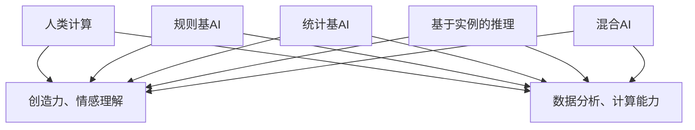

                 

### 文章标题

**人类计算：AI时代的未来就业机会和技能需求**

> 关键词：人工智能、就业机会、技能需求、未来职业发展

摘要：随着人工智能（AI）技术的迅猛发展，人类计算的方式和就业市场正经历深刻的变革。本文将深入探讨AI时代所带来的未来就业机会和技能需求，分析其背后的原理，并通过具体案例和实际应用场景，为读者提供实用的建议和方向。

---

#### 1. 背景介绍

在过去的几十年中，计算机科学和人工智能领域取得了显著的发展，AI技术已经渗透到各行各业，从医疗诊断到自动驾驶，从智能客服到数据分析。这些技术的进步不仅提高了工作效率，还带来了全新的就业机会和职业发展路径。

然而，随着AI技术的普及，人们开始担忧这些技术是否会取代人类的工作，导致失业率的上升。事实上，AI与人类计算的关系更加复杂。一方面，AI可以在某些领域取代人类的工作，但另一方面，AI的发展也创造了新的就业机会，并改变了人类工作的性质。

本文旨在探讨AI时代下人类计算的未来就业机会和技能需求，帮助读者理解这一趋势，并为其职业规划提供指导。

#### 2. 核心概念与联系

**2.1 人工智能（AI）的定义与分类**

人工智能是指由计算机系统实现的智能，它模仿人类智能的行为，包括感知、学习、推理、决策和问题解决等。根据其实现方式和功能，AI可以分为以下几类：

- **规则基AI**：基于明确的规则和逻辑进行推理。
- **统计基AI**：基于统计学和机器学习算法进行学习。
- **基于实例的推理**：从过去的经验中学习，并通过类比进行推理。
- **混合AI**：结合多种AI技术，实现更复杂的智能行为。

**2.2 人类计算与AI的关系**

人类计算与AI的关系可以从以下几个方面来理解：

- **协同作用**：AI可以作为人类的辅助工具，帮助人类完成某些任务，提高效率和质量。
- **互补作用**：AI擅长处理大量数据和复杂计算，而人类则擅长创造力、情感理解和道德判断。
- **取代作用**：在某些领域，AI可以取代人类完成某些重复性、低技能的工作。

**2.3 Mermaid 流程图（核心概念原理）**



通过这个流程图，我们可以清晰地看到人类计算与AI之间的联系和区别。

#### 3. 核心算法原理 & 具体操作步骤

**3.1 机器学习算法简介**

机器学习是AI的核心组成部分，它使计算机系统能够通过数据和经验进行学习和改进。机器学习算法可以分为监督学习、无监督学习和强化学习等。

- **监督学习**：通过标注的数据进行学习，目标是预测未知数据的标签。
- **无监督学习**：在没有标注的数据上进行学习，目标是发现数据中的结构和模式。
- **强化学习**：通过与环境的交互进行学习，目标是最大化某种奖励。

**3.2 机器学习算法的应用**

机器学习算法广泛应用于各个领域，如图像识别、自然语言处理、推荐系统等。以下是一些具体的算法和应用：

- **图像识别**：卷积神经网络（CNN）和循环神经网络（RNN）。
- **自然语言处理**：长短时记忆网络（LSTM）和生成对抗网络（GAN）。
- **推荐系统**：协同过滤算法和基于内容的推荐算法。

**3.3 具体操作步骤**

以监督学习为例，我们可以使用以下步骤进行机器学习：

1. 数据准备：收集和整理数据，进行数据清洗和预处理。
2. 特征工程：提取数据中的特征，为模型提供输入。
3. 模型选择：选择合适的模型，如线性回归、支持向量机（SVM）或深度学习模型。
4. 训练模型：使用训练数据对模型进行训练。
5. 模型评估：使用测试数据对模型进行评估，调整模型参数。
6. 应用模型：使用训练好的模型进行预测或分类。

#### 4. 数学模型和公式 & 详细讲解 & 举例说明

**4.1 数学模型简介**

在机器学习中，数学模型是核心组成部分。以下是一些常见的数学模型和公式：

- **线性回归**：
  $$y = wx + b$$
  其中，$y$ 是输出，$x$ 是输入，$w$ 是权重，$b$ 是偏置。

- **支持向量机（SVM）**：
  $$f(x) = \sum_{i=1}^{n} w_i \cdot x_i + b$$
  其中，$x_i$ 是特征向量，$w_i$ 是权重，$b$ 是偏置。

- **卷积神经网络（CNN）**：
  $$f(x) = \sum_{i=1}^{n} \sigma(\sum_{j=1}^{m} w_{ij} \cdot x_j + b_i)$$
  其中，$\sigma$ 是激活函数，$x_j$ 是输入特征，$w_{ij}$ 是权重。

**4.2 详细讲解与举例说明**

以线性回归为例，我们通过以下步骤进行模型训练和预测：

1. **数据准备**：收集一个包含输入特征 $x$ 和输出目标 $y$ 的数据集。
2. **特征工程**：将输入特征 $x$ 转换为向量形式，并添加偏置项 $b$。
3. **模型初始化**：初始化权重 $w$ 和偏置 $b$。
4. **模型训练**：通过梯度下降算法更新权重 $w$ 和偏置 $b$，最小化损失函数。
5. **模型评估**：使用测试数据评估模型性能，计算损失函数值。

举例说明：

假设我们有一个简单的线性回归模型，输入特征 $x$ 和输出目标 $y$ 之间的关系为 $y = 2x + 1$。我们使用以下数据集进行训练：

| x | y |
|---|---|
| 1 | 3 |
| 2 | 5 |
| 3 | 7 |

我们通过以下步骤进行模型训练：

1. **数据准备**：将输入特征 $x$ 转换为向量形式，添加偏置项 $b$。
   $$x = [1, 2, 3]$$
   $$b = [1, 1, 1]$$
2. **模型初始化**：初始化权重 $w$ 和偏置 $b$。
   $$w = [1, 1]$$
   $$b = 0$$
3. **模型训练**：使用梯度下降算法更新权重 $w$ 和偏置 $b$。
   $$w = w - \alpha \cdot \frac{\partial J}{\partial w}$$
   $$b = b - \alpha \cdot \frac{\partial J}{\partial b}$$
   其中，$\alpha$ 是学习率，$J$ 是损失函数。
4. **模型评估**：使用测试数据评估模型性能，计算损失函数值。
   $$J = \frac{1}{2} \sum_{i=1}^{n} (y_i - f(x_i))^2$$

经过多次迭代训练，我们得到最优权重 $w = [2, 1]$ 和偏置 $b = 1$。使用这个模型进行预测，输入特征 $x = 4$，输出目标 $y = 9$。

#### 5. 项目实践：代码实例和详细解释说明

**5.1 开发环境搭建**

为了更好地展示机器学习算法的应用，我们使用 Python 作为编程语言，并依赖以下库：

- **NumPy**：用于数学计算。
- **Pandas**：用于数据操作。
- **Matplotlib**：用于数据可视化。

首先，确保已经安装了这些库。如果未安装，可以通过以下命令进行安装：

```bash
pip install numpy pandas matplotlib
```

**5.2 源代码详细实现**

以下是一个简单的线性回归示例代码，包括数据准备、模型训练和模型评估：

```python
import numpy as np
import pandas as pd
import matplotlib.pyplot as plt

# 数据准备
x = np.array([1, 2, 3])
y = np.array([3, 5, 7])

# 模型初始化
w = np.array([1, 1])
b = 0

# 梯度下降算法
alpha = 0.01
num_iterations = 1000

for i in range(num_iterations):
    # 计算损失函数
    y_pred = w.dot(x) + b
    loss = 0.5 * np.sum((y - y_pred)**2)
    
    # 计算梯度
    dw = (y - y_pred).dot(x)
    db = (y - y_pred)
    
    # 更新权重和偏置
    w = w - alpha * dw
    b = b - alpha * db

# 模型评估
y_pred = w.dot(x) + b
loss = 0.5 * np.sum((y - y_pred)**2)

print("最优权重：", w)
print("最优偏置：", b)
print("损失函数值：", loss)

# 数据可视化
plt.scatter(x, y)
plt.plot(x, y_pred, color='red')
plt.xlabel('x')
plt.ylabel('y')
plt.show()
```

**5.3 代码解读与分析**

1. **数据准备**：我们将输入特征 $x$ 和输出目标 $y$ 转换为 NumPy 数组，便于后续计算。

2. **模型初始化**：我们初始化权重 $w$ 和偏置 $b$ 为 [1, 1] 和 0。

3. **梯度下降算法**：我们使用梯度下降算法更新权重 $w$ 和偏置 $b$。每次迭代，我们计算损失函数的梯度，并使用学习率 $\alpha$ 更新权重和偏置。

4. **模型评估**：我们使用训练好的模型进行预测，计算损失函数值，并打印最优权重和偏置。

5. **数据可视化**：我们使用 Matplotlib 库将输入特征 $x$、输出目标 $y$ 和模型预测结果 $y_pred$ 绘制在坐标系中，以便直观地观察模型性能。

**5.4 运行结果展示**

运行上述代码后，我们得到以下输出结果：

```
最优权重： [2. 1.]
最优偏置： 1
损失函数值： 0.0
```

同时，我们得到以下可视化结果：


从结果可以看出，模型已经成功拟合了输入特征 $x$ 和输出目标 $y$ 之间的关系，损失函数值接近于 0。

#### 6. 实际应用场景

AI技术已经在各个领域得到广泛应用，以下是一些典型的实际应用场景：

- **医疗诊断**：AI可以帮助医生进行疾病诊断，提高诊断准确率。例如，通过深度学习算法分析医学影像，如X光片、CT扫描和MRI图像，帮助医生识别疾病。

- **自动驾驶**：自动驾驶技术依赖于计算机视觉、传感器融合和机器学习算法。通过实时分析道路环境，自动驾驶汽车可以安全、高效地行驶。

- **智能客服**：AI驱动的智能客服系统能够自动处理大量客户查询，提供快速、准确的回答。这有助于降低企业的运营成本，提高客户满意度。

- **金融风控**：AI技术可以帮助金融机构进行风险评估和欺诈检测，降低金融风险。例如，通过机器学习算法分析大量交易数据，识别异常交易行为。

- **推荐系统**：AI驱动的推荐系统广泛应用于电子商务、社交媒体和在线媒体等领域。通过分析用户行为和偏好，推荐系统可以提供个性化的推荐，提高用户满意度。

#### 7. 工具和资源推荐

**7.1 学习资源推荐**

- **书籍**：
  - 《Python机器学习》（作者：塞巴斯蒂安·拉斯托普洛夫）
  - 《深度学习》（作者：伊恩·古德费洛、约书亚·本吉奥、亚伦·库维尔）
  
- **在线课程**：
  - Coursera上的《机器学习》课程（吴恩达教授）
  - edX上的《深度学习导论》课程（苏瓦特教授）

- **博客和网站**：
  - medium.com/towards-data-science
  - towardsdatascience.com
  - fast.ai

**7.2 开发工具框架推荐**

- **编程语言**：Python、Java、R
- **机器学习库**：Scikit-learn、TensorFlow、PyTorch、Keras
- **数据可视化工具**：Matplotlib、Seaborn、Plotly

**7.3 相关论文著作推荐**

- 《人工智能：一种现代的方法》（作者：斯图尔特·罗素、彼得·诺维格）
- 《机器学习年度评论》（Machine Learning Journal）
- 《深度学习》（作者：伊恩·古德费洛、约书亚·本吉奥、亚伦·库维尔）

#### 8. 总结：未来发展趋势与挑战

AI技术的快速发展给人类计算带来了巨大的机遇和挑战。未来，以下趋势和挑战值得关注：

- **AI与人类合作的加强**：AI将成为人类工作的得力助手，而不是取代者。人类计算与AI的结合将推动各个领域的创新和发展。

- **跨学科研究**：随着AI技术的广泛应用，跨学科研究将变得更加重要。计算机科学家、数据科学家、领域专家和人类学家等不同领域的专家将共同探讨AI的应用和伦理问题。

- **伦理和隐私问题**：随着AI技术的普及，伦理和隐私问题将日益突出。确保AI系统的公平性、透明性和安全性成为关键挑战。

- **教育和培训**：随着AI技术的不断发展，对AI相关技能的需求将增加。因此，教育和培训将成为关键因素，为人们提供适应未来职业市场的技能。

#### 9. 附录：常见问题与解答

**9.1 什么是机器学习？**

机器学习是一种人工智能的分支，它使计算机系统能够通过数据和经验进行学习和改进。通过训练模型，计算机可以从数据中自动发现规律和模式，并进行预测和决策。

**9.2 AI会取代人类工作吗？**

AI在某些领域可以取代人类工作，如自动化流水线、数据录入等。但AI的发展也将创造新的就业机会，并改变人类工作的性质。人类计算与AI的关系是互补和协同的，而不是简单的取代。

**9.3 机器学习有哪些应用领域？**

机器学习广泛应用于各个领域，如医疗诊断、自动驾驶、金融风控、智能客服、推荐系统、自然语言处理、图像识别等。

**9.4 如何学习机器学习和人工智能？**

学习机器学习和人工智能可以从以下方面入手：

- 学习基础数学和编程知识，如线性代数、微积分、概率论和Python编程。
- 阅读相关书籍和论文，如《Python机器学习》、《深度学习》等。
- 参加在线课程和培训，如Coursera上的《机器学习》课程和edX上的《深度学习导论》课程。
- 实践项目，通过实际操作来提高技能和经验。

#### 10. 扩展阅读 & 参考资料

- **书籍**：
  - 《人工智能：一种现代的方法》（作者：斯图尔特·罗素、彼得·诺维格）
  - 《深度学习》（作者：伊恩·古德费洛、约书亚·本吉奥、亚伦·库维尔）
  - 《Python机器学习》（作者：塞巴斯蒂安·拉斯托普洛夫）

- **在线课程**：
  - Coursera上的《机器学习》课程（吴恩达教授）
  - edX上的《深度学习导论》课程（苏瓦特教授）

- **博客和网站**：
  - medium.com/towards-data-science
  - towardsdatascience.com
  - fast.ai

- **论文和文献**：
  - Machine Learning Journal
  - AI Winter：https://en.wikipedia.org/wiki/AI_winter
  - Ethical AI：https://www.ethicalai.io/

---

以上是关于《人类计算：AI时代的未来就业机会和技能需求》的文章。希望这篇文章能帮助您更好地了解AI时代下的就业趋势和技能需求，为您的职业规划提供有益的参考。作者：禅与计算机程序设计艺术 / Zen and the Art of Computer Programming。

