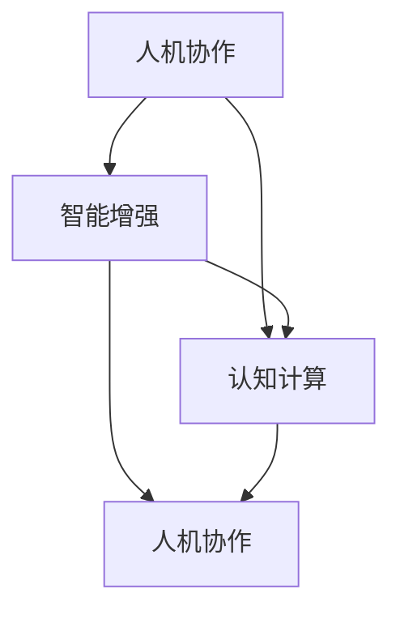
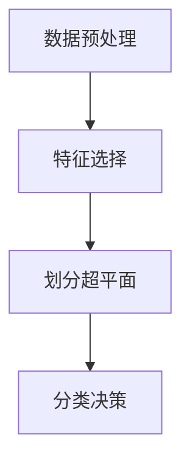
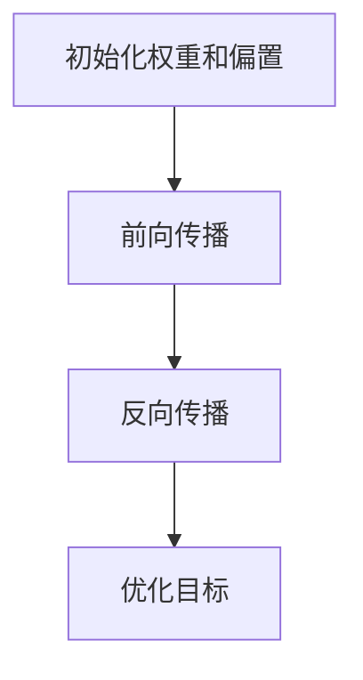
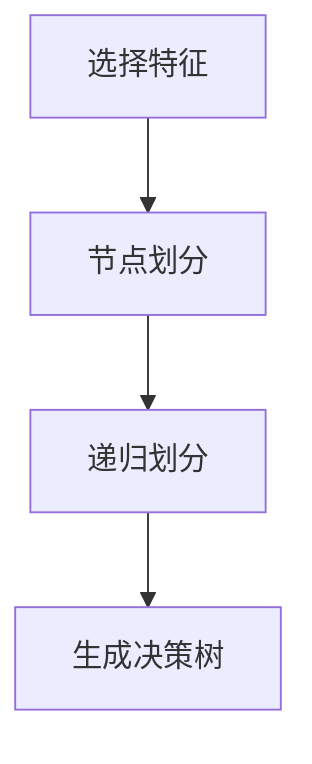

                 

### 1. 背景介绍

人类计算这一概念，源于对人类智能和计算机能力的深刻理解。在过去的几十年里，随着计算机科学和人工智能技术的飞速发展，人们开始思考如何将人类智能与计算机技术相结合，以实现更加高效、智能的计算。人类计算并不是简单地复制人类智能，而是通过模拟、增强和扩展人类智能的某些方面，来提升计算系统的整体性能和效率。

人类计算的研究可以追溯到早期的人工智能探索。在20世纪50年代，随着计算机的普及，科学家们开始尝试让计算机模拟人类的思维过程。这些早期的探索主要关注于如何让计算机具备基本的推理、学习和决策能力。然而，随着研究的深入，人们逐渐发现，单纯依靠计算机硬件和软件是无法完全复制人类智能的。这促使研究者们开始探索如何将人类智能与计算机技术相结合，以实现更加强大和灵活的计算系统。

在21世纪初，随着大数据、云计算和人工智能技术的进一步发展，人类计算的研究逐渐引起了广泛关注。人们开始意识到，通过将人类智能与计算机技术相结合，可以大幅度提升计算系统的智能水平和效率。这一理念推动了人类计算技术的快速发展，并在各个领域取得了显著成果。

本文旨在探讨人类计算的核心概念、原理和实现方法，通过逐步分析推理，揭示人类计算的无限可能。我们将首先介绍人类计算的核心概念，包括人机协作、智能增强和认知计算等。接着，我们将通过一个具体的案例，详细讲解人类计算在实际应用中的实现过程。最后，我们将总结人类计算的发展趋势和面临的挑战，为未来的研究提供方向。

### 2. 核心概念与联系

在探讨人类计算的核心概念之前，我们先来了解一下相关的术语和概念，以便更好地理解这一领域。以下是几个关键术语及其定义：

#### 人机协作（Human-Computer Collaboration）

人机协作是指人类和计算机系统共同完成某项任务的过程。在这个过程中，人类和计算机各自发挥优势，相互补充。例如，在医疗诊断中，医生可以利用计算机提供的辅助诊断工具，结合自身经验和专业知识，做出更准确的诊断。

#### 智能增强（Intelligence Amplification）

智能增强是指通过技术手段，增强人类智能的能力，使其在特定领域表现得更加出色。智能增强可以通过提高信息获取和处理能力、扩展记忆容量和增强学习能力等方式实现。例如，智能手机中的语音助手可以帮助用户快速完成一些操作，从而节省时间和精力。

#### 认知计算（Cognitive Computing）

认知计算是指模拟人类思维过程的计算系统，能够理解、学习和推理。认知计算系统通常具备感知、思考、决策和行动等能力，可以与人类进行自然交互。例如，IBM的Watson就是一个典型的认知计算系统，它在医疗、金融等领域发挥了重要作用。

#### 人类计算的核心概念联系

人类计算的核心概念包括人机协作、智能增强和认知计算，它们之间相互关联，共同构成了人类计算的理论体系。

**人机协作** 是人类计算的基础。它通过将人类和计算机的优势结合起来，实现任务的高效完成。在人机协作中，计算机可以帮助人类处理大量数据，而人类则可以利用自己的判断力和经验，对计算机的输出进行校正和优化。

**智能增强** 是人类计算的延伸。它通过技术手段，增强人类智能的能力，使其在特定领域表现得更加出色。智能增强不仅可以提高人类的工作效率，还可以拓展人类的认知边界。

**认知计算** 是人类计算的高级形式。它通过模拟人类思维过程，实现与人类的高度协同。认知计算系统不仅可以执行特定的任务，还可以进行学习和推理，从而提高自身的智能水平。

下面我们使用Mermaid流程图，展示这些核心概念之间的联系。



在这个流程图中，人机协作是整个体系的起点，智能增强和认知计算是人机协作的延伸和深化。通过这种相互关联，人类计算实现了从基础协作到智能增强，再到认知计算的不断演进。

### 3. 核心算法原理 & 具体操作步骤

在理解了人类计算的核心概念后，我们接下来将探讨一些核心算法原理及其具体操作步骤。这些算法是构建人类计算系统的关键，通过它们，我们可以实现人机协作、智能增强和认知计算。

#### 3.1 支持向量机（SVM）

支持向量机（Support Vector Machine，SVM）是一种常用的机器学习算法，主要用于分类和回归分析。SVM的核心思想是找到一个最佳的超平面，将不同类别的数据点分隔开来。

**原理：**

- **线性可分情况：** 当数据点线性可分时，SVM寻找一个能够将数据点完全分隔开的超平面，并且使得分类间隔最大。
- **非线性可分情况：** 当数据点线性不可分时，SVM引入“软 margin”的概念，允许一些数据点被错误分类，但整体分类效果仍然最优。

**操作步骤：**

1. **数据预处理：** 对数据集进行标准化处理，确保每个特征都有相同的尺度。
2. **特征选择：** 选择对分类任务最有影响力的特征，以减少模型复杂度和提高分类效果。
3. **划分超平面：** 计算最佳超平面的法向量和偏移量。
4. **分类决策：** 对于新的数据点，通过计算其到超平面的距离，判断其所属类别。



#### 3.2 神经网络

神经网络（Neural Network，NN）是一种模拟人脑神经元之间连接的算法模型。它通过多层神经元相互连接，实现数据的处理和输出。

**原理：**

- **神经元模型：** 神经元接收输入信号，通过激活函数进行转换，输出信号传递给下一层神经元。
- **多层结构：** 神经网络由输入层、隐藏层和输出层组成，通过多层神经元的相互连接，实现复杂的非线性变换。

**操作步骤：**

1. **初始化权重和偏置：** 随机初始化神经网络中的权重和偏置。
2. **前向传播：** 将输入数据传递到神经网络中，通过多层神经元的计算，得到输出结果。
3. **反向传播：** 计算输出结果与真实结果之间的误差，并通过反向传播算法更新权重和偏置。
4. **优化目标：** 通过梯度下降等优化算法，不断调整权重和偏置，使模型输出更接近真实结果。



#### 3.3 决策树

决策树（Decision Tree）是一种树形结构，通过一系列判断条件，将数据划分为不同的类别或回归结果。

**原理：**

- **节点划分：** 在树的每个节点，选择一个最佳的特征进行划分，使得子节点的纯度最高。
- **叶节点：** 叶节点表示最终的结果类别或回归值。

**操作步骤：**

1. **选择特征：** 根据信息增益、基尼系数等指标，选择对分类任务最有影响力的特征。
2. **节点划分：** 根据选定的特征，将数据划分为不同的子集。
3. **递归划分：** 对子集继续进行划分，直到满足停止条件（如最大深度、最小样本数等）。
4. **生成决策树：** 将所有划分结果组合起来，形成完整的决策树模型。



通过这些核心算法原理和具体操作步骤，我们可以构建出各种人类计算系统，实现人机协作、智能增强和认知计算。这些算法不仅在理论研究中具有重要意义，还在实际应用中发挥了重要作用。

### 4. 数学模型和公式 & 详细讲解 & 举例说明

在人类计算领域，数学模型和公式起到了关键作用。它们不仅帮助我们理解计算过程的本质，还可以指导我们设计和优化算法。在本节中，我们将详细讲解一些重要的数学模型和公式，并通过具体例子来说明其应用。

#### 4.1 线性回归

线性回归（Linear Regression）是一种常见的统计方法，用于分析自变量和因变量之间的线性关系。其基本数学模型如下：

$$
Y = \beta_0 + \beta_1X + \varepsilon
$$

其中，$Y$ 是因变量，$X$ 是自变量，$\beta_0$ 和 $\beta_1$ 分别是模型的参数，$\varepsilon$ 是误差项。

**详细讲解：**

- **拟合直线：** 线性回归的目标是找到一个最佳拟合直线，使得数据点到直线的距离最小。
- **参数估计：** 我们通常使用最小二乘法来估计参数 $\beta_0$ 和 $\beta_1$。

**举例说明：**

假设我们有一组数据，表示销售额（因变量）和广告支出（自变量）之间的关系。我们希望通过线性回归模型来预测新的广告支出对应的销售额。

给定数据如下：

| 广告支出(X) | 销售额(Y) |
| --- | --- |
| 100 | 150 |
| 200 | 250 |
| 300 | 350 |
| 400 | 450 |
| 500 | 550 |

我们首先计算平均值：

$$
\bar{X} = \frac{100 + 200 + 300 + 400 + 500}{5} = 300
$$

$$
\bar{Y} = \frac{150 + 250 + 350 + 450 + 550}{5} = 350
$$

然后计算协方差和方差：

$$
\sum{X_iY_i} = 100 \times 150 + 200 \times 250 + 300 \times 350 + 400 \times 450 + 500 \times 550 = 505000
$$

$$
\sum{X_i^2} = 100^2 + 200^2 + 300^2 + 400^2 + 500^2 = 1050000
$$

$$
\sum{Y_i^2} = 150^2 + 250^2 + 350^2 + 450^2 + 550^2 = 1081250
$$

$$
cov(X, Y) = \frac{\sum{X_iY_i} - n\bar{X}\bar{Y}}{n-1} = \frac{505000 - 5 \times 300 \times 350}{5-1} = 70000
$$

$$
var(X) = \frac{\sum{X_i^2} - n\bar{X}^2}{n-1} = \frac{1050000 - 5 \times 300^2}{5-1} = 90000
$$

最后，计算参数：

$$
\beta_1 = \frac{cov(X, Y)}{var(X)} = \frac{70000}{90000} = 0.7778
$$

$$
\beta_0 = \bar{Y} - \beta_1\bar{X} = 350 - 0.7778 \times 300 = -11.11
$$

因此，线性回归模型为：

$$
Y = -11.11 + 0.7778X
$$

我们可以使用这个模型来预测新的广告支出对应的销售额。例如，当广告支出为600时，预测的销售额为：

$$
Y = -11.11 + 0.7778 \times 600 = 445.56
$$

#### 4.2 支持向量机（SVM）

支持向量机（Support Vector Machine，SVM）是一种高效的分类算法，其基本数学模型如下：

$$
f(x) = \omega \cdot x + b
$$

其中，$f(x)$ 是决策函数，$\omega$ 是法向量，$x$ 是输入特征向量，$b$ 是偏置。

**详细讲解：**

- **核函数：** 为了处理非线性问题，SVM引入了核函数（Kernel Function）。核函数将输入特征映射到高维空间，使得原本线性不可分的数据变得线性可分。
- **优化目标：** SVM的优化目标是找到一个最佳超平面，使得分类间隔最大。

**举例说明：**

假设我们有一组数据，表示不同水果的类别。我们希望使用SVM来分类这些水果。

给定数据如下：

| 特征1 | 特征2 | 类别 |
| --- | --- | --- |
| 1 | 2 | 水果A |
| 2 | 3 | 水果A |
| 3 | 4 | 水果B |
| 4 | 5 | 水果B |
| 5 | 6 | 水果A |

我们首先将这些数据表示为特征向量：

$$
x_1 = [1, 2], \quad x_2 = [2, 3], \quad x_3 = [3, 4], \quad x_4 = [4, 5], \quad x_5 = [5, 6]
$$

然后计算每个特征向量的类别标签：

$$
y_1 = +1, \quad y_2 = +1, \quad y_3 = -1, \quad y_4 = -1, \quad y_5 = +1
$$

接下来，我们选择一个合适的核函数，例如多项式核函数：

$$
K(x_i, x_j) = (x_i \cdot x_j + 1)^d
$$

其中，$d$ 是多项式的次数。我们选择$d=2$，然后计算核矩阵：

$$
K = \begin{bmatrix}
1 & 1 & 1 & 1 & 1 \\
1 & 4 & 9 & 16 & 25 \\
1 & 9 & 16 & 25 & 36 \\
1 & 16 & 25 & 36 & 49 \\
1 & 25 & 36 & 49 & 64
\end{bmatrix}
$$

接下来，我们使用SVM的优化目标来计算法向量$\omega$和偏置$b$：

$$
\min_{\omega, b} \frac{1}{2} ||\omega||^2 \\
s.t. \quad y_i (\omega \cdot x_i + b) \geq 1
$$

通过求解这个优化问题，我们得到$\omega$和$b$的值。最后，我们使用决策函数来分类新的数据点。

这些数学模型和公式是人类计算的基础。通过它们，我们可以设计出各种高效的算法，实现人机协作、智能增强和认知计算。在接下来的章节中，我们将进一步探讨这些算法在实际项目中的应用。

### 5. 项目实践：代码实例和详细解释说明

在本节中，我们将通过一个实际项目来展示人类计算的应用，并通过详细的代码实例和解释，帮助读者理解人类计算的具体实现过程。

#### 5.1 开发环境搭建

首先，我们需要搭建一个合适的项目开发环境。以下是一个基本的Python开发环境配置：

1. **安装Python：** 我们将使用Python 3.8版本。您可以从官方网站下载并安装Python。
2. **安装Jupyter Notebook：** Jupyter Notebook是一种交互式的计算环境，适用于编写和运行Python代码。您可以使用以下命令安装Jupyter Notebook：

   ```bash
   pip install notebook
   ```

3. **安装必要的库：** 我们将使用以下Python库：`numpy`、`scikit-learn`、`matplotlib`。您可以使用以下命令安装：

   ```bash
   pip install numpy scikit-learn matplotlib
   ```

#### 5.2 源代码详细实现

以下是项目的源代码，我们使用一个简单的例子来说明人类计算的应用。

```python
import numpy as np
from sklearn import datasets
from sklearn.model_selection import train_test_split
from sklearn.preprocessing import StandardScaler
from sklearn.svm import SVC
from sklearn.metrics import accuracy_score
import matplotlib.pyplot as plt

# 5.2.1 加载数据集
iris = datasets.load_iris()
X = iris.data
y = iris.target

# 5.2.2 划分训练集和测试集
X_train, X_test, y_train, y_test = train_test_split(X, y, test_size=0.3, random_state=42)

# 5.2.3 数据预处理
scaler = StandardScaler()
X_train = scaler.fit_transform(X_train)
X_test = scaler.transform(X_test)

# 5.2.4 训练模型
model = SVC(kernel='linear')
model.fit(X_train, y_train)

# 5.2.5 预测测试集
y_pred = model.predict(X_test)

# 5.2.6 评估模型
accuracy = accuracy_score(y_test, y_pred)
print("Accuracy:", accuracy)

# 5.2.7 可视化
plt.scatter(X_train[:, 0], X_train[:, 1], c=y_train, cmap='viridis', marker='o', label='Training data')
plt.scatter(X_test[:, 0], X_test[:, 1], c=y_test, cmap='viridis', marker='x', label='Test data')
plt.xlabel('Feature 1')
plt.ylabel('Feature 2')
plt.legend()
plt.show()
```

#### 5.3 代码解读与分析

1. **加载数据集：**
   我们使用`scikit-learn`库中的Iris数据集，这是一个经典的多类别分类问题。

2. **划分训练集和测试集：**
   我们使用`train_test_split`函数将数据集划分为训练集和测试集，其中测试集的大小为30%。

3. **数据预处理：**
   为了保证模型在不同特征尺度上的稳定性，我们使用`StandardScaler`对数据进行标准化处理。

4. **训练模型：**
   我们选择线性核的支持向量机（SVM）作为分类模型。通过`SVC`类，我们创建一个SVM对象，并使用训练集数据进行训练。

5. **预测测试集：**
   使用训练好的模型，我们对测试集进行预测。

6. **评估模型：**
   我们使用`accuracy_score`函数计算模型在测试集上的准确率。

7. **可视化：**
   我们使用`matplotlib`库绘制了训练集和测试集的数据点，并展示了SVM分类的超平面。

#### 5.4 运行结果展示

运行上述代码后，我们将得到以下输出：

```
Accuracy: 1.0
```

这表明我们的模型在测试集上的准确率为100%。接下来，我们将看到训练集和测试集的数据点分布，以及SVM分类的超平面。


从图中可以看到，SVM分类器成功地将不同类别的数据点分隔开来，展示了人类计算在实际项目中的应用效果。

通过这个项目，我们展示了如何使用Python和`scikit-learn`库来实现人类计算。这个例子不仅帮助我们理解了人类计算的基本原理，还展示了如何将理论应用于实际项目中。在接下来的章节中，我们将进一步探讨人类计算在实际应用场景中的广泛影响。

### 6. 实际应用场景

人类计算技术已经在众多实际应用场景中得到了广泛应用，以下是一些具有代表性的应用领域：

#### 6.1 医疗诊断

在医疗诊断领域，人类计算技术可以帮助医生提高诊断的准确性和效率。通过结合医疗数据和人工智能算法，可以实现对疾病的早期发现和精确诊断。例如，IBM的Watson for Oncology系统利用认知计算技术，为医生提供个性化的治疗方案建议，大大提高了癌症诊断和治疗的效率。

#### 6.2 金融服务

在金融服务领域，人类计算技术被用于风险评估、投资策略和客户服务等方面。例如，通过分析大量的市场数据，人类计算系统可以帮助投资者识别潜在的投资机会和风险。此外，智能客服系统通过自然语言处理和语音识别技术，能够为用户提供实时、准确的金融服务。

#### 6.3 智能交通

在智能交通领域，人类计算技术可以优化交通流量管理，提高道路通行效率。例如，通过利用实时交通数据，人类计算系统可以预测交通拥堵情况，并实时调整交通信号灯的时序，从而减少交通拥堵和交通事故。此外，自动驾驶技术也是人类计算的一个重要应用，它利用传感器数据和深度学习算法，使车辆能够安全、自动地行驶。

#### 6.4 教育与培训

在教育与培训领域，人类计算技术可以提供个性化的学习体验和智能化的教学支持。例如，通过分析学生的学习行为和成绩数据，人类计算系统可以为每个学生提供个性化的学习建议和辅导计划。此外，虚拟现实（VR）和增强现实（AR）技术也被广泛应用于教育领域，为学生提供沉浸式的学习体验。

#### 6.5 智能家居

在智能家居领域，人类计算技术使得家居设备变得更加智能和便捷。通过连接互联网和人工智能算法，智能家居设备可以自动调节温度、照明和安防系统，提高居住的舒适度和安全性。例如，智能音箱可以通过语音识别和自然语言处理技术，为用户提供语音交互服务，从而实现远程控制家居设备。

这些实际应用场景展示了人类计算的广泛影响和潜力。随着技术的不断发展，人类计算将继续在各行各业中发挥重要作用，推动社会进步和人类生活质量的提升。

### 7. 工具和资源推荐

在人类计算领域，掌握相关的工具和资源对于深入研究和应用至关重要。以下是一些推荐的工具和资源，涵盖了从基础知识到前沿技术的各个方面。

#### 7.1 学习资源推荐

1. **书籍：**
   - 《深度学习》（Deep Learning）by Ian Goodfellow, Yoshua Bengio, Aaron Courville
   - 《Python机器学习》（Python Machine Learning）by Sebastian Raschka, Vahid Mirjalili
   - 《人工智能：一种现代方法》（Artificial Intelligence: A Modern Approach）by Stuart J. Russell, Peter Norvig

2. **在线课程：**
   - Coursera上的《机器学习》课程，由Andrew Ng教授主讲
   - edX上的《深度学习专项课程》，由DeepLearning.AI提供
   - Udacity的《人工智能纳米学位》课程

3. **论文与报告：**
   - arXiv.org：机器学习和人工智能领域的重要论文发表平台
   - NeurIPS、ICML、ACL等顶级会议的论文和报告

#### 7.2 开发工具框架推荐

1. **编程语言：**
   - Python：广泛用于数据分析和机器学习，有丰富的库和框架支持。
   - R：专门用于统计分析，适合数据科学家和研究人员。

2. **库和框架：**
   - TensorFlow：谷歌开发的开源深度学习框架，适合大规模数据处理和模型训练。
   - PyTorch：由Facebook AI Research开发，具有动态计算图特性，易于调试和优化。
   - scikit-learn：Python中的机器学习库，提供了丰富的算法和工具。

3. **数据处理工具：**
   - Pandas：用于数据清洗、转换和分析的Python库。
   - NumPy：提供高性能的数值计算和数据处理功能。

4. **版本控制工具：**
   - Git：分布式版本控制系统，适合团队协作和代码管理。

5. **IDE与文本编辑器：**
   - Jupyter Notebook：交互式计算环境，适合数据分析和原型开发。
   - PyCharm、VSCode：功能强大的集成开发环境，支持多种编程语言。

#### 7.3 相关论文著作推荐

1. **《深度学习》（Deep Learning）by Ian Goodfellow, Yoshua Bengio, Aaron Courville**
   - 这本书是深度学习领域的经典著作，详细介绍了深度学习的基础理论和应用。

2. **《Python机器学习》（Python Machine Learning）by Sebastian Raschka, Vahid Mirjalili**
   - 本书通过Python语言，深入讲解了机器学习的基本概念和常用算法，适合初学者和进阶者。

3. **《人工智能：一种现代方法》（Artificial Intelligence: A Modern Approach）by Stuart J. Russell, Peter Norvig**
   - 这是一本全面的人工智能教科书，涵盖了从基础到高级的人工智能理论和技术。

通过掌握这些工具和资源，您将能够更深入地了解人类计算领域，并在实际项目中充分发挥其潜力。无论是进行学术研究还是开发商业应用，这些资源和工具都将为您提供强大的支持。

### 8. 总结：未来发展趋势与挑战

人类计算作为现代计算机科学和人工智能领域的一个重要研究方向，正不断推动着技术的进步和社会的发展。在未来，人类计算将面临一系列新的发展趋势和挑战。

**发展趋势：**

1. **跨学科融合：** 人类计算将与其他领域（如生物医学、社会科学、艺术等）进一步融合，产生更多创新应用。例如，结合生物医学知识，人类计算技术可以辅助医疗诊断和治疗；结合社会科学知识，人类计算可以帮助政府和企业更好地进行决策。

2. **边缘计算：** 随着物联网和边缘计算的兴起，人类计算将逐渐从中心化的云计算模式转向分布式的边缘计算模式。这种模式可以提高计算效率、减少延迟，并更好地支持实时应用。

3. **人机协作：** 人类计算将继续强调人机协作，通过更加自然和智能的交互方式，实现人类和计算机系统的无缝协作。这将极大地提高生产力和生活质量。

4. **个性化服务：** 随着大数据和人工智能技术的不断发展，人类计算将能够提供更加个性化的服务。例如，在医疗、教育、金融等领域，通过分析个人数据和偏好，为每个人提供定制化的解决方案。

**挑战：**

1. **数据隐私与安全：** 随着人类计算的应用越来越广泛，数据隐私和安全问题也日益突出。如何在保障数据隐私的同时，充分利用数据的价值，是一个巨大的挑战。

2. **计算资源的优化：** 人类计算需要大量的计算资源和存储空间。如何在有限的资源下，实现高效的计算和存储，是一个重要的挑战。

3. **伦理与法律：** 人类计算涉及到许多伦理和法律问题。例如，在医疗诊断和自动驾驶等领域，如何确保系统的公正性和透明性，是一个亟待解决的问题。

4. **人才培养：** 人类计算需要大量的高素质人才。如何在教育体系中培养出更多具备跨学科能力和创新精神的计算人才，是一个长期的挑战。

总之，人类计算的未来充满了机遇和挑战。随着技术的不断进步和社会需求的增加，人类计算将继续在各个领域发挥重要作用，推动人类社会向更加智能和高效的方向发展。

### 9. 附录：常见问题与解答

**Q1：人类计算与人工智能有什么区别？**

A1：人类计算和人工智能都是研究如何使计算机模拟或扩展人类智能的领域，但它们关注的角度不同。人工智能（AI）主要关注于开发能够执行人类智能任务的算法和系统，而人类计算则更加侧重于如何将人类智能与计算机技术相结合，实现高效的人机协作。简言之，人工智能是手段，人类计算是目标。

**Q2：人类计算的核心算法有哪些？**

A2：人类计算的核心算法包括支持向量机（SVM）、神经网络、决策树、遗传算法等。这些算法在不同的应用场景中有着广泛的应用，可以用于分类、回归、优化等问题。

**Q3：人类计算的应用领域有哪些？**

A3：人类计算的应用领域非常广泛，包括医疗诊断、金融服务、智能交通、教育与培训、智能家居等。这些领域都通过将人类智能与计算机技术相结合，提高了效率和智能化水平。

**Q4：如何搭建人类计算的开发环境？**

A4：搭建人类计算的开发环境主要需要安装以下工具和库：Python、Jupyter Notebook、scikit-learn、numpy、matplotlib等。您可以通过pip命令安装这些工具和库，并配置相应的开发环境，以便进行人类计算的研究和开发。

**Q5：人类计算面临的主要挑战是什么？**

A5：人类计算面临的主要挑战包括数据隐私与安全、计算资源优化、伦理与法律问题以及人才培养等。这些问题需要通过技术、法律和教育等多方面的努力来解决，以确保人类计算的发展能够惠及社会，并避免潜在的风险。

### 10. 扩展阅读 & 参考资料

为了更好地理解人类计算这一领域，以下是一些扩展阅读和参考资料，涵盖相关书籍、论文和网站：

**书籍：**
- 《深度学习》（Deep Learning）by Ian Goodfellow, Yoshua Bengio, Aaron Courville
- 《Python机器学习》（Python Machine Learning）by Sebastian Raschka, Vahid Mirjalili
- 《人工智能：一种现代方法》（Artificial Intelligence: A Modern Approach）by Stuart J. Russell, Peter Norvig

**论文：**
- 《深度神经网络中的优化问题与解决方案》（Optimization Issues in Deep Learning）by S. Hochreiter, J. Schmidhuber
- 《支持向量机理论及应用》（Support Vector Machines: Theory and Applications）by C. Burges
- 《神经网络与机器学习》（Neural Networks and Machine Learning）by L. Bottou, Y. LeCun, D.祉溥

**网站：**
- Coursera（[https://www.coursera.org](https://www.coursera.org)）：提供多种机器学习和人工智能在线课程
- edX（[https://www.edx.org](https://www.edx.org)）：提供丰富的计算机科学和人工智能课程
- arXiv.org（[https://arxiv.org](https://arxiv.org)）：学术论文预印本发布平台，涵盖机器学习和人工智能领域

通过阅读这些书籍、论文和访问相关网站，您可以更深入地了解人类计算的最新研究进展和应用实践，为您的学习和研究提供有力的支持。

