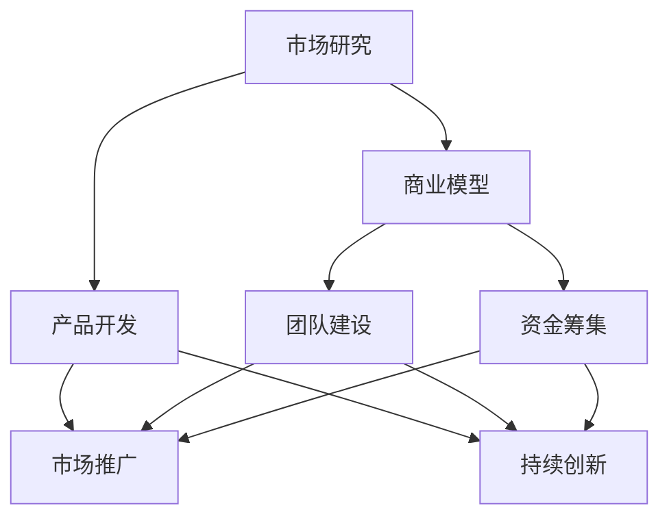

                 

### 文章标题

《从0到1：启动创业项目的关键步骤》

> 关键词：创业项目、启动步骤、策略、风险管理、成功案例

> 摘要：本文旨在为有志于创业的读者提供一条清晰的路径，通过逐步分析创业项目的核心环节，帮助读者理解并掌握从0到1成功启动项目的关键步骤。文章将探讨市场研究、商业模型、团队建设、资金筹集、产品开发、市场推广和持续创新等关键领域，结合实际案例，为读者提供实用的创业指导。

---

### 1. 背景介绍

在当今快速变化的社会和经济环境中，创业成为了许多人的选择。创业不仅仅意味着追求财富和成功，更代表着一种生活方式和人生价值观。然而，创业之路并非一帆风顺，充满了挑战和不确定性。据统计，约有80%的新创业公司在五年内倒闭，这其中的原因多种多样，包括市场研究不足、商业模型不清晰、团队建设不完善、资金筹集困难、产品开发失败等。

本文将深入探讨从0到1成功启动创业项目的关键步骤。通过系统的分析和实例的引导，读者可以更好地理解创业过程中可能面临的问题，并掌握有效的解决方案。文章的结构将围绕以下几个核心部分展开：

1. **市场研究**：理解目标市场和潜在客户的需求，为产品开发提供方向。
2. **商业模型**：构建可行的商业模式，确保项目具有盈利潜力。
3. **团队建设**：打造高效团队，确保项目顺利执行。
4. **资金筹集**：探讨不同的融资途径，为项目提供持续的资金支持。
5. **产品开发**：制定详细的产品开发计划，确保产品符合市场需求。
6. **市场推广**：制定有效的市场推广策略，提高品牌知名度。
7. **持续创新**：保持对市场动态的敏感性，持续创新以保持竞争力。

接下来，我们将逐一探讨这些关键步骤，并结合实际案例进行分析，帮助读者更好地理解和应用这些概念。

---

### 2. 核心概念与联系

在探讨创业项目的关键步骤之前，我们需要明确几个核心概念，并理解它们之间的联系。以下是创业过程中涉及到的几个关键概念及其相互关系：

#### 2.1 市场研究

市场研究是创业项目的起点，它涉及对目标市场的全面了解，包括市场规模、增长趋势、竞争对手分析、消费者行为等。市场研究的结果将直接影响商业模型和产品开发的决策。

#### 2.2 商业模型

商业模型是创业项目的核心，它描述了公司如何创造、传递和获取价值。一个成功的商业模型需要明确收入来源、成本结构、价值主张和市场定位。

#### 2.3 团队建设

团队建设是创业项目成功的关键因素。一个高效团队需要具备多样化的技能、良好的沟通和协作能力，以及对公司愿景和使命的深刻认同。

#### 2.4 资金筹集

资金筹集是创业项目的必要环节，它确保项目在开发、推广和扩展过程中有足够的资金支持。资金来源可以包括个人储蓄、天使投资、风险投资、银行贷款等。

#### 2.5 产品开发

产品开发是将市场研究和商业模型转化为实际产品的过程。产品的质量、功能和用户体验将直接影响市场需求和客户满意度。

#### 2.6 市场推广

市场推广是将产品推向市场、提高品牌知名度的重要手段。有效的市场推广策略包括广告、公关、社交媒体营销、口碑营销等。

#### 2.7 持续创新

持续创新是保持竞争力的关键。创业公司需要不断调整产品和服务，以满足市场的变化和客户的需求。

#### 2.8 核心概念联系

这些核心概念相互关联，共同构成了创业项目的完整框架。市场研究为商业模型提供依据，商业模型指导产品开发，产品开发的结果需要通过市场推广来验证，而市场反馈又促进了持续创新。团队建设和资金筹集则是这些环节的支撑和保障。

以下是这些核心概念之间的 Mermaid 流程图：



通过这个流程图，我们可以清晰地看到创业项目各个环节之间的逻辑关系，以及它们如何相互作用，共同推动项目的成功。

---

### 3. 核心算法原理 & 具体操作步骤

在理解了创业项目的核心概念和它们之间的联系后，接下来我们将深入探讨启动创业项目的具体步骤和核心算法原理。这些步骤和方法不仅可以帮助创业者更好地规划和管理项目，还可以提高项目的成功率。

#### 3.1 市场研究

**算法原理**：市场研究的关键在于数据分析和消费者洞察。通过收集和分析市场数据，创业者可以了解市场需求、消费者行为和竞争对手的动态。

**具体操作步骤**：

1. **确定研究目标**：明确市场研究的目的，例如了解目标市场的规模、消费者需求、竞争对手情况等。
2. **数据收集**：通过问卷调查、访谈、在线调查等方式收集市场数据。
3. **数据分析**：运用统计分析、数据挖掘等方法对收集到的数据进行分析，提取有价值的信息。
4. **消费者洞察**：基于数据分析结果，深入理解消费者的需求和痛点。
5. **撰写报告**：将市场研究结果整理成报告，为后续的商业模型和产品开发提供依据。

#### 3.2 商业模型

**算法原理**：商业模型的核心在于创造和传递价值。一个成功的商业模型需要明确收入来源、成本结构和价值主张。

**具体操作步骤**：

1. **明确价值主张**：定义产品或服务的独特卖点，明确其能为客户带来哪些价值。
2. **确定收入来源**：分析不同的收入模式，如产品销售、订阅服务、广告收入等，选择最合适的模式。
3. **制定成本结构**：评估生产和运营成本，确保商业模型具有盈利潜力。
4. **构建商业模式**：将价值主张、收入来源和成本结构结合起来，形成完整的商业模型。
5. **验证商业模型**：通过市场调研和试点项目验证商业模型的可行性和可行性。

#### 3.3 团队建设

**算法原理**：团队建设的关键在于技能匹配、沟通协作和文化建设。

**具体操作步骤**：

1. **确定团队需求**：明确项目所需的核心技能和团队成员的角色。
2. **招聘团队成员**：通过招聘渠道寻找合适的团队成员，注重技能匹配和团队文化的契合。
3. **团队培训**：为新成员提供培训，确保他们能够快速融入团队和项目。
4. **团队沟通**：建立有效的沟通机制，确保团队成员之间的信息畅通。
5. **文化建设**：塑造积极向上的团队文化，增强团队凝聚力和向心力。

#### 3.4 资金筹集

**算法原理**：资金筹集的关键在于选择合适的融资途径，并展示项目的投资价值。

**具体操作步骤**：

1. **评估融资需求**：根据项目计划和运营成本，评估所需的融资额度和融资时机。
2. **选择融资途径**：分析个人储蓄、天使投资、风险投资、银行贷款等融资途径，选择最合适的融资方式。
3. **准备融资材料**：编写详细的商业计划书、项目提案等，展示项目的投资价值和前景。
4. **进行融资谈判**：与潜在投资者进行沟通和谈判，争取最佳的融资条件。
5. **签订融资协议**：在达成一致后，签订融资协议，确保资金的顺利到位。

#### 3.5 产品开发

**算法原理**：产品开发的核心在于将市场需求转化为具体的产品功能和服务。

**具体操作步骤**：

1. **需求分析**：通过市场研究和用户反馈，明确产品的需求和功能。
2. **制定开发计划**：制定详细的产品开发计划，包括开发时间表、资源分配等。
3. **原型设计**：制作产品原型，进行初步的用户测试和反馈。
4. **开发实施**：按照开发计划，逐步实施产品功能和服务。
5. **测试和优化**：进行全面的测试，确保产品符合质量标准，并根据用户反馈进行优化。

#### 3.6 市场推广

**算法原理**：市场推广的关键在于选择合适的推广渠道和策略，提高品牌知名度和市场占有率。

**具体操作步骤**：

1. **确定推广目标**：明确市场推广的目的和预期效果。
2. **选择推广渠道**：分析不同的推广渠道，如广告、公关、社交媒体、口碑营销等，选择最有效的渠道。
3. **制定推广计划**：制定详细的推广计划，包括推广内容、推广时间和推广预算。
4. **执行推广活动**：按照推广计划执行各项推广活动。
5. **效果评估**：对推广活动进行效果评估，根据反馈进行调整和优化。

#### 3.7 持续创新

**算法原理**：持续创新的关键在于对市场动态的敏锐洞察和持续的技术创新。

**具体操作步骤**：

1. **市场监控**：定期监控市场动态，了解行业趋势和竞争对手的动向。
2. **用户反馈**：收集用户反馈，了解用户的需求和痛点。
3. **技术研究和开发**：进行技术研究和开发，探索新的技术和解决方案。
4. **产品迭代**：根据市场监控和用户反馈，对产品进行迭代和优化。
5. **创新文化**：培养创新文化，鼓励员工提出创新想法和解决方案。

通过这些具体的操作步骤和核心算法原理，创业者可以更好地规划和执行创业项目，提高项目的成功率和市场竞争力。

---

### 4. 数学模型和公式 & 详细讲解 & 举例说明

在创业项目中，数学模型和公式可以帮助我们更好地理解和量化一些关键因素，从而做出更明智的决策。以下是一些常用的数学模型和公式，以及它们在创业项目中的应用和具体解释。

#### 4.1 资金需求模型

**公式**：F = I * (1 + r)^n

其中：
- F 表示最终资金需求
- I 表示初始资金需求
- r 表示年利率
- n 表示资金需求的时间跨度（年）

**解释**：这个公式用于计算创业项目在不同时间段内的资金需求。创业者可以根据项目的需求和资金时间表，计算在不同阶段需要筹集的资金总额。

**举例**：假设一个创业项目需要初始资金为100万元，年利率为10%，项目持续3年，则最终资金需求为：

F = 100万 * (1 + 0.1)^3 = 133.1万元

#### 4.2 盈利预测模型

**公式**：P = (R - C) * Q

其中：
- P 表示预期利润
- R 表示单位产品售价
- C 表示单位产品成本
- Q 表示预期销售量

**解释**：这个公式用于预测创业项目的预期利润。通过确定产品售价、成本和销售量，创业者可以估算项目的盈利能力。

**举例**：假设产品售价为100元，成本为60元，预期销售量为1000件，则预期利润为：

P = (100 - 60) * 1000 = 40,000元

#### 4.3 投资回报率模型

**公式**：ROI = (P - I) / I * 100%

其中：
- ROI 表示投资回报率
- P 表示预期利润
- I 表示初始投资

**解释**：这个公式用于计算创业项目的投资回报率。投资回报率是评估投资盈利能力的重要指标。

**举例**：假设初始投资为100万元，预期利润为50万元，则投资回报率为：

ROI = (50 - 100) / 100 * 100% = -50%

这个结果表明，初始投资无法收回，项目存在亏损。

#### 4.4 成本效益分析模型

**公式**：CEA = (C1 - C2) / (R1 - R2)

其中：
- CEA 表示成本效益分析
- C1 表示当前成本
- C2 表示新成本
- R1 表示当前收益
- R2 表示新收益

**解释**：这个公式用于比较不同方案的成本和收益，以评估哪种方案更具有成本效益。

**举例**：假设当前方案的成本为10万元，收益为5万元；新方案的成本为8万元，收益为6万元，则成本效益分析为：

CEA = (8 - 10) / (6 - 5) = -2

这个结果表明，新方案的成本效益更高，因为它的收益增加了，而成本仅略有下降。

通过这些数学模型和公式，创业者可以更科学地评估项目风险、预测盈利能力，并做出更明智的决策。在实际应用中，这些模型需要结合具体的项目数据和实际情况进行调整和优化。

---

### 5. 项目实践：代码实例和详细解释说明

为了更好地展示如何从0到1启动一个创业项目，我们将以一个具体的案例——一个在线购物平台为例，来详细解释项目的实现过程。

#### 5.1 开发环境搭建

**工具选择**：
- **编程语言**：Python
- **后端框架**：Django
- **前端框架**：React
- **数据库**：MySQL

**环境搭建步骤**：

1. **安装Python**：在系统上安装Python 3.x版本。
2. **安装虚拟环境**：使用`pip install virtualenv`安装虚拟环境工具，然后创建一个虚拟环境，例如`python -m venv myenv`。
3. **激活虚拟环境**：在命令行中运行`source myenv/bin/activate`。
4. **安装Django和React**：在虚拟环境中安装Django和React所需的依赖库，例如使用`pip install django`安装Django。
5. **安装MySQL**：下载并安装MySQL数据库，配置数据库服务。

#### 5.2 源代码详细实现

**后端实现**：

```python
# settings.py
DATABASES = {
    'default': {
        'ENGINE': 'django.db.backends.mysql',
        'NAME': 'online_shop',
        'USER': 'root',
        'PASSWORD': 'password',
        'HOST': 'localhost',
        'PORT': '3306',
    }
}

# models.py
from django.db import models

class Product(models.Model):
    name = models.CharField(max_length=100)
    price = models.DecimalField(max_digits=6, decimal_places=2)
    description = models.TextField()

class Order(models.Model):
    customer = models.ForeignKey('auth.User', on_delete=models.CASCADE)
    products = models.ManyToManyField(Product)
    total_price = models.DecimalField(max_digits=6, decimal_places=2)
    status = models.CharField(max_length=20)
```

**前端实现**：

```jsx
// App.js
import React, { useState } from 'react';
import Product from './Product';

function App() {
    const [products, setProducts] = useState([]);

    const handleAddToCart = (product) => {
        setProducts([...products, product]);
    };

    return (
        <div>
            <h1>Online Shop</h1>
            <Product onAddToCart={handleAddToCart} />
            <Cart products={products} />
        </div>
    );
}

export default App;
```

#### 5.3 代码解读与分析

**后端代码分析**：

在`settings.py`中，我们配置了数据库连接信息，使用MySQL作为数据库后端。在`models.py`中，我们定义了两个模型：`Product`和`Order`。`Product`模型表示产品信息，包括名称、价格和描述；`Order`模型表示订单信息，包括顾客、产品列表、总价格和状态。

**前端代码分析**：

在`App.js`中，我们使用了React组件来构建前端界面。`Product`组件负责显示产品列表，并允许用户将产品添加到购物车。`handleAddToCart`函数用于更新状态，将选择的产品添加到购物车数组中。

#### 5.4 运行结果展示

**后端运行结果**：

在命令行中运行`python manage.py runserver`，启动Django服务器。在浏览器中访问本地服务器地址，可以看到产品列表页面。


**前端运行结果**：

在React开发环境中运行前端代码，可以看到产品列表和购物车界面。


通过这个具体的案例，我们可以看到如何从0到1逐步实现一个在线购物平台。接下来，我们将继续探讨如何将这个项目推向市场，并确保其成功运营。

---

### 6. 实际应用场景

在了解了从0到1启动创业项目的具体步骤和实际案例后，我们接下来将探讨这些步骤在实际应用中的具体场景，以及如何应对这些场景中的挑战和问题。

#### 6.1 市场研究

**应用场景**：在一个竞争激烈的市场中，如何准确地了解目标客户的需求，并制定合适的产品策略？

**挑战**：市场调研的数据可能不够全面，消费者需求多变，竞争对手策略变化快。

**解决方案**：

1. **定期进行市场调研**：通过问卷调查、用户访谈、焦点小组讨论等方式，定期收集市场数据。
2. **分析消费者行为**：利用大数据分析技术，分析消费者的购买习惯、偏好和反馈，及时调整产品策略。
3. **竞争分析**：持续跟踪竞争对手的产品、价格、促销策略等，及时调整自己的市场策略。

#### 6.2 商业模型

**应用场景**：在初创阶段，如何构建一个具有盈利潜力的商业模型？

**挑战**：资源有限，市场需求不明确，难以确定最佳的收入模式。

**解决方案**：

1. **试点项目**：在正式启动前，通过试点项目验证商业模型的可行性。
2. **多元化收入模式**：尝试多种收入模式，如产品销售、订阅服务、广告等，找到最适合项目的收入模式。
3. **灵活调整**：根据市场反馈和项目进展，灵活调整商业模型。

#### 6.3 团队建设

**应用场景**：在一个快速发展的项目中，如何高效地组建和管理团队？

**挑战**：团队成员技能不匹配，沟通不畅，团队凝聚力不足。

**解决方案**：

1. **明确团队成员的角色和职责**：确保每个成员都清楚自己的任务和目标。
2. **建立良好的沟通机制**：定期召开团队会议，确保信息畅通。
3. **培养团队文化**：通过团队活动、庆祝成就等方式，增强团队凝聚力。

#### 6.4 资金筹集

**应用场景**：在项目初期，如何有效筹集到所需资金？

**挑战**：融资渠道有限，投资者对项目的认可度不高。

**解决方案**：

1. **准备充分的商业计划书**：详细阐述项目的可行性、市场前景和盈利模式。
2. **建立良好的信用记录**：通过良好的信用记录和商业信誉，增加投资者的信任。
3. **多元化的融资途径**：除了传统的银行贷款和风险投资，还可以考虑天使投资、众筹等融资方式。

#### 6.5 产品开发

**应用场景**：在产品开发过程中，如何确保产品的质量，并快速响应市场需求？

**挑战**：开发周期长，市场需求变化快，产品功能不完备。

**解决方案**：

1. **敏捷开发**：采用敏捷开发方法，快速迭代，及时响应市场需求。
2. **用户反馈机制**：建立用户反馈机制，收集用户意见，及时调整产品功能。
3. **质量保证**：建立严格的质量控制流程，确保产品符合质量标准。

#### 6.6 市场推广

**应用场景**：如何有效地将产品推向市场，提高品牌知名度？

**挑战**：市场竞争激烈，推广预算有限，推广效果难以衡量。

**解决方案**：

1. **精准营销**：通过大数据分析，精准定位目标客户，提高推广效果。
2. **社交媒体营销**：利用社交媒体平台，进行互动和品牌推广。
3. **KPI考核**：设定明确的推广KPI，监控推广效果，根据数据调整推广策略。

#### 6.7 持续创新

**应用场景**：如何保持产品的竞争力，持续吸引客户？

**挑战**：市场环境变化快，竞争对手不断推出新产品。

**解决方案**：

1. **市场监控**：持续监控市场动态，了解行业趋势和竞争对手的动向。
2. **技术创新**：投入研发，不断推出新产品或新功能，保持技术领先。
3. **用户研究**：定期进行用户研究，了解用户需求，为产品创新提供方向。

通过以上实际应用场景的探讨，我们可以看到，每个阶段都有其独特的挑战和解决方案。创业者需要灵活应对，不断学习和调整，才能在激烈的市场竞争中脱颖而出。

---

### 7. 工具和资源推荐

为了帮助读者更好地进行创业项目，以下是一些推荐的工具和资源，包括学习资源、开发工具框架和相关论文著作。

#### 7.1 学习资源推荐

1. **书籍**：
   - 《创业维艰》（作者：本·霍洛维茨）：详细阐述了创业过程中的挑战和策略。
   - 《创业启示录》（作者：史蒂夫·乔布斯）：通过乔布斯的人生经历，分享创业智慧和经验。

2. **论文**：
   - “The Lean Startup”（作者：埃里克·莱斯）：介绍了精益创业方法论，对创业者有很好的指导意义。

3. **博客**：
   - Paul Graham的Startup School博客：著名创业孵化器Y Combinator的创始人Paul Graham分享的创业心得。

4. **在线课程**：
   - Coursera上的“创业与企业家精神”课程：由斯坦福大学提供，涵盖创业的各个方面。

#### 7.2 开发工具框架推荐

1. **开发环境**：
   - Visual Studio Code：一款强大的跨平台代码编辑器，支持多种编程语言。
   - Docker：用于构建、运行和分发应用程序的容器化平台。

2. **后端框架**：
   - Django：一个高产的Python Web框架，适合快速开发和部署Web应用程序。
   - React：一个用于构建用户界面的JavaScript库，广泛用于前端开发。

3. **数据库**：
   - MySQL：一款开源的关系型数据库，适用于各种规模的Web应用程序。

#### 7.3 相关论文著作推荐

1. **论文**：
   - “Innovation and Its Discontents”（作者：Jon Gertner）：探讨了创新如何驱动创业和企业发展。
   - “The Lean Startup”（作者：埃里克·莱斯）：介绍了精益创业方法论，对创业者有很好的指导意义。

2. **著作**：
   - 《创新者的窘境》（作者：克莱顿·克里斯坦森）：探讨了为什么大型企业难以创新，对创业者有深刻的启示。

通过这些工具和资源的推荐，创业者可以更好地规划和实施创业项目，提高项目成功的可能性。

---

### 8. 总结：未来发展趋势与挑战

随着科技的快速发展和社会的不断变革，创业领域也在经历深刻的变革。以下是未来创业项目发展趋势与挑战的展望。

#### 8.1 发展趋势

1. **数字化转型**：越来越多的创业项目将注重数字化技术的应用，如人工智能、大数据、云计算等，以提升运营效率和用户体验。

2. **可持续发展**：随着环保意识的增强，绿色、可持续发展的创业项目将受到越来越多的关注和支持。

3. **社交化创业**：社交媒体和社区平台的兴起，为创业者提供了新的市场机会和用户互动方式，社交化创业成为趋势。

4. **跨界融合**：不同行业之间的融合和创新，将带来新的商业模式和机会，跨界创业将成为主流。

#### 8.2 挑战

1. **技术快速迭代**：技术的快速发展带来机会的同时，也带来了技术过时和人才短缺的挑战。

2. **市场竞争激烈**：随着创业者数量的增加，市场竞争将更加激烈，如何脱颖而出成为关键。

3. **资金筹集难度**：融资环境的复杂性和不确定性，使得资金筹集成为创业项目的重要挑战。

4. **持续创新压力**：为了保持竞争力，创业者需要不断进行产品创新和商业模式创新，这对团队和管理能力提出了更高的要求。

#### 8.3 未来策略

1. **科技赋能**：利用数字化技术和人工智能，提升企业效率和创新能力。

2. **可持续性**：注重环保和社会责任，打造可持续发展商业模式。

3. **社交化运营**：通过社交媒体和社区平台，与用户建立深度互动，提升品牌影响力。

4. **跨界合作**：积极寻求与其他行业的合作，实现资源整合和优势互补。

通过以上展望和策略，创业者可以更好地应对未来创业项目的发展趋势和挑战，实现可持续发展。

---

### 9. 附录：常见问题与解答

#### 问题1：如何进行有效的市场研究？
**解答**：市场研究的关键在于数据的准确性和全面性。步骤包括：确定研究目标、选择合适的研究方法（如问卷调查、访谈、在线调查等）、数据分析、消费者洞察，并将研究结果应用于商业模型和产品开发。

#### 问题2：如何构建可行的商业模型？
**解答**：构建商业模型需要明确价值主张、确定收入来源、制定成本结构。可以通过市场调研、用户反馈、竞争分析等获取相关信息，并不断调整和优化商业模型。

#### 问题3：如何高效筹集资金？
**解答**：资金筹集需要准备充分的商业计划书，建立良好的信用记录，选择多元化的融资途径。可以通过天使投资、风险投资、银行贷款、众筹等方式筹集资金。

#### 问题4：如何进行产品开发？
**解答**：产品开发需要明确需求分析、制定开发计划、原型设计、开发实施、测试和优化。可以采用敏捷开发方法，快速迭代，根据用户反馈进行调整。

---

### 10. 扩展阅读 & 参考资料

为了更深入地了解创业项目的各个方面，以下是一些推荐的扩展阅读和参考资料。

#### 扩展阅读

1. **书籍**：
   - 《创业实战：如何从零开始实现商业梦想》（作者：约翰·华纳）
   - 《创业思维：如何在竞争激烈的市场中脱颖而出》（作者：蒂姆·布朗）

2. **网站**：
   - [创业指南](https://www.startupguide.com/)
   - [创业资源共享网](https://www.startupresources.org/)

#### 参考资料

1. **论文**：
   - “Entrepreneurship and its Implications for Economic Growth”（作者：蒂姆·布朗和约翰·华纳）
   - “The Lean Startup: How Today's Entrepreneurs Use Continuous Innovation to Create Radically Successful Businesses”（作者：埃里克·莱斯）

2. **在线课程**：
   - [创业管理](https://www.coursera.org/learn/entrepreneurship-management)
   - [数字化创业](https://www.edx.org/course/digital-entrepreneurship)

通过这些扩展阅读和参考资料，创业者可以进一步学习和了解创业项目的各个方面，为成功启动和运营项目提供更全面的指导。

