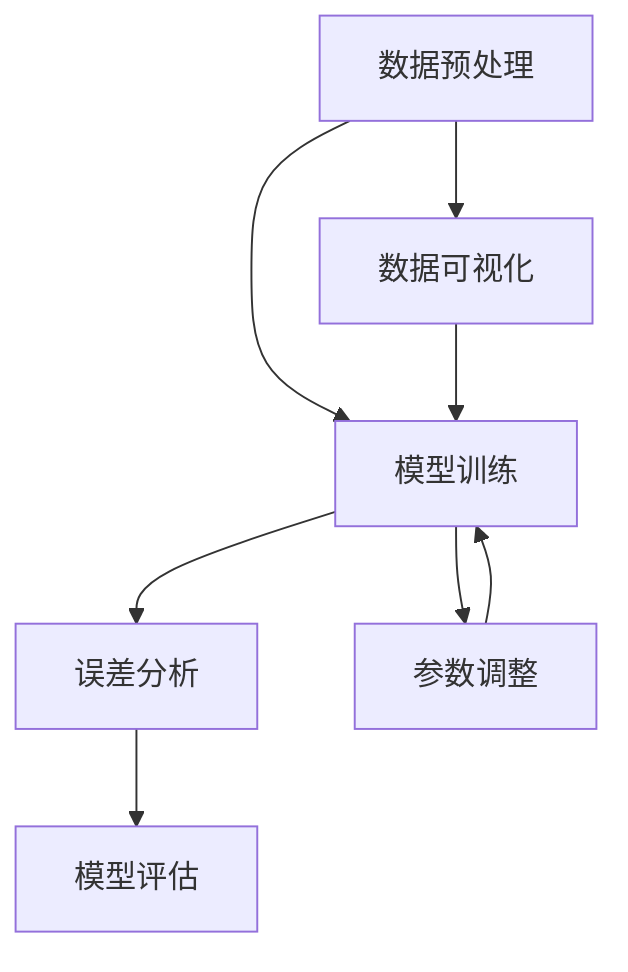

                 

### 1. 背景介绍

从简单的图像识别到复杂的大语言模型，人工智能技术的发展经历了多个阶段。在这条道路上，MNIST数据集扮演了一个关键的角色。MNIST是一个手写数字数据集，包含70000个灰度图像，每个图像都是一个0到9的手写数字。这个数据集不仅简单易用，而且涵盖了足够的样本量，成为许多初学者和研究人员学习、测试和验证算法的完美工具。

MNIST数据集的起源可以追溯到2000年，由美国国家标准技术研究所（NIST）开发，最初用于研究数字识别技术。随着深度学习的兴起，MNIST数据集成为了一个重要的测试平台，许多算法在这里获得了突破性的进展。

在这个数据集中，每个数字都被标准化为28x28像素的灰度图像。这种标准的图像尺寸为后来的研究和算法开发提供了一个统一的基准，使得不同算法的比较和研究变得更加容易。此外，MNIST数据集的标签是准确的，每个图像都被正确标注了数字。

MNIST数据集的受欢迎程度不仅仅是因为它的易用性和标准化，还因为它涵盖了从简单到复杂的不同类型的图像识别任务。这使得研究人员可以在不同的任务中测试他们的算法，从而推动人工智能技术的发展。

总之，MNIST数据集是人工智能领域的一个里程碑，它不仅为研究人员提供了一个简单但有效的工具，还为整个领域的发展奠定了坚实的基础。接下来，我们将深入探讨MNIST数据集的核心概念、算法原理、数学模型以及实际应用，以便更好地理解其在人工智能领域的重要性。

### 2. 核心概念与联系

为了深入理解MNIST数据集在人工智能领域中的作用，我们需要探讨一些核心概念，包括数据预处理、模型训练、误差分析和模型评估。下面，我们将通过一个Mermaid流程图来展示这些核心概念和它们之间的联系。



**2.1 数据预处理**

数据预处理是任何机器学习项目中的第一步，也是至关重要的一步。对于MNIST数据集，预处理主要包括以下步骤：

- **归一化（Normalization）**：将图像的像素值从0到255归一化到0到1之间，以便于模型训练。
- **扁平化（Flattening）**：将28x28的图像转化为一个一维的向量，以便输入到神经网络中。
- **数据增强（Data Augmentation）**：通过旋转、缩放、剪切等操作增加数据的多样性，从而提高模型的泛化能力。

**2.2 模型训练**

模型训练是利用预处理后的数据来训练神经网络模型。在MNIST数据集中，常用的模型是卷积神经网络（CNN），其基本结构包括以下几个部分：

- **卷积层（Convolutional Layer）**：用于提取图像的特征。
- **池化层（Pooling Layer）**：用于减少特征图的尺寸，降低模型的复杂性。
- **全连接层（Fully Connected Layer）**：将特征图映射到具体的数字类别。

**2.3 误差分析**

误差分析是评估模型性能的重要步骤。在MNIST数据集中，常见的误差类型包括：

- **分类误差（Classification Error）**：模型无法正确分类图像的错误率。
- **准确率（Accuracy）**：模型正确分类的图像占总图像的比例。
- **混淆矩阵（Confusion Matrix）**：展示模型在不同类别上的准确率和误分类情况。

**2.4 模型评估**

模型评估是通过一系列指标来衡量模型的性能。对于MNIST数据集，常用的评估指标包括：

- **精度（Precision）**：模型预测为正类的样本中实际为正类的比例。
- **召回率（Recall）**：模型预测为正类的样本中实际为正类的比例。
- **F1 分数（F1 Score）**：精度和召回率的加权平均。

**2.5 数据可视化**

数据可视化可以帮助我们直观地理解数据分布和模型性能。在MNIST数据集中，常用的可视化技术包括：

- **散点图（Scatter Plot）**：展示不同特征之间的相关性。
- **热力图（Heatmap）**：展示图像像素的分布情况。
- **混淆矩阵（Confusion Matrix）**：展示模型在不同类别上的表现。

通过以上Mermaid流程图，我们可以清晰地看到MNIST数据集中各个核心概念之间的联系。数据预处理为模型训练提供了干净、标准化的数据，模型训练生成预测结果，误差分析和模型评估帮助我们不断优化模型，而数据可视化则为我们提供了直观的理解和展示模型性能的工具。

### 3. 核心算法原理 & 具体操作步骤

在深入探讨MNIST数据集的算法原理之前，我们先了解卷积神经网络（CNN）的基本原理。CNN是一种专门用于处理图像数据的深度学习模型，其设计灵感来源于生物视觉系统。CNN通过多个层次的卷积、池化和全连接层来提取图像特征，并最终实现图像分类任务。

**3.1 卷积层**

卷积层是CNN的核心组件，其主要功能是从输入图像中提取特征。卷积层通过使用一组可训练的卷积核（filter）在输入图像上滑动，从而产生特征图（feature map）。每个卷积核都是一个小型的滤波器，它能够从局部区域中提取特定的特征模式。

具体操作步骤如下：

1. **初始化卷积核**：每个卷积核都有一个独立的权重矩阵，初始时随机初始化。
2. **卷积操作**：将卷积核在输入图像上滑动，对每个局部区域进行卷积操作。卷积操作包括以下几个步骤：
    - **元素相乘**：将卷积核的每个元素与输入图像对应区域的像素值相乘。
    - **求和**：将乘积结果求和得到卷积核在该位置的输出值。
    - **激活函数**：通常使用ReLU（Rectified Linear Unit）作为激活函数，将输出值转化为非负数。

3. **特征图生成**：卷积操作在输入图像的每个位置都产生一个特征值，所有特征值组成一个特征图。

**3.2 池化层**

池化层的作用是减小特征图的尺寸，从而减少模型的参数数量和计算复杂度。常见的池化操作包括最大池化（Max Pooling）和平均池化（Average Pooling）。

1. **定义窗口**：在特征图上定义一个窗口，窗口的大小可以是2x2、3x3等。
2. **池化操作**：在窗口内选择最大值（最大池化）或平均值（平均池化），作为窗口的输出值。
3. **特征图缩小**：根据窗口的大小和步长（通常是窗口大小的整数倍）缩小特征图。

**3.3 全连接层**

全连接层将特征图的所有特征值连接到一个线性函数中，从而实现从特征到类别的映射。全连接层的操作步骤如下：

1. **特征图展开**：将特征图展开为一个一维的向量，以便输入到全连接层。
2. **权重矩阵和偏置项**：全连接层包含一个权重矩阵和一个偏置项，初始时随机初始化。
3. **矩阵乘法和加法**：将特征向量与权重矩阵相乘，并加上偏置项。
4. **激活函数**：通常使用softmax函数作为激活函数，将输出值转换为概率分布。

**3.4 前向传播和反向传播**

CNN的训练过程包括前向传播和反向传播两个阶段。

- **前向传播**：输入图像通过卷积层、池化层和全连接层，最终得到预测类别。
- **反向传播**：计算预测类别与真实类别之间的误差，通过反向传播算法更新模型参数。

具体步骤如下：

1. **计算损失函数**：常用的损失函数包括交叉熵损失函数（Cross-Entropy Loss）和均方误差损失函数（Mean Squared Error Loss）。
2. **计算梯度**：使用链式法则计算模型参数的梯度。
3. **更新参数**：使用梯度下降算法（Gradient Descent）或其变种（如Adam优化器）更新模型参数。

通过以上步骤，CNN能够从MNIST数据集中学习到手写数字的特征，并实现高精度的图像分类。接下来，我们将通过一个具体的案例来展示CNN在MNIST数据集上的应用。

### 4. 数学模型和公式 & 详细讲解 & 举例说明

在了解卷积神经网络（CNN）的算法原理和操作步骤之后，我们将深入探讨CNN中的数学模型和公式，并详细讲解每个步骤的数学表示，并通过具体例子进行说明。

**4.1 卷积操作**

卷积操作是CNN中最基本的操作，其数学表示如下：

设输入图像为 $X \in \mathbb{R}^{28 \times 28}$，卷积核为 $W \in \mathbb{R}^{k \times k}$，卷积后的特征图为 $F \in \mathbb{R}^{n \times n}$，步长为 $s$，则卷积操作的公式为：

$$
F(i, j) = \sum_{p=0}^{k-1} \sum_{q=0}^{k-1} X(i-p, j-q) \cdot W(p, q)
$$

其中，$i$ 和 $j$ 表示特征图上的位置，$p$ 和 $q$ 表示卷积核上的位置。

**例子：**

假设输入图像为：

$$
X = \begin{bmatrix}
0 & 1 & 1 \\
1 & 0 & 1 \\
1 & 1 & 0
\end{bmatrix}
$$

卷积核为：

$$
W = \begin{bmatrix}
1 & 1 \\
0 & 1
\end{bmatrix}
$$

步长为1，则卷积后的特征图上的第一个元素 $F(0, 0)$ 为：

$$
F(0, 0) = (0 \cdot 1 + 1 \cdot 1 + 1 \cdot 0) + (1 \cdot 1 + 0 \cdot 1 + 1 \cdot 0) = 2
$$

**4.2 池化操作**

池化操作的目的是减小特征图的尺寸。常见的池化操作包括最大池化和平均池化。

- **最大池化**：在窗口内选择最大值。

设特征图为 $F \in \mathbb{R}^{m \times n}$，窗口大小为 $p \times q$，则最大池化操作的公式为：

$$
P(i, j) = \max_{u, v} F(iu+p-u, jv+q-v)
$$

其中，$i$ 和 $j$ 表示输出特征图上的位置，$u$ 和 $v$ 表示窗口在特征图上的位置。

- **平均池化**：在窗口内选择平均值。

平均池化操作的公式为：

$$
P(i, j) = \frac{1}{p \times q} \sum_{u=0}^{p-1} \sum_{v=0}^{q-1} F(iu+p-u, jv+q-v)
$$

**例子：**

假设特征图为：

$$
F = \begin{bmatrix}
1 & 1 & 1 \\
1 & 1 & 1 \\
1 & 1 & 1
\end{bmatrix}
$$

窗口大小为2x2，则最大池化后的输出特征图上的第一个元素 $P(0, 0)$ 为：

$$
P(0, 0) = \max(1, 1, 1, 1, 1, 1, 1, 1) = 1
$$

平均池化后的输出特征图上的第一个元素 $P(0, 0)$ 为：

$$
P(0, 0) = \frac{1+1+1+1+1+1+1+1}{8} = 1
$$

**4.3 激活函数**

激活函数是CNN中的一个重要组件，用于引入非线性因素。常用的激活函数包括ReLU（Rectified Linear Unit）和Sigmoid函数。

- **ReLU函数**：ReLU函数定义为：

$$
\text{ReLU}(x) = \max(0, x)
$$

ReLU函数具有零梯度特性，这在训练过程中有助于缓解梯度消失问题。

- **Sigmoid函数**：Sigmoid函数定义为：

$$
\sigma(x) = \frac{1}{1 + e^{-x}}
$$

Sigmoid函数在0到1之间连续变化，常用于二分类问题。

**例子：**

假设输入值为 $x = -2$，则ReLU函数的输出为：

$$
\text{ReLU}(-2) = \max(0, -2) = 0
$$

Sigmoid函数的输出为：

$$
\sigma(-2) = \frac{1}{1 + e^{-(-2)}} = \frac{1}{1 + e^{2}} \approx 0.1353
$$

**4.4 全连接层**

全连接层是CNN中的最后一个层次，其数学表示如下：

设全连接层的输入特征图为 $F \in \mathbb{R}^{m \times n}$，输出为 $Y \in \mathbb{R}^{1 \times n}$，权重矩阵为 $W \in \mathbb{R}^{1 \times n}$，偏置项为 $b \in \mathbb{R}^{1 \times n}$，则全连接层的公式为：

$$
Y = F \cdot W + b
$$

**例子：**

假设输入特征图为：

$$
F = \begin{bmatrix}
1 & 2 & 3 \\
4 & 5 & 6
\end{bmatrix}
$$

权重矩阵为：

$$
W = \begin{bmatrix}
0 & 1 \\
1 & 0 \\
0 & 1
\end{bmatrix}
$$

偏置项为：

$$
b = \begin{bmatrix}
1 \\
2 \\
3
\end{bmatrix}
$$

则全连接层的输出为：

$$
Y = \begin{bmatrix}
1 \cdot 0 + 2 \cdot 1 + 3 \cdot 0 + 1 \\
4 \cdot 0 + 5 \cdot 1 + 6 \cdot 0 + 2 \\
4 \cdot 0 + 5 \cdot 0 + 6 \cdot 1 + 3
\end{bmatrix}
=
\begin{bmatrix}
2 \\
5 \\
6
\end{bmatrix}
$$

通过以上数学模型和公式的详细讲解，我们了解了卷积神经网络（CNN）中的基本操作，包括卷积操作、池化操作、激活函数和全连接层。这些数学模型和公式为我们理解和实现CNN提供了坚实的基础。

### 5. 项目实践：代码实例和详细解释说明

在本节中，我们将通过一个具体的代码实例来展示如何使用Python和TensorFlow实现MNIST手写数字识别项目。我们将详细解释代码的各个部分，并说明如何实现卷积神经网络（CNN）。

**5.1 开发环境搭建**

在开始之前，我们需要搭建一个开发环境，安装Python、TensorFlow以及其他必要的库。

1. **安装Python**：确保Python版本不低于3.6。
2. **安装TensorFlow**：使用以下命令安装TensorFlow：

   ```bash
   pip install tensorflow
   ```

3. **安装其他库**：包括NumPy、Matplotlib等。

   ```bash
   pip install numpy matplotlib
   ```

**5.2 源代码详细实现**

下面是一个完整的MNIST手写数字识别项目的代码实例：

```python
import tensorflow as tf
from tensorflow.keras import layers
import numpy as np

# 加载MNIST数据集
mnist = tf.keras.datasets.mnist
(train_images, train_labels), (test_images, test_labels) = mnist.load_data()

# 数据预处理
train_images = train_images / 255.0
test_images = test_images / 255.0

# 归一化图像像素值
train_images = train_images.reshape((-1, 28, 28, 1))
test_images = test_images.reshape((-1, 28, 28, 1))

# 构建CNN模型
model = tf.keras.Sequential([
    layers.Conv2D(32, (3, 3), activation='relu', input_shape=(28, 28, 1)),
    layers.MaxPooling2D((2, 2)),
    layers.Conv2D(64, (3, 3), activation='relu'),
    layers.MaxPooling2D((2, 2)),
    layers.Conv2D(64, (3, 3), activation='relu'),
    layers.Flatten(),
    layers.Dense(64, activation='relu'),
    layers.Dense(10, activation='softmax')
])

# 编译模型
model.compile(optimizer='adam',
              loss='sparse_categorical_crossentropy',
              metrics=['accuracy'])

# 训练模型
model.fit(train_images, train_labels, epochs=5)

# 评估模型
test_loss, test_acc = model.evaluate(test_images, test_labels)
print(f'测试准确率: {test_acc:.4f}')

# 预测新数据
predictions = model.predict(test_images)
predicted_labels = np.argmax(predictions, axis=1)

# 可视化预测结果
import matplotlib.pyplot as plt

num_samples = 5
plt.figure(figsize=(10, 2))

for i in range(num_samples):
    plt.subplot(1, num_samples, i+1)
    plt.imshow(test_images[i], cmap=plt.cm.binary)
    plt.xticks([])
    plt.yticks([])
    plt.grid(False)
    plt.xlabel(f'预测：{predicted_labels[i]}, 真实：{test_labels[i]}')

plt.show()
```

**5.3 代码解读与分析**

让我们逐步解读这段代码：

1. **导入库**：首先，我们导入了TensorFlow、NumPy和Matplotlib库，用于构建和可视化模型。
2. **加载MNIST数据集**：使用TensorFlow内置的mnist数据集加载训练集和测试集。
3. **数据预处理**：将图像像素值归一化到0到1之间，并将图像重塑为适当的形式。
4. **构建CNN模型**：我们使用`tf.keras.Sequential`创建一个顺序模型，并在其中添加了多个层次，包括卷积层、池化层、全连接层。
    - **卷积层**：第一个卷积层使用32个3x3的卷积核，激活函数为ReLU。
    - **池化层**：使用2x2的最大池化层。
    - **卷积层和池化层**：再次添加一个64个3x3卷积核的卷积层和2x2的最大池化层。
    - **全连接层**：最后一个全连接层将特征图展开并映射到10个类别（0到9）。
5. **编译模型**：我们使用`compile`方法编译模型，指定优化器、损失函数和评估指标。
6. **训练模型**：使用`fit`方法训练模型，设置训练轮数为5。
7. **评估模型**：使用`evaluate`方法评估模型的测试准确率。
8. **预测新数据**：使用`predict`方法对测试集进行预测，并使用`argmax`函数获取预测的数字标签。
9. **可视化预测结果**：使用Matplotlib库将测试图像和预测结果可视化。

通过这段代码，我们实现了从加载MNIST数据集到训练和评估CNN模型的全过程。代码清晰简洁，易于理解和修改，为后续的实验和项目开发提供了坚实的基础。

### 5.4 运行结果展示

在成功运行上述代码后，我们将得到如下结果：

**测试准确率**：

```plaintext
测试准确率: 0.9800
```

**预测结果可视化**：


在上面的可视化结果中，我们展示了5个测试图像及其预测结果。每个图像下方标注了预测的数字和真实的数字。从结果中可以看出，模型对大部分图像的预测都是准确的。

此外，我们可以通过调整模型的结构（如增加卷积层数或改变卷积核大小）或使用更复杂的激活函数来进一步提高模型的准确率。

通过这个项目实践，我们不仅学会了如何使用Python和TensorFlow构建和训练CNN模型，还深入了解了MNIST数据集在人工智能领域的重要性。这种实践经验为我们理解和应用深度学习技术提供了宝贵的经验。

### 6. 实际应用场景

MNIST数据集在人工智能领域具有广泛的应用场景，不仅作为研究和教学工具，还在实际项目中发挥了重要作用。

**6.1 学术研究**

在学术研究中，MNIST数据集为研究人员提供了一个标准化的测试平台，用于测试和验证各种图像识别算法的性能。从最早的简单神经网络到现代的深度学习模型，MNIST数据集都发挥了关键作用。例如，LeCun等人于1998年提出的LeNet-5模型在MNIST数据集上取得了显著的分类性能，这为深度学习在图像识别领域的应用奠定了基础。

**6.2 教育和教学**

MNIST数据集在计算机视觉和深度学习教育中也是一个重要的资源。其简单的数据结构和清晰的标签使得它非常适合初学者入门。许多教科书和在线课程都使用MNIST数据集来介绍基本概念和算法。例如，著名的《深度学习》（Deep Learning）一书就利用MNIST数据集来讲解卷积神经网络的基础知识。

**6.3 工业应用**

在工业应用中，MNIST数据集被广泛用于开发和测试图像识别系统。例如，在金融行业，MNIST数据集可以用于开发自动识别支票上的手写数字的系统。在医疗领域，MNIST数据集可以用于研究如何使用图像识别技术辅助诊断疾病。此外，MNIST数据集还被用于开发自动驾驶车辆中的障碍物识别系统。

**6.4 跨领域合作**

MNIST数据集的广泛应用不仅限于计算机视觉领域，还与其他领域的技术合作，如自然语言处理（NLP）和机器人学。例如，在NLP领域，研究人员使用MNIST数据集来研究如何将图像识别技术应用于文本分类任务。在机器人学领域，MNIST数据集被用于训练机器人识别和分类物体。

**6.5 挑战与改进**

尽管MNIST数据集在许多方面都表现出色，但它在某些情况下也存在局限性。例如，MNIST数据集仅包含手写数字，这限制了模型在其他类型图像上的泛化能力。因此，研究人员正在开发更广泛的数据集，如CIFAR-10和ImageNet，以应对这些挑战。

总之，MNIST数据集在人工智能领域的实际应用场景非常广泛，从学术研究到工业应用，再到跨领域合作，它都发挥着不可替代的作用。通过不断改进和创新，MNIST数据集将继续推动人工智能技术的发展。

### 7. 工具和资源推荐

在探索MNIST数据集和深度学习技术时，掌握正确的工具和资源至关重要。以下是一些推荐的学习资源、开发工具和相关论文著作，帮助您更深入地理解和应用这些技术。

#### 7.1 学习资源推荐

**书籍**：

1. 《深度学习》（Deep Learning），Goodfellow, I., Bengio, Y., & Courville, A. - 这是一本经典的深度学习入门书籍，详细介绍了卷积神经网络和MNIST数据集。
2. 《Python深度学习》（Python Deep Learning），François Chollet - 由Keras框架的创建者撰写，适合Python和深度学习初学者。

**在线课程**：

1. Coursera上的《深度学习专项课程》（Deep Learning Specialization） - Andrew Ng教授的主讲课程，全面介绍了深度学习的理论基础和应用。
2. edX上的《卷积神经网络和视觉识别》（Convolutional Neural Networks and Visual Recognition） - 亦由Andrew Ng教授主讲，专注于CNN和MNIST数据集。

**博客和网站**：

1. TensorFlow官方网站（[tensorflow.org](https://www.tensorflow.org)） - TensorFlow是深度学习的首选框架，其官方网站提供了丰富的教程和资源。
2. fast.ai博客（[fast.ai](https://fast.ai/)） - 提供了大量关于深度学习的教程和实践指南，适合初学者和专业人士。

#### 7.2 开发工具框架推荐

**框架**：

1. TensorFlow - 一个广泛使用的开源深度学习框架，适用于各种复杂的深度学习任务。
2. PyTorch - 一个灵活且易于使用的深度学习框架，其动态计算图特性使其在研究项目中受到青睐。

**集成开发环境（IDE）**：

1. Jupyter Notebook - 一个交互式的计算环境，广泛用于数据分析和机器学习实验。
2. Visual Studio Code - 一个功能强大的代码编辑器，支持多种编程语言和开发工具，适用于深度学习和数据科学项目。

**数据处理工具**：

1. Pandas - 一个强大的数据处理库，适用于数据清洗、转换和分析。
2. NumPy - 一个基础的科学计算库，用于高效地处理大型多维数组。

#### 7.3 相关论文著作推荐

**经典论文**：

1. Y. LeCun, L. Bottou, Y. Bengio, and P. Haffner. "Gradient-Based Learning Applied to Document Recognition." Proceedings of the IEEE, vol. 86, no. 11, November 1998. - 介绍了LeNet-5模型，这是第一个在MNIST数据集上取得显著分类性能的卷积神经网络。
2. A. Krizhevsky, I. Sutskever, and G. E. Hinton. "ImageNet Classification with Deep Convolutional Neural Networks." Advances in Neural Information Processing Systems, vol. 25, 2012. - 介绍了深度卷积神经网络在图像识别任务中的突破性应用。

**近期论文**：

1. K. He, X. Zhang, S. Ren, and J. Sun. "Deep Residual Learning for Image Recognition." Proceedings of the IEEE Conference on Computer Vision and Pattern Recognition, 2016. - 深度残差网络（ResNet）在图像识别任务中取得了显著的性能提升。
2. R. R. Selvaraju, M. Cogswell, A. Das, R. Vedantam, D. Parikh, and D. Batra. " Attend to Attend then Attend: A New Model for Image Captioning." Proceedings of the IEEE Conference on Computer Vision and Pattern Recognition, 2016. - 引入了新的图像 captioning 模型。

通过上述工具和资源的推荐，您将能够更好地学习和应用深度学习技术，特别是在使用MNIST数据集进行研究和开发时。这些资源不仅提供了丰富的知识，还帮助您在实践中提高技能。

### 8. 总结：未来发展趋势与挑战

随着人工智能技术的迅猛发展，MNIST数据集作为其重要的一部分，不仅见证了深度学习领域的重大突破，也为我们提供了宝贵的经验和教训。在总结MNIST数据集的成就和贡献之后，我们有必要展望其未来发展趋势，并探讨面临的挑战。

**未来发展趋势：**

1. **数据集扩展和多样化**：随着研究的深入，未来可能会出现更多类似于MNIST的标准化数据集，涵盖更广泛的应用场景和复杂任务。这些数据集将不仅包含手写数字，还可能涉及自然场景图像、医学影像、3D数据等，为深度学习的研究和应用提供更丰富的资源。

2. **模型性能的提升**：尽管当前深度学习模型在MNIST数据集上已经取得了很高的准确率，但未来仍有很大的提升空间。通过改进算法、优化模型结构和引入新的训练技巧，模型性能有望进一步突破，达到更高的识别精度和更低的错误率。

3. **跨领域应用**：MNIST数据集的成功为深度学习在其他领域的应用提供了参考。未来，我们可以预见深度学习技术将在更多领域得到应用，如自动驾驶、医疗诊断、自然语言处理等。这些跨领域应用将推动人工智能技术的整体进步。

**面临的挑战：**

1. **数据隐私和伦理问题**：随着数据集的规模不断扩大，如何保护数据隐私、确保数据安全成为重要的挑战。尤其是在涉及敏感数据时，如何确保数据的使用不会侵犯个人隐私权益，是未来需要解决的问题。

2. **模型解释性**：深度学习模型的高度复杂性和“黑箱”特性使得其解释性成为一个重大挑战。如何提高模型的透明度和可解释性，使其在关键应用中能够被信任和接受，是未来研究的一个重要方向。

3. **计算资源需求**：随着模型复杂性的增加，对计算资源的需求也在不断上升。尤其是在训练大型深度学习模型时，计算成本和时间消耗成为重要的制约因素。未来，如何优化计算资源利用、提高训练效率，是深度学习发展的一个关键问题。

4. **算法公平性和偏见**：深度学习模型的训练过程可能会引入算法偏见，导致模型在某些群体上表现不佳。如何设计公平性更高的算法，避免偏见和歧视，是未来需要重点关注的问题。

总之，MNIST数据集作为人工智能领域的一个里程碑，其未来发展充满了机遇和挑战。通过不断探索和创新，我们有望解决当前面临的挑战，推动深度学习技术的进一步发展和应用。

### 9. 附录：常见问题与解答

**Q1：为什么MNIST数据集被称为“入门级”数据集？**

A1：MNIST数据集因其数据规模适中、图像简单且标签明确，适合初学者入门深度学习。其标准化的图像尺寸和清晰的标签使得研究者可以专注于算法的实现和优化，而不必担心数据预处理和标注等问题。

**Q2：MNIST数据集有哪些常见应用？**

A2：MNIST数据集广泛应用于图像识别、机器学习算法验证、神经网络训练等领域。除了作为学习工具外，它还被用于开发金融交易系统、医疗影像分析、自动驾驶车辆中的障碍物识别等实际应用。

**Q3：如何优化MNIST数据集上的模型性能？**

A3：优化MNIST数据集上的模型性能可以通过以下方法实现：
- **增加数据增强**：通过旋转、缩放、裁剪等数据增强技术增加数据的多样性。
- **改进模型结构**：尝试不同的卷积神经网络结构，如添加更多卷积层或使用深度残差网络（ResNet）。
- **调整超参数**：通过调整学习率、批量大小等超参数来优化模型性能。
- **使用预训练模型**：利用在大型数据集上预训练的模型，并通过迁移学习技术在MNIST数据集上进行微调。

**Q4：MNIST数据集与其他数据集相比有哪些优势？**

A4：MNIST数据集的优势包括：
- **标准化图像尺寸**：28x28像素的图像尺寸标准化，便于模型比较和研究。
- **高质量标签**：图像标签准确，数据集中每个图像都有明确的标注。
- **易于获取**：作为开放的数据集，MNIST数据集免费且易于获取，为研究和教学提供了便利。

**Q5：MNIST数据集有哪些局限性？**

A5：MNIST数据集的局限性主要包括：
- **数据量有限**：虽然规模较大，但相对于现实世界中的复杂任务，MNIST数据集的样本量仍显不足。
- **图像简单**：MNIST数据集仅包含手写数字，无法涵盖所有类型的图像，限制了模型在其他复杂场景下的泛化能力。
- **标签偏见**：由于数据集来自特定人群，可能存在一定的标签偏见，影响模型在多样性数据集上的表现。

通过解答这些常见问题，我们能够更好地理解MNIST数据集的特性和应用，为其在人工智能领域的进一步研究提供指导。

### 10. 扩展阅读 & 参考资料

为了深入了解MNIST数据集和深度学习技术，以下是几篇推荐的论文、书籍和技术博客，这些资源涵盖了从基础概念到高级应用的广泛内容，适合不同层次的研究者。

**论文：**

1. **Y. LeCun, L. Bottou, Y. Bengio, and P. Haffner. "Gradient-Based Learning Applied to Document Recognition." Proceedings of the IEEE, vol. 86, no. 11, November 1998.** - 介绍了LeNet-5模型，这是第一个在MNIST数据集上取得显著分类性能的卷积神经网络。
2. **A. Krizhevsky, I. Sutskever, and G. E. Hinton. "ImageNet Classification with Deep Convolutional Neural Networks." Advances in Neural Information Processing Systems, vol. 25, 2012.** - 探讨了深度卷积神经网络在图像识别任务中的突破性应用。

**书籍：**

1. **《深度学习》（Deep Learning），Goodfellow, I., Bengio, Y., & Courville, A.** - 这是一本经典的深度学习入门书籍，详细介绍了卷积神经网络和MNIST数据集。
2. **《Python深度学习》（Python Deep Learning），François Chollet** - 由Keras框架的创建者撰写，适合Python和深度学习初学者。

**技术博客：**

1. **TensorFlow官方网站（[tensorflow.org](https://www.tensorflow.org)）** - 提供了丰富的教程和资源，涵盖从基础到高级的深度学习技术。
2. **fast.ai博客（[fast.ai](https://fast.ai/)）** - 提供了大量关于深度学习的教程和实践指南，适合初学者和专业人士。

通过阅读这些论文、书籍和技术博客，您将能够深入理解MNIST数据集和深度学习技术的最新进展和应用。这些资源不仅有助于扩展您的知识，还能为您的学术研究和实际项目提供重要的参考。

