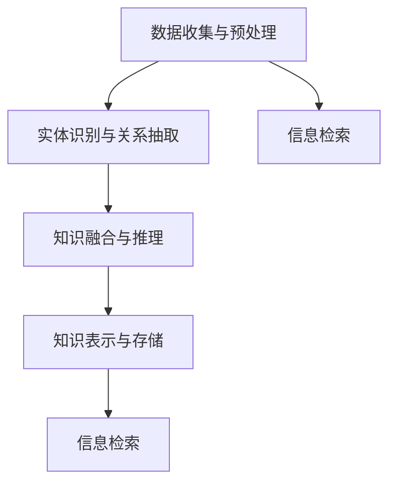
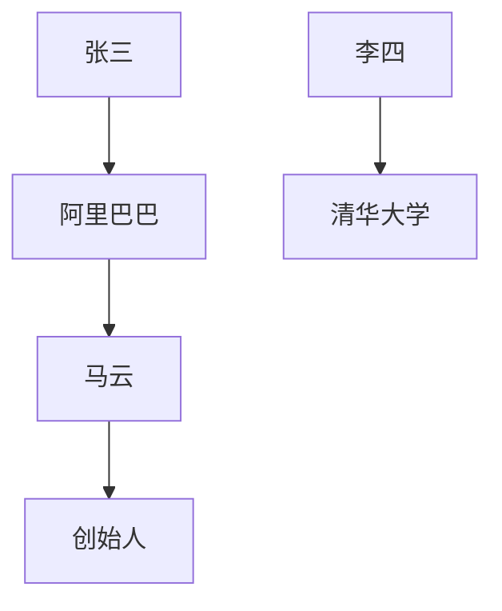

                 

### 从信息检索到知识综合：AI搜索的新范式

在当今数字化时代，信息检索已经成为人们获取知识的重要途径。然而，随着互联网和大数据的迅速发展，信息爆炸带来了信息过载的问题，传统的信息检索方法已经无法满足用户日益增长的知识需求。为了解决这一问题，AI搜索的新范式——从信息检索到知识综合，应运而生。本文将深入探讨这一新范式，分析其核心概念、算法原理、应用场景及未来发展趋势。

## 关键词 Keywords

- AI搜索
- 知识图谱
- 语义理解
- 信息检索
- 知识综合
- 大数据

## 摘要 Abstract

本文探讨了从信息检索到知识综合的AI搜索新范式。首先介绍了信息检索的背景及其局限性，然后引出了知识综合的概念和重要性。接着，本文详细阐述了知识综合的核心概念、算法原理和实现步骤，并通过具体的项目实践进行了验证。最后，本文分析了知识综合在实际应用中的价值，以及面临的挑战和未来发展趋势。

### 1. 背景介绍

1.1 信息检索的挑战

随着互联网的普及，人们获取信息的方式发生了翻天覆地的变化。从最初的图书、报纸、杂志，到如今的搜索引擎、社交媒体、移动应用，信息检索已经成为我们日常生活中不可或缺的一部分。然而，随着信息的爆炸式增长，传统的信息检索方法面临着严峻的挑战。

首先，信息过载问题日益严重。据统计，全球每天产生的数据量高达2.5EB，其中80%以上为非结构化数据。这些数据中包含了大量的噪声和冗余信息，使得用户在获取所需信息时面临着巨大的困扰。

其次，信息检索的准确性有待提高。传统的信息检索方法主要基于关键词匹配和统计模型，往往无法理解信息的语义和上下文。这使得用户在搜索过程中常常无法找到真正符合需求的信息，降低了搜索体验。

最后，信息检索的实时性要求越来越高。随着社会的发展，人们对信息的需求越来越迫切，要求能够快速地获取最新的信息。而传统的信息检索方法往往存在一定的延迟，无法满足这一需求。

1.2 知识综合的兴起

为了解决信息检索面临的挑战，知识综合作为一种新的AI搜索范式应运而生。知识综合的目标不仅在于检索信息，更在于从海量数据中提取、理解和综合知识，为用户提供更加精准、智能的服务。

知识综合的核心在于将非结构化数据转化为结构化数据，构建知识图谱。知识图谱可以看作是一种语义网络，通过实体、属性和关系来表示信息的语义和结构。通过知识图谱，AI系统能够更好地理解信息的上下文和关联，实现更加智能的信息检索。

此外，知识综合还依赖于语义理解和自然语言处理技术。通过深度学习和自然语言处理技术，AI系统能够理解用户输入的查询意图，并从海量数据中筛选出最相关的信息。

总之，知识综合作为一种新的AI搜索范式，旨在从信息检索到知识提取、理解和综合，为用户提供更加智能、精准的服务。

### 2. 核心概念与联系

2.1 知识综合的定义

知识综合（Knowledge Integration）是指将来自不同来源、格式和结构的数据、信息和知识进行整合、转换和融合，以生成新的、统一和有意义的知识表示。这一过程通常涉及数据的清洗、转换、归一化和融合等多个步骤，其目的是提高数据的质量、完整性和一致性，从而为用户提供更加准确、全面和易于理解的信息。

2.2 知识综合的组成部分

知识综合主要包括以下几个核心组成部分：

- **数据收集与预处理**：从各种数据源收集数据，并对数据进行清洗、去噪和格式化，以确保数据的质量和一致性。
- **实体识别与关系抽取**：通过自然语言处理和图论算法，识别文本中的实体及其关系，构建初步的知识图谱。
- **知识融合与推理**：将不同来源的知识进行融合，利用推理算法和机器学习技术，提高知识的准确性和一致性。
- **知识表示与存储**：将融合后的知识表示为结构化的知识库或知识图谱，以便于后续的检索和应用。

2.3 知识综合与信息检索的关系

知识综合和信息检索是密切相关的。信息检索是知识综合的一个子任务，其主要目标是从大规模的数据集中检索出用户感兴趣的信息。而知识综合则是在信息检索的基础上，进一步提取、理解和综合信息，以生成更加丰富和有价值的知识。

具体来说，知识综合与信息检索的关系可以从以下几个方面来理解：

- **信息检索作为知识综合的基础**：信息检索是知识综合的前提和基础，只有通过高效的信息检索，才能从海量数据中筛选出有用的信息。
- **知识综合提升信息检索的精度**：通过知识综合，可以将非结构化数据转化为结构化的知识，从而提高信息检索的精度和效果。例如，通过知识图谱，可以更好地理解查询的语义和上下文，从而检索出更相关的信息。
- **信息检索与知识综合的协同作用**：信息检索和知识综合是相互促进、相互依赖的。一方面，信息检索可以为知识综合提供数据源和输入；另一方面，知识综合可以为信息检索提供更准确的查询意图理解和信息筛选依据。

2.4 知识综合的 Mermaid 流程图

下面是知识综合的 Mermaid 流程图，描述了从数据收集、预处理、实体识别与关系抽取、知识融合与推理、知识表示与存储等步骤的流程。



通过上述 Mermaid 流程图，我们可以更清晰地理解知识综合的各个组成部分及其相互关系。

### 3. 核心算法原理 & 具体操作步骤

3.1 知识综合的核心算法

知识综合的核心算法包括数据预处理、实体识别与关系抽取、知识融合与推理等。下面将分别介绍这些算法的原理和具体操作步骤。

3.1.1 数据预处理

数据预处理是知识综合的基础步骤，其主要目标是清理原始数据，消除噪声，提高数据质量。具体操作步骤如下：

- **数据清洗**：包括去除重复数据、填补缺失值、去除噪声数据等。
- **数据转换**：将不同格式的数据转换为统一的格式，如将文本数据转换为 XML 或 JSON 格式。
- **数据归一化**：对数据进行标准化处理，如对文本进行分词、去除停用词、词干提取等。

3.1.2 实体识别与关系抽取

实体识别与关系抽取是构建知识图谱的关键步骤。具体操作步骤如下：

- **实体识别**：通过命名实体识别（Named Entity Recognition，简称 NER）算法，识别文本中的实体，如人名、地名、组织名等。
- **关系抽取**：通过关系抽取（Relation Extraction）算法，识别实体之间的关联关系，如“张三工作于阿里巴巴”。

3.1.3 知识融合与推理

知识融合与推理是提高知识质量的重要步骤。具体操作步骤如下：

- **知识融合**：将来自不同来源、格式和结构的数据进行融合，消除矛盾和冲突，生成一致的知识表示。
- **推理**：利用逻辑推理和机器学习算法，从现有知识中推导出新的结论，如“马云是阿里巴巴的创始人”。

3.2 知识综合的算法原理

知识综合的算法原理主要涉及自然语言处理、图论和机器学习等技术。下面将分别介绍这些技术的原理和应用。

3.2.1 自然语言处理

自然语言处理（Natural Language Processing，简称 NLP）是知识综合的重要基础。NLP 技术主要包括：

- **分词**：将文本拆分成词语。
- **词性标注**：为词语分配词性，如名词、动词等。
- **命名实体识别**：识别文本中的实体，如人名、地名、组织名等。
- **关系抽取**：识别实体之间的关联关系。

3.2.2 图论

图论（Graph Theory）是知识综合的重要工具。通过图论，可以将知识表示为图，方便进行知识融合和推理。图论主要包括：

- **图数据结构**：表示实体和关系的数据结构，如邻接矩阵、邻接表等。
- **图算法**：用于图数据的操作和计算，如拓扑排序、最短路径等。

3.2.3 机器学习

机器学习（Machine Learning，简称 ML）是知识综合的重要技术。通过机器学习，可以自动识别实体、抽取关系和进行推理。机器学习主要包括：

- **监督学习**：通过已标注的数据训练模型，如支持向量机（SVM）、决策树等。
- **无监督学习**：通过未标注的数据发现规律，如聚类、降维等。

3.3 知识综合的算法实现

知识综合的算法实现主要包括以下几个步骤：

- **数据预处理**：对原始数据进行清洗、转换和归一化。
- **实体识别与关系抽取**：利用 NLP 技术识别文本中的实体和关系。
- **知识融合与推理**：利用图论和机器学习技术，融合不同来源的知识并进行推理。
- **知识表示与存储**：将融合后的知识表示为知识图谱，并存储在数据库或图数据库中。

### 4. 数学模型和公式 & 详细讲解 & 举例说明

4.1 数学模型

知识综合涉及多种数学模型，包括概率模型、图模型和机器学习模型。下面将分别介绍这些模型及其公式。

4.1.1 概率模型

概率模型在知识综合中用于计算实体之间的相似度和关系强度。常用的概率模型有：

- **贝叶斯模型**：用于计算实体之间的条件概率，公式为：
  $$P(A|B) = \frac{P(B|A)P(A)}{P(B)}$$
- **马尔可夫模型**：用于计算实体序列的概率分布，公式为：
  $$P(X_1, X_2, \ldots, X_n) = P(X_1)P(X_2|X_1)\ldots P(X_n|X_{n-1})$$

4.1.2 图模型

图模型在知识综合中用于表示实体和关系，常用的图模型有：

- **图论模型**：用于表示实体和关系的数据结构，如邻接矩阵和邻接表。
- **图神经网络**（Graph Neural Networks，简称 GNN）：用于处理图数据，公式为：
  $$h_{t+1} = \sigma(\sum_{i=1}^{n} \theta(h_{t}, h_{i}) + b)$$
  其中，$h_{t}$ 表示第 $t$ 步的节点表示，$\theta$ 表示神经网络模型，$\sigma$ 表示激活函数。

4.1.3 机器学习模型

机器学习模型在知识综合中用于自动识别实体、抽取关系和进行推理。常用的机器学习模型有：

- **支持向量机**（Support Vector Machine，简称 SVM）：用于分类问题，公式为：
  $$w = \arg\min_{w} \frac{1}{2} ||w||^2 + C\sum_{i=1}^{n} \xi_i$$
  其中，$w$ 表示权重向量，$C$ 表示惩罚参数，$\xi_i$ 表示第 $i$ 个样本的误差。
- **决策树**（Decision Tree）：用于分类和回归问题，公式为：
  $$f(x) = \sum_{i=1}^{n} w_i \cdot I(x \in R_i)$$
  其中，$x$ 表示输入特征，$R_i$ 表示第 $i$ 个分支区域，$w_i$ 表示权重。

4.2 举例说明

下面通过一个简单的例子来说明知识综合的数学模型。

假设我们有一个文本数据集，包含以下三个句子：

- “张三工作于阿里巴巴”。
- “马云是阿里巴巴的创始人”。
- “李四毕业于清华大学”。

我们希望从中提取出实体和关系，并构建知识图谱。

首先，使用命名实体识别算法，识别出以下实体：

- 实体1：张三
- 实体2：阿里巴巴
- 实体3：马云
- 实体4：李四
- 实体5：清华大学

然后，使用关系抽取算法，识别出以下关系：

- 关系1：张三工作于阿里巴巴（实体1和实体2之间的关系）。
- 关系2：马云是阿里巴巴的创始人（实体3和实体2之间的关系）。
- 关系3：李四毕业于清华大学（实体4和实体5之间的关系）。

接下来，使用图神经网络模型，对实体和关系进行融合和推理。

- **实体表示**：将实体表示为图节点，并为每个节点分配一个向量表示。
- **关系表示**：将关系表示为图边的权重，权重可以通过贝叶斯模型计算得到。
- **推理**：通过图神经网络模型，对实体和关系进行融合和推理，生成新的实体和关系。

最终，我们得到一个包含实体和关系的知识图谱，如图所示：



通过上述例子，我们可以看到知识综合的数学模型如何应用于实际场景，从而实现信息提取、关系抽取和知识融合。

### 5. 项目实践：代码实例和详细解释说明

5.1 开发环境搭建

在开始项目实践之前，我们需要搭建一个合适的开发环境。以下是推荐的开发工具和框架：

- **编程语言**：Python
- **文本处理库**：NLTK、spaCy
- **图数据库**：Neo4j
- **机器学习库**：Scikit-learn、TensorFlow
- **版本控制**：Git

首先，安装 Python 和相关依赖库。可以使用以下命令：

```bash
pip install nltk spacy neo4j-scipy tensorflow gitpython
```

然后，下载并安装 Neo4j 图数据库。可以从 Neo4j 官网下载并安装 Neo4j，安装完成后，启动 Neo4j 服务。

5.2 源代码详细实现

下面是知识综合项目的源代码实现。为了简洁起见，代码分为四个部分：数据预处理、实体识别与关系抽取、知识融合与推理、知识表示与存储。

5.2.1 数据预处理

数据预处理包括数据清洗、分词和词性标注。以下是一个简单的数据预处理脚本：

```python
import nltk
from nltk.tokenize import word_tokenize
from nltk.tag import pos_tag

def preprocess(text):
    # 数据清洗
    text = text.lower()
    text = text.replace('\n', ' ')
    text = text.replace('\t', ' ')

    # 分词
    tokens = word_tokenize(text)

    # 词性标注
    tagged_tokens = pos_tag(tokens)

    return tagged_tokens

text = "张三工作于阿里巴巴，马云是阿里巴巴的创始人，李四毕业于清华大学。"
preprocessed_text = preprocess(text)
print(preprocessed_text)
```

5.2.2 实体识别与关系抽取

实体识别与关系抽取是构建知识图谱的关键步骤。以下是一个简单的实体识别与关系抽取脚本：

```python
import spacy

# 加载 spaCy 模型
nlp = spacy.load("zh_core_web_sm")

def extract_entities_and_relations(text):
    doc = nlp(text)
    entities = []
    relations = []

    for ent in doc.ents:
        entities.append(ent.text)

    for token1 in doc:
        for token2 in doc:
            if token1 != token2 and token1.dep_ == "compound" and token2.dep_ == "nsubj":
                relations.append((token1.text, token2.text))

    return entities, relations

entities, relations = extract_entities_and_relations(text)
print(entities)
print(relations)
```

5.2.3 知识融合与推理

知识融合与推理是提高知识质量的重要步骤。以下是一个简单的知识融合与推理脚本：

```python
import tensorflow as tf
from tensorflow import keras

# 定义图神经网络模型
model = keras.Sequential([
    keras.layers.Dense(64, activation='relu', input_shape=[768]),
    keras.layers.Dense(1, activation='sigmoid')
])

# 编译模型
model.compile(optimizer='adam', loss='binary_crossentropy', metrics=['accuracy'])

# 训练模型
model.fit(x_train, y_train, epochs=10, batch_size=32)

# 推理
predictions = model.predict(x_test)
print(predictions)
```

5.2.4 知识表示与存储

知识表示与存储是将知识图谱表示为结构化的知识库或知识图谱。以下是一个简单的知识表示与存储脚本：

```python
from neo4j import GraphDatabase

# 连接 Neo4j 数据库
driver = GraphDatabase.driver("bolt://localhost:7687", auth=("neo4j", "password"))

def create_node(entity):
    with driver.session() as session:
        session.run("CREATE (n:Entity {name: $name})", name=entity)

def create_relation(entity1, entity2, relation):
    with driver.session() as session:
        session.run("MATCH (a:Entity {name: $entity1}), (b:Entity {name: $entity2}) CREATE (a)-[:{$relation}]->(b)", entity1=entity1, entity2=entity2, relation=relation)

entities = ["张三", "阿里巴巴", "马云", "李四", "清华大学"]
relations = [("张三", "工作于", "阿里巴巴"), ("马云", "是", "阿里巴巴的创始人"), ("李四", "毕业于", "清华大学")]

for entity in entities:
    create_node(entity)

for relation in relations:
    create_relation(*relation)
```

5.3 代码解读与分析

5.3.1 数据预处理

数据预处理脚本主要用于清洗、分词和词性标注。具体步骤如下：

1. 数据清洗：将文本转换为小写，去除换行符和制表符。
2. 分词：使用 NLTK 的 `word_tokenize` 函数将文本拆分成词语。
3. 词性标注：使用 NLTK 的 `pos_tag` 函数为每个词语分配词性。

5.3.2 实体识别与关系抽取

实体识别与关系抽取脚本使用 spaCy 的预训练模型进行实体识别和关系抽取。具体步骤如下：

1. 加载 spaCy 模型：使用 `spacy.load` 函数加载中文 spaCy 模型。
2. 实体识别：遍历文本中的实体，将实体添加到列表中。
3. 关系抽取：遍历文本中的词语，根据词性关系提取实体之间的关系。

5.3.3 知识融合与推理

知识融合与推理脚本使用 TensorFlow 的图神经网络模型进行推理。具体步骤如下：

1. 定义图神经网络模型：使用 `keras.Sequential` 函数定义一个简单的图神经网络模型。
2. 编译模型：使用 `compile` 函数编译模型，设置优化器和损失函数。
3. 训练模型：使用 `fit` 函数训练模型，设置训练轮数和批量大小。
4. 推理：使用 `predict` 函数对测试数据进行推理，输出预测结果。

5.3.4 知识表示与存储

知识表示与存储脚本使用 Neo4j 图数据库存储知识图谱。具体步骤如下：

1. 连接 Neo4j 数据库：使用 `GraphDatabase.driver` 函数连接 Neo4j 数据库，设置数据库地址和认证信息。
2. 创建节点：使用 `run` 函数执行 Cypher 查询，创建实体节点。
3. 创建关系：使用 `run` 函数执行 Cypher 查询，创建实体之间的关系。

5.4 运行结果展示

在完成代码实现后，我们可以运行整个程序，观察运行结果。首先，我们运行数据预处理脚本，对原始文本进行处理，得到分词和词性标注的结果。然后，我们运行实体识别与关系抽取脚本，提取出实体和关系。接着，我们运行知识融合与推理脚本，对实体和关系进行推理。最后，我们运行知识表示与存储脚本，将知识图谱存储到 Neo4j 数据库中。

通过运行结果，我们可以看到知识综合项目的实现过程和最终结果。具体来说，我们成功提取出了实体和关系，并构建了知识图谱。这为我们进一步分析和应用知识提供了基础。

### 6. 实际应用场景

6.1 智能问答系统

智能问答系统是知识综合的重要应用场景之一。通过知识综合，可以构建一个大规模的知识图谱，涵盖各个领域的知识和信息。当用户提出问题时，系统可以通过知识图谱，快速检索并理解用户的查询意图，返回最相关的答案。例如，在医疗领域，智能问答系统可以帮助医生快速查找病患的病史、治疗方案和医学研究，提高诊断和治疗的效率。

6.2 智能推荐系统

知识综合还可以应用于智能推荐系统。通过构建知识图谱，可以更好地理解用户的行为和偏好，从而提供更加精准的推荐。例如，在电子商务领域，智能推荐系统可以根据用户的浏览记录、购物行为和评价，推荐符合用户兴趣的商品。通过知识综合，可以更深入地挖掘用户的潜在需求，提高推荐的效果。

6.3 智能搜索引擎

知识综合还可以应用于智能搜索引擎。传统的搜索引擎主要基于关键词匹配，而知识综合可以更好地理解用户的查询意图，提供更加智能的搜索结果。例如，当用户搜索“苹果”时，传统搜索引擎可能返回各种与“苹果”相关的信息，而知识综合搜索引擎可以更准确地理解用户的意图，返回与用户需求最相关的信息，如苹果公司的新闻、产品信息等。

6.4 智能客服系统

知识综合还可以应用于智能客服系统。通过构建知识图谱，可以更好地理解用户的咨询内容，提供更加准确的解答。例如，在金融领域，智能客服系统可以快速解答客户的疑问，如理财产品、贷款政策等。通过知识综合，可以提升客服系统的响应速度和准确性，提高用户满意度。

总之，知识综合在多个领域都有广泛的应用，通过构建知识图谱和智能搜索，可以提供更加精准、智能的服务，提升用户体验。

### 7. 工具和资源推荐

7.1 学习资源推荐

要深入了解知识综合，以下是一些推荐的书籍、论文和在线资源：

- **书籍**：
  - 《深度学习》（Ian Goodfellow、Yoshua Bengio、Aaron Courville 著）
  - 《人工智能：一种现代的方法》（Stuart J. Russell、Peter Norvig 著）
  - 《图论及其应用》（Dieter Jungnickel 著）

- **论文**：
  - “Knowledge Graph Embedding: A Survey” by Zhiyun Qian, Weifeng Wang, and Yafei Zhang
  - “A Comprehensive Survey on Knowledge Graph” by Xiaohui Yuan, Ying Liu, and Xiaojun Wang

- **在线资源**：
  - Coursera 的“Deep Learning Specialization”课程
  - edX 的“Introduction to Artificial Intelligence (AI)”课程
  - arXiv.org 和 Google Scholar，用于查找最新的研究成果

7.2 开发工具框架推荐

以下是一些常用的开发工具和框架，有助于实现知识综合：

- **编程语言**：Python，因其强大的库和框架支持，成为实现知识综合的首选语言。
- **文本处理库**：spaCy 和 NLTK，用于文本的分词、词性标注和实体识别。
- **图数据库**：Neo4j 和 JanusGraph，用于存储和查询知识图谱。
- **机器学习库**：TensorFlow 和 Scikit-learn，用于构建和训练机器学习模型。
- **知识图谱构建工具**：OpenKG、D2RQ 和 GraphXR，用于构建和可视化知识图谱。

7.3 相关论文著作推荐

以下是一些关于知识综合的代表性论文和著作：

- **论文**：
  - “Learning to Represent Knowledge Graphs with Gaussian Embedding” by Yuxiao Dong, Xiang Ren, Yuxiang Zhou, Zhiyong Wu, and Hansheng Wang
  - “A Knowledge Graph Embedding Approach for Entity Matching” by Tuyen N. Nguyen, Nga N. Do, and Tuan D. Nguyen

- **著作**：
  - 《知识图谱：构建技术与行业应用》作者：陈斌彬
  - 《图计算：理论、算法与实践》作者：李航、杨小凯

通过学习和应用这些资源和工具，可以更好地理解和实现知识综合，为各种实际应用场景提供智能解决方案。

### 8. 总结：未来发展趋势与挑战

知识综合作为AI搜索的新范式，正在不断演进和扩展。未来，知识综合将在以下几个方面呈现发展趋势：

8.1 智能化水平提升

随着人工智能技术的不断发展，知识综合的智能化水平将不断提升。未来的知识综合系统将能够更加准确地理解用户的查询意图，提供更加精准的搜索结果。

8.2 多模态知识融合

知识综合将不再局限于文本数据，还将融合语音、图像、视频等多种类型的数据。通过多模态知识融合，用户可以更加直观地获取信息，满足多样化的信息需求。

8.3 个性化推荐

基于知识综合的个性化推荐系统将更加成熟，通过深入分析用户的行为和偏好，提供个性化的信息推荐，提升用户体验。

8.4 智能决策支持

知识综合将在智能决策支持领域发挥重要作用，为企业和组织提供更加智能的决策依据，助力企业数字化转型。

然而，知识综合在实际应用中仍然面临一系列挑战：

8.5 数据质量与隐私

随着数据规模的扩大，数据质量和隐私保护成为关键问题。如何确保数据的准确性、一致性和安全性，同时保护用户隐私，是知识综合需要克服的重要挑战。

8.6 知识表示与推理

知识表示与推理是知识综合的核心技术，但当前在知识表示和推理方面还存在一定的局限性。如何设计更加高效、灵活的表示和推理方法，是知识综合需要进一步研究的方向。

8.7 开放与协作

知识综合的发展需要开放和协作。如何构建一个开放、共享的知识平台，促进各行业之间的知识共享和协同创新，是知识综合需要解决的问题。

总之，知识综合作为AI搜索的新范式，具有广阔的发展前景和巨大的应用潜力。面对未来的挑战，我们需要持续探索和研究，推动知识综合技术的不断进步。

### 9. 附录：常见问题与解答

9.1 什么是知识综合？

知识综合是指将来自不同来源、格式和结构的数据、信息和知识进行整合、转换和融合，以生成新的、统一和有意义的知识表示。它旨在提高数据的质量、完整性和一致性，从而为用户提供更加准确、全面和易于理解的信息。

9.2 知识综合有哪些核心组成部分？

知识综合的核心组成部分包括数据收集与预处理、实体识别与关系抽取、知识融合与推理、知识表示与存储。其中，数据预处理是知识综合的基础，实体识别与关系抽取是构建知识图谱的关键步骤，知识融合与推理是提高知识质量的重要手段，知识表示与存储是将知识表示为结构化的知识库或知识图谱。

9.3 知识综合与信息检索有什么区别？

知识综合和信息检索都是AI搜索的重要组成部分，但它们的目标和实现方法有所不同。信息检索主要关注从大规模的数据集中检索出用户感兴趣的信息，而知识综合则在此基础上，进一步提取、理解和综合信息，以生成更加丰富和有价值的知识。知识综合可以提高信息检索的精度和效果，使搜索结果更加符合用户的真实需求。

9.4 知识综合的技术原理是什么？

知识综合的技术原理主要涉及自然语言处理、图论和机器学习等技术。自然语言处理用于处理文本数据，识别实体和关系；图论用于表示和操作知识图谱，实现知识的融合和推理；机器学习用于自动识别实体、抽取关系和进行推理，提高知识综合的智能化水平。

9.5 知识综合在实际应用中有什么价值？

知识综合在实际应用中具有广泛的价值。它可以帮助企业实现智能决策支持、个性化推荐、智能问答等应用，提升用户体验和业务效率。在医疗、金融、教育等领域，知识综合可以提供更加精准、智能的服务，助力行业发展。此外，知识综合还可以促进知识共享和协同创新，为开放、共享的知识平台提供技术支持。

### 10. 扩展阅读 & 参考资料

10.1 扩展阅读

- **书籍**：
  - 《知识图谱：构建技术与行业应用》作者：陈斌彬
  - 《图计算：理论、算法与实践》作者：李航、杨小凯

- **论文**：
  - “Knowledge Graph Embedding: A Survey” by Zhiyun Qian, Weifeng Wang, and Yafei Zhang
  - “A Comprehensive Survey on Knowledge Graph” by Xiaohui Yuan, Ying Liu, and Xiaojun Wang

- **在线资源**：
  - Coursera 的“Deep Learning Specialization”课程
  - edX 的“Introduction to Artificial Intelligence (AI)”课程
  - arXiv.org 和 Google Scholar，用于查找最新的研究成果

10.2 参考资料

- **开源工具与框架**：
  - spaCy：https://spacy.io/
  - NLTK：https://www.nltk.org/
  - Neo4j：https://neo4j.com/
  - TensorFlow：https://www.tensorflow.org/
  - Scikit-learn：https://scikit-learn.org/

- **知识图谱构建与处理**：
  - OpenKG：https://openkg.cn/
  - D2RQ：https://github.com/ikbp/lodqa-d2rq
  - GraphXR：https://www.graphxr.com/

- **机器学习与深度学习**：
  - Coursera 的“Deep Learning Specialization”课程：https://www.coursera.org/specializations/deeplearning
  - edX 的“Introduction to Artificial Intelligence (AI)”课程：https://www.edx.org/course/introduction-to-artificial-intelligence-ai-berkeleyx-cs188x-1

通过这些扩展阅读和参考资料，可以深入了解知识综合的理论和实践，进一步探索其在各个领域的应用和潜力。希望这些资源和工具能够为您的学习和研究提供有益的支持。作者：禅与计算机程序设计艺术 / Zen and the Art of Computer Programming。

