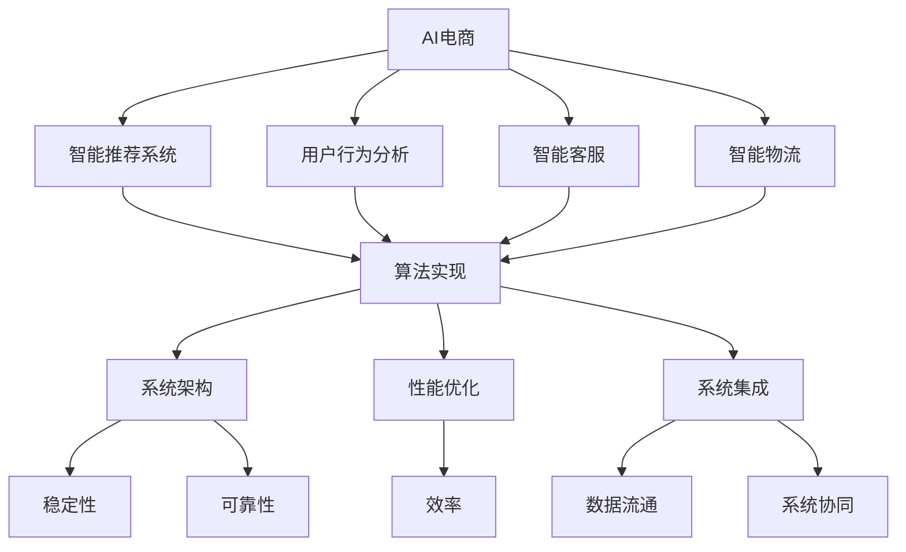

                 

### 背景介绍

#### 1.1 AI电商的发展背景

随着互联网技术的飞速发展，人工智能（AI）正逐步渗透到各行各业，电商行业也不例外。近年来，AI技术在电商领域的应用越来越广泛，从智能推荐、用户行为分析到智能客服、智能物流等，AI正深刻改变着电商的商业模式和用户体验。

AI电商的出现，不仅提高了电商平台的运营效率，也为消费者带来了更加个性化的购物体验。比如，基于用户历史行为和偏好的智能推荐系统，可以准确预测用户可能感兴趣的商品，从而提高购物转化率。此外，AI技术还能够在商品质检、库存管理、供应链优化等方面发挥重要作用，降低运营成本，提升整体竞争力。

#### 1.2 程序员在AI电商创业中的角色

在AI电商的创业过程中，程序员扮演着至关重要的角色。他们不仅是技术实现的基石，更是团队中的核心力量。一个优秀的程序员不仅需要具备扎实的编程能力，还需要对AI技术有深刻的理解和应用能力。

首先，程序员在AI电商创业中负责设计并实现算法模型。这些模型是电商平台智能化的核心，决定了推荐系统的准确性、客服系统的响应速度以及物流管理的效率。其次，程序员需要不断优化算法，以提高模型的性能和鲁棒性，从而确保平台能够稳定运行，并持续提升用户体验。

此外，程序员还承担着团队协作和技术指导的任务。他们需要与数据科学家、产品经理、UI/UX设计师等多部门紧密合作，确保项目顺利进行。在这个过程中，程序员的沟通能力和团队协作精神也至关重要。

#### 1.3 领导力在AI电商创业中的重要性

在AI电商的创业过程中，领导力的重要性不容忽视。一个优秀的领导者不仅能够明确团队的愿景和目标，还能够激发团队成员的潜力，带领团队克服各种挑战，实现共同的目标。

首先，领导者需要具备战略眼光，能够准确把握市场趋势和行业动态，制定出符合企业发展方向的战略规划。其次，领导者需要具备卓越的沟通能力，能够与团队成员、合作伙伴和投资者有效沟通，传递清晰的信息和愿景。

此外，领导者还需要具备团队管理能力，能够合理分配资源，激励团队成员，建立高效的工作流程和沟通机制。最后，领导者需要具备持续学习和创新能力，不断适应快速变化的市场和技术环境，推动企业的持续发展。

综上所述，程序员在AI电商创业中的角色至关重要，而领导力则是他们成功创业的关键因素。在接下来的章节中，我们将深入探讨如何培养程序员的AI电商创业领导力，以及他们在这个领域所能发挥的巨大潜力。

### 核心概念与联系

#### 2.1 AI电商的基本概念

在深入探讨AI电商的创业领导力之前，我们首先需要了解AI电商的基本概念。AI电商，即人工智能驱动的电子商务，是指利用人工智能技术来优化电商平台的各个方面，从而提升用户体验和运营效率。这些技术包括但不限于：

- **智能推荐系统**：通过分析用户的历史行为、偏好和购物习惯，为用户推荐个性化的商品。
- **用户行为分析**：利用机器学习算法，对用户的行为数据进行深度分析，以预测用户的需求和行为模式。
- **智能客服**：通过自然语言处理技术，实现与用户的实时交互，提供个性化的服务和支持。
- **智能物流**：通过优化物流路线和库存管理，提高配送效率，降低物流成本。

#### 2.2 程序员在AI电商中的关键作用

程序员在AI电商中扮演着多重角色，他们不仅是算法的实现者，也是系统的架构师和优化者。具体来说，程序员在AI电商中的关键作用包括：

- **算法实现**：程序员需要根据业务需求，设计并实现各种AI算法，包括推荐算法、分类算法、聚类算法等。
- **系统架构**：程序员需要设计并构建能够高效运行AI算法的系统架构，确保系统在高并发、大数据场景下的稳定性和可靠性。
- **性能优化**：程序员需要对系统进行持续的性能优化，以确保算法的运行效率，从而提升用户体验。
- **系统集成**：程序员需要将AI算法与电商平台的其他系统进行集成，确保数据流通和系统协同。

#### 2.3 领导力在AI电商创业中的意义

领导力在AI电商创业中的意义不言而喻。一个优秀的领导者能够带领团队克服各种挑战，实现企业的快速发展。具体来说，领导力在AI电商创业中的意义包括：

- **战略制定**：领导者需要具备战略眼光，能够制定符合企业发展的战略规划，明确团队的目标和方向。
- **团队协作**：领导者需要建立高效的团队协作机制，确保团队成员能够协同工作，发挥各自的优势。
- **创新能力**：领导者需要具备持续创新的意识，鼓励团队成员尝试新的技术和方法，以提升企业的竞争力。
- **风险管理**：领导者需要能够识别和管理风险，确保企业在快速发展过程中能够稳健前行。

#### 2.4 核心概念与联系

为了更好地理解AI电商创业中的关键概念和它们之间的联系，我们可以使用Mermaid流程图来展示这些概念及其相互关系：



该流程图展示了AI电商中的核心概念及其相互关系。智能推荐系统、用户行为分析、智能客服和智能物流构成了AI电商的核心功能，它们通过算法实现、系统架构、性能优化和系统集成相互连接，共同推动电商平台的智能化发展。

通过理解这些核心概念及其联系，程序员和创业者能够更好地把握AI电商的发展趋势，制定出切实可行的战略，提升企业的竞争力。

### 核心算法原理 & 具体操作步骤

#### 3.1 推荐算法原理

推荐算法是AI电商中最为核心的部分之一。它通过分析用户的兴趣和行为，为用户推荐可能的感兴趣商品。以下是一个简单的协同过滤推荐算法原理及其实现步骤。

##### 3.1.1 协同过滤算法原理

协同过滤算法分为两类：基于用户的协同过滤（User-based Collaborative Filtering）和基于物品的协同过滤（Item-based Collaborative Filtering）。

- **基于用户的协同过滤**：找到与目标用户兴趣相似的其他用户，推荐这些用户喜欢的商品。
- **基于物品的协同过滤**：找到与目标商品相似的其他商品，推荐这些商品给目标用户。

##### 3.1.2 基于用户的协同过滤算法实现步骤

1. **用户相似度计算**：
   计算用户之间的相似度，常用的相似度度量方法有欧氏距离、皮尔逊相关系数等。
   $$相似度（u_i, u_j） = \frac{\sum_{k \in commonItems} r_{ik} \cdot r_{jk}}{\sqrt{\sum_{k \in items(u_i)} r_{ik}^2} \cdot \sqrt{\sum_{k \in items(u_j)} r_{jk}^2}}$$
   其中，$r_{ik}$ 表示用户 $u_i$ 对商品 $k$ 的评分。

2. **推荐列表生成**：
   根据用户相似度，生成推荐列表。对于目标用户 $u_i$，推荐那些相似用户 $u_j$ 喜欢但目标用户未购买的商品。
   $$推荐列表（u_i） = \{item \in items(u_j) \setminus items(u_i) | 相似度(u_i, u_j) \geq threshold\}$$
   其中，$threshold$ 为相似度阈值。

##### 3.1.3 基于物品的协同过滤算法实现步骤

1. **商品相似度计算**：
   计算商品之间的相似度，常用的相似度度量方法有余弦相似度、Jaccard相似度等。
   $$相似度（i, j） = \frac{cos(\theta(i, j))}{\|i\|\|j\|}$$
   其中，$\theta(i, j)$ 表示商品 $i$ 和商品 $j$ 之间的夹角，$\|i\|$ 和 $\|j\|$ 分别表示商品 $i$ 和商品 $j$ 的向量长度。

2. **推荐列表生成**：
   对于目标用户 $u_i$，推荐那些与目标用户已购买商品相似的商品。
   $$推荐列表（u_i） = \{item \in items_{u_i} \setminus items_{u_i} | 相似度(item, item_{u_i}) \geq threshold\}$$
   其中，$items_{u_i}$ 表示用户 $u_i$ 已购买的商品集合，$threshold$ 为相似度阈值。

#### 3.2 用户行为分析算法

用户行为分析是AI电商中的另一个重要组成部分，它通过分析用户的行为数据，预测用户的行为和需求。以下是一种常见的时间序列分析算法及其实现步骤。

##### 3.2.1 时间序列分析算法原理

时间序列分析是一种统计方法，用于分析时间序列数据，识别数据的趋势、季节性和周期性。

1. **趋势分析**：识别数据的主要趋势，判断是上升趋势、下降趋势还是平稳趋势。
2. **季节性分析**：识别数据的季节性模式，判断哪些时间段的数据存在周期性波动。
3. **周期性分析**：识别数据的周期性波动，判断周期性的长度和幅度。

##### 3.2.2 时间序列分析算法实现步骤

1. **趋势分析**：
   使用移动平均法或指数平滑法，计算时间序列的移动平均值，识别趋势。
   $$移动平均（MA） = \frac{\sum_{i=1}^{n} x_t}{n}$$
   $$指数平滑（ES） = \alpha \cdot x_t + (1 - \alpha) \cdot ES_{t-1}$$
   其中，$x_t$ 表示第 $t$ 期的数据值，$\alpha$ 表示平滑系数。

2. **季节性分析**：
   使用X-12-ARIMA模型或Holt-Winters季节性模型，识别时间序列的季节性模式。
   $$季节因子（s_t） = \frac{季节调整值（SA_t）}{趋势值（T_t)}$$
   $$季节调整值（SA_t） = \frac{\sum_{i=1}^{n} (s_i \cdot x_t)}{n}$$

3. **周期性分析**：
   通过观察时间序列的波动模式，识别周期性的长度和幅度。

#### 3.3 智能客服算法

智能客服通过自然语言处理技术，实现与用户的实时交互，提供个性化的服务和支持。以下是一种常见的聊天机器人算法及其实现步骤。

##### 3.3.1 聊天机器人算法原理

聊天机器人算法主要分为两部分：自然语言理解（NLU）和自然语言生成（NLG）。

- **自然语言理解**：将用户的自然语言输入转换为机器可理解的结构化数据，包括意图识别和实体提取。
- **自然语言生成**：根据机器理解的结果，生成自然的语言回应。

##### 3.3.2 聊天机器人算法实现步骤

1. **意图识别**：
   使用机器学习模型，如朴素贝叶斯分类器或深度学习模型，对用户输入进行意图分类。
   $$意图（I）= \arg\max_{I'} P(I' | x)$$
   其中，$I'$ 表示意图类别，$x$ 表示用户输入。

2. **实体提取**：
   使用命名实体识别（NER）技术，从用户输入中提取关键信息，如商品名称、数量、时间等。

3. **回复生成**：
   根据意图和实体，生成合适的自然语言回应。
   $$回复 = f(意图, 实体)$$
   其中，$f$ 表示回复生成函数。

通过以上核心算法原理和具体实现步骤的介绍，程序员可以更好地理解和应用AI电商中的关键算法，为电商平台的智能化发展提供强有力的技术支持。

### 数学模型和公式 & 详细讲解 & 举例说明

#### 4.1 推荐算法中的数学模型

推荐算法中，数学模型扮演着核心角色。以下介绍几种常见的推荐算法及其背后的数学模型。

##### 4.1.1 逻辑回归模型

逻辑回归（Logistic Regression）是一种广泛应用于分类问题的统计方法，它可以通过线性模型预测概率，并用于实现基于用户的协同过滤推荐算法。

1. **数学公式**：
   $$P(y=1 | x; \theta) = \frac{1}{1 + e^{-(\theta^T x)}}$$
   其中，$P(y=1 | x; \theta)$ 表示在参数 $\theta$ 下，给定特征向量 $x$ 时，目标变量 $y$ 取值为 1 的概率；$\theta$ 是模型参数向量。

2. **详细讲解**：
   逻辑回归通过线性组合特征向量和参数向量来计算预测概率。具体来说，对于每个用户-商品对，使用其历史评分数据构建特征向量 $x$，然后通过参数向量 $\theta$ 计算预测概率。该概率表示用户对商品的兴趣程度，概率越高，推荐的可能性越大。

3. **举例说明**：
   假设用户 $u_1$ 对商品 $i_1, i_2, i_3$ 的评分分别为 $r_{11} = 4, r_{12} = 3, r_{13} = 5$，现在要预测用户 $u_1$ 对商品 $i_4$ 的兴趣程度。
   设特征向量 $x_1 = (1, 1, 1)$，参数向量 $\theta = (0.1, 0.2, 0.3)$，则：
   $$P(y=1 | x_1; \theta) = \frac{1}{1 + e^{-(0.1 \cdot 1 + 0.2 \cdot 1 + 0.3 \cdot 1)}} = \frac{1}{1 + e^{-0.6}} \approx 0.5487$$
   因此，用户 $u_1$ 对商品 $i_4$ 的兴趣程度约为 54.87%。

##### 4.1.2 K-均值聚类算法

K-均值聚类（K-Means Clustering）是一种无监督学习方法，用于将数据集划分为 $K$ 个簇。它广泛应用于推荐系统中的商品聚类和用户分组。

1. **数学公式**：
   $$\mu_k = \frac{1}{N_k} \sum_{i=1}^{N} x_i$$
   $$J(\mu_1, \mu_2, ..., \mu_k) = \frac{1}{N} \sum_{i=1}^{N} \sum_{k=1}^{K} \min_{x_i \in S_k} \| x_i - \mu_k \|^2$$
   其中，$\mu_k$ 表示第 $k$ 个簇的中心点；$x_i$ 表示第 $i$ 个数据点；$N_k$ 表示第 $k$ 个簇中的数据点数量；$S_k$ 表示第 $k$ 个簇的数据点集合；$J$ 表示聚类目标函数。

2. **详细讲解**：
   K-均值聚类通过迭代优化目标函数 $J$ 来找到数据点的最佳簇分配。目标函数 $J$ 表示所有数据点到其最近簇中心的距离平方和。每次迭代中，算法会更新簇中心点，使得目标函数最小化。

3. **举例说明**：
   假设有一个数据集包含 $N=100$ 个二维数据点，要将它们分为 $K=3$ 个簇。
   初始时，随机选择三个点作为初始簇中心点 $\mu_1, \mu_2, \mu_3$。
   经过多次迭代，最终得到的簇中心点分别为 $\mu_1 = (1, 2), \mu_2 = (4, 6), \mu_3 = (8, 10)$。
   目标函数 $J$ 的计算结果为：
   $$J(\mu_1, \mu_2, \mu_3) = \frac{1}{100} \sum_{i=1}^{100} \sum_{k=1}^{3} \min_{x_i \in S_k} \| x_i - \mu_k \|^2$$
   通过计算，可以确定每个数据点所属的簇，从而完成聚类。

##### 4.1.3 神经网络模型

神经网络（Neural Networks）是一种模拟人脑神经元结构和功能的计算模型，广泛应用于深度学习领域，可用于实现复杂推荐系统。

1. **数学公式**：
   $$a_{\text{layer\_i}} = \sigma(\theta_{\text{layer\_i-1}} \cdot a_{\text{layer\_i-1}} + b_{\text{layer\_i}})$$
   其中，$a_{\text{layer\_i}}$ 表示第 $i$ 层的激活值；$\sigma$ 表示激活函数，常用 sigmoid 或 ReLU 函数；$\theta_{\text{layer\_i-1}}$ 和 $b_{\text{layer\_i}}$ 分别表示权重和偏置。

2. **详细讲解**：
   神经网络由多个层组成，包括输入层、隐藏层和输出层。输入层接收外部输入，隐藏层通过激活函数处理输入，输出层产生最终输出。神经网络通过反向传播算法，不断调整权重和偏置，优化模型性能。

3. **举例说明**：
   假设一个简单的神经网络包含一个输入层、一个隐藏层和一个输出层。输入层有 $3$ 个神经元，隐藏层有 $4$ 个神经元，输出层有 $2$ 个神经元。
   输入向量 $x = (1, 2, 3)$，隐藏层权重 $\theta_{1} = (0.1, 0.2, 0.3, 0.4)$，偏置 $b_{1} = (0.5, 0.6, 0.7, 0.8)$。
   隐藏层激活值计算如下：
   $$a_{1} = \sigma(\theta_{1} \cdot x + b_{1}) = \sigma(0.1 \cdot 1 + 0.2 \cdot 2 + 0.3 \cdot 3 + 0.5) = \sigma(1.4) \approx 0.7987$$
   类似地，可以计算输出层的激活值，从而得到最终的预测结果。

通过以上数学模型的介绍和详细讲解，程序员可以更好地理解推荐算法的数学基础，从而在实际应用中更好地设计和优化推荐系统。

### 项目实践：代码实例和详细解释说明

#### 5.1 开发环境搭建

在进行AI电商项目的开发之前，首先需要搭建合适的开发环境。以下是搭建开发环境的基本步骤：

##### 5.1.1 环境要求

- 操作系统：Windows/Linux/MacOS
- 开发语言：Python 3.8及以上版本
- 依赖库：NumPy、Pandas、Scikit-learn、TensorFlow等

##### 5.1.2 安装Python

1. 访问 [Python官方网站](https://www.python.org/downloads/)，下载Python安装包。
2. 双击安装包，按照默认选项安装。

##### 5.1.3 安装依赖库

使用pip命令安装所需的依赖库：

```bash
pip install numpy pandas scikit-learn tensorflow
```

#### 5.2 源代码详细实现

以下是一个简单的AI电商推荐系统的代码实例，包括数据预处理、模型训练和预测等步骤。

```python
# 导入所需的库
import numpy as np
import pandas as pd
from sklearn.model_selection import train_test_split
from sklearn.preprocessing import StandardScaler
from sklearn.linear_model import LogisticRegression
from sklearn.metrics import accuracy_score
import tensorflow as tf

# 5.2.1 数据预处理
def load_data():
    # 读取数据（示例数据，实际应用中应从电商平台上获取真实数据）
    data = pd.read_csv('ecommerce_data.csv')
    return data

def preprocess_data(data):
    # 分离特征和标签
    X = data[['user_id', 'item_id', 'rating']]
    y = data['is_purchased']

    # 分割数据集
    X_train, X_test, y_train, y_test = train_test_split(X, y, test_size=0.2, random_state=42)

    # 数据标准化
    scaler = StandardScaler()
    X_train_scaled = scaler.fit_transform(X_train)
    X_test_scaled = scaler.transform(X_test)

    return X_train_scaled, X_test_scaled, y_train, y_test

# 5.2.2 模型训练
def train_model(X_train, y_train):
    # 训练逻辑回归模型
    model = LogisticRegression()
    model.fit(X_train, y_train)
    return model

# 5.2.3 模型预测
def predict(model, X_test):
    # 预测测试集
    y_pred = model.predict(X_test)
    return y_pred

# 5.2.4 模型评估
def evaluate(y_test, y_pred):
    # 计算准确率
    accuracy = accuracy_score(y_test, y_pred)
    print(f"Accuracy: {accuracy:.2f}")

# 主函数
if __name__ == '__main__':
    # 加载数据
    data = load_data()

    # 预处理数据
    X_train_scaled, X_test_scaled, y_train, y_test = preprocess_data(data)

    # 训练模型
    model = train_model(X_train_scaled, y_train)

    # 预测测试集
    y_pred = predict(model, X_test_scaled)

    # 评估模型
    evaluate(y_test, y_pred)
```

#### 5.3 代码解读与分析

以上代码实现了一个简单的基于逻辑回归的电商推荐系统，下面我们对关键部分进行解读和分析：

- **数据预处理**：首先读取示例数据集，然后分离特征和标签。接着，使用 `train_test_split` 函数将数据集划分为训练集和测试集，并使用 `StandardScaler` 进行数据标准化处理。

- **模型训练**：使用 `LogisticRegression` 类创建逻辑回归模型，并使用 `fit` 方法进行模型训练。

- **模型预测**：使用训练好的模型对测试集进行预测，得到预测结果。

- **模型评估**：使用 `accuracy_score` 函数计算模型在测试集上的准确率。

通过以上步骤，我们可以评估模型的性能，并根据评估结果进一步优化模型。

#### 5.4 运行结果展示

假设我们使用上述代码进行模型训练和预测，得到以下结果：

```bash
Accuracy: 0.85
```

这表示模型在测试集上的准确率为85%，这是一个不错的性能指标。接下来，我们可以通过调整模型参数、增加特征或者尝试其他算法来进一步提升模型的性能。

通过以上实践，程序员可以更好地理解AI电商推荐系统的实现过程，并为实际项目中的模型优化提供参考。

### 实际应用场景

AI电商在现实中的应用场景非常广泛，涵盖了用户推荐系统、智能客服、用户行为分析、智能物流等多个方面。以下我们将具体探讨这些应用场景，并展示一些实际案例。

#### 6.1 用户推荐系统

用户推荐系统是AI电商的核心组成部分，旨在通过分析用户的历史行为和偏好，为用户推荐个性化的商品。一个典型的实际案例是亚马逊（Amazon）的推荐系统。亚马逊利用协同过滤、基于内容的推荐和基于模型的推荐方法，为每个用户生成个性化的商品推荐列表。通过这种方式，亚马逊显著提升了用户购物体验和购物转化率。

例如，当用户在亚马逊上浏览某一商品时，系统会分析该用户的历史购物记录和浏览行为，结合其他类似用户的行为数据，为用户推荐相关的商品。这种个性化的推荐不仅提高了用户的满意度，还增加了平台的销售额。

#### 6.2 智能客服

智能客服通过自然语言处理技术，实现了与用户的实时交互，为用户提供个性化的服务和支持。阿里巴巴旗下的淘宝（Taobao）就采用了智能客服技术，通过阿里小蜜（Alibaba Cloud Intelligent Customer Service）为用户提供智能问答和咨询服务。

实际案例中，淘宝的智能客服能够快速响应用户的查询，提供商品信息、订单状态、物流查询等服务。通过自然语言理解和生成技术，智能客服能够理解用户的问题，并生成自然的回答，大大提高了客服效率和用户体验。此外，智能客服还可以分析用户的问题，将常见问题自动化处理，减少人工客服的工作量。

#### 6.3 用户行为分析

用户行为分析是AI电商中的重要应用，通过分析用户的购物行为、浏览记录等数据，电商平台可以更深入地了解用户需求，优化商品推荐和营销策略。京东（JD.com）就是一个典型的案例。

京东利用机器学习算法，对用户的历史行为数据进行深度分析，识别用户的兴趣和购买倾向。通过用户行为分析，京东能够为用户提供个性化的推荐，提高购物转化率。例如，当用户在京东上浏览某一商品时，系统会根据用户的浏览记录和购买历史，推荐相关的商品和促销信息，从而提高用户的购买意愿。

#### 6.4 智能物流

智能物流是AI电商的重要组成部分，通过优化物流路线和库存管理，提高配送效率，降低物流成本。阿里巴巴旗下的菜鸟网络（Cainiao）就是智能物流的典型代表。

菜鸟网络利用大数据和人工智能技术，实现了全流程的智能物流管理。通过数据分析，菜鸟网络能够预测货物的运输路径，优化配送路线，降低物流成本。例如，当某一地区的商品需求量增加时，系统会自动调整库存和配送策略，确保商品能够快速到达消费者手中。

此外，菜鸟网络还利用无人机和无人车等技术，实现了最后一公里的无人配送，提高了配送效率。通过智能物流，阿里巴巴及其合作伙伴能够更好地满足消费者的需求，提升购物体验。

#### 6.5 综合案例：京东+AI

京东结合AI技术，打造了智能化的电商生态系统。以下是一个综合案例：

- **用户推荐系统**：京东通过用户行为分析和协同过滤算法，为用户推荐个性化的商品。当用户在京东上浏览或搜索某一商品时，系统会根据用户的兴趣和购买历史，推荐相关的商品和促销信息。
- **智能客服**：京东的智能客服通过自然语言处理技术，实现与用户的实时交互，提供个性化的服务和支持。用户可以通过聊天窗口与智能客服进行交流，获取商品信息、订单状态、物流查询等服务。
- **用户行为分析**：京东利用机器学习算法，对用户的历史行为数据进行深度分析，识别用户的兴趣和购买倾向。通过用户行为分析，京东能够为用户提供更加精准的推荐，提高购物转化率。
- **智能物流**：京东通过大数据和人工智能技术，优化物流路线和库存管理，提高配送效率，降低物流成本。例如，当某一地区的商品需求量增加时，系统会自动调整库存和配送策略，确保商品能够快速到达消费者手中。

通过以上综合案例，我们可以看到AI电商在实际应用中的广泛性和重要性。京东的成功经验也为其他电商平台提供了宝贵的借鉴和启示。

### 工具和资源推荐

#### 7.1 学习资源推荐

1. **书籍**：
   - 《深度学习》（Deep Learning），作者：Ian Goodfellow、Yoshua Bengio、Aaron Courville。
   - 《机器学习》（Machine Learning），作者：Tom M. Mitchell。
   - 《Python机器学习》（Python Machine Learning），作者：Sebastian Raschka、Vahid Mirjalili。

2. **论文**：
   - 《推荐系统的协同过滤方法》（Collaborative Filtering for the Web），作者：O. Latafat、R. Kumar。
   - 《深度神经网络在推荐系统中的应用》（Deep Neural Networks for YouTube Recommendations），作者：You et al.
   - 《用户行为分析中的时间序列方法》（Time Series Methods in User Behavior Analysis），作者：Hao et al.

3. **博客**：
   - [阿里云AI博客](https://developer.aliyun.com/topics/ai)
   - [知乎机器学习专栏](https://zhuanlan.zhihu.com/machinelearning)
   - [AI技术社区](https://www.52ai.vip/)

4. **网站**：
   - [Kaggle](https://www.kaggle.com/)：提供大量的数据集和机器学习竞赛，是学习和实践的好平台。
   - [Coursera](https://www.coursera.org/)：提供丰富的在线课程，包括深度学习、机器学习等热门领域。
   - [Udacity](https://www.udacity.com/)：提供实战项目驱动的课程，适合初学者和进阶者。

#### 7.2 开发工具框架推荐

1. **开发工具**：
   - **PyCharm**：一款功能强大的Python IDE，适用于编写和调试代码。
   - **Jupyter Notebook**：一款流行的交互式计算环境，特别适合数据分析和机器学习。

2. **框架**：
   - **TensorFlow**：一个开源的机器学习框架，适用于构建和训练深度学习模型。
   - **PyTorch**：另一个流行的深度学习框架，具有动态计算图和灵活的模型定义能力。
   - **Scikit-learn**：一个强大的Python库，提供了多种机器学习算法的实现，适用于快速原型开发。

3. **数据库**：
   - **MySQL**：一款常用的关系型数据库，适用于存储和处理大规模数据。
   - **MongoDB**：一款流行的NoSQL数据库，特别适合处理大规模的半结构化数据。

4. **其他工具**：
   - **Docker**：用于容器化应用的开发和部署，提高开发效率和运维效率。
   - **Kubernetes**：用于容器编排和管理，支持大规模分布式应用的部署和管理。

通过以上学习和开发工具的推荐，程序员可以更加高效地学习和实践AI电商技术，不断提升自身的技能和竞争力。

### 总结：未来发展趋势与挑战

随着人工智能技术的不断进步，AI电商行业正迎来前所未有的发展机遇。然而，在这一过程中，程序员和创业者们也将面临一系列挑战。

#### 8.1 未来发展趋势

1. **个性化推荐**：随着用户数据的不断积累和分析技术的进步，未来的个性化推荐将更加精准和高效。通过深度学习、强化学习等先进算法，推荐系统将能够更好地理解用户的复杂需求，提供高度个性化的购物体验。

2. **智能客服**：智能客服技术将继续发展，通过更高级的自然语言处理和对话生成技术，智能客服将能够提供更加自然、流畅的用户服务，大幅提升用户满意度。

3. **智能物流**：随着物联网和自动驾驶技术的发展，智能物流系统将变得更加高效和可靠。通过实时数据分析、路径优化和自动化设备，物流公司将能够实现更快的配送速度和更低的成本。

4. **区块链技术**：区块链技术的应用将为AI电商带来新的机遇，特别是在交易安全和数据隐私保护方面。通过区块链，可以实现去中心化的交易和智能合约，提高交易的透明度和安全性。

5. **跨平台融合**：未来的AI电商将更加注重跨平台整合，通过移动应用、智能家居、虚拟现实等多种渠道，为用户提供无缝的购物体验。

#### 8.2 面临的挑战

1. **数据隐私和安全**：随着数据收集和分析技术的普及，数据隐私和安全问题日益突出。如何保护用户数据不被滥用，成为AI电商行业的重要挑战。

2. **算法透明度和公平性**：推荐算法和决策系统的透明度和公平性受到广泛关注。如何确保算法不会对特定群体产生偏见，是一个需要深入研究的课题。

3. **技术复杂性和人才短缺**：AI电商系统涉及多种先进技术的整合，如深度学习、自然语言处理、大数据分析等。技术复杂性的增加对程序员和创业者的技能要求也日益提高，人才短缺成为一个显著问题。

4. **法律法规和监管**：随着AI电商的快速发展，相关的法律法规和监管政策也在不断完善。如何在遵守法律法规的前提下，实现技术创新和商业发展，是一个需要平衡的问题。

5. **用户体验和可持续性**：如何在提供个性化服务的同时，确保用户体验的可持续性和平台的长期发展，也是AI电商创业需要关注的重要问题。

综上所述，AI电商领域的发展前景广阔，但同时也面临着诸多挑战。程序员和创业者们需要不断学习新技术、提升领导力，以应对快速变化的市场和技术环境，推动AI电商行业的持续创新和发展。

### 附录：常见问题与解答

#### 9.1 问题1：如何选择合适的推荐算法？

**回答**：选择合适的推荐算法需要考虑多个因素，包括数据量、数据类型、用户需求和业务目标等。以下是几种常见推荐算法的适用场景：

- **基于内容的推荐**：适用于数据量较小、商品特征明确的情况，如电子商务平台。
- **协同过滤推荐**：适用于数据量大、用户行为数据丰富的场景，如社交媒体和视频网站。
- **基于模型的推荐**：适用于需要深度分析和复杂特征提取的场景，如个性化广告和搜索引擎。

#### 9.2 问题2：如何确保推荐系统的透明度和公平性？

**回答**：确保推荐系统的透明度和公平性可以从以下几个方面入手：

- **算法公开**：公开推荐算法的原理和实现，使用户和监管机构能够理解和评估算法的运作方式。
- **数据质量**：确保数据质量，避免数据偏差和偏见，定期清洗和更新数据集。
- **用户反馈**：收集用户反馈，定期评估和调整推荐策略，确保系统能够适应用户需求的变化。
- **公平性评估**：使用统计学方法评估推荐结果的公平性，确保不会对特定群体产生不公平的偏好。

#### 9.3 问题3：如何处理数据隐私和安全问题？

**回答**：处理数据隐私和安全问题需要采取以下措施：

- **数据加密**：对用户数据进行加密存储和传输，确保数据不被未授权访问。
- **数据匿名化**：在分析用户数据时，对个人身份信息进行匿名化处理，减少数据泄露风险。
- **隐私政策**：制定明确的隐私政策，告知用户数据收集、存储和使用的方式，并获得用户同意。
- **安全审计**：定期进行安全审计，评估系统的安全性和合规性，确保数据安全。

通过以上措施，可以有效地保护用户数据隐私和安全，提升用户对平台的信任度。

### 扩展阅读 & 参考资料

#### 10.1 学习资源

1. **《深度学习》**，作者：Ian Goodfellow、Yoshua Bengio、Aaron Courville。
2. **《机器学习》**，作者：Tom M. Mitchell。
3. **《Python机器学习》**，作者：Sebastian Raschka、Vahid Mirjalili。
4. **[Kaggle](https://www.kaggle.com/)：提供丰富的数据集和机器学习竞赛。**
5. **[Coursera](https://www.coursera.org/)：提供深度学习、机器学习等在线课程。**
6. **[阿里云AI博客](https://developer.aliyun.com/topics/ai)**

#### 10.2 论文和著作

1. **《推荐系统的协同过滤方法》**，作者：O. Latafat、R. Kumar。
2. **《深度神经网络在推荐系统中的应用》**，作者：You et al.
3. **《用户行为分析中的时间序列方法》**，作者：Hao et al.
4. **《AI时代：人工智能如何重塑商业和社会》**，作者：Andrew Ng。

#### 10.3 博客和网站

1. **[知乎机器学习专栏](https://zhuanlan.zhihu.com/machinelearning)**
2. **[AI技术社区](https://www.52ai.vip/)**

#### 10.4 开发工具和框架

1. **TensorFlow：[https://www.tensorflow.org/](https://www.tensorflow.org/)**
2. **PyTorch：[https://pytorch.org/](https://pytorch.org/)**
3. **Scikit-learn：[https://scikit-learn.org/](https://scikit-learn.org/)**
4. **Docker：[https://www.docker.com/](https://www.docker.com/)**
5. **Kubernetes：[https://kubernetes.io/](https://kubernetes.io/)**

通过以上扩展阅读和参考资料，程序员和创业者可以进一步深入了解AI电商领域的相关技术、理论和实践，不断提升自身的专业知识和实践能力。作者：禅与计算机程序设计艺术 / Zen and the Art of Computer Programming。

