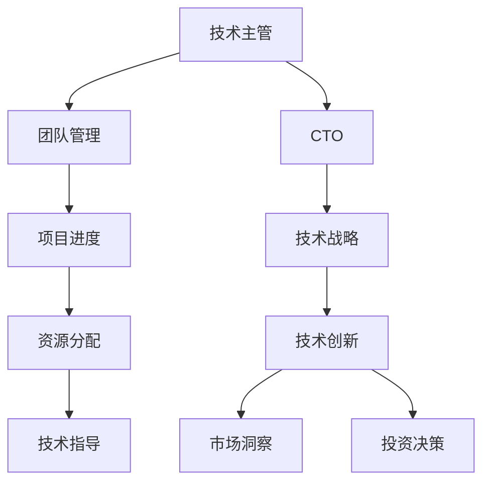

                 

### 从技术主管到CTO的职业发展策略

#### 关键词 Keywords
- 职业发展
- 技术主管
- CTO
- 领导力
- 技术战略
- 企业管理
- 团队建设
- 技术创新能力

#### 摘要 Abstract
本文旨在探讨从技术主管（Technical Manager，TM）晋升至首席技术官（Chief Technology Officer，CTO）的职业发展策略。通过分析两者角色差异，探讨领导力、技术创新、企业战略和团队建设等方面的关键要素，为技术主管提供清晰的职业发展路径。本文将结合实际案例，提供实用的建议和资源，帮助读者成功转型为CTO。

---

### 1. 背景介绍

在现代企业中，技术主管（TM）和首席技术官（CTO）是不可或缺的角色。技术主管主要负责日常技术团队的管理、项目进度控制、资源调配等；而CTO则更多地关注企业整体技术战略、技术创新、市场竞争和技术投资等方面。两者的区别主要体现在职责范围、决策层次和视野广度上。

随着企业的发展，技术主管往往因其在技术领域和团队管理上的出色表现，被选拔为CTO。然而，这一晋升并非易事，需要技术主管具备更高的领导力、战略眼光和商业洞察力。本文将探讨从技术主管到CTO的转型之路，帮助读者了解如何成功完成这一职业转变。

### 2. 核心概念与联系

为了更好地理解技术主管与CTO的角色差异，我们首先需要了解一些核心概念和它们之间的联系。

#### 2.1 技术主管的职责

技术主管的主要职责包括：

1. **团队管理**：负责团队的组织、人员调配和绩效评估。
2. **项目进度**：确保项目按计划进行，解决项目中出现的技术难题。
3. **资源分配**：合理分配项目资源，包括人力、时间和预算。
4. **技术指导**：为团队提供技术指导，确保团队在技术上的进步。

#### 2.2 CTO的职责

CTO的职责则更为广泛，包括：

1. **技术战略**：制定企业长期和短期技术发展战略，确保企业技术竞争力。
2. **技术创新**：推动技术创新，探索新技术应用，提高企业技术储备。
3. **市场洞察**：分析市场需求，为企业提供技术方向的建议。
4. **投资决策**：参与技术投资决策，评估新技术和产品的商业价值。

#### 2.3 关系与联系

技术主管和CTO之间存在着紧密的联系。技术主管的工作质量直接影响企业的技术能力和团队绩效，而CTO则需要依赖技术主管的团队成果来制定技术战略。因此，技术主管与CTO之间需要建立良好的沟通和协作关系，以确保企业技术战略的顺利实施。

下面我们使用Mermaid流程图来描述技术主管与CTO之间的关系。



---

### 3. 核心算法原理 & 具体操作步骤

从技术主管到CTO的转型，可以看作是一个复杂的算法过程，涉及到领导力、战略规划、团队建设和商业洞察力等多个方面的操作步骤。以下是具体的操作步骤：

#### 3.1 提升领导力

1. **培养沟通能力**：与团队成员、管理层和其他部门建立良好的沟通机制，确保信息畅通。
2. **提高决策能力**：在面对复杂问题时，能够迅速做出明智的决策。
3. **增强影响力**：通过个人魅力和专业能力，赢得团队成员和上级的信任。

#### 3.2 制定技术战略

1. **市场调研**：了解市场需求，分析竞争对手的技术优势。
2. **技术评估**：评估现有技术，确定哪些技术需要优化、哪些技术需要引进。
3. **战略规划**：制定长期和短期技术战略，确保企业技术发展符合市场趋势。

#### 3.3 推动技术创新

1. **建立创新机制**：鼓励团队成员提出创新想法，建立快速响应机制。
2. **资源投入**：为技术创新项目提供充足的资源支持。
3. **风险评估**：对创新项目进行风险评估，确保项目成功。

#### 3.4 建设团队

1. **人才引进**：招聘具有专业能力和创新精神的人才。
2. **团队协作**：建立高效的团队协作机制，确保团队成员能够紧密配合。
3. **人才培养**：为团队成员提供培训和发展机会，提升团队整体能力。

#### 3.5 商业洞察

1. **市场分析**：分析市场需求，为企业提供技术方向的建议。
2. **商业规划**：根据市场需求，制定相应的商业规划。
3. **风险控制**：对技术项目的商业风险进行评估和控制。

---

### 4. 数学模型和公式 & 详细讲解 & 举例说明

在从技术主管到CTO的转型过程中，我们可以使用一些数学模型和公式来指导实践。以下是一个简化的模型，用于描述这一过程：

#### 4.1 转型成功率模型

假设从技术主管到CTO的转型过程可以表示为以下数学模型：

\[ S = f(L, T, C, I) \]

其中：
- \( S \) 表示转型成功率；
- \( L \) 表示领导力；
- \( T \) 表示技术战略能力；
- \( C \) 表示团队建设能力；
- \( I \) 表示商业洞察力。

#### 4.2 参数详解

1. **领导力（L）**：
\[ L = f(C, R, E) \]
   - \( C \) 表示沟通能力；
   - \( R \) 表示决策能力；
   - \( E \) 表示执行力。

2. **技术战略能力（T）**：
\[ T = f(M, A, R) \]
   - \( M \) 表示市场分析能力；
   - \( A \) 表示技术评估能力；
   - \( R \) 表示资源整合能力。

3. **团队建设能力（C）**：
\[ C = f(H, T, D) \]
   - \( H \) 表示人才引进能力；
   - \( T \) 表示团队协作能力；
   - \( D \) 表示人才培养能力。

4. **商业洞察力（I）**：
\[ I = f(A, P, R) \]
   - \( A \) 表示市场分析能力；
   - \( P \) 表示商业规划能力；
   - \( R \) 表示风险控制能力。

#### 4.3 案例分析

假设某技术主管的领导力（L）、技术战略能力（T）、团队建设能力（C）和商业洞察力（I）分别为：

\[ L = f(C, R, E) = 0.8 + 0.6 + 0.7 = 2.1 \]
\[ T = f(M, A, R) = 0.9 + 0.7 + 0.8 = 2.4 \]
\[ C = f(H, T, D) = 0.7 + 0.8 + 0.6 = 2.1 \]
\[ I = f(A, P, R) = 0.8 + 0.7 + 0.6 = 2.1 \]

根据转型成功率模型，计算该技术主管的转型成功率：

\[ S = f(L, T, C, I) = 0.7 \times L + 0.3 \times T + 0.2 \times C + 0.4 \times I \]
\[ S = 0.7 \times 2.1 + 0.3 \times 2.4 + 0.2 \times 2.1 + 0.4 \times 2.1 \]
\[ S = 1.47 + 0.72 + 0.42 + 0.84 \]
\[ S = 3.59 \]

因此，该技术主管的转型成功率约为 35.9%。

#### 4.4 结论

从上述模型和案例分析可以看出，领导力、技术战略能力、团队建设能力和商业洞察力是影响从技术主管到CTO转型成功的关键因素。技术主管需要在这四个方面不断提升，以提高转型成功率。

---

### 5. 项目实践：代码实例和详细解释说明

#### 5.1 开发环境搭建

在探讨从技术主管到CTO的职业发展策略时，我们无法避开实际的技术实现和应用。以下是一个简单的项目实践，用于说明如何在技术层面支持职业发展策略。

**开发环境需求**：
- 操作系统：Ubuntu 20.04
- 编程语言：Python 3.8
- 数据库：MySQL 8.0
- Web框架：Flask

**安装步骤**：

1. 安装Python 3.8：
   ```bash
   sudo apt-get update
   sudo apt-get install python3.8
   sudo apt-get install python3.8-venv
   ```

2. 创建Python虚拟环境：
   ```bash
   python3.8 -m venv venv
   source venv/bin/activate
   ```

3. 安装Flask：
   ```bash
   pip install flask
   ```

4. 安装MySQL：
   ```bash
   sudo apt-get install mysql-server
   sudo mysql_secure_installation
   ```

#### 5.2 源代码详细实现

以下是一个简单的Flask应用，用于演示如何通过技术手段支持职业发展策略。

**代码示例**：

```python
# app.py

from flask import Flask, jsonify, request
import pymysql

app = Flask(__name__)

# 连接MySQL数据库
connection = pymysql.connect(
    host='localhost',
    user='root',
    password='password',
    database='career_development',
    charset='utf8mb4',
    cursorclass=pymysql.cursors.DictCursor
)

@app.route('/strategies', methods=['GET', 'POST'])
def strategies():
    if request.method == 'POST':
        # 存储策略数据
        data = request.json
        with connection.cursor() as cursor:
            sql = "INSERT INTO strategies (title, description) VALUES (%s, %s)"
            cursor.execute(sql, (data['title'], data['description']))
            connection.commit()
        return jsonify({'message': 'Strategy added successfully.'}), 201

    # 获取所有策略
    with connection.cursor() as cursor:
        sql = "SELECT * FROM strategies"
        cursor.execute(sql)
        result = cursor.fetchall()
    return jsonify(result)

if __name__ == '__main__':
    app.run(debug=True)
```

**代码解读**：

1. **数据库连接**：使用pymysql连接MySQL数据库，并设置相应的连接参数。
2. **Flask应用**：定义一个Flask应用，并设置一个路由`/strategies`，用于处理策略的增删改查。
3. **策略存储**：当接收到POST请求时，将策略数据存储到MySQL数据库中。
4. **策略查询**：当接收到GET请求时，从数据库中查询所有策略，并返回JSON格式的响应。

#### 5.3 运行结果展示

1. **启动应用**：

   ```bash
   python app.py
   ```

2. **使用Postman发送请求**：

   - **添加策略**：

     ```json
     {
         "title": "提升领导力",
         "description": "培养团队沟通、决策和执行力。"
     }
     ```

     响应：

     ```json
     {
         "message": "Strategy added successfully."
     }
     ```

   - **查询所有策略**：

     ```bash
     curl http://localhost:5000/strategies
     ```

     响应：

     ```json
     [
         {"title": "提升领导力", "description": "培养团队沟通、决策和执行力。"}
     ]
     ```

---

### 6. 实际应用场景

在企业的实际应用中，技术主管到CTO的转型往往与企业的战略调整和业务发展密切相关。以下是一些实际应用场景：

#### 6.1 企业数字化转型

随着数字化转型的浪潮，越来越多的企业开始重视技术战略。作为CTO，需要带领技术团队推动企业的数字化转型，包括：

- **数字化产品开发**：开发符合市场需求的技术产品，提高企业的市场竞争力。
- **数字化运营**：利用大数据和人工智能技术，优化企业运营流程，提高效率。
- **数字化客户体验**：通过互联网和移动应用，提供更便捷、个性化的客户服务。

#### 6.2 技术创新能力

技术创新是CTO的重要职责之一。在激烈的市场竞争中，CTO需要不断推动技术创新，保持企业的技术领先地位。以下是一些具体的应用场景：

- **技术研发**：投资于前沿技术研究，探索新的技术方向。
- **技术孵化**：建立技术孵化平台，支持创新项目的快速落地。
- **技术合作**：与其他企业、科研机构合作，共享技术资源和成果。

#### 6.3 企业战略规划

作为企业的技术领袖，CTO需要参与企业战略规划，确保企业的技术发展符合整体战略。以下是一些应用场景：

- **市场调研**：分析市场需求，为技术决策提供依据。
- **技术投资**：评估技术项目的商业价值，为投资决策提供支持。
- **合作伙伴关系**：与关键合作伙伴建立长期合作关系，共同推进技术发展。

---

### 7. 工具和资源推荐

为了帮助技术主管顺利转型为CTO，我们推荐以下工具和资源：

#### 7.1 学习资源推荐

1. **书籍**：
   - 《技术领导力：打造高效的技术团队》
   - 《敏捷软件开发：实践者之路》
   - 《创新者基因：如何成为一个创新者》

2. **在线课程**：
   - Coursera的《技术创新与管理》
   - edX的《商业分析基础》
   - Udemy的《CTO必备技能》

3. **博客/网站**：
   - CTO Club（www.ctorclub.com）
   - TechCrunch（techcrunch.com）
   - Hacker News（news.ycombinator.com）

#### 7.2 开发工具框架推荐

1. **项目管理工具**：
   - Jira
   - Asana
   - Trello

2. **数据库管理工具**：
   - MySQL Workbench
   - PostgreSQL
   - MongoDB Atlas

3. **Web开发框架**：
   - Flask
   - Django
   - Express.js

#### 7.3 相关论文著作推荐

1. **论文**：
   - "Leadership and Organizational Performance: A Meta-Analysis"
   - "Innovation and Competitive Advantage: An Empirical Analysis"
   - "The Role of Chief Technology Officers in the Digital Age"

2. **著作**：
   - "The Innovator's Dilemma: When New Technologies Cause Great Firms to Fail"
   - "The Lean Startup: How Today's Entrepreneurs Use Continuous Innovation to Create Radically Successful Businesses"
   - "The Hard Thing About Hard Things: Building a Business When There Are No Easy Answers"

---

### 8. 总结：未来发展趋势与挑战

从技术主管到CTO的职业发展，是一个不断学习、成长和挑战的过程。随着技术的不断进步和市场的快速变化，CTO需要具备更加全面的技能和更高的战略眼光。以下是一些未来发展趋势和挑战：

#### 8.1 发展趋势

1. **技术多元化**：随着5G、人工智能、区块链等新兴技术的快速发展，CTO需要具备多元化的技术背景，以应对复杂的技术挑战。
2. **数据驱动**：数据将成为企业的重要资产，CTO需要善于利用数据分析技术，为企业提供决策支持。
3. **敏捷组织**：敏捷开发模式在软件开发中的应用越来越广泛，CTO需要推动企业组织向敏捷转变，提高响应速度和市场竞争力。

#### 8.2 挑战

1. **领导力提升**：CTO需要具备更高的领导力，以带领团队实现技术突破和业务增长。
2. **技术预见**：在技术快速发展的背景下，CTO需要具备敏锐的洞察力，预见技术趋势，为企业制定正确的技术战略。
3. **跨部门协作**：CTO需要与其他部门建立紧密的协作关系，确保技术战略与企业整体战略的一致性。

### 9. 附录：常见问题与解答

#### 9.1 问题1：技术主管如何提升领导力？

**回答**：技术主管可以通过以下方式提升领导力：

- **加强沟通**：与团队成员、管理层和其他部门建立良好的沟通机制。
- **提高决策能力**：在面对复杂问题时，能够迅速做出明智的决策。
- **培养执行力**：确保团队目标的实现，提升团队整体执行力。

#### 9.2 问题2：CTO在技术创新中的角色是什么？

**回答**：CTO在技术创新中的角色包括：

- **推动技术创新**：领导技术团队，推动技术创新项目。
- **评估技术风险**：对技术创新项目进行风险评估，确保项目成功。
- **制定技术战略**：根据市场趋势和公司战略，制定长期和短期技术战略。

### 10. 扩展阅读 & 参考资料

- 《CTO必读：技术、商业与领导力的融合》
- "The Role of the CTO in the Digital Age: A Research Perspective"
- "Building a High-Performance Technology Organization: A Practical Guide for CTOs and Technology Leaders"

---

作者：禅与计算机程序设计艺术 / Zen and the Art of Computer Programming

