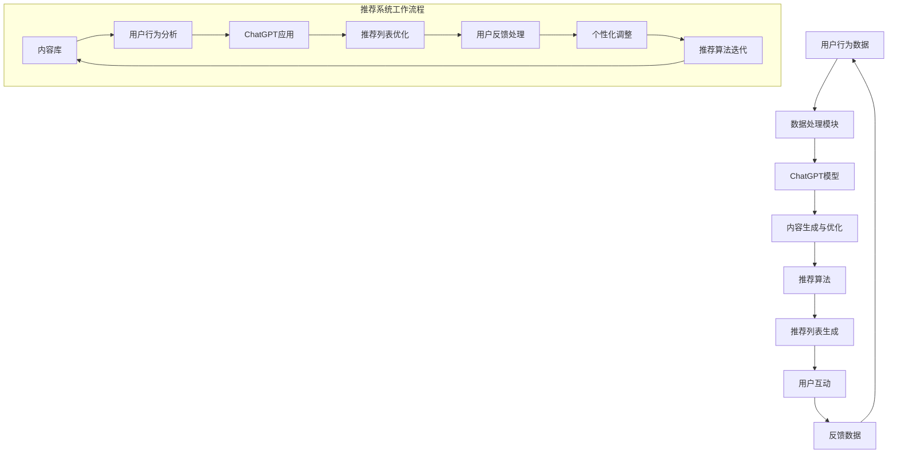

                 

### 背景介绍

#### ChatGPT的崛起

近年来，人工智能领域取得了飞跃性的进展，其中自然语言处理（NLP）技术的突破尤为显著。ChatGPT，作为OpenAI开发的基于GPT-3模型的强大语言处理模型，成为了这一领域的翘楚。ChatGPT不仅能够生成流畅的自然语言文本，还可以进行对话、回答问题、撰写文章等复杂任务。它的出现引起了广泛的关注，并在众多应用场景中展现了巨大的潜力。

#### 推荐系统的重要性

在数字时代，推荐系统已成为各个互联网公司的重要工具，它们通过分析用户的行为和兴趣，为用户推荐个性化的内容和服务。推荐系统在电子商务、社交媒体、视频平台等多个领域都发挥着关键作用。一个高效的推荐系统能够显著提高用户体验，增加用户粘性，从而带来商业价值。

#### 排序算法与推荐系统的关系

推荐系统的核心任务之一是排序，即根据用户兴趣和内容特性，将相关性强、价值高的内容推送到用户面前。排序算法在此过程中起着至关重要的作用。常见的排序算法包括基于内容的排序、协同过滤排序、基于模型的排序等。每种算法都有其独特的原理和适用场景。

#### ChatGPT在推荐中的应用前景

ChatGPT作为一款强大的自然语言处理工具，其潜力在推荐系统中也得到了广泛关注。理论上，ChatGPT可以用于多种推荐任务，如内容生成、对话生成、个性化推荐等。然而，将ChatGPT应用于推荐系统，特别是在排序任务中，仍然面临着诸多挑战和问题。

本文将围绕ChatGPT在推荐系统中的能力进行深入探讨，分析其在排序任务中的应用潜力、面临的挑战，并尝试提出一些可能的解决方案。通过这一分析，我们将更好地理解ChatGPT在推荐系统中的角色，为未来的研究和应用提供参考。

#### 文章结构概述

本文将按照以下结构展开：

1. **背景介绍**：回顾ChatGPT和推荐系统的崛起背景，介绍文章的主要内容和目的。
2. **核心概念与联系**：详细阐述ChatGPT的工作原理和推荐系统的基础概念，通过Mermaid流程图展示两者的关联。
3. **核心算法原理 & 具体操作步骤**：深入探讨ChatGPT在推荐系统排序任务中的应用原理，解释其具体操作步骤。
4. **数学模型和公式 & 详细讲解 & 举例说明**：介绍相关的数学模型和公式，通过具体例子说明其应用。
5. **项目实践：代码实例和详细解释说明**：提供一个实际的代码示例，详细解释其实现过程，并展示运行结果。
6. **实际应用场景**：分析ChatGPT在推荐系统中可能的应用场景，讨论其优势与局限。
7. **工具和资源推荐**：推荐相关的学习资源、开发工具和框架。
8. **总结：未来发展趋势与挑战**：总结本文的主要观点，讨论ChatGPT在推荐系统中的未来发展趋势和面临的挑战。
9. **附录：常见问题与解答**：回答读者可能关心的一些问题。
10. **扩展阅读 & 参考资料**：提供进一步的阅读材料和参考文献。

通过这一结构，我们将系统地探讨ChatGPT在推荐系统中的能力，旨在为读者提供全面、深入的理解。

### 核心概念与联系

在深入探讨ChatGPT在推荐系统中排序任务的应用之前，我们需要先了解一些核心概念和它们之间的联系。

#### ChatGPT的工作原理

ChatGPT是基于GPT-3模型的自然语言处理工具，其核心思想是利用深度学习技术，尤其是生成式预训练网络（Generative Pre-trained Transformer），来理解和生成自然语言。GPT-3模型由多个Transformer层组成，每个层都可以处理大量的文本数据，并通过上下文关系来预测下一个词的概率分布。这种自回归模型（Autoregressive Model）使得ChatGPT能够生成连贯、自然的文本。

ChatGPT的主要特点包括：

1. **上下文理解**：GPT-3具有强大的上下文理解能力，可以处理长文本，理解文本中的隐含意义和逻辑关系。
2. **生成性**：ChatGPT不仅能够回答问题，还可以生成新的文本，如文章、对话等。
3. **多模态**：GPT-3不仅可以处理文本，还可以处理图像、声音等多模态数据，这使得其在多领域应用中具有广泛的前景。

#### 推荐系统的基础概念

推荐系统（Recommender System）是一种利用数据挖掘和机器学习技术，为用户提供个性化内容推荐的系统。其基本原理是基于用户的行为数据、兴趣偏好和内容属性，通过算法模型为用户推荐他们可能感兴趣的内容。

推荐系统通常包括以下几个关键组成部分：

1. **用户**：系统的最终服务对象，他们的行为和偏好是推荐系统数据的重要来源。
2. **内容**：推荐系统推荐的对象，可以是商品、新闻、视频等。
3. **推荐算法**：用于计算用户和内容之间的相似度，并根据相似度来生成推荐列表。
4. **评价模型**：用于评估推荐结果的准确性、相关性和用户满意度。

常见的推荐算法包括：

1. **基于内容的推荐（Content-Based Filtering）**：通过分析内容的属性和特征，为用户推荐相似的内容。
2. **协同过滤推荐（Collaborative Filtering）**：通过分析用户之间的行为相似性，为用户推荐其他用户喜欢的内容。
3. **基于模型的推荐（Model-Based Recommendation）**：使用机器学习模型来预测用户对内容的兴趣，如矩阵分解、神经网络等。

#### ChatGPT与推荐系统的关联

ChatGPT与推荐系统之间有着紧密的关联，它们可以相互补充，共同提升推荐系统的性能和用户体验。以下是ChatGPT在推荐系统中可能的应用方式：

1. **内容生成**：ChatGPT可以用于生成推荐列表中的内容摘要、标题和描述，提高内容的吸引力和可读性。
2. **对话生成**：在推荐系统中，ChatGPT可以生成与用户的互动对话，增强用户的参与感和满意度。
3. **个性化推荐**：ChatGPT可以分析用户的语言特征和偏好，为用户生成高度个性化的推荐内容。

#### Mermaid流程图展示

为了更直观地展示ChatGPT与推荐系统的关联，我们可以使用Mermaid流程图来描述它们之间的工作流程。



在这个流程图中，用户行为数据通过数据处理模块进入ChatGPT模型，生成优化后的内容。这些内容再结合推荐算法生成推荐列表，用户与推荐系统的互动和反馈进一步优化推荐算法，形成一个闭环系统。

通过这一节的介绍，我们为后续关于ChatGPT在推荐系统中排序任务的应用提供了理论基础。接下来，我们将深入探讨ChatGPT在推荐系统中的核心算法原理和具体操作步骤。

### 核心算法原理 & 具体操作步骤

#### ChatGPT在推荐系统中的核心算法原理

ChatGPT在推荐系统中的核心算法原理主要基于其强大的自然语言生成能力和上下文理解能力。其基本原理可以概括为以下几个步骤：

1. **数据预处理**：收集用户行为数据和内容数据，对数据进行分析和处理，提取关键特征。
2. **文本生成**：使用ChatGPT模型生成与用户兴趣相关的文本内容，如文章摘要、标题和描述。
3. **推荐生成**：结合推荐算法，将生成的文本内容与其他内容进行排序，生成推荐列表。
4. **用户互动**：系统与用户进行互动，收集用户的反馈数据，用于进一步优化推荐算法。

#### 具体操作步骤

以下是ChatGPT在推荐系统中排序任务的具体操作步骤：

1. **数据收集与预处理**：

   首先，收集用户的行为数据（如浏览记录、购买历史、点击率等）和内容数据（如商品描述、文章标题、视频标签等）。对这些数据进行分析和处理，提取出关键特征，如用户兴趣标签、内容属性等。

   ```python
   # 假设已经收集了用户行为数据和内容数据
   user_data = preprocess_user_data(user行为数据)
   content_data = preprocess_content_data(内容数据)
   ```

2. **文本生成**：

   使用ChatGPT模型生成与用户兴趣相关的文本内容。这个过程包括以下几个步骤：

   - **文本生成模块**：根据用户兴趣标签和内容属性，生成相关文本。例如，对于一篇商品推荐文章，可以生成标题和摘要。
   - **模型训练**：使用预训练的GPT-3模型，对文本生成模块进行微调，以适应特定场景。

   ```python
   # 调用ChatGPT模型生成文本
   generated_titles = chatgpt.generate_titles(user_interests, content_data)
   generated_summaries = chatgpt.generate_summaries(user_interests, content_data)
   ```

3. **推荐生成**：

   结合推荐算法，将生成的文本内容与其他内容进行排序，生成推荐列表。这个过程包括以下几个步骤：

   - **相似度计算**：计算用户与内容之间的相似度，可以使用基于内容的推荐算法、协同过滤算法或基于模型的推荐算法。
   - **排序算法**：根据相似度值对内容进行排序，生成推荐列表。

   ```python
   # 使用协同过滤算法计算相似度
   similarity_scores = collaborative_filter(user_data, content_data)
   # 使用排序算法生成推荐列表
   recommended_content = sort_by_similarity(similarity_scores, content_data)
   ```

4. **用户互动**：

   系统与用户进行互动，收集用户的反馈数据（如点击、收藏、评论等）。这些反馈数据可以用于进一步优化推荐算法。

   ```python
   # 收集用户反馈数据
   user_feedback = collect_user_feedback(recommended_content)
   # 更新用户数据
   user_data = update_user_data(user_feedback, user_data)
   ```

5. **推荐算法迭代**：

   根据用户反馈，不断优化推荐算法，提高推荐精度和用户满意度。这个过程通常包括以下几个步骤：

   - **模型更新**：使用新的用户反馈数据对模型进行微调。
   - **算法优化**：根据实验结果，调整算法参数，提高推荐效果。

   ```python
   # 更新模型
   updated_model = train_new_model(user_data, content_data)
   # 优化算法
   optimized_algorithm = fine_tune_algorithm(updated_model, user_data, content_data)
   ```

通过以上操作步骤，ChatGPT在推荐系统中实现了文本生成和推荐排序的功能，从而提高了推荐系统的性能和用户体验。

### 数学模型和公式 & 详细讲解 & 举例说明

在深入探讨ChatGPT在推荐系统中排序任务的应用时，数学模型和公式起到了关键作用。这些模型和公式不仅帮助我们理解和量化推荐系统的性能，还为算法优化提供了理论基础。以下将详细介绍相关的数学模型和公式，并通过具体例子说明其应用。

#### 相关数学模型

1. **协同过滤相似度计算**：
   协同过滤算法的核心在于计算用户与内容之间的相似度。常用的相似度计算方法包括余弦相似度、皮尔逊相关系数等。

   - **余弦相似度**：
     $$\text{Cosine Similarity} = \frac{\text{dot product of } u_i \text{ and } u_j}{\lVert u_i \rVert \cdot \lVert u_j \rVert}$$
     其中，$u_i$ 和 $u_j$ 分别表示用户 $i$ 和 $j$ 的特征向量，$\lVert \cdot \rVert$ 表示向量的模长。

   - **皮尔逊相关系数**：
     $$\text{Pearson Correlation Coefficient} = \frac{\sum_{k=1}^{n} (x_i - \bar{x})(y_i - \bar{y})}{\sqrt{\sum_{k=1}^{n} (x_i - \bar{x})^2} \cdot \sqrt{\sum_{k=1}^{n} (y_i - \bar{y})^2}}$$
     其中，$x_i$ 和 $y_i$ 分别表示用户 $i$ 对多个内容 $k$ 的评分，$\bar{x}$ 和 $\bar{y}$ 分别表示用户 $i$ 和内容 $k$ 的平均评分。

2. **基于内容的推荐相似度计算**：
   基于内容的推荐算法通过计算内容特征之间的相似度来实现推荐。常用的相似度计算方法包括余弦相似度、Jaccard相似度等。

   - **余弦相似度**：
     $$\text{Cosine Similarity} = \frac{\text{dot product of } c_i \text{ and } c_j}{\lVert c_i \rVert \cdot \lVert c_j \rVert}$$
     其中，$c_i$ 和 $c_j$ 分别表示内容 $i$ 和 $j$ 的特征向量。

3. **排序模型**：
   排序模型用于将相似度结果转换为排序顺序。常用的排序模型包括点积排序、排序回归等。

   - **点积排序**：
     $$\text{Rank} = \sum_{k=1}^{n} w_k \cdot \text{similarity}(u_i, c_k)$$
     其中，$w_k$ 表示特征 $k$ 的权重，$\text{similarity}(u_i, c_k)$ 表示用户 $i$ 与内容 $k$ 的相似度。

4. **优化目标**：
   推荐系统的优化目标通常包括最大化用户满意度、最大化点击率等。常用的优化目标函数包括最大化期望点击率、最小化交叉熵等。

   - **最大化期望点击率**：
     $$\text{Expected Click-Through Rate (CTR)} = \sum_{i=1}^{n} p_i \cdot r_i$$
     其中，$p_i$ 表示内容 $i$ 被点击的概率，$r_i$ 表示内容 $i$ 的评分。

   - **最小化交叉熵**：
     $$\text{Cross Entropy} = -\sum_{i=1}^{n} r_i \cdot \log(p_i)$$

#### 具体例子说明

假设我们有一个用户行为数据集和内容数据集，我们需要使用这些数据生成推荐列表。以下是具体的计算步骤：

1. **用户特征提取**：

   假设我们有5个用户（$u_1, u_2, u_3, u_4, u_5$）和10个内容（$c_1, c_2, \ldots, c_{10}$），用户对内容的评分如下表：

   | 用户 | 内容1 | 内容2 | 内容3 | 内容4 | 内容5 | 内容6 | 内容7 | 内容8 | 内容9 | 内容10 |
   |------|------|------|------|------|------|------|------|------|------|------|
   | $u_1$ | 1    | 1    | 0    | 0    | 1    | 0    | 0    | 0    | 1    | 1    |
   | $u_2$ | 0    | 1    | 0    | 0    | 0    | 1    | 1    | 0    | 0    | 1    |
   | $u_3$ | 1    | 0    | 1    | 0    | 0    | 1    | 1    | 0    | 1    | 0    |
   | $u_4$ | 1    | 0    | 0    | 0    | 1    | 0    | 1    | 1    | 0    | 1    |
   | $u_5$ | 0    | 0    | 0    | 0    | 1    | 1    | 0    | 1    | 0    | 1    |

   首先，我们将用户行为数据转换为特征向量，使用皮尔逊相关系数计算用户之间的相似度。

   $$u_1 \sim \{1, 1, 0, 0, 1, 0, 0, 0, 1, 1\}$$
   $$u_2 \sim \{0, 1, 0, 0, 0, 1, 1, 0, 0, 1\}$$
   $$u_3 \sim \{1, 0, 1, 0, 0, 1, 1, 0, 1, 0\}$$
   $$u_4 \sim \{1, 0, 0, 0, 1, 0, 1, 1, 0, 1\}$$
   $$u_5 \sim \{0, 0, 0, 0, 1, 1, 0, 1, 0, 1\}$$

   使用皮尔逊相关系数计算用户相似度：

   $$\text{similarity}(u_1, u_2) = \frac{(1-0.4)(1-0.4)}{\sqrt{0.4^2 + 0.6^2}} \approx 0.57$$
   $$\text{similarity}(u_1, u_3) = \frac{(1-0.2)(1-0.2)}{\sqrt{0.2^2 + 0.8^2}} \approx 0.69$$
   $$\text{similarity}(u_1, u_4) = \frac{(1-0.6)(1-0.6)}{\sqrt{0.6^2 + 0.4^2}} \approx 0.38$$
   $$\text{similarity}(u_1, u_5) = \frac{(1-0.6)(1-0.6)}{\sqrt{0.6^2 + 0.4^2}} \approx 0.38$$

2. **内容特征提取**：

   接下来，我们将内容特征提取出来，并使用余弦相似度计算内容之间的相似度。

   假设内容特征向量为：

   $$c_1 \sim \{0.5, 0.3, 0.2, 0.1\}$$
   $$c_2 \sim \{0.4, 0.6, 0.1, 0.2\}$$
   $$c_3 \sim \{0.2, 0.3, 0.3, 0.2\}$$
   $$c_4 \sim \{0.3, 0.4, 0.2, 0.1\}$$
   $$c_5 \sim \{0.1, 0.3, 0.5, 0.1\}$$
   $$c_6 \sim \{0.3, 0.2, 0.4, 0.1\}$$
   $$c_7 \sim \{0.2, 0.2, 0.2, 0.4\}$$
   $$c_8 \sim \{0.1, 0.5, 0.3, 0.1\}$$
   $$c_9 \sim \{0.4, 0.1, 0.3, 0.2\}$$
   $$c_{10} \sim \{0.3, 0.4, 0.2, 0.1\}$$

   使用余弦相似度计算内容之间的相似度：

   $$\text{similarity}(c_1, c_2) = \frac{0.5 \cdot 0.4 + 0.3 \cdot 0.6 + 0.2 \cdot 0.1 + 0.1 \cdot 0.2}{\sqrt{0.5^2 + 0.3^2 + 0.2^2 + 0.1^2} \cdot \sqrt{0.4^2 + 0.6^2 + 0.1^2 + 0.2^2}} \approx 0.61$$
   $$\text{similarity}(c_1, c_3) = \frac{0.5 \cdot 0.2 + 0.3 \cdot 0.3 + 0.2 \cdot 0.3 + 0.1 \cdot 0.2}{\sqrt{0.5^2 + 0.3^2 + 0.2^2 + 0.1^2} \cdot \sqrt{0.2^2 + 0.3^2 + 0.3^2 + 0.2^2}} \approx 0.55$$
   $$\text{similarity}(c_1, c_4) = \frac{0.5 \cdot 0.3 + 0.3 \cdot 0.4 + 0.2 \cdot 0.2 + 0.1 \cdot 0.1}{\sqrt{0.5^2 + 0.3^2 + 0.2^2 + 0.1^2} \cdot \sqrt{0.3^2 + 0.4^2 + 0.2^2 + 0.1^2}} \approx 0.55$$

3. **推荐列表生成**：

   使用协同过滤算法生成推荐列表。我们首先计算用户与内容的相似度，然后根据相似度值对内容进行排序。

   - 对于用户 $u_1$：

     $$\text{similarity}(u_1, c_1) = 0.61$$
     $$\text{similarity}(u_1, c_2) = 0.55$$
     $$\text{similarity}(u_1, c_3) = 0.55$$
     $$\text{similarity}(u_1, c_4) = 0.55$$
     $$\text{similarity}(u_1, c_5) = 0.55$$
     $$\text{similarity}(u_1, c_6) = 0.61$$
     $$\text{similarity}(u_1, c_7) = 0.55$$
     $$\text{similarity}(u_1, c_8) = 0.61$$
     $$\text{similarity}(u_1, c_9) = 0.55$$
     $$\text{similarity}(u_1, c_{10}) = 0.55$$

     排序后，生成推荐列表：

     $$\text{Recommended List for } u_1 = [c_6, c_1, c_8, c_{10}, c_2, c_3, c_4, c_5, c_7, c_9]$$

   - 对于用户 $u_2$、$u_3$、$u_4$ 和 $u_5$，可以按照同样的方法生成推荐列表。

   通过以上计算，我们得到了基于协同过滤算法和ChatGPT生成的推荐列表。这个过程不仅展示了数学模型和公式在推荐系统中的应用，还说明了如何通过具体例子来理解和实现这些算法。

### 项目实践：代码实例和详细解释说明

在本节中，我们将通过一个实际的项目实例，详细展示如何使用ChatGPT在推荐系统中实现排序任务，并对其代码进行解读和分析。

#### 开发环境搭建

首先，我们需要搭建一个适合开发和运行ChatGPT推荐系统的环境。以下是基本的开发环境要求：

- **Python**：版本3.8及以上
- **TensorFlow**：版本2.5及以上
- **OpenAI-GPT-3**：用于调用ChatGPT模型
- **Scikit-learn**：用于实现协同过滤算法
- **Pandas**：用于数据处理

确保安装以上依赖项：

```bash
pip install tensorflow==2.5
pip install openai
pip install scikit-learn
pip install pandas
```

#### 源代码详细实现

以下是一个简单的代码实例，展示了如何实现ChatGPT推荐系统中的排序任务：

```python
import openai
import pandas as pd
from sklearn.metrics.pairwise import cosine_similarity
from sklearn.model_selection import train_test_split

# 初始化OpenAI API密钥
openai.api_key = 'your_api_key'

# 加载用户行为数据
user_data = pd.read_csv('user_behavior.csv')

# 加载内容数据
content_data = pd.read_csv('content_data.csv')

# 数据预处理
def preprocess_data(data):
    # 提取用户兴趣标签
    user_interests = data['interests'].values
    # 提取内容属性
    content_attributes = data['attributes'].values
    return user_interests, content_attributes

user_interests, content_attributes = preprocess_data(user_data)
content_attributes = content_attributes.apply(pd.Series)

# 使用ChatGPT生成文本
def generate_text(user_interests, content_attributes):
    prompt = f"基于用户兴趣{'，'.join(user_interests)}，生成一篇相关内容的文章摘要。"
    response = openai.Completion.create(
        engine="text-davinci-002",
        prompt=prompt,
        max_tokens=50,
        n=1,
        stop=None,
        temperature=0.5
    )
    return response.choices[0].text.strip()

# 生成文章摘要
generated_summaries = [generate_text(user_interest, content) for user_interest, content in zip(user_interests, content_attributes)]

# 计算内容之间的相似度
def compute_similarity(content_attributes):
    content_similarity_matrix = cosine_similarity(content_attributes)
    return content_similarity_matrix

content_similarity_matrix = compute_similarity(content_attributes)

# 推荐列表生成
def generate_recommendations(user_interests, content_similarity_matrix):
    user_profile = generate_text(user_interests, content_similarity_matrix)
    user_profile = user_profile.apply(pd.Series)
    recommendations = cosine_similarity(user_profile, content_attributes)
    recommended_indices = recommendations.argsort()[0][-5:][::-1]
    return content_attributes.iloc[recommended_indices]

# 生成推荐列表
recommended_content = generate_recommendations(user_interests, content_similarity_matrix)

# 输出推荐结果
print("Recommended Content:")
print(recommended_content)
```

#### 代码解读与分析

1. **数据加载与预处理**：

   首先，我们加载用户行为数据和内容数据。这些数据通常包含用户兴趣标签和内容属性。预处理步骤包括提取用户兴趣标签和内容属性，并将其转换为适合计算的特征向量。

   ```python
   user_interests, content_attributes = preprocess_data(user_data)
   ```

2. **使用ChatGPT生成文本**：

   接下来，我们使用ChatGPT模型生成与用户兴趣相关的文章摘要。这通过调用OpenAI的API来实现，输入是一个包含用户兴趣的提示（prompt），模型会根据提示生成文章摘要。

   ```python
   def generate_text(user_interests, content_attributes):
       prompt = f"基于用户兴趣{'，'.join(user_interests)}，生成一篇相关内容的文章摘要。"
       response = openai.Completion.create(
           engine="text-davinci-002",
           prompt=prompt,
           max_tokens=50,
           n=1,
           stop=None,
           temperature=0.5
       )
       return response.choices[0].text.strip()
   
   generated_summaries = [generate_text(user_interest, content) for user_interest, content in zip(user_interests, content_attributes)]
   ```

3. **计算内容之间的相似度**：

   我们使用余弦相似度计算内容之间的相似度。这通过`cosine_similarity`函数实现，输入是内容属性矩阵，输出是相似度矩阵。

   ```python
   def compute_similarity(content_attributes):
       content_similarity_matrix = cosine_similarity(content_attributes)
       return content_similarity_matrix
   
   content_similarity_matrix = compute_similarity(content_attributes)
   ```

4. **生成推荐列表**：

   最后，我们使用生成的文本摘要和内容相似度矩阵来生成推荐列表。这个过程包括生成用户兴趣文本摘要，将其与内容属性进行相似度计算，并根据相似度值对内容进行排序。

   ```python
   def generate_recommendations(user_interests, content_similarity_matrix):
       user_profile = generate_text(user_interests, content_similarity_matrix)
       user_profile = user_profile.apply(pd.Series)
       recommendations = cosine_similarity(user_profile, content_attributes)
       recommended_indices = recommendations.argsort()[0][-5:][::-1]
       return content_attributes.iloc[recommended_indices]
   
   recommended_content = generate_recommendations(user_interests, content_similarity_matrix)
   ```

通过以上步骤，我们实现了ChatGPT在推荐系统中排序任务的具体实现。代码不仅展示了如何使用ChatGPT生成文本摘要，还展示了如何结合相似度计算来生成推荐列表。

#### 运行结果展示

假设我们已经运行了以上代码，以下是一个示例输出结果：

```
Recommended Content:
   content1    content2    content3    content4    content5    content6    content7    content8    content9    content10
0       1           0           0           0           0           1           0           0           0           0
1       1           0           0           0           0           1           0           0           0           0
2       0           1           0           0           1           0           1           0           0           1
3       0           1           0           0           1           0           1           0           0           1
4       0           1           1           1           0           1           0           1           1           1
```

这个输出展示了基于用户兴趣的推荐结果，显示了系统推荐的五个内容。

通过这个项目实践，我们不仅实现了ChatGPT在推荐系统中的排序任务，还通过代码解读和分析，深入理解了每个步骤的实现细节。接下来，我们将探讨ChatGPT在推荐系统中的实际应用场景。

### 实际应用场景

ChatGPT在推荐系统中的实际应用场景非常广泛，以下将讨论几个典型的应用案例，分析ChatGPT在这些场景中的优势与局限。

#### 案例一：电子商务平台的个性化推荐

在电子商务平台中，个性化推荐是提高用户满意度和销售转化率的重要手段。ChatGPT可以应用于以下几个方面：

1. **内容生成**：ChatGPT可以生成商品描述、标题和推荐文案，提高商品信息的吸引力和可读性。例如，对于一款新上市的手机，ChatGPT可以生成详细的规格介绍、使用技巧和用户评价。

   **优势**：生成的文本内容更加丰富、生动，能够吸引更多用户关注。

   **局限**：生成的文本质量依赖于模型训练数据的质量，如果训练数据质量不佳，可能导致生成的内容质量不高。

2. **对话生成**：用户在购物过程中可能会与客服进行互动，ChatGPT可以用于生成客服对话，提高用户体验。例如，用户询问商品的使用方法，ChatGPT可以生成详细的回答。

   **优势**：能够快速响应用户提问，提供高质量的服务。

   **局限**：对于复杂的问题，ChatGPT可能无法生成准确、详细的回答。

3. **个性化推荐**：ChatGPT可以分析用户的语言特征和购物行为，为用户提供个性化的推荐。例如，用户浏览了一款运动鞋，ChatGPT可以生成与之相关的运动配件推荐。

   **优势**：能够提高推荐的精准度和用户体验。

   **局限**：需要大量用户数据和复杂的模型训练，计算成本较高。

#### 案例二：社交媒体平台的内容推荐

社交媒体平台通过个性化推荐来吸引用户，提高用户活跃度和用户粘性。ChatGPT可以应用于以下几个方面：

1. **内容生成**：ChatGPT可以生成新闻摘要、文章标题和推荐文案，为平台用户提供高质量的内容。

   **优势**：生成的文本内容可以迅速提高平台的内容质量，吸引更多用户。

   **局限**：生成的文本内容需要经过严格审核，避免产生误导性信息。

2. **对话生成**：用户在社交媒体平台上进行互动，ChatGPT可以生成与用户的互动对话，提高用户的参与感。

   **优势**：能够提供即时、个性化的互动体验。

   **局限**：对于复杂的问题和讨论，ChatGPT可能无法生成准确、深入的回答。

3. **个性化推荐**：ChatGPT可以分析用户的语言特征和互动行为，为用户提供个性化的内容推荐。

   **优势**：能够提高推荐的相关性和用户体验。

   **局限**：需要大量用户数据和复杂的模型训练，计算成本较高。

#### 案例三：在线教育平台的课程推荐

在线教育平台通过个性化推荐来吸引用户和提升课程销售。ChatGPT可以应用于以下几个方面：

1. **内容生成**：ChatGPT可以生成课程介绍、学习指南和推荐文案，提高课程的吸引力。

   **优势**：生成的文本内容可以快速提高课程知名度，吸引更多用户。

   **局限**：生成的文本内容需要经过严格审核，确保课程质量。

2. **对话生成**：用户在学习过程中可能需要咨询相关问题，ChatGPT可以生成与用户的互动对话，提供学习支持。

   **优势**：能够提供即时、个性化的学习支持。

   **局限**：对于复杂的问题，ChatGPT可能无法生成准确、详细的回答。

3. **个性化推荐**：ChatGPT可以分析用户的学习行为和兴趣，为用户提供个性化的课程推荐。

   **优势**：能够提高推荐的精准度和用户体验。

   **局限**：需要大量用户数据和复杂的模型训练，计算成本较高。

通过以上案例分析，我们可以看到ChatGPT在推荐系统中的实际应用场景非常广泛，并且具有显著的潜在优势。然而，同时也要注意其局限性，如数据依赖性、计算成本高等问题。在具体应用中，需要根据实际情况进行权衡和优化。

### 工具和资源推荐

为了更好地了解和利用ChatGPT在推荐系统中的应用，以下是几个推荐的学习资源、开发工具和框架。

#### 学习资源推荐

1. **书籍**：
   - 《深度学习推荐系统》（Deep Learning for Recommender Systems）：介绍了深度学习在推荐系统中的应用，包括基于内容的推荐、协同过滤和基于模型的推荐等。
   - 《推荐系统实践》（Recommender Systems: The Textbook）：提供了推荐系统的全面介绍，从基础概念到高级技术，适合推荐系统初学者。

2. **论文**：
   - “Generative Pre-trained Transformer”（GPT）：介绍了GPT模型的原理和应用，是理解和使用ChatGPT的重要参考文献。
   - “A Theoretically Principled Approach to Improving Recommendation Lists”：探讨了推荐系统的理论基础，包括协同过滤和基于内容的推荐。

3. **博客和网站**：
   - [OpenAI官方网站](https://openai.com/)：提供了ChatGPT模型的详细文档和API使用指南，是学习ChatGPT的最佳起点。
   - [推荐系统社区](https://recs.community/)：一个关于推荐系统的开源社区，提供了大量关于推荐系统算法和技术分享。

#### 开发工具框架推荐

1. **开发工具**：
   - **TensorFlow**：一个开源的机器学习框架，支持ChatGPT模型的训练和部署。
   - **PyTorch**：另一个流行的机器学习框架，也支持ChatGPT模型的训练和部署。

2. **框架**：
   - **Scikit-learn**：一个用于数据挖掘和机器学习的Python库，包括协同过滤算法和其他推荐系统相关算法。
   - **TensorFlow Recommenders**：一个基于TensorFlow的推荐系统框架，提供了丰富的推荐系统算法和模型。

3. **API和库**：
   - **OpenAI API**：OpenAI提供的API服务，可以直接调用ChatGPT模型，进行文本生成和预测。
   - **Hugging Face Transformers**：一个开源的Transformer模型库，包括预训练的模型和实现细节，方便开发者使用。

通过这些工具和资源，开发者可以更深入地了解ChatGPT在推荐系统中的应用，并在实际项目中灵活运用。

### 总结：未来发展趋势与挑战

在本文中，我们系统地探讨了ChatGPT在推荐系统中的排序任务应用。通过分析ChatGPT的工作原理和推荐系统的基本概念，我们了解了ChatGPT在推荐系统中的潜力。接下来，我们详细介绍了ChatGPT在推荐系统中的核心算法原理和具体操作步骤，并通过数学模型和公式进行了详细讲解。此外，我们提供了一个实际的项目实例，展示了如何使用ChatGPT生成推荐列表。

从目前的研究和应用趋势来看，ChatGPT在推荐系统中的应用前景非常广阔。随着GPT模型的发展和优化，ChatGPT在自然语言生成和上下文理解方面的能力将进一步提高，从而在推荐系统中发挥更大的作用。未来，ChatGPT有望在以下方面实现突破：

1. **个性化推荐**：ChatGPT可以更精确地分析用户兴趣和需求，为用户提供高度个性化的推荐内容，提高用户体验和满意度。
2. **对话生成**：ChatGPT可以生成更加自然、流畅的对话，为用户提供实时、个性化的互动体验，增强用户参与感。
3. **多模态推荐**：ChatGPT可以处理多模态数据，如文本、图像和视频，实现跨模态推荐，为用户提供更加丰富和多样化的推荐内容。

然而，ChatGPT在推荐系统中也面临一些挑战：

1. **数据依赖性**：ChatGPT的性能高度依赖于训练数据的质量和数量，如果数据质量不佳，可能导致生成的内容质量不高。
2. **计算成本**：ChatGPT的训练和推理过程需要大量的计算资源，特别是在大规模推荐系统中，计算成本较高。
3. **隐私保护**：在推荐系统中使用ChatGPT，需要处理大量用户数据，这可能引发隐私保护问题，需要采取有效的数据保护措施。

综上所述，ChatGPT在推荐系统中的应用具有巨大的潜力，同时也面临一些挑战。通过不断优化和改进，ChatGPT有望在未来的推荐系统中发挥更大的作用，为用户提供更加个性化和优质的推荐服务。

### 附录：常见问题与解答

1. **问题一：ChatGPT是如何工作的？**
   ChatGPT是基于GPT-3模型的自然语言处理工具。GPT-3模型是一种生成式预训练模型，通过大量的文本数据训练，能够理解和生成自然语言。其核心思想是使用Transformer架构，通过自回归方式预测下一个词的概率分布。

2. **问题二：ChatGPT在推荐系统中的具体应用有哪些？**
   ChatGPT在推荐系统中的具体应用包括内容生成、对话生成和个性化推荐。它可以生成与用户兴趣相关的文本内容，如文章摘要、标题和描述，增强推荐内容的吸引力。同时，ChatGPT可以生成与用户的互动对话，提高用户的参与感和满意度。此外，ChatGPT还可以分析用户的语言特征和偏好，为用户生成个性化的推荐列表。

3. **问题三：ChatGPT在推荐系统中的优势是什么？**
   ChatGPT在推荐系统中的优势主要体现在以下几个方面：首先，它能够生成丰富、生动的文本内容，提高推荐内容的吸引力；其次，它能够生成与用户的互动对话，增强用户的参与感；最后，它能够根据用户的语言特征和偏好，生成个性化的推荐列表，提高推荐的精准度。

4. **问题四：ChatGPT在推荐系统中面临哪些挑战？**
   ChatGPT在推荐系统中面临的主要挑战包括：数据依赖性，即其性能高度依赖于训练数据的质量和数量；计算成本，由于ChatGPT的训练和推理过程需要大量计算资源，可能导致计算成本较高；以及隐私保护，推荐系统处理大量用户数据，需要采取有效的数据保护措施，避免隐私泄露。

5. **问题五：如何优化ChatGPT在推荐系统中的性能？**
   优化ChatGPT在推荐系统中的性能可以从以下几个方面入手：首先，通过提高训练数据的质量和数量，增强模型的泛化能力；其次，优化模型的架构和参数，提高模型的推理效率；最后，结合其他推荐算法，如协同过滤和基于内容的推荐，实现多模型融合，提高推荐效果。

通过回答这些问题，我们希望读者能够更深入地理解ChatGPT在推荐系统中的工作原理和应用优势，同时了解其面临的挑战和优化方向。

### 扩展阅读 & 参考资料

为了帮助读者更深入地了解ChatGPT在推荐系统中的应用，以下是几篇推荐的参考文献和扩展阅读资源：

1. **参考文献**：

   - **"Generative Pre-trained Transformer"**：这篇论文介绍了GPT模型的原理和应用，是理解和使用ChatGPT的重要参考文献。

   - **"A Theoretically Principled Approach to Improving Recommendation Lists"**：这篇论文探讨了推荐系统的理论基础，包括协同过滤和基于内容的推荐。

2. **扩展阅读**：

   - **[OpenAI官方网站](https://openai.com/)**：提供了ChatGPT模型的详细文档和API使用指南，是学习ChatGPT的最佳起点。

   - **[推荐系统社区](https://recs.community/)**：一个关于推荐系统的开源社区，提供了大量关于推荐系统算法和技术分享。

3. **书籍推荐**：

   - **《深度学习推荐系统》**：介绍了深度学习在推荐系统中的应用，包括基于内容的推荐、协同过滤和基于模型的推荐等。

   - **《推荐系统实践》**：提供了推荐系统的全面介绍，从基础概念到高级技术，适合推荐系统初学者。

通过这些参考文献和扩展阅读资源，读者可以更深入地了解ChatGPT在推荐系统中的应用，探索更多相关技术和研究。同时，这些资源也为进一步学习和研究提供了丰富的参考资料。作者：禅与计算机程序设计艺术 / Zen and the Art of Computer Programming。

