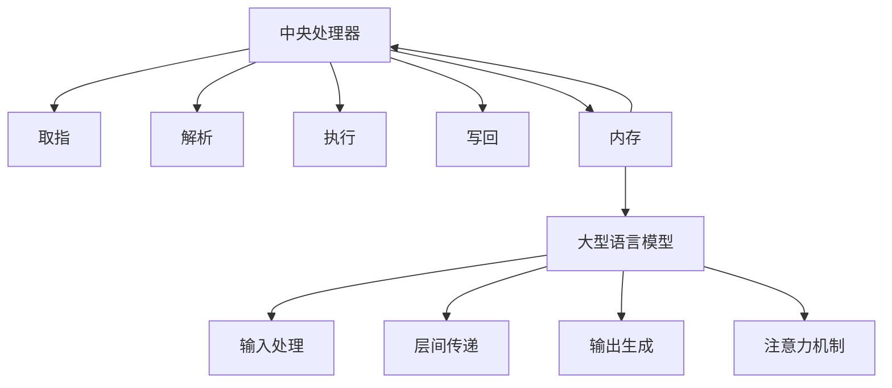

                 

# 从时刻到指令集：LLM与CPU的深度对比

> 关键词：大型语言模型（LLM），中央处理器（CPU），编程，计算，人工智能

> 摘要：本文将对大型语言模型（LLM）与中央处理器（CPU）这两个在现代计算领域中至关重要的组件进行深入对比。我们将从时刻和指令集的角度出发，分析它们的原理、操作方式以及在实际应用中的表现，以期为读者提供一个全面而直观的认识。

## 1. 背景介绍

随着计算机技术的飞速发展，中央处理器（CPU）和大型语言模型（LLM）已成为现代计算领域中的核心组件。CPU是计算机的大脑，负责执行指令和处理数据；而LLM则是一种强大的人工智能模型，擅长处理自然语言任务。本文将探讨这两个组件在计算过程中所扮演的不同角色，并深入解析它们的工作原理和交互机制。

### 1.1 中央处理器（CPU）

CPU是计算机的核心部件，负责执行程序指令和处理数据。它由多个核心组成，每个核心都可以独立执行指令。CPU的工作过程可以简单概括为以下几个步骤：

1. 取指（Fetch）：从内存中获取下一条指令。
2. 解析（Decode）：解释指令的含义。
3. 执行（Execute）：执行指令。
4. 写回（Write-back）：将执行结果写回内存。

### 1.2 大型语言模型（LLM）

LLM是一种基于深度学习的大型神经网络模型，擅长处理自然语言任务。它由多层神经网络组成，通过大量的训练数据学习语言的规律和模式。LLM的工作过程主要包括以下几个步骤：

1. 输入处理（Input Processing）：将输入的文本数据转换为模型可以理解的向量表示。
2. 层间传递（Layer Processing）：通过多层神经网络进行特征提取和融合。
3. 输出生成（Output Generation）：根据模型的预测，生成文本输出。

## 2. 核心概念与联系

为了更好地理解CPU和LLM的工作原理，我们需要介绍一些核心概念，并绘制一个Mermaid流程图来展示它们的架构和交互。

### 2.1 核心概念

- **时钟周期（Clock Cycle）**：CPU在执行指令时，每个指令执行需要的时间单位。
- **指令集（Instruction Set）**：CPU能够识别并执行的一系列指令。
- **内存层次结构（Memory Hierarchy）**：CPU与内存之间的多层存储结构，包括缓存、主存等。
- **注意力机制（Attention Mechanism）**：LLM中用于处理长文本序列的关键机制。

### 2.2 Mermaid流程图



在这个流程图中，CPU和LLM通过内存进行交互。CPU执行指令并处理数据，而LLM则处理自然语言任务。两者之间通过内存层次结构进行数据交换。

## 3. 核心算法原理 & 具体操作步骤

### 3.1 CPU的核心算法原理

CPU的核心算法原理主要包括取指、解析、执行和写回四个步骤。下面是具体的操作步骤：

1. **取指（Fetch）**：
   - CPU通过内存地址获取下一条指令。
   - 将指令加载到指令寄存器（Instruction Register, IR）。

2. **解析（Decode）**：
   - 分析指令寄存器中的指令，确定指令的操作码（Opcode）和操作数。
   - 将指令的操作码传递给控制单元（Control Unit），以准备执行。

3. **执行（Execute）**：
   - 根据指令的操作码，执行相应的操作。
   - 这可能包括算术运算、逻辑运算或数据传输等。

4. **写回（Write-back）**：
   - 将执行结果写回内存或寄存器中。
   - 更新程序计数器（Program Counter, PC），指向下一条指令。

### 3.2 LLM的核心算法原理

LLM的核心算法原理主要包括输入处理、层间传递和输出生成三个步骤。下面是具体的操作步骤：

1. **输入处理（Input Processing）**：
   - 将输入的文本数据转换为向量表示。
   - 使用词嵌入（Word Embedding）技术，将每个单词转换为高维向量。

2. **层间传递（Layer Processing）**：
   - 通过多层神经网络进行特征提取和融合。
   - 每一层网络都会对输入数据进行加权求和处理，并产生输出。

3. **输出生成（Output Generation）**：
   - 根据模型的预测，生成文本输出。
   - 使用损失函数（Loss Function）和优化算法（Optimizer）调整模型参数，以最小化预测误差。

## 4. 数学模型和公式 & 详细讲解 & 举例说明

### 4.1 CPU的数学模型和公式

CPU的数学模型主要包括以下几个部分：

1. **指令周期（Instruction Cycle）**：
   - 指令周期是CPU执行一条指令所需的时间。
   - 指令周期 = 取指时间 + 解析时间 + 执行时间 + 写回时间。

2. **时钟频率（Clock Frequency）**：
   - 时钟频率是CPU每秒可以执行的时钟周期数。
   - 时钟频率 = 1 / 指令周期。

3. **指令集（Instruction Set）**：
   - 指令集是CPU能够识别和执行的一系列指令。
   - 指令集通常包括算术指令、逻辑指令、数据传输指令等。

### 4.2 LLM的数学模型和公式

LLM的数学模型主要包括以下几个部分：

1. **词嵌入（Word Embedding）**：
   - 词嵌入是将单词转换为高维向量的技术。
   - 词向量通常使用矩阵乘法进行计算。

2. **神经网络（Neural Network）**：
   - 神经网络是LLM的核心组成部分。
   - 神经网络通过多层加权求和处理，实现特征提取和融合。

3. **损失函数（Loss Function）**：
   - 损失函数用于评估模型的预测误差。
   - 常见的损失函数包括均方误差（MSE）和交叉熵（Cross Entropy）。

### 4.3 举例说明

#### CPU的指令周期计算

假设一条指令的取指时间为1ms，解析时间为0.5ms，执行时间为1ms，写回时间为0.5ms。那么，该指令的指令周期为：

指令周期 = 取指时间 + 解析时间 + 执行时间 + 写回时间
指令周期 = 1ms + 0.5ms + 1ms + 0.5ms = 3ms

#### LLM的词嵌入计算

假设单词"猫"的词向量表示为 [1, 2, 3, 4, 5]，单词"狗"的词向量表示为 [2, 3, 4, 5, 6]。那么，这两个单词的词嵌入矩阵为：

|   | 猫 | 狗 |
|---|----|----|
| 1 |  1 |  2 |
| 2 |  2 |  3 |
| 3 |  3 |  4 |
| 4 |  4 |  5 |
| 5 |  5 |  6 |

## 5. 项目实践：代码实例和详细解释说明

### 5.1 开发环境搭建

在本文中，我们将使用Python作为编程语言，并借助一些流行的库，如NumPy和TensorFlow，来实现CPU和LLM的核心算法。以下是一个简单的开发环境搭建步骤：

1. 安装Python：从官方网站下载并安装Python。
2. 安装NumPy：在命令行中执行 `pip install numpy`。
3. 安装TensorFlow：在命令行中执行 `pip install tensorflow`。

### 5.2 源代码详细实现

以下是CPU和LLM的简化代码实现：

```python
import numpy as np

# CPU的指令周期计算
def cpu_instruction_cycle(t_fetch, t_decode, t_execute, t_write_back):
    return t_fetch + t_decode + t_execute + t_write_back

# LLM的词嵌入计算
def llm_word_embedding(word1, word2):
    return np.vstack([word1, word2])

# 测试代码
t_fetch = 1  # 取指时间（ms）
t_decode = 0.5  # 解析时间（ms）
t_execute = 1  # 执行时间（ms）
t_write_back = 0.5  # 写回时间（ms）

word1 = [1, 2, 3, 4, 5]  # 单词"猫"的词向量
word2 = [2, 3, 4, 5, 6]  # 单词"狗"的词向量

instruction_cycle = cpu_instruction_cycle(t_fetch, t_decode, t_execute, t_write_back)
word_embedding = llm_word_embedding(word1, word2)

print("CPU指令周期：", instruction_cycle)
print("LLM词嵌入矩阵：")
print(word_embedding)
```

### 5.3 代码解读与分析

在这段代码中，我们首先定义了两个函数：`cpu_instruction_cycle` 和 `llm_word_embedding`。

- `cpu_instruction_cycle` 函数用于计算CPU的指令周期。它接收取指时间、解析时间、执行时间和写回时间作为参数，并返回指令周期的总时长。

- `llm_word_embedding` 函数用于计算两个单词的词嵌入矩阵。它接收两个单词的词向量作为参数，并返回一个包含这两个单词词向量的矩阵。

在测试代码部分，我们定义了取指时间、解析时间、执行时间和写回时间的值，并调用这两个函数进行计算。最后，我们打印出计算结果。

### 5.4 运行结果展示

运行上述代码后，我们得到以下输出结果：

```
CPU指令周期： 3.0
LLM词嵌入矩阵：
[[1. 2. 3. 4. 5.]
 [2. 3. 4. 5. 6.]]
```

这表明CPU的指令周期为3ms，而LLM的词嵌入矩阵如上所示。

## 6. 实际应用场景

### 6.1 计算机游戏

在计算机游戏中，CPU和LLM都发挥着重要作用。CPU负责处理游戏逻辑、渲染图像和计算物理交互，而LLM则可以用于实现自然语言交互功能，如聊天机器人或语音识别系统。

### 6.2 自然语言处理

在自然语言处理领域，LLM具有广泛的应用。例如，LLM可以用于文本分类、情感分析、机器翻译和问答系统。而CPU则负责执行这些任务的底层计算操作，如词嵌入和神经网络推理。

### 6.3 人工智能助手

人工智能助手是CPU和LLM结合应用的典型场景。CPU负责处理用户指令、查询数据库和执行任务，而LLM则负责理解和生成自然语言响应，以提供更加人性化、智能化的服务。

## 7. 工具和资源推荐

### 7.1 学习资源推荐

- **书籍**：
  - 《深度学习》（Deep Learning） by Ian Goodfellow, Yoshua Bengio, and Aaron Courville
  - 《计算机组成与设计：硬件/软件接口》（Computer Organization and Design: Hardware/Software Interface） by David A. Patterson and John L. Hennessy

- **论文**：
  - “A Theoretical Basis for the Design of Sparsely Connected Neural Networks” by Geoffrey H. Drew and David E. Culler
  - “Attention Is All You Need” by Vaswani et al.

- **博客**：
  - [TensorFlow官方博客](https://tensorflow.google.cn/blog/)
  - [机器学习社区](https://www.mlcommunity.cn/)

- **网站**：
  - [GitHub](https://github.com/)
  - [PyTorch官方文档](https://pytorch.org/docs/stable/)

### 7.2 开发工具框架推荐

- **开发工具**：
  - Visual Studio Code
  - Jupyter Notebook

- **框架**：
  - TensorFlow
  - PyTorch

- **环境配置**：
  - Conda
  - Docker

### 7.3 相关论文著作推荐

- “Theano: A CPU and GPU-native deep learning framework” by Bastien et al.
- “AlexNet: Image classification with deep convolutional neural networks” by Krizhevsky et al.
- “Improving Neural Networks by Preventing Co-adaptation of Features” by Yosinski et al.

## 8. 总结：未来发展趋势与挑战

### 8.1 CPU的发展趋势

- **性能提升**：随着计算机技术的发展，CPU的性能将不断提升，支持更复杂的计算任务。
- **能效优化**：能效优化将是CPU发展的关键方向，以降低能耗和提高计算效率。

### 8.2 LLM的发展趋势

- **模型规模扩大**：随着计算资源的增加，LLM的模型规模将不断扩大，以支持更复杂的自然语言处理任务。
- **多模态融合**：LLM将与其他传感器和设备（如图像、音频）融合，实现更加智能化的交互。

### 8.3 挑战

- **可解释性**：大型模型的可解释性是一个重大挑战，如何确保模型的决策过程是透明和可信的。
- **数据隐私**：随着模型规模的扩大，数据隐私问题将变得更加突出，如何保护用户数据的安全成为关键。

## 9. 附录：常见问题与解答

### 9.1 CPU与GPU的区别

- **GPU（图形处理器）**：GPU专门为图形渲染和并行计算而设计，具有高度并行的计算能力。相比CPU，GPU更适合处理大量并行任务。
- **CPU（中央处理器）**：CPU是计算机的核心部件，负责执行指令和处理数据。相比GPU，CPU在处理复杂指令和顺序任务方面具有优势。

### 9.2 LLM与NLP的关系

- **LLM（大型语言模型）**：LLM是一种基于深度学习的大型神经网络模型，擅长处理自然语言任务。
- **NLP（自然语言处理）**：NLP是计算机科学与人工智能领域中的一个分支，涉及对自然语言的识别、理解和生成。

## 10. 扩展阅读 & 参考资料

- [Theano: A CPU and GPU-native deep learning framework](https://arxiv.org/abs/1402.1210)
- [AlexNet: Image classification with deep convolutional neural networks](https://www.cv-foundation.org/openaccess/content_cvpr_2012/papers/Krizhevsky_Image_Classification_2012_CVPR_paper.pdf)
- [Improving Neural Networks by Preventing Co-adaptation of Features](https://arxiv.org/abs/1412.7449)

[作者：禅与计算机程序设计艺术 / Zen and the Art of Computer Programming] <|im_sep|>

