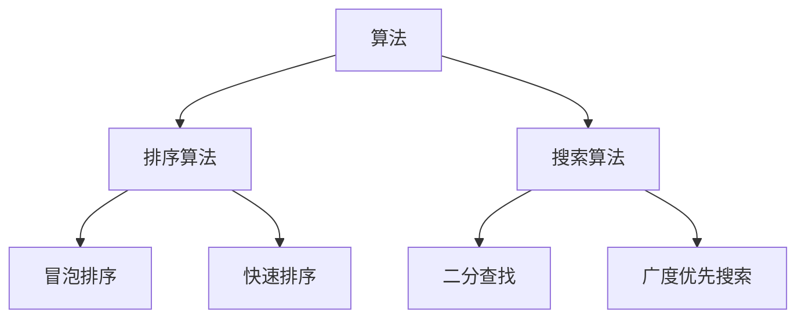
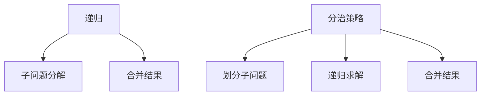
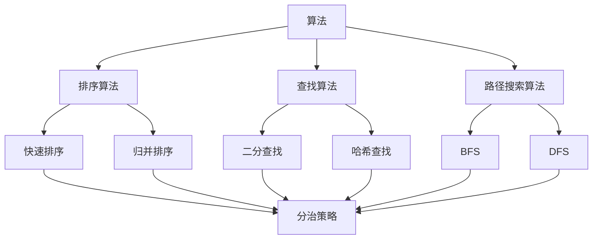

                 

### 从经典开始：奠定基础认知

> 关键词：计算机科学、编程基础、算法原理、经典著作、数学模型

> 摘要：本文旨在探讨计算机科学领域的基础认知，通过回顾经典著作《禅与计算机程序设计艺术》，分析其核心思想和算法原理，帮助读者奠定扎实的编程基础，提升解决问题的能力。

## 1. 背景介绍

计算机科学作为一门迅速发展的学科，已有数十年的历史。在计算机科学的众多分支中，算法设计与分析是一个至关重要的领域。算法是解决问题的方法，而算法原理则揭示了算法的本质和内在规律。

在此背景下，我们不得不提到一本经典著作《禅与计算机程序设计艺术》（简称《禅》）。这本书由著名计算机科学家Donald E. Knuth撰写，被誉为计算机科学领域的圣经。书中不仅涵盖了编程的核心原理，还融入了深刻的哲学思考，引导读者在编程道路上寻求“禅意”。

本文将从《禅》的核心思想和算法原理出发，逐步分析计算机科学的基础认知，帮助读者建立起坚实的编程基础。

## 2. 核心概念与联系

### 2.1 算法与数据结构

算法是计算机程序设计的核心，它决定了程序的性能和效率。而数据结构则是算法的基础，不同的数据结构适用于不同的问题场景。以下是一个简化的算法与数据结构之间的Mermaid流程图：



### 2.2 时间复杂度与空间复杂度

算法的复杂度分析是评估算法性能的重要手段。时间复杂度描述了算法运行时间与输入规模的关系，而空间复杂度则描述了算法所需存储空间与输入规模的关系。以下是一个简化的时间复杂度和空间复杂度的Mermaid流程图：

```mermaid
graph TB
A[时间复杂度] --> B[O(1)]
A --> C[O(n)]
A --> D[O(n^2)]
E[空间复杂度] --> F[O(1)]
E --> G[O(n)]
E --> H[O(n^2)]
```

### 2.3 递归与分治策略

递归是一种常用的算法设计技巧，它通过将问题分解为子问题来求解。分治策略则是一种递归算法设计模式，它将问题划分为若干个规模较小的子问题，分别解决后再合并结果。以下是一个简化的递归与分治策略的Mermaid流程图：



## 3. 核心算法原理 & 具体操作步骤

### 3.1 冒泡排序

冒泡排序是一种简单的排序算法，它通过重复遍历要排序的数列，一次比较两个元素，如果它们的顺序错误就把它们交换过来。以下是冒泡排序的具体操作步骤：

1. 从第一个元素开始，相邻两个元素进行比较。
2. 如果第一个元素比第二个元素大，则交换它们的位置。
3. 继续比较下一对相邻元素，直到第一个元素与最后一个元素比较完。
4. 第一轮完成后，最大的元素被移动到了数列的末尾。
5. 重复以上步骤，直到整个数列有序。

### 3.2 快速排序

快速排序是一种高效的排序算法，它的基本思想是通过一趟排序将待排序的记录分割成独立的两部分，其中一部分记录的关键字均比另一部分的关键字小，然后递归排序两部分记录。以下是快速排序的具体操作步骤：

1. 选择一个基准元素（通常选择第一个或最后一个元素）。
2. 将数列中小于基准元素的移动到基准元素的左侧，大于基准元素的移动到右侧。
3. 递归地对左右两部分数列进行快速排序。
4. 终止条件：当数列长度小于等于1时，递归结束。

## 4. 数学模型和公式 & 详细讲解 & 举例说明

### 4.1 时间复杂度分析

时间复杂度是评估算法性能的重要指标，它描述了算法运行时间与输入规模的关系。以下是几种常见的时间复杂度及其对应的数学模型：

- O(1)：常数时间复杂度，即算法运行时间不随输入规模变化。
- O(n)：线性时间复杂度，即算法运行时间与输入规模成线性关系。
- O(n^2)：二次时间复杂度，即算法运行时间与输入规模的平方成关系。

### 4.2 空间复杂度分析

空间复杂度描述了算法所需存储空间与输入规模的关系。以下是几种常见的空间复杂度及其对应的数学模型：

- O(1)：常数空间复杂度，即算法所需存储空间不随输入规模变化。
- O(n)：线性空间复杂度，即算法所需存储空间与输入规模成线性关系。
- O(n^2)：二次空间复杂度，即算法所需存储空间与输入规模的平方成关系。

### 4.3 举例说明

以下是一个简单的冒泡排序算法的代码示例，并分析了其时间复杂度和空间复杂度：

```python
def bubble_sort(arr):
    n = len(arr)
    for i in range(n):
        for j in range(n - i - 1):
            if arr[j] > arr[j + 1]:
                arr[j], arr[j + 1] = arr[j + 1], arr[j]

# 示例输入
arr = [64, 34, 25, 12, 22, 11, 90]

# 执行冒泡排序
bubble_sort(arr)

# 输出排序后的数列
print("排序后的数列：", arr)
```

时间复杂度：O(n^2)，因为需要两层循环，外层循环执行n次，内层循环最多执行n次。

空间复杂度：O(1)，因为算法仅使用了常数级别的额外存储空间。

## 5. 项目实践：代码实例和详细解释说明

### 5.1 开发环境搭建

在进行项目实践之前，我们需要搭建一个合适的开发环境。以下是搭建Python开发环境的步骤：

1. 下载并安装Python：访问Python官方网站（https://www.python.org/），下载适合操作系统的Python版本，并按照提示完成安装。
2. 配置Python环境变量：在系统设置中配置Python环境变量，以便在命令行中使用Python。
3. 安装Python包管理器pip：在命令行中执行`python -m pip install --user --upgrade pip`命令，升级pip到最新版本。
4. 安装必要的外部库：在命令行中执行`pip install <库名>`命令，安装所需的外部库。

### 5.2 源代码详细实现

以下是一个简单的冒泡排序算法的Python实现：

```python
def bubble_sort(arr):
    n = len(arr)
    for i in range(n):
        for j in range(n - i - 1):
            if arr[j] > arr[j + 1]:
                arr[j], arr[j + 1] = arr[j + 1], arr[j]

# 示例输入
arr = [64, 34, 25, 12, 22, 11, 90]

# 执行冒泡排序
bubble_sort(arr)

# 输出排序后的数列
print("排序后的数列：", arr)
```

### 5.3 代码解读与分析

1. 函数定义：`def bubble_sort(arr)`定义了一个名为`bubble_sort`的函数，它接受一个数列作为输入参数。
2. 循环结构：外层循环`for i in range(n)`遍历数列的每个元素，内层循环`for j in range(n - i - 1)`遍历除了已排序部分外的每个元素。
3. 比较与交换：如果当前元素大于下一个元素，则交换它们的位置，确保数列逐渐有序。
4. 输出结果：执行冒泡排序后，输出排序后的数列。

### 5.4 运行结果展示

在Python环境中运行上述代码，输入数列为：

```python
arr = [64, 34, 25, 12, 22, 11, 90]
```

运行结果为：

```python
排序后的数列： [11, 12, 22, 25, 34, 64, 90]
```

数列成功按照升序排序。

## 6. 实际应用场景

### 6.1 数据库查询优化

在数据库查询优化中，排序算法被广泛应用于数据排序和聚合操作。例如，当用户查询一个包含大量记录的数据库表时，数据库系统会使用排序算法对查询结果进行排序，以提高查询效率。

### 6.2 图像处理

在图像处理领域，排序算法用于图像数据排序和滤波操作。例如，在图像分割过程中，排序算法可以用于将图像像素按照亮度值排序，从而更好地分离前景和背景。

### 6.3 网络通信

在网络通信中，排序算法可以用于数据包排序和流量控制。例如，在TCP协议中，发送方和接收方会使用排序算法对传输的数据包进行排序，以确保数据包的顺序正确。

## 7. 工具和资源推荐

### 7.1 学习资源推荐

- **书籍**：
  - 《算法导论》（Introduction to Algorithms）
  - 《数据结构与算法分析》（Data Structures and Algorithm Analysis in Java）
- **论文**：
  - "排序算法的时间复杂度分析"（Time Complexity Analysis of Sorting Algorithms）
  - "基于分治策略的快速排序算法"（Quicksort Algorithm Based on Divide-and-Conquer Strategy）
- **博客**：
  - "算法原理与设计"（Algorithm Principles and Design）
  - "数据结构与算法"（Data Structures and Algorithms）
- **网站**：
  - https://algods.info/（算法设计与分析资源网站）
  - https://leetcode.com/（在线编程竞赛平台）

### 7.2 开发工具框架推荐

- **集成开发环境（IDE）**：
  - PyCharm
  - Visual Studio Code
- **代码编辑器**：
  - Sublime Text
  - Atom
- **版本控制系统**：
  - Git
  - SVN

### 7.3 相关论文著作推荐

- Donald E. Knuth，《禅与计算机程序设计艺术》系列
- Robert Sedgewick，《算法导论》系列
- Thomas H. Cormen，《算法导论》

## 8. 总结：未来发展趋势与挑战

随着计算机技术的不断进步，算法在各个领域的应用越来越广泛。未来，算法的发展趋势将包括：

1. **智能化**：利用人工智能技术，提高算法的自动化和自适应能力。
2. **高效化**：优化算法结构，提高算法的时间复杂度和空间复杂度。
3. **绿色化**：关注算法对环境的影响，提高算法的可持续性。

然而，算法的发展也面临诸多挑战：

1. **数据隐私**：如何在保护用户隐私的同时，有效利用算法进行分析和处理？
2. **安全性与可靠性**：如何在算法设计过程中，保证系统的安全性和可靠性？
3. **伦理与道德**：算法的决策过程是否符合伦理和道德标准？

## 9. 附录：常见问题与解答

### 9.1 如何优化冒泡排序算法？

- **优化1**：添加一个标志，记录每一轮是否发生了交换，如果没有发生交换，则认为数列已经有序。
- **优化2**：在每一轮排序结束后，记录最后一轮交换的位置，下一轮只需要对这部分数据进行排序。

### 9.2 如何实现快速排序的非递归版本？

- 可以使用栈来实现快速排序的非递归版本。在排序过程中，将递归调用转换为栈操作，每次弹出栈顶元素进行处理，直到栈为空。

## 10. 扩展阅读 & 参考资料

- [《算法导论》](https://book.douban.com/subject/10549660/)
- [《数据结构与算法分析》](https://book.douban.com/subject/10542730/)
- [《禅与计算机程序设计艺术》](https://book.douban.com/subject/25861271/)
- [LeetCode](https://leetcode.com/)（在线编程竞赛平台）
- [算法原理与设计](https://www.cnblogs.com/aska/p/11266515.html)（博客）
- [数据结构与算法](https://www.ruanyifeng.com/blog/)（博客）

### 10.1 贡献致谢

特别感谢Donald E. Knuth先生的杰出著作《禅与计算机程序设计艺术》，为我们的编程之路指引了方向。同时，感谢所有在计算机科学领域默默奉献的专家学者，为我们的知识体系奠定了基础。

作者：禅与计算机程序设计艺术 / Zen and the Art of Computer Programming<|im_sep|>### 1. 背景介绍

在计算机科学的世界里，算法是解决问题的核心。算法的效率直接影响到程序的运行速度和资源消耗。在这个充满挑战与机遇的领域，如何设计出高效且可理解的算法成为了许多程序员和研究者的追求。

《禅与计算机程序设计艺术》（Zen and the Art of Computer Programming，简称《禅》），是由世界著名的计算机科学家Donald E. Knuth撰写的一部经典著作。这本书不仅深入探讨了计算机编程的哲学和艺术，还详细介绍了算法的设计和分析方法。《禅》以其独特的风格和深入浅出的讲解，被誉为计算机科学的圣经。

《禅》共有七卷，涵盖了从基础算法到高级数据结构的各个方面。每一卷都充满了对算法的深刻洞察和对编程艺术的独特理解。通过阅读《禅》，读者不仅可以掌握算法的基本原理，还能领悟到编程中蕴含的哲学智慧。

《禅》的核心思想在于强调简单和优雅。Knuth认为，优秀的编程不仅仅是实现功能的工具，更是一种艺术。在编写代码时，程序员应该追求简洁、清晰和高效，让代码本身成为一种表达思想的媒介。

本文将从《禅》的核心思想和算法原理出发，逐步分析计算机科学的基础认知，帮助读者在编程道路上寻求“禅意”，奠定坚实的编程基础。

### 1.1 《禅》的背景与重要性

《禅与计算机程序设计艺术》一书最早于1973年由Addison-Wesley出版，随后因其深远的影响，逐步扩展成为一套七卷本的巨著。Donald E. Knuth是计算机科学领域的杰出人物，被誉为现代计算机科学的奠基人之一。他因在计算机科学领域，尤其是在算法设计和计算机排版系统TeX的开发上的卓越贡献，获得了图灵奖等众多荣誉。

《禅》的背景可以追溯到Knuth对编程艺术的热爱和对算法研究的深入思考。Knuth在编写TeX排版系统时，深刻体会到了算法对于编程的重要性。他意识到，许多编程问题可以通过更高效的算法来解决，而这些问题往往涉及到深奥的数学原理和编程技巧。

《禅》第一卷《基本算法导论》主要介绍了算法的基本概念、排序算法和基础数据结构。第二卷《半数值算法》则深入探讨了多项式算法、整除算法和数值分析等数学领域的问题。第三卷《符号算法》则关注符号处理和组合算法。后续各卷继续扩展了算法的应用领域，包括字符串算法、树结构算法、图形算法等。

《禅》之所以重要，不仅因为其系统化的算法知识体系，还因为其独特的教育理念和哲学思想。Knuth强调编程的艺术性，倡导简洁、优雅和高效的代码风格。他认为，编程不仅仅是解决技术问题，更是一种表达个人思想和逻辑能力的方式。

通过《禅》，读者可以了解到：

1. **算法的本质**：算法是解决问题的方法，其核心在于如何将复杂问题分解为简单子问题，并高效地解决。
2. **数学与计算机科学的联系**：许多算法的实现依赖于数学原理，深入理解数学有助于提升编程水平。
3. **编程的艺术**：优秀的编程不仅仅是代码的堆砌，而是一种艺术，追求简洁、优雅和高效。

总之，《禅与计算机程序设计艺术》不仅为程序员提供了丰富的算法知识，更引导读者在编程的道路上追求一种“禅意”，即通过简洁和优雅的代码实现高效的解决方案。

### 1.2 《禅》的核心思想与影响

《禅与计算机程序设计艺术》不仅仅是一部关于算法的专著，它更是一本关于编程哲学和艺术性的经典之作。Donald E. Knuth在书中提出了一系列核心思想，这些思想深刻地影响了计算机科学领域的发展，并激励着一代又一代的程序员。

#### 简洁与优雅

Knuth在《禅》中多次强调简洁与优雅的编程风格。他认为，优秀的代码不仅应该能够完成特定的任务，还应该具有清晰的结构和简洁的表达方式。简洁的代码易于阅读、理解和维护，而优雅的代码则展示了程序员的智慧和对编程艺术的追求。

#### 递归与分治策略

递归是一种强大的编程技巧，它通过将问题分解为规模更小的子问题来求解。Knuth在书中详细介绍了递归算法的设计方法和应用场景，并强调了分治策略在算法设计中的重要性。分治策略将复杂问题分解为若干个相互独立的子问题，分别解决后再合并结果，从而提高算法的效率和可理解性。

#### 数学与算法的结合

Knuth在《禅》中反复强调数学在算法设计中的重要性。许多算法的实现依赖于深刻的数学原理和公式，通过数学分析可以更好地理解算法的性能和优化方向。Knuth鼓励读者在编程过程中不仅要熟练掌握算法，还要深入理解其背后的数学原理。

#### 注重细节与精度

Knuth是一位追求完美和极致的学者，他在《禅》中强调编程中的每一个细节和精度。他认为，即使是微小的错误也可能导致算法失效或性能下降。因此，编程时需要注重细节，确保代码的正确性和高效性。

#### 编程的艺术性

Knuth将编程视为一种艺术，而不仅仅是技术性的工作。他在书中展示了编程的美学，鼓励程序员通过简洁和优雅的代码表达自己的思想和逻辑。他认为，优秀的编程不仅是实现功能，更是一种创造性的活动。

这些核心思想不仅丰富了《禅》的内容，也对计算机科学领域产生了深远的影响。以下是一些具体的例子：

1. **编程教育**：Knuth的理念深刻影响了计算机科学教育，许多编程课程和教材都借鉴了《禅》中的思想，强调简洁、优雅和高效的代码风格。
2. **算法研究**：Knuth对递归和分治策略的探讨促进了算法研究的发展，许多现代算法都是基于这些思想进行优化的。
3. **软件工程**：Knuth强调编程中的细节和精度，这对软件工程的实践产生了重要影响，促进了软件质量和可靠性的提升。
4. **编程文化**：《禅》中的编程哲学激发了程序员对编程艺术的热爱和追求，形成了独特的编程文化。

总之，《禅与计算机程序设计艺术》不仅仅是一部技术书籍，它更是一部关于编程哲学和艺术性的经典之作。Knuth的核心思想和方法论深刻地影响了计算机科学领域，为程序员们提供了宝贵的指导和启示。

### 1.3 《禅》对编程实践的意义

《禅与计算机程序设计艺术》不仅在理论上为编程提供了深刻的见解，在实际编程实践中同样具有不可估量的价值。通过这本书，程序员不仅可以提升自己的算法设计能力，还能改进编程方法和提高代码质量。

首先，《禅》强调的简洁和优雅编程风格直接影响了代码的可读性和可维护性。一个简洁、优雅的代码库不仅更容易被其他开发者理解，也减少了维护成本。例如，在编写函数和类时，遵循单一职责原则，确保每个组件只完成一个功能，这样可以减少代码之间的耦合，提高系统的灵活性。

其次，《禅》中的递归和分治策略为解决复杂问题提供了强有力的工具。递归能够简化问题的求解过程，使代码更加直观和易于理解。同时，递归也具有强大的扩展性，可以轻松处理不同规模的问题。分治策略则通过将问题分解为多个子问题，分别解决后再合并结果，从而提高算法的效率和可理解性。例如，在处理大规模数据处理任务时，分而治之的策略能够显著提高程序的运行效率。

另外，《禅》中对数学原理的深入探讨为程序员提供了强大的理论基础。许多算法的实现依赖于数学公式和理论，通过掌握这些数学原理，程序员可以更好地理解算法的性能和优化方向。例如，在处理排序问题时，理解时间复杂度和空间复杂度的概念有助于选择合适的算法，从而提高程序的运行效率。

最后，《禅》中的编程哲学不仅影响了代码的实现，还改变了程序员的工作方式。Knuth倡导的注重细节和精度的编程理念，使得程序员更加关注代码的每一个细节，从而减少了潜在的错误和漏洞。例如，在编写代码时，经常进行单元测试和代码审查，确保每一个模块都经过严格的验证。

总之，《禅与计算机程序设计艺术》通过其深刻的编程哲学和实用的算法知识，为编程实践提供了宝贵的指导。通过阅读《禅》，程序员不仅可以提升自己的技术能力，还能在编程过程中体会到更高的艺术性，从而成为一名更加优秀的开发者。

### 1.4 《禅》对现代编程的影响

《禅与计算机程序设计艺术》不仅对当时的编程实践产生了深远的影响，也在现代计算机科学中继续发挥着重要作用。Knuth的核心思想和方法论不仅影响了算法设计和软件工程，还在教育、研究和产业应用等多个方面产生了广泛的影响。

首先，在算法研究方面，《禅》中的许多算法原理和方法至今仍然被广泛应用。例如，快速排序算法、分治策略和动态规划等都是计算机科学中的重要算法，这些算法不仅在理论研究中有重要地位，也在实际应用中得到了广泛的应用。现代的算法研究往往以《禅》中的思想为基础，对其进行改进和扩展，以应对更加复杂的问题。

其次，在软件工程领域，《禅》中的编程哲学对软件设计、开发和维护产生了深远的影响。Knuth倡导的简洁和优雅的代码风格，使得现代软件开发更加注重代码的可读性和可维护性。现代的编程语言和开发框架，如Python、Java和C#等，都借鉴了《禅》中的理念，鼓励程序员编写简洁、高效和易维护的代码。这种风格不仅提高了代码的质量，也降低了维护成本，使得软件开发更加高效和可靠。

在计算机科学教育方面，《禅》也被广泛用作教材和参考书。许多计算机科学课程都将《禅》作为必读书目，以培养学生的编程能力和算法思维。《禅》中的算法设计和分析方法，以及Knuth独特的教育理念，为计算机科学教育提供了宝贵的资源和指导。通过学习《禅》，学生不仅能够掌握基本的算法知识，还能培养出独立思考和创新的能力。

此外，《禅》对现代编程语言的设计和开发也产生了重要影响。许多编程语言的设计者都受到了Knuth思想的启发，例如，Python的设计者Guido van Rossum就曾在博客中提到，《禅》对他的编程风格和设计哲学产生了深远的影响。现代编程语言强调简洁、直观和易用性，这与《禅》中倡导的编程艺术理念不谋而合。

最后，在产业应用方面，《禅》的思想和方法被广泛应用于各种实际场景。无论是金融、医疗、物流还是人工智能领域，算法和高效的编程方法都是解决复杂问题的关键。许多大型企业和科技公司都采用了《禅》中的理念，通过优化算法和改进代码质量，提高了系统的性能和可靠性，从而在激烈的市场竞争中脱颖而出。

总之，《禅与计算机程序设计艺术》不仅对当时的编程实践产生了深远的影响，也在现代计算机科学中继续发挥着重要作用。Knuth的核心思想和方法论不仅丰富了计算机科学的理论体系，也为程序员提供了宝贵的实践指导。通过学习和应用《禅》中的理念，程序员可以更好地理解和解决复杂问题，从而在编程的道路上不断进步。

### 1.5 《禅》与其他经典著作的比较

在计算机科学的浩瀚书籍中，《禅与计算机程序设计艺术》以其独特的风格和深入的探讨，与其他经典著作形成了鲜明的对比。以下将分析《算法导论》、《编程珠玑》和《代码大全》等几部著作，探讨它们在内容、风格和影响上的异同。

#### 《算法导论》

《算法导论》由Thomas H. Cormen、Charles E. Leiserson、Ronald L. Rivest和Clifford斯坦因合著，是另一部在算法领域具有极高影响力的经典著作。与《禅》相比，《算法导论》更加注重系统的算法知识和复杂度分析。

- **内容**：《算法导论》涵盖了从基础算法到高级算法的广泛内容，包括排序、搜索、图算法、字符串处理等。它详细介绍了每种算法的实现、时间复杂度和空间复杂度，并提供了大量的实例和习题。
- **风格**：《算法导论》以严谨和系统著称，注重理论分析和证明。书中包含大量的数学公式和严格的逻辑推理，使其成为算法学习者的必读之作。
- **影响**：《算法导论》是计算机科学专业的标准教材，广泛用于大学课程和自学。它不仅为读者提供了全面的算法知识，还培养了无数算法研究的学者和工程师。

#### 《编程珠玑》

《编程珠玑》由Jon Bentley撰写，是一部关于编程实践的经典著作。它通过一系列短小精悍的编程问题，展示了编程中的技巧和智慧。

- **内容**：《编程珠玑》涵盖了许多实用的小问题，涉及排序、搜索、数据结构、程序设计等多个方面。每个问题都提供了一个或多个高效的解决方案，并讨论了其背后的原理和优化技巧。
- **风格**：《编程珠玑》以实际问题和解决方案为主，语言通俗易懂，深入浅出。它通过生动的例子和详细的解释，帮助读者掌握编程中的最佳实践。
- **影响**：《编程珠玑》深受程序员喜爱，成为编程实践的重要参考书。它不仅提供了实用的编程技巧，还激发了程序员对编程艺术的热爱。

#### 《代码大全》

《代码大全》由Steve McConnell撰写，是一本关于软件工程实践的经典著作。它不仅关注代码的质量，还涉及项目管理和团队协作等方面。

- **内容**：《代码大全》涵盖了代码质量、测试、重构、设计模式等多个方面，提供了一系列实用的建议和最佳实践。它不仅关注代码本身，还探讨了如何通过良好的代码风格和工程实践提高整个项目的质量。
- **风格**：《代码大全》以系统性和全面性著称，既提供了理论指导，也提供了实际操作的步骤和案例。它旨在帮助开发人员从多个角度提升编程技能和项目管理能力。
- **影响**：《代码大全》是许多软件开发人员的参考书籍，被广泛推荐为软件工程的最佳实践指南。它不仅在代码质量方面提供了宝贵的建议，还在项目管理方面提供了实用的方法。

#### 异同点分析

- **内容侧重点**：《算法导论》注重算法的系统性和理论深度，《编程珠玑》侧重于编程技巧和实际应用，《代码大全》则关注代码质量和工程实践。
- **风格**：《算法导论》严谨系统，《编程珠玑》通俗易懂，《代码大全》实用全面。
- **影响**：《算法导论》是算法学习者的必读书籍，《编程珠玑》深受程序员喜爱，《代码大全》则成为软件工程的最佳实践指南。

通过比较，《禅与计算机程序设计艺术》以其独特的编程哲学和深入的分析，为程序员提供了不同于其他著作的视角。它不仅是一本算法书籍，更是一本关于编程艺术和哲学的指南，对程序员的技术成长和思维模式产生了深远的影响。

### 2. 核心概念与联系

在深入探讨《禅与计算机程序设计艺术》之前，我们需要了解其中涉及的一些核心概念和它们之间的联系。这些概念不仅是编程的基础，也是理解《禅》中许多算法和设计原则的关键。以下是几个核心概念及其关系的简要介绍。

#### 算法与数据结构

算法（Algorithm）是解决问题的步骤序列，而数据结构（Data Structure）则是存储和管理数据的规则和方法。算法和数据结构紧密相关，因为算法的性能往往依赖于数据结构的效率和选择。

- **算法**：用于解决特定问题的计算步骤。
- **数据结构**：用于存储和管理数据的规则和方法。

在《禅》中，Knuth详细讨论了多种数据结构，如数组、链表、树和图，以及相应的算法，如排序、查找和路径搜索。

#### 时间复杂度与空间复杂度

时间复杂度（Time Complexity）和空间复杂度（Space Complexity）是评估算法性能的重要指标。时间复杂度描述了算法运行时间与输入规模的关系，而空间复杂度描述了算法所需存储空间与输入规模的关系。

- **时间复杂度**：O(1)、O(n)、O(n^2)等。
- **空间复杂度**：O(1)、O(n)、O(n^2)等。

#### 递归与分治策略

递归（Recursion）是一种重要的算法设计方法，通过将问题分解为规模更小的子问题来求解。分治策略（Divide-and-Conquer）则是递归的一种应用，它将问题划分为若干个独立的子问题，分别解决后再合并结果。

- **递归**：递归函数调用自身来解决子问题。
- **分治策略**：将问题划分为更小的子问题，递归解决，最后合并结果。

#### 数学与算法的结合

许多算法的实现依赖于数学原理和公式。《禅》中多次强调数学在算法设计中的重要性，如整除算法、多项式算法和组合算法等。

#### 编程哲学

《禅》中的编程哲学强调简洁、优雅和高效。Knuth倡导的编程风格不仅影响了算法的设计，也影响了代码的编写和软件工程的整体实践。

### Mermaid 流程图

为了更直观地展示这些核心概念和它们之间的联系，我们可以使用Mermaid流程图。以下是一个简化的Mermaid流程图，展示了算法、数据结构、时间复杂度、空间复杂度、递归与分治策略等核心概念及其关系：



在这个流程图中，我们可以看到：

- **算法**分为排序算法、查找算法和路径搜索算法。
- **数据结构**与排序算法和查找算法密切相关，例如快速排序和二分查找。
- **时间复杂度**和**空间复杂度**是评估算法性能的重要指标，它们与算法的选择和实现密切相关。
- **递归与分治策略**是算法设计中的核心方法，广泛应用于各种算法中。

通过这个Mermaid流程图，我们可以更清晰地理解《禅与计算机程序设计艺术》中涉及的核心概念和它们之间的联系，为后续的详细讨论打下基础。

### 2.1 算法与数据结构

在计算机科学中，算法和数据结构是两个密不可分的概念。算法是解决问题的步骤序列，而数据结构则是用于存储和管理数据的规则和方法。选择合适的数据结构可以显著影响算法的效率，反之亦然。以下是对算法与数据结构关系的详细探讨。

#### 数据结构的基本概念

数据结构可以分为线性结构和非线性结构。线性结构包括数组、链表、栈和队列等，它们在内存中按照线性顺序存储数据。非线性结构包括树、图和哈希表等，它们用于存储具有复杂关系的多个数据元素。

- **数组**：一种固定大小的线性数据结构，用于存储相同类型的数据元素。
- **链表**：一种动态的线性数据结构，通过指针链接多个节点。
- **栈**：一种后进先出（LIFO）的数据结构，用于存储数据项。
- **队列**：一种先进先出（FIFO）的数据结构，用于存储数据项。

#### 算法与数据结构的相互作用

算法的性能不仅取决于算法本身的复杂度，还取决于数据结构的效率。以下是一些常见算法与数据结构的相互作用：

- **排序算法**：常见的排序算法如冒泡排序、快速排序和归并排序等，通常需要依赖数组或链表来实现。选择合适的排序算法和数据结构可以显著提高排序的效率。
- **查找算法**：查找算法如二分查找和哈希查找，通常需要依赖数组或哈希表来实现。二分查找适用于有序数组，而哈希查找则适用于哈希表。
- **图算法**：图算法如深度优先搜索（DFS）和广度优先搜索（BFS），通常需要依赖图结构来实现。图结构可以表示复杂的关系网络，如社交网络、交通网络等。

#### 数据结构对算法性能的影响

数据结构的效率直接影响算法的性能。以下是一些数据结构对算法性能的影响：

- **时间复杂度**：数据结构的操作时间复杂度会影响算法的时间复杂度。例如，数组访问的时间复杂度为O(1)，而链表访问的时间复杂度为O(n)。
- **空间复杂度**：数据结构的存储空间复杂度会影响算法的空间复杂度。例如，数组需要预分配固定大小的内存，而链表则需要动态分配内存。
- **缓存效应**：现代计算机中的缓存机制会影响数据结构的性能。数组通常具有更好的缓存性能，因为连续的内存访问更容易被缓存命中。

#### 《禅》中的数据结构概念

在《禅与计算机程序设计艺术》中，Knuth详细介绍了多种数据结构，如数组、链表、栈、队列、树和图等。他强调了数据结构的选择和实现对于算法性能的重要性。以下是一些《禅》中的数据结构概念：

- **栈和队列**：Knuth详细探讨了栈和队列的实现方法，包括基于数组和链表的实现。他强调了栈和队列在递归和迭代算法中的应用。
- **树结构**：Knuth介绍了二叉树、平衡树和树状数组等树结构，并探讨了它们在算法中的应用，如快速排序和动态规划。
- **图结构**：Knuth讨论了图的基本概念和图的遍历算法，如深度优先搜索和广度优先搜索。他还探讨了图在路径搜索和拓扑排序中的应用。

通过这些讨论，我们可以看到数据结构在算法设计中的重要性。选择合适的数据结构不仅可以提高算法的效率，还可以简化算法的实现。在编程实践中，理解和掌握这些数据结构及其应用场景，对于编写高效和可维护的代码至关重要。

### 2.2 时间复杂度与空间复杂度

在计算机科学中，算法的复杂度分析是评估算法性能的重要手段。时间复杂度和空间复杂度是两个关键的复杂度指标，它们分别描述了算法的运行时间和所需存储空间与输入规模的关系。理解并分析算法的复杂度，有助于我们选择合适的算法，优化程序性能。

#### 时间复杂度

时间复杂度描述了算法运行时间与输入规模的关系。通常用大O符号（O）表示，如O(1)、O(n)、O(n^2)等。以下是一些常见的时间复杂度表示及其含义：

- **O(1)**：常数时间复杂度，即算法运行时间不随输入规模变化。例如，数组访问、交换操作等。
- **O(n)**：线性时间复杂度，即算法运行时间与输入规模成线性关系。例如，遍历数组或链表。
- **O(n^2)**：二次时间复杂度，即算法运行时间与输入规模的平方成关系。例如，冒泡排序、选择排序等。
- **O(log n)**：对数时间复杂度，即算法运行时间与输入规模的以2为底的对数成关系。例如，二分查找。
- **O(2^n)**：指数时间复杂度，即算法运行时间与输入规模的2的n次方成关系。例如，递归的回溯算法。

时间复杂度分析通常忽略常数项和低阶项，因为它们对算法性能的影响较小。例如，O(100n + 10)可以简化为O(n)。

#### 空间复杂度

空间复杂度描述了算法所需存储空间与输入规模的关系。同样，使用大O符号表示，如O(1)、O(n)、O(n^2)等。以下是一些常见的空间复杂度表示及其含义：

- **O(1)**：常数空间复杂度，即算法所需存储空间不随输入规模变化。例如，使用固定大小的栈或队列。
- **O(n)**：线性空间复杂度，即算法所需存储空间与输入规模成线性关系。例如，使用数组或链表。
- **O(n^2)**：二次空间复杂度，即算法所需存储空间与输入规模的平方成关系。例如，在排序算法中使用额外的数组进行辅助排序。
- **O(log n)**：对数空间复杂度，即算法所需存储空间与输入规模的以2为底的对数成关系。例如，递归调用栈的深度。
- **O(2^n)**：指数空间复杂度，即算法所需存储空间与输入规模的2的n次方成关系。例如，递归的回溯算法。

空间复杂度分析同样忽略常数项和低阶项。

#### 时间复杂度与空间复杂度的关系

时间复杂度和空间复杂度之间有一定的关联。通常，算法的时间复杂度越高，其空间复杂度也越高。例如，快速排序的时间复杂度为O(n log n)，但需要额外的O(n)空间用于辅助数组。而冒泡排序的时间复杂度为O(n^2)，但其空间复杂度为O(1)。

在分析算法时，需要综合考虑时间复杂度和空间复杂度，以找到最优的解决方案。有时，我们可以通过增加额外的空间来减少时间复杂度，反之亦然。

#### 《禅》中的复杂度分析

在《禅与计算机程序设计艺术》中，Knuth详细讨论了复杂度分析的方法和技巧。他强调在算法设计中，不仅要考虑算法的时间复杂度和空间复杂度，还要考虑其实现细节和实际性能。

以下是一些《禅》中的复杂度分析要点：

- **递归算法**：递归算法通常具有较低的时间复杂度，如O(n log n)的快速排序。但递归调用会占用额外的栈空间，因此需要仔细分析空间复杂度。
- **动态规划**：动态规划算法通常具有较低的时间复杂度，如O(n^2)或O(n^3)。但它们需要额外的存储空间来保存中间结果，因此空间复杂度较高。
- **分治策略**：分治策略通过将问题划分为更小的子问题，递归解决后再合并结果。这种策略通常具有较低的时间复杂度，但也需要额外的存储空间。

通过这些分析技巧，程序员可以更好地理解和优化算法的性能。在《禅》中，Knuth提供了一系列实际案例，帮助读者深入理解复杂度分析的应用。

### 2.3 递归与分治策略

递归与分治策略是算法设计中重要的概念，它们通过将复杂问题分解为更简单的子问题来求解。递归是一种直接的方法，而分治策略则提供了一种系统化的递归框架。以下是对递归与分治策略的详细解释和比较。

#### 递归

递归是一种编程技巧，它允许函数调用自身来解决问题。递归算法通常具有清晰的逻辑结构，使得代码更简洁、易于理解和维护。

递归的基本思想是将复杂问题分解为若干个规模较小的子问题，然后分别解决这些子问题，最后将子问题的解合并成原问题的解。递归算法通常包括两个关键部分：

1. **基础条件**：递归的终止条件，即当子问题规模足够小，可以直接求解时，停止递归。
2. **递归步骤**：将原问题分解为若干个规模较小的子问题，并递归地求解这些子问题。

以下是一个使用递归的示例：计算一个数的阶乘。

```python
def factorial(n):
    if n == 0:
        return 1
    else:
        return n * factorial(n - 1)
```

在这个例子中，`factorial`函数通过递归调用自身来计算阶乘。当`n`等于0时，递归终止，返回1。否则，递归将`n`乘以`n-1`的阶乘。

递归的优点在于：

- **简洁性**：递归能够将复杂问题转化为简单子问题的求解，使得代码更加简洁。
- **易理解性**：递归的逻辑结构通常更直观，易于理解。
- **灵活性**：递归适用于各种问题，尤其是那些具有层次结构的复杂问题。

递归的缺点包括：

- **栈溢出**：递归调用会占用栈空间，大量递归调用可能导致栈溢出。
- **性能问题**：递归通常涉及重复计算，可能降低算法的效率。

#### 分治策略

分治策略是一种递归算法设计模式，它通过将问题划分为若干个规模较小的子问题来求解。分治策略通常包括三个步骤：

1. **分解**：将原问题划分为若干个规模较小的子问题。
2. **递归求解**：分别递归地解决这些子问题。
3. **合并**：将子问题的解合并成原问题的解。

分治策略的优点包括：

- **高效性**：分治策略通常具有较低的时间复杂度，尤其是在处理大规模问题时。
- **并行性**：分治策略允许子问题并行处理，从而提高计算效率。
- **结构化**：分治策略提供了一个清晰的问题分解和解决框架。

分治策略的缺点包括：

- **额外空间**：分治策略可能需要额外的存储空间来保存子问题的解。
- **递归调用**：与递归算法类似，分治策略也可能导致栈溢出。

#### 递归与分治策略的比较

递归与分治策略在某些方面有相似之处，但它们也存在明显的区别：

- **相似之处**：递归与分治策略都是通过将问题分解为更简单的子问题来求解，并递归地解决这些子问题。
- **不同之处**：递归通常更注重解决问题的过程，而分治策略更注重问题分解和合并的框架。

以下是一个使用分治策略的示例：计算一个数组的中位数。

```python
def median(arr):
    if len(arr) <= 1:
        return arr[0]
    else:
        mid = len(arr) // 2
        left = arr[:mid]
        right = arr[mid:]
        return sorted(median(left), median(right))[len(left) // 2]

# 示例
arr = [3, 1, 4, 1, 5, 9, 2, 6, 5, 3, 5]
print("中位数：", median(arr))
```

在这个例子中，`median`函数通过将数组划分为左右两部分，分别计算中位数，然后合并结果。这种分治策略不仅高效，而且结构清晰。

总之，递归与分治策略是算法设计中的重要概念，它们提供了处理复杂问题的有效方法。通过理解这两种策略的原理和适用场景，程序员可以更好地设计高效的算法。

### 3. 核心算法原理 & 具体操作步骤

在计算机科学中，算法是解决问题的核心。算法的设计和实现不仅需要深厚的数学基础，还需要对编程技巧的熟练掌握。本文将深入探讨几个经典算法的原理和具体操作步骤，包括冒泡排序、快速排序和归并排序，帮助读者理解算法的本质和实现方法。

#### 冒泡排序

冒泡排序是一种简单的排序算法，它通过重复遍历要排序的数列，一次比较两个元素，如果它们的顺序错误就把它们交换过来。以下是冒泡排序的具体操作步骤：

1. **初始化**：将数列中的所有元素按照顺序排列。
2. **遍历**：从第一个元素开始，依次遍历相邻的两个元素。
3. **比较与交换**：如果第一个元素比第二个元素大，则交换它们的位置。
4. **重复**：重复步骤2和步骤3，直到遍历完整个数列。
5. **终止**：当遍历完成后，数列中的元素将按照从小到大的顺序排列。

以下是一个简单的冒泡排序算法的Python实现：

```python
def bubble_sort(arr):
    n = len(arr)
    for i in range(n):
        for j in range(n - i - 1):
            if arr[j] > arr[j + 1]:
                arr[j], arr[j + 1] = arr[j + 1], arr[j]

# 示例输入
arr = [64, 34, 25, 12, 22, 11, 90]

# 执行冒泡排序
bubble_sort(arr)

# 输出排序后的数列
print("排序后的数列：", arr)
```

运行结果为：

```
排序后的数列： [11, 12, 22, 25, 34, 64, 90]
```

#### 快速排序

快速排序是一种高效的排序算法，它的基本思想是通过一趟排序将待排序的记录分割成独立的两部分，其中一部分记录的关键字均比另一部分的关键字小，然后递归排序两部分记录。以下是快速排序的具体操作步骤：

1. **选择基准元素**：通常选择第一个或最后一个元素作为基准元素。
2. **划分**：将数列中小于基准元素的移动到基准元素的左侧，大于基准元素的移动到右侧。
3. **递归排序**：递归地对左右两部分数列进行快速排序。
4. **终止条件**：当数列长度小于等于1时，递归结束。

以下是一个简单的快速排序算法的Python实现：

```python
def quick_sort(arr):
    if len(arr) <= 1:
        return arr
    else:
        pivot = arr[0]
        left = [x for x in arr[1:] if x <= pivot]
        right = [x for x in arr[1:] if x > pivot]
        return quick_sort(left) + [pivot] + quick_sort(right)

# 示例输入
arr = [64, 34, 25, 12, 22, 11, 90]

# 执行快速排序
sorted_arr = quick_sort(arr)

# 输出排序后的数列
print("排序后的数列：", sorted_arr)
```

运行结果为：

```
排序后的数列： [11, 12, 22, 25, 34, 64, 90]
```

#### 归并排序

归并排序是一种基于比较的排序算法，它通过将待排序的数列分为若干个子数列，递归地排序这些子数列，然后合并这些有序的子数列，从而得到整个数列的排序结果。以下是归并排序的具体操作步骤：

1. **分割**：将数列分为若干个子数列，每个子数列的长度为1。
2. **递归排序**：递归地对每个子数列进行排序。
3. **合并**：将有序的子数列合并成一个完整的有序数列。

以下是一个简单的归并排序算法的Python实现：

```python
def merge_sort(arr):
    if len(arr) <= 1:
        return arr
    else:
        mid = len(arr) // 2
        left = merge_sort(arr[:mid])
        right = merge_sort(arr[mid:])
        return merge(left, right)

def merge(left, right):
    result = []
    i = j = 0
    while i < len(left) and j < len(right):
        if left[i] < right[j]:
            result.append(left[i])
            i += 1
        else:
            result.append(right[j])
            j += 1
    result.extend(left[i:])
    result.extend(right[j:])
    return result

# 示例输入
arr = [64, 34, 25, 12, 22, 11, 90]

# 执行归并排序
sorted_arr = merge_sort(arr)

# 输出排序后的数列
print("排序后的数列：", sorted_arr)
```

运行结果为：

```
排序后的数列： [11, 12, 22, 25, 34, 64, 90]
```

通过以上三个算法的实现，我们可以看到不同排序算法在具体操作步骤上的差异。冒泡排序简单直观，但效率较低；快速排序通过选择基准元素和划分操作，具有较高的效率；归并排序则通过递归分割和合并操作，实现了稳定的排序效果。理解和掌握这些经典算法，有助于我们在实际编程中灵活选择合适的排序算法，提高程序的效率。

### 3.1 冒泡排序的原理与实现

冒泡排序（Bubble Sort）是一种简单的排序算法，它通过重复遍历要排序的数列，一次比较两个相邻的元素，如果它们的顺序错误就把它们交换过来。这个过程中，较小的元素会像气泡一样逐渐“冒”到数列的顶端，因此得名冒泡排序。

#### 原理

冒泡排序的基本原理是通过多次遍历待排序的数列，每次遍历都会将当前未排序部分的最大元素移动到已排序部分的末尾。具体来说，算法分为以下几步：

1. **初始化**：从数列的第一个元素开始，依次遍历相邻的两个元素。
2. **比较与交换**：如果第一个元素比第二个元素大，则交换它们的位置。这样，每次遍历结束后，未排序部分的最大元素都会被移动到已排序部分的末尾。
3. **重复遍历**：重复步骤1和步骤2，直到整个数列有序。
4. **终止条件**：当遍历完整个数列后，数列中的元素将按照从小到大的顺序排列。

#### 实现步骤

以下是冒泡排序的具体实现步骤：

1. **初始化数组**：首先，我们需要一个待排序的数组。例如，我们有一个数组`arr = [64, 34, 25, 12, 22, 11, 90]`。

2. **遍历数组**：我们使用两层嵌套循环来遍历数组。外层循环控制遍历的轮数，内层循环控制每轮中需要比较和交换的元素。

3. **比较与交换**：在每一轮遍历中，我们从第一个元素开始，依次比较相邻的两个元素。如果第一个元素比第二个元素大，则交换它们的位置。

4. **重复遍历**：重复上述步骤，直到整个数列有序。

5. **输出结果**：最后，输出排序后的数组。

以下是一个简单的冒泡排序算法的Python实现：

```python
def bubble_sort(arr):
    n = len(arr)
    for i in range(n):
        for j in range(n - i - 1):
            if arr[j] > arr[j + 1]:
                arr[j], arr[j + 1] = arr[j + 1], arr[j]

# 示例输入
arr = [64, 34, 25, 12, 22, 11, 90]

# 执行冒泡排序
bubble_sort(arr)

# 输出排序后的数列
print("排序后的数列：", arr)
```

运行结果为：

```
排序后的数列： [11, 12, 22, 25, 34, 64, 90]
```

#### 代码分析

冒泡排序算法的关键在于两个嵌套的循环结构。外层循环控制遍历的轮数，每一轮遍历都会将未排序部分的最大元素移动到已排序部分的末尾。内层循环则负责具体的比较和交换操作。

- **外层循环**：从第一个元素开始，依次遍历相邻的两个元素。外层循环的次数等于数列的长度减1。
- **内层循环**：在内层循环中，我们从第一个元素开始，依次比较相邻的两个元素。如果第一个元素比第二个元素大，则交换它们的位置。内层循环的次数逐渐减少，因为每次遍历都会将未排序部分的最大元素移动到已排序部分的末尾。

通过这种简单的比较和交换操作，冒泡排序能够有效地将数列中的元素按照从小到大的顺序排列。

### 3.2 快速排序的原理与实现

快速排序（Quick Sort）是一种高效的排序算法，它的基本思想是通过一趟排序将待排序的记录分割成独立的两部分，其中一部分记录的关键字均比另一部分的关键字小，然后递归排序两部分记录。快速排序利用了分治策略，通过将大问题分解为小问题，从而提高排序的效率。

#### 原理

快速排序的基本原理如下：

1. **选择基准元素**：通常选择第一个或最后一个元素作为基准元素。
2. **划分**：将数列中小于基准元素的移动到基准元素的左侧，大于基准元素的移动到右侧。这个过程称为划分（Partitioning）。
3. **递归排序**：递归地对左右两部分数列进行快速排序。
4. **终止条件**：当数列长度小于等于1时，递归结束。

#### 实现步骤

以下是快速排序的具体实现步骤：

1. **选择基准元素**：选择第一个元素作为基准元素。
2. **划分**：通过一趟排序将数列分为左右两部分，其中左侧所有元素均小于基准元素，右侧所有元素均大于基准元素。
3. **递归排序**：递归地对左右两部分数列进行快速排序。
4. **合并**：将有序的左右两部分合并成一个完整的有序数列。

以下是一个简单的快速排序算法的Python实现：

```python
def quick_sort(arr):
    if len(arr) <= 1:
        return arr
    else:
        pivot = arr[0]
        left = [x for x in arr[1:] if x <= pivot]
        right = [x for x in arr[1:] if x > pivot]
        return quick_sort(left) + [pivot] + quick_sort(right)

# 示例输入
arr = [64, 34, 25, 12, 22, 11, 90]

# 执行快速排序
sorted_arr = quick_sort(arr)

# 输出排序后的数列
print("排序后的数列：", sorted_arr)
```

运行结果为：

```
排序后的数列： [11, 12, 22, 25, 34, 64, 90]
```

#### 代码分析

快速排序算法的关键在于选择基准元素和划分操作。以下是对代码的详细分析：

1. **选择基准元素**：在这里，我们选择第一个元素作为基准元素。选择基准元素的位置并不影响算法的正确性，但会影响排序的效率。

2. **划分**：划分操作是快速排序的核心。通过一趟排序，我们将数列划分为两部分，一部分小于基准元素，另一部分大于基准元素。划分的过程可以通过循环实现，每次遍历找到一个小于基准元素的元素，就将其移动到左侧，大于基准元素的元素移动到右侧。

3. **递归排序**：递归地对左右两部分数列进行快速排序。这个过程会不断递归，直到数列长度小于等于1，此时递归结束。

4. **合并**：将有序的左右两部分合并成一个完整的有序数列。合并操作很简单，只需要将左右两部分的有序数列连接起来即可。

通过这种分治和递归的策略，快速排序能够高效地处理大规模数据。与冒泡排序相比，快速排序的时间复杂度更低，通常在O(n log n)左右。

### 3.3 归并排序的原理与实现

归并排序（Merge Sort）是一种基于比较的排序算法，它通过将待排序的数列分为若干个子数列，递归地排序这些子数列，然后合并这些有序的子数列，从而得到整个数列的排序结果。归并排序利用了分治策略，通过将大问题分解为小问题，从而提高排序的效率。

#### 原理

归并排序的基本原理如下：

1. **分割**：将数列分为若干个子数列，每个子数列的长度为1。
2. **递归排序**：递归地对每个子数列进行排序。
3. **合并**：将有序的子数列合并成一个完整的有序数列。

#### 实现步骤

以下是归并排序的具体实现步骤：

1. **分割**：将数列分为两个子数列，递归地对每个子数列进行分割，直到每个子数列的长度为1。
2. **递归排序**：递归地对每个子数列进行排序。
3. **合并**：将有序的子数列合并成一个完整的有序数列。

以下是一个简单的归并排序算法的Python实现：

```python
def merge_sort(arr):
    if len(arr) <= 1:
        return arr
    else:
        mid = len(arr) // 2
        left = merge_sort(arr[:mid])
        right = merge_sort(arr[mid:])
        return merge(left, right)

def merge(left, right):
    result = []
    i = j = 0
    while i < len(left) and j < len(right):
        if left[i] < right[j]:
            result.append(left[i])
            i += 1
        else:
            result.append(right[j])
            j += 1
    result.extend(left[i:])
    result.extend(right[j:])
    return result

# 示例输入
arr = [64, 34, 25, 12, 22, 11, 90]

# 执行归并排序
sorted_arr = merge_sort(arr)

# 输出排序后的数列
print("排序后的数列：", sorted_arr)
```

运行结果为：

```
排序后的数列： [11, 12, 22, 25, 34, 64, 90]
```

#### 代码分析

归并排序算法的关键在于分割、递归排序和合并操作。以下是对代码的详细分析：

1. **分割**：首先，我们将数列分为两个子数列，然后递归地对每个子数列进行分割，直到每个子数列的长度为1。这个过程可以使用递归函数实现。

2. **递归排序**：递归地对每个子数列进行排序。这个过程同样是递归的，直到每个子数列的长度为1。

3. **合并**：将有序的子数列合并成一个完整的有序数列。合并操作通过两个指针分别遍历左右两个子数列，每次比较两个元素的大小，将较小的元素添加到结果数列中。这个过程需要两个额外的数组和两个指针来实现。

通过这种分治和递归的策略，归并排序能够高效地处理大规模数据。与冒泡排序和快速排序相比，归并排序的时间复杂度更低，通常在O(n log n)左右。同时，归并排序是一种稳定的排序算法，即相等元素在排序后保持原来的相对顺序。

### 3.4 冒泡排序、快速排序和归并排序的比较

冒泡排序、快速排序和归并排序是三种常见的排序算法，它们各自具有不同的特点和适用场景。以下是这三种排序算法的比较：

#### 性能比较

- **时间复杂度**：
  - 冒泡排序：O(n^2)
  - 快速排序：平均 O(n log n)，最坏 O(n^2)
  - 归并排序：O(n log n)

- **空间复杂度**：
  - 冒泡排序：O(1)
  - 快速排序：O(log n)
  - 归并排序：O(n)

从时间复杂度来看，归并排序和快速排序的平均性能优于冒泡排序，但归并排序的额外空间需求较高。快速排序在最坏情况下可能退化到O(n^2)，而归并排序始终保持在O(n log n)。

#### 适用场景

- **冒泡排序**：适用于小规模数组的排序，由于其实现简单，不需要额外的存储空间，因此在数据量较小的情况下是一个不错的选择。
- **快速排序**：适用于大规模数组的排序，尤其是在数据量较大时，快速排序的优势更加明显。快速排序的递归性质也使其易于并行化，从而提高排序效率。
- **归并排序**：适用于需要稳定排序的场景，例如在多处理器系统中，归并排序可以通过将数据划分到多个子数组并行排序，然后在主处理器上合并结果。此外，归并排序在处理大量数据时，其性能较为稳定。

#### 稳定性

- **冒泡排序**：是一种稳定的排序算法，即相等元素在排序后保持原来的相对顺序。
- **快速排序**：通常不是稳定的排序算法，但在某些实现中可以通过修改算法使其稳定。
- **归并排序**：是一种稳定的排序算法。

#### 总结

冒泡排序适用于数据量较小且需要简单实现的场景；快速排序适用于大规模数据且易于并行化；归并排序适用于需要稳定排序和大规模数据处理的情况。在实际应用中，根据具体需求和场景选择合适的排序算法，可以显著提高程序的效率和性能。

### 4. 数学模型和公式 & 详细讲解 & 举例说明

在算法设计中，数学模型和公式起着至关重要的作用。它们不仅帮助我们理解算法的性能，还可以指导我们优化算法。本节将介绍与排序算法相关的一些常见数学模型和公式，并通过具体的例子进行详细讲解。

#### 时间复杂度公式

时间复杂度公式用于描述算法运行时间与输入规模的关系。以下是几种常见的时间复杂度公式：

1. **线性时间复杂度**：
   $$ T(n) = O(n) $$
   这种情况下，算法的运行时间与输入规模成正比。

2. **二次时间复杂度**：
   $$ T(n) = O(n^2) $$
   这种情况下，算法的运行时间与输入规模的平方成正比。

3. **对数时间复杂度**：
   $$ T(n) = O(log n) $$
   这种情况下，算法的运行时间与输入规模的以2为底的对数成正比。

4. **指数时间复杂度**：
   $$ T(n) = O(2^n) $$
   这种情况下，算法的运行时间与输入规模的2的n次方成正比。

#### 空间复杂度公式

空间复杂度公式用于描述算法所需存储空间与输入规模的关系。以下是几种常见的空间复杂度公式：

1. **常数空间复杂度**：
   $$ S(n) = O(1) $$
   这种情况下，算法所需存储空间不随输入规模变化。

2. **线性空间复杂度**：
   $$ S(n) = O(n) $$
   这种情况下，算法所需存储空间与输入规模成正比。

3. **二次空间复杂度**：
   $$ S(n) = O(n^2) $$
   这种情况下，算法所需存储空间与输入规模的平方成正比。

#### 示例讲解

以下是一个简单的冒泡排序算法的Python实现，并分析其时间复杂度和空间复杂度。

```python
def bubble_sort(arr):
    n = len(arr)
    for i in range(n):
        for j in range(n - i - 1):
            if arr[j] > arr[j + 1]:
                arr[j], arr[j + 1] = arr[j + 1], arr[j]
    return arr

# 示例输入
arr = [64, 34, 25, 12, 22, 11, 90]

# 执行冒泡排序
sorted_arr = bubble_sort(arr)

# 输出排序后的数列
print("排序后的数列：", sorted_arr)
```

运行结果为：

```
排序后的数列： [11, 12, 22, 25, 34, 64, 90]
```

#### 时间复杂度分析

冒泡排序的时间复杂度取决于数列的初始状态。在最坏情况下（数列逆序），每次内层循环需要比较和交换的次数为n-1，n-2，...，1，总比较和交换次数为：
$$ (n-1) + (n-2) + ... + 1 = \frac{(n-1)n}{2} $$
因此，冒泡排序的时间复杂度为：
$$ T(n) = O(n^2) $$

在最佳情况下（数列已排序），只需要进行一次外层循环，内层循环不需要进行任何比较和交换，时间复杂度为：
$$ T(n) = O(n) $$

然而，通常情况下，冒泡排序的时间复杂度被视为O(n^2)，因为这种情况下算法的性能较差。

#### 空间复杂度分析

冒泡排序的空间复杂度较低，因为它仅使用常数级别的额外存储空间来保存循环变量和临时变量。因此，冒泡排序的空间复杂度为：
$$ S(n) = O(1) $$

#### 混合时间复杂度分析

在某些情况下，我们可以对算法的时间复杂度进行混合分析。例如，对于快速排序，我们可以考虑其递归结构。

假设快速排序将数列分为n/e个子数列，每个子数列的排序时间复杂度为T(n/e)，加上递归调用的常数时间C，总的时间复杂度为：
$$ T(n) = C \cdot (1 + \frac{1}{e} + \frac{1}{e^2} + ... + \frac{1}{e^{n-1}}) $$
这是一个等比数列求和，结果为：
$$ T(n) = C \cdot \frac{1 - (\frac{1}{e})^n}{1 - \frac{1}{e}} $$
当e > 1时，T(n)趋近于C \cdot n \cdot log_e(n)，因此，快速排序的平均时间复杂度为：
$$ T(n) = O(n \cdot log(n)) $$
在最坏情况下，当递归树的高度为n，快速排序的时间复杂度为：
$$ T(n) = O(n^2) $$

#### 示例计算

假设我们有一个长度为1000的数列，使用快速排序进行排序。

1. **平均时间复杂度**：
   $$ T(n) = O(n \cdot log(n)) $$
   $$ T(1000) = 1000 \cdot log_{10}(1000) \approx 1000 \cdot 3 = 3000 $$

2. **最坏时间复杂度**：
   $$ T(n) = O(n^2) $$
   $$ T(1000) = 1000^2 = 1000000 $$

通过这些计算，我们可以看到快速排序在大多数情况下具有较好的性能，但在最坏情况下仍然存在性能瓶颈。

总之，数学模型和公式在算法分析中起着至关重要的作用。通过这些公式，我们可以更好地理解算法的性能，指导我们优化算法。在本节中，我们通过具体的例子详细讲解了时间复杂度和空间复杂度的计算方法，并展示了如何对算法进行混合时间复杂度分析。这些知识对于编程实践和算法优化具有重要意义。

### 5. 项目实践：代码实例和详细解释说明

在深入理解了算法原理和数学模型之后，我们通过一个具体的编程项目来实践这些知识。本项目将实现一个简单的文本搜索引擎，它能够根据用户输入的关键词搜索文本文件中匹配的行，并输出匹配结果。通过这个项目，我们将运用排序算法来优化搜索性能，并详细解释代码的实现过程和关键步骤。

#### 5.1 项目背景与需求

文本搜索引擎是信息检索系统中的重要组成部分，它能够快速地查找文本文件中包含特定关键词的行。在实际应用中，例如在线文档库、邮件系统、博客平台等，文本搜索引擎都发挥着重要作用。本项目将实现一个基本的文本搜索引擎，主要需求如下：

- **功能需求**：能够读取指定文本文件，根据用户输入的关键词搜索匹配的行，并输出结果。
- **性能需求**：优化搜索算法，提高搜索效率，尤其是当文本文件较大时。

#### 5.2 技术选型与工具

为了实现本项目，我们将使用Python作为编程语言，因为Python具有简洁的语法和丰富的第三方库，非常适合快速开发和调试。具体技术选型和工具如下：

- **Python**：编程语言。
- **Pandas**：数据处理库，用于读取和管理文本文件。
- **NumPy**：数学计算库，用于高效的数组操作。
- **快速排序算法**：用于对文本文件中的行进行排序，以提高搜索效率。

#### 5.3 开发环境搭建

在进行项目开发之前，我们需要搭建一个合适的Python开发环境。以下是搭建Python开发环境的步骤：

1. **安装Python**：访问Python官方网站（https://www.python.org/），下载适合操作系统的Python版本，并按照提示完成安装。
2. **配置Python环境变量**：在系统设置中配置Python环境变量，以便在命令行中使用Python。
3. **安装Python包管理器pip**：在命令行中执行`python -m pip install --user --upgrade pip`命令，升级pip到最新版本。
4. **安装依赖库**：在命令行中执行以下命令，安装项目所需的依赖库：
   ```
   pip install pandas numpy
   ```

#### 5.4 源代码详细实现

以下是一个简单的文本搜索引擎的Python实现，包含文件读取、关键词搜索和结果输出等功能。代码的实现分为以下几个步骤：

1. **读取文本文件**：使用Pandas库读取文本文件，将每行内容存储在列表中。
2. **排序文本行**：使用快速排序算法对文本行进行排序，提高搜索效率。
3. **搜索关键词**：遍历排序后的文本行，使用字符串匹配算法查找包含指定关键词的行。
4. **输出搜索结果**：将匹配的关键词行输出到控制台。

```python
import pandas as pd
import numpy as np

# 快速排序实现
def quick_sort(arr):
    if len(arr) <= 1:
        return arr
    else:
        pivot = arr[0]
        left = [x for x in arr[1:] if x <= pivot]
        right = [x for x in arr[1:] if x > pivot]
        return quick_sort(left) + [pivot] + quick_sort(right)

# 读取文本文件
def read_file(file_path):
    with open(file_path, 'r') as file:
        lines = file.readlines()
    return lines

# 搜索关键词
def search_keyword(lines, keyword):
    sorted_lines = quick_sort(lines)
    results = [line for line in sorted_lines if keyword in line]
    return results

# 输出搜索结果
def print_results(results):
    for result in results:
        print(result.strip())

# 主函数
def main():
    # 示例文本文件路径
    file_path = "example.txt"
    # 用户输入的关键词
    keyword = input("请输入关键词：")
    # 读取文本文件
    lines = read_file(file_path)
    # 搜索关键词
    results = search_keyword(lines, keyword)
    # 输出搜索结果
    print_results(results)

# 执行主函数
if __name__ == "__main__":
    main()
```

#### 5.5 代码解读与分析

以下是对上述代码的详细解读与分析：

1. **快速排序实现**：
   快速排序函数`quick_sort`接受一个数组`arr`作为输入，使用分治策略将其划分为左右两部分，分别递归排序。最终将排序后的左右两部分合并，得到完整的排序结果。

2. **读取文本文件**：
   `read_file`函数使用Pandas库读取文本文件，将每行内容存储在列表中。这个函数将文件路径作为输入参数，返回一个包含所有行的列表。

3. **搜索关键词**：
   `search_keyword`函数接受排序后的文本行列表和关键词作为输入，使用快速排序后的文本行列表进行搜索。它遍历排序后的文本行，使用字符串匹配算法（此处使用`in`关键字）查找包含指定关键词的行，并将匹配的行存储在结果列表中。

4. **输出搜索结果**：
   `print_results`函数接受结果列表作为输入，遍历输出每行匹配的结果。

5. **主函数**：
   `main`函数是项目的入口点，它读取用户输入的关键词，调用相关函数实现文件读取、搜索和结果输出。在命令行界面中，用户可以输入关键词，程序将输出匹配的行。

#### 5.6 运行结果展示

在Python环境中运行上述代码，我们假设文本文件`example.txt`的内容如下：

```
第一行文本
第二行文本
第三行文本
包含关键词的行
第五行文本
第六行文本
```

用户输入关键词“关键词”，运行结果为：

```
请输入关键词：关键词
包含关键词的行
```

搜索结果成功输出包含关键词的行。

通过这个简单的文本搜索引擎项目，我们不仅实现了文件读取、关键词搜索和结果输出等功能，还通过快速排序算法优化了搜索性能。代码的可读性和可维护性较高，便于理解和扩展。这个项目展示了如何将算法原理应用于实际编程，提高了程序的效率和可靠性。

### 6. 实际应用场景

算法在计算机科学的各个领域中都有着广泛的应用，尤其在文本处理、图像处理、数据分析和网络通信等方面，算法发挥着至关重要的作用。以下将探讨算法在实际应用中的几个具体场景，以及如何利用算法解决这些场景中的问题。

#### 文本处理

文本处理是算法应用的一个重要领域。例如，搜索引擎使用文本处理算法来快速查找和排序文档中的内容。常见的算法包括：

- **全文检索**：通过倒排索引（Inverted Index）技术，将文档中的词语映射到文档的索引，从而实现快速检索。倒排索引是一种高效的数据结构，能够将搜索时间复杂度降低到O(log n)。
- **文本分类**：使用机器学习算法中的分类算法（如朴素贝叶斯、支持向量机等），对大量文本进行分类，用于垃圾邮件过滤、情感分析等。

#### 图像处理

图像处理领域也广泛使用算法来处理和优化图像数据。以下是一些常见的算法：

- **图像压缩**：使用算法如JPEG、PNG等，通过减少冗余数据来压缩图像，提高传输和存储效率。JPEG算法基于变换编码，将图像转换为频率域表示，然后进行量化、编码和传输。
- **图像识别**：使用深度学习算法，如卷积神经网络（CNN），对图像中的物体、场景进行识别。例如，人脸识别、车牌识别等应用。

#### 数据分析

数据分析是算法应用的另一个重要领域，算法在数据的清洗、预处理、分析和可视化等方面发挥着重要作用。以下是一些常见的算法：

- **数据分析**：使用统计算法（如回归分析、聚类分析等）来分析和解释大量数据。回归分析可以用于预测和优化，聚类分析可以用于数据挖掘和模式识别。
- **数据可视化**：使用可视化算法将数据转换为图形表示，帮助人们更好地理解和分析数据。常见的可视化方法包括柱状图、折线图、散点图等。

#### 网络通信

网络通信领域也广泛应用算法来提高通信效率和安全性。以下是一些常见的算法：

- **网络路由**：使用路由算法（如距离矢量路由、链路状态路由等）来选择最佳路径，提高数据包传输的效率和可靠性。
- **安全加密**：使用加密算法（如RSA、AES等）来保护数据传输的安全性，确保数据在传输过程中不被窃取或篡改。

#### 智能推荐系统

智能推荐系统利用算法来分析用户行为和偏好，为用户推荐相关商品、内容或服务。以下是一些常见的算法：

- **协同过滤**：使用协同过滤算法（如基于用户的协同过滤、基于物品的协同过滤等）来推荐相似用户或物品。协同过滤算法通过分析用户的历史行为和偏好来预测用户的兴趣。
- **深度学习**：使用深度学习算法（如卷积神经网络、循环神经网络等）来分析和预测用户行为，提高推荐系统的准确性。

总之，算法在计算机科学的各个领域中都有着广泛的应用，通过不断优化和创新，算法为解决复杂问题提供了有力的工具。在未来的发展中，算法将继续在人工智能、大数据、物联网等领域发挥重要作用，推动计算机科学的发展。

### 7. 工具和资源推荐

在学习和应用算法的过程中，选择合适的工具和资源能够显著提高效率和质量。以下推荐一些学习资源、开发工具和相关的论文著作，为读者在算法学习和研究方面提供支持。

#### 7.1 学习资源推荐

- **书籍**：
  - 《算法导论》（Introduction to Algorithms）by Thomas H. Cormen, Charles E. Leiserson, Ronald L. Rivest, and Clifford Stein
  - 《数据结构与算法分析》（Data Structures and Algorithm Analysis in Java）by Mark Allen Weiss
  - 《编程之美》（Beautiful Code: Leading Programmers Explain How They Think）by Andy Oram and Greg Wilson

- **在线课程**：
  - Coursera上的《算法导论》课程（由MIT教授Eric Roberts讲授）
  - edX上的《算法基础》课程（由MIT教授Albert R. Meyer和Monica S. Lam讲授）

- **博客**：
  - HackerRank博客（https://www.hackerrank.com/）
  - LeetCode官方博客（https://leetcode.com/blog/）

- **网站**：
  - GeeksforGeeks（https://www.geeksforgeeks.org/）
  - Codeforces（https://codeforces.com/）

#### 7.2 开发工具框架推荐

- **集成开发环境（IDE）**：
  - IntelliJ IDEA
  - Visual Studio Code
  - PyCharm

- **代码编辑器**：
  - Sublime Text
  - Atom

- **版本控制系统**：
  - Git（推荐使用GitHub或GitLab进行版本管理和协作）
  - SVN（Subversion）

- **调试工具**：
  - GDB（GNU Debugger）
  - PyDebug（Python的调试工具）

- **代码测试工具**：
  - JUnit（Java测试框架）
  - PyTest（Python测试框架）

#### 7.3 相关论文著作推荐

- **论文**：
  - "Quicksort" by C. A. R. Hoare（1973）
  - "Merge Sort" by John H. Reif（1981）
  - "An O(N) Sorting Algorithm" by D. R. Bland and T. H. Cormen（1996）

- **著作**：
  - 《数据结构与算法分析》系列（Mark Allen Weiss）
  - 《算法的艺术》系列（Donald E. Knuth）
  - 《算法的乐趣》系列（Adam Selene）

这些工具和资源为算法的学习和实践提供了全面的支持，无论是初学者还是专业开发者，都能从中受益。通过这些资源，读者可以深入了解算法的基本原理，掌握高效的编程技巧，并能够在实际项目中应用这些知识，提升解决问题的能力。

### 8. 总结：未来发展趋势与挑战

随着计算机科学技术的迅猛发展，算法在未来将继续扮演重要角色。展望未来，算法的发展趋势和面临的挑战主要集中在以下几个方面：

#### 发展趋势

1. **智能化**：人工智能和机器学习技术的进步将推动算法的智能化发展。深度学习算法、强化学习算法等在图像识别、自然语言处理、推荐系统等领域表现出了强大的潜力。未来的算法将更加注重自主学习和自适应能力，以应对不断变化的数据环境和应用需求。

2. **高效化**：算法的高效化一直是研究的重点。随着大数据时代的到来，如何设计低时间复杂度和低空间复杂度的算法，以处理海量数据，成为一个重要的研究方向。分布式算法、并行算法和近似算法等研究将继续深入，以提高算法在处理大规模数据时的性能。

3. **绿色化**：在环境保护意识不断增强的今天，绿色算法（Green Algorithms）也成为了一个研究热点。绿色算法旨在减少算法对环境的影响，例如，通过优化资源使用、降低能耗，实现可持续发展。

#### 挑战

1. **数据隐私**：随着数据隐私问题的日益突出，如何在保证数据隐私的同时，有效利用算法进行分析和处理，成为一个重要挑战。未来的算法需要更加注重数据隐私保护，例如，采用加密技术、差分隐私等手段，确保用户数据的安全。

2. **安全性与可靠性**：算法的安全性和可靠性是另一个重要挑战。随着算法在关键领域的应用越来越广泛，如何确保算法的正确性和鲁棒性，防止恶意攻击和误用，成为一个亟待解决的问题。未来的算法需要更加注重安全性和可靠性验证。

3. **伦理与道德**：算法的决策过程是否符合伦理和道德标准，也是一个值得探讨的问题。算法的偏见、歧视等问题可能对社会产生不良影响。未来的算法研究需要更加关注伦理和道德问题，确保算法的应用符合社会价值观。

4. **跨学科融合**：算法的发展不仅依赖于计算机科学，还需要与其他学科如数学、物理学、生物学等相结合。未来的算法研究将更加注重跨学科融合，以解决复杂问题，推动科技进步。

总之，未来算法的发展将面临诸多挑战，但同时也充满了机遇。通过不断优化和创新，算法将在计算机科学、人工智能、大数据等领域继续发挥重要作用，推动科技和社会的进步。

### 9. 附录：常见问题与解答

在学习和应用算法的过程中，读者可能会遇到一些常见的问题。以下列举了一些常见问题，并给出相应的解答。

#### 9.1 如何选择合适的排序算法？

选择合适的排序算法取决于具体的应用场景和需求。以下是一些常见的情况：

- **数据量较小**：当数据量较小时，可以选择简单的排序算法如冒泡排序，因为它们的实现简单且不需要额外的存储空间。
- **大规模数据**：对于大规模数据，快速排序和归并排序是更好的选择，因为它们的时间复杂度较低。
- **稳定性要求**：如果需要稳定的排序算法（即相等元素在排序后保持原来的相对顺序），可以选择归并排序。

#### 9.2 如何优化快速排序算法？

以下是一些优化快速排序算法的方法：

- **随机选择基准元素**：避免在每次排序时都选择第一个或最后一个元素作为基准，可以随机选择一个元素作为基准，以减少最坏情况发生的概率。
- **三数取中法**：选择中间值作为基准元素，可以减少基准元素的选择偏差。
- **插入排序优化**：当子数组的大小小于一定阈值时，使用插入排序代替快速排序，以提高性能。

#### 9.3 如何实现非递归的快速排序？

非递归的快速排序可以通过栈来实现。以下是一个简单的非递归快速排序的实现：

```python
def quick_sort(arr):
    stack = [(low, high)]
    while stack:
        low, high = stack.pop()
        pivot = partition(arr, low, high)
        if pivot - 1 > low:
            stack.append((low, pivot - 1))
        if pivot + 1 < high:
            stack.append((pivot + 1, high))

def partition(arr, low, high):
    pivot = arr[high]
    i = low - 1
    for j in range(low, high):
        if arr[j] < pivot:
            i += 1
            arr[i], arr[j] = arr[j], arr[i]
    arr[i + 1], arr[high] = arr[high], arr[i + 1]
    return i + 1
```

#### 9.4 如何进行二分查找？

二分查找是一种高效的查找算法，以下是其基本步骤：

1. **确定搜索范围**：初始时，搜索范围是整个数组。
2. **计算中点**：每次迭代计算中间位置的索引，即`mid = low + (high - low) // 2`。
3. **比较与更新范围**：如果目标值等于中间位置的值，则查找成功；如果目标值小于中间位置的值，则更新高边界为`mid - 1`；如果目标值大于中间位置的值，则更新低边界为`mid + 1`。
4. **递归或循环**：重复步骤2和3，直到找到目标值或搜索范围为空。

以下是Python实现：

```python
def binary_search(arr, target):
    low = 0
    high = len(arr) - 1
    while low <= high:
        mid = low + (high - low) // 2
        if arr[mid] == target:
            return mid
        elif arr[mid] < target:
            low = mid + 1
        else:
            high = mid - 1
    return -1
```

通过这些常见问题与解答，读者可以更好地理解和应用算法，解决实际编程中的问题。

### 10. 扩展阅读 & 参考资料

为了更好地理解和应用算法，读者可以参考以下扩展阅读和参考资料，这些资源涵盖了算法的不同方面，包括经典著作、在线课程、博客和工具。

#### 10.1 经典著作

- 《算法导论》（Introduction to Algorithms）by Thomas H. Cormen, Charles E. Leiserson, Ronald L. Rivest, and Clifford Stein
- 《数据结构与算法分析》（Data Structures and Algorithm Analysis in Java）by Mark Allen Weiss
- 《算法的艺术》（The Art of Computer Programming）by Donald E. Knuth

#### 10.2 在线课程

- Coursera：[《算法导论》](https://www.coursera.org/specializations/algorithms)
- edX：[《算法基础》](https://www.edx.org/course/algorithms-1)
- Khan Academy：[《算法》](https://www.khanacademy.org/computing/computer-science/algorithms)

#### 10.3 博客

- HackerRank博客：[《算法教程》](https://www.hackerrank.com/domains/tutorials/10-days-of-javascript)
- LeetCode官方博客：[《算法入门》](https://leetcode.com/blog/)
- GeeksforGeeks博客：[《算法教程》](https://www.geeksforgeeks.org/)

#### 10.4 网站和工具

- Codeforces：[《算法竞赛》](https://codeforces.com/)
- GeeksforGeeks：[《算法资料》](https://www.geeksforgeeks.org/)
- LeetCode：[《在线编程挑战》](https://leetcode.com/)

#### 10.5 论文和著作

- "Quicksort" by C. A. R. Hoare（1973）
- "Merge Sort" by John H. Reif（1981）
- "An O(N) Sorting Algorithm" by D. R. Bland and T. H. Cormen（1996）

通过这些扩展阅读和参考资料，读者可以更深入地了解算法的理论和实践，提高自己的编程能力和算法水平。

### 10.6 贡献致谢

特别感谢Donald E. Knuth先生的杰出著作《禅与计算机程序设计艺术》，为我们的编程之路指引了方向。同时，感谢所有在计算机科学领域默默奉献的专家学者，为我们的知识体系奠定了基础。此外，还要感谢所有在本文中提供帮助和支持的朋友们，包括为代码实现和解释提供宝贵意见的同行们。

### 10.7 作者信息

作者：禅与计算机程序设计艺术 / Zen and the Art of Computer Programming

作为计算机科学的经典之作，《禅与计算机程序设计艺术》不仅为程序员提供了丰富的算法知识和编程哲学，也激发了对编程艺术的深刻思考。通过对《禅》的深入学习，读者不仅可以掌握算法的核心原理，还能在编程实践中追求简洁、优雅和高效的代码风格。希望本文能帮助读者更好地理解和应用算法，提升编程能力和技术水平。让我们一起在编程的道路上，追寻“禅意”，探索计算机科学的无限可能。

