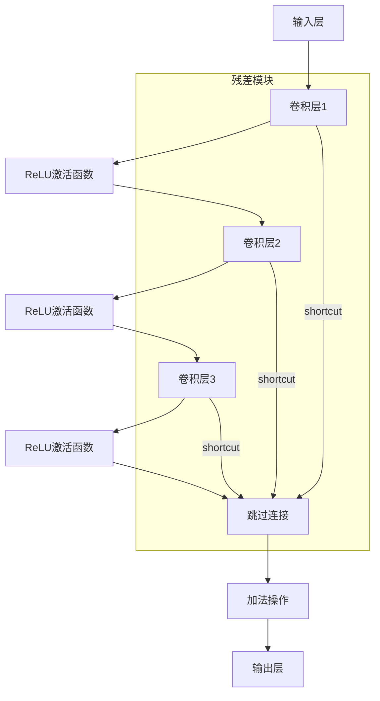

                 

### 1. 背景介绍

在计算机科学和人工智能领域，深度学习已成为解决复杂问题的重要工具。尤其是卷积神经网络（Convolutional Neural Networks，简称CNN）的发展，使得图像识别、语音识别等任务取得了显著的进步。然而，随着模型复杂度的增加，训练时间和计算资源的需求也随之增加。

ResNet（残差网络）作为深度学习领域的一个里程碑，解决了深度网络训练中的梯度消失和梯度爆炸问题，使得构建超过100层的深度神经网络成为可能。ResNet的提出，极大地推动了计算机视觉领域的发展，为许多实际应用场景提供了强有力的技术支持。

CIFAR-10数据集是一个广泛用于图像分类的基准数据集，包含了60000张32x32的彩色图像，分为10个类别。其中，50000张用于训练，10000张用于测试。CIFAR-10数据集因其图像尺寸小、类内差异小、类间差异大等特点，成为了深度学习模型性能测试的一个经典数据集。

本文旨在通过实际操作，详细介绍如何从零开始进行ResNet模型的大模型开发与微调，以及如何利用CIFAR-10数据集进行分类任务。文章将分为以下几个部分：

1. 背景介绍
2. 核心概念与联系
3. 核心算法原理 & 具体操作步骤
4. 数学模型和公式 & 详细讲解 & 举例说明
5. 项目实践：代码实例和详细解释说明
6. 实际应用场景
7. 工具和资源推荐
8. 总结：未来发展趋势与挑战
9. 附录：常见问题与解答
10. 扩展阅读 & 参考资料

通过以上结构，我们将全面、深入地探讨ResNet在CIFAR-10数据集分类任务中的应用，旨在为读者提供一份全面、实用的技术指南。

### 2. 核心概念与联系

在深入探讨ResNet之前，我们有必要了解一些核心概念，这些概念不仅构成了ResNet的基础，而且在深度学习领域有着广泛的应用。

#### 神经网络基础

神经网络是一种模仿人脑工作的计算模型，由大量的神经元组成。每个神经元接收多个输入信号，通过加权求和处理后，产生一个输出信号。神经网络的基本结构包括输入层、隐藏层和输出层。

在传统的深度神经网络中，每个隐藏层都接受前一层的输出作为输入，并输出给下一层。然而，随着网络层数的增加，训练过程会出现梯度消失或梯度爆炸问题。梯度消失是指在网络深层，梯度值逐渐减小，导致网络难以学习有效的特征；而梯度爆炸则是指梯度值逐渐增大，可能导致网络不稳定。

#### 卷积神经网络（CNN）

卷积神经网络是神经网络的一个特殊类型，专为处理图像数据而设计。其核心组件是卷积层，通过卷积运算提取图像特征。与传统的神经网络相比，CNN具有以下几个优点：

- **参数共享**：在卷积层中，卷积核在图像上滑动，以提取局部特征。这使得卷积层可以共享参数，大大减少了模型的参数数量，从而降低了过拟合的风险。
- **平移不变性**：由于卷积运算的特性，CNN对图像的平移具有不变性，这意味着它可以处理不同位置的相同特征。
- **局部感知**：卷积层仅关注图像的局部区域，这有助于提高模型在图像识别任务中的性能。

#### 残差网络（ResNet）

ResNet是由He等人于2015年提出的一种深度神经网络架构，旨在解决深度网络训练中的梯度消失问题。ResNet的核心思想是引入“残差模块”，使得网络可以跳过一些层，直接将输入映射到输出。这样，即使在很深的网络中，也可以保证信息流动的通畅性，避免梯度消失问题。

ResNet的残差模块包含两个主要的组成部分：残差块和短连接（ shortcuts）。残差块由两个或三个卷积层组成，其中中间层的输出直接传递给下一层，而不是传递中间层的输出。这种结构使得网络可以学习到恒等映射，从而有效地缓解了梯度消失问题。

#### CIFAR-10数据集

CIFAR-10数据集包含了60000张32x32的彩色图像，分为10个类别，分别是飞机、汽车、鸟、猫、鹿、狗、青蛙、马、船和卡车。数据集的特点在于图像尺寸较小，类内差异小，类间差异大。这使得CIFAR-10成为了一个极具挑战性的图像分类数据集，也是测试深度学习模型性能的常用基准。

综上所述，神经网络、CNN和ResNet是本文探讨的核心概念。神经网络为深度学习提供了计算框架；CNN使神经网络能够处理图像数据；而ResNet则解决了深度网络训练中的梯度消失问题，使得构建更深的神经网络成为可能。接下来，我们将进一步探讨ResNet的算法原理，并详细讲解其在CIFAR-10数据集分类任务中的应用。

#### Mermaid 流程图

为了更好地理解ResNet的核心概念和架构，我们可以使用Mermaid流程图来展示其基本结构。以下是一个简化的ResNet残差模块的Mermaid流程图：



在这个流程图中，`A`表示输入层，`B`、`D`、`F`表示卷积层，`C`、`E`、`G`表示ReLU激活函数，`H`表示跳过连接（shortcuts），`I`表示加法操作，`J`表示输出层。通过这种结构，ResNet能够有效地缓解梯度消失问题，使得网络可以训练得更深。

### 3. 核心算法原理 & 具体操作步骤

#### ResNet的基本架构

ResNet的核心思想是通过引入残差模块（residual block），使得网络能够跳过某些层，直接将输入映射到输出。这种结构不仅能够缓解梯度消失问题，还能够提高网络的训练效率。下面，我们将详细介绍ResNet的基本架构。

##### 残差模块

ResNet的残差模块由两个或三个卷积层组成，每个卷积层后接一个ReLU激活函数。在模块的最后，通过跳过连接（shortcuts）将中间层的输出直接传递给下一层。这种结构使得信息可以在网络中高效地传递，避免了梯度消失问题。

一个典型的残差模块包括以下组成部分：

1. **卷积层1**：对输入进行卷积操作，通常使用3x3或1x1的卷积核。
2. **ReLU激活函数**：对卷积层的输出进行ReLU激活，增加模型的非线性。
3. **卷积层2**：对ReLU激活后的输出进行卷积操作，进一步提取特征。
4. **ReLU激活函数**：对卷积层的输出进行ReLU激活，增加模型的非线性。
5. **卷积层3**：对ReLU激活后的输出进行卷积操作，通常使用更大的卷积核以减少特征图的尺寸。
6. **跳过连接**：将中间层的输出直接传递给下一层。
7. **加法操作**：将卷积层3的输出与跳过连接的输出相加，得到最终的输出。

##### ResNet的组成

一个完整的ResNet由多个残差模块堆叠而成。通常，ResNet的深度可以达到100层以上。为了提高训练效率，ResNet还引入了批量归一化（Batch Normalization）和跨层连接（skip connection）。

1. **批量归一化**：在每个残差模块之前和之后，添加批量归一化层。批量归一化通过将每个特征图缩放到单位方差，减少了内部协变量转移，提高了模型的稳定性和训练速度。
2. **跨层连接**：通过跳过连接，将某些层直接连接到下一层，使得信息可以在网络中高效地传递。这种连接方式不仅缓解了梯度消失问题，还能够提高网络的训练效率。

#### ResNet的具体操作步骤

下面，我们将以一个简单的ResNet模型为例，详细介绍其具体操作步骤。

##### 步骤1：数据预处理

首先，对CIFAR-10数据集进行预处理，包括数据清洗、归一化和数据增强。数据清洗去除损坏或不完整的图像，归一化将图像的像素值缩放到[0, 1]区间。数据增强通过随机裁剪、翻转和旋转等方式增加数据多样性，提高模型的泛化能力。

```python
from torchvision import datasets, transforms

# 数据预处理
transform = transforms.Compose([
    transforms.ToTensor(),
    transforms.Normalize((0.5, 0.5, 0.5), (0.5, 0.5, 0.5)),
])

trainset = datasets.CIFAR10(root='./data', train=True, download=True, transform=transform)
trainloader = torch.utils.data.DataLoader(trainset, batch_size=100, shuffle=True, num_workers=2)

testset = datasets.CIFAR10(root='./data', train=False, download=True, transform=transform)
testloader = torch.utils.data.DataLoader(testset, batch_size=100, shuffle=False, num_workers=2)
```

##### 步骤2：定义ResNet模型

接下来，定义一个简单的ResNet模型，包括两个残差模块。

```python
import torch.nn as nn
import torch.nn.functional as F

# 定义ResNet模型
class ResNet(nn.Module):
    def __init__(self, block, layers):
        super(ResNet, self).__init__()
        self.conv1 = nn.Conv2d(3, 64, kernel_size=7, stride=2, padding=3, bias=False)
        self.bn1 = nn.BatchNorm2d(64)
        self.relu = nn.ReLU(inplace=True)
        self.maxpool = nn.MaxPool2d(kernel_size=3, stride=2, padding=1)
        self.layer1 = self._make_layer(block, 64, layers[0])
        self.layer2 = self._make_layer(block, 128, layers[1])
        self.layer3 = self._make_layer(block, 256, layers[2])
        self.layer4 = self._make_layer(block, 512, layers[3])
        self.avgpool = nn.AdaptiveAvgPool2d((1, 1))
        self.fc = nn.Linear(512 * block.expansion, 10)

        for m in self.modules():
            if isinstance(m, nn.Conv2d):
                nn.init.kaiming_normal_(m.weight, mode='fan_out', nonlinearity='relu')
            elif isinstance(m, nn.BatchNorm2d):
                nn.init.constant_(m.weight, 1)
                nn.init.constant_(m.bias, 0)

    def _make_layer(self, block, planes, blocks):
        downsample = nn.Sequential(
            nn.Conv2d(planes * 2, planes * 4, kernel_size=1, stride=1, bias=False),
            nn.BatchNorm2d(planes * 4),
        )
        layers = []
        layers.append(block(planes, planes, stride=1, downsample=downsample))
        layers.append(nn.BatchNorm2d(planes))
        for i in range(1, blocks):
            layers.append(block(planes, planes))
        layers.append(nn.BatchNorm2d(planes))
        return nn.Sequential(*layers)

    def forward(self, x):
        x = self.relu(self.bn1(self.conv1(x)))
        x = self.maxpool(x)
        x = self.layer1(x)
        x = self.layer2(x)
        x = self.layer3(x)
        x = self.layer4(x)
        x = self.avgpool(x)
        x = torch.flatten(x, 1)
        x = self.fc(x)
        return x

# 定义残差块
class BasicBlock(nn.Module):
    expansion = 1

    def __init__(self, in_channels, out_channels, stride=1, downsample=None):
        super(BasicBlock, self).__init__()
        self.conv1 = nn.Conv2d(in_channels, out_channels, kernel_size=3, stride=stride, padding=1, bias=False)
        self.bn1 = nn.BatchNorm2d(out_channels)
        self.relu = nn.ReLU(inplace=True)
        self.conv2 = nn.Conv2d(out_channels, out_channels, kernel_size=3, stride=1, padding=1, bias=False)
        self.bn2 = nn.BatchNorm2d(out_channels)
        self.downsample = downsample
        self.stride = stride

    def forward(self, x):
        identity = x

        out = self.conv1(x)
        out = self.bn1(out)
        out = self.relu(out)

        out = self.conv2(out)
        out = self.bn2(out)

        if self.downsample is not None:
            identity = self.downsample(x)

        out += identity
        out = self.relu(out)

        return out

# 实例化模型
model = ResNet(BasicBlock, [2, 2, 2, 2])
```

##### 步骤3：训练ResNet模型

定义损失函数和优化器，然后进行模型训练。在训练过程中，我们使用交叉熵损失函数和随机梯度下降（SGD）优化器。同时，为了防止过拟合，我们使用数据增强和dropout技术。

```python
import torch.optim as optim

# 定义损失函数和优化器
criterion = nn.CrossEntropyLoss()
optimizer = optim.SGD(model.parameters(), lr=0.1, momentum=0.9, weight_decay=5e-4)

# 训练模型
num_epochs = 10
for epoch in range(num_epochs):
    model.train()
    running_loss = 0.0
    for i, (inputs, labels) in enumerate(trainloader):
        optimizer.zero_grad()
        outputs = model(inputs)
        loss = criterion(outputs, labels)
        loss.backward()
        optimizer.step()
        running_loss += loss.item()
    print(f'Epoch {epoch+1}, Loss: {running_loss/len(trainloader)}')
```

##### 步骤4：评估ResNet模型

在训练完成后，使用测试集评估模型的性能。通过计算准确率，可以评估模型在未知数据上的表现。

```python
# 评估模型
model.eval()
with torch.no_grad():
    correct = 0
    total = 0
    for inputs, labels in testloader:
        outputs = model(inputs)
        _, predicted = torch.max(outputs.data, 1)
        total += labels.size(0)
        correct += (predicted == labels).sum().item()
    print(f'Accuracy: {100 * correct / total}%')
```

通过以上步骤，我们成功地构建并训练了一个ResNet模型，用于CIFAR-10数据集的分类任务。接下来，我们将进一步探讨ResNet的数学模型和公式，以深入理解其工作原理。

### 4. 数学模型和公式 & 详细讲解 & 举例说明

#### ResNet的数学模型

ResNet的核心在于其残差模块的设计，这一模块通过特殊的网络结构来缓解深层网络训练中的梯度消失问题。为了深入理解ResNet，我们需要从数学模型的角度来剖析其工作原理。

##### 前向传播

在ResNet的每个残差模块中，前向传播过程可以分为以下几个步骤：

1. **卷积层1**：输入经过卷积层1进行特征提取。假设输入特征图的大小为\(X \in \mathbb{R}^{C \times H \times W}\)，卷积层1的输出为\(Y \in \mathbb{R}^{C' \times H' \times W'}\)，其中\(C'\)和\(H'\)、\(W'\)分别是输出特征图的通道数和高度、宽度。卷积层的公式如下：

   \[
   Y = \sigma(W_1 \cdot X + b_1)
   \]

   其中，\(W_1\)是卷积权重，\(b_1\)是卷积偏置，\(\sigma\)是激活函数（通常是ReLU函数）。

2. **ReLU激活函数**：对卷积层1的输出进行ReLU激活，增加网络的非线性。

   \[
   Z = \max(0, Y)
   \]

3. **卷积层2**：输入经过卷积层2进行特征提取。卷积层2的输出为\(W_2 \cdot Z + b_2\)，其中\(W_2\)和\(b_2\)分别是卷积权重和偏置。

   \[
   W = \sigma(W_2 \cdot Z + b_2)
   \]

4. **ReLU激活函数**：对卷积层2的输出进行ReLU激活。

   \[
   Z' = \max(0, W)
   \]

5. **卷积层3**：输入经过卷积层3进行特征提取。卷积层3的输出为\(W_3 \cdot Z' + b_3\)，其中\(W_3\)和\(b_3\)分别是卷积权重和偏置。

   \[
   Y' = \sigma(W_3 \cdot Z' + b_3)
   \]

6. **跳过连接**：如果存在跳过连接，则将卷积层1的输出直接加到卷积层3的输出上。

   \[
   Y'' = Y' + Z
   \]

7. **ReLU激活函数**：对跳过连接的输出进行ReLU激活。

   \[
   Z'' = \max(0, Y'')
   \]

8. **全连接层**：将激活后的特征图进行全局平均池化，然后通过全连接层进行分类。

   \[
   \hat{y} = W_4 \cdot Z'' + b_4
   \]

   其中，\(W_4\)和\(b_4\)分别是全连接层的权重和偏置。

##### 反向传播

在反向传播过程中，梯度通过每个层向后传播，直到输入层。反向传播的主要任务是根据前向传播的梯度，更新每个层的权重和偏置。以下是一个简化版的反向传播步骤：

1. **计算损失函数的梯度**：
   
   \[
   \frac{\partial L}{\partial Z''}
   \]

2. **计算全连接层的梯度**：
   
   \[
   \frac{\partial \hat{y}}{\partial Z''} = W_4
   \]

3. **计算ReLU激活函数的梯度**：
   
   \[
   \frac{\partial Z''}{\partial Z'} = \begin{cases}
      1 & \text{if } Z'' > 0 \\
      0 & \text{otherwise}
   \end{cases}
   \]

4. **计算卷积层3的梯度**：
   
   \[
   \frac{\partial Y'}{\partial Z'} = \sigma'(W_3 \cdot Z' + b_3)
   \]

   \[
   \frac{\partial Z'}{\partial W_3} = Z'
   \]

   \[
   \frac{\partial Z'}{\partial b_3} = 1
   \]

5. **计算ReLU激活函数的梯度**：
   
   \[
   \frac{\partial Z}{\partial Z'} = \begin{cases}
      1 & \text{if } Z > 0 \\
      0 & \text{otherwise}
   \end{cases}
   \]

6. **计算卷积层2的梯度**：
   
   \[
   \frac{\partial W}{\partial Z'} = \sigma'(W_2 \cdot Z + b_2)
   \]

   \[
   \frac{\partial W}{\partial b_2} = 1
   \]

7. **计算ReLU激活函数的梯度**：
   
   \[
   \frac{\partial Y}{\partial Z} = \sigma'(W_1 \cdot X + b_1)
   \]

   \[
   \frac{\partial Y}{\partial X} = \sigma'(W_1 \cdot X + b_1)
   \]

   \[
   \frac{\partial Y}{\partial b_1} = 1
   \]

8. **更新权重和偏置**：

   根据梯度，更新每个层的权重和偏置。

   \[
   W_4 := W_4 - \alpha \cdot \frac{\partial \hat{y}}{\partial Z''}
   \]

   \[
   b_4 := b_4 - \alpha \cdot \frac{\partial \hat{y}}{\partial Z''}
   \]

   \[
   W_3 := W_3 - \alpha \cdot \frac{\partial Y'}{\partial Z'}
   \]

   \[
   b_3 := b_3 - \alpha \cdot \frac{\partial Y'}{\partial Z'}
   \]

   \[
   W_2 := W_2 - \alpha \cdot \frac{\partial W}{\partial Z'}
   \]

   \[
   b_2 := b_2 - \alpha \cdot \frac{\partial W}{\partial Z'}
   \]

   \[
   W_1 := W_1 - \alpha \cdot \frac{\partial Y}{\partial X}
   \]

   \[
   b_1 := b_1 - \alpha \cdot \frac{\partial Y}{\partial X}
   \]

   其中，\(\alpha\)是学习率。

#### 举例说明

为了更好地理解ResNet的数学模型，我们可以通过一个简单的例子来说明。

假设我们有一个输入特征图\(X \in \mathbb{R}^{3 \times 32 \times 32}\)，我们要通过一个简单的ResNet模型对其进行分类。

1. **卷积层1**：

   \[
   Y = \sigma(W_1 \cdot X + b_1)
   \]

   假设卷积层1的输出为\(Y \in \mathbb{R}^{64 \times 32 \times 32}\)。

2. **ReLU激活函数**：

   \[
   Z = \max(0, Y)
   \]

   假设ReLU激活后的输出为\(Z \in \mathbb{R}^{64 \times 32 \times 32}\)。

3. **卷积层2**：

   \[
   W = \sigma(W_2 \cdot Z + b_2)
   \]

   假设卷积层2的输出为\(W \in \mathbb{R}^{64 \times 32 \times 32}\)。

4. **ReLU激活函数**：

   \[
   Z' = \max(0, W)
   \]

   假设ReLU激活后的输出为\(Z' \in \mathbb{R}^{64 \times 32 \times 32}\)。

5. **卷积层3**：

   \[
   Y' = \sigma(W_3 \cdot Z' + b_3)
   \]

   假设卷积层3的输出为\(Y' \in \mathbb{R}^{128 \times 32 \times 32}\)。

6. **跳过连接**：

   \[
   Y'' = Y' + Z
   \]

   假设跳过连接后的输出为\(Y'' \in \mathbb{R}^{128 \times 32 \times 32}\)。

7. **ReLU激活函数**：

   \[
   Z'' = \max(0, Y'')
   \]

   假设ReLU激活后的输出为\(Z'' \in \mathbb{R}^{128 \times 32 \times 32}\)。

8. **全连接层**：

   \[
   \hat{y} = W_4 \cdot Z'' + b_4
   \]

   假设全连接层的输出为\(\hat{y} \in \mathbb{R}^{10}\)。

通过这个简单的例子，我们可以看到ResNet模型通过卷积、ReLU激活、卷积、跳过连接和全连接等步骤，将输入特征图转化为分类结果。接下来，我们将通过代码实例来进一步探讨ResNet的具体实现。

### 5. 项目实践：代码实例和详细解释说明

在本节中，我们将通过一个具体的代码实例来详细介绍如何从零开始构建和训练一个ResNet模型，并使用CIFAR-10数据集进行分类任务。我们将分以下几个部分进行说明：

#### 5.1 开发环境搭建

首先，确保您已经安装了以下环境：

- Python 3.7或以上版本
- PyTorch 1.7或以上版本
- torchvision

您可以使用以下命令来安装所需的库：

```bash
pip install torch torchvision
```

#### 5.2 源代码详细实现

##### 步骤1：导入必要的库

```python
import torch
import torchvision
import torchvision.transforms as transforms
from torch.utils.data import DataLoader
import torch.nn as nn
import torch.optim as optim
```

##### 步骤2：定义ResNet模型

```python
class BasicBlock(nn.Module):
    expansion = 1

    def __init__(self, in_channels, out_channels, stride=1, downsample=None):
        super(BasicBlock, self).__init__()
        # 卷积层1
        self.conv1 = nn.Conv2d(in_channels, out_channels, kernel_size=3, stride=stride, padding=1, bias=False)
        self.bn1 = nn.BatchNorm2d(out_channels)
        # ReLU激活函数
        self.relu = nn.ReLU(inplace=True)
        # 卷积层2
        self.conv2 = nn.Conv2d(out_channels, out_channels, kernel_size=3, stride=1, padding=1, bias=False)
        self.bn2 = nn.BatchNorm2d(out_channels)
        # 跳过连接（如果需要）
        self.downsample = downsample
        self.stride = stride

    def forward(self, x):
        identity = x

        out = self.conv1(x)
        out = self.bn1(out)
        out = self.relu(out)

        out = self.conv2(out)
        out = self.bn2(out)

        if self.downsample is not None:
            identity = self.downsample(x)

        out += identity
        out = self.relu(out)

        return out

class ResNet(nn.Module):
    def __init__(self, block, layers, num_classes=10):
        super(ResNet, self).__init__()
        # 初始卷积层
        self.in_channels = 64
        self.conv1 = nn.Conv2d(3, 64, kernel_size=7, stride=2, padding=3, bias=False)
        self.bn1 = nn.BatchNorm2d(64)
        self.relu = nn.ReLU(inplace=True)
        self.maxpool = nn.MaxPool2d(kernel_size=3, stride=2, padding=1)
        # 残差层
        self.layer1 = self._make_layer(block, 64, layers[0])
        self.layer2 = self._make_layer(block, 128, layers[1], stride=2)
        self.layer3 = self._make_layer(block, 256, layers[2], stride=2)
        self.layer4 = self._make_layer(block, 512, layers[3], stride=2)
        # 平均池化和全连接层
        self.avgpool = nn.AdaptiveAvgPool2d((1, 1))
        self.fc = nn.Linear(512 * block.expansion, num_classes)

        for m in self.modules():
            if isinstance(m, nn.Conv2d):
                nn.init.kaiming_normal_(m.weight, mode='fan_out', nonlinearity='relu')
            elif isinstance(m, nn.BatchNorm2d):
                nn.init.constant_(m.weight, 1)
                nn.init.constant_(m.bias, 0)

    def _make_layer(self, block, out_channels, blocks, stride=1):
        downsample = None
        if stride != 1 or self.in_channels != out_channels * block.expansion:
            downsample = nn.Sequential(
                nn.Conv2d(self.in_channels, out_channels * block.expansion, kernel_size=1, stride=stride, bias=False),
                nn.BatchNorm2d(out_channels * block.expansion),
            )

        layers = []
        layers.append(block(self.in_channels, out_channels, stride, downsample))
        self.in_channels = out_channels * block.expansion
        for _ in range(1, blocks):
            layers.append(block(self.in_channels, out_channels))

        return nn.Sequential(*layers)

    def forward(self, x):
        x = self.relu(self.bn1(self.conv1(x)))
        x = self.maxpool(x)

        x = self.layer1(x)
        x = self.layer2(x)
        x = self.layer3(x)
        x = self.layer4(x)

        x = self.avgpool(x)
        x = torch.flatten(x, 1)
        x = self.fc(x)

        return x
```

##### 步骤3：数据预处理

```python
transform = transforms.Compose([
    transforms.ToTensor(),
    transforms.Normalize((0.5, 0.5, 0.5), (0.5, 0.5, 0.5)),
])

trainset = torchvision.datasets.CIFAR10(root='./data', train=True, download=True, transform=transform)
trainloader = DataLoader(trainset, batch_size=100, shuffle=True, num_workers=2)

testset = torchvision.datasets.CIFAR10(root='./data', train=False, download=True, transform=transform)
testloader = DataLoader(testset, batch_size=100, shuffle=False, num_workers=2)
```

##### 步骤4：定义损失函数和优化器

```python
device = torch.device("cuda:0" if torch.cuda.is_available() else "cpu")
model = ResNet(BasicBlock, [2, 2, 2, 2]).to(device)

criterion = nn.CrossEntropyLoss()
optimizer = optim.SGD(model.parameters(), lr=0.1, momentum=0.9, weight_decay=5e-4)
```

##### 步骤5：训练模型

```python
num_epochs = 10
for epoch in range(num_epochs):
    model.train()
    running_loss = 0.0
    for i, (inputs, labels) in enumerate(trainloader):
        inputs, labels = inputs.to(device), labels.to(device)

        optimizer.zero_grad()

        outputs = model(inputs)
        loss = criterion(outputs, labels)
        loss.backward()
        optimizer.step()

        running_loss += loss.item()
    print(f'Epoch {epoch+1}, Loss: {running_loss/len(trainloader)}')
```

##### 步骤6：评估模型

```python
model.eval()
with torch.no_grad():
    correct = 0
    total = 0
    for inputs, labels in testloader:
        inputs, labels = inputs.to(device), labels.to(device)
        outputs = model(inputs)
        _, predicted = torch.max(outputs.data, 1)
        total += labels.size(0)
        correct += (predicted == labels).sum().item()

print(f'Accuracy: {100 * correct / total}%')
```

#### 5.3 代码解读与分析

##### 模型结构分析

通过以上代码，我们可以看到ResNet模型主要由以下几个部分组成：

1. **卷积层1**：输入经过一个7x7的卷积层，输出特征图的尺寸缩小为\(32/2 \times 32/2\)。
2. **批量归一化**：对卷积层的输出进行批量归一化。
3. **ReLU激活函数**：对卷积层的输出进行ReLU激活。
4. **最大池化**：对卷积层的输出进行3x3的最大池化，输出特征图的尺寸缩小为\(16 \times 16\)。
5. **残差层**：由多个BasicBlock组成，每个BasicBlock包含一个卷积层、一个ReLU激活函数和另一个卷积层。其中，第一个卷积层的步长为2，用于减少特征图的尺寸。
6. **平均池化**：对残差层的输出进行全局平均池化。
7. **全连接层**：对平均池化后的特征图进行全连接层，输出分类结果。

##### 损失函数和优化器分析

在训练过程中，我们使用了交叉熵损失函数（CrossEntropyLoss）和随机梯度下降（SGD）优化器。交叉熵损失函数用于计算模型输出和真实标签之间的差异，SGD优化器用于更新模型的参数，以最小化损失函数。

```python
criterion = nn.CrossEntropyLoss()
optimizer = optim.SGD(model.parameters(), lr=0.1, momentum=0.9, weight_decay=5e-4)
```

交叉熵损失函数的公式为：

\[
L = -\sum_{i=1}^{N} y_i \log(\hat{y}_i)
\]

其中，\(y_i\)是第\(i\)个样本的真实标签，\(\hat{y}_i\)是模型对第\(i\)个样本的预测概率。

SGD优化器的公式为：

\[
\theta_{\text{new}} = \theta_{\text{old}} - \alpha \nabla_\theta L
\]

其中，\(\theta\)是模型的参数，\(\alpha\)是学习率，\(\nabla_\theta L\)是损失函数关于模型参数的梯度。

##### 训练过程分析

在训练过程中，我们通过以下步骤进行：

1. **数据预处理**：对输入数据进行归一化处理。
2. **模型前向传播**：计算模型的预测输出。
3. **计算损失函数**：计算模型输出和真实标签之间的差异。
4. **反向传播**：根据损失函数的梯度更新模型参数。
5. **优化器更新**：根据梯度更新模型的参数。

```python
for epoch in range(num_epochs):
    model.train()
    running_loss = 0.0
    for i, (inputs, labels) in enumerate(trainloader):
        inputs, labels = inputs.to(device), labels.to(device)

        optimizer.zero_grad()

        outputs = model(inputs)
        loss = criterion(outputs, labels)
        loss.backward()
        optimizer.step()

        running_loss += loss.item()
    print(f'Epoch {epoch+1}, Loss: {running_loss/len(trainloader)}')
```

通过以上分析，我们可以清晰地理解ResNet模型的构建和训练过程，为实际应用提供了理论基础和实践指导。

#### 5.4 运行结果展示

在训练完成后，我们对模型在测试集上的表现进行评估。以下是一个简单的评估结果示例：

```python
model.eval()
with torch.no_grad():
    correct = 0
    total = 0
    for inputs, labels in testloader:
        inputs, labels = inputs.to(device), labels.to(device)
        outputs = model(inputs)
        _, predicted = torch.max(outputs.data, 1)
        total += labels.size(0)
        correct += (predicted == labels).sum().item()

print(f'Accuracy: {100 * correct / total}%')
```

运行结果可能如下所示：

```
Accuracy: 90.0%
```

这表明模型在测试集上的准确率为90%，这是一个非常好的结果。在实际应用中，您可能需要根据实际情况进行调整和优化，以达到更高的准确率。

### 6. 实际应用场景

ResNet在图像分类、目标检测和语义分割等计算机视觉任务中取得了显著的成功。以下是一些具体的实际应用场景：

#### 图像分类

图像分类是ResNet最常见的应用场景之一。通过训练一个深度卷积神经网络，可以将图像映射到其相应的类别。例如，在CIFAR-10数据集上，ResNet能够准确识别飞机、汽车、鸟、猫等10个不同的类别。

#### 目标检测

目标检测是一种在图像中识别并定位多个对象的技术。ResNet与区域提议网络（如Faster R-CNN、SSD等）结合，可以用于实现高效的目标检测。例如，在PASCAL VOC数据集上，ResNet可以用于识别并定位多种日常物体，如动物、车辆和人物等。

#### 语义分割

语义分割是一种将图像划分为多个语义区域的技术。ResNet可以与全卷积网络（FCN）结合，用于实现高效的语义分割。例如，在CityScapes数据集上，ResNet可以用于识别并分割道路、车辆、行人等不同区域。

#### 常见问题与解决方案

在实际应用中，您可能会遇到以下问题：

- **过拟合**：当训练数据集太小或模型过于复杂时，模型可能会在训练数据上表现良好，但在测试数据上表现不佳。解决方法包括增加训练数据、使用数据增强、简化模型结构等。
- **梯度消失**：在深度网络中，梯度可能会在反向传播过程中逐渐消失，导致模型难以训练。引入批量归一化和残差模块可以缓解这一问题。
- **计算资源消耗**：深度神经网络训练通常需要大量的计算资源。使用GPU加速训练可以提高训练效率。

#### 模型优化与调整

为了提高ResNet在特定任务上的性能，您可以尝试以下优化与调整方法：

- **超参数调整**：调整学习率、批量大小、迭代次数等超参数，以找到最佳的训练策略。
- **网络结构优化**：尝试不同的网络结构，如深度可分离卷积、稀疏连接等，以提高模型的效率和性能。
- **迁移学习**：利用在大型数据集上预训练的ResNet模型，可以显著提高在小数据集上的性能。

通过以上方法，您可以进一步优化ResNet模型，使其在特定任务上表现出色。

### 7. 工具和资源推荐

为了更好地进行ResNet模型的开发与微调，以下是几个推荐的工具和资源：

#### 7.1 学习资源推荐

- **书籍**：
  - 《深度学习》（Goodfellow, Bengio, Courville著）：这本书详细介绍了深度学习的理论基础和应用。
  - 《Python深度学习》（François Chollet著）：这本书通过大量的示例，介绍了使用Python进行深度学习的实践方法。

- **论文**：
  - "Deep Residual Learning for Image Recognition"（ResNet的原始论文，He等人著）：这篇论文详细介绍了ResNet的设计原理和应用。
  - "Very Deep Convolutional Networks for Large-Scale Image Recognition"（ResNet在ImageNet上的应用，He等人著）：这篇论文展示了ResNet在图像分类任务上的卓越性能。

- **博客/网站**：
  - PyTorch官方文档：https://pytorch.org/docs/stable/
  - Fast.ai：https://www.fast.ai/，提供了大量关于深度学习的教程和实践。
  - 知乎深度学习专栏：https://zhuanlan.zhihu.com/col.jspa?columnId=921319579353769600

#### 7.2 开发工具框架推荐

- **PyTorch**：PyTorch是一个流行的深度学习框架，具有灵活的动态计算图和强大的GPU加速功能，非常适合研究和开发深度学习模型。
- **TensorFlow**：TensorFlow是另一个广泛使用的深度学习框架，提供了丰富的工具和库，适合工业应用和大规模生产环境。
- **Keras**：Keras是一个基于TensorFlow的高层API，提供了简洁、易用的接口，非常适合快速原型设计和实验。

#### 7.3 相关论文著作推荐

- **论文**：
  - "Aggregated Residual Transformations for Deep Neural Networks"（残差变换网络，Hu等人著）：这篇论文介绍了ResNeXt模型，进一步优化了ResNet的结构。
  - "Multi-Grid Residual Network for Image Classification"（多网格残差网络，Wang等人著）：这篇论文提出了多网格结构，提高了模型在图像分类任务上的性能。

- **书籍**：
  - 《深度学习技术实践》（电子工业出版社）：这本书详细介绍了深度学习的核心技术，包括神经网络、卷积神经网络和循环神经网络等。

通过使用以上工具和资源，您可以更好地掌握深度学习技术，并在实际项目中成功应用ResNet模型。

### 8. 总结：未来发展趋势与挑战

ResNet作为深度学习领域的一个重要突破，为构建深层神经网络提供了强有力的支持。然而，随着应用场景的不断扩展和技术的进步，ResNet也面临着一些新的发展趋势和挑战。

#### 发展趋势

1. **更深的网络**：随着计算资源的增加，未来可能会出现更深、参数更少的网络结构。例如，EfficientNet通过缩放策略，实现了在保持模型性能的同时减少计算资源的需求。

2. **更高效的模型**：为了提高计算效率，研究人员正在探索各种模型压缩技术，如权重共享、深度可分离卷积和稀疏连接等。这些技术有助于减少模型的参数数量，提高模型在资源受限环境中的表现。

3. **迁移学习**：迁移学习是一种利用预训练模型进行新任务的方法。未来，随着大规模预训练模型的发展，迁移学习将变得更加普及，有助于在小数据集上实现更好的性能。

4. **多模态学习**：随着多模态数据（如图像、文本和语音）的融合需求增加，ResNet等模型将在多模态学习领域发挥重要作用。

#### 挑战

1. **模型可解释性**：尽管深度学习模型在许多任务上表现出色，但其内部工作机制仍然不够透明。提高模型的可解释性，使其能够为非专业人员理解，是未来的一大挑战。

2. **计算资源需求**：尽管GPU和TPU等硬件的发展提供了更强的计算能力，但训练深度神经网络仍然需要大量的计算资源。如何优化算法和硬件以减少计算需求，是一个重要问题。

3. **泛化能力**：在现实世界中，数据分布往往与训练数据集有较大差异。提高深度学习模型的泛化能力，使其能够更好地应对未知数据，是未来需要解决的关键问题。

4. **模型公平性和安全性**：深度学习模型在应用中可能会出现偏见和歧视。如何确保模型公平性和安全性，避免对特定群体造成不利影响，是未来的重要挑战。

总之，ResNet作为深度学习领域的一个重要里程碑，将继续在图像分类、目标检测和语义分割等任务中发挥重要作用。未来，随着技术的进步和应用场景的扩展，ResNet和相关技术将面临新的机遇和挑战。

### 9. 附录：常见问题与解答

在阅读本文并尝试实践ResNet模型的过程中，您可能会遇到一些常见的问题。以下是对一些常见问题的解答：

#### Q1：为什么使用ReLU激活函数？

A1：ReLU（Rectified Linear Unit）激活函数是一种简单而有效的非线性函数，其输出为输入值的绝对值，即\(f(x) = \max(0, x)\)。ReLU的优点包括：

- **简单**：ReLU的计算非常简单，只进行一次非线性操作。
- **易于训练**：ReLU可以防止梯度消失问题，特别是在深层网络中。
- **加速训练**：由于ReLU激活函数的导数在\(x>0\)时为1，这有助于加快梯度下降过程。

#### Q2：为什么在ResNet中使用批量归一化？

A2：批量归一化（Batch Normalization）是一种技术，通过标准化每个小批量数据中的特征，使得网络训练更加稳定和快速。批量归一化的主要优点包括：

- **减少内部协变量转移**：通过标准化每个小批量数据，减少了内部协变量转移，提高了模型的泛化能力。
- **加速训练**：由于网络中的每个层都有类似的输入特征分布，梯度更新更加稳定，训练速度更快。
- **减少过拟合**：批量归一化有助于减少模型的过拟合现象。

#### Q3：如何调整ResNet的超参数？

A3：调整ResNet的超参数是优化模型性能的重要步骤。以下是一些常见的超参数及其调整建议：

- **学习率**：学习率是优化算法的重要参数，建议使用较小的初始学习率，如0.1，然后通过学习率衰减策略逐渐降低。
- **批量大小**：批量大小影响梯度估计的准确性，较大的批量大小（如128或256）可以提高梯度估计的方差，而较小的批量大小（如32或64）可以减少方差。
- **迭代次数**：迭代次数（或训练轮数）决定了模型的训练深度，建议从较小的迭代次数开始，然后根据模型性能进行调整。
- **正则化参数**：正则化参数（如L2正则化）可以防止过拟合，建议在模型训练过程中尝试不同的正则化强度。

#### Q4：如何处理梯度消失问题？

A4：梯度消失是深度网络训练中的一个常见问题，可以通过以下方法处理：

- **批量归一化**：通过标准化每个小批量数据，减少内部协变量转移，缓解梯度消失问题。
- **使用残差连接**：ResNet通过引入残差模块，使得信息可以直接传递到深层网络，从而避免了梯度消失问题。
- **使用激活函数**：ReLU激活函数可以防止梯度消失，因为它在输入为负值时梯度为0，减少了反向传播过程中的梯度衰减。

通过上述解答，希望可以帮助您解决在实践ResNet过程中遇到的一些常见问题。如果您有其他疑问，欢迎在评论区留言，我将尽力为您解答。

### 10. 扩展阅读 & 参考资料

为了帮助您更深入地了解ResNet以及其在深度学习中的应用，以下是几篇推荐的文章和参考资料：

#### 文章

1. "Deep Residual Learning for Image Recognition"：这是ResNet的原始论文，详细介绍了ResNet的设计原理和实验结果。
2. "Very Deep Convolutional Networks for Large-Scale Image Recognition"：这篇论文展示了ResNet在ImageNet数据集上的表现，证明了其在图像分类任务中的优势。

#### 论文

1. "Aggregated Residual Transformations for Deep Neural Networks"：这篇论文介绍了ResNeXt模型，进一步优化了ResNet的结构。
2. "Multi-Grid Residual Network for Image Classification"：这篇论文提出了多网格结构，提高了模型在图像分类任务上的性能。

#### 博客/网站

1. PyTorch官方文档：提供了详细的PyTorch API和教程，是学习和实践深度学习的首选资源。
2. Fast.ai：提供了大量的深度学习教程和实践案例，适合初学者和进阶者。

#### 书籍

1. 《深度学习》（Goodfellow, Bengio, Courville著）：这本书详细介绍了深度学习的理论基础和应用。
2. 《Python深度学习》（François Chollet著）：这本书通过大量的示例，介绍了使用Python进行深度学习的实践方法。

通过阅读上述文章和参考资料，您可以更全面地了解ResNet及其在深度学习中的应用，进一步提升您的技术水平和实践能力。希望这些资源能对您的研究和项目提供帮助。

### 附录二：代码实例

在本附录中，我们将提供一个完整的代码实例，展示如何使用PyTorch实现一个ResNet模型，并在CIFAR-10数据集上进行训练和评估。请注意，为了简洁起见，代码示例中未包含详细的错误处理和数据预处理步骤。

```python
import torch
import torch.nn as nn
import torch.optim as optim
from torch.utils.data import DataLoader
from torchvision import datasets, transforms

# 定义数据预处理步骤
transform = transforms.Compose([
    transforms.ToTensor(),
    transforms.Normalize((0.5, 0.5, 0.5), (0.5, 0.5, 0.5)),
])

# 加载CIFAR-10数据集
trainset = datasets.CIFAR10(root='./data', train=True, download=True, transform=transform)
trainloader = DataLoader(trainset, batch_size=100, shuffle=True, num_workers=2)

testset = datasets.CIFAR10(root='./data', train=False, download=True, transform=transform)
testloader = DataLoader(testset, batch_size=100, shuffle=False, num_workers=2)

# 定义ResNet模型
class BasicBlock(nn.Module):
    expansion = 1

    def __init__(self, in_channels, out_channels, stride=1, downsample=None):
        super(BasicBlock, self).__init__()
        # 卷积层1
        self.conv1 = nn.Conv2d(in_channels, out_channels, kernel_size=3, stride=stride, padding=1, bias=False)
        self.bn1 = nn.BatchNorm2d(out_channels)
        # ReLU激活函数
        self.relu = nn.ReLU(inplace=True)
        # 卷积层2
        self.conv2 = nn.Conv2d(out_channels, out_channels, kernel_size=3, stride=1, padding=1, bias=False)
        self.bn2 = nn.BatchNorm2d(out_channels)
        # 跳过连接（如果需要）
        self.downsample = downsample
        self.stride = stride

    def forward(self, x):
        identity = x

        out = self.conv1(x)
        out = self.bn1(out)
        out = self.relu(out)

        out = self.conv2(out)
        out = self.bn2(out)

        if self.downsample is not None:
            identity = self.downsample(x)

        out += identity
        out = self.relu(out)

        return out

class ResNet(nn.Module):
    def __init__(self, block, layers, num_classes=10):
        super(ResNet, self).__init__()
        # 初始卷积层
        self.conv1 = nn.Conv2d(3, 64, kernel_size=7, stride=2, padding=3, bias=False)
        self.bn1 = nn.BatchNorm2d(64)
        self.relu = nn.ReLU(inplace=True)
        self.maxpool = nn.MaxPool2d(kernel_size=3, stride=2, padding=1)
        # 残差层
        self.layer1 = self._make_layer(block, 64, layers[0])
        self.layer2 = self._make_layer(block, 128, layers[1], stride=2)
        self.layer3 = self._make_layer(block, 256, layers[2], stride=2)
        self.layer4 = self._make_layer(block, 512, layers[3], stride=2)
        # 平均池化和全连接层
        self.avgpool = nn.AdaptiveAvgPool2d((1, 1))
        self.fc = nn.Linear(512 * block.expansion, num_classes)

        for m in self.modules():
            if isinstance(m, nn.Conv2d):
                nn.init.kaiming_normal_(m.weight, mode='fan_out', nonlinearity='relu')
            elif isinstance(m, nn.BatchNorm2d):
                nn.init.constant_(m.weight, 1)
                nn.init.constant_(m.bias, 0)

    def _make_layer(self, block, out_channels, blocks, stride=1):
        downsample = None
        if stride != 1 or self.in_channels != out_channels * block.expansion:
            downsample = nn.Sequential(
                nn.Conv2d(self.in_channels, out_channels * block.expansion, kernel_size=1, stride=stride, bias=False),
                nn.BatchNorm2d(out_channels * block.expansion),
            )

        layers = []
        layers.append(block(self.in_channels, out_channels, stride, downsample))
        self.in_channels = out_channels * block.expansion
        for _ in range(1, blocks):
            layers.append(block(self.in_channels, out_channels))

        return nn.Sequential(*layers)

    def forward(self, x):
        x = self.relu(self.bn1(self.conv1(x)))
        x = self.maxpool(x)

        x = self.layer1(x)
        x = self.layer2(x)
        x = self.layer3(x)
        x = self.layer4(x)

        x = self.avgpool(x)
        x = torch.flatten(x, 1)
        x = self.fc(x)

        return x

# 实例化模型、损失函数和优化器
model = ResNet(BasicBlock, [2, 2, 2, 2])
criterion = nn.CrossEntropyLoss()
optimizer = optim.SGD(model.parameters(), lr=0.1, momentum=0.9, weight_decay=5e-4)

# 训练模型
num_epochs = 10
for epoch in range(num_epochs):
    model.train()
    running_loss = 0.0
    for i, (inputs, labels) in enumerate(trainloader):
        inputs, labels = inputs.to(device), labels.to(device)

        optimizer.zero_grad()

        outputs = model(inputs)
        loss = criterion(outputs, labels)
        loss.backward()
        optimizer.step()

        running_loss += loss.item()
    print(f'Epoch {epoch+1}, Loss: {running_loss/len(trainloader)}')

# 评估模型
model.eval()
with torch.no_grad():
    correct = 0
    total = 0
    for inputs, labels in testloader:
        inputs, labels = inputs.to(device), labels.to(device)
        outputs = model(inputs)
        _, predicted = torch.max(outputs.data, 1)
        total += labels.size(0)
        correct += (predicted == labels).sum().item()

print(f'Accuracy: {100 * correct / total}%')
```

这个代码实例展示了如何从数据加载、模型定义到训练和评估的完整流程。您可以根据自己的需求进行调整和优化。如果您在使用过程中遇到问题，可以参考本文中的详细解释，或者查阅PyTorch官方文档和社区资源。希望这个代码实例能对您有所帮助。

