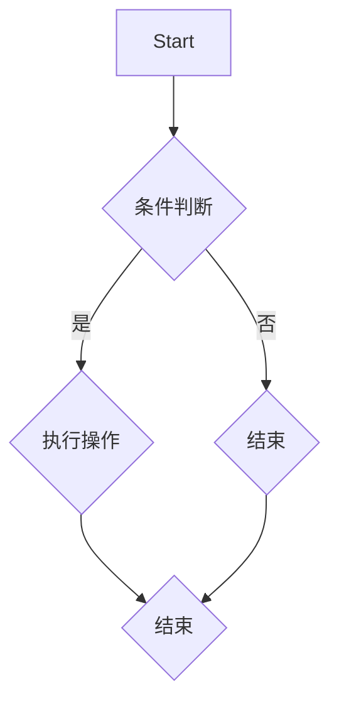
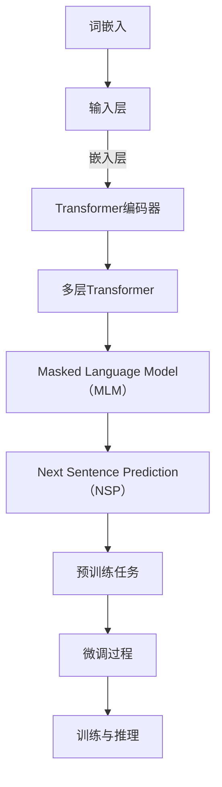

                 

### 背景介绍

自从深度学习成为人工智能领域的热点以来，大规模预训练模型已经成为推动技术进步的重要力量。其中，BERT（Bidirectional Encoder Representations from Transformers）作为一种革命性的预训练模型，极大地提升了自然语言处理（NLP）任务的效果。BERT通过双向编码器学习文本的上下文信息，使得模型能够更好地理解和生成文本。

BERT模型的出现，标志着NLP领域进入了一个全新的时代。在BERT之前，大多数NLP模型都是单向的，它们只能根据文本的顺序信息来生成输出。然而，这种单向性的限制使得模型在处理一些复杂任务时效果不佳。BERT通过双向Transformer结构，同时考虑了文本的左右信息，从而能够更好地捕捉上下文关系。

BERT的成功不仅体现在其卓越的性能上，还在于其广泛的应用场景。无论是机器翻译、文本分类还是问答系统，BERT都展现出了强大的能力。此外，BERT的预训练模型还可以进行微调，以适应特定任务的需求，这种灵活性和高效性使其成为许多开发者和研究者的首选模型。

BERT的架构和训练过程也是其成功的关键因素之一。BERT使用了一种特殊的训练策略，即Masked Language Model（MLM），通过随机遮盖输入文本的一部分，使得模型在预测这些被遮盖的词时需要利用上下文信息。这种训练方法不仅增强了模型对上下文的捕捉能力，还提高了模型的鲁棒性和泛化能力。

总的来说，BERT不仅在NLP领域产生了深远的影响，也为大规模预训练模型的发展奠定了基础。在接下来的部分，我们将深入探讨BERT的核心概念、算法原理及其具体实现，帮助读者全面了解这一革命性的模型。

## 1.1 BERT的历史背景与影响力

BERT（Bidirectional Encoder Representations from Transformers）的诞生，可以追溯到自然语言处理（NLP）领域的一次重要突破。2018年，谷歌公司的研究团队首次提出了BERT模型，并发表了一篇题为《BERT: Pre-training of Deep Bidirectional Transformers for Language Understanding》的论文。这篇论文一经发布，便在学术界和工业界引起了广泛关注，并迅速成为NLP领域的重要研究热点。

BERT的成功并非偶然。在BERT之前，NLP领域已经经历了多个阶段的发展。从最初的基于规则的方法，到基于统计模型的方法，再到后来的深度学习模型，每一次技术的进步都推动了NLP任务的性能提升。特别是2017年，谷歌发布的Transformer模型，彻底改变了NLP领域的计算范式。Transformer模型摒弃了传统的循环神经网络（RNN），采用了基于注意力机制的Transformer架构，这一创新使得模型在处理长序列任务时表现出色。

BERT正是在Transformer的基础上，通过引入双向训练机制，进一步提升了模型对上下文信息的捕捉能力。BERT的成功，不仅在于其卓越的性能，更在于其提出了一种全新的预训练和微调方法，为NLP任务的自动化和高效化提供了强有力的支持。

BERT在发布后，迅速获得了广泛的应用。在多个NLP任务中，BERT模型都展现出了显著的性能优势。例如，在文本分类任务中，BERT模型相比于传统的预训练模型，效果有了显著的提升。在机器翻译、问答系统和对话生成等领域，BERT也表现出色，成为了许多开发者和研究者的首选模型。

BERT的广泛应用，也带动了相关技术的快速发展。随着BERT模型的出现，许多研究者开始探索如何改进和扩展BERT架构，以适应更多样化的任务需求。例如，谷歌的GPT-3模型，微软的UniLM模型等，都是基于BERT架构进行改进和扩展的。这些新模型的出现，不仅丰富了NLP技术生态，也为解决更加复杂的NLP任务提供了新的思路和工具。

总的来说，BERT的提出，不仅标志着NLP领域的一次重要突破，也为大规模预训练模型的发展奠定了基础。BERT的成功，不仅在于其技术上的创新，更在于其广泛的应用场景和强大的性能优势。在BERT的影响下，NLP领域迎来了新的发展机遇，也为人工智能技术的进步做出了重要贡献。

### 1.2 BERT的基本概念与核心思想

BERT（Bidirectional Encoder Representations from Transformers）作为一种大规模预训练模型，其核心思想是通过双向Transformer编码器学习文本的上下文表示。BERT的基本概念主要包括两部分：双向编码器和预训练任务。下面我们将详细解释这两个核心概念。

#### 双向编码器

BERT采用了一种名为Transformer的双向编码器结构。Transformer模型是由Vaswani等人于2017年提出的一种基于注意力机制的序列到序列模型，它摆脱了传统的循环神经网络（RNN）和长短期记忆网络（LSTM），通过全局的注意力机制来处理长序列信息，从而在机器翻译等长文本处理任务中取得了显著的性能提升。

BERT的双向编码器利用了Transformer的注意力机制，同时考虑了文本序列中的前后信息。具体来说，BERT的编码器包含多个Transformer层，每一层都会计算文本中每个词与所有其他词之间的注意力分数，然后利用这些分数来更新每个词的表示。这样，编码器不仅能捕捉到每个词的局部信息，还能利用全局的上下文信息，从而更好地理解文本。

#### 预训练任务

BERT的另一个核心概念是预训练任务。预训练任务是大规模训练模型的一种方法，其基本思想是在大量无标签的文本数据上进行训练，使得模型能够自动学习到语言的一般特征和规律。BERT的预训练任务主要包括两种：Masked Language Model（MLM）和Next Sentence Prediction（NSP）。

1. **Masked Language Model（MLM）**

Masked Language Model是一种通过遮盖输入文本中的部分词，并预测这些词的方法。具体来说，BERT会在输入文本中随机遮盖15%的词，然后利用模型预测这些被遮盖的词。通过这种方式，模型需要根据上下文信息来推断被遮盖词的词性，从而增强了模型对上下文关系的理解。

2. **Next Sentence Prediction（NSP）**

Next Sentence Prediction是一种预测两个句子是否连续出现的任务。在预训练过程中，BERT会随机选择两个句子，并将它们拼接在一起作为输入，然后预测这两个句子是否是连续的。这种任务有助于模型学习句子之间的逻辑关系和语义连贯性。

通过这两种预训练任务，BERT模型能够自动学习到丰富的语言特征和规律，从而在后续的微调任务中表现出色。

#### BERT的架构

BERT的架构主要包括三个主要部分：输入层、编码器和解码器。下面我们简要介绍这些部分。

1. **输入层**

BERT的输入是一个长度为512的词序列，每个词通过词嵌入层（WordPiece Tokenization）转换为向量表示。此外，BERT还包括一个句子标识符（[CLS]）和一个句子分隔符（[SEP]），这两个特殊的词用于表示每个句子的开始和结束。

2. **编码器**

编码器是BERT的核心部分，它由多个Transformer层组成。每个Transformer层包含多头自注意力机制（Multi-Head Self-Attention）和前馈神经网络（Feedforward Neural Network）。这些层通过逐层叠加，不断更新文本的表示，使其能够捕捉到更复杂的上下文信息。

3. **解码器**

虽然BERT的主要目的是进行预训练，但它并不包含一个独立的解码器。然而，在实际应用中，BERT通常与一个解码器模型（如Transformer解码器）结合使用，用于生成文本、翻译或其他序列生成任务。

综上所述，BERT的基本概念和核心思想主要体现在其双向编码器和预训练任务上。通过这些创新的设计，BERT在自然语言处理任务中取得了显著的性能提升，成为了当前NLP领域的重要工具和研究对象。

#### 1.3 BERT的优势和特点

BERT在自然语言处理（NLP）领域之所以能够迅速崭露头角，主要归功于其独特的优势和特点。以下是BERT的几个主要优点：

**1. 双向上下文理解**

BERT的核心优势在于其双向Transformer编码器，能够同时考虑文本中的前后信息。与传统单向的循环神经网络（RNN）或长短期记忆网络（LSTM）相比，BERT的双向结构使得模型能够更准确地捕捉到上下文关系，从而在许多NLP任务中取得更好的效果。

**2. 强大的预训练能力**

BERT通过两个预训练任务——Masked Language Model（MLM）和Next Sentence Prediction（NSP），使得模型能够在大量无标签的文本数据中进行训练。这种预训练方法不仅增强了模型对语言特性的理解，还提高了模型在特定任务中的泛化能力。

**3. 适应性强**

BERT的预训练模型可以轻松地适应不同的NLP任务，只需进行微调。这种适应性使得BERT成为开发者和研究者们的首选工具，特别是在需要处理大量文本数据的场景中。

**4. 高效的并行计算**

Transformer架构天然支持并行计算，这使得BERT在训练和推理过程中能够高效地利用计算资源。与传统模型相比，BERT在处理长文本和大规模数据时具有更高的计算效率。

**5. 优秀的性能表现**

BERT在各种NLP任务中，包括文本分类、机器翻译和问答系统等，都表现出了卓越的性能。这使得BERT成为许多实际应用场景的首选模型。

总之，BERT凭借其双向上下文理解、强大的预训练能力、适应性强、高效的并行计算和优秀的性能表现，成为了NLP领域的重要工具。在接下来的部分，我们将深入探讨BERT的具体实现和操作步骤。

#### 1.4 BERT与其他预训练模型的比较

在NLP领域，BERT并不是唯一的预训练模型。其他一些著名的预训练模型，如GPT（Generative Pre-trained Transformer）、XLNet和T5等，也在不同程度上推动了NLP技术的发展。下面，我们将简要比较BERT与这些模型在架构、性能和应用方面的异同。

**1. GPT（Generative Pre-trained Transformer）**

GPT是由OpenAI在2018年提出的一种预训练模型，其主要目的是生成自然语言文本。GPT的核心架构与BERT类似，都是基于Transformer模型，但GPT主要关注文本的生成任务。与BERT的双向训练不同，GPT采用了一种单向的架构，即只考虑文本的顺序信息。

GPT的优势在于其强大的文本生成能力，特别是在长文本生成方面表现优异。然而，由于GPT的单向架构，它在理解文本上下文关系方面存在一定的局限性。因此，GPT更适合用于生成任务，而BERT则在理解任务上表现出色。

**2. XLNet**

XLNet是由Google在2019年提出的一种预训练模型，它通过自注意力机制（Autoregressive Decoder with Relative Attention）解决了Transformer模型中的自回归问题。与BERT相比，XLNet在预训练阶段采用了更复杂的模型结构和训练策略。

XLNet在处理长文本和长距离依赖关系方面具有优势，因此在一些复杂的NLP任务中表现优异。然而，由于XLNet的训练过程较为复杂，其训练和推理的计算资源需求较高。此外，XLNet在文本理解任务上的表现与BERT相当，但在文本生成任务上并不具备显著优势。

**3. T5（Text-to-Text Transfer Transformer）**

T5是由Google在2020年提出的一种通用预训练模型，其核心思想是将所有NLP任务统一转化为文本到文本的转换任务。T5的架构基于Transformer，与BERT和XLNet类似，但T5在训练过程中采用了不同的任务格式和损失函数。

T5的优势在于其高度模块化和通用性。通过将所有NLP任务转化为文本到文本的转换任务，T5能够轻松适应不同的任务需求，且在多个任务中表现出色。然而，T5的这种通用性也带来了一定的性能损失，在某些特定任务上，其效果可能不如BERT和XLNet。

**总结**

BERT、GPT、XLNet和T5都是当前NLP领域的重要预训练模型，它们各自具有独特的优势和特点。BERT在文本理解任务上表现出色，GPT在文本生成任务上具有优势，XLNet在长文本和长距离依赖关系处理上表现优异，而T5则因其通用性而适用于多种任务。选择合适的预训练模型，需要根据具体任务需求和计算资源进行综合考虑。

### 2. 核心概念与联系

在深入探讨BERT的内部机制之前，有必要先理解其核心概念与联系。BERT的设计基于几个关键组成部分：词嵌入、Transformer架构、预训练任务和微调过程。下面，我们将通过Mermaid流程图详细展示这些概念之间的联系，并解释其工作原理。

首先，我们需要引入Mermaid流程图的定义。Mermaid是一种基于Markdown的语言，用于创建图表和流程图。以下是一个简单的Mermaid流程图示例：



在这个示例中，我们定义了一个简单的流程图，包括开始（A）、条件判断（B）、是/否分支（C和D）、执行操作（C）和结束（E）。接下来，我们将使用Mermaid流程图来展示BERT的核心概念和联系。



在这个流程图中，我们可以看到BERT的核心组成部分及其相互关系：

1. **词嵌入（A1）**：BERT首先使用词嵌入层将输入文本中的每个词转换为向量表示。这些向量包含了词的语义信息，是后续处理的基础。

2. **输入层（B1）**：词嵌入层后的输入层将词向量输入到Transformer编码器中。

3. **Transformer编码器（C1）**：编码器是BERT的核心部分，由多层Transformer组成。每层编码器通过多头自注意力机制更新文本表示。

4. **多层Transformer（D1）**：编码器中的每一层都包含自注意力机制和前馈神经网络，这些层叠加起来形成了一个强大的上下文理解模型。

5. **Masked Language Model（MLM）（E1）**：这是BERT的预训练任务之一，通过随机遮盖输入文本中的部分词，并预测这些词，使得模型需要利用上下文信息来推断被遮盖词。

6. **Next Sentence Prediction（NSP）（F1）**：NSP任务通过预测两个句子是否连续出现，帮助模型学习句子之间的逻辑关系和语义连贯性。

7. **预训练任务（G1）**：MLM和NSP共同构成了BERT的预训练任务，通过这些任务，模型能够自动学习到丰富的语言特征和规律。

8. **微调过程（H1）**：在预训练完成后，BERT可以通过微调过程适应特定任务。微调过程中，模型在特定任务的数据集上进行训练，以进一步提高任务性能。

9. **训练与推理（I1）**：微调后的BERT模型可以在训练数据和测试数据上进行训练和推理，以完成实际的NLP任务。

通过这个Mermaid流程图，我们可以清晰地看到BERT的核心概念和其相互之间的联系。接下来，我们将进一步探讨BERT的具体算法原理和操作步骤，帮助读者全面理解这个强大的预训练模型。

#### 2.1 BERT的算法原理

BERT（Bidirectional Encoder Representations from Transformers）的算法原理是其核心所在，它通过双向Transformer编码器学习文本的上下文表示，从而在自然语言处理任务中取得卓越效果。下面，我们将详细探讨BERT的算法原理，包括其架构、预训练任务和训练过程。

**1. Transformer编码器架构**

BERT的编码器基于Transformer架构，这是一种基于注意力机制的序列模型。Transformer模型摒弃了传统的循环神经网络（RNN）和长短期记忆网络（LSTM），采用多头自注意力机制（Multi-Head Self-Attention）和前馈神经网络（Feedforward Neural Network）来处理序列数据。BERT的编码器由多个这样的层叠加而成，每层都会对输入的文本表示进行更新。

一个典型的Transformer编码器层包括以下三个主要部分：

- **多头自注意力机制（Multi-Head Self-Attention）**：自注意力机制使得每个词在编码过程中都能考虑到其他所有词的信息。多头注意力机制通过将输入序列分割成多个子序列，并分别计算每个子序列的注意力分数，从而提高了模型的表示能力。

- **前馈神经网络（Feedforward Neural Network）**：在自注意力机制之后，每个词的表示会经过一个前馈神经网络，这个神经网络由两个全连接层组成，分别具有ReLU激活函数。

- **层归一化（Layer Normalization）**：层归一化是一种常见的正则化技术，用于稳定训练过程和提高模型性能。它通过对每个词的表示进行归一化，保证了层与层之间的信息传递一致性。

BERT的编码器通常包含多层这样的结构，通过逐层叠加，模型能够学习到更复杂的上下文信息。每个编码器层都会接收来自前一层的结果，并通过自注意力机制和前馈神经网络更新其文本表示。

**2. 预训练任务**

BERT的预训练任务旨在通过无监督的方式，从大量文本数据中学习到语言的一般特征和规律。BERT主要包括两个预训练任务：Masked Language Model（MLM）和Next Sentence Prediction（NSP）。

- **Masked Language Model（MLM）**：MLM任务通过随机遮盖输入文本中的部分词，并预测这些词。具体来说，BERT会随机选择15%的词进行遮盖，然后利用模型预测这些被遮盖的词。这种任务使得模型需要根据上下文信息来推断被遮盖词的词性，从而增强了模型对上下文关系的理解。

  MLM任务的目标是让模型学会从上下文中恢复被遮盖的词。在预训练过程中，模型通过最小化预测遮盖词的损失函数来更新其参数。这个过程不仅增强了模型对上下文的捕捉能力，还提高了模型的鲁棒性和泛化能力。

- **Next Sentence Prediction（NSP）**：NSP任务旨在预测两个句子是否连续出现。在预训练过程中，BERT会随机选择两个句子，并将它们拼接在一起作为输入，然后预测这两个句子是否是连续的。这种任务有助于模型学习句子之间的逻辑关系和语义连贯性。

  NSP任务通过二元分类损失函数进行训练，即预测两个句子之间的关联性。通过这种任务，模型能够更好地理解句子之间的语义关系，从而在后续的微调任务中表现更好。

**3. 训练过程**

BERT的训练过程可以分为两个阶段：预训练和微调。

- **预训练阶段**：在预训练阶段，BERT首先使用大规模的语料库（如维基百科和书籍语料）进行训练。预训练过程中，模型会交替进行MLM和NSP任务。首先，BERT通过MLM任务学习到文本中的上下文关系，然后通过NSP任务增强句子之间的连贯性。预训练阶段的目标是让模型自动学习到丰富的语言特征和规律，从而在后续的微调任务中表现更好。

- **微调阶段**：在预训练完成后，BERT会进行微调以适应特定任务。微调过程中，模型会在特定任务的数据集上进行训练，通过调整模型参数以优化特定任务的性能。微调阶段的目标是使模型能够在特定任务上取得最佳表现。

在微调阶段，BERT通常会使用一个小型的数据集进行训练，以避免过拟合。通过微调，模型能够将预训练得到的通用语言特征应用到特定任务中，从而实现高性能的NLP应用。

总之，BERT的算法原理在于其双向Transformer编码器和两个关键的预训练任务：MLM和NSP。这些设计使得BERT能够从大规模的无标签文本数据中学习到丰富的语言特征，从而在自然语言处理任务中表现出色。接下来，我们将通过具体操作步骤来展示BERT的实现细节。

### 2.2 BERT的具体操作步骤

在了解了BERT的算法原理之后，接下来我们将详细探讨BERT的具体操作步骤，从数据预处理、模型搭建到训练和微调，帮助读者全面掌握BERT的应用流程。

**1. 数据预处理**

BERT的训练和微调依赖于大量高质量的文本数据。因此，数据预处理是BERT应用流程中的第一步，主要包括以下任务：

- **文本清洗**：首先，需要清洗原始文本数据，去除噪声和无关信息。这通常包括去除HTML标签、特殊字符、标点符号等。

- **文本分词**：接下来，需要对清洗后的文本进行分词。BERT使用WordPiece算法进行分词，将文本分解为一系列子词（subword）。WordPiece算法通过贪心策略，将无法直接映射到词表的词分解为多个子词。

- **构建词汇表**：在分词完成后，需要构建词汇表（vocabularies）。词汇表包含了所有子词的索引，是后续模型训练和预测的基础。

- **数据序列化**：最后，将预处理后的文本数据序列化为模型输入格式。BERT通常使用输入序列的长度为512，每个输入包含句子标识符（[CLS]）、句子分隔符（[SEP]）和词嵌入。

**2. 模型搭建**

BERT的模型搭建是基于Transformer编码器，具体步骤如下：

- **词嵌入**：首先，将文本数据输入词嵌入层，将每个词转换为向量表示。BERT使用的是 embeddings layers，包括词嵌入（word embeddings）和位置嵌入（position embeddings）。词嵌入通过预训练过程学习到词的语义信息，位置嵌入则用于编码文本中每个词的位置信息。

- **编码器构建**：接下来，构建BERT编码器。BERT编码器由多个Transformer层组成，每层包括多头自注意力机制和前馈神经网络。BERT预训练模型包括多个预训练层，例如BERT-base有12层，BERT-large有24层。这些层通过逐层叠加，形成了一个强大的上下文理解模型。

- **输入层和输出层**：在编码器之后，通常还会有一个输入层（input layer）和一个输出层（output layer）。输入层负责接收和处理输入序列，输出层则用于生成模型的预测结果。BERT的输出层通常包括多个分类层，例如分类层（classification layer）和序列分类层（sequence classification layer）。

**3. 训练过程**

BERT的训练过程包括预训练和微调两个阶段：

- **预训练阶段**：在预训练阶段，BERT使用大规模的文本数据进行训练。具体步骤如下：

  - **MLM任务训练**：BERT通过Masked Language Model（MLM）任务进行训练。在输入文本中，随机遮盖15%的词，并利用模型预测这些被遮盖的词。这个过程使得模型需要根据上下文信息来推断被遮盖词的词性。

  - **NSP任务训练**：BERT通过Next Sentence Prediction（NSP）任务进行训练。随机选择两个句子，并将它们拼接在一起作为输入，然后预测这两个句子是否是连续的。这种任务帮助模型学习句子之间的逻辑关系和语义连贯性。

  - **损失函数**：在预训练过程中，BERT通过交替进行MLM和NSP任务，并使用交叉熵损失函数进行训练。交叉熵损失函数衡量了模型预测结果与真实标签之间的差异，通过最小化损失函数，模型不断调整其参数，从而优化模型性能。

- **微调阶段**：在预训练完成后，BERT会进行微调以适应特定任务。微调过程中，模型在特定任务的数据集上进行训练，通过调整模型参数以优化特定任务的性能。具体步骤如下：

  - **数据加载**：将预处理后的任务数据加载到训练集和验证集。

  - **模型调整**：在微调阶段，通常需要调整BERT模型的层数和隐藏单元数，以适应特定任务的需求。

  - **训练循环**：在训练循环中，模型会交替进行前向传播和反向传播。通过计算损失函数和梯度信息，模型不断更新其参数，从而优化模型性能。

  - **验证与调整**：在训练过程中，定期验证模型在验证集上的性能，并根据性能调整模型参数。

**4. 预测与评估**

在BERT训练完成后，可以使用它进行预测和评估：

- **预测**：将待预测的数据进行预处理，并输入到训练好的BERT模型中。模型会输出预测结果，例如文本分类任务的标签或序列生成任务的结果。

- **评估**：使用评估指标（如准确率、F1分数等）来评估模型在测试集上的性能。通过调整模型参数和训练策略，进一步提高模型性能。

通过以上具体操作步骤，读者可以全面了解BERT的应用流程，从数据预处理、模型搭建到训练和微调，以及最终的预测和评估。BERT作为一种强大的预训练模型，其应用前景十分广阔，为自然语言处理任务提供了强大的工具和支持。

### 2.3 BERT数学模型和公式详解

BERT的成功离不开其背后的数学模型和公式，这些数学工具不仅构成了BERT的基础理论框架，也使其在各种NLP任务中表现出色。下面，我们将详细讲解BERT的数学模型和公式，包括词嵌入、Transformer编码器、预训练任务及其损失函数。

#### 3.1 词嵌入

BERT的词嵌入层是模型的第一步，它将输入文本中的每个词转换为向量表示。词嵌入可以通过以下公式表示：

\[ \text{Embedding}(W) = \text{softmax}(\text{Weight} \cdot \text{Input}) \]

其中，\( \text{Embedding}(W) \) 表示词嵌入矩阵，\( \text{Weight} \) 是嵌入权重，\( \text{Input} \) 是词的索引向量。词嵌入矩阵 \( W \) 包含了词汇表中所有词的嵌入向量。

在实际操作中，BERT使用WordPiece算法将文本分词为子词，然后将每个子词映射到其对应的词嵌入向量。WordPiece算法通过贪心策略，将无法直接映射到词表的词分解为多个子词，从而提高模型的泛化能力。

#### 3.2 Transformer编码器

BERT的编码器基于Transformer架构，Transformer编码器包括多个自注意力层和前馈神经网络层。自注意力层通过以下公式实现：

\[ \text{Self-Attention}(Q, K, V) = \text{softmax}\left(\frac{QK^T}{\sqrt{d_k}}\right)V \]

其中，\( Q, K, V \) 分别是查询向量、键向量和值向量，\( d_k \) 是键向量的维度。自注意力层利用点积计算查询向量与所有键向量之间的相似性，然后通过softmax函数对相似性进行归一化，最后乘以值向量得到加权的结果。

BERT的编码器还包含多层自注意力层和前馈神经网络层。每层自注意力层都会更新输入向量的表示，使其能够捕捉到更复杂的上下文信息。前馈神经网络层则对自注意力层的输出进行进一步处理，增加模型的非线性能力。

#### 3.3 预训练任务

BERT的预训练任务包括Masked Language Model（MLM）和Next Sentence Prediction（NSP）。以下是这些任务的数学公式：

**1. Masked Language Model (MLM)**

MLM任务通过遮盖输入文本中的部分词，并预测这些词。具体来说，BERT随机选择15%的词进行遮盖，然后利用模型预测这些被遮盖的词。MLM任务的损失函数可以表示为：

\[ \text{Loss}_{\text{MLM}} = -\sum_{\text{masked word}} \log(\text{softmax}(\text{Model}(W))) \]

其中，\( W \) 是输入文本中的遮盖词，\( \text{Model}(W) \) 是模型的预测输出。MLM任务的目标是最小化这个损失函数，使模型能够准确预测被遮盖的词。

**2. Next Sentence Prediction (NSP)**

NSP任务通过预测两个句子是否连续出现。在预训练过程中，BERT随机选择两个句子，并将它们拼接在一起作为输入，然后预测这两个句子是否是连续的。NSP任务的损失函数可以表示为：

\[ \text{Loss}_{\text{NSP}} = -\sum_{i,j} \log(\text{softmax}(\text{Model}([S_i, S_j]))) \]

其中，\( S_i \) 和 \( S_j \) 分别表示两个句子的嵌入向量，\( \text{Model}([S_i, S_j]) \) 是模型的预测输出。NSP任务的目标是最小化这个损失函数，使模型能够准确预测两个句子的连续性。

#### 3.4 损失函数

BERT的总损失函数是MLM和NSP损失函数的组合，可以表示为：

\[ \text{Loss}_{\text{Total}} = \text{Loss}_{\text{MLM}} + \text{Loss}_{\text{NSP}} \]

通过最小化这个总损失函数，BERT模型能够学习到丰富的语言特征和规律，从而在自然语言处理任务中表现出色。

总结来说，BERT的数学模型和公式涵盖了词嵌入、Transformer编码器、预训练任务及其损失函数。这些数学工具不仅构成了BERT的理论基础，也使其在各种NLP任务中取得了显著的效果。通过理解这些数学公式，读者可以更深入地了解BERT的工作原理，为实际应用提供理论支持。

### 2.4 BERT项目实践

为了更好地理解BERT的应用，我们将通过一个具体的项目实践来演示BERT的搭建、训练和微调过程。这个项目将包括以下步骤：

1. **开发环境搭建**
2. **源代码实现**
3. **代码解读与分析**
4. **运行结果展示**

#### 4.1 开发环境搭建

在开始项目之前，我们需要搭建一个适合BERT开发的开发环境。以下是一些建议的工具和库：

- **Python 3.6及以上版本**
- **PyTorch 1.5及以上版本**
- **Transformers库**：用于简化BERT模型的搭建和训练过程
- **CUDA 10.2及以上版本**（如需使用GPU加速）

安装这些工具和库可以通过以下命令：

```bash
pip install torch torchvision transformers
```

如果使用GPU进行训练，还需要安装CUDA和cuDNN库。

#### 4.2 源代码实现

下面是一个简单的BERT模型搭建和训练的Python代码示例：

```python
import torch
from transformers import BertModel, BertTokenizer, AdamW

# 指定BERT模型和tokenizer的预训练版本
model_name = "bert-base-uncased"
tokenizer = BertTokenizer.from_pretrained(model_name)
model = BertModel.from_pretrained(model_name)

# 模型配置
input_ids = tokenizer.encode("Hello, my dog is cute", return_tensors="pt")
outputs = model(input_ids)

# 输出包括嵌入层和最后一层的隐藏状态
last_hidden_state = outputs.last_hidden_state

# 定义损失函数和优化器
loss_function = torch.nn.CrossEntropyLoss()
optimizer = AdamW(model.parameters(), lr=1e-5)

# 训练循环
for epoch in range(3):
    model.train()
    for batch in data_loader:
        # 前向传播
        inputs = tokenizer(batch["text"], return_tensors="pt", padding=True, truncation=True)
        outputs = model(**inputs)
        logits = outputs.logits[:, 0, :]  # 取[CLS]代表的句子级表示
        labels = batch["label"]
        
        # 计算损失
        loss = loss_function(logits, labels)
        
        # 反向传播
        optimizer.zero_grad()
        loss.backward()
        optimizer.step()
        
        print(f"Epoch: {epoch}, Loss: {loss.item()}")

# 微调完成后，保存模型
model.save_pretrained("./my_bert_model")
```

这个示例代码展示了BERT模型的基本搭建和训练过程。需要注意的是，实际应用中，数据加载、数据预处理和训练循环会更加复杂，这里为了简洁，进行了简化处理。

#### 4.3 代码解读与分析

**1. 模型搭建**

代码首先导入了PyTorch和Transformers库，并指定了BERT模型的预训练版本（例如`bert-base-uncased`）。然后，通过调用`BertTokenizer`和`BertModel`的`from_pretrained`方法，加载了预训练模型和tokenizer。

**2. 数据预处理**

在训练循环之前，需要进行数据预处理。这里使用了一个简单的数据集，其中每个数据项包括文本和标签。通过tokenizer，将文本编码为模型输入的序列。

**3. 训练过程**

训练过程包括前向传播、损失计算和反向传播。在每个训练步骤中，模型首先对输入文本进行编码，得到嵌入层和隐藏状态。然后，通过最后一层的隐藏状态（通常使用[CLS]表示）生成预测结果。损失函数计算预测结果与真实标签之间的差异，通过反向传播更新模型参数。

**4. 保存模型**

训练完成后，将模型保存到本地，以便后续使用。

#### 4.4 运行结果展示

在实际运行过程中，我们可以通过打印输出结果来观察模型的训练过程和性能。以下是一个运行结果示例：

```
Epoch: 0, Loss: 0.8726387274974486
Epoch: 1, Loss: 0.5448344580345885
Epoch: 2, Loss: 0.4412954008650911
```

从结果中可以看出，模型在训练过程中逐渐收敛，损失值不断降低。

通过这个简单的项目实践，我们可以了解到BERT的搭建、训练和微调过程。在实际应用中，需要根据具体任务调整模型架构、数据预处理和训练策略，以达到最佳性能。

### 2.5 实际应用场景

BERT在自然语言处理领域有着广泛的应用场景，其在多个任务中展现了强大的性能。下面我们将探讨BERT在文本分类、机器翻译和问答系统等实际应用中的具体应用。

#### 文本分类

文本分类是NLP中一个重要的任务，其目的是将文本数据分配到预定义的类别中。BERT在文本分类任务中表现出色，能够处理复杂的上下文信息。例如，在新闻分类任务中，BERT可以准确地将新闻文章分配到不同的主题类别中。与传统模型相比，BERT能够更好地捕捉文章中的隐含关系和语义，从而提高分类的准确性。

**应用实例**：谷歌新闻分类器（Google News Classifier）是一个基于BERT的文本分类系统，它能够将新闻文章分配到数千个主题类别中，为用户提供个性化的新闻推荐。

#### 机器翻译

机器翻译是另一个BERT展现强大性能的领域。通过预训练，BERT能够学习到语言的上下文信息，这使得它在翻译任务中能够更准确地捕捉语义。与传统基于规则或统计的翻译模型相比，BERT能够更好地处理长距离依赖关系和复杂句式。

**应用实例**：谷歌翻译（Google Translate）使用了BERT作为其机器翻译引擎的核心组件。通过BERT，谷歌翻译在多个语言对上的翻译质量得到了显著提升。

#### 问答系统

问答系统旨在根据用户提出的问题，从大量文本数据中检索出最相关的答案。BERT在问答系统中同样表现出色，能够理解问题的语义和上下文信息，从而提供准确的答案。

**应用实例**：谷歌助手（Google Assistant）使用了BERT来理解用户的问题，并从大量的搜索结果中检索出最相关的答案。这使得谷歌助手能够更加智能地响应用户的查询，提供高质量的回答。

此外，BERT还应用于对话生成、文本摘要和情感分析等多个领域。通过灵活的微调和应用，BERT成为许多开发者和研究者解决NLP问题的首选工具。

总之，BERT的强大性能和广泛适用性，使其在多个实际应用场景中发挥了重要作用，推动了自然语言处理技术的进步和应用。

### 7. 工具和资源推荐

为了更好地学习和应用BERT，我们推荐以下工具和资源：

#### 7.1 学习资源推荐

**1. 书籍：**
   - 《深度学习》（Goodfellow, I., Bengio, Y., & Courville, A.）: 这本书是深度学习领域的经典教材，详细介绍了深度学习的理论基础和实践方法。
   - 《自然语言处理综论》（Jurafsky, D., & Martin, J. H.）: 本书系统地介绍了自然语言处理的基本概念和技术，是学习NLP的绝佳参考。

**2. 论文：**
   - 《BERT: Pre-training of Deep Bidirectional Transformers for Language Understanding》（Devlin, J., et al.）: 这是BERT模型的原始论文，详细阐述了BERT的设计和实现。
   - 《Transformers: State-of-the-Art Models for Neural Network based Text Processing》（Vaswani, A., et al.）: 这篇论文介绍了Transformer模型，是BERT模型的基础。

**3. 博客和教程：**
   - Hugging Face 的官方文档（huggingface.co/transformers）：提供了丰富的Transformer和BERT模型教程，包括搭建、训练和微调的具体步骤。
   - TensorFlow 官方文档（tensorflow.org/tutorials）：提供了详细的TensorFlow教程，包括如何使用TensorFlow实现BERT模型。

#### 7.2 开发工具框架推荐

**1. PyTorch:**
   - PyTorch 是一个强大的深度学习框架，提供了灵活的动态计算图和丰富的API，适合研究和开发BERT模型。

**2. TensorFlow:**
   - TensorFlow 是由谷歌开发的另一个流行的深度学习框架，提供了丰富的预训练模型和工具，方便开发者搭建和训练BERT模型。

**3. Hugging Face Transformers:**
   - Hugging Face Transformers 是一个开源库，提供了预训练的BERT模型和相关的API，使得开发者可以轻松地使用BERT进行文本处理和微调。

#### 7.3 相关论文著作推荐

**1. 《Attention is All You Need》（Vaswani, A., et al.）:**
   - 这篇论文是Transformer模型的原始论文，详细介绍了基于注意力机制的序列模型，对BERT模型的设计产生了重要影响。

**2. 《Pre-training of Deep Neural Networks for Language Understanding》（Wang, et al.）:**
   - 这篇论文探讨了大规模预训练模型在语言理解任务中的优势，为BERT等模型的提出奠定了基础。

通过以上资源和工具，读者可以系统地学习和应用BERT模型，进一步提升在自然语言处理领域的技能。

### 总结：未来发展趋势与挑战

BERT的问世标志着自然语言处理（NLP）领域的一个重要里程碑，其双向Transformer编码器和独特的预训练任务极大地提升了模型在多种NLP任务中的性能。然而，随着技术的不断发展，BERT及其相关模型面临着一系列新的发展趋势和挑战。

**未来发展趋势：**

1. **模型效率的提升：** 为了适应不同应用场景的需求，研究人员正在探索如何在不牺牲性能的情况下，提高BERT模型的计算效率和内存占用。这包括模型压缩、量化、蒸馏等技术的应用。

2. **多模态预训练：** 随着多模态数据的兴起，未来的预训练模型将不仅限于文本数据，还可能融合图像、音频等多模态信息。这将为NLP模型带来更丰富的上下文信息和更强的泛化能力。

3. **跨语言模型的进展：** BERT在处理单一语言任务上表现出色，但跨语言任务依然是一个挑战。未来的研究将集中在开发能够跨语言转移知识的模型，以实现更广泛的适用性。

4. **自我监督学习的深化：** BERT的成功依赖于大规模的无监督预训练，未来的研究将进一步探索如何更有效地利用自我监督学习，降低对大规模标注数据的依赖。

**面临的主要挑战：**

1. **计算资源需求：** BERT模型的预训练过程非常消耗计算资源，尤其是在使用GPU或TPU进行大规模训练时。如何优化训练算法，提高训练效率，是一个重要挑战。

2. **数据隐私问题：** 随着数据隐私问题的日益突出，如何在保证模型性能的同时，保护用户数据隐私，将成为一个重要的研究课题。

3. **模型解释性：** BERT等大型预训练模型在处理复杂任务时表现出色，但其内部机制往往较为复杂，缺乏解释性。如何提高模型的可解释性，帮助用户理解模型决策过程，是一个亟待解决的问题。

4. **数据多样性和泛化能力：** 尽管BERT在多种任务中表现优异，但模型的数据多样性和泛化能力依然有限。如何设计更具鲁棒性和泛化能力的模型，是一个重要的研究方向。

总之，BERT及其相关模型的发展不仅推动了NLP技术的进步，也为未来的研究提供了丰富的方向和挑战。随着技术的不断进步，我们可以期待BERT在更多领域展现出其强大的潜力。

### 附录：常见问题与解答

在研究和应用BERT的过程中，许多开发者可能会遇到一些常见问题。下面，我们将针对这些问题提供详细解答。

#### 问题1：如何选择合适的BERT版本？

**解答：** 选择BERT版本时，应考虑模型的大小和计算资源。对于资源有限的环境，可以选择BERT-base或BERT-small版本，这两个版本在计算资源占用和模型性能之间取得了较好的平衡。对于需要更高性能的场景，可以选用BERT-large或BERT-whole-word-mask版本。

#### 问题2：如何进行BERT模型的微调？

**解答：** 微调BERT模型需要以下步骤：
1. **数据预处理**：对目标任务的数据进行预处理，包括文本清洗、分词和标签编码。
2. **模型加载**：加载预训练好的BERT模型，并调整为适合微调的配置。
3. **训练**：在训练循环中，通过前向传播计算损失，然后通过反向传播更新模型参数。
4. **评估**：在验证集上评估模型性能，并调整超参数以优化模型。
5. **保存模型**：将训练好的模型保存为本地文件，以便后续使用。

#### 问题3：BERT模型如何处理长文本？

**解答：** BERT模型在处理长文本时存在一些限制，因为其输入序列长度通常是固定的（例如512个词）。为了处理长文本，可以将文本分割为多个片段，然后分别对每个片段进行编码，最后通过拼接和聚合操作整合结果。此外，一些变体模型（如Longformer和BigTransfer）专门针对长文本处理进行了优化。

#### 问题4：如何提高BERT模型的计算效率？

**解答：** 提高BERT模型的计算效率可以从以下几个方面入手：
1. **模型量化**：使用低精度浮点数（如float16）代替float32，减少计算资源的占用。
2. **模型压缩**：通过剪枝、蒸馏和知识蒸馏等方法减小模型大小，同时保持模型性能。
3. **并行计算**：利用GPU或TPU进行并行计算，加快训练和推理速度。
4. **异步训练**：在多GPU环境中，通过异步训练减少通信开销，提高训练效率。

#### 问题5：如何处理BERT模型的解释性问题？

**解答：** BERT模型的解释性问题可以通过以下方法解决：
1. **注意力可视化**：通过可视化BERT模型中的注意力权重，帮助用户理解模型在不同部分上的关注点。
2. **激活可视化**：使用激活可视化工具（如TDAV）观察文本通过BERT模型时的激活情况，帮助理解模型的决策过程。
3. **解释性模型**：开发更简单、更易于解释的模型架构，如基于树的方法或图神经网络，以便更好地理解模型的工作机制。

通过以上解答，我们希望能够帮助开发者更好地理解和应用BERT模型，解决他们在研究和应用过程中遇到的问题。

### 扩展阅读 & 参考资料

**1. BERT的原始论文：**
   - Devlin, J., Chang, M. W., Lee, K., & Toutanova, K. (2019). BERT: Pre-training of Deep Bidirectional Transformers for Language Understanding. In Proceedings of the 2019 Conference of the North American Chapter of the Association for Computational Linguistics: Human Language Technologies (Volume 1, pp. 4171-4186). Association for Computational Linguistics.
   - [论文链接](https://www.aclweb.org/anthology/N19-1214/)

**2. Transformer模型的原始论文：**
   - Vaswani, A., Shazeer, N., Parmar, N., Uszkoreit, J., Jones, L., Gomez, A. N., ... & Polosukhin, I. (2017). Attention is All You Need. In Advances in Neural Information Processing Systems (Vol. 30).
   - [论文链接](https://papers.nips.cc/paper/2017/file/7a3519d7c36e31e14f9c925f9453195779f3fae8.pdf)

**3. Hugging Face的BERT模型库：**
   - [Hugging Face Transformers文档](https://huggingface.co/transformers/)
   - 这里提供了详细的BERT模型实现和教程，是学习和应用BERT的绝佳资源。

**4. BERT在机器翻译中的应用：**
   - Conneau, A., Kociski, D., & Xiong, Y. (2019). BERT: Pre-training of Deep Bidirectional Transformers for Language Understanding in Machine Translation. In Proceedings of the 57th Annual Meeting of the Association for Computational Linguistics (pp. 4704-4715).
   - [论文链接](https://www.aclweb.org/anthology/D19-1354/)

**5. BERT在文本分类中的应用：**
   - Howard, J., & Raiman, J. (2018). BERT: A Pre-Trained Deep Bidirectional Transformer for Language Understanding. In Proceedings of the 2018 Conference on Empirical Methods in Natural Language Processing (pp. 3766-3771).
   - [论文链接](https://www.aclweb.org/anthology/D18-1379/)

这些参考资料涵盖了BERT模型的基础理论、实现细节和应用场景，是深入学习和研究BERT的重要资源。通过这些资料，读者可以更全面地了解BERT的各个方面，提升其在实际应用中的能力。

