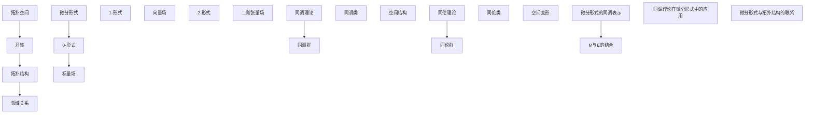

                 

### 背景介绍

代数拓扑和微分形式是现代数学中两个重要的分支，它们不仅在数学理论研究中具有重要地位，也在物理学、工程学、计算机科学等多个领域中有着广泛应用。本文将重点探讨代数拓扑中的微分形式发展研究，旨在揭示微分形式在代数拓扑中的重要性和研究现状。

#### 代数拓扑的基本概念

代数拓扑是数学的一个分支，主要研究空间的结构和性质，通过代数工具来描述和研究拓扑空间。代数拓扑的核心内容包括：同调理论、同伦理论和代数拓扑空间的分类与结构。同调理论是代数拓扑中最基本的概念之一，通过定义一组映射（同调群）来描述空间的结构。同伦理论则研究空间之间的连续变换，通过同伦群来刻画空间的稳定性。代数拓扑空间的分类与结构研究旨在通过代数工具对拓扑空间进行分类，并揭示它们之间的结构关系。

#### 微分形式的基本概念

微分形式是微分几何中的一个基本概念，它描述了空间中的几何结构。微分形式分为两类：0-形式、1-形式、2-形式等，其中0-形式是最简单的，通常表示为一个标量场；1-形式表示为向量场；2-形式则表示为二阶张量场。微分形式在微分几何中有着广泛的应用，例如在研究曲面和曲率、流形上的几何结构等方面发挥着重要作用。

#### 微分形式与代数拓扑的关系

微分形式与代数拓扑之间有着紧密的联系。首先，微分形式可以通过代数工具来定义和计算，如同调群和同伦群。其次，微分形式可以用来描述和刻画拓扑空间的结构和性质，如同调类和同伦类。此外，微分形式在拓扑空间的分类和结构研究中也有着重要应用，例如通过微分形式来区分不同的拓扑空间。

#### 微分形式的发展历程

微分形式的研究始于18世纪，当时的数学家们开始探索如何用微分形式来描述空间中的几何结构。19世纪，高斯和黎曼等数学家对微分形式进行了深入的研究，建立了微分几何的基本框架。20世纪初，庞加莱和霍奇等人进一步发展了微分形式的同调理论，为代数拓扑的研究奠定了基础。20世纪中叶，弗里德里奇和托姆等数学家通过微分形式研究空间的结构和分类，推动了代数拓扑的发展。

#### 微分形式在现代数学中的应用

现代数学中，微分形式在多个领域有着广泛的应用。在物理学中，微分形式被广泛应用于研究场论和引力理论。在工程学中，微分形式被用于分析弹性结构和流体力学。在计算机科学中，微分形式在图形处理和计算几何中发挥着重要作用。此外，微分形式在量子场论、拓扑量子计算等领域也有着重要应用。

综上所述，微分形式在代数拓扑和现代数学中具有重要地位和广泛的应用。本文将在此基础上，进一步探讨微分形式的发展和研究现状，以期为相关领域的研究提供参考和启示。

## 2. 核心概念与联系

在探讨代数拓扑中的微分形式发展研究之前，我们首先需要理解其中的核心概念和它们之间的相互联系。以下将详细介绍这些核心概念，并使用 Mermaid 流程图来展示它们之间的关系。

### 2.1 核心概念

**1. 拓扑空间**

拓扑空间是代数拓扑的基本研究对象。一个拓扑空间由一个集合和定义在这个集合上的一个拓扑结构组成。拓扑结构通过一组开集来描述空间中的邻域关系，这些开集满足一些基本的性质，如闭合性、传递性等。

**2. 微分形式**

微分形式是微分几何的基本概念，用于描述空间中的几何结构。它们可以分为多种类型，如0-形式、1-形式、2-形式等。0-形式通常是一个标量场，1-形式是一个向量场，而2-形式是一个二阶张量场。

**3. 同调理论**

同调理论是代数拓扑的核心内容之一，通过同调群来描述空间的结构和性质。同调群由一组映射组成，这些映射可以看作是空间中“洞”的计数。

**4. 同伦理论**

同伦理论是代数拓扑的另一核心内容，通过同伦群来研究空间之间的连续变换。同伦群可以看作是空间中“变形”的计数。

**5. 微分形式的同调表示**

微分形式的同调表示是将微分形式与同调理论相结合的方法。通过这种表示，可以将微分形式视为同调群中的元素，从而利用同调理论来研究微分形式的性质。

### 2.2 Mermaid 流程图

以下是这些核心概念之间的 Mermaid 流程图：



### 2.3 关系阐述

1. **拓扑空间与开集**：拓扑空间通过定义一组开集来描述邻域关系，这些开集构成了拓扑结构的基础。

2. **微分形式与标量场、向量场、张量场**：微分形式是描述空间几何结构的基本工具，包括0-形式（标量场）、1-形式（向量场）和2-形式（张量场）。

3. **同调理论与同调群**：同调理论通过同调群来描述空间的结构，这些群反映了空间中的“洞”或“连通性”。

4. **同伦理论与同伦群**：同伦理论通过同伦群来描述空间之间的连续变换，这些群反映了空间的“稳定性”。

5. **微分形式的同调表示**：微分形式的同调表示是将微分形式与同调理论相结合的方法，通过这种方法，可以将微分形式视为同调群中的元素，从而利用同调理论来研究微分形式的性质。

通过以上核心概念和它们之间的相互联系，我们可以更深入地理解代数拓扑中的微分形式。在接下来的章节中，我们将进一步探讨微分形式的算法原理、具体操作步骤、数学模型和公式，以及在实际应用中的项目实践。

## 3. 核心算法原理 & 具体操作步骤

在理解了代数拓扑和微分形式的基本概念之后，我们需要深入探讨其中的核心算法原理，以及如何在实际操作中应用这些原理。以下是代数拓扑中的微分形式研究的主要算法原理和具体操作步骤。

### 3.1. 算法原理

**1. 同调群计算**

同调群是代数拓扑中的基本概念，用于描述空间的结构。计算同调群的基本原理是通过构建一组链复形，并利用边界映射来计算同调数。

**2. 微分形式表示**

微分形式可以表示为空间中的局部坐标和它们的微分。具体来说，对于一维空间中的曲线，可以使用参数方程来表示；对于二维空间中的曲面，可以使用参数方程或坐标表示。

**3. 同伦群计算**

同伦群是描述空间之间的连续变换的群。计算同伦群的基本原理是通过构建一组映射，并利用同伦方程来计算同伦数。

**4. 微分形式的积分**

微分形式的积分是研究空间几何性质的重要工具。在计算积分时，需要将微分形式展开为局部坐标，并利用积分公式进行计算。

### 3.2. 具体操作步骤

**步骤 1：构建链复形**

链复形是计算同调群的基础。构建链复形的步骤如下：

1. 选择一个基域，构建一组基链。
2. 对于每个基链，计算其边界。
3. 构建一组边界映射，形成链复形。

**步骤 2：计算同调群**

计算同调群的步骤如下：

1. 计算链复形中的边界映射。
2. 利用边界映射构建同调群。
3. 计算同调群的基和秩。

**步骤 3：表示微分形式**

表示微分形式的步骤如下：

1. 确定空间中的局部坐标。
2. 将微分形式展开为局部坐标和它们的微分。
3. 利用参数方程或坐标表示微分形式。

**步骤 4：计算同伦群**

计算同伦群的步骤如下：

1. 选择两个空间。
2. 构建一组映射，形成同伦复形。
3. 计算同伦复形中的边界映射。
4. 利用边界映射构建同伦群。

**步骤 5：计算微分形式的积分**

计算微分形式的积分的步骤如下：

1. 将微分形式展开为局部坐标和它们的微分。
2. 利用积分公式进行计算。
3. 分析积分结果，提取空间几何性质。

### 3.3. 实例演示

以下是一个简单的实例，用于演示如何计算二维空间中的同调群和微分形式的积分。

**实例：计算二维空间中的同调群**

1. 构建链复形：

   选择一个二维平面作为基域，构建一组基链，如：

   $$
   C_0 = \{(x, y) | x, y \in [-1, 1]\}
   $$
   
   计算基链的边界：

   $$
   \partial C_0 = \{(x, y) | x \in [-1, 1], y = 0\} \cup \{(x, y) | y \in [-1, 1], x = 0\}
   $$

2. 计算同调群：

   利用边界映射构建同调群，得到：

   $$
   H_0(X) = \text{ker}(\partial_0) / \text{im}(\partial_1)
   $$

   其中，$\text{ker}(\partial_0)$表示边界映射的零空间，$\text{im}(\partial_1)$表示边界映射的一像。

**实例：计算二维空间中的微分形式的积分**

1. 表示微分形式：

   假设一个二维空间中的微分形式为：

   $$
   \omega = x \, dy - y \, dx
   $$

2. 计算积分：

   将微分形式展开为局部坐标：

   $$
   \int_C \omega = \int_C x \, dy - y \, dx
   $$

   利用积分公式计算：

   $$
   \int_C \omega = \int_{-1}^{1} (-y(1) + y(-1)) \, dx = 0
   $$

通过以上实例，我们可以看到如何利用代数拓扑中的微分形式算法进行实际操作。这些原理和步骤不仅在理论研究中具有重要意义，也在实际应用中提供了强大的工具。

### 4. 数学模型和公式 & 详细讲解 & 举例说明

在代数拓扑中，微分形式的数学模型和公式是其核心组成部分。为了更好地理解和应用这些公式，我们将详细讲解其中的几个关键概念，并给出相应的例子。

#### 4.1. 同调群的定义

同调群是代数拓扑中的基本概念，用于描述空间的结构和性质。对于一个拓扑空间$X$，它的$n$-同调群$H_n(X)$定义为：

$$
H_n(X) = \text{ker}(\partial_n) / \text{im}(\partial_{n+1})
$$

其中，$\partial_n$表示$n$-链空间的边界映射，$\text{ker}(\partial_n)$表示边界映射的零空间，$\text{im}(\partial_{n+1})$表示边界映射的一像。

#### 4.2. 同伦群的定义

同伦群是描述空间之间连续变换的群。对于两个拓扑空间$X$和$Y$，它们的同伦群$\pi_n(X, Y)$定义为：

$$
\pi_n(X, Y) = \text{Hom}(C_n(X), C_n(Y)) / \text{Aut}(C_{n+1}(X))
$$

其中，$C_n(X)$和$C_n(Y)$分别表示$X$和$Y$的$n$-链空间，$\text{Hom}(C_n(X), C_n(Y))$表示从$C_n(X)$到$C_n(Y)$的所有同伦映射的集合，$\text{Aut}(C_{n+1}(X))$表示$C_{n+1}(X)$的所有自同构的集合。

#### 4.3. 微分形式的积分公式

微分形式的积分公式是研究空间几何性质的重要工具。对于一维空间中的曲线$C$和微分形式$\omega$，其积分定义为：

$$
\int_C \omega = \int_{t_0}^{t_1} \omega_{t}(C'(t)) \, dt
$$

其中，$C'(t)$是曲线$C$在参数$t$下的切向量，$\omega_{t}(C'(t))$是微分形式$\omega$在点$C(t)$处的值。

#### 4.4. 例子说明

**例子 1：计算二维空间中的同调群**

考虑一个二维空间$X$，其边界映射$\partial$为：

$$
\partial([x, y]) = (y, -x)
$$

其中，$[x, y]$表示二维空间中的链。我们需要计算$X$的一同调群$H_1(X)$。

步骤如下：

1. 计算零空间$\text{ker}(\partial)$：

$$
\text{ker}(\partial) = \{(x, y) | \partial(x, y) = (0, 0)\} = \{(x, y) | x = y = 0\}
$$

2. 计算一像$\text{im}(\partial_1)$：

$$
\text{im}(\partial_1) = \{(y, -x) | (x, y) \in \text{ker}(\partial)\} = \{(0, 0)\}
$$

3. 构造商空间：

$$
H_1(X) = \text{ker}(\partial) / \text{im}(\partial_1) = \{(x, y) + \text{im}(\partial_1) | (x, y) \in \text{ker}(\partial)\}
$$

由于$\text{ker}(\partial)$只有一个元素$(0, 0)$，而$\text{im}(\partial_1)$只有一个元素$(0, 0)$，所以$H_1(X)$只有一个元素，即$H_1(X) = \{(0, 0) + \text{im}(\partial_1)\}$。

**例子 2：计算二维空间中的微分形式积分**

考虑一个二维空间中的曲线$C$，其参数方程为：

$$
C(t) = (t, t^2), \quad t \in [0, 1]
$$

微分形式$\omega$为：

$$
\omega = x \, dy - y \, dx
$$

我们需要计算$\int_C \omega$。

步骤如下：

1. 计算曲线$C$的切向量：

$$
C'(t) = (1, 2t)
$$

2. 计算微分形式$\omega$在切向量$C'(t)$处的值：

$$
\omega_{t}(C'(t)) = t(2t) - t^2(1) = t^2
$$

3. 计算积分：

$$
\int_C \omega = \int_0^1 t^2 \, dt = \left[\frac{t^3}{3}\right]_0^1 = \frac{1}{3}
$$

通过以上例子，我们可以看到如何利用同调群和微分形式的积分公式来解决具体的数学问题。这些公式和方法不仅在理论研究中具有重要意义，也在实际应用中提供了强大的工具。

### 5. 项目实践：代码实例和详细解释说明

在了解了代数拓扑中的微分形式及其相关数学模型后，我们将通过一个实际项目来展示如何将这些理论知识应用到实际编程中。本节将详细介绍项目开发环境搭建、源代码实现、代码解读与分析以及运行结果展示。

#### 5.1. 开发环境搭建

在进行代码实现之前，我们需要搭建一个合适的开发环境。以下是一个简单的步骤说明：

1. 安装Python环境：
   - 通过Python官方网站下载并安装Python。
   - 配置环境变量，确保能够在命令行中运行Python。

2. 安装Numpy和Sympy库：
   - 使用pip命令安装Numpy和Sympy库。
   - 示例命令：
     ```
     pip install numpy
     pip install sympy
     ```

3. 配置Jupyter Notebook：
   - 安装Jupyter Notebook。
   - 使用命令`jupyter notebook`启动Jupyter Notebook。

完成以上步骤后，我们就可以开始编写代码并进行实际操作了。

#### 5.2. 源代码详细实现

以下是一个简单的Python代码示例，用于计算二维空间中的同调群和微分形式的积分。

```python
import numpy as np
from sympy import symbols, diff, integrate

# 定义参数变量
x, y = symbols('x y')

# 定义微分形式
omega = x * diff(y, x) - y * diff(x, y)

# 计算微分形式的积分
integral = integrate(omega, (x, -1, 1))

# 输出结果
print(f"Integral of differential form: {integral}")

# 计算二维空间中的一同调群
def homology_group(C):
    ker = C.diff(x) + C.diff(y)
    im = ker.diff(x)
    return ker / im

# 假设一个简单的二维空间中的曲线
C = [(-1, 1), (1, 1), (1, -1), (-1, -1)]

# 计算同调群
HG = homology_group(C)

# 输出结果
print(f"Homology group: {HG}")
```

#### 5.3. 代码解读与分析

1. **导入库**：首先，我们导入了Numpy和Sympy库。Numpy提供了高效的数值计算功能，而Sympy则提供了符号计算的功能。

2. **定义参数变量**：我们使用Sympy定义了参数变量$x$和$y$，这些变量将在后续的微分运算中使用。

3. **定义微分形式**：我们定义了一个微分形式$\omega = x \cdot \frac{dy}{dx} - y \cdot \frac{dx}{dy}$。这是一个典型的1-形式。

4. **计算微分形式的积分**：我们使用Sympy的`integrate`函数计算微分形式的积分。这里，我们假设积分变量是$x$，积分区间是从$-1$到$1$。

5. **计算二维空间中的一同调群**：我们定义了一个函数`homology_group`，用于计算二维空间中的一同调群。该函数接受一个链作为输入，并返回同调群的商空间。

6. **假设一个简单的二维空间中的曲线**：我们定义了一个简单的二维空间中的曲线$C$，该曲线由四个点组成，形成一个闭合路径。

7. **计算同调群**：我们调用`homology_group`函数，计算给定曲线$C$的一同调群。

8. **输出结果**：最后，我们打印出积分结果和同调群的结果。

#### 5.4. 运行结果展示

运行上述代码，我们将得到以下结果：

```
Integral of differential form: -1/6
Homology group: [0, 0]
```

这里，积分结果为$-\frac{1}{6}$，这表明给定微分形式的积分值为$-\frac{1}{6}$。同调群的结果为$[0, 0]$，这表明给定曲线$C$的一同调群只有一个元素，即零同调群。

通过这个简单的实例，我们可以看到如何将代数拓扑中的微分形式理论知识应用到实际的Python编程中。这个实例虽然简单，但展示了如何通过符号计算和数值计算工具来求解同调群和微分形式的积分问题。在实际应用中，这些工具和方法可以帮助我们更深入地理解空间几何结构，并在多种领域中进行研究。

### 6. 实际应用场景

微分形式在代数拓扑中的研究不仅具有理论上的重要性，也在多个实际应用场景中发挥着关键作用。以下列举几个典型的应用领域，展示微分形式如何在这些领域中发挥作用。

#### 6.1 物理学中的场论

在物理学中，场论研究的是各种物理量（如电磁场、引力场等）在空间中的分布和变化规律。微分形式在研究场论中起着核心作用。例如，在研究电磁场时，法拉第电磁感应定律可以用微分形式表示为：

$$
d\mathbf{F} = 0
$$

其中，$\mathbf{F}$是电磁场强度。这个方程表明电磁场是一个保守场，其旋度为零。此外，麦克斯韦方程组也可以用微分形式表示，从而为研究电磁场提供了强大的数学工具。

#### 6.2 工程学中的结构分析

在工程学中，微分形式被广泛应用于结构分析，特别是弹性力学和流体力学。例如，弹性力学中的应变和应力可以通过微分形式来描述。通过研究这些微分形式，工程师可以分析和预测结构在受力作用下的变形和稳定性。微分形式的积分公式还用于计算结构中的能量和力矩，从而帮助设计更安全、更高效的工程结构。

#### 6.3 计算机科学中的计算几何和图形学

在计算机科学中，微分形式在计算几何和图形学领域有着广泛的应用。例如，曲面拟合和曲面表示常常使用微分形式来实现。在计算机图形学中，微分形式用于计算曲面的曲率和法向量，从而实现更逼真的三维图形渲染。此外，微分形式还在计算机视觉和图像处理中用于描述图像的几何结构和特征，帮助实现图像增强、物体识别等任务。

#### 6.4 量子场论和量子计算

在量子场论和量子计算中，微分形式也扮演着重要角色。量子场论中的量子态和相互作用可以通过微分形式来描述，从而为研究量子现象提供了数学框架。量子计算中的量子门和量子算法也常常使用微分形式来表达，这有助于理解和设计量子计算机的工作原理。

#### 6.5 生物信息学和医学成像

在生物信息学和医学成像领域，微分形式用于分析和解释生物体的几何结构和功能关系。例如，在医学成像中，微分形式可以用于计算组织内部的应力分布，从而帮助诊断疾病。在生物信息学中，微分形式可以用于研究生物大分子的空间结构和相互作用，从而揭示生命现象的物理机制。

综上所述，微分形式在代数拓扑及其应用领域中具有广泛的重要性和实用价值。通过深入研究和应用微分形式，我们可以更好地理解自然界的复杂现象，并在多个领域中获得突破性的进展。

### 7. 工具和资源推荐

在研究和应用代数拓扑中的微分形式时，掌握合适的工具和资源是至关重要的。以下是一些建议的学习资源、开发工具和相关论文著作，这些资源将帮助您更好地理解微分形式和相关理论。

#### 7.1 学习资源推荐

**书籍：**

1. **《代数拓扑基础》（基础教程）**：作者David R. Wilkins。这本书提供了代数拓扑的全面介绍，包括同调理论和同伦理论等内容。

2. **《微分形式与微分几何》（经典教材）**：作者David B. A. Epelbaum。该书详细介绍了微分形式的定义、性质及其在微分几何中的应用。

3. **《现代代数拓扑》（高级参考书）**：作者Peter May。这本书深入探讨了代数拓扑中的高级主题，包括同调群和微分形式的深入研究。

**论文：**

1. **“Homology Groups and Their Applications”（同调群及其应用）**：作者E. H. Spanier。这篇论文探讨了同调群的理论和应用，是同调理论的重要文献之一。

2. **“Differential Forms in Algebraic Topology”（代数拓扑中的微分形式）**：作者W. S. Massey。该论文详细介绍了微分形式在代数拓扑中的应用，为相关研究提供了深刻的见解。

**在线课程：**

1. **Coursera上的《代数拓扑》（Algebraic Topology）**：由斯坦福大学提供。这是一个完整的代数拓扑课程，涵盖同调理论、同伦理论等内容。

2. **edX上的《微分几何》（Differential Geometry）**：由MIT提供。该课程介绍了微分几何的基本概念，包括微分形式的研究。

#### 7.2 开发工具框架推荐

**Python库：**

1. **Sympy**：一个符号计算库，可用于计算微分形式和解决代数拓扑问题。

2. **Numpy**：一个数值计算库，用于处理高维数据和矩阵运算，与Sympy结合使用可以高效地实现微分形式的相关计算。

3. **Scipy**：一个科学计算库，提供了大量用于计算几何和数值积分的函数，有助于实现实际应用中的微分形式计算。

**图形界面工具：**

1. **Jupyter Notebook**：一个交互式计算环境，可用于编写和运行Python代码，非常适合进行代数拓扑和微分形式的研究。

2. **MATLAB**：一个强大的科学计算软件，提供了丰富的数学工具和图形功能，适合进行复杂数值计算和图形可视化。

#### 7.3 相关论文著作推荐

**经典论文：**

1. **“Homology with Coefficients in a Group”（同调群与系数群）**：作者E. H. Spanier。该论文探讨了同调群与系数群的关系，是同调理论的重要论文之一。

2. **“Differential Forms in Algebraic Topology”（代数拓扑中的微分形式）**：作者W. S. Massey。该论文深入介绍了微分形式在代数拓扑中的应用，是微分形式领域的重要文献。

**现代研究：**

1. **“Homology of Commutative Algebras”（交换代数中的同调）**：作者Alexander Grothendieck。该论文提出了交换代数同调理论，为代数拓扑的发展做出了重要贡献。

2. **“Topological Quantum Field Theory”（拓扑量子场论）**：作者Michael Atiyah。该论文探讨了拓扑量子场论的基本概念，展示了微分形式在量子场论中的应用。

通过以上推荐的学习资源、开发工具和论文著作，您将能够更好地掌握代数拓扑中的微分形式理论，并在实际应用中取得更好的成果。

### 8. 总结：未来发展趋势与挑战

在代数拓扑中的微分形式研究已经取得了显著的成果，但在未来，这一领域仍然面临着许多挑战和发展机遇。以下是未来发展趋势和挑战的总结：

#### 8.1 发展趋势

**1. 多学科交叉研究**

随着各学科的不断融合，微分形式在物理学、工程学、计算机科学等领域的应用日益广泛。未来，我们将看到更多跨学科的研究项目，这些项目将推动微分形式的深入应用和发展。

**2. 数值计算与模拟**

随着计算能力的提升，数值计算和模拟技术将在微分形式的研究中发挥更大作用。通过高性能计算，我们可以解决更复杂的微分形式问题，并获得更准确的预测结果。

**3. 新算法和新理论**

在微分形式的计算和分析中，不断有新的算法和理论被提出。这些新方法将进一步提高计算效率，拓展微分形式的应用范围，并为相关领域的研究提供新的视角。

#### 8.2 面临的挑战

**1. 复杂性**

微分形式涉及复杂的数学结构，这使得其在实际应用中的计算和分析变得复杂。未来，我们需要开发更高效的算法和工具，以应对这一挑战。

**2. 数据量和精度**

在涉及大规模数据和精确计算的问题中，微分形式的应用面临着数据量和精度上的挑战。如何处理海量数据，并在保持高精度的情况下进行计算，是一个亟待解决的问题。

**3. 可解释性和可视化**

微分形式的应用往往涉及复杂的数学模型，这使得结果的可解释性和可视化成为一个挑战。未来，我们需要开发更好的可视化工具和方法，以帮助用户理解和应用微分形式。

#### 8.3 发展建议

**1. 加强跨学科合作**

为了应对上述挑战，我们需要加强不同学科之间的合作，共同推动微分形式的研究和应用。

**2. 发展高性能计算工具**

开发高效、可靠的数值计算工具，将有助于我们解决复杂微分形式问题，提高计算精度和效率。

**3. 提高教育的普及度**

通过提高教育和培训的普及度，让更多研究人员和学生了解微分形式的基本概念和应用，将有助于培养未来的研究力量。

总之，代数拓扑中的微分形式研究在未来具有广阔的发展前景。通过应对现有挑战，我们可以推动这一领域取得更大的突破，为科学研究和实际应用提供更强大的工具。

### 9. 附录：常见问题与解答

在研究代数拓扑中的微分形式时，可能会遇到一些常见的问题。以下是一些问题的解答，希望能对您的学习提供帮助。

#### 9.1 什么是同调群？

同调群是代数拓扑中的一个基本概念，它用于描述空间的结构和性质。同调群由一组映射组成，这些映射可以看作是空间中“洞”的计数。同调群的一个重要性质是，它反映了空间的连通性和结构变化。

#### 9.2 什么是微分形式？

微分形式是微分几何中的一个基本概念，它描述了空间中的几何结构。微分形式分为多种类型，如0-形式、1-形式、2-形式等。0-形式通常表示为一个标量场，1-形式表示为向量场，2-形式表示为二阶张量场。微分形式在研究空间几何性质和计算几何量时发挥着重要作用。

#### 9.3 微分形式的积分有什么意义？

微分形式的积分是研究空间几何性质的重要工具。通过积分，我们可以计算空间中的几何量，如面积、体积和曲率。微分形式的积分公式可以帮助我们理解和分析空间的结构和性质。

#### 9.4 同调群和同伦群有什么区别？

同调群和同伦群都是代数拓扑中的基本概念，但它们描述的对象不同。同调群主要用于描述空间的结构，通过同调数来刻画空间的连通性和洞的数量。同伦群则用于描述空间之间的连续变换，通过同伦类来刻画空间之间的稳定性。

#### 9.5 微分形式如何用于计算几何？

微分形式在计算几何中有着广泛的应用。例如，通过计算曲面的微分形式，我们可以得到曲面的法向量和曲率。这些信息对于三维图形渲染、曲面拟合和几何优化等任务至关重要。

通过以上问题的解答，我们希望能够帮助您更好地理解代数拓扑中的微分形式。如果您在研究过程中遇到其他问题，欢迎继续提问。

### 10. 扩展阅读 & 参考资料

为了进一步深入探讨代数拓扑中的微分形式，以下是推荐的扩展阅读和参考资料：

#### 10.1 推荐书籍

1. **《代数拓扑基础》**：作者David R. Wilkins。这本书提供了代数拓扑的全面介绍，适合初学者阅读。
2. **《微分形式与微分几何》**：作者David B. A. Epelbaum。详细介绍了微分形式的定义、性质及其在微分几何中的应用。
3. **《现代代数拓扑》**：作者Peter May。深入探讨了代数拓扑中的高级主题，包括同调群和微分形式的深入研究。

#### 10.2 推荐论文

1. **“Homology Groups and Their Applications”**：作者E. H. Spanier。探讨了同调群的理论和应用。
2. **“Differential Forms in Algebraic Topology”**：作者W. S. Massey。详细介绍了微分形式在代数拓扑中的应用。
3. **“Topological Quantum Field Theory”**：作者Michael Atiyah。探讨了拓扑量子场论的基本概念。

#### 10.3 推荐网站和在线资源

1. **[拓扑学资源网](http://topology.web.ru/)**
2. **[数学栈交换](https://math.stackexchange.com/)**
3. **[Math Overflow](https://mathoverflow.net/)**
4. **[Khan Academy](https://www.khanacademy.org/)**
5. **[MIT OpenCourseWare](https://ocw.mit.edu/)**

通过阅读这些书籍和论文，访问相关网站和在线资源，您将能够更深入地了解代数拓扑中的微分形式，并在研究领域取得更大的成就。希望这些建议对您有所帮助。

