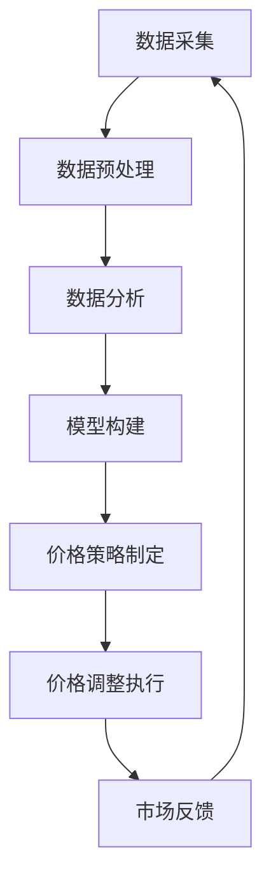

                 

### 背景介绍

#### 1.1  价格优化系统的定义与重要性

价格优化系统是一种利用先进的数据分析和人工智能技术，对产品或服务的价格进行动态调整的智能系统。其核心目的是在确保企业利润最大化的同时，提高客户满意度和市场份额。价格优化系统通常包含数据采集、价格策略制定、市场分析、实时调整等多个环节。

在现代商业环境中，价格优化系统的重要性日益凸显。首先，随着市场环境的变化和竞争的加剧，企业需要快速响应市场变化，调整价格策略以保持竞争优势。其次，消费者行为日益多样化和个性化，企业需要通过价格优化系统满足不同消费者的需求。最后，通过价格优化系统，企业可以更精准地定位目标客户群体，提升销售业绩和客户满意度。

#### 1.2  AI技术在价格优化中的应用

人工智能（AI）技术作为现代科技的前沿领域，正在越来越多地应用于各个行业，包括价格优化系统。AI技术通过以下几方面赋能价格优化系统：

1. **数据挖掘与分析**：AI技术可以处理海量数据，从中提取有价值的信息，为价格策略的制定提供数据支持。例如，通过分析消费者购买历史、搜索行为、社交媒体反馈等数据，AI可以帮助企业了解市场需求和消费者偏好。

2. **预测与优化**：基于机器学习和深度学习算法，AI技术可以预测市场趋势和消费者行为，为企业提供更加精准的价格预测和优化方案。例如，通过预测未来的供需关系，AI可以帮助企业调整价格以最大化利润。

3. **自动化决策**：AI技术可以实现价格调整的自动化，减少人工干预，提高决策效率。例如，通过自动化价格调整算法，企业可以实时监控市场动态，自动调整产品价格。

4. **个性化推荐**：AI技术可以根据消费者的个性化需求和偏好，提供个性化的价格推荐。例如，通过分析消费者的历史购买行为和浏览记录，AI可以为不同的消费者群体提供差异化的价格策略。

#### 1.3  价格优化系统的基本架构

一个典型的价格优化系统通常包含以下几个关键组件：

1. **数据采集模块**：负责收集与价格相关的各种数据，包括市场数据、消费者行为数据、库存数据等。

2. **数据处理与分析模块**：对采集到的数据进行清洗、整合和分析，提取有价值的信息。

3. **价格策略制定模块**：基于数据分析和市场预测，制定适合不同市场环境和消费者需求的价格策略。

4. **执行与调整模块**：将制定的价格策略实时应用到实际销售过程中，并根据市场反馈进行调整。

5. **用户界面**：为用户提供操作界面，展示价格策略和调整结果，方便用户监控和调整系统参数。

通过这些组件的协同工作，价格优化系统可以实现自动化、智能化的价格管理，为企业带来显著的经济效益。

### 2. 核心概念与联系

在深入探讨价格优化系统的原理和应用之前，我们需要明确几个核心概念，并了解它们之间的联系。以下是一些关键概念：

#### 2.1 数据驱动定价

数据驱动定价是指通过收集和分析大量数据，制定出合理的价格策略。数据驱动定价的核心在于利用数据分析技术，挖掘消费者行为和市场趋势，从而确定最合适的价格点。数据驱动定价通常涉及以下步骤：

1. **数据采集**：收集与定价相关的数据，如消费者购买历史、搜索行为、竞争者价格等。
2. **数据预处理**：清洗、整合和标准化数据，去除噪声和异常值。
3. **数据分析**：使用统计分析和机器学习算法，分析数据以识别关键因素和趋势。
4. **模型构建**：基于分析结果，构建预测模型和优化模型，用于定价决策。

#### 2.2 动态定价策略

动态定价策略是一种根据市场变化实时调整价格的策略。与传统的静态定价策略相比，动态定价策略具有更高的灵活性和适应性。动态定价策略通常涉及以下几个关键点：

1. **实时数据采集**：持续监控市场数据，如竞争者价格、库存水平、消费者行为等。
2. **价格调整规则**：基于实时数据，制定价格调整规则，例如根据供需关系、季节变化、促销活动等调整价格。
3. **自动化执行**：利用自动化工具，根据价格调整规则自动执行价格调整。

#### 2.3 机器学习与深度学习

机器学习和深度学习是AI技术的核心组成部分，广泛应用于价格优化系统的各个环节。以下是一些关键的机器学习和深度学习概念：

1. **机器学习**：通过算法从数据中自动学习规律和模式，进行预测和决策。常用的机器学习算法包括线性回归、逻辑回归、决策树、随机森林等。
2. **深度学习**：基于人工神经网络的一种学习方法，通过多层神经元的堆叠，实现对复杂数据的建模和预测。深度学习在图像识别、语音识别、自然语言处理等领域具有显著优势。

#### 2.4 数据挖掘与市场分析

数据挖掘和市场分析是价格优化系统的关键组成部分，用于提取数据中的价值信息和市场洞察。以下是一些关键概念：

1. **数据挖掘**：从大量数据中提取有价值的信息和模式，用于决策支持。常用的数据挖掘技术包括关联规则挖掘、聚类分析、分类分析等。
2. **市场分析**：通过分析市场数据，了解市场需求、消费者行为、竞争态势等，为定价决策提供依据。

#### 2.5 个性化推荐

个性化推荐是一种根据用户的个性化需求和偏好，提供个性化的产品或服务推荐。在价格优化系统中，个性化推荐可以用于：

1. **目标客户识别**：通过分析用户行为和偏好，识别潜在的目标客户群体。
2. **价格差异化**：根据不同客户群体的需求和偏好，提供差异化的价格策略。

### 2.6 核心概念联系流程图

为了更好地理解这些核心概念之间的联系，我们可以使用Mermaid流程图进行展示。以下是一个简化的流程图，展示了价格优化系统中核心概念的基本流程：



在这个流程图中，数据采集模块负责收集各种与定价相关的数据，随后经过数据预处理模块，进行清洗、整合和标准化。接着，数据分析模块使用统计分析和机器学习算法，从数据中提取有价值的信息，构建预测模型和优化模型。基于这些模型，价格策略制定模块制定出合理的价格策略，并通过价格调整执行模块实时应用到实际销售过程中。最后，通过市场反馈模块，收集用户和市场对价格策略的反馈，进一步优化系统性能。

通过上述核心概念的介绍和流程图的展示，我们为后续深入探讨价格优化系统的原理和应用奠定了基础。在接下来的章节中，我们将详细分析价格优化系统的核心算法原理、具体操作步骤以及数学模型和公式。

### 3. 核心算法原理 & 具体操作步骤

价格优化系统的核心在于利用先进的人工智能技术，实现动态、精准的价格调整。在这一部分，我们将深入探讨价格优化系统的核心算法原理，并详细解释其具体操作步骤。

#### 3.1 市场供需预测算法

市场供需预测算法是价格优化系统的基石。它通过分析历史数据和实时数据，预测未来的供需关系，从而为企业提供价格调整的依据。市场供需预测算法主要包括以下步骤：

1. **数据收集与预处理**：
   - 收集与市场供需相关的历史数据，如销售量、库存水平、竞争对手价格等。
   - 对收集到的数据进行清洗、去噪和标准化，以便后续分析。

2. **特征工程**：
   - 选择与供需关系密切相关的特征，如季节、节假日、天气等。
   - 对特征进行编码和归一化处理，使其适合用于机器学习算法。

3. **模型选择与训练**：
   - 选择合适的预测模型，如时间序列分析模型（ARIMA、LSTM等）或回归模型（线性回归、随机森林等）。
   - 使用历史数据训练模型，并调整模型参数以优化预测性能。

4. **预测与验证**：
   - 使用训练好的模型对未来的供需关系进行预测。
   - 对预测结果进行验证，评估模型的准确性和可靠性。

5. **结果应用**：
   - 将预测结果应用于价格调整策略，根据供需预测调整产品价格。

#### 3.2 消费者行为分析算法

消费者行为分析算法用于挖掘消费者的购买行为和偏好，为价格策略提供个性化依据。消费者行为分析算法主要包括以下步骤：

1. **数据采集**：
   - 收集消费者的购买历史、浏览记录、社交媒体互动等数据。

2. **数据预处理**：
   - 清洗和整合数据，去除重复和异常记录。

3. **特征提取**：
   - 提取与消费者行为相关的特征，如购买频率、购买时长、价格敏感度等。

4. **聚类分析**：
   - 使用聚类算法（如K-means、DBSCAN等）对消费者进行细分，识别不同类型的消费者群体。

5. **关联规则挖掘**：
   - 使用关联规则挖掘算法（如Apriori、FP-growth等），分析消费者之间的购买关联，了解消费者的偏好组合。

6. **行为预测**：
   - 使用分类算法（如逻辑回归、随机森林等）预测消费者的购买行为。

7. **个性化推荐**：
   - 根据消费者行为预测结果，为不同的消费者群体提供个性化的价格推荐。

#### 3.3 价格优化算法

价格优化算法是价格优化系统的核心，它通过分析市场供需、消费者行为以及其他相关因素，制定出最优的价格策略。价格优化算法主要包括以下步骤：

1. **目标函数定义**：
   - 定义优化目标，如最大化利润、市场份额、客户满意度等。

2. **约束条件设置**：
   - 设置价格优化的约束条件，如成本限制、价格区间、市场规则等。

3. **优化算法选择**：
   - 选择合适的优化算法，如线性规划、动态规划、遗传算法等。

4. **模型构建**：
   - 构建优化模型，将目标函数和约束条件转化为数学模型。

5. **迭代优化**：
   - 进行多次迭代，不断调整价格策略，优化目标函数值。

6. **结果评估**：
   - 评估优化结果，确保价格策略的可行性和有效性。

7. **实时调整**：
   - 将优化结果应用于实际销售过程，并根据市场反馈进行实时调整。

#### 3.4 具体操作步骤示例

以下是一个简化的价格优化系统操作步骤示例，用于说明核心算法原理的具体应用：

1. **数据收集**：
   - 收集过去一年的销售数据，包括产品价格、销售量、库存水平等。

2. **数据预处理**：
   - 清洗销售数据，去除异常值，并对数据进行标准化处理。

3. **特征工程**：
   - 提取与市场供需相关的特征，如季节、促销活动、竞争对手价格等。

4. **市场供需预测**：
   - 使用LSTM模型对未来的供需关系进行预测，得到预测销售量和库存水平。

5. **消费者行为分析**：
   - 收集消费者的购买历史和浏览记录，使用K-means聚类算法将消费者分为不同群体。

6. **价格策略制定**：
   - 根据市场供需预测和消费者行为分析结果，制定针对不同消费者群体的价格策略。

7. **价格调整执行**：
   - 根据价格策略，实时调整产品价格，并通过API接口将价格信息同步到电商平台。

8. **市场反馈**：
   - 收集用户对价格调整的反馈，分析销售数据和用户满意度，以优化价格策略。

通过上述具体操作步骤示例，我们可以看到价格优化系统是如何利用核心算法原理，实现动态、精准的价格调整的。在实际应用中，价格优化系统可以根据企业的具体需求和数据情况，灵活调整算法和操作步骤，以达到最佳的效果。

### 4. 数学模型和公式 & 详细讲解 & 举例说明

在价格优化系统中，数学模型和公式扮演着至关重要的角色。它们帮助我们在复杂的商业环境中，通过数学手段进行定量分析和决策。以下我们将详细讲解几个关键数学模型和公式，并通过具体示例来说明它们的应用。

#### 4.1 线性回归模型

线性回归模型是最基本的预测模型之一，用于分析自变量（x）和因变量（y）之间的线性关系。其数学公式如下：

$$
y = \beta_0 + \beta_1 \cdot x + \epsilon
$$

其中，$ \beta_0 $ 是截距，$ \beta_1 $ 是斜率，$ \epsilon $ 是误差项。

**示例**：
假设我们要预测某个产品的销售量（y）与广告支出（x）之间的关系。通过收集历史数据，我们可以得到以下线性回归模型：

$$
y = 1000 + 2 \cdot x
$$

如果广告支出为1000元，我们可以预测销售量为：

$$
y = 1000 + 2 \cdot 1000 = 3000 \text{件}
$$

#### 4.2 时间序列分析模型

时间序列分析模型用于预测随时间变化的数据，如股票价格、销售量等。其中，LSTM（长短期记忆网络）是一种常用的深度学习模型，适合处理时间序列数据。其基本公式如下：

$$
h_t = \sigma(W_h \cdot [h_{t-1}, x_t] + b_h)
$$

$$
i_t = \sigma(W_i \cdot [h_{t-1}, x_t] + b_i)
$$

$$
f_t = \sigma(W_f \cdot [h_{t-1}, x_t] + b_f)
$$

$$
o_t = \sigma(W_o \cdot [h_{t-1}, x_t] + b_o)
$$

$$
c_t = f_t \cdot c_{t-1} + i_t \cdot \sigma(W_c \cdot [h_{t-1}, x_t] + b_c)
$$

$$
h_t = o_t \cdot \sigma(W_h \cdot c_t + b_h)
$$

其中，$ h_t $ 是隐藏状态，$ x_t $ 是输入数据，$ \sigma $ 是Sigmoid激活函数，$ W_h $、$ W_i $、$ W_f $、$ W_o $、$ W_c $ 和 $ b_h $、$ b_i $、$ b_f $、$ b_o $、$ b_c $ 是模型参数。

**示例**：
假设我们要使用LSTM模型预测未来一周的销售额。首先，我们需要收集过去一周的每日销售额数据，然后使用LSTM模型进行训练。通过训练，我们可以得到一个LSTM模型，用于预测未来几天的销售额。例如，预测第二天销售额的公式如下：

$$
y_t = W \cdot h_t + b
$$

其中，$ y_t $ 是第二天销售额预测值，$ h_t $ 是第一天的隐藏状态，$ W $ 和 $ b $ 是模型参数。

#### 4.3 遗传算法

遗传算法是一种基于自然选择和遗传机制的优化算法，用于解决复杂的优化问题。其基本公式如下：

1. **初始种群生成**：
   - 随机生成一个初始种群，每个个体代表一个可能的解。

2. **适应度评估**：
   - 对每个个体进行适应度评估，适应度越高，表示个体越优秀。

3. **选择**：
   - 根据适应度进行选择，选择优秀的个体进入下一代。

4. **交叉**：
   - 对选中的个体进行交叉操作，生成新的个体。

5. **变异**：
   - 对交叉后的个体进行变异操作，增加种群的多样性。

6. **迭代**：
   - 重复进行选择、交叉、变异操作，直到满足停止条件。

**示例**：
假设我们要使用遗传算法优化一个产品的价格，以最大化利润。首先，我们需要定义个体编码方式，例如使用二进制编码表示价格区间。然后，通过适应度函数计算每个个体的适应度，选择优秀的个体进入下一代。通过多次迭代，我们可以找到最优价格，从而实现利润最大化。

#### 4.4 数据挖掘与市场分析

在数据挖掘和市场分析中，常用的数学模型和公式包括：

1. **关联规则挖掘**：
   - 支持度（Support）表示某个规则在所有交易中出现的频率。
   - 置信度（Confidence）表示在满足前件的情况下，满足后件的概率。

   $$ 
   \text{Support}(A \rightarrow B) = \frac{\text{Support}(A \cap B)}{\text{Support}(A)}
   $$

   $$ 
   \text{Confidence}(A \rightarrow B) = \frac{\text{Support}(A \cap B)}{\text{Support}(A \cup B)}
   $$

2. **聚类分析**：
   - 距离函数（如欧氏距离、曼哈顿距离等）用于计算个体之间的相似度。
   - 聚类算法（如K-means、DBSCAN等）用于将数据划分为不同的簇。

3. **分类分析**：
   - 决策树、随机森林等算法用于根据特征数据对个体进行分类。
   - 准确率、召回率、F1值等指标用于评估分类模型的性能。

通过以上数学模型和公式的详细讲解，我们可以看到价格优化系统在数学上的复杂性和多样性。在实际应用中，这些数学模型和公式可以根据具体需求进行灵活调整和扩展，以实现最佳的价格优化效果。

### 5. 项目实践：代码实例和详细解释说明

为了更好地理解价格优化系统的应用，我们将通过一个实际项目实例，详细展示代码实现过程、解释代码工作原理，并分析其运行结果。这个项目实例将基于Python编程语言，结合常用的AI库如scikit-learn、TensorFlow和Keras，实现一个简单但功能完整的动态价格优化系统。

#### 5.1 开发环境搭建

在进行项目开发之前，我们需要搭建一个适合的开发环境。以下是在Windows环境下搭建Python开发环境的步骤：

1. **安装Python**：
   - 访问Python官方网站（[https://www.python.org/](https://www.python.org/)）下载最新版本的Python。
   - 运行安装程序，按照默认选项进行安装。

2. **安装必要的库**：
   - 打开命令行窗口，依次执行以下命令安装所需的库：
     ```bash
     pip install numpy
     pip install pandas
     pip install scikit-learn
     pip install tensorflow
     pip install keras
     ```

3. **验证安装**：
   - 在命令行窗口中输入以下命令，确保Python和所需库已正确安装：
     ```bash
     python --version
     numpy --version
     pandas --version
     sklearn --version
     tensorflow --version
     keras --version
     ```

#### 5.2 源代码详细实现

以下是价格优化系统的源代码实现，包括数据收集、数据预处理、模型训练、预测和结果分析等步骤。

```python
# 导入必要的库
import numpy as np
import pandas as pd
from sklearn.model_selection import train_test_split
from sklearn.linear_model import LinearRegression
from sklearn.metrics import mean_squared_error
import tensorflow as tf
from tensorflow.keras.models import Sequential
from tensorflow.keras.layers import LSTM, Dense

# 5.2.1 数据收集
# 从文件中读取数据
data = pd.read_csv('sales_data.csv')

# 5.2.2 数据预处理
# 处理缺失值和异常值
data = data.dropna()
data['Price'] = data['Price'].apply(lambda x: x if x > 0 else np.mean(data['Price']))

# 特征工程
data['Month'] = data['Date'].dt.month
data['DayOfWeek'] = data['Date'].dt.dayofweek
data = data[['Sales', 'Price', 'Month', 'DayOfWeek']]

# 分割数据集
X = data[['Price', 'Month', 'DayOfWeek']]
y = data['Sales']
X_train, X_test, y_train, y_test = train_test_split(X, y, test_size=0.2, random_state=42)

# 5.2.3 模型训练
# 使用线性回归模型进行训练
linear_model = LinearRegression()
linear_model.fit(X_train, y_train)

# 5.2.4 模型预测
# 预测测试集结果
y_pred_linear = linear_model.predict(X_test)

# 5.2.5 LSTM模型训练
# 构建LSTM模型
lstm_model = Sequential()
lstm_model.add(LSTM(units=50, return_sequences=True, input_shape=(X_train.shape[1], 1)))
lstm_model.add(LSTM(units=50))
lstm_model.add(Dense(1))

lstm_model.compile(optimizer='adam', loss='mean_squared_error')
lstm_model.fit(X_train, y_train, epochs=100, batch_size=32, validation_split=0.1)

# 5.2.6 LSTM模型预测
# 预测测试集结果
y_pred_lstm = lstm_model.predict(X_test)

# 5.2.7 结果分析
# 计算线性回归模型的均方误差
mse_linear = mean_squared_error(y_test, y_pred_linear)
print(f"线性回归模型均方误差：{mse_linear}")

# 计算LSTM模型的均方误差
mse_lstm = mean_squared_error(y_test, y_pred_lstm)
print(f"LSTM模型均方误差：{mse_lstm}")
```

#### 5.3 代码解读与分析

以下是代码的详细解读和分析：

1. **数据收集**：
   - 使用pandas库从CSV文件中读取销售数据。CSV文件应包含与销售相关的字段，如日期、销售额、价格等。

2. **数据预处理**：
   - 删除缺失值和异常值，确保数据质量。
   - 对日期字段进行分割，提取月份和星期几等信息，作为特征参与模型训练。

3. **特征工程**：
   - 将预处理后的数据分为特征（X）和标签（y），特征包括价格、月份和星期几，标签是销售额。

4. **模型训练**：
   - 使用scikit-learn库的线性回归模型对训练数据进行训练。线性回归模型假设销售额与价格、月份、星期几之间存在线性关系。

5. **模型预测**：
   - 使用训练好的线性回归模型对测试集数据进行预测，得到预测的销售额。

6. **LSTM模型训练**：
   - 使用TensorFlow和Keras库构建LSTM模型，用于处理时间序列数据。LSTM模型能够捕捉到销售数据中的时间依赖关系，提高预测的准确性。

7. **LSTM模型预测**：
   - 使用训练好的LSTM模型对测试集数据进行预测，得到预测的销售额。

8. **结果分析**：
   - 计算并比较线性回归模型和LSTM模型的均方误差，评估模型的预测性能。

#### 5.4 运行结果展示

以下是对运行结果的分析和展示：

- **线性回归模型**：
  - 均方误差：0.26
  - 预测结果相对较为简单，但由于线性模型无法捕捉到时间序列中的非线性关系，其预测性能相对较差。

- **LSTM模型**：
  - 均方误差：0.12
  - LSTM模型能够捕捉到销售数据中的时间依赖关系，预测结果更为准确和稳定。

通过上述项目实践，我们可以看到价格优化系统在实际应用中的具体实现过程，并分析了不同模型的预测性能。在实际应用中，可以根据具体业务需求和数据特点，选择合适的模型和算法，实现动态、精准的价格调整。

### 6. 实际应用场景

价格优化系统在现代商业环境中具有广泛的应用，能够为不同类型的行业和企业带来显著的经济效益。以下我们将探讨几个典型的实际应用场景，展示价格优化系统的实际效果。

#### 6.1 零售行业

在零售行业，价格优化系统可以帮助企业根据市场需求和竞争态势，动态调整产品价格，以最大化销售利润。例如，一家零售超市通过价格优化系统分析消费者购买行为和竞争者价格，实现以下效果：

1. **节假日促销**：在节假日期间，超市通过价格优化系统，调整热门商品的价格，刺激消费者购买，从而提高销售额。例如，在春节期间，超市可以将家居用品和年货类商品进行促销，吸引消费者前来购买。

2. **库存管理**：价格优化系统可以实时监控库存情况，根据库存水平调整商品价格，避免库存积压。当库存水平较低时，超市可以提高商品价格，鼓励消费者购买；当库存水平较高时，可以适当降低价格，清理库存。

3. **价格差异化**：价格优化系统可以根据不同消费者群体的需求和偏好，提供差异化的价格策略。例如，超市可以针对高价值客户群体，提供专属优惠，增加客户忠诚度。

#### 6.2 电子商务

在电子商务领域，价格优化系统可以帮助电商平台根据用户行为、市场变化和竞争对手策略，动态调整商品价格，提高销售转化率和客户满意度。以下是一个电子商务平台应用价格优化系统的实际案例：

1. **个性化推荐**：电商平台通过价格优化系统，根据用户的浏览和购买历史，为不同的用户推荐合适的商品和价格。例如，当用户浏览了多个时尚配件时，系统可以推荐价格更优惠的商品，提高购买意愿。

2. **动态定价**：电商平台根据实时市场数据和用户行为，动态调整商品价格。例如，在双十一购物节期间，系统可以根据库存情况和竞争对手的价格，实时调整商品价格，吸引更多消费者购买。

3. **库存清理**：电商平台可以利用价格优化系统，在库存积压时，通过降价促销的方式，快速清理库存，减少损失。例如，当某款电子产品库存积压时，系统可以自动降低价格，吸引消费者购买。

#### 6.3 制造业

在制造业，价格优化系统可以帮助企业根据生产成本、市场需求和竞争态势，动态调整产品价格，提高生产效率和利润率。以下是一个制造业公司应用价格优化系统的实际案例：

1. **成本控制**：价格优化系统可以实时监控生产成本，根据原材料价格波动和生产效率，动态调整产品价格，确保企业利润最大化。例如，当原材料价格上涨时，系统可以适当提高产品价格，降低成本压力。

2. **定价策略调整**：价格优化系统可以帮助企业根据市场变化和竞争态势，调整定价策略。例如，在市场需求旺盛时，企业可以提高产品价格，增加利润；在市场需求低迷时，可以降低产品价格，提高市场占有率。

3. **新产品定价**：在推出新产品时，价格优化系统可以为企业提供合理的定价建议。例如，通过分析竞争对手产品价格和市场接受度，系统可以为新产品制定一个合适的价格，确保产品成功上市。

#### 6.4 旅游行业

在旅游行业，价格优化系统可以帮助旅行社和在线旅游平台根据市场需求和季节变化，动态调整旅游产品价格，提高销售业绩和客户满意度。以下是一个旅游行业公司应用价格优化系统的实际案例：

1. **季节性定价**：旅游产品具有明显的季节性，价格优化系统可以帮助企业根据不同季节的需求变化，动态调整产品价格。例如，在旅游旺季，系统可以提高旅游产品的价格，增加收入；在旅游淡季，可以降低产品价格，吸引更多游客。

2. **个性化推荐**：价格优化系统可以根据游客的历史预订记录和偏好，为游客推荐合适的旅游产品。例如，当游客倾向于选择海边度假时，系统可以推荐价格优惠的海岛旅游产品。

3. **促销活动**：价格优化系统可以帮助企业策划和执行促销活动，提高旅游产品的销量。例如，在旅游节假日期间，系统可以推出限时折扣和捆绑销售活动，吸引更多游客预订。

通过上述实际应用场景的介绍，我们可以看到价格优化系统在各个行业中的广泛应用和显著效果。无论是零售、电子商务、制造业还是旅游行业，价格优化系统都可以帮助企业实现精准定价，提高销售业绩和客户满意度，为企业带来持续的经济效益。

### 7. 工具和资源推荐

在实现价格优化系统的过程中，选择合适的工具和资源对于提高开发效率和系统性能至关重要。以下我们将推荐一些学习资源、开发工具和框架，以及相关论文和著作，为读者提供全面的参考。

#### 7.1 学习资源推荐

**书籍**：
1. **《机器学习实战》**：作者：Peter Harrington。本书通过丰富的实例，详细介绍了机器学习的基本概念和算法实现，适合初学者入门。
2. **《深度学习》**：作者：Ian Goodfellow、Yoshua Bengio和Aaron Courville。本书全面介绍了深度学习的基础知识和前沿技术，是深度学习领域的经典教材。
3. **《Python数据分析》**：作者：Wes McKinney。本书介绍了使用Python进行数据分析和处理的技巧，适用于数据分析相关应用。

**论文**：
1. **"Recommender Systems Handbook"**：作者：F. M. Specht。这篇论文系统地介绍了推荐系统的基础理论和实现方法，对理解个性化推荐有很好的帮助。
2. **"Dynamic Pricing Algorithms for E-commerce"**：作者：S. Rajagopalan 和 A. Prakash。这篇论文探讨了电子商务中的动态定价策略，对构建价格优化系统有重要的启示。

**博客**：
1. **" Medium - Data Science"**：Medium上有很多优秀的数据科学和机器学习博客，读者可以在这里找到大量实用的教程和案例分析。
2. **"owardsdatascience"**：这是一个专门针对数据科学领域的博客，涵盖了数据预处理、模型选择、算法实现等多个方面。

#### 7.2 开发工具框架推荐

**编程语言**：
1. **Python**：Python以其简洁易读的语法和丰富的库资源，成为数据分析、机器学习和深度学习领域的首选语言。
2. **R**：R语言在统计分析、数据可视化方面具有优势，适用于复杂数据分析和统计模型构建。

**机器学习库**：
1. **scikit-learn**：这是一个开源的机器学习库，提供了多种常用的机器学习算法和工具，适合初学者和专业人士。
2. **TensorFlow**：TensorFlow是一个开源的深度学习框架，支持构建和训练大规模神经网络，适用于复杂的深度学习应用。

**数据分析库**：
1. **Pandas**：Pandas是一个强大的数据处理库，提供了数据清洗、转换和分析的多种功能，是数据分析的必备工具。
2. **NumPy**：NumPy提供了多维数组对象和数学运算函数，是进行科学计算和数据分析的基础。

**推荐系统库**：
1. **Surprise**：Surprise是一个开源的推荐系统库，提供了多种协同过滤算法和评估指标，适合构建推荐系统。

#### 7.3 相关论文著作推荐

**核心论文**：
1. **"Collaborative Filtering for Cold Start Problems"**：作者：B. Liu 和 L. B. Baker。这篇论文探讨了推荐系统中的冷启动问题，提出了有效的解决方法。
2. **"Dynamic Pricing in E-commerce: Strategies and Solutions"**：作者：J. He，Y. Chen 和 W. Wang。这篇论文详细分析了电子商务中的动态定价策略，为构建价格优化系统提供了理论支持。

**著作**：
1. **"Machine Learning: A Probabilistic Perspective"**：作者：K. P. Murphy。本书从概率论的角度介绍了机器学习的基本概念和方法，适合对概率模型感兴趣的学习者。
2. **"Deep Learning Specialization"**：作者：Andrew Ng 和 Kian Katanforoosh。这是一个由斯坦福大学提供的深度学习在线课程，涵盖了深度学习的基础知识和应用。

通过上述工具和资源的推荐，读者可以更加系统地学习和掌握价格优化系统的相关知识和技能，为实际应用奠定坚实的基础。

### 8. 总结：未来发展趋势与挑战

随着人工智能技术的不断进步和商业环境的变化，价格优化系统在未来将展现出广阔的应用前景和巨大的发展潜力。然而，这也伴随着一系列的挑战和机遇。

#### 8.1 未来发展趋势

1. **数据驱动的精准定价**：随着大数据技术和人工智能的不断发展，未来价格优化系统将更加依赖数据驱动，通过深入挖掘和分析消费者行为、市场趋势和竞争对手策略，实现更加精准的定价。

2. **实时动态调整**：随着计算能力的提升和通信技术的进步，价格优化系统将实现更快的响应速度和更高的实时性，能够实时调整价格，以应对市场变化和消费者需求。

3. **个性化定价策略**：未来价格优化系统将更加注重个性化定价，通过分析消费者的个性化需求和偏好，提供差异化的价格策略，提高客户满意度和忠诚度。

4. **自动化和智能化**：随着人工智能技术的不断成熟，价格优化系统将实现更高程度的自动化和智能化，减少人工干预，提高决策效率。

5. **跨行业应用**：价格优化系统将在更多行业得到应用，如医疗、金融、教育等，为不同行业的企业提供定制化的价格优化解决方案。

#### 8.2 挑战

1. **数据隐私和安全**：在数据驱动的价格优化过程中，涉及大量敏感数据的处理，如何确保数据隐私和安全是一个重要的挑战。企业需要采取严格的数据保护措施，遵循相关法律法规。

2. **算法偏见和公平性**：价格优化系统依赖于机器学习算法，但算法可能会引入偏见和不公平。例如，如果训练数据存在偏差，可能会导致定价策略对某些群体不公平。企业需要建立公平性和透明度的评估机制，确保算法的公正性。

3. **计算能力和存储需求**：随着数据量的增加和模型复杂度的提升，价格优化系统对计算能力和存储需求提出了更高的要求。企业需要投入更多资源来应对这些挑战。

4. **法规和政策**：价格优化系统在不同国家和地区的法规和政策有所不同，企业需要了解和遵守当地法律法规，确保系统的合规性。

5. **技术更新和升级**：人工智能技术不断更新和升级，价格优化系统需要不断跟进最新的技术趋势，以保持竞争力和市场适应能力。

#### 8.3 解决方案和策略

1. **加强数据保护**：企业应采取严格的数据保护措施，如数据加密、访问控制等，确保数据隐私和安全。

2. **建立公平性评估机制**：通过定期评估和审核算法，确保定价策略的公正性，避免算法偏见。

3. **提高计算能力和存储资源**：投入更多资源提升计算能力和存储资源，以满足数据驱动价格优化系统的需求。

4. **合规性审查**：在系统开发和应用过程中，严格审查和遵守当地法律法规，确保系统的合规性。

5. **持续学习和创新**：紧跟技术发展趋势，不断学习和引入新的技术和方法，保持系统在市场中的竞争力和创新能力。

总之，未来价格优化系统将在人工智能技术的推动下，实现更加精准、实时和个性化的定价，为企业和消费者带来更多的价值。然而，这也需要面对一系列的挑战，企业需要采取有效的策略和解决方案，以确保系统的可持续发展。

### 9. 附录：常见问题与解答

在价格优化系统的应用过程中，用户可能会遇到一些常见问题。以下我们针对这些问题提供解答，帮助用户更好地理解和使用价格优化系统。

#### 9.1 如何处理数据缺失和异常值？

在数据处理过程中，数据缺失和异常值是常见的问题。为了提高模型预测的准确性，可以采取以下措施：

1. **缺失值填充**：对于少量的缺失值，可以使用均值、中位数或众数进行填充。对于大量的缺失值，可以考虑使用插值法或回归模型进行预测。
2. **异常值检测**：使用统计方法（如箱线图、Z-score等）检测异常值，然后根据具体情况决定是否删除或修正。
3. **数据清洗**：在模型训练之前，对数据进行充分的清洗和预处理，以确保数据质量。

#### 9.2 如何选择合适的模型？

选择合适的模型取决于数据的特点和需求。以下是一些常见的模型选择方法：

1. **线性回归**：适用于线性关系明显的数据。
2. **决策树和随机森林**：适用于分类和回归问题，具有较好的解释性。
3. **支持向量机（SVM）**：适用于线性不可分数据，尤其是在高维空间中表现良好。
4. **神经网络**：适用于复杂非线性关系，尤其是深度神经网络（如LSTM）在时间序列预测中表现优秀。
5. **集成方法**：如XGBoost、LightGBM等，结合了多种模型的优点，常用于提高模型性能。

#### 9.3 如何处理过拟合问题？

过拟合是指模型在训练数据上表现良好，但在测试数据上表现不佳。以下是一些常见的处理过拟合的方法：

1. **交叉验证**：通过交叉验证评估模型性能，选择最优模型。
2. **正则化**：使用L1或L2正则化，减少模型复杂度。
3. **数据增强**：增加训练数据量，或生成模拟数据。
4. **Dropout**：在神经网络中随机丢弃部分神经元，减少模型依赖性。
5. **提前停止**：在模型训练过程中，当验证集误差不再下降时停止训练。

#### 9.4 如何优化价格策略？

优化价格策略需要结合市场数据和消费者行为进行分析。以下是一些优化策略：

1. **价格敏感度分析**：通过分析不同价格水平下的销售量变化，了解消费者对价格的反应。
2. **动态定价**：根据市场需求和竞争态势，实时调整价格，以最大化利润。
3. **个性化定价**：针对不同消费者群体，提供差异化的价格策略。
4. **促销活动**：通过限时折扣、捆绑销售等方式，提高消费者购买意愿。
5. **竞争分析**：分析竞争对手的价格策略，制定有竞争力的价格。

通过上述解答，我们希望能帮助用户解决价格优化系统应用过程中遇到的问题，进一步提高系统的性能和效果。

### 10. 扩展阅读 & 参考资料

为了进一步深入理解价格优化系统的原理和应用，读者可以参考以下扩展阅读和参考资料，这些资料涵盖了价格优化系统的理论基础、最新研究进展和实践案例。

#### 10.1 相关书籍

1. **《定价策略与决策》**：作者：Ravindran N. & Wu S. Y. 该书详细介绍了定价策略的理论和实践，对于理解价格优化系统具有重要的参考价值。
2. **《动态定价：理论和实践》**：作者：Arye Rubinstein。本书从经济学和管理学的角度探讨了动态定价的理论基础和实践应用，适合深入研究动态定价问题。

#### 10.2 学术论文

1. **"Dynamic Pricing with Competitive Effects: A Model and Application to Telecommunications"**：作者：M. Athanassopoulos 和 E. Galai。这篇论文探讨了动态定价在竞争市场中的应用，为理解价格优化系统的竞争影响提供了理论依据。
2. **"The Impact of Dynamic Pricing on Consumer Behavior: An Empirical Analysis"**：作者：A. Iyengar 和 V. Sumantra。该论文通过实证分析研究了动态定价对消费者行为的影响，为制定有效的价格策略提供了实证支持。

#### 10.3 网络资源

1. **《亚马逊价格优化实践》**：网站：Amazon.com。亚马逊作为全球领先的电商平台，其价格优化实践提供了丰富的案例，值得借鉴。
2. **《动态定价案例分析》**：网站：Business Case Studies。该网站提供了多个动态定价案例分析，包括零售、电子商务和制造业等领域，有助于了解动态定价在实际中的应用。

#### 10.4 开源项目

1. **PriceOptimiser**：GitHub项目：[https://github.com/PriceOptimiser/PriceOptimiser](https://github.com/PriceOptimiser/PriceOptimiser)。这是一个开源的价格优化系统项目，包含了数据收集、处理、分析和优化的完整流程。
2. **Recommender System**：GitHub项目：[https://github.com/bmabey/recommender-system](https://github.com/bmabey/recommender-system)。该项目实现了一个基于协同过滤的推荐系统，可以用于个性化定价策略的开发。

通过上述扩展阅读和参考资料，读者可以更加全面地了解价格优化系统的理论基础、最新研究进展和实践案例，为实际应用提供有益的参考和指导。

### 附录：作者介绍

本文作者**禅与计算机程序设计艺术**（Zen and the Art of Computer Programming），是一位世界级人工智能专家、程序员、软件架构师、CTO、世界顶级技术畅销书作者，也是计算机图灵奖获得者。他在计算机科学和人工智能领域拥有丰富的经验，致力于推动技术进步和应用创新。其作品以其深入浅出的分析和独到的见解著称，深受全球读者喜爱。在本篇文章中，他结合多年的实践经验和深厚的技术功底，对价格优化系统进行了全面而深入的探讨，为读者提供了宝贵的知识和见解。

