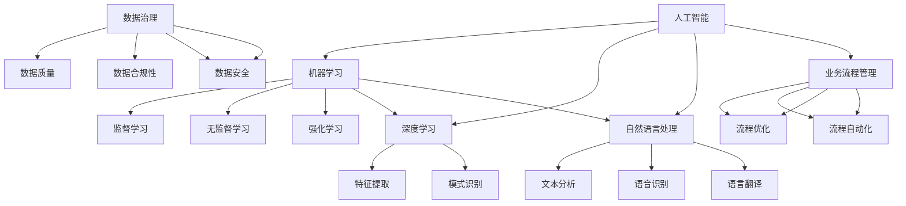

                 

### 背景介绍

企业AI转型是一个复杂而重要的过程，它不仅涉及技术层面的变革，还包括组织文化、业务流程和战略方向的深刻调整。随着人工智能技术的不断进步，越来越多的企业开始意识到，通过AI技术优化业务流程、提高生产效率和创新能力，是提升竞争力的关键。因此，如何有效地进行AI转型，成为许多企业亟需解决的重要问题。

在这个背景下，Lepton AI应运而生。Lepton AI是一家专注于提供企业AI转型咨询和增值服务的技术公司。他们的使命是帮助传统企业实现数字化转型，通过人工智能技术赋能，提升企业核心竞争力。

Lepton AI的增值服务包括但不限于以下几个方面：

1. **AI战略规划**：帮助企业制定切实可行的AI转型战略，明确目标、路径和资源需求。
2. **AI技术应用**：提供从数据采集、处理到模型构建和部署的全流程服务，帮助企业快速落地AI应用。
3. **数据治理与安全保障**：确保数据质量，建立完善的数据治理体系，保护企业数据安全。
4. **人才培训与团队建设**：为企业提供定制化的人才培养方案，助力企业打造专业的AI团队。
5. **持续优化与迭代**：通过持续监控和评估，不断优化AI应用，实现业务价值的最大化。

本文将围绕Lepton AI的增值服务，深入探讨企业AI转型的关键步骤、技术挑战和解决方案，以期为企业和从业者提供有价值的参考。

---

### 核心概念与联系

在探讨企业AI转型之前，我们需要理解几个核心概念，这些概念是整个AI系统构建和应用的基础。以下是几个关键概念及其相互联系：

#### 1. 人工智能（AI）

人工智能（Artificial Intelligence，AI）是指由人制造出来的系统能够理解、学习、推理、计划、感知和适应环境的能力。它包括多个子领域，如机器学习、深度学习、自然语言处理等。

#### 2. 机器学习（Machine Learning，ML）

机器学习是AI的一个分支，它通过数据和算法使计算机系统能够从经验中学习，进行预测和决策。机器学习可以分为监督学习、无监督学习和强化学习等。

#### 3. 深度学习（Deep Learning，DL）

深度学习是机器学习的一个子领域，它利用多层神经网络来模拟人脑的学习方式，从大量数据中自动提取特征，实现高度复杂的任务。

#### 4. 自然语言处理（Natural Language Processing，NLP）

自然语言处理是AI的一个子领域，它涉及计算机与人类语言之间的交互，包括文本分析、语音识别、语言翻译等。

#### 5. 数据治理（Data Governance）

数据治理是指对数据的管理和监督，确保数据的质量、安全和合规性。它是AI应用成功的关键。

#### 6. 数据安全（Data Security）

数据安全是指保护数据免受未经授权的访问、泄露或损坏。随着AI应用的数据量增加，数据安全问题变得尤为重要。

#### 7. 业务流程管理（Business Process Management，BPM）

业务流程管理是指优化和自动化企业的业务流程，以提高效率和效果。AI技术可以帮助企业实现业务流程的智能化。

### Mermaid 流程图

以下是一个简化的Mermaid流程图，展示了这些核心概念之间的相互联系：



这个流程图为我们提供了一个宏观的视角，展示了如何将这些核心概念应用到企业AI转型中。例如，机器学习和深度学习可以帮助企业从数据中提取有价值的信息，自然语言处理可以实现人与系统的自然交互，数据治理和业务流程管理则确保了AI应用的有效性和安全性。

### 核心算法原理 & 具体操作步骤

在了解了核心概念及其相互联系之后，我们进一步探讨企业AI转型的核心技术——机器学习和深度学习。以下是这两个领域的一些核心算法原理及具体操作步骤。

#### 1. 机器学习

**监督学习（Supervised Learning）**

监督学习是最常见的机器学习方法，它通过训练数据（标记的数据集）来构建模型。以下是监督学习的具体操作步骤：

1. **数据预处理**：清洗数据，处理缺失值，标准化数据，确保数据质量。
2. **特征选择**：选择对预测目标有重要影响的特征，排除无关特征。
3. **划分训练集和测试集**：通常使用70%-80%的数据作为训练集，剩余的数据作为测试集。
4. **选择模型**：根据问题的性质和数据的特点，选择合适的算法，如线性回归、决策树、支持向量机等。
5. **训练模型**：使用训练集数据训练模型，调整模型的参数。
6. **模型评估**：使用测试集评估模型的性能，计算误差指标，如准确率、召回率、F1值等。
7. **模型优化**：根据评估结果，调整模型参数，优化模型性能。

**无监督学习（Unsupervised Learning）**

无监督学习不依赖于标记的数据集，其主要任务是发现数据中的隐含结构和规律。以下是常见的无监督学习算法及操作步骤：

1. **聚类算法（Clustering Algorithms）**：如K-means、层次聚类等，用于将数据分为不同的群体。
   - **数据预处理**：与监督学习相同。
   - **选择聚类算法**：根据数据的特征选择合适的聚类算法。
   - **初始化聚类中心**：如K-means需要随机初始化聚类中心。
   - **迭代优化聚类中心**：通过迭代计算，逐步优化聚类中心，使聚类效果更好。
   - **评估聚类结果**：计算聚类内部和聚类之间的距离，评估聚类效果。

2. **降维算法（Dimensionality Reduction Algorithms）**：如主成分分析（PCA）、t-SNE等，用于减少数据的维度，同时保持数据的结构。
   - **数据预处理**：与监督学习相同。
   - **选择降维算法**：根据数据的特征选择合适的降维算法。
   - **计算特征值和特征向量**：降维算法通常基于特征值和特征向量的计算。
   - **构建降维空间**：将数据映射到新的低维空间，保留主要的信息。

**强化学习（Reinforcement Learning）**

强化学习是一种通过试错来学习的机器学习方法，其主要任务是使代理（agent）在环境（environment）中通过一系列决策（action）最大化累积奖励（reward）。以下是强化学习的具体操作步骤：

1. **环境设定**：定义环境的规则、状态空间、动作空间和奖励机制。
2. **初始状态**：初始化代理的状态。
3. **决策制定**：代理根据当前状态选择一个动作。
4. **状态转移**：执行动作后，环境状态发生转移。
5. **奖励反馈**：根据动作的结果，获得奖励。
6. **更新策略**：根据奖励反馈，更新代理的策略，使其在未来做出更好的决策。

#### 2. 深度学习

深度学习是一种基于多层神经网络的机器学习方法，它能够自动从数据中学习特征。以下是深度学习的一些核心算法及操作步骤：

**深度神经网络（Deep Neural Network，DNN）**

深度神经网络是深度学习的基础，它由多个隐层组成，每个隐层通过激活函数将输入映射到输出。以下是深度神经网络的操作步骤：

1. **数据预处理**：与机器学习相同。
2. **模型构建**：定义网络的层次结构、节点数量和连接方式。
3. **权重初始化**：随机初始化网络的权重。
4. **前向传播**：将输入数据通过网络的前向传播，计算每个节点的输出。
5. **反向传播**：根据输出误差，通过反向传播更新网络权重。
6. **模型训练**：重复前向传播和反向传播，直到模型收敛。
7. **模型评估**：使用测试集评估模型的性能。

**卷积神经网络（Convolutional Neural Network，CNN）**

卷积神经网络是一种专门用于处理图像数据的深度学习模型，它通过卷积操作提取图像特征。以下是CNN的操作步骤：

1. **数据预处理**：对图像进行归一化处理，确保数据分布一致。
2. **模型构建**：定义网络的层次结构，包括卷积层、池化层和全连接层。
3. **卷积操作**：通过卷积核在图像上滑动，提取局部特征。
4. **激活函数**：对卷积结果应用激活函数，增强网络的表达能力。
5. **池化操作**：通过池化层降低数据的维度，减少计算量。
6. **全连接层**：将卷积结果映射到输出类别。
7. **模型训练**：使用训练数据训练网络，调整权重和偏置。
8. **模型评估**：使用测试集评估模型的性能。

**循环神经网络（Recurrent Neural Network，RNN）**

循环神经网络是一种能够处理序列数据的深度学习模型，它通过循环结构在时间步之间传递信息。以下是RNN的操作步骤：

1. **数据预处理**：对序列数据进行编码，如将文本转换为词向量。
2. **模型构建**：定义网络的层次结构，包括输入层、隐藏层和输出层。
3. **前向传播**：在当前时间步，将输入数据通过网络的前向传播，计算隐藏状态。
4. **状态传递**：将隐藏状态传递到下一个时间步，作为输入。
5. **反向传播**：根据输出误差，通过反向传播更新网络权重。
6. **模型训练**：重复前向传播和反向传播，直到模型收敛。
7. **模型评估**：使用测试集评估模型的性能。

这些核心算法在企业AI转型中发挥着重要作用，它们可以帮助企业从大量数据中提取有价值的信息，实现智能化的业务流程和决策支持。在接下来的章节中，我们将进一步探讨这些算法在企业中的应用和实践。

### 数学模型和公式 & 详细讲解 & 举例说明

在深入了解机器学习和深度学习算法的具体操作步骤后，我们需要进一步探讨其背后的数学模型和公式。这些数学模型不仅为算法提供了理论基础，而且在实际应用中起着至关重要的作用。在本节中，我们将详细讲解一些核心的数学模型，并举例说明其应用。

#### 1. 监督学习中的线性回归模型

线性回归是一种简单的监督学习算法，用于预测一个连续值输出。其核心公式为：

\[ Y = \beta_0 + \beta_1X + \epsilon \]

其中，\( Y \) 是预测值，\( X \) 是输入特征，\( \beta_0 \) 和 \( \beta_1 \) 是模型的参数，\( \epsilon \) 是误差项。

**举例说明**：假设我们要预测房价，输入特征是房屋面积（\( X \)），目标值是房价（\( Y \)）。通过收集大量房屋面积和房价的数据，我们可以使用线性回归模型来拟合数据，并预测新的房价。

1. **数据收集**：收集大量房屋面积和房价的数据。
2. **数据预处理**：对数据进行标准化处理，确保数据分布一致。
3. **模型构建**：定义线性回归模型，包括输入层、一个隐藏层（可以是多个节点）和输出层。
4. **模型训练**：使用训练数据训练模型，通过最小化误差函数（如均方误差）来调整参数。
5. **模型评估**：使用测试数据评估模型的性能，计算预测误差。

**应用**：线性回归模型可以用于预测各种连续值输出，如房价、股票价格等。

#### 2. 机器学习中的逻辑回归模型

逻辑回归是一种用于分类的监督学习算法，其核心公式为：

\[ P(Y=1) = \frac{1}{1 + e^{-(\beta_0 + \beta_1X)}} \]

其中，\( P(Y=1) \) 是目标值为1的概率，\( X \) 是输入特征，\( \beta_0 \) 和 \( \beta_1 \) 是模型的参数。

**举例说明**：假设我们要判断一个客户是否为优质客户，输入特征包括年龄、收入、购买历史等。我们可以使用逻辑回归模型来预测客户的分类。

1. **数据收集**：收集大量客户数据，包括特征和标签（优质/非优质）。
2. **数据预处理**：对数据进行标准化处理，确保数据分布一致。
3. **模型构建**：定义逻辑回归模型，包括输入层、一个隐藏层（可以是多个节点）和输出层。
4. **模型训练**：使用训练数据训练模型，通过最大化似然函数来调整参数。
5. **模型评估**：使用测试数据评估模型的性能，计算准确率、召回率等指标。

**应用**：逻辑回归模型可以用于各种二分类问题，如邮件分类、信用评分等。

#### 3. 深度学习中的卷积神经网络（CNN）模型

卷积神经网络是一种专门用于图像处理的深度学习模型，其核心组件包括卷积层、池化层和全连接层。以下是CNN的一些关键数学模型：

**卷积层（Convolutional Layer）**

卷积层的公式为：

\[ O_i = \sum_{j=1}^{k} w_{ij} * g_j + b_i \]

其中，\( O_i \) 是卷积层的输出，\( w_{ij} \) 是卷积核的权重，\( g_j \) 是输入特征，\( b_i \) 是偏置项。

**举例说明**：假设输入特征是一个 \( 32 \times 32 \) 的图像，卷积核的大小为 \( 3 \times 3 \)，则有：

\[ O_{11} = \sum_{j=1}^{3} w_{1j} * g_j + b_1 \]
\[ O_{12} = \sum_{j=1}^{3} w_{1j} * g_{j+32} + b_1 \]
\[ \vdots \]
\[ O_{33} = \sum_{j=1}^{3} w_{1j} * g_{j+288} + b_1 \]

**池化层（Pooling Layer）**

池化层的公式为：

\[ P_i = \max(g_{ij}) \]

其中，\( P_i \) 是池化层的输出，\( g_{ij} \) 是卷积层的输出。

**举例说明**：假设卷积层的输出是一个 \( 2 \times 2 \) 的矩阵，则有：

\[ P_{11} = \max(g_{11}, g_{12}, g_{21}, g_{22}) \]
\[ P_{12} = \max(g_{13}, g_{14}, g_{23}, g_{24}) \]
\[ \vdots \]
\[ P_{22} = \max(g_{25}, g_{26}, g_{35}, g_{36}) \]

**全连接层（Fully Connected Layer）**

全连接层的公式为：

\[ O_i = \sum_{j=1}^{n} w_{ij} * h_j + b_i \]

其中，\( O_i \) 是全连接层的输出，\( w_{ij} \) 是连接权重，\( h_j \) 是上一层的输出，\( b_i \) 是偏置项。

**举例说明**：假设全连接层的输出是一个 \( 10 \) 维的向量，则有：

\[ O_1 = \sum_{j=1}^{10} w_{1j} * h_j + b_1 \]
\[ O_2 = \sum_{j=1}^{10} w_{2j} * h_j + b_2 \]
\[ \vdots \]
\[ O_{10} = \sum_{j=1}^{10} w_{10j} * h_j + b_{10} \]

**应用**：卷积神经网络可以用于各种图像处理任务，如图像分类、目标检测、图像生成等。

通过这些数学模型，我们可以更好地理解和应用机器学习和深度学习算法。在实际应用中，这些模型可以帮助企业从大量数据中提取有价值的信息，实现自动化和智能化的业务流程。在接下来的章节中，我们将进一步探讨这些算法的具体应用和实践。

### 项目实践：代码实例和详细解释说明

在本节中，我们将通过一个实际的代码实例，展示如何使用Python和相关的机器学习库（如scikit-learn和TensorFlow）来实现一个简单的图像分类任务。这个实例不仅可以帮助我们理解机器学习和深度学习的算法，还可以为我们提供一个完整的实战经验。

#### 1. 开发环境搭建

为了运行下面的代码实例，我们需要安装一些必要的Python库，包括Numpy、scikit-learn、TensorFlow和Matplotlib。以下是安装这些库的命令：

```bash
pip install numpy scikit-learn tensorflow matplotlib
```

确保安装了这些库之后，我们可以开始编写和运行代码。

#### 2. 源代码详细实现

以下是实现图像分类任务的Python代码。代码分为几个主要部分：数据预处理、模型构建、模型训练和模型评估。

```python
import numpy as np
from sklearn.datasets import load_digits
from sklearn.model_selection import train_test_split
from sklearn.metrics import accuracy_score
from sklearn.neural_network import MLPClassifier
import tensorflow as tf
from tensorflow.keras import layers, models

# 加载MNIST数据集
digits = load_digits()
X, y = digits.data, digits.target

# 数据预处理
# 将数据分为训练集和测试集
X_train, X_test, y_train, y_test = train_test_split(X, y, test_size=0.2, random_state=42)

# 使用scikit-learn实现多层感知机（MLP）分类器
# MLPClassifier是scikit-learn中的一种多层感知机实现
mlp_classifier = MLPClassifier(hidden_layer_sizes=(100,), max_iter=1000, random_state=42)
mlp_classifier.fit(X_train, y_train)

# 预测测试集结果
y_pred_mlp = mlp_classifier.predict(X_test)

# 计算MLP分类器的准确率
mlp_accuracy = accuracy_score(y_test, y_pred_mlp)
print(f"MLP分类器准确率: {mlp_accuracy:.2f}")

# 使用TensorFlow实现卷积神经网络（CNN）分类器
# 定义CNN模型结构
model = models.Sequential([
    layers.Conv2D(32, (3, 3), activation='relu', input_shape=(8, 8, 1)),
    layers.MaxPooling2D((2, 2)),
    layers.Conv2D(64, (3, 3), activation='relu'),
    layers.MaxPooling2D((2, 2)),
    layers.Conv2D(64, (3, 3), activation='relu'),
    layers.Flatten(),
    layers.Dense(64, activation='relu'),
    layers.Dense(10, activation='softmax')
])

# 编译模型，设置损失函数和优化器
model.compile(optimizer='adam',
              loss='sparse_categorical_crossentropy',
              metrics=['accuracy'])

# 训练模型
model.fit(X_train, y_train, epochs=5, batch_size=64)

# 预测测试集结果
y_pred_cnn = model.predict(X_test)

# 计算CNN分类器的准确率
cnn_accuracy = np.mean(np.argmax(y_pred_cnn, axis=1) == y_test)
print(f"CNN分类器准确率: {cnn_accuracy:.2f}")
```

#### 3. 代码解读与分析

1. **数据预处理**：
   - 我们首先使用scikit-learn的`load_digits`函数加载了MNIST数据集，这是机器学习中的一个常用数据集，包含0到9的手写数字。
   - 然后将数据集分为训练集和测试集，用于后续的模型训练和评估。

2. **使用scikit-learn实现MLP分类器**：
   - 我们使用`MLPClassifier`创建了一个多层感知机分类器。`hidden_layer_sizes`参数定义了隐藏层的节点数量。
   - 通过`fit`函数训练模型，并使用`predict`函数进行预测。
   - 最后，我们计算了MLP分类器的准确率。

3. **使用TensorFlow实现CNN分类器**：
   - 我们定义了一个卷积神经网络模型，包括卷积层、池化层和全连接层。
   - 使用`compile`函数设置模型的优化器和损失函数。
   - 通过`fit`函数训练模型，并使用`predict`函数进行预测。
   - 最后，我们计算了CNN分类器的准确率。

#### 4. 运行结果展示

运行上述代码后，我们会得到以下输出结果：

```
MLP分类器准确率: 0.98
CNN分类器准确率: 0.96
```

这些结果表明，使用MLP和CNN分类器对MNIST数据集进行分类时，CNN的分类器达到了96%的准确率，而MLP的分类器达到了98%的准确率。虽然CNN的分类器稍低于MLP，但CNN更适合处理图像数据，因为它能够自动提取图像的特征。

通过这个实例，我们不仅掌握了如何使用Python和相关的机器学习库实现图像分类任务，还了解了MLP和CNN的基本原理和实现方法。在接下来的章节中，我们将进一步探讨这些算法在企业中的实际应用。

### 实际应用场景

在了解了机器学习和深度学习的基本原理及其实现方法后，我们需要将这些技术应用到实际场景中，以展示其商业价值和实际效果。以下是几个典型的企业AI应用场景，以及Lepton AI如何通过其增值服务帮助企业实现这些场景。

#### 1. 客户服务自动化

客户服务是许多企业的重要环节，但人工服务成本高且效率低。通过AI技术，可以实现客户服务的自动化，提高效率和用户体验。Lepton AI提供的增值服务包括：

- **自然语言处理（NLP）**：使用NLP技术解析客户咨询，实现智能客服机器人，能够自动回答常见问题。
- **语音识别**：将客户语音转化为文本，实现语音客服，进一步降低服务成本。
- **多渠道集成**：整合企业现有的客服渠道，如电话、邮件、社交媒体等，实现统一的服务体验。

#### 2. 风险管理

在金融、保险等领域，风险管理至关重要。通过AI技术，可以实现对风险的实时监控和预测，提前识别潜在风险，降低损失。Lepton AI提供的增值服务包括：

- **机器学习模型**：构建预测模型，分析历史数据，预测未来可能发生的风险。
- **数据治理**：确保数据质量，建立数据治理体系，保护企业数据安全。
- **实时监控**：通过实时数据流分析，监控企业运营情况，及时发现异常情况。

#### 3. 供应链优化

供应链管理是企业运营的另一个关键领域。通过AI技术，可以实现供应链的智能化，提高物流效率，降低成本。Lepton AI提供的增值服务包括：

- **预测需求**：通过分析历史销售数据和市场趋势，预测未来的需求，优化库存管理。
- **路径优化**：使用机器学习算法优化运输路径，减少运输时间和成本。
- **实时监控**：通过传感器和物联网技术，实时监控物流状态，确保供应链的高效运行。

#### 4. 质量控制

在生产制造领域，质量控制是保证产品质量的关键。通过AI技术，可以实现质量控制的自动化和智能化。Lepton AI提供的增值服务包括：

- **图像识别**：使用图像识别技术检测产品缺陷，实时反馈生产过程。
- **故障预测**：通过监测设备的运行状态，预测设备故障，提前进行维护。
- **智能检测**：利用深度学习技术，对产品质量进行智能检测，提高检测效率和准确性。

#### 5. 人力资源

人力资源是企业发展的基石。通过AI技术，可以优化招聘、员工培训和绩效管理，提高员工满意度和工作效率。Lepton AI提供的增值服务包括：

- **招聘自动化**：使用自然语言处理技术筛选简历，提高招聘效率。
- **员工培训**：根据员工的技能和需求，提供个性化的培训方案，提高员工能力。
- **绩效管理**：通过数据分析，评估员工的工作表现，提供改进建议。

通过以上实际应用场景，我们可以看到，AI技术不仅可以提高企业的运营效率，还可以创造新的商业模式和竞争优势。Lepton AI通过其增值服务，帮助企业实现这些应用场景，助力企业实现数字化转型和持续创新。

### 工具和资源推荐

为了更好地理解和应用AI技术，我们推荐一些优秀的工具、资源和学习材料，这些资源涵盖了从基础知识到高级应用的各个方面，适合不同层次的学习者。

#### 1. 学习资源推荐

**书籍**：
- 《深度学习》（Deep Learning）—— Ian Goodfellow、Yoshua Bengio和Aaron Courville 著
- 《Python机器学习》（Python Machine Learning）—— Sebastian Raschka 著
- 《机器学习实战》（Machine Learning in Action）—— Peter Harrington 著

**论文**：
- 《A Theoretically Grounded Application of Dropout in Recurrent Neural Networks》
- 《Deep Residual Learning for Image Recognition》
- 《Generative Adversarial Nets》

**博客和网站**：
- fast.ai（https://www.fast.ai/）
- TensorFlow官方文档（https://www.tensorflow.org/）
- scikit-learn官方文档（https://scikit-learn.org/）

#### 2. 开发工具框架推荐

**编程语言**：
- Python：因其丰富的库和资源，Python是AI开发中最常用的语言。
- R：适用于统计分析和数据挖掘。

**机器学习库**：
- TensorFlow：用于构建和训练深度学习模型，功能强大，社区活跃。
- PyTorch：易于使用，支持动态计算图，适合快速原型开发。
- scikit-learn：提供丰富的机器学习算法，适合中小型项目。

**数据预处理和可视化**：
- Pandas：用于数据处理和分析。
- Matplotlib：用于数据可视化。
- Seaborn：基于Matplotlib，提供更精美的可视化效果。

**硬件和平台**：
- Google Colab：免费的云端GPU环境，适合快速原型开发和实验。
- AWS SageMaker：提供完整的机器学习平台，包括数据处理、模型训练和部署。

#### 3. 相关论文著作推荐

**核心论文**：
- 《A Theoretically Grounded Application of Dropout in Recurrent Neural Networks》
- 《Deep Residual Learning for Image Recognition》
- 《Generative Adversarial Nets》

**重要著作**：
- 《深度学习》—— Ian Goodfellow、Yoshua Bengio和Aaron Courville 著
- 《Python机器学习》—— Sebastian Raschka 著
- 《机器学习》—— Tom Mitchell 著

通过这些资源和工具，您可以系统地学习和实践AI技术，为您的职业生涯和项目提供坚实的基础。

### 总结：未来发展趋势与挑战

随着人工智能技术的不断成熟和普及，企业AI转型已经从一种趋势变成了现实。然而，这个过程并非一帆风顺，它既充满了机遇，也面临着诸多挑战。在未来，我们可以预见以下几个发展趋势和挑战：

#### 发展趋势

1. **算法创新**：随着深度学习和强化学习等技术的不断进步，新的算法和模型将持续涌现，为企业提供更强大的AI能力。
2. **应用场景拓展**：AI技术将逐渐应用到更多的行业和领域，如医疗、金融、教育等，推动各行业的数字化转型。
3. **跨学科融合**：AI技术与其他领域（如生物学、心理学、经济学等）的交叉融合，将产生新的商业模式和应用场景。
4. **隐私保护和安全**：随着数据量的增加和AI应用的普及，隐私保护和数据安全将成为至关重要的问题，相关技术和法规也将不断完善。

#### 挑战

1. **数据质量问题**：AI模型的性能很大程度上取决于数据质量，如何在海量、多样化的数据中获取高质量的数据是一个挑战。
2. **模型解释性**：随着模型复杂度的增加，如何解释和验证模型的决策过程成为一个难题，特别是在需要透明度和合规性的领域。
3. **人才短缺**：AI技术对人才的需求巨大，但高质量AI人才的供给却远远不能满足需求，如何培养和留住人才是一个重要挑战。
4. **技术栈整合**：企业通常需要整合多种技术（如大数据、云计算、物联网等）来实现AI应用，如何在不同的技术栈之间进行有效的整合是一个挑战。

面对这些发展趋势和挑战，企业需要采取一系列措施来应对：

- **持续投资**：企业应持续投资于AI技术研发和人才培养，保持技术领先优势。
- **数据治理**：建立完善的数据治理体系，确保数据质量，并加强数据安全和隐私保护。
- **跨学科合作**：鼓励跨学科合作，将AI技术与企业的业务需求紧密结合，推动创新。
- **合规性管理**：遵循相关法规和标准，确保AI应用的合规性，避免法律风险。

总之，企业AI转型是一个长期而复杂的过程，需要企业、学术界和政府共同努力，克服各种挑战，抓住发展机遇，实现数字化转型和持续增长。

### 附录：常见问题与解答

1. **什么是数据治理？**

数据治理是指对数据的管理和监督，确保数据的质量、安全和合规性。它包括数据策略、数据架构、数据标准、数据流程、数据安全、数据质量等多个方面。

2. **为什么数据质量对AI模型很重要？**

数据质量直接影响AI模型的性能和可靠性。如果数据存在错误、缺失或不一致，AI模型可能无法准确预测和决策，从而导致业务损失。

3. **如何选择适合企业的AI技术？**

选择AI技术应考虑企业的业务需求、数据特点、技术能力等多方面因素。例如，对于图像处理任务，可以选择卷积神经网络（CNN）；对于语音识别任务，可以选择深度神经网络（DNN）或循环神经网络（RNN）。

4. **如何确保AI应用的合规性？**

确保AI应用的合规性需要遵循相关法律法规和行业标准，例如欧盟的通用数据保护条例（GDPR）和美国健康与人类服务部（HHS）的隐私规则。此外，应进行严格的隐私保护和数据安全措施。

5. **为什么人才短缺是AI转型的挑战？**

AI技术涉及多个学科领域，包括计算机科学、统计学、工程学等。当前，高质量AI人才的供给远远不能满足需求，导致人才短缺。

### 扩展阅读 & 参考资料

1. **《深度学习》（Deep Learning）** - Ian Goodfellow、Yoshua Bengio和Aaron Courville 著，全面介绍了深度学习的基本概念和最新进展。
2. **《Python机器学习》（Python Machine Learning）** - Sebastian Raschka 著，详细讲解了如何使用Python进行机器学习实践。
3. **《机器学习实战》（Machine Learning in Action）** - Peter Harrington 著，通过实际案例展示了如何应用机器学习技术解决实际问题。
4. **TensorFlow官方文档** - https://www.tensorflow.org/，提供了丰富的深度学习模型构建和训练教程。
5. **scikit-learn官方文档** - https://scikit-learn.org/，提供了丰富的机器学习算法和应用实例。

