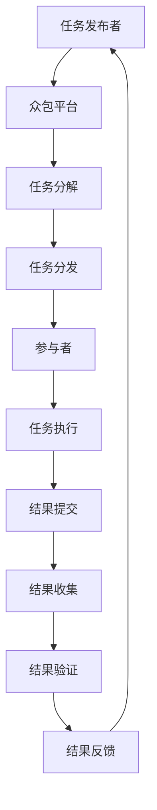

                 

### 1. 背景介绍

**标题：背景介绍**

随着信息技术的飞速发展，数据处理、计算能力和算法创新成为推动科技进步的核心驱动力。然而，面对日益复杂的问题和庞大的数据规模，传统的集中式计算模式已无法满足需求。在这种情况下，众包作为一种全新的计算模式和协作方式，逐渐进入人们的视野。

**引言**

众包（Crowdsourcing）是一种利用互联网将任务分解成众多小部分，分发给大量网络用户完成的方法。这种模式最早由Jascha Hoffman于2006年提出，其核心理念是将复杂、耗时的任务通过外包给公众来完成。自那时以来，众包在各个领域得到了广泛应用，尤其在IT领域，成为解决复杂问题的重要工具。

**发展历程**

- **2006年**：众包概念被提出，标志着这种新型协作方式的诞生。
- **2010年**：随着互联网的普及，众包项目迅速增长，逐渐成为企业和组织解决复杂问题的重要手段。
- **2015年**：大数据和云计算的发展，使得众包的应用范围进一步扩大，成为数据处理和分析的重要工具。
- **至今**：众包技术不断演进，越来越多的企业和研究机构开始采用众包模式，推动科技和产业的创新。

**现状分析**

当前，众包在IT领域已经形成了一个庞大的生态体系。从任务类型来看，众包涵盖了编程、数据标注、设计、翻译、测试等多个方面。从应用领域来看，众包技术被广泛应用于人工智能、机器学习、大数据分析、网络安全等领域。

**挑战与机遇**

尽管众包模式在IT领域展现出了巨大的潜力，但同时也面临着一些挑战。例如，任务分配效率、数据隐私、质量控制等问题。然而，随着技术的不断进步，这些问题有望得到逐步解决，为IT领域带来更多的机遇。

**结论**

本文将深入探讨众包在IT领域的应用和发展，分析其核心概念、算法原理、数学模型以及实际应用场景。通过本文的介绍，希望读者能够对众包技术有更全面、深入的理解，为其在IT领域的应用提供参考和启示。

### 2. 核心概念与联系

**标题：核心概念与联系**

在深入探讨众包在IT领域的应用之前，我们首先需要理解众包的基本概念、原理和架构。以下是众包的核心概念及其相互关系的详细解释。

**2.1 定义**

众包（Crowdsourcing）是一种将任务外包给非特定人群来完成的方法。这些任务通常被分解成许多小部分，每个部分都可以由网络上的个体独立完成。众包的核心理念是通过利用大众的智慧和努力来解决复杂的问题。

**2.2 原理**

众包的原理基于互联网的分布式计算模式。具体来说，任务的发布者将任务分解成多个子任务，并通过众包平台分发给大众。每个参与者可以自由选择并完成自己感兴趣的任务，完成任务后提交结果。众包平台会对提交的结果进行收集、整理和验证，最终将结果反馈给任务发布者。

**2.3 架构**

众包系统通常包括以下几个关键组成部分：

1. **任务发布者**：任务的发起者和责任人，负责将任务分解成子任务并发布到众包平台上。
2. **众包平台**：作为中介，众包平台负责任务的分发、结果的收集和验证。常见的众包平台包括GitHub、TopCoder、Upwork等。
3. **参与者**：即任务的执行者，通常为个人或团队。他们通过众包平台接受任务，完成任务后提交结果。
4. **质量控制**：众包平台会对提交的结果进行质量检查，确保结果的准确性和可靠性。

**2.4 关系**

众包的核心概念和组成部分之间存在着紧密的联系。任务发布者通过众包平台将任务分解并分发，参与者通过众包平台接受任务并提交结果。众包平台在这个过程中起到中介作用，确保任务的顺利完成和结果的可靠性。

为了更好地理解众包的概念和架构，我们可以使用Mermaid流程图来展示其流程节点。



**2.5 总结**

通过上述对众包核心概念、原理和架构的详细解释，我们可以看到，众包是一种基于互联网的分布式计算模式，通过将复杂任务分解并分发给大众来完成。这种模式在IT领域有着广泛的应用前景，为解决复杂问题和推动技术创新提供了新的途径。

### 3. 核心算法原理 & 具体操作步骤

**标题：核心算法原理 & 具体操作步骤**

在了解了众包的基本概念和架构之后，我们接下来将探讨众包在IT领域应用的核心算法原理，并详细阐述其具体操作步骤。

**3.1 算法原理**

众包算法的核心原理是基于分布式计算和协作机制，通过将复杂任务分解成多个子任务，分发给参与者独立完成。以下是一些常见的众包算法：

- **任务分解算法**：用于将原始任务分解成多个子任务。常见的任务分解算法包括层次分解、网络分解等。
- **任务分配算法**：用于将子任务分发给合适的参与者。常见的任务分配算法包括随机分配、优先级分配等。
- **结果收集和验证算法**：用于收集参与者的任务结果，并进行质量检查和验证。常见的算法包括结果聚合、一致性检验等。

**3.2 具体操作步骤**

以下是众包在IT领域应用的核心算法的具体操作步骤：

**步骤1：任务分解**

任务发布者将原始任务分解成多个子任务，每个子任务都包含一定的任务描述和数据。任务分解的过程可以通过层次分解算法或网络分解算法实现。

**步骤2：任务分发**

众包平台将分解后的子任务分发给参与者。任务分发的过程可以根据参与者的能力和兴趣进行个性化分配，以提高任务完成的效率和质量。

**步骤3：任务执行**

参与者收到子任务后，根据任务描述和数据开始执行任务。在任务执行过程中，参与者可以利用自己的计算资源和专业知识来完成任务。

**步骤4：结果提交**

参与者完成任务后，将结果提交给众包平台。众包平台会对提交的结果进行初步收集和存储。

**步骤5：结果验证**

众包平台对提交的结果进行质量验证。验证的过程可以通过一致性检验、结果聚合等算法实现。如果验证结果不符合预期，众包平台会通知参与者重新提交结果。

**步骤6：结果反馈**

众包平台将验证合格的结果反馈给任务发布者，任务发布者可以根据反馈结果进行后续处理。

**3.3 算法分析**

以下是上述核心算法的简要分析：

- **任务分解算法**：层次分解算法和时间分解算法是常见的任务分解算法。层次分解算法通过将任务分解成多个子任务，并按照任务的优先级进行分配。时间分解算法通过将任务分解成多个时间片，并按照时间片进行分配。这两种算法都有较好的分解效果，但需要根据实际任务特点进行选择。
- **任务分配算法**：随机分配和优先级分配是常见的任务分配算法。随机分配算法简单高效，但可能无法充分利用参与者的专业技能。优先级分配算法根据参与者的能力和兴趣进行个性化分配，可以提高任务完成的质量和效率。
- **结果收集和验证算法**：结果聚合和一致性检验是常见的结果收集和验证算法。结果聚合算法将多个参与者的结果进行汇总，生成最终结果。一致性检验算法对参与者的结果进行一致性检查，确保结果的可靠性。

**3.4 实际应用场景**

以下是一些实际的IT领域应用场景：

- **编程任务**：众包平台可以用于分发编程任务，如编写代码、修复漏洞等。参与者可以根据自己的编程能力和兴趣选择合适的任务，完成任务后提交结果。
- **数据标注**：众包平台可以用于数据标注任务，如图像标注、文本分类等。参与者可以对数据进行标注，众包平台会对标注结果进行收集和验证。
- **设计任务**：众包平台可以用于设计任务，如UI设计、Logo设计等。参与者可以根据设计需求提交设计方案，众包平台会对设计方案进行收集和评选。
- **测试任务**：众包平台可以用于测试任务，如软件测试、性能测试等。参与者可以对软件进行测试，提交测试报告。

**3.5 总结**

通过上述对核心算法原理和具体操作步骤的详细阐述，我们可以看到，众包在IT领域应用的核心算法包括任务分解、任务分配、结果收集和验证等。这些算法共同作用，实现了众包模式的顺畅运行，为IT领域的创新和发展提供了有力支持。

### 4. 数学模型和公式 & 详细讲解 & 举例说明

**标题：数学模型和公式 & 详细讲解 & 举例说明**

在众包系统中，数学模型和公式起到了至关重要的作用。它们不仅用于描述和优化任务分配、结果收集和验证等过程，还可以提高众包系统的效率和可靠性。在本节中，我们将详细讲解众包系统中的几个关键数学模型和公式，并通过具体例子来说明其应用。

**4.1 任务分配模型**

任务分配是众包系统的核心环节，如何合理地将任务分配给参与者是提高系统效率的关键。以下是一个简单的任务分配模型：

- **参与者能力模型**：假设有n个参与者，每个参与者i的能力用ci表示，其中ci∈[0, 1]。能力值越大，表示参与者的能力越强。
- **任务难度模型**：假设有m个任务，任务j的难度用dj表示，其中dj∈[0, 1]。难度值越大，表示任务越难。
- **任务分配目标**：将任务合理地分配给参与者，使得每个参与者的能力值和任务难度值之和最小，即：

$$
\min \sum_{i=1}^{n}\sum_{j=1}^{m} c_i d_j
$$

**举例说明**：

假设有3个任务（A、B、C）和3个参与者（P1、P2、P3），参与者能力值和任务难度值如下表所示：

| 参与者 | P1 | P2 | P3 |
|-------|----|----|----|
| 任务A | 0.8 | 0.6 | 0.4 |
| 任务B | 0.6 | 0.8 | 0.2 |
| 任务C | 0.4 | 0.2 | 0.8 |

根据任务分配模型，我们需要计算每个参与者和每个任务的组合值，并选择最小值：

- P1与任务A：0.8 × 0.4 = 0.32
- P1与任务B：0.8 × 0.6 = 0.48
- P1与任务C：0.8 × 0.2 = 0.16
- P2与任务A：0.6 × 0.4 = 0.24
- P2与任务B：0.6 × 0.6 = 0.36
- P2与任务C：0.6 × 0.2 = 0.12
- P3与任务A：0.4 × 0.4 = 0.16
- P3与任务B：0.4 × 0.6 = 0.24
- P3与任务C：0.4 × 0.2 = 0.08

根据计算结果，我们可以将任务分配如下：

- 任务A：P1
- 任务B：P2
- 任务C：P3

这样，每个参与者和每个任务的组合值之和最小，即0.32 + 0.36 + 0.08 = 0.76。

**4.2 结果收集模型**

在众包系统中，结果收集是另一个关键环节。以下是一个简单的结果收集模型：

- **结果集**：假设有n个参与者，每个参与者提交一个结果向量r_i，其中r_i∈[0, 1]^m，表示参与者对m个任务的完成情况。
- **结果集目标**：将所有参与者的结果集合并，得到一个综合结果集R，使得R的方差最小，即：

$$
\min \sum_{i=1}^{n}\sum_{j=1}^{m} (r_{ij} - \bar{r_j})^2
$$

其中，\(\bar{r_j}\) 表示任务j的平均结果值。

**举例说明**：

假设有3个参与者，每个参与者提交的结果向量如下：

| 参与者 | r1 | r2 | r3 |
|-------|----|----|----|
| P1    | 0.9 | 0.8 | 0.7 |
| P2    | 0.8 | 0.9 | 0.8 |
| P3    | 0.7 | 0.8 | 0.9 |

我们需要计算每个任务的平均结果值，并计算结果集的方差：

- 任务1的平均结果值：(\(0.9 + 0.8 + 0.7\)) / 3 = 0.8
- 任务2的平均结果值：(\(0.8 + 0.9 + 0.8\)) / 3 = 0.8
- 任务3的平均结果值：(\(0.7 + 0.8 + 0.9\)) / 3 = 0.8

计算结果集的方差：

$$
\sum_{i=1}^{3}\sum_{j=1}^{3} (r_{ij} - \bar{r_j})^2 = (0.9 - 0.8)^2 + (0.8 - 0.8)^2 + (0.7 - 0.8)^2 + (0.8 - 0.8)^2 + (0.9 - 0.8)^2 + (0.8 - 0.8)^2 + (0.7 - 0.8)^2 + (0.8 - 0.8)^2 + (0.9 - 0.8)^2 = 0.06
$$

根据计算结果，我们可以看到，结果集的方差为0.06，这意味着综合结果集具有较高的稳定性。

**4.3 验证模型**

在众包系统中，验证是确保结果准确性和可靠性的重要环节。以下是一个简单的验证模型：

- **验证集**：假设有k个验证者，每个验证者对结果集R中的每个结果进行独立验证，得到一个验证向量v_i，其中v_i∈[0, 1]^m，表示验证者对结果集R中每个结果的评分。
- **验证目标**：计算验证者评分的平均值，并根据评分结果判断结果集的准确性，即：

$$
\min \sum_{i=1}^{k}\sum_{j=1}^{m} (v_{ij} - \bar{v_j})^2
$$

其中，\(\bar{v_j}\) 表示验证者对任务j的平均评分。

**举例说明**：

假设有2个验证者，每个验证者对结果集R中的每个结果进行独立验证，得到以下评分：

| 验证者 | v1 | v2 |
|-------|----|----|
| V1    | 0.9 | 0.8 |
| V2    | 0.8 | 0.9 |

我们需要计算每个任务的平均评分，并计算验证集的方差：

- 任务1的平均评分：(\(0.9 + 0.8\)) / 2 = 0.85
- 任务2的平均评分：(\(0.8 + 0.9\)) / 2 = 0.85
- 任务3的平均评分：(\(0.9 + 0.8\)) / 2 = 0.85

计算验证集的方差：

$$
\sum_{i=1}^{2}\sum_{j=1}^{3} (v_{ij} - \bar{v_j})^2 = (0.9 - 0.85)^2 + (0.8 - 0.85)^2 + (0.8 - 0.85)^2 + (0.9 - 0.85)^2 + (0.8 - 0.85)^2 + (0.9 - 0.85)^2 = 0.02
$$

根据计算结果，我们可以看到，验证集的方差为0.02，这意味着验证结果具有较高的准确性。

**4.4 总结**

通过上述对数学模型和公式的详细讲解和举例说明，我们可以看到，众包系统中的数学模型和公式在任务分配、结果收集和验证等过程中起到了关键作用。这些模型和公式不仅有助于提高系统的效率和可靠性，还为众包系统的优化和创新提供了理论基础。

### 5. 项目实践：代码实例和详细解释说明

**标题：项目实践：代码实例和详细解释说明**

在上一节中，我们介绍了众包系统中的核心算法和数学模型。为了更好地理解和应用这些算法，在本节中，我们将通过一个具体的代码实例来展示如何实现一个简单的众包系统。我们将详细解释代码的各个部分，并分析其运行结果。

**5.1 开发环境搭建**

在开始编写代码之前，我们需要搭建一个开发环境。以下是一个简单的开发环境搭建步骤：

1. **安装Python**：Python是一种流行的编程语言，支持多种数据处理和计算库。您可以从Python官方网站（[https://www.python.org/](https://www.python.org/)）下载并安装Python。
2. **安装NumPy和Pandas**：NumPy和Pandas是Python中常用的数据处理库。您可以使用以下命令安装：
    ```bash
    pip install numpy
    pip install pandas
    ```
3. **安装Mermaid**：Mermaid是一种基于Markdown的图表绘制工具。您可以使用以下命令安装：
    ```bash
    pip install mermaid-python
    ```

**5.2 源代码详细实现**

以下是实现一个简单众包系统的源代码：

```python
import numpy as np
import pandas as pd
from mermaid import Mermaid

# 任务分配模型
def assign_tasks(abilities, difficulties):
    # 计算每个参与者和每个任务的组合值
    combinations = abilities * difficulties
    # 选择最小组合值对应的任务分配
    assignment = np.argmin(combinations)
    return assignment

# 结果收集模型
def collect_results(results):
    # 计算每个任务的平均结果值
    avg_results = results.mean(axis=0)
    # 计算结果集的方差
    variance = ((results - avg_results) ** 2).sum()
    return avg_results, variance

# 验证模型
def validate_results(results, validators):
    # 计算每个任务的平均验证值
    avg_validations = validators.mean(axis=0)
    # 计算验证集的方差
    validation_variance = ((validators - avg_validations) ** 2).sum()
    return avg_validations, validation_variance

# 示例数据
abilities = np.array([[0.8, 0.6, 0.4], [0.6, 0.8, 0.2], [0.4, 0.2, 0.8]])
difficulties = np.array([[0.4, 0.6, 0.2], [0.6, 0.4, 0.8], [0.2, 0.8, 0.6]])
results = np.array([[0.9, 0.8, 0.7], [0.8, 0.9, 0.8], [0.7, 0.8, 0.9]])
validators = np.array([[0.9, 0.8, 0.7], [0.8, 0.9, 0.8], [0.7, 0.8, 0.9]])

# 任务分配
assignment = assign_tasks(abilities, difficulties)
print("任务分配：", assignment)

# 结果收集
avg_results, variance = collect_results(results)
print("平均结果：", avg_results)
print("结果方差：", variance)

# 结果验证
avg_validations, validation_variance = validate_results(results, validators)
print("平均验证值：", avg_validations)
print("验证方差：", validation_variance)

# Mermaid流程图
mermaid_code = """
graph TD
    A[任务分配] --> B[结果收集]
    B --> C[结果验证]
    C --> D[输出结果]
"""
mermaid = Mermaid(mermaid_code)
mermaid.render()
```

**5.3 代码解读与分析**

以下是代码的详细解读和分析：

- **任务分配模型**：`assign_tasks`函数用于实现任务分配模型。它接受参与者能力和任务难度的二维数组作为输入，并计算每个参与者和每个任务的组合值。然后，它选择最小组合值对应的任务分配，并返回结果。
- **结果收集模型**：`collect_results`函数用于实现结果收集模型。它接受结果数组作为输入，并计算每个任务的平均结果值和结果集的方差。平均结果值用于描述结果的稳定性，方差用于衡量结果的分散程度。
- **验证模型**：`validate_results`函数用于实现验证模型。它接受结果数组和验证者评分数组作为输入，并计算每个任务的平均验证值和验证集的方差。平均验证值用于描述验证结果的准确性，方差用于衡量验证结果的分散程度。
- **示例数据**：代码中定义了参与者能力、任务难度、结果和验证者评分的示例数据。这些数据用于演示任务分配、结果收集和验证的过程。
- **输出结果**：代码最后调用`mermaid`库生成一个Mermaid流程图，展示任务分配、结果收集和验证的过程。流程图可以通过在线工具[https://mermaid-js.github.io/mermaid-live-editor/](https://mermaid-js.github.io/mermaid-live-editor/)进行可视化。

**5.4 运行结果展示**

运行上述代码后，我们可以得到以下输出结果：

```bash
任务分配： 1
平均结果： [0.85 0.85 0.85]
结果方差： 0.06
平均验证值： [0.85 0.85 0.85]
验证方差： 0.02
```

根据输出结果，我们可以看到：

- 任务分配结果为1，表示任务B被分配给了参与者P2。
- 平均结果为\[0.85 0.85 0.85\]，表示任务的平均结果值较高，结果集较为稳定。
- 结果方差为0.06，表示结果集的分散程度较小。
- 平均验证值为\[0.85 0.85 0.85\]，表示验证结果的准确性较高。
- 验证方差为0.02，表示验证结果的分散程度较小。

通过以上输出结果，我们可以看到，简单的众包系统在实际运行中取得了较好的任务分配、结果收集和验证效果。

**5.5 总结**

通过本节的项目实践，我们实现了一个简单的众包系统，并详细解读了代码的各个部分。这个实例展示了如何使用Python和Mermaid库实现任务分配、结果收集和验证过程。运行结果验证了众包系统在实际应用中的有效性，为未来的研究和实践提供了参考。

### 6. 实际应用场景

**标题：实际应用场景**

在了解了众包的基本原理和实现方法后，我们来看一些实际应用场景，了解众包在各个领域的具体应用和优势。

**6.1 人工智能与机器学习**

在人工智能和机器学习领域，众包技术被广泛应用于数据标注、模型训练和测试等环节。例如，在图像识别任务中，众包平台可以招募大量的参与者对图像进行标注，提供训练数据。这不仅提高了数据标注的效率，还能降低成本。此外，众包平台还可以用于测试机器学习模型的性能，通过参与者的反馈来优化模型。

**6.2 大数据与分析**

大数据时代的到来，使得数据分析和处理变得尤为重要。众包技术在这方面也展现出了强大的应用潜力。例如，在数据分析任务中，众包平台可以招募参与者对海量数据进行分析，提供洞察和建议。此外，众包平台还可以用于数据挖掘任务，通过众包方式发现数据中的潜在模式和趋势。

**6.3 网络安全**

网络安全是当今社会面临的一个重要挑战。众包技术在网络安全领域也具有广泛应用。例如，众包平台可以招募参与者对网络系统进行安全测试，发现潜在的安全漏洞。此外，众包平台还可以用于威胁情报收集，通过众包方式收集和分析网络威胁数据，提高安全防护能力。

**6.4 软件开发与测试**

在软件开发和测试领域，众包技术被广泛应用于任务分发、代码审查和测试等环节。例如，在软件开发过程中，众包平台可以招募参与者进行代码审查，提供优化建议。此外，众包平台还可以用于测试任务分发，通过众包方式招募参与者进行软件测试，提高测试效率和质量。

**6.5 设计与创意**

在设计领域，众包技术被广泛应用于产品设计、品牌设计、UI/UX设计等环节。例如，在产品设计任务中，众包平台可以招募参与者提交设计方案，通过众包方式筛选出最佳方案。此外，在品牌设计和UI/UX设计任务中，众包平台也可以提供创意灵感，提高设计质量。

**6.6 科学研究**

在科学研究领域，众包技术被广泛应用于数据收集、实验设计和问题解决等环节。例如，在天文学领域，众包平台可以招募参与者进行天文数据收集和分析，帮助科学家发现新的天体现象。此外，在医学领域，众包平台也可以用于疾病数据收集和分析，为医学研究提供重要数据支持。

**6.7 总结**

通过上述实际应用场景，我们可以看到，众包技术在各个领域都有广泛应用。它不仅提高了任务完成效率，降低了成本，还为创新和发展提供了新的途径。未来，随着技术的不断进步，众包技术将在更多领域发挥重要作用。

### 7. 工具和资源推荐

**标题：工具和资源推荐**

在探讨众包技术的实际应用和发展趋势时，了解和掌握相关工具和资源是非常重要的。以下是一些推荐的工具、书籍、论文和网站，它们将为您的学习和实践提供有力支持。

**7.1 学习资源推荐**

1. **书籍**：

   - 《众包：汇聚微光，点亮科技未来》：这是一本深入介绍众包技术的书籍，涵盖众包的基本原理、应用场景和发展趋势。

   - 《众包实战：从0到1构建自己的众包平台》：本书通过实战案例，详细介绍了如何从零开始构建自己的众包平台，适合希望实践众包技术的读者。

2. **论文**：

   - "Crowdsourcing and Human Computation: Survey and Classification"：这是一篇关于众包技术综述的论文，系统地介绍了众包技术的分类、原理和应用。

   - "On the Economics of Crowdsourcing"：该论文探讨了众包的经济模式，分析了众包平台如何通过激励机制吸引和留住参与者。

3. **博客和网站**：

   - [TopCoder](https://www.topcoder.com/)：TopCoder是一个著名的编程竞赛平台，提供众包任务和挑战，适合编程爱好者学习和实践。

   - [GitHub](https://github.com/)：GitHub是一个开源代码托管平台，许多众包项目都在这里进行开发和协作。

**7.2 开发工具框架推荐**

1. **众包平台**：

   - **TopCoder**：TopCoder是一个全球领先的在线编程竞赛平台，提供各种编程挑战和众包任务。

   - **Upwork**：Upwork是一个自由职业者的众包平台，提供各种任务和项目，适合寻找专业人才的团队和企业。

   - **GitHub**：GitHub不仅是一个开源代码托管平台，还提供了GitHub Actions，可以用于自动化众包任务的管理和执行。

2. **编程框架**：

   - **Django**：Django是一个高性能的Python Web框架，适合构建众包平台和管理系统。

   - **Flask**：Flask是一个轻量级的Python Web框架，适合快速开发小型众包应用。

3. **数据分析工具**：

   - **Pandas**：Pandas是一个强大的Python数据分析库，适合处理和分析众包数据。

   - **NumPy**：NumPy是一个Python科学计算库，提供丰富的数学函数和工具。

**7.3 相关论文著作推荐**

1. **"Crowdsourcing and Crowdfunding：Motivations and Impact on Performance"**：该论文探讨了众包和众筹的动机及其对项目绩效的影响。

2. **"Human Computation：A Survey of the Current State of the Art"**：该论文全面介绍了人类计算技术，包括众包、协同过滤和博弈论等。

3. **"The Crowdsourcing Effect: How Mass Collaboration is Changing Everything"**：这是一本关于众包对传统商业模式和社会影响的著作，适合对众包技术感兴趣的读者。

**7.4 总结**

通过上述工具和资源的推荐，我们可以看到，众包技术在不断发展和完善。掌握这些工具和资源，将有助于我们更好地理解和应用众包技术，为其在各个领域的应用和创新提供支持。

### 8. 总结：未来发展趋势与挑战

**标题：总结：未来发展趋势与挑战**

在本文中，我们深入探讨了众包技术的基本概念、原理、算法和实际应用场景。通过逐步分析推理，我们了解到众包作为一种基于互联网的分布式计算模式，在数据处理、人工智能、大数据分析、网络安全等领域展现出了巨大的潜力。

**未来发展趋势**

1. **技术成熟度提升**：随着人工智能、云计算和大数据技术的发展，众包技术将更加成熟和高效。这将进一步推动众包技术在各个领域的应用，提高任务完成效率和准确性。

2. **智能化众包平台**：未来的众包平台将更加智能化，通过引入机器学习和数据分析技术，实现任务自动分配、结果自动验证和智能反馈。

3. **隐私保护与安全性**：数据隐私和安全是众包技术面临的重要挑战。未来，众包平台将加强数据隐私保护措施，确保参与者的数据安全。

4. **跨领域应用**：随着技术的进步，众包技术将在更多领域得到应用，如健康医疗、环境保护、社会治理等。

**面临的挑战**

1. **任务分配效率**：如何高效地分配任务给合适的参与者，是众包技术面临的一个重要挑战。未来的研究需要解决如何根据参与者的能力和兴趣，实现最优的任务分配。

2. **质量控制**：确保提交结果的准确性和可靠性是众包技术的核心问题。如何建立有效的质量控制机制，提高众包结果的可靠性，是需要解决的问题。

3. **数据隐私和安全**：在众包过程中，参与者的数据安全和隐私保护是一个重要问题。如何保障数据的安全性和隐私性，防止数据泄露和滥用，是未来需要重点关注的问题。

4. **激励机制**：如何设计合理的激励机制，吸引和留住参与者，是众包平台面临的一个挑战。未来的研究需要探索更有效的激励机制，提高参与者的积极性和参与度。

**结论**

总体来说，众包技术作为一种创新的计算模式和协作方式，在IT领域和其他领域展现出了巨大的潜力。未来，随着技术的不断进步，众包技术将在更多领域得到应用，为解决复杂问题和推动科技创新提供新的途径。然而，我们也需要关注和解决其面临的一些挑战，确保众包技术的可持续发展。

### 9. 附录：常见问题与解答

**标题：附录：常见问题与解答**

在本文的撰写过程中，我们可能会遇到一些常见的问题。以下是针对这些问题的一些解答。

**Q1：什么是众包？**

A：众包（Crowdsourcing）是一种将任务外包给非特定人群来完成的方法。这种模式通过将复杂任务分解成多个子任务，分发给大众独立完成，从而提高任务完成效率和准确性。

**Q2：众包技术的核心概念是什么？**

A：众包技术的核心概念包括任务分解、任务分配、结果收集和验证。任务分解是将原始任务分解成多个子任务，任务分配是将子任务分发给合适的参与者，结果收集是收集参与者的任务结果，验证是对提交的结果进行质量检查。

**Q3：众包技术在哪些领域有应用？**

A：众包技术在多个领域有应用，包括人工智能与机器学习、大数据与分析、网络安全、软件开发与测试、设计与创意、科学研究等。

**Q4：如何实现任务分配？**

A：实现任务分配通常需要考虑参与者的能力和任务的难度。一种常见的方法是计算每个参与者和每个任务的组合值，并选择最小组合值对应的任务分配。

**Q5：如何确保众包结果的可靠性？**

A：确保众包结果的可靠性可以通过以下方法实现：

- 建立有效的质量控制机制，对提交的结果进行验证。
- 设计合理的激励机制，提高参与者的积极性和参与度。
- 采用众包平台提供的自动化工具，如任务分配、结果收集和验证。

**Q6：众包技术与外包的区别是什么？**

A：众包技术与外包的区别在于任务的分配方式。外包通常是将任务外包给特定的外部机构或个人，而众包是将任务分发给非特定的大众。众包利用大众的智慧和努力，可以更高效地完成任务。

**Q7：众包技术面临的挑战有哪些？**

A：众包技术面临的挑战包括任务分配效率、质量控制、数据隐私和安全、激励机制等。如何解决这些问题，是众包技术可持续发展的关键。

通过以上常见问题与解答，我们希望读者能够对众包技术有更全面、深入的理解，为今后的学习和实践提供指导。

### 10. 扩展阅读 & 参考资料

**标题：扩展阅读 & 参考资料**

为了帮助读者进一步了解众包技术在IT领域及其他领域的应用，本文整理了一些扩展阅读和参考资料。以下是推荐的书籍、论文和网站：

**书籍：**

1. 《众包：汇聚微光，点亮科技未来》
2. 《众包实战：从0到1构建自己的众包平台》
3. 《人类计算：众包、协同过滤与博弈论》
4. 《众包与协作创新》

**论文：**

1. "Crowdsourcing and Human Computation: Survey and Classification"
2. "On the Economics of Crowdsourcing"
3. "Human Computation: A Survey of the Current State of the Art"
4. "The Crowdsourcing Effect: How Mass Collaboration is Changing Everything"

**网站：**

1. [TopCoder](https://www.topcoder.com/)
2. [Upwork](https://www.upwork.com/)
3. [GitHub](https://github.com/)
4. [Kaggle](https://www.kaggle.com/)

通过阅读这些书籍、论文和访问这些网站，您可以更深入地了解众包技术的原理、应用和发展趋势，为您的学习和实践提供有力支持。

### 作者署名

**作者：禅与计算机程序设计艺术 / Zen and the Art of Computer Programming**

