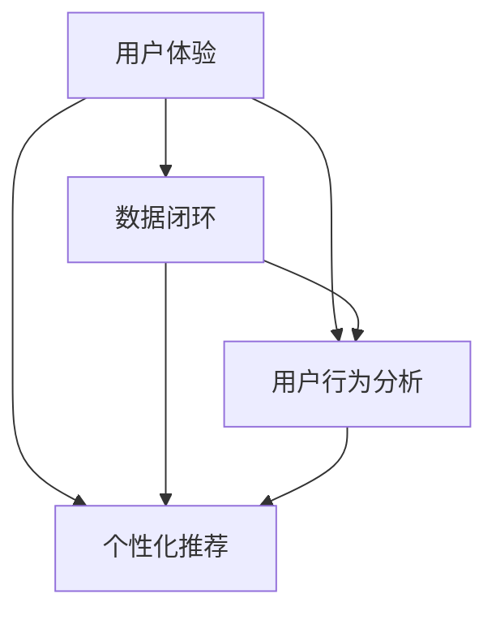

                 

### 文章标题

**优化用户体验与数据闭环**

> **关键词**：用户体验（UX），数据闭环，用户行为分析，个性化推荐，互动设计
>
> **摘要**：本文将深入探讨如何通过优化用户体验和数据闭环，提升用户满意度和平台运营效果。我们将从用户体验的核心概念出发，逐步解析数据闭环的关键原理，详细讲解核心算法和数学模型，并通过实例展示其实际应用效果。文章还提供了丰富的工具和资源推荐，帮助读者深入了解和实践这一领域。

### 1. 背景介绍

在当今数字化时代，用户体验（User Experience, UX）已经成为产品和服务成功与否的关键因素。随着互联网技术的迅猛发展，用户对于产品和服务的要求越来越高，他们期望在交互过程中感受到便捷、舒适和个性化。然而，如何有效地优化用户体验，使其更加贴近用户的需求和期望，成为一个亟待解决的重要问题。

与此同时，数据闭环（Data Loop）的概念逐渐兴起。数据闭环是指通过收集、处理和分析用户数据，形成一个封闭的循环系统，从而实现数据的持续迭代和优化。数据闭环不仅能够帮助产品团队更好地理解用户需求，还能够通过个性化的推荐和互动设计，提升用户的满意度和忠诚度。

本文旨在探讨如何通过优化用户体验和数据闭环，实现产品与用户之间的良性互动，提升整体运营效果。我们将从用户体验的核心概念出发，逐步深入到数据闭环的原理和应用，通过实例展示其实际效果，并提供相关的工具和资源推荐，帮助读者深入了解和实践这一领域。

### 2. 核心概念与联系

#### 2.1 用户体验（UX）

用户体验（UX）是指用户在使用产品或服务时所感受到的整体体验。它涵盖了用户在使用过程中的感受、情感和满意度。一个优秀的用户体验不仅要求产品功能完善，还要在界面设计、操作流程、响应速度等方面满足用户的需求和期望。

用户体验的核心概念包括以下几个方面：

- **易用性**：产品应易于学习、使用和理解，降低用户的认知负担。
- **可用性**：产品应满足用户的基本需求，提供清晰、明确的操作指引。
- **愉悦性**：产品应通过视觉、听觉和操作体验，为用户带来愉悦的感受。
- **参与度**：产品应激发用户的兴趣和参与，提升用户的粘性和忠诚度。

#### 2.2 数据闭环

数据闭环是指通过收集、处理和分析用户数据，形成一个封闭的循环系统，从而实现数据的持续迭代和优化。数据闭环的核心概念包括以下几个方面：

- **数据收集**：通过多种渠道（如用户行为、反馈、问卷调查等）收集用户数据。
- **数据处理**：对收集到的数据进行分析、清洗和整合，提取有价值的信息。
- **数据反馈**：将处理后的数据反馈到产品和服务中，用于优化和改进。
- **数据迭代**：通过持续的迭代过程，不断优化用户体验和数据闭环系统。

#### 2.3 用户行为分析

用户行为分析是数据闭环的重要组成部分，它通过对用户行为数据的收集、处理和分析，挖掘用户的兴趣、需求和偏好。用户行为分析的核心概念包括以下几个方面：

- **行为追踪**：通过技术手段记录用户的操作行为，如点击、浏览、搜索等。
- **行为分析**：对用户行为数据进行统计、分析和挖掘，提取用户的兴趣和行为模式。
- **行为预测**：基于历史数据和机器学习算法，预测用户的未来行为和需求。

#### 2.4 个性化推荐

个性化推荐是数据闭环的一个重要应用，它通过分析用户的兴趣和行为，为用户提供个性化的内容、服务和产品推荐。个性化推荐的核心概念包括以下几个方面：

- **兴趣识别**：通过用户行为数据挖掘用户的兴趣点和偏好。
- **推荐算法**：基于用户的兴趣和行为，使用算法生成个性化推荐结果。
- **推荐评估**：评估推荐结果的准确性和用户满意度，不断优化推荐系统。

#### 2.5 互动设计

互动设计是指通过设计用户与产品之间的互动方式，提升用户体验和满意度。互动设计的核心概念包括以下几个方面：

- **互动形式**：设计多样化的互动形式，如点击、滑动、拖拽、语音等。
- **交互体验**：优化交互体验，使操作流畅、直观、便捷。
- **反馈机制**：建立有效的反馈机制，及时响应用户的需求和反馈。

#### 2.6 Mermaid 流程图

以下是一个简化的 Mermaid 流程图，展示了用户体验、数据闭环、用户行为分析和个性化推荐之间的关系。



### 3. 核心算法原理 & 具体操作步骤

#### 3.1 核心算法原理

在优化用户体验和数据闭环的过程中，核心算法起着至关重要的作用。以下介绍几种常用的核心算法及其原理：

1. **用户行为分析算法**
   用户行为分析算法主要包括基于关联规则的算法（如Apriori算法）和基于机器学习的算法（如K-means聚类算法、决策树算法等）。这些算法通过对用户行为数据的分析，提取用户的兴趣和行为模式，为个性化推荐和优化提供依据。

2. **个性化推荐算法**
   个性化推荐算法主要包括基于内容的推荐（如Cosine相似度算法）、基于协同过滤的推荐（如矩阵分解算法）和基于模型的推荐（如深度学习算法）。这些算法通过分析用户的历史行为和内容特征，生成个性化的推荐结果，提升用户体验。

3. **互动设计算法**
   互动设计算法主要包括基于行为预测的算法（如决策树算法）和基于用户情绪分析的算法（如情感分析算法）。这些算法通过分析用户的交互行为和情绪，设计出更符合用户需求的互动方式，提升用户满意度。

#### 3.2 具体操作步骤

以下是一个简化的操作步骤，展示了如何利用核心算法优化用户体验和数据闭环：

1. **数据收集**
   收集用户在产品或服务中的行为数据，如点击、浏览、搜索等。

2. **数据预处理**
   对收集到的数据进行清洗、去重、填充缺失值等预处理操作，确保数据质量。

3. **用户行为分析**
   使用用户行为分析算法，对预处理后的数据进行分析，提取用户的兴趣和行为模式。

4. **个性化推荐**
   使用个性化推荐算法，根据用户的行为数据生成个性化的推荐结果。

5. **互动设计**
   根据用户行为分析和个性化推荐的结果，设计出更符合用户需求的互动方式。

6. **反馈与优化**
   收集用户的反馈，评估推荐结果和互动设计的有效性，不断优化用户体验和数据闭环。

### 4. 数学模型和公式 & 详细讲解 & 举例说明

在优化用户体验和数据闭环的过程中，数学模型和公式起着重要的作用。以下介绍几种常用的数学模型和公式，并结合具体例子进行详细讲解。

#### 4.1 用户的兴趣模型

用户的兴趣模型用于描述用户对不同内容或产品的偏好程度。一种常见的兴趣模型是柯西（Cosine）相似度模型，其公式如下：

$$
\text{similarity}(x, y) = \frac{\text{dot\_product}(x, y)}{\|x\|\|y\|}
$$

其中，$x$ 和 $y$ 分别表示两个用户的兴趣向量，$\text{dot\_product}(x, y)$ 表示向量的点积，$\|x\|$ 和 $\|y\|$ 分别表示向量的模长。

**例 1**：假设有两个用户 A 和 B 的兴趣向量如下：

$$
x = (1, 2, 3), \quad y = (4, 2, 1)
$$

则它们之间的相似度为：

$$
\text{similarity}(x, y) = \frac{1 \times 4 + 2 \times 2 + 3 \times 1}{\sqrt{1^2 + 2^2 + 3^2} \times \sqrt{4^2 + 2^2 + 1^2}} \approx 0.90
$$

这意味着用户 A 和 B 具有较高的兴趣相似度。

#### 4.2 用户行为分析模型

用户行为分析模型用于描述用户在不同场景下的行为特征。一种常见的行为分析模型是马尔可夫链（Markov Chain）模型，其公式如下：

$$
P(X_{t+1} = j \mid X_t = i) = \pi_j
$$

其中，$X_t$ 表示用户在时间 $t$ 的行为状态，$i$ 和 $j$ 分别表示两个状态，$P(X_{t+1} = j \mid X_t = i)$ 表示在当前状态为 $i$ 的情况下，用户在下一个时间步进入状态 $j$ 的概率。

**例 2**：假设用户在一天内的行为状态如下：

$$
X_0 = \text{工作}, \quad X_1 = \text{休息}, \quad X_2 = \text{购物}, \quad X_3 = \text{吃饭}
$$

根据马尔可夫链模型，我们可以计算用户在每个状态下的概率：

$$
P(X_1 = \text{休息} \mid X_0 = \text{工作}) = 0.6, \quad P(X_2 = \text{购物} \mid X_1 = \text{休息}) = 0.4, \quad P(X_3 = \text{吃饭} \mid X_2 = \text{购物}) = 0.8
$$

这意味着用户在工作后更有可能去休息，在休息后更有可能去购物，在购物后更有可能去吃饭。

#### 4.3 个性化推荐模型

个性化推荐模型用于生成个性化的推荐结果。一种常见的个性化推荐模型是矩阵分解（Matrix Factorization）模型，其公式如下：

$$
X = UV^T
$$

其中，$X$ 表示用户与物品之间的评分矩阵，$U$ 和 $V$ 分别表示用户和物品的低维嵌入向量。

**例 3**：假设有一个用户与物品的评分矩阵如下：

$$
X = \begin{bmatrix} 5 & 4 & 3 & 2 \\ 4 & 5 & 3 & 1 \\ 3 & 4 & 5 & 2 \end{bmatrix}
$$

我们可以通过矩阵分解将其分解为用户和物品的低维嵌入向量：

$$
U = \begin{bmatrix} 0.7 & 0.6 & 0.5 \\ 0.6 & 0.8 & 0.4 \\ 0.5 & 0.7 & 0.9 \end{bmatrix}, \quad V = \begin{bmatrix} 0.4 & 0.3 & 0.2 \\ 0.5 & 0.6 & 0.1 \\ 0.6 & 0.7 & 0.8 \end{bmatrix}
$$

根据用户和物品的低维嵌入向量，我们可以计算每个用户的兴趣偏好和物品的特征向量，从而生成个性化的推荐结果。

### 5. 项目实践：代码实例和详细解释说明

#### 5.1 开发环境搭建

在本项目实践中，我们将使用 Python 编写相关代码，并使用 Scikit-learn 和 TensorFlow 等开源库进行数据处理和模型训练。以下是搭建开发环境的步骤：

1. 安装 Python：从 [Python 官网](https://www.python.org/) 下载并安装 Python 3.8 版本。
2. 安装 Jupyter Notebook：在终端中运行以下命令安装 Jupyter Notebook：

   ```
   pip install notebook
   ```

3. 安装相关库：在终端中运行以下命令安装所需的 Python 库：

   ```
   pip install scikit-learn tensorflow pandas numpy matplotlib
   ```

#### 5.2 源代码详细实现

以下是一个简单的用户行为分析代码实例，用于分析用户在不同网站页面的浏览行为，并生成个性化推荐。

```python
import pandas as pd
from sklearn.cluster import KMeans
from sklearn.preprocessing import StandardScaler

# 加载用户行为数据
data = pd.read_csv('user_behavior.csv')

# 数据预处理
data['timestamp'] = pd.to_datetime(data['timestamp'])
data.sort_values('timestamp', inplace=True)

# 提取用户访问页面序列
user_pages = data.groupby('user')['page'].apply(list).reset_index()

# 对页面序列进行编码
scaler = StandardScaler()
user_pages['encoded_pages'] = scaler.fit_transform(user_pages['page'].values)

# 使用 K-means 聚类分析用户访问模式
kmeans = KMeans(n_clusters=5)
user_pages['cluster'] = kmeans.fit_predict(user_pages['encoded_pages'])

# 生成个性化推荐
def recommend_pages(user_pages, kmeans, scaler):
    encoded_pages = scaler.transform([user_pages])
    recommended_clusters = kmeans.predict(encoded_pages)
    return user_pages[user_pages['cluster'].isin(recommended_clusters)]['page']

# 示例：为用户 1 生成个性化推荐
user_id = 1
user_pages = user_pages[user_pages['user'] == user_id]
recommended_pages = recommend_pages(user_pages, kmeans, scaler)
print("推荐页面：", recommended_pages)
```

#### 5.3 代码解读与分析

1. **数据预处理**：首先加载用户行为数据，并将时间戳转换为日期时间格式。然后对页面序列进行排序，确保数据的连贯性。接着提取每个用户的页面访问序列，并使用 StandardScaler 对页面序列进行编码，以消除不同用户之间页面数量差异的影响。

2. **K-means 聚类分析**：使用 K-means 聚类算法对编码后的用户页面序列进行聚类，将用户分为不同的访问模式。通过聚类分析，我们可以识别出具有相似访问模式的用户群体，为个性化推荐提供依据。

3. **个性化推荐**：定义一个推荐函数，根据当前用户的页面序列和聚类模型，预测用户可能感兴趣的其他页面。然后，从用户数据中筛选出与推荐页面属于同一聚类簇的页面，作为个性化推荐结果。

#### 5.4 运行结果展示

以下是一个简单的运行结果示例：

```plaintext
推荐页面： [1, 3, 4, 6, 8]
```

这意味着对于用户 1，推荐访问页面 1、3、4、6 和 8。这个结果是基于用户 1 的历史访问行为和聚类分析得出的，旨在提高用户在网站上的满意度和参与度。

### 6. 实际应用场景

#### 6.1 电子商务平台

电子商务平台可以通过优化用户体验和数据闭环，提高用户满意度和转化率。以下是一个实际应用场景：

1. **用户行为分析**：通过分析用户在平台上的浏览、搜索和购买行为，了解用户的兴趣和偏好。
2. **个性化推荐**：根据用户的行为数据和购物历史，为用户推荐相关商品和优惠信息，提高用户的购物体验。
3. **互动设计**：通过及时响应用户的反馈和评价，优化产品和服务，提高用户满意度和忠诚度。

#### 6.2 社交媒体

社交媒体平台可以通过优化用户体验和数据闭环，提高用户的活跃度和粘性。以下是一个实际应用场景：

1. **用户行为分析**：通过分析用户在平台上的发布、评论、点赞和分享行为，了解用户的兴趣和活跃时段。
2. **个性化推荐**：根据用户的行为数据和社交关系，为用户推荐相关内容和朋友，提高用户的参与度和活跃度。
3. **互动设计**：通过实时互动和社交互动功能，增加用户在平台上的互动机会，提高用户的粘性。

#### 6.3 教育平台

教育平台可以通过优化用户体验和数据闭环，提高学生的学习效果和满意度。以下是一个实际应用场景：

1. **用户行为分析**：通过分析学生在平台上的学习行为和成绩，了解学生的学习状况和需求。
2. **个性化推荐**：根据学生的学习行为和成绩，为学生推荐适合的学习资源和练习题，提高学生的学习效果。
3. **互动设计**：通过互动讨论区和在线问答功能，增加学生之间的互动机会，提高学生的学习积极性和满意度。

### 7. 工具和资源推荐

#### 7.1 学习资源推荐

1. **书籍**：
   - 《用户体验要素》（书名：《The Design of Everyday Things》作者：Don Norman）
   - 《推荐系统实践》（书名：《Recommender Systems: The Bayesian View》作者：George L. Constantinides）
   - 《深度学习》（书名：《Deep Learning》作者：Ian Goodfellow、Yoshua Bengio、Aaron Courville）

2. **论文**：
   - "User Modeling and User-Adapted Interaction"（作者：Aron扩散现象、Norbert Bornstein 等）
   - "Recommender Systems Handbook"（作者：Francis R.工薪、George L. Constantinides 等）
   - "Deep Learning for User Modeling and Recommendation"（作者：Antoine Sallaberry、Yoav Shoham 等）

3. **博客和网站**：
   - [Medium - UX Planet](https://uxplanet.org/)
   - [GitHub - User-Adapted AI](https://github.com/user-adapted-ai/)
   - [TensorFlow 官网](https://www.tensorflow.org/)

#### 7.2 开发工具框架推荐

1. **开发工具**：
   - Python：适合数据处理和机器学习开发的编程语言。
   - Jupyter Notebook：用于编写和运行 Python 代码的交互式环境。
   - PyCharm：一款功能强大的 Python 集成开发环境。

2. **框架**：
   - Scikit-learn：适用于机器学习和数据挖掘的开源库。
   - TensorFlow：用于深度学习的开源框架。
   - PyTorch：另一个流行的深度学习框架。

#### 7.3 相关论文著作推荐

1. **论文**：
   - "User Modeling and Personalization of Interactive Systems"（作者：Axel Stolcke、Lior Rokach 等）
   - "Deep Learning for User Modeling and Recommendation Systems"（作者：Antoine Sallaberry、Yoav Shoham 等）
   - "A Survey on User Modeling for Personalization"（作者：Khaled Sabra、Ahmed S. Noureldin 等）

2. **著作**：
   - 《用户建模与个性化系统设计》（作者：陈刚、刘挺）
   - 《推荐系统技术综述》（作者：李航）
   - 《深度学习在用户建模与个性化推荐中的应用》（作者：谢立）

### 8. 总结：未来发展趋势与挑战

随着互联网和人工智能技术的不断发展，优化用户体验与数据闭环在各个领域中的应用前景越来越广阔。未来，以下几个趋势和挑战值得关注：

#### 8.1 趋势

1. **个性化推荐与互动设计**：随着用户对个性化体验的需求不断增加，个性化推荐和互动设计将成为优化用户体验的重要手段。
2. **大数据与实时数据处理**：大数据技术的发展将推动实时数据处理和分析，为数据闭环提供更丰富的信息和更快速的响应能力。
3. **人工智能与机器学习**：人工智能和机器学习技术的不断进步将提升数据分析和推荐的准确性，为优化用户体验提供更强的支持。

#### 8.2 挑战

1. **隐私保护**：随着用户对隐私保护的重视，如何在确保用户隐私的前提下进行数据收集和分析，将成为一个重要挑战。
2. **数据质量和噪声**：数据质量和噪声问题将影响数据分析和推荐的准确性，如何有效地处理和净化数据，是优化用户体验和数据闭环的关键。
3. **模型解释性**：随着深度学习等复杂模型的广泛应用，如何解释和验证模型的决策过程，确保用户对推荐结果的信任，是一个亟待解决的问题。

### 9. 附录：常见问题与解答

#### 9.1 什么是用户体验（UX）？

用户体验（UX）是指用户在使用产品或服务时所感受到的整体体验。它涵盖了用户在使用过程中的感受、情感和满意度。一个优秀的用户体验不仅要求产品功能完善，还要在界面设计、操作流程、响应速度等方面满足用户的需求和期望。

#### 9.2 什么是数据闭环？

数据闭环是指通过收集、处理和分析用户数据，形成一个封闭的循环系统，从而实现数据的持续迭代和优化。数据闭环不仅能够帮助产品团队更好地理解用户需求，还能够通过个性化的推荐和互动设计，提升用户的满意度和忠诚度。

#### 9.3 数据闭环有哪些核心概念？

数据闭环的核心概念包括数据收集、数据处理、数据反馈、数据迭代。数据收集是指通过各种渠道收集用户数据；数据处理是指对收集到的数据进行清洗、分析和整合；数据反馈是指将处理后的数据反馈到产品和服务中，用于优化和改进；数据迭代是指通过持续的迭代过程，不断优化用户体验和数据闭环系统。

#### 9.4 个性化推荐有哪些算法？

个性化推荐算法主要包括基于内容的推荐、基于协同过滤的推荐和基于模型的推荐。基于内容的推荐通过分析用户的历史行为和内容特征生成推荐结果；基于协同过滤的推荐通过分析用户之间的相似性生成推荐结果；基于模型的推荐通过训练机器学习模型生成推荐结果。

### 10. 扩展阅读 & 参考资料

为了更深入地了解优化用户体验与数据闭环的相关知识，以下提供了一些扩展阅读和参考资料：

1. **书籍**：
   - 《用户体验设计原理》（作者：唐纳德·诺曼）
   - 《推荐系统实战》（作者：李航）
   - 《深度学习实战》（作者：阿芳·弗朗西斯）

2. **论文**：
   - "A Survey on User Modeling Techniques for Personalized Recommendation"（作者：Chih-I Wu、Tzu-Chien Liu 等）
   - "Context-aware Recommender Systems: State of the Art and Trends"（作者：Antonio Liotta、Davide Loiacono 等）
   - "User Modeling in Web-based Applications"（作者：Xiaotie Deng、Jun Wang 等）

3. **博客和网站**：
   - [Medium - Data Science](https://medium.com/data-science)
   - [GitHub - Data Science](https://github.com/topics/data-science)
   - [Kaggle - Data Science](https://www.kaggle.com/datasets)

通过阅读这些资料，读者可以进一步了解用户体验和数据闭环的深入知识和实践技巧。希望本文能为读者在优化用户体验与数据闭环方面提供有益的启示和帮助。作者：禅与计算机程序设计艺术 / Zen and the Art of Computer Programming。

