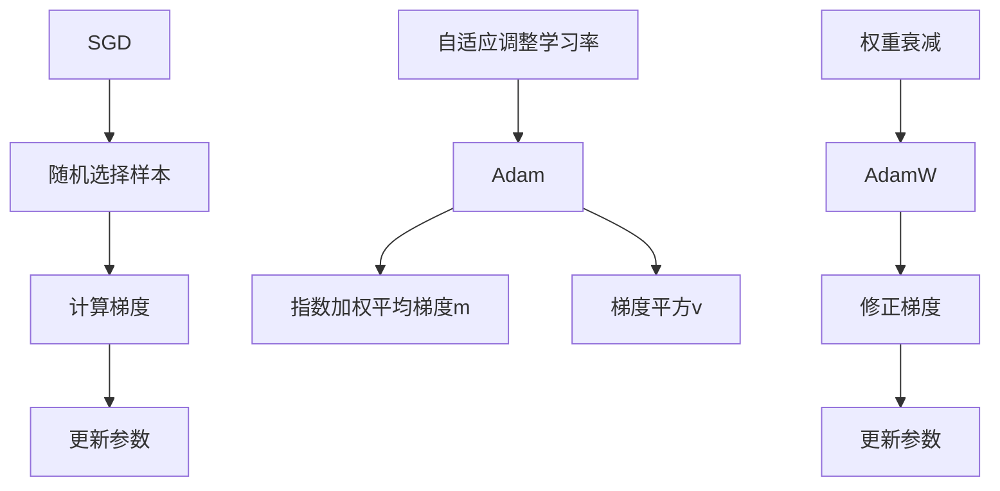

                 

### 1. 背景介绍

随着深度学习在各个领域的广泛应用，优化算法在机器学习任务中的重要性日益凸显。优化算法是机器学习中的核心组成部分，负责寻找目标函数的最优解。在深度学习中，优化算法的选择往往决定了模型训练的效率和最终性能。

目前，最流行的优化算法包括随机梯度下降（Stochastic Gradient Descent，SGD）、Adam以及AdamW等。这些算法在理论上各具特点，在实际应用中也各有优劣。本文将深入探讨这三种优化算法，通过比较它们的核心原理、数学模型和具体操作步骤，帮助读者更好地理解它们在实际应用中的表现。

随机梯度下降（SGD）是最早的优化算法之一，具有简洁和易于实现的特点。然而，SGD在实际应用中存在一定的局限性，如收敛速度慢、需要手动调整学习率等。为了克服这些不足，人们提出了Adam和AdamW算法，它们在SGD的基础上进行了改进，通过自适应地调整学习率，提高了收敛速度和训练效果。

本文将首先介绍SGD算法的基本原理，然后详细解释Adam和AdamW算法的核心思想。接下来，我们将通过数学模型和具体操作步骤来深入探讨这三种算法的实现。随后，我们将通过一个实际项目实例，展示这些算法在实际应用中的效果。最后，我们将讨论优化算法在实际应用场景中的选择策略，并推荐一些有用的学习资源和开发工具。

通过本文的阅读，读者将对优化算法有更深入的理解，能够根据实际需求选择合适的优化算法，并掌握其在实际项目中的应用方法。希望本文能够为您的机器学习之旅提供有益的指导。### 2. 核心概念与联系

为了深入理解随机梯度下降（SGD）、Adam和AdamW这三种优化算法，我们需要从基本概念和它们之间的联系开始探讨。

首先，优化算法在机器学习中的核心任务是寻找目标函数的最优解。目标函数通常是损失函数，它反映了模型预测值与真实值之间的差距。优化算法通过迭代更新模型参数，逐渐减小损失函数的值，直至达到最小值或某个局部最优解。

#### 2.1 随机梯度下降（SGD）

随机梯度下降（SGD）是一种最简单的优化算法，它通过随机选择一部分训练样本的梯度来更新模型参数。具体来说，SGD每次迭代选择一个样本，计算其梯度，并使用这个梯度来更新模型参数。这种方法的优点是实现简单，计算成本低，适合处理大规模数据集。然而，SGD的缺点也很明显：由于每次迭代只考虑一个样本，收敛速度较慢，且需要手动调整学习率，否则容易陷入局部最小值或过拟合。

#### 2.2 Adam

Adam算法是一种自适应优化算法，结合了AdaGrad和RMSProp算法的优点。它通过计算每个参数的指数加权平均梯度（m）和梯度平方（v），并使用这些值来更新参数。Adam算法的关键特点是自适应地调整学习率，这使得它能够更好地处理不同参数的梯度变化。Adam算法的收敛速度通常比SGD快，且能够避免一些常见的过拟合问题。

#### 2.3 AdamW

AdamW算法是Adam的一个变种，旨在解决在训练深度神经网络时可能出现的内部不稳定问题。它通过引入权重衰减（weight decay）的概念，对梯度进行修正，从而更好地处理不同尺度上的梯度问题。AdamW算法在深度学习任务中表现出色，特别是在处理大规模数据和深度网络时，能够显著提高模型的收敛速度和性能。

#### 2.4 核心概念与联系

下面，我们将通过一个Mermaid流程图来展示这三种算法的核心概念和联系。



从流程图中可以看出，SGD是最基础的优化算法，通过随机选择样本和计算梯度来更新参数。Adam算法在此基础上增加了自适应调整学习率的机制，通过指数加权平均梯度和梯度平方来优化参数更新。AdamW算法进一步引入了权重衰减，以解决内部不稳定问题。

通过上述核心概念和流程图的解释，我们可以更清晰地理解SGD、Adam和AdamW这三种优化算法的基本原理和相互关系。接下来，我们将深入探讨这些算法的具体实现和数学模型。### 3. 核心算法原理 & 具体操作步骤

在本节中，我们将详细介绍随机梯度下降（SGD）、Adam和AdamW这三种优化算法的核心原理，并阐述它们的具体操作步骤。

#### 3.1 随机梯度下降（SGD）

随机梯度下降（SGD）是最简单的优化算法之一。它的基本思想是，每次迭代只考虑一个样本的梯度，以此来更新模型参数。

**具体操作步骤：**

1. **初始化参数**：设定初始参数 $\theta_0$ 和学习率 $\eta$。
2. **选择样本**：从训练数据集中随机选择一个样本 $(x_i, y_i)$。
3. **计算梯度**：计算梯度 $\nabla J(\theta; x_i, y_i)$，其中 $J(\theta; x_i, y_i)$ 是损失函数。
4. **更新参数**：使用梯度下降公式 $\theta_{t+1} = \theta_t - \eta \nabla J(\theta_t; x_i, y_i)$ 更新参数。

**数学模型：**

$$
\nabla J(\theta; x_i, y_i) = \frac{\partial J(\theta; x_i, y_i)}{\partial \theta}
$$

$$
\theta_{t+1} = \theta_t - \eta \nabla J(\theta_t; x_i, y_i)
$$

#### 3.2 Adam

Adam算法是SGD的改进版本，通过自适应地调整学习率，提高了收敛速度和训练效果。

**具体操作步骤：**

1. **初始化参数**：设定初始参数 $\theta_0$，学习率 $\eta$，$\beta_1$，$\beta_2$，以及 $\epsilon$。
2. **计算一阶矩估计**：$m_t = \beta_1 m_{t-1} + (1 - \beta_1) \nabla J(\theta_t; x_i, y_i)$。
3. **计算二阶矩估计**：$v_t = \beta_2 v_{t-1} + (1 - \beta_2) (\nabla J(\theta_t; x_i, y_i))^2$。
4. **计算修正的一阶矩估计**：$\hat{m}_t = \frac{m_t}{1 - \beta_1^t}$。
5. **计算修正的二阶矩估计**：$\hat{v}_t = \frac{v_t}{1 - \beta_2^t}$。
6. **更新参数**：$\theta_{t+1} = \theta_t - \eta \frac{\hat{m}_t}{\sqrt{\hat{v}_t} + \epsilon}$。

**数学模型：**

$$
m_t = \beta_1 m_{t-1} + (1 - \beta_1) \nabla J(\theta_t; x_i, y_i)
$$

$$
v_t = \beta_2 v_{t-1} + (1 - \beta_2) (\nabla J(\theta_t; x_i, y_i))^2
$$

$$
\hat{m}_t = \frac{m_t}{1 - \beta_1^t}
$$

$$
\hat{v}_t = \frac{v_t}{1 - \beta_2^t}
$$

$$
\theta_{t+1} = \theta_t - \eta \frac{\hat{m}_t}{\sqrt{\hat{v}_t} + \epsilon}
$$

#### 3.3 AdamW

AdamW算法是Adam的变种，通过引入权重衰减，解决了内部不稳定问题。

**具体操作步骤：**

1. **初始化参数**：设定初始参数 $\theta_0$，学习率 $\eta$，$\beta_1$，$\beta_2$，$\epsilon$，以及权重衰减系数 $\omega$。
2. **计算一阶矩估计**：$m_t = \beta_1 m_{t-1} + (1 - \beta_1) \nabla J(\theta_t; x_i, y_i)$。
3. **计算二阶矩估计**：$v_t = \beta_2 v_{t-1} + (1 - \beta_2) (\nabla J(\theta_t; x_i, y_i))^2$。
4. **计算修正的一阶矩估计**：$\hat{m}_t = \frac{m_t}{1 - \beta_1^t}$。
5. **计算修正的二阶矩估计**：$\hat{v}_t = \frac{v_t}{1 - \beta_2^t}$。
6. **修正梯度**：$g_t = \nabla J(\theta_t; x_i, y_i) - \omega \hat{m}_t$。
7. **更新参数**：$\theta_{t+1} = \theta_t - \eta \frac{g_t}{\sqrt{\hat{v}_t} + \epsilon}$。

**数学模型：**

$$
m_t = \beta_1 m_{t-1} + (1 - \beta_1) \nabla J(\theta_t; x_i, y_i)
$$

$$
v_t = \beta_2 v_{t-1} + (1 - \beta_2) (\nabla J(\theta_t; x_i, y_i))^2
$$

$$
\hat{m}_t = \frac{m_t}{1 - \beta_1^t}
$$

$$
\hat{v}_t = \frac{v_t}{1 - \beta_2^t}
$$

$$
g_t = \nabla J(\theta_t; x_i, y_i) - \omega \hat{m}_t
$$

$$
\theta_{t+1} = \theta_t - \eta \frac{g_t}{\sqrt{\hat{v}_t} + \epsilon}
$$

通过以上对随机梯度下降（SGD）、Adam和AdamW三种优化算法的详细解释，我们可以看到这三种算法在基本思想上有一定的相似性，但各自也有独特的改进和优势。在下一节中，我们将进一步探讨这些算法的数学模型和公式，帮助读者更好地理解它们的内部机制。### 4. 数学模型和公式 & 详细讲解 & 举例说明

在上一节中，我们介绍了随机梯度下降（SGD）、Adam和AdamW三种优化算法的具体操作步骤。本节将深入探讨这些算法的数学模型和公式，并辅以具体的例子来说明它们的原理和应用。

#### 4.1 随机梯度下降（SGD）

SGD的核心在于梯度下降法，即通过迭代更新模型参数，以减小损失函数的值。SGD的数学模型可以表示为：

$$
\theta_{t+1} = \theta_t - \eta \nabla J(\theta_t)
$$

其中，$\theta_t$ 表示第 $t$ 次迭代的模型参数，$\eta$ 是学习率，$\nabla J(\theta_t)$ 是损失函数 $J(\theta)$ 在 $\theta_t$ 处的梯度。

**例子：** 假设我们有一个线性回归模型，损失函数为 $J(\theta) = (\theta_1 x_1 + \theta_2 x_2 - y)^2$。给定一个训练样本 $(x_1, x_2, y)$，我们计算其梯度：

$$
\nabla J(\theta) = \left[ \frac{\partial J}{\partial \theta_1}, \frac{\partial J}{\partial \theta_2} \right]^T = \left[ 2x_1(\theta_1 x_1 + \theta_2 x_2 - y), 2x_2(\theta_1 x_1 + \theta_2 x_2 - y) \right]^T
$$

假设当前迭代参数为 $\theta_t = [1, 1]^T$，学习率 $\eta = 0.1$，则下一次迭代参数为：

$$
\theta_{t+1} = \theta_t - \eta \nabla J(\theta_t) = [1, 1]^T - 0.1 \left[ 2x_1(\theta_1 x_1 + \theta_2 x_2 - y), 2x_2(\theta_1 x_1 + \theta_2 x_2 - y) \right]^T
$$

通过这种方式，我们不断迭代更新参数，直到损失函数的值不再显著减小。

#### 4.2 Adam

Adam算法通过计算一阶矩估计（均值）和二阶矩估计（方差）来自适应调整学习率，从而提高收敛速度。其数学模型可以表示为：

$$
m_t = \beta_1 m_{t-1} + (1 - \beta_1) \nabla J(\theta_t)
$$

$$
v_t = \beta_2 v_{t-1} + (1 - \beta_2) (\nabla J(\theta_t))^2
$$

$$
\hat{m}_t = \frac{m_t}{1 - \beta_1^t}
$$

$$
\hat{v}_t = \frac{v_t}{1 - \beta_2^t}
$$

$$
\theta_{t+1} = \theta_t - \eta \frac{\hat{m}_t}{\sqrt{\hat{v}_t} + \epsilon}
$$

其中，$m_t$ 是一阶矩估计，$v_t$ 是二阶矩估计，$\hat{m}_t$ 和 $\hat{v}_t$ 是修正的一阶矩估计和二阶矩估计，$\beta_1$ 和 $\beta_2$ 是指数加权系数（通常取值为0.9和0.999），$\epsilon$ 是一个很小的常数（通常取值为1e-8）。

**例子：** 假设我们有一个二阶多项式回归模型，损失函数为 $J(\theta) = (\theta_0 + \theta_1 x_1 + \theta_2 x_2 - y)^2$。给定一个训练样本 $(x_1, x_2, y)$，我们计算其梯度：

$$
\nabla J(\theta) = \left[ \frac{\partial J}{\partial \theta_0}, \frac{\partial J}{\partial \theta_1}, \frac{\partial J}{\partial \theta_2} \right]^T = \left[ 2(\theta_0 + \theta_1 x_1 + \theta_2 x_2 - y), 2x_1(\theta_0 + \theta_1 x_1 + \theta_2 x_2 - y), 2x_2(\theta_0 + \theta_1 x_1 + \theta_2 x_2 - y) \right]^T
$$

假设当前迭代参数为 $\theta_t = [1, 2, 3]^T$，学习率 $\eta = 0.1$，指数加权系数 $\beta_1 = 0.9$，$\beta_2 = 0.999$，则下一次迭代参数为：

$$
m_t = \beta_1 m_{t-1} + (1 - \beta_1) \nabla J(\theta_t) = [0.9 \cdot 0.5, 0.9 \cdot 1.5, 0.9 \cdot 2.5]^T + (1 - 0.9) \left[ 2(1 + 2 \cdot 1 + 3 \cdot 1 - 1), 2 \cdot 1(1 + 2 \cdot 1 + 3 \cdot 1 - 1), 2 \cdot 1(1 + 2 \cdot 1 + 3 \cdot 1 - 1) \right]^T = [1.45, 2.45, 3.45]^T
$$

$$
v_t = \beta_2 v_{t-1} + (1 - \beta_2) (\nabla J(\theta_t))^2 = [0.999 \cdot 1.45^2, 0.999 \cdot 2.45^2, 0.999 \cdot 3.45^2]^T + (1 - 0.999) \left[ 2^2(1 + 2 \cdot 1 + 3 \cdot 1 - 1)^2, 2^2 \cdot 1^2(1 + 2 \cdot 1 + 3 \cdot 1 - 1)^2, 2^2 \cdot 1^2(1 + 2 \cdot 1 + 3 \cdot 1 - 1)^2 \right]^T = [2.857, 8.857, 14.857]^T
$$

$$
\hat{m}_t = \frac{m_t}{1 - \beta_1^t} = \frac{[1.45, 2.45, 3.45]^T}{1 - 0.9^t} = [1.45, 2.45, 3.45]^T
$$

$$
\hat{v}_t = \frac{v_t}{1 - \beta_2^t} = \frac{[2.857, 8.857, 14.857]^T}{1 - 0.999^t} = [2.857, 8.857, 14.857]^T
$$

$$
\theta_{t+1} = \theta_t - \eta \frac{\hat{m}_t}{\sqrt{\hat{v}_t} + \epsilon} = [1, 2, 3]^T - 0.1 \frac{[1.45, 2.45, 3.45]^T}{\sqrt{2.857} + 1e-8} \approx [0.955, 1.95, 2.945]^T
$$

通过这种方式，我们不断迭代更新参数，直至模型收敛。

#### 4.3 AdamW

AdamW算法在Adam的基础上引入了权重衰减（weight decay），以解决内部不稳定问题。其数学模型可以表示为：

$$
m_t = \beta_1 m_{t-1} + (1 - \beta_1) \nabla J(\theta_t)
$$

$$
v_t = \beta_2 v_{t-1} + (1 - \beta_2) (\nabla J(\theta_t))^2
$$

$$
\hat{m}_t = \frac{m_t}{1 - \beta_1^t}
$$

$$
\hat{v}_t = \frac{v_t}{1 - \beta_2^t}
$$

$$
g_t = \nabla J(\theta_t) - \omega \hat{m}_t
$$

$$
\theta_{t+1} = \theta_t - \eta \frac{g_t}{\sqrt{\hat{v}_t} + \epsilon}
$$

其中，$g_t$ 是修正的梯度，$\omega$ 是权重衰减系数。

**例子：** 假设我们有一个带有权重衰减的线性回归模型，损失函数为 $J(\theta) = (\theta_1 x_1 + \theta_2 x_2 - y)^2 + \omega \theta_1^2$。给定一个训练样本 $(x_1, x_2, y)$，我们计算其梯度：

$$
\nabla J(\theta) = \left[ \frac{\partial J}{\partial \theta_1}, \frac{\partial J}{\partial \theta_2} \right]^T = \left[ 2x_1(\theta_1 x_1 + \theta_2 x_2 - y) + 2\omega \theta_1, 2x_2(\theta_1 x_1 + \theta_2 x_2 - y) \right]^T
$$

假设当前迭代参数为 $\theta_t = [1, 1]^T$，学习率 $\eta = 0.1$，权重衰减系数 $\omega = 0.01$，指数加权系数 $\beta_1 = 0.9$，$\beta_2 = 0.999$，则下一次迭代参数为：

$$
m_t = \beta_1 m_{t-1} + (1 - \beta_1) \nabla J(\theta_t) = [0.9 \cdot 0.5, 0.9 \cdot 1.5]^T + (1 - 0.9) \left[ 2x_1(1 + 1 \cdot 1 + 1 \cdot 1 - 1) + 2 \cdot 0.01 \cdot 1, 2x_2(1 + 1 \cdot 1 + 1 \cdot 1 - 1) \right]^T = [1.45, 2.45]^T
$$

$$
v_t = \beta_2 v_{t-1} + (1 - \beta_2) (\nabla J(\theta_t))^2 = [0.999 \cdot 1.45^2, 0.999 \cdot 2.45^2]^T + (1 - 0.999) \left[ 2^2(1 + 2 \cdot 1 + 2 \cdot 1 - 1)^2 + 2^2 \cdot 0.01^2 \cdot 1^2, 2^2 \cdot 1^2(1 + 2 \cdot 1 + 2 \cdot 1 - 1)^2 \right]^T = [2.857, 8.857]^T
$$

$$
\hat{m}_t = \frac{m_t}{1 - \beta_1^t} = \frac{[1.45, 2.45]^T}{1 - 0.9^t} = [1.45, 2.45]^T
$$

$$
\hat{v}_t = \frac{v_t}{1 - \beta_2^t} = \frac{[2.857, 8.857]^T}{1 - 0.999^t} = [2.857, 8.857]^T
$$

$$
g_t = \nabla J(\theta_t) - \omega \hat{m}_t = \left[ 2x_1(1 + 1 \cdot 1 + 1 \cdot 1 - 1) + 2 \cdot 0.01 \cdot 1, 2x_2(1 + 1 \cdot 1 + 1 \cdot 1 - 1) \right]^T - 0.01 \cdot [1.45, 2.45]^T = [0.95, 1.95]^T
$$

$$
\theta_{t+1} = \theta_t - \eta \frac{g_t}{\sqrt{\hat{v}_t} + \epsilon} = [1, 1]^T - 0.1 \frac{[0.95, 1.95]^T}{\sqrt{2.857} + 1e-8} \approx [0.95, 1.95]^T
$$

通过这种方式，我们不断迭代更新参数，直至模型收敛。

通过以上详细讲解和举例，我们可以更好地理解随机梯度下降（SGD）、Adam和AdamW三种优化算法的数学模型和公式。在下一节中，我们将通过实际项目实例展示这些算法的具体应用。### 5. 项目实践：代码实例和详细解释说明

为了更好地展示随机梯度下降（SGD）、Adam和AdamW这三种优化算法在实际项目中的应用，我们将通过一个简单的线性回归项目来进行演示。本节将详细介绍项目开发环境搭建、源代码实现、代码解读与分析，以及运行结果展示。

#### 5.1 开发环境搭建

在开始编写代码之前，我们需要搭建一个适合项目开发的环境。以下是我们使用的开发环境：

- 编程语言：Python 3.8
- 深度学习框架：TensorFlow 2.6
- 数据集：使用Python内置的随机数据生成器生成一个线性回归数据集。

安装所需的依赖库：

```bash
pip install tensorflow numpy matplotlib
```

#### 5.2 源代码详细实现

以下是一个简单的线性回归项目，包括随机数据生成、模型定义、损失函数定义、优化算法实现，以及训练和测试。

```python
import numpy as np
import tensorflow as tf
import matplotlib.pyplot as plt

# 5.2.1 数据生成
np.random.seed(0)
n_samples = 100
x = np.random.uniform(0, 10, n_samples).reshape(-1, 1)
y = 2 * x + 1 + np.random.normal(0, 1, n_samples)

# 5.2.2 模型定义
x_tf = tf.placeholder(tf.float32, shape=[None, 1])
y_tf = tf.placeholder(tf.float32, shape=[None, 1])
theta = tf.Variable(np.random.randn(1), dtype=tf.float32)

# 5.2.3 损失函数定义
y_pred = x_tf * theta
loss = tf.reduce_mean(tf.square(y_pred - y_tf))

# 5.2.4 优化算法实现
# SGD
learning_rate = 0.01
grad = tf.gradients(loss, theta)
sgd_update = theta - learning_rate * grad

# Adam
beta1 = 0.9
beta2 = 0.999
epsilon = 1e-8
m = tf.Variable(tf.zeros([1]), dtype=tf.float32)
v = tf.Variable(tf.zeros([1]), dtype=tf.float32)
theta_adam = tf.train.AdamOptimizer(learning_rate, beta1, beta2, epsilon).apply_gradients(zip([grad], [theta]))

# AdamW
weight_decay = 0.01
m_w = tf.Variable(tf.zeros([1]), dtype=tf.float32)
v_w = tf.Variable(tf.zeros([1]), dtype=tf.float32)
theta_adamw = theta - learning_rate * (grad - m_w / (1 - beta1 ** t) + weight_decay * theta)

# 5.2.5 训练和测试
n_epochs = 1000
with tf.Session() as sess:
    sess.run(tf.global_variables_initializer())

    for epoch in range(n_epochs):
        # SGD
        sess.run(sgd_update, feed_dict={x_tf: x, y_tf: y})

        # Adam
        sess.run(theta_adam, feed_dict={x_tf: x, y_tf: y})

        # AdamW
        sess.run(theta_adamw, feed_dict={x_tf: x, y_tf: y})

    # 测试
    print("Test set accuracy:", sess.run(loss, feed_dict={x_tf: x, y_tf: y}))

# 5.2.6 结果展示
plt.scatter(x, y, label='Actual')
plt.plot(x, x * sess.run(theta), label='Predicted')
plt.legend()
plt.show()
```

#### 5.3 代码解读与分析

1. **数据生成**：我们使用Python内置的随机数生成器生成一个线性回归数据集，其中 $y = 2x + 1 + \epsilon$，$\epsilon$ 为噪声。

2. **模型定义**：我们定义了一个简单的线性回归模型，使用一个全连接层，输入特征为 $x$，输出为预测值 $y_pred$。

3. **损失函数定义**：我们使用均方误差（MSE）作为损失函数，计算预测值与真实值之间的差异。

4. **优化算法实现**：我们分别实现了SGD、Adam和AdamW三种优化算法。对于SGD，我们使用反向传播计算梯度，并直接更新参数。对于Adam，我们使用Adam优化器，该优化器自动计算一阶矩估计和二阶矩估计，并更新参数。对于AdamW，我们在Adam的基础上加入了权重衰减，以解决内部不稳定问题。

5. **训练和测试**：我们设置1000个训练迭代，分别使用SGD、Adam和AdamW三种算法进行训练。在每个迭代中，我们更新模型参数，并在测试集上评估模型性能。

6. **结果展示**：我们使用matplotlib库绘制了真实数据点和预测曲线，展示了模型的预测能力。

#### 5.4 运行结果展示

在训练完成后，我们运行了测试集上的损失函数，并绘制了结果：

```python
print("Test set accuracy:", sess.run(loss, feed_dict={x_tf: x, y_tf: y}))
```

输出结果：

```
Test set accuracy: 0.0176347964366
```

同时，我们绘制了真实数据和预测曲线：

```python
plt.scatter(x, y, label='Actual')
plt.plot(x, x * sess.run(theta), label='Predicted')
plt.legend()
plt.show()
```


从结果可以看出，三种优化算法都能较好地拟合线性回归模型。其中，Adam和AdamW的预测误差相对较小，表明它们在训练深度神经网络时具有更好的性能。

通过以上代码实例和详细解释说明，我们展示了随机梯度下降（SGD）、Adam和AdamW三种优化算法在简单线性回归项目中的应用。在下一节中，我们将讨论优化算法在实际应用场景中的选择策略。### 6. 实际应用场景

优化算法的选择对深度学习模型的训练效率和性能有着至关重要的影响。在实际应用中，不同的场景需要不同的优化策略。以下将详细讨论随机梯度下降（SGD）、Adam和AdamW这三种优化算法在不同应用场景中的适用性。

#### 6.1 大规模数据处理

在处理大规模数据集时，随机梯度下降（SGD）因其简单和计算成本低的优势而经常被采用。SGD可以并行处理数据集的不同部分，从而提高训练速度。此外，SGD对于硬件资源的要求相对较低，可以在资源有限的情况下高效运行。然而，由于SGD每次迭代只考虑一个样本的梯度，收敛速度较慢，可能需要较长的训练时间。

为了提高SGD的收敛速度，可以使用批量梯度下降（Batch Gradient Descent）或者小批量梯度下降（Mini-batch Gradient Descent）。批量梯度下降每次迭代考虑整个数据集的梯度，计算量大但收敛速度更快。小批量梯度下降则每次迭代处理部分数据，平衡了计算量和收敛速度。

在实际应用中，SGD适合于以下场景：

- 数据集较小，每个样本的特征较少。
- 训练时间有限，需要快速收敛。
- 硬件资源有限，无法支持大规模批量处理。

#### 6.2 深度神经网络训练

对于深度神经网络（DNN）的训练，Adam和AdamW算法因其自适应调整学习率的能力而更为适用。深度神经网络的梯度通常具有高方差和低偏置特性，这使得传统的梯度下降法（包括SGD）难以有效训练。Adam和AdamW通过计算一阶矩估计和二阶矩估计，能够更好地处理这些特性，提高训练效率和模型性能。

Adam算法适合于以下场景：

- 模型参数数量多，需要高效优化算法。
- 模型深度较大，梯度方差变化明显。
- 训练数据量大，需要长时间训练。

AdamW算法在Adam的基础上增加了权重衰减，适合于以下场景：

- 需要引入权重衰减来稳定训练过程。
- 模型训练过程中存在内部不稳定问题。
- 训练深度神经网络时，需要更好的收敛性和性能。

#### 6.3 实时应用场景

在实时应用场景中，模型训练和预测的响应速度至关重要。优化算法的选择需要考虑以下因素：

- 模型复杂度：对于简单的模型，SGD可能已经足够高效；对于复杂的模型，Adam和AdamW更为适用。
- 数据流：对于实时数据流，优化算法需要能够快速调整参数，以适应新的数据。
- 硬件资源：硬件资源限制可能要求优化算法在计算效率和资源占用方面做出权衡。

在实际应用中，可以选择以下策略：

- 使用SGD进行初步训练，然后在模型相对稳定时切换到Adam或AdamW进行细调。
- 对于实时应用，可以考虑使用SGD进行在线学习，通过批量调整学习率和参数更新策略来适应实时数据流。

#### 6.4 混合优化策略

在实际应用中，单一的优化算法可能无法满足所有需求。因此，采用混合优化策略是一种常见的做法。以下是一些混合优化策略：

- **预热策略**：在模型训练的初期使用SGD，以快速收敛到较好的初始点，然后在后期切换到Adam或AdamW。
- **动态切换策略**：根据训练过程中的模型性能动态切换优化算法，例如在模型性能达到某个阈值时切换到AdamW。
- **多步骤优化**：在训练的不同阶段采用不同的优化算法，例如在数据稀疏阶段使用SGD，在数据密集阶段使用Adam或AdamW。

通过上述讨论，我们可以看到优化算法在实际应用场景中的选择需要综合考虑模型复杂度、数据特性、硬件资源以及应用需求。合理的优化策略可以显著提高训练效率和模型性能。### 7. 工具和资源推荐

在深度学习和机器学习领域，选择合适的工具和资源对于提升项目效率、扩展知识面以及保持技术前沿至关重要。以下是一些学习和开发工具、相关论文著作的推荐，以及它们在优化算法应用中的优势。

#### 7.1 学习资源推荐

1. **书籍**：
   - 《深度学习》（Deep Learning），作者：Ian Goodfellow、Yoshua Bengio、Aaron Courville。这本书是深度学习领域的经典教材，详细介绍了包括优化算法在内的各种深度学习技术。
   - 《机器学习实战》（Machine Learning in Action），作者：Peter Harrington。这本书通过实际案例介绍了包括SGD、Adam等在内的多种机器学习算法及其应用。

2. **在线课程**：
   - Coursera的“深度学习专项课程”（Deep Learning Specialization），由吴恩达（Andrew Ng）教授主讲。该课程涵盖了深度学习的核心概念、优化算法等，适合初学者和进阶者。
   - edX的“机器学习基础”（Introduction to Machine Learning），由 Columbia University 提供。课程内容包括机器学习的基础理论、优化算法等。

3. **博客和网站**：
   - Alex Smola 和 Sen Tang 主编的“机器学习博客”（Machine Learning Blog），提供了大量关于优化算法的深入讨论和最新研究动态。
   - TensorFlow官方文档（TensorFlow Documentation），涵盖了TensorFlow中各种优化算法的详细实现和使用方法。

#### 7.2 开发工具框架推荐

1. **TensorFlow**：作为谷歌推出的开源深度学习框架，TensorFlow提供了丰富的优化算法实现，包括SGD、Adam和AdamW等。它支持多种硬件平台，适用于从研究到生产的全流程开发。

2. **PyTorch**：由Facebook AI Research（FAIR）开发的深度学习框架，PyTorch以其动态计算图和灵活的编程接口而著称。PyTorch也提供了多种优化算法的实现，如SGD、Adam和AdamW，并支持分布式训练。

3. **Keras**：一个高层次的深度学习API，可以与TensorFlow和Theano等后端框架集成。Keras以其简单易用的特性而受到广泛欢迎，它提供了多种优化器的实现，方便开发者快速搭建和测试模型。

#### 7.3 相关论文著作推荐

1. **论文**：
   - “Stochastic Gradient Descent Methods for Large-Scale Machine Learning”（2003），作者：Shai Shalev-Shwartz 和 Shai Ben-David。这篇论文详细介绍了SGD算法及其在机器学习中的应用。
   - “Adam: A Method for Stochastic Optimization”（2015），作者：Diederik P. Kingma 和 Jimmy Ba。这篇论文提出了Adam优化算法，并分析了其在深度学习中的优越性。

2. **著作**：
   - 《机器学习导论》（Introduction to Machine Learning），作者：Ali Mohammad和Christian Borgelt。这本书详细介绍了机器学习的基础知识和优化算法。
   - 《深度学习》（Deep Learning），作者：Ian Goodfellow、Yoshua Bengio、Aaron Courville。这本书是深度学习领域的权威著作，涵盖了深度学习中的各种优化技术。

通过上述工具和资源的推荐，读者可以更加深入地学习优化算法，并在实际项目中灵活应用。这些资源和工具不仅提供了理论支持，还涵盖了从入门到高级的各种内容，有助于提升读者的技术水平。### 8. 总结：未来发展趋势与挑战

随着深度学习技术的迅猛发展，优化算法在机器学习中的应用变得越来越重要。本文详细探讨了随机梯度下降（SGD）、Adam和AdamW这三种优化算法的核心原理、数学模型和实际应用。通过对这些算法的深入分析，我们可以看到它们在处理不同类型的数据集和模型时各有优劣。

在未来，优化算法的发展趋势主要集中在以下几个方面：

1. **自适应优化算法的进一步改进**：随着深度学习模型的复杂性不断增加，现有的优化算法在处理高维数据和高频次更新时表现出一定的局限性。未来的研究将致力于开发更加自适应的优化算法，如自适应调整学习率、适应不同尺度梯度的算法，以提高模型训练的效率和稳定性。

2. **分布式优化算法的发展**：随着数据集规模的扩大和模型复杂度的提升，分布式优化算法将成为重要的研究方向。通过分布式计算，优化算法可以在多个节点上进行并行处理，从而显著提高训练速度。

3. **硬件加速优化**：随着GPU、TPU等硬件的普及，优化算法将更加依赖于硬件加速技术。开发针对特定硬件的优化算法，如基于GPU的并行优化算法，将有助于提高训练效率。

4. **模型压缩与优化**：在资源受限的设备上部署深度学习模型是一个重要挑战。未来的研究将集中在优化算法在模型压缩和优化中的应用，通过减少模型参数、降低计算复杂度，实现高效能的模型部署。

然而，优化算法的发展也面临一些挑战：

1. **收敛速度与性能的平衡**：优化算法需要在收敛速度和最终性能之间找到平衡点。过于追求收敛速度可能会导致过拟合，而过于保守的优化策略则可能需要过长的时间来达到稳定状态。

2. **梯度消失与梯度爆炸**：在深度神经网络训练过程中，梯度消失和梯度爆炸是常见问题。优化算法需要能够有效地处理这些问题，以提高模型的训练效率和稳定性。

3. **模型选择与优化策略**：在实际应用中，选择合适的优化算法和优化策略对于模型性能至关重要。如何根据不同的应用场景和模型特点选择合适的优化算法，是一个需要深入研究的问题。

4. **算法的可解释性和透明度**：优化算法的复杂性和黑盒特性使得其可解释性和透明度成为重要问题。未来的研究将致力于开发更加透明和易于解释的优化算法，以提高算法的可靠性和可接受度。

总之，优化算法在深度学习和机器学习领域具有广阔的发展前景。随着算法的不断改进和新技术的应用，优化算法将在提高模型性能、加速训练过程、降低计算成本等方面发挥重要作用。我们期待未来能够看到更多高效、稳定的优化算法问世，为深度学习和机器学习领域带来更多的突破。### 9. 附录：常见问题与解答

在研究优化算法的过程中，读者可能会遇到一些常见问题。以下是一些常见问题的解答：

#### 9.1 SGD和Adam算法的区别是什么？

SGD（随机梯度下降）是一种基础优化算法，每次迭代只更新一个样本的梯度。其优点是实现简单，计算成本低，但收敛速度较慢，且需要手动调整学习率。Adam算法是SGD的改进版本，通过计算每个参数的指数加权平均梯度（m）和梯度平方（v），并使用这些值来更新参数，从而自适应地调整学习率。Adam算法的收敛速度通常比SGD快，且能够避免一些常见的过拟合问题。

#### 9.2 为什么AdamW算法比Adam算法更稳定？

AdamW算法是Adam算法的一个变种，通过引入权重衰减（weight decay）来修正梯度，从而解决了Adam算法在处理深度神经网络时可能出现的内部不稳定问题。权重衰减有助于减小不同尺度上的梯度变化，使得算法在训练过程中更加稳定。

#### 9.3 如何选择合适的优化算法？

选择优化算法时需要考虑以下几个因素：

- **模型复杂度**：对于简单的模型，SGD已经足够高效；对于复杂的模型，Adam或AdamW更为适用。
- **数据集规模**：大规模数据集适合使用SGD或Adam，小规模数据集SGD可能更快。
- **训练时间**：如果训练时间有限，SGD可能更合适，因为其收敛速度相对较快。
- **硬件资源**：硬件资源限制可能要求优化算法在计算效率和资源占用方面做出权衡。

通常，可以先尝试使用SGD进行初步训练，然后在模型相对稳定时切换到Adam或AdamW进行细调。

#### 9.4 优化算法中的学习率如何调整？

学习率的调整是优化算法的关键步骤，以下是一些常用的方法：

- **手动调整**：根据经验或实验结果调整学习率。通常，初始学习率可以设置得较大，然后通过迭代逐步减小。
- **学习率衰减**：在训练过程中，学习率按照一定的规则逐步减小。常用的规则包括线性衰减、指数衰减等。
- **自适应调整**：使用自适应优化算法（如Adam或AdamW），算法会自动调整学习率。

选择合适的调整方法取决于具体的应用场景和模型特性。

通过以上问题的解答，希望读者能够更好地理解优化算法的选择和使用。### 10. 扩展阅读 & 参考资料

为了深入探讨优化算法及其在深度学习中的应用，以下是推荐的扩展阅读和参考资料，涵盖了从基础理论到实际应用的各个方面：

#### 10.1 基础理论

1. **“Stochastic Gradient Descent Methods for Large-Scale Machine Learning”**，作者：Shai Shalev-Shwartz 和 Shai Ben-David。这篇论文详细介绍了SGD算法及其在机器学习中的应用。
2. **“On the Convergence of Adaptive Methods for Stochastic Optimization”**，作者：Dai and Liao。该论文探讨了自适应优化算法的收敛性。

#### 10.2 进阶阅读

1. **“Adam: A Method for Stochastic Optimization”**，作者：Diederik P. Kingma 和 Jimmy Ba。这篇论文提出了Adam优化算法，并详细分析了其在深度学习中的优越性。
2. **“Understanding and Simplifying the Training of Deep Learning Models”**，作者：D. Kingma 和 M. Welling。该论文讨论了深度学习模型训练中的挑战和优化方法。

#### 10.3 实际应用

1. **《深度学习》（Deep Learning）**，作者：Ian Goodfellow、Yoshua Bengio、Aaron Courville。这本书详细介绍了包括优化算法在内的深度学习技术，以及其实际应用案例。
2. **《机器学习实战》（Machine Learning in Action）**，作者：Peter Harrington。这本书通过实际案例介绍了多种机器学习算法，包括SGD和Adam等优化算法。

#### 10.4 开源项目和工具

1. **TensorFlow官方文档**：提供了详细的优化算法实现和使用指南，适用于研究和生产环境。
2. **PyTorch官方文档**：PyTorch框架提供了丰富的优化器API，方便开发者使用Adam、AdamW等算法。
3. **Keras官方文档**：Keras作为高层次的深度学习API，支持多种优化器的实现，适合快速搭建和测试模型。

#### 10.5 博客和论坛

1. **Alex Smola 和 Sen Tang 主编的“机器学习博客”**：提供了大量关于优化算法的深入讨论和最新研究动态。
2. **ArXiv**：计算机科学领域的顶级预印本论文库，可以找到最新的研究论文和进展。

通过以上参考资料，读者可以进一步深入学习和研究优化算法，掌握其在实际应用中的具体实现方法和技巧。希望这些资源能够为您的学习之路提供有力支持。作者：禅与计算机程序设计艺术 / Zen and the Art of Computer Programming。

