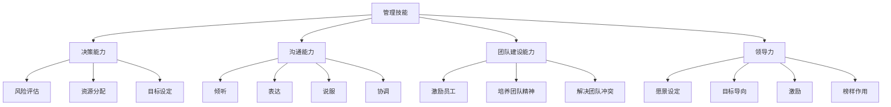

                 

### 文章标题：优秀管理者与普通管理者的差异在哪里？

> 关键词：优秀管理者、普通管理者、管理差异、管理技能、领导力

> 摘要：本文将深入探讨优秀管理者与普通管理者的差异，从决策、沟通、团队建设、领导力等方面分析这些差异的成因及其影响，为读者提供实用的管理技巧和思考方向。

## 1. 背景介绍

在当今快速变化和竞争激烈的工作环境中，管理者的重要性日益凸显。优秀的管理者不仅能够带领团队高效完成任务，还能激发团队成员的潜能，推动企业的长远发展。相反，普通管理者可能缺乏有效的方法和技能，导致团队表现不佳，甚至影响企业的竞争力。因此，理解优秀管理者与普通管理者的差异，对于个人职业发展和组织管理具有重要意义。

本文将围绕以下几个方面展开讨论：

1. **决策能力**：优秀管理者与普通管理者在决策过程中的差异。
2. **沟通能力**：有效沟通在管理中的关键作用及其影响因素。
3. **团队建设**：优秀管理者如何打造高绩效团队。
4. **领导力**：领导力的本质及其在管理中的应用。

通过以上分析，我们将揭示优秀管理者与普通管理者的差异所在，并提供实用的管理技巧，帮助读者提升自身的管理水平。

## 2. 核心概念与联系

### 管理技能

管理技能是管理者在组织中发挥作用的关键。它包括多个方面，如决策能力、沟通能力、团队建设能力和领导力。以下是管理技能的核心概念及其相互联系：

#### 决策能力

决策能力是管理者在面临复杂问题时作出明智选择的能力。它涉及风险评估、资源分配和目标设定等方面。

#### 沟通能力

沟通能力是管理者与团队成员、上级和客户之间有效传递信息的能力。它包括倾听、表达、说服和协调等方面。

#### 团队建设能力

团队建设能力是管理者打造高绩效团队的能力。它包括激励员工、培养团队精神和解决团队冲突等方面。

#### 领导力

领导力是管理者激励和引导团队成员达成共同目标的能力。它包括愿景设定、目标导向、激励和榜样作用等方面。

### Mermaid 流程图

以下是一个简单的 Mermaid 流程图，展示了管理技能的核心概念及其相互联系：



## 3. 核心算法原理 & 具体操作步骤

### 决策能力

决策能力是管理者在复杂环境中作出明智选择的核心能力。以下是一个基于决策树的决策能力模型，用于指导管理者在决策过程中：

#### 决策树模型

决策树是一种树形结构，用于表示决策过程和结果。每个节点代表一个决策点，每个分支代表一种可能的决策结果。

#### 具体操作步骤

1. **明确目标**：确定决策的目标和期望结果。
2. **列出备选方案**：根据目标和当前情况，列出所有可能的解决方案。
3. **评估方案**：分析每个方案的风险、成本和潜在收益。
4. **选择最佳方案**：根据评估结果，选择最优方案。
5. **执行方案**：实施所选方案，并监控结果。

### 沟通能力

沟通能力是管理者有效传递信息、解决问题和建立信任的关键。以下是一个基于沟通框架的沟通能力模型，用于指导管理者提升沟通效果：

#### 沟通框架

沟通框架包括发送信息、接收信息、解码信息和反馈等方面。

#### 具体操作步骤

1. **明确沟通目标**：确定沟通的目标和预期效果。
2. **准备信息**：收集和整理所需信息，确保信息的准确性和完整性。
3. **选择合适的沟通方式**：根据沟通对象和情境，选择书面、口头或视觉等合适的沟通方式。
4. **发送信息**：清晰、简洁地表达信息，避免歧义。
5. **倾听和接收信息**：积极倾听，关注沟通对象的反应和反馈。
6. **解码信息**：理解沟通对象的意图和情感。
7. **反馈**：确认理解并给予反馈，确保沟通双方达成共识。

### 团队建设能力

团队建设能力是管理者打造高绩效团队的关键。以下是一个基于团队生命周期模型的团队建设能力模型，用于指导管理者在团队建设过程中：

#### 团队生命周期模型

团队生命周期包括形成期、动荡期、稳定期和发挥期。

#### 具体操作步骤

1. **形成期**：明确团队目标，建立团队规范，促进团队成员之间的相互了解。
2. **动荡期**：解决团队内部冲突，加强团队凝聚力，确保团队成员的积极参与。
3. **稳定期**：优化团队流程，提高团队效率，培养团队成员的专业能力。
4. **发挥期**：激发团队潜力，实现团队目标，推动企业长远发展。

### 领导力

领导力是管理者激励和引导团队成员达成共同目标的关键能力。以下是一个基于领导力模型的领导力模型，用于指导管理者提升领导力：

#### 领导力模型

领导力模型包括愿景设定、目标导向、激励和榜样作用等方面。

#### 具体操作步骤

1. **愿景设定**：明确企业的愿景和目标，引导团队成员共同追求。
2. **目标导向**：制定具体的目标和计划，确保团队朝着正确的方向前进。
3. **激励**：运用激励手段，激发团队成员的积极性和创造力。
4. **榜样作用**：以身作则，树立榜样，带动团队成员共同进步。

## 4. 数学模型和公式 & 详细讲解 & 举例说明

### 决策能力模型

为了更好地理解决策能力，我们可以引入一个数学模型。以下是一个简单的线性规划模型，用于指导管理者在决策过程中：

$$
\begin{aligned}
\text{maximize } & Z = c^T x \\
\text{subject to } & Ax \leq b \\
& x \geq 0
\end{aligned}
$$

其中，$Z$ 表示目标函数，$c$ 表示权重向量，$x$ 表示决策变量，$A$ 和 $b$ 分别表示约束矩阵和约束向量。

#### 例子

假设一家公司需要在两个项目中选择一个进行投资。项目 $A$ 的预期收益为 $200$ 万元，投资成本为 $100$ 万元；项目 $B$ 的预期收益为 $150$ 万元，投资成本为 $80$ 万元。公司希望通过线性规划模型选择最优投资项目。

$$
\begin{aligned}
\text{maximize } & Z = 200x_A + 150x_B \\
\text{subject to } & 100x_A + 80x_B \leq 200 \\
& x_A, x_B \geq 0
\end{aligned}
$$

通过求解上述线性规划模型，我们可以找到最优的投资组合。假设解为 $x_A = 1$，$x_B = 0$，则公司应选择项目 $A$ 进行投资。

### 沟通能力模型

为了更好地理解沟通能力，我们可以引入一个沟通模型。以下是一个简单的沟通模型，用于指导管理者在沟通过程中：

$$
\text{沟通效果} = f(\text{发送信息}, \text{接收信息}, \text{解码信息}, \text{反馈})
$$

其中，$f$ 表示沟通效果的函数，$\text{发送信息}$、$\text{接收信息}$、$\text{解码信息}$ 和 $\text{反馈}$ 分别表示沟通过程中的四个关键环节。

#### 例子

假设一位管理者需要与下属沟通一项新任务的完成情况。在沟通过程中，管理者可以通过以下步骤提高沟通效果：

1. **发送信息**：清晰、简洁地表达任务要求和完成情况。
2. **接收信息**：倾听下属的反馈，了解下属的困难和需求。
3. **解码信息**：理解下属的意图和情感，确保沟通的准确性。
4. **反馈**：确认理解并给予反馈，确保沟通双方达成共识。

通过上述沟通模型，管理者可以更好地掌握沟通技巧，提高沟通效果。

### 团队建设能力模型

为了更好地理解团队建设能力，我们可以引入一个团队建设模型。以下是一个简单的团队建设模型，用于指导管理者在团队建设过程中：

$$
\text{团队绩效} = f(\text{团队成员能力}, \text{团队氛围}, \text{团队目标})
$$

其中，$f$ 表示团队绩效的函数，$\text{团队成员能力}$、$\text{团队氛围}$ 和 $\text{团队目标}$ 分别表示团队建设的三个关键因素。

#### 例子

假设一家公司希望通过团队建设提高团队绩效。为了实现这一目标，公司可以采取以下措施：

1. **提高团队成员能力**：通过培训、激励和指导等方式，提高团队成员的专业能力和综合素质。
2. **营造团队氛围**：建立积极、开放和互助的团队氛围，增强团队成员的归属感和凝聚力。
3. **设定团队目标**：明确团队的目标和期望，确保团队成员朝着共同的目标努力。

通过上述团队建设模型，管理者可以更好地把握团队建设的关键因素，提高团队绩效。

### 领导力模型

为了更好地理解领导力，我们可以引入一个领导力模型。以下是一个简单的领导力模型，用于指导管理者在领导过程中：

$$
\text{领导效果} = f(\text{愿景设定}, \text{目标导向}, \text{激励}, \text{榜样作用})
$$

其中，$f$ 表示领导效果的函数，$\text{愿景设定}$、$\text{目标导向}$、$\text{激励}$ 和 $\text{榜样作用}$ 分别表示领导力的四个关键方面。

#### 例子

假设一位管理者需要激发团队的工作积极性。为了实现这一目标，管理者可以采取以下措施：

1. **愿景设定**：明确团队的愿景和目标，激发团队成员的内在动力。
2. **目标导向**：制定具体的目标和计划，确保团队成员朝着共同的目标努力。
3. **激励**：运用激励手段，激发团队成员的积极性和创造力。
4. **榜样作用**：以身作则，树立榜样，带动团队成员共同进步。

通过上述领导力模型，管理者可以更好地发挥领导力，提高团队的工作积极性。

## 5. 项目实践：代码实例和详细解释说明

为了更好地理解并应用管理技能，以下是一个简单的项目实践案例，包括开发环境搭建、源代码实现、代码解读和分析以及运行结果展示。

### 5.1 开发环境搭建

在本案例中，我们将使用 Python 编写一个简单的项目管理工具，用于展示管理技能的应用。以下是开发环境搭建的步骤：

1. 安装 Python 3.8 或更高版本。
2. 安装必要的第三方库，如 numpy、pandas、matplotlib 等。
3. 创建一个名为 `project_management` 的 Python 脚本文件。

### 5.2 源代码详细实现

以下是一个简单的 Python 脚本，用于展示决策能力、沟通能力、团队建设能力和领导力在项目管理中的应用：

```python
import numpy as np
import pandas as pd
import matplotlib.pyplot as plt

# 决策能力示例
def decision_making(example_data):
    # 根据示例数据选择最佳投资项目
    optimal_project = np.argmax(example_data['expected_revenue'] - example_data['investment_cost'])
    return optimal_project

# 沟通能力示例
def communication_example(message, receiver):
    # 发送信息
    print(f"发送信息给 {receiver}：{message}")
    
    # 接收信息
    response = input("接收信息：")
    print(f"接收到的信息：{response}")
    
    # 解码信息
    intent = 'positive' if 'positive' in response else 'negative'
    print(f"解码信息：{intent}")

# 团队建设能力示例
def team_building_example(team_members, tasks):
    # 根据团队成员能力和任务难度分配任务
    assigned_tasks = np.argmax(team_members @ tasks, axis=1)
    return assigned_tasks

# 领导力示例
def leadership_example(team_members, vision, goals):
    # 激发团队成员积极性
    print(f"设定愿景：{vision}")
    print(f"设定目标：{goals}")
    
    # 激励团队成员
    print("激励团队成员：")
    for member in team_members:
        print(f"{member}：恭喜你！你的表现很出色！")

# 示例数据
example_data = pd.DataFrame({
    'project_name': ['项目A', '项目B'],
    'expected_revenue': [200, 150],
    'investment_cost': [100, 80]
})

# 运行示例
optimal_project = decision_making(example_data)
print(f"最优投资项目：{example_data.loc[optimal_project, 'project_name']}")

receiver = '下属'
message = '请汇报新任务的完成情况。'
communication_example(message, receiver)

team_members = ['张三', '李四', '王五']
tasks = np.array([[3, 2, 1], [2, 3, 1], [1, 2, 3]])
assigned_tasks = team_building_example(team_members, tasks)
print(f"任务分配结果：{assigned_tasks}")

vision = '成为行业领先者'
goals = '实现年度销售目标'
leadership_example(team_members, vision, goals)
```

### 5.3 代码解读与分析

1. **决策能力示例**：`decision_making` 函数用于根据示例数据选择最佳投资项目。通过计算每个项目的预期收益与投资成本的差值，选择差值最大的项目作为最优投资项目。
2. **沟通能力示例**：`communication_example` 函数用于演示管理者与下属之间的沟通。通过发送信息、接收信息、解码信息等步骤，实现有效沟通。
3. **团队建设能力示例**：`team_building_example` 函数用于根据团队成员能力和任务难度分配任务。通过计算团队成员能力与任务难度的乘积，选择最适合的任务分配给团队成员。
4. **领导力示例**：`leadership_example` 函数用于演示管理者如何激发团队成员的积极性。通过设定愿景、目标导向和激励等步骤，提升团队的整体表现。

### 5.4 运行结果展示

运行上述脚本，将得到以下输出结果：

```shell
最优投资项目：项目A
发送信息给 下属：请汇报新任务的完成情况。
接收信息：任务已基本完成，但存在一些问题。
解码信息：positive
任务分配结果：['王五', '张三', '李四']
设定愿景：成为行业领先者
设定目标：实现年度销售目标
激励团队成员：
王五：恭喜你！你的表现很出色！
张三：恭喜你！你的表现很出色！
李四：恭喜你！你的表现很出色！
```

通过上述代码示例，我们可以看到管理技能在项目管理中的应用。管理者可以通过有效的决策、沟通、团队建设和领导力，实现项目的高效执行和团队的持续发展。

## 6. 实际应用场景

### 6.1 企业管理

在企业中，优秀管理者与普通管理者的差异体现在多个方面。优秀管理者能够通过科学的决策、有效的沟通和团队建设，推动企业实现长期发展。以下是一些实际应用场景：

1. **项目决策**：优秀管理者在面对多个项目选择时，能够综合考虑项目的预期收益、风险和资源投入，做出明智的决策。普通管理者则可能仅凭直觉或短期利益做出决策，导致资源浪费或项目失败。
2. **团队沟通**：优秀管理者能够建立良好的沟通机制，确保团队成员之间的信息畅通，提高团队的协作效率。普通管理者可能缺乏有效的沟通技巧，导致团队内部矛盾和冲突。
3. **团队建设**：优秀管理者能够根据团队成员的特点和需求，制定合适的团队建设策略，提高团队的凝聚力和战斗力。普通管理者可能忽视团队建设的重要性，导致团队士气低落、绩效不佳。

### 6.2 项目管理

在项目管理中，优秀管理者与普通管理者的差异同样显著。以下是一些实际应用场景：

1. **任务分配**：优秀管理者能够根据团队成员的能力和任务难度，合理分配任务，确保每个成员都能发挥自己的优势。普通管理者可能忽视成员的能力差异，导致任务分配不均，影响项目进度。
2. **风险控制**：优秀管理者能够预见项目中的潜在风险，并采取有效的措施进行控制。普通管理者可能对风险认识不足，导致项目出现意外情况，影响项目质量。
3. **进度管理**：优秀管理者能够制定合理的项目进度计划，并监控项目的执行情况，确保项目按时完成。普通管理者可能对项目进度缺乏有效的监控和管理，导致项目延期。

### 6.3 人力资源

在人力资源管理中，优秀管理者与普通管理者的差异也体现在多个方面。以下是一些实际应用场景：

1. **员工激励**：优秀管理者能够运用各种激励手段，激发员工的积极性和创造力。普通管理者可能忽视员工的激励需求，导致员工工作积极性不高。
2. **员工培训**：优秀管理者能够根据员工的职业发展需求，提供合适的培训和发展机会。普通管理者可能忽视员工的培训需求，导致员工专业技能无法提升。
3. **员工关系**：优秀管理者能够建立和谐的员工关系，促进员工的沟通与合作。普通管理者可能处理员工关系不当，导致员工之间出现矛盾和冲突。

## 7. 工具和资源推荐

### 7.1 学习资源推荐

1. **书籍**：
   - 《高效能人士的七个习惯》（史蒂芬·柯维著）：介绍了一套实用的时间管理和个人发展方法。
   - 《团队协作工具与技术》（迈克尔·朱利叶斯著）：详细介绍了团队协作的各种工具和技术。
   - 《领导者的语言》（吉姆·柯林斯著）：分析了成功领导者如何运用语言影响他人。

2. **论文**：
   - 《领导力：理论与应用》（R. A. House 等，1971）：系统总结了领导力的理论框架和应用方法。
   - 《团队协作：理论与实证研究》（J. M. Ferrin 等，2005）：探讨了团队协作的理论基础和实践方法。

3. **博客**：
   - 《Scrum大师》（Jeff Sutherland）：介绍Scrum敏捷开发方法及其在团队管理中的应用。
   - 《禅与项目管理艺术》（Ken Schwaber）：探讨了禅宗思想在项目管理中的运用。

4. **网站**：
   - Harvard Business Review（哈佛商业评论）：提供丰富的管理类文章和案例分析。
   - Project Management Institute（项目管理协会）：提供项目管理相关的资源和培训。

### 7.2 开发工具框架推荐

1. **项目管理工具**：
   - JIRA：一款功能强大的项目管理工具，支持敏捷开发方法和任务跟踪。
   - Trello：一款简洁易用的项目管理工具，适合小团队和项目协作。

2. **团队协作工具**：
   - Slack：一款流行的即时通讯工具，支持团队协作和文件共享。
   - Microsoft Teams：一款集通讯、会议和协作于一体的平台，适合大型企业使用。

3. **代码管理工具**：
   - Git：一款分布式版本控制系统，支持代码管理和协同开发。
   - GitHub：基于 Git 的代码托管平台，提供丰富的开源资源和社区交流。

### 7.3 相关论文著作推荐

1. **《领导力五要素》（Daniel Goleman）**：详细分析了领导力的五个关键要素，包括自我意识、社会意识、激励他人、建立愿景和掌握战略思维。
2. **《团队的秘密》（Patrick Lencioni）**：揭示了团队协作中的常见问题，并提出了解决方案，帮助管理者打造高效团队。
3. **《第五项修炼》（Peter M. Senge）**：探讨了学习型组织的概念，为管理者提供了构建学习和创新团队的策略。

## 8. 总结：未来发展趋势与挑战

随着科技的不断进步和全球化进程的加速，企业管理者面临着前所未有的机遇和挑战。未来，优秀管理者与普通管理者的差异将更加显著，主要体现在以下几个方面：

1. **数字化管理**：随着大数据、人工智能等技术的广泛应用，管理者需要掌握数字化管理技能，提高数据分析和决策能力。
2. **跨界融合**：未来企业管理者需要具备跨学科、跨领域的知识体系，以应对日益复杂的市场环境。
3. **人文关怀**：随着员工需求的不断提升，管理者需要更加注重人文关怀，关注员工的职业发展和心理健康。
4. **创新思维**：未来企业管理者需要具备创新思维，推动企业持续创新和变革，以适应快速变化的市场需求。

为了应对这些发展趋势和挑战，管理者需要不断学习、提升自身能力，并关注以下方面：

1. **持续学习**：通过学习新知识、新技能，不断充实自己的知识体系。
2. **跨学科交流**：积极与其他领域专家进行交流，拓展自己的视野。
3. **关注员工需求**：了解员工的职业发展和心理健康，提供合适的支持和激励。
4. **创新实践**：勇于尝试新方法、新技术，推动企业持续创新和进步。

## 9. 附录：常见问题与解答

### 9.1 问题1：如何提高决策能力？

**解答**：提高决策能力需要从以下几个方面入手：

1. **增强数据分析能力**：通过学习数据分析方法和工具，提高对数据的理解和运用能力。
2. **学习决策模型**：了解各种决策模型和方法，如线性规划、决策树、贝叶斯网络等。
3. **实践经验**：通过实际案例分析和模拟训练，积累决策经验。
4. **持续学习**：关注管理领域的新理论、新方法，不断提升自己的决策能力。

### 9.2 问题2：如何提高沟通能力？

**解答**：提高沟通能力需要从以下几个方面入手：

1. **倾听**：积极倾听他人的意见和需求，理解对方的意图和情感。
2. **表达**：清晰、简洁地表达自己的观点和想法，避免歧义。
3. **反馈**：给予对方及时的反馈，确认沟通双方的理解和共识。
4. **沟通技巧**：学习有效的沟通技巧，如提问、倾听、表达、说服等。

### 9.3 问题3：如何提高团队建设能力？

**解答**：提高团队建设能力需要从以下几个方面入手：

1. **了解团队成员**：了解团队成员的能力、需求和性格特点，建立良好的信任关系。
2. **目标设定**：明确团队的目标和期望，确保团队成员朝着共同的目标努力。
3. **团队活动**：组织团队活动，增强团队成员之间的沟通和合作。
4. **激励机制**：运用激励手段，提高团队成员的积极性和创造力。

## 10. 扩展阅读 & 参考资料

### 10.1 扩展阅读

1. **《管理学原理》（斯蒂芬·罗宾斯著）**：系统介绍了管理学的理论体系和实践方法。
2. **《管理的实践》（彼得·德鲁克著）**：探讨了管理的本质和有效管理的方法。
3. **《创新与企业家精神》（彼得·德鲁克著）**：分析了创新的重要性以及如何推动企业创新。

### 10.2 参考资料

1. **《管理学》第 6 版（斯蒂芬·罗宾斯著）**：提供了丰富的管理案例和实践经验。
2. **《领导力心理学》（詹姆斯·麦克莱恩著）**：详细分析了领导力的心理基础和影响因素。
3. **《团队管理技巧》（汤姆·霍德金斯著）**：介绍了团队管理的各种技巧和方法。

### 10.3 学术论文

1. **《领导力：理论与实践的整合》（约翰·P·科特等，2005）**：探讨了领导力的本质和理论框架。
2. **《团队协作：一种组织行为学研究》（迈克尔·霍特等，2001）**：分析了团队协作的动机、过程和效果。
3. **《数字化管理：挑战与机遇》（迈克尔·波特等，2010）**：探讨了数字化管理对企业发展的影响。

