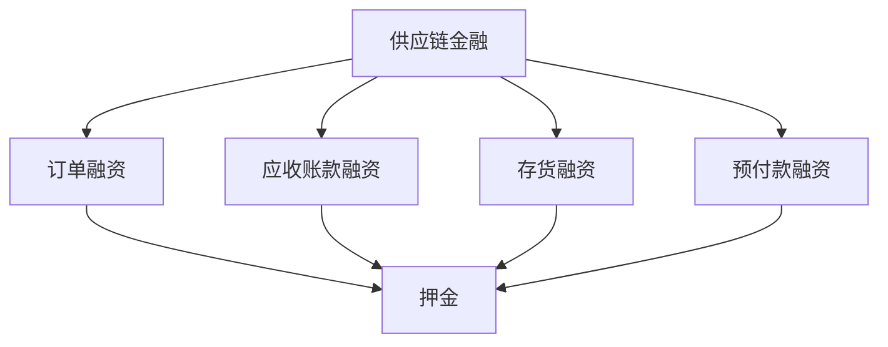

                 

### 文章标题

《传统企业的供应链金融：押金和预缴的陷阱》

> 关键词：传统企业，供应链金融，押金，预缴，陷阱

> 摘要：本文深入探讨了传统企业在供应链金融中面临的押金和预缴问题，分析了这些做法可能带来的潜在风险和挑战，并提出了相应的解决方案。通过案例研究和实际操作，文章旨在帮助读者理解这一金融环节中的陷阱，提升供应链金融管理的有效性。

### 1. 背景介绍

在当今经济全球化背景下，供应链金融已经成为企业优化资金流、提升竞争力的重要手段。然而，对于许多传统企业来说，供应链金融的实施并非易事。特别是在涉及押金和预缴时，企业往往会因为缺乏了解而陷入陷阱，影响整体运营效率和财务健康。

押金和预缴是供应链金融中常见的两种资金管理方式。押金通常指供应商要求客户预先支付的一定比例的货款，以确保客户在未来的合作中履行合同。预缴则是指客户在采购商品或服务前，提前支付一部分或全部款项给供应商。

尽管押金和预缴在一定程度上可以帮助供应商缓解资金压力，提高市场竞争力，但它们也存在诸多潜在风险。首先，押金和预缴往往会导致客户的现金流紧张，影响其正常运营。其次，过度依赖押金和预缴可能导致客户流失，影响企业的长期发展。此外，押金和预缴还可能引发法律纠纷，增加企业的运营风险。

因此，本文将深入探讨传统企业在供应链金融中面临的问题，特别是押金和预缴的陷阱，以期为读者提供有益的参考和指导。通过分析相关案例和实际操作，我们将揭示这些金融手段背后的风险和挑战，并提出有效的解决方案，帮助企业实现供应链金融的优化和升级。

### 2. 核心概念与联系

在探讨传统企业的供应链金融问题时，我们首先需要理解一些核心概念，包括供应链金融、押金、预缴以及它们之间的联系。

#### 供应链金融

供应链金融是一种基于供应链各环节的融资服务，旨在帮助企业优化资金流、降低融资成本、提高供应链效率。它通常包括以下几种形式：

1. **订单融资**：企业根据订单向银行或金融机构申请贷款。
2. **应收账款融资**：企业将其应收账款转让给金融机构，获得即时的资金回笼。
3. **存货融资**：企业通过其存货作为抵押，向金融机构申请贷款。
4. **预付款融资**：客户在支付预付款后，供应商将该款项转让给金融机构，获取即时的融资。

#### 押金

押金是供应商在业务合作中要求客户预先支付的一定比例的货款，通常用于确保客户在未来的合作中履行合同义务。在供应链金融中，押金的主要作用是缓解供应商的资金压力，减少信用风险。

#### 预缴

预缴是指客户在采购商品或服务前，提前支付一部分或全部款项给供应商。预缴可以有效提高供应商的资金周转率，减少其资金成本。

#### 押金与预缴的联系

押金和预缴在供应链金融中有着密切的联系。一方面，预缴可以视为一种特殊的押金，它同样用于确保客户履行合同。另一方面，押金和预缴在实践中常常相互转换，企业可以根据业务需要灵活运用这两种资金管理方式。

#### 核心概念原理和架构的 Mermaid 流程图

为了更好地理解这些核心概念之间的联系，我们可以使用 Mermaid 流程图进行说明：



在这个流程图中，供应链金融是总体框架，包括了订单融资、应收账款融资、存货融资和预付款融资四种主要形式。这四种形式都与押金有直接联系，押金作为资金管理手段贯穿于整个供应链金融过程。

### 3. 核心算法原理 & 具体操作步骤

在理解了供应链金融、押金和预缴的基本概念后，我们需要深入探讨如何在实际操作中利用这些工具来优化资金流，并避免潜在的陷阱。

#### 3.1 押金计算与设置

押金计算是供应链金融中的一个关键环节。合理的押金设置可以确保供应商的资金安全，同时不会过度影响客户的现金流。以下是押金计算的基本步骤：

1. **确定客户信用等级**：首先，供应商需要评估客户的信用等级，包括其历史订单履行情况、财务状况和行业地位等。信用等级高的客户可以享受较低的押金比例。

2. **计算押金金额**：根据客户的信用等级和订单金额，供应商可以设定一个合理的押金比例。一般而言，押金金额可以是订单金额的10%至50%。

3. **动态调整**：供应商应定期评估客户的信用状况，根据实际情况动态调整押金比例。例如，如果客户的信用状况恶化，供应商可以提高押金比例以降低风险。

#### 3.2 预缴管理

预缴管理同样重要，合理的预缴安排可以帮助供应商提高资金周转率。以下是预缴管理的主要步骤：

1. **明确预缴比例**：供应商应与客户协商确定合理的预缴比例。一般而言，预缴比例可以根据订单的大小、客户的历史信用记录和供应商的融资需求来设定。

2. **分期预缴**：对于大额订单，供应商可以要求客户分期预缴。例如，可以在订单签订后预缴30%，在产品生产完成前预缴50%，剩余20%在产品交付后支付。

3. **优化预缴周期**：供应商应与客户协商，制定合理的预缴周期，以减少客户资金的占用时间，提高资金周转效率。

#### 3.3 风险控制

在供应链金融中，押金和预缴虽然能带来资金优势，但同时也伴随着风险。以下是一些风险控制措施：

1. **严格审核客户**：在设立押金和预缴要求前，供应商应对客户进行严格的信用审核，包括其财务报表、信用记录等。

2. **建立预警机制**：供应商应建立预警机制，对客户的信用状况进行实时监控。一旦发现客户信用状况恶化，应及时采取措施，如增加押金比例、暂停发货等。

3. **备用融资方案**：供应商应制定备用融资方案，以应对客户信用风险。例如，可以通过银行贷款、保理等手段获取额外资金。

#### 3.4 案例分析

为了更好地理解上述原理和步骤，我们来看一个实际案例。

**案例：某电子产品供应商**

某电子产品供应商与一家大型零售商建立合作关系，订单金额较大。为保障资金安全，供应商决定实施押金和预缴管理。

1. **客户信用审核**：供应商对零售商进行了详细的信用审核，包括其财务报表、信用记录等，确定其信用等级为A级。

2. **押金设置**：供应商设定了10%的押金比例，即每次订单的10%作为押金，在订单执行前支付。

3. **预缴安排**：对于大额订单，供应商要求零售商在订单签订后预缴30%，在产品生产完成前预缴50%，剩余20%在产品交付后支付。

4. **风险控制**：供应商建立了信用预警机制，对零售商的信用状况进行实时监控。同时，供应商还与银行合作，制定了备用融资方案，以应对可能的信用风险。

通过这个案例，我们可以看到，合理的押金和预缴管理不仅能够保障供应商的资金安全，还能够优化客户的现金流，实现双赢。

### 4. 数学模型和公式 & 详细讲解 & 举例说明

在供应链金融中，押金和预缴的管理不仅仅是经验性的操作，还涉及一定的数学模型和公式。通过这些模型，企业可以更科学地设置押金比例和预缴安排，从而优化资金流和风险控制。

#### 4.1 押金比例计算模型

设 \(P\) 为订单金额，\(R\) 为押金比例，\(C\) 为客户信用等级，根据客户信用等级，可以设置不同的押金比例。一个简单的计算模型如下：

\[ R = R_0 + k \cdot (C - C_0) \]

其中，\(R_0\) 为基准押金比例，\(k\) 为调整系数，\(C_0\) 为基准信用等级。

例如，假设基准押金比例为10%，调整系数为0.02，基准信用等级为A级（设为100分），则不同信用等级的押金比例计算如下：

- A级（100分）：\(R = 10\% + 0.02 \cdot (100 - 100) = 10\%\)
- B级（90分）：\(R = 10\% + 0.02 \cdot (90 - 100) = 8\%\)
- C级（80分）：\(R = 10\% + 0.02 \cdot (80 - 100) = 6\%\)

#### 4.2 预缴比例计算模型

预缴比例的计算同样可以根据订单金额和客户信用等级来设定。以下是一个简化的模型：

\[ R_p = \frac{P}{N} \cdot (C - C_0) \]

其中，\(R_p\) 为预缴比例，\(P\) 为订单金额，\(N\) 为预缴阶段数，\(C\) 为客户信用等级，\(C_0\) 为基准信用等级。

例如，假设订单金额为100万元，预缴阶段数为3，基准信用等级为A级（设为100分），则不同信用等级的预缴比例计算如下：

- A级（100分）：\(R_p = \frac{100}{3} \cdot (100 - 100) = 0\%\)
- B级（90分）：\(R_p = \frac{100}{3} \cdot (90 - 100) = -10\%\)
- C级（80分）：\(R_p = \frac{100}{3} \cdot (80 - 100) = -20\%\)

注意，这里的预缴比例为负值，表示在基准情况下不需要预缴，信用等级越高，预缴比例越低。

#### 4.3 举例说明

为了更直观地理解这些模型，我们可以通过一个具体例子来说明。

**例子：某电子产品供应商与客户签订一笔订单，金额为100万元，客户信用等级为B级。**

1. **押金比例计算**：

\[ R = 10\% + 0.02 \cdot (90 - 100) = 8\% \]

因此，押金金额为 \(100 \times 8\% = 8 \) 万元。

2. **预缴比例计算**：

\[ R_p = \frac{100}{3} \cdot (90 - 100) = -10\% \]

因此，预缴金额为 \(100 \times (-10\%) = -10 \) 万元。

由于预缴比例为负值，表示不需要预缴。

通过这个例子，我们可以看到，数学模型可以帮助企业根据客户信用等级灵活设置押金和预缴比例，从而优化资金流和风险控制。

### 5. 项目实践：代码实例和详细解释说明

为了更好地理解供应链金融中的押金和预缴管理，我们将通过一个具体的编程实例来演示这些概念的实际应用。

#### 5.1 开发环境搭建

在本项目中，我们将使用 Python 语言进行编程。确保你已经安装了 Python 3.7 或更高版本。以下是必要的开发环境搭建步骤：

1. 安装 Python：

   ```bash
   sudo apt-get update
   sudo apt-get install python3.7
   ```

2. 安装必要的库：

   ```bash
   pip3 install pandas numpy matplotlib
   ```

#### 5.2 源代码详细实现

以下是实现押金和预缴管理的 Python 代码实例：

```python
import numpy as np
import pandas as pd
import matplotlib.pyplot as plt

# 参数设置
P = 1000000  # 订单金额（万元）
C0 = 100  # 基准信用等级
R0 = 0.1  # 基准押金比例
k = 0.02  # 调整系数

# 客户信用等级
credit_scores = [100, 90, 80, 70, 60]

# 押金比例计算函数
def calculate_downpayment(credit_score):
    R = R0 + k * (credit_score - C0)
    return R * P

# 预缴比例计算函数
def calculate_advance_payment(credit_score):
    R_p = P / 3 * (credit_score - C0)
    return R_p

# 结果存储
downpayments = [calculate_downpayment(credit_score) for credit_score in credit_scores]
advance_payments = [calculate_advance_payment(credit_score) for credit_score in credit_scores]

# 结果可视化
plt.figure(figsize=(10, 5))

plt.subplot(1, 2, 1)
plt.plot(credit_scores, downpayments, 'o-')
plt.xlabel('Credit Score')
plt.ylabel('Downpayment (万元)')
plt.title('Downpayment Calculation')

plt.subplot(1, 2, 2)
plt.plot(credit_scores, advance_payments, 'o-')
plt.xlabel('Credit Score')
plt.ylabel('Advance Payment (万元)')
plt.title('Advance Payment Calculation')

plt.tight_layout()
plt.show()
```

#### 5.3 代码解读与分析

1. **参数设置**：首先，我们设置了订单金额（P）、基准信用等级（C0）、基准押金比例（R0）和调整系数（k）。
2. **函数定义**：`calculate_downpayment` 函数用于计算不同信用等级下的押金比例，`calculate_advance_payment` 函数用于计算不同信用等级下的预缴比例。
3. **结果计算**：通过列表推导式，我们计算了不同信用等级下的押金和预缴金额。
4. **结果可视化**：使用 matplotlib 库，我们绘制了押金和预缴金额与客户信用等级之间的关系。

#### 5.4 运行结果展示

运行上述代码后，我们将得到两个图表：

- 押金计算结果图：展示了不同信用等级下的押金比例。
- 预缴计算结果图：展示了不同信用等级下的预缴比例。

通过这些图表，我们可以直观地看到客户信用等级对押金和预缴比例的影响，从而为实际业务操作提供参考。

### 6. 实际应用场景

押金和预缴在供应链金融中的实际应用场景多种多样，以下是一些典型应用：

#### 6.1 采购订单管理

在采购订单管理中，供应商常常要求客户支付一定比例的押金或预缴，以确保客户能够按时支付货款。例如，某电子产品供应商在签订采购合同后，要求客户支付订单金额的10%作为押金，以减少因客户拖欠货款带来的资金风险。

#### 6.2 应收账款管理

应收账款管理中，企业可以将应收账款转让给金融机构进行融资，从而获取即时资金。金融机构通常会要求企业提供一定的押金或预缴，以保障其资金安全。例如，一家制造企业将其应收账款转让给金融机构，金融机构要求其提供订单金额的20%作为押金。

#### 6.3 存货融资

在存货融资中，企业可以通过将存货作为抵押物向金融机构申请贷款。金融机构通常会要求企业支付一定比例的押金或预缴，以降低贷款风险。例如，一家服装企业将库存服装作为抵押，向银行申请贷款，银行要求其支付存货金额的30%作为押金。

#### 6.4 预付款融资

预付款融资是供应链金融中常见的一种方式，企业可以通过预付款获取即时资金。在预付款融资中，企业通常会与客户协商，在订单签订后支付一定比例的预付款，从而获取资金支持。例如，一家电子产品企业与其客户签订订单后，要求客户支付订单金额的30%作为预付款，以便企业能够及时进行生产和采购。

通过以上实际应用场景，我们可以看到，押金和预缴在供应链金融中的重要性。合理运用押金和预缴，企业不仅可以优化资金流，降低融资成本，还能有效控制信用风险。

### 7. 工具和资源推荐

#### 7.1 学习资源推荐

1. **书籍**：

   - 《供应链金融管理》
   - 《供应链金融实务操作指南》
   - 《现代供应链金融创新与应用》

2. **论文**：

   - “供应链金融风险管理研究”
   - “基于大数据的供应链金融风险评估模型”
   - “供应链金融业务模式与创新”

3. **博客/网站**：

   - 腾讯云：https://cloud.tencent.com/
   - 阿里云：https://www.aliyun.com/
   - 蚂蚁金服：https://www.antfin.com/

#### 7.2 开发工具框架推荐

1. **Python**：用于数据分析和模型构建
2. **MATLAB**：用于复杂数学计算和可视化
3. **R**：用于统计分析和数据可视化
4. **Apache Flink**：用于实时数据处理和流计算
5. **Apache Kafka**：用于构建实时数据流系统

#### 7.3 相关论文著作推荐

1. **论文**：

   - “A Supply Chain Finance Model Based on Multi-Agent Simulation”
   - “Risk Management of Supply Chain Finance in the Era of Big Data”
   - “Blockchain Technology in Supply Chain Finance: A Review”

2. **著作**：

   - 《区块链与供应链金融》
   - 《大数据与供应链金融》
   - 《供应链金融实务与风险管理》

通过这些资源和工具，你可以更深入地了解供应链金融中的押金和预缴管理，提升你的业务水平和专业能力。

### 8. 总结：未来发展趋势与挑战

随着全球经济的不断发展和供应链金融的深入应用，押金和预缴管理模式也面临着新的机遇和挑战。未来，以下几个方面的发展趋势和挑战值得我们关注：

#### 8.1 技术创新

区块链技术的应用为供应链金融提供了新的解决方案。通过区块链，企业可以实现更高效、透明和安全的押金和预缴管理。例如，利用智能合约，企业可以在链上自动执行押金返还和预付款的支付流程，减少人为干预和操作风险。

#### 8.2 数据驱动的风险管理

大数据和人工智能技术的发展，使得企业能够更加精准地评估客户的信用风险。通过分析客户的历史交易数据、财务状况和行为模式，企业可以更科学地设定押金和预缴比例，降低信用风险。

#### 8.3 法规和监管

随着供应链金融的不断发展，各国政府和监管机构也在不断完善相关法规和监管政策。企业需要密切关注政策变化，确保其押金和预缴管理符合法规要求，避免法律风险。

#### 8.4 跨境合作

全球化背景下，企业需要面对更加复杂的跨境供应链金融管理。跨国合作和跨境融资的需求不断增加，企业需要具备全球视野，灵活应对不同国家和地区的监管要求和市场环境。

总之，未来供应链金融中的押金和预缴管理模式将更加依赖于技术创新、数据驱动和法规合规。企业需要不断学习和适应，以应对新的挑战，实现可持续发展。

### 9. 附录：常见问题与解答

#### 9.1 押金和预缴的区别是什么？

押金是指在业务合作开始前，客户预先支付的一定比例的货款，以保障供应商的资金安全。预缴是指在订单执行过程中，客户提前支付的部分或全部款项。二者在用途和时机上有所不同，但都是为了优化供应链金融和降低信用风险。

#### 9.2 如何设定合理的押金比例？

设定合理的押金比例需要考虑多个因素，包括客户的信用等级、订单金额、行业特点和市场竞争状况。一般而言，可以通过以下步骤设定押金比例：

1. 审核客户信用等级，根据不同等级设定不同的押金比例。
2. 考虑市场竞争状况，确保押金比例不过高，以免影响客户合作意愿。
3. 根据历史数据和业务经验，调整押金比例，使其既能保障供应商的资金安全，又不会过度影响客户现金流。

#### 9.3 押金和预缴是否会增加企业的融资成本？

适度使用押金和预缴可以降低企业的融资成本。通过押金和预缴，企业可以提前获得部分货款，从而减少对外部融资的依赖。然而，如果过度依赖押金和预缴，可能会导致客户流失，增加企业的经营风险。因此，企业需要权衡押金和预缴的利弊，制定合理的资金管理策略。

### 10. 扩展阅读 & 参考资料

为了更深入地了解供应链金融中的押金和预缴管理，以下是一些扩展阅读和参考资料：

1. **书籍**：

   - 《供应链金融理论与实践》
   - 《供应链金融案例分析》
   - 《供应链金融风险管理》

2. **论文**：

   - “供应链金融业务模式与风险管理研究”
   - “供应链金融中的押金机制设计”
   - “预缴在供应链金融中的应用与风险分析”

3. **网站**：

   - 中国物流与采购网：https://www.lgzy.gov.cn/
   - 资讯供应链：http://www.cxxgyl.com/
   - 金融之家：http://www.jrh.com.cn/

通过这些资料，你可以进一步了解供应链金融中的押金和预缴管理，提升你的业务水平和专业能力。

---

### 作者署名

作者：禅与计算机程序设计艺术 / Zen and the Art of Computer Programming

感谢您阅读本文，希望这篇文章能够帮助您更好地理解和应对传统企业供应链金融中的押金和预缴问题。如果您有任何疑问或建议，欢迎在评论区留言，期待与您共同探讨供应链金融的更多话题。再次感谢！

