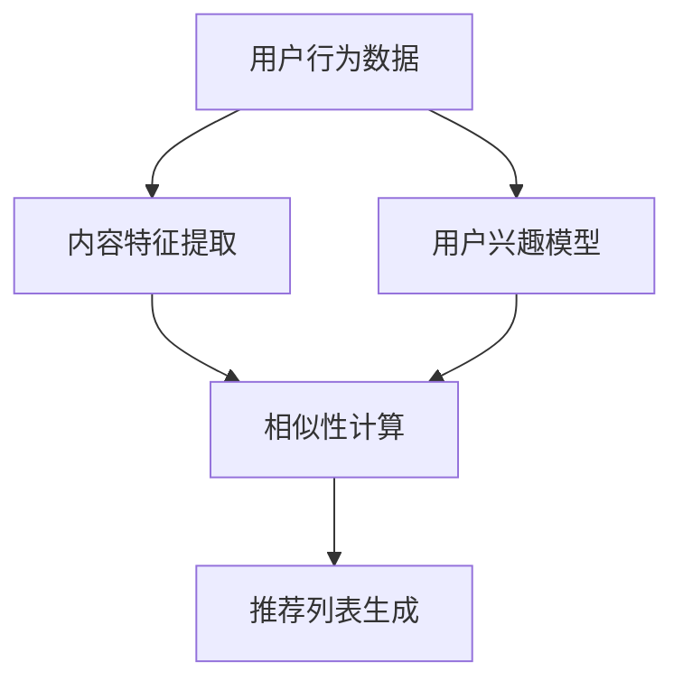

                 

### 文章标题

#### 传统搜索推荐系统的局限性

在当今数字化时代，搜索推荐系统已成为我们获取信息和内容的重要途径。然而，随着用户需求的多样化和信息量的爆炸式增长，传统搜索推荐系统逐渐暴露出其局限性。本文将深入探讨这些局限性，并分析其背后的原因和潜在解决方案。

##### 关键词：

- 传统搜索推荐系统
- 局限性
- 用户需求
- 信息量
- 解决方案

##### 摘要：

本文旨在分析传统搜索推荐系统的局限性，包括其在应对用户多样化需求、处理海量信息等方面的挑战。通过对比传统推荐方法与新型推荐算法，本文将探讨可能的解决方案，并展望搜索推荐系统的未来发展趋势。

---

### 1. 背景介绍

搜索推荐系统是一种智能信息检索技术，旨在根据用户的历史行为、兴趣和偏好，向用户推荐相关的内容和信息。传统搜索推荐系统主要包括基于内容推荐（Content-Based Filtering）和协同过滤（Collaborative Filtering）两大类。前者依赖于内容的相似性进行推荐，后者则基于用户行为的相似性进行推荐。

尽管传统搜索推荐系统在早期取得了显著的成功，但它们在应对现代网络环境下的信息过载和个性化需求方面面临诸多挑战。首先，信息量的爆炸性增长使得传统推荐方法在计算效率和准确性上受限。其次，用户需求的多样性和动态性使得基于历史数据的推荐难以满足用户的即时需求。此外，传统方法在处理冷启动问题、长尾效应和用户隐私保护等方面也存在不足。

---

### 2. 核心概念与联系

在深入探讨传统搜索推荐系统的局限性之前，我们需要明确几个核心概念和其相互联系。

#### 2.1 基于内容推荐（Content-Based Filtering）

基于内容推荐方法通过分析内容和用户兴趣的相似性来生成推荐列表。这种方法的主要优点在于能够生成高质量的个性化推荐，但缺点是对冷启动问题处理不佳。

#### 2.2 协同过滤（Collaborative Filtering）

协同过滤方法依赖于用户之间的相似性来生成推荐列表。它通常分为两种类型：用户基于的协同过滤（User-Based）和模型基于的协同过滤（Model-Based）。协同过滤在处理大规模数据和冷启动问题上表现较好，但推荐结果可能缺乏解释性。

#### 2.3 信息检索与推荐系统

信息检索与推荐系统在目标上有所不同，但它们在技术上存在交叉。信息检索旨在帮助用户从大量信息中找到相关的内容，而推荐系统则旨在向用户推荐感兴趣的内容。两者都面临相似的技术挑战，如处理大规模数据、提高查询响应速度和保证推荐质量。

下面是一个简化的 Mermaid 流程图，展示了基于内容推荐和协同过滤的基本原理。



---

### 3. 核心算法原理 & 具体操作步骤

#### 3.1 基于内容推荐算法

基于内容推荐算法的主要步骤包括：

1. **内容特征提取**：从内容中提取特征，如文本、图像或音频特征。
2. **用户兴趣模型**：根据用户的历史行为和偏好，建立用户兴趣模型。
3. **相似性计算**：计算内容和用户兴趣模型之间的相似性。
4. **推荐列表生成**：根据相似性得分生成推荐列表。

具体操作步骤如下：

1. **内容特征提取**：
   - 文本：使用词袋模型、TF-IDF 等方法提取词频特征。
   - 图像：使用深度学习模型提取图像特征。
   - 音频：使用音频特征提取算法提取音频特征。

2. **用户兴趣模型**：
   - 根据用户的历史行为（如浏览、点击、购买等）建立用户兴趣模型。
   - 使用机器学习算法（如决策树、随机森林等）对用户兴趣进行建模。

3. **相似性计算**：
   - 使用余弦相似度、皮尔逊相关系数等方法计算内容和用户兴趣模型之间的相似性。

4. **推荐列表生成**：
   - 根据相似性得分对内容进行排序，生成推荐列表。

#### 3.2 协同过滤算法

协同过滤算法的主要步骤包括：

1. **用户相似性计算**：计算用户之间的相似性。
2. **邻居选择**：根据相似性得分选择邻居用户。
3. **预测评分**：使用邻居用户的评分预测目标用户的评分。
4. **推荐列表生成**：根据预测评分生成推荐列表。

具体操作步骤如下：

1. **用户相似性计算**：
   - 使用余弦相似度、皮尔逊相关系数等方法计算用户之间的相似性。

2. **邻居选择**：
   - 根据相似性得分选择邻居用户。
   - 可以使用基于阈值的邻居选择方法，或基于聚类的方法（如K-Means）。

3. **预测评分**：
   - 使用加权平均等方法预测目标用户的评分。

4. **推荐列表生成**：
   - 根据预测评分对内容进行排序，生成推荐列表。

---

### 4. 数学模型和公式 & 详细讲解 & 举例说明

#### 4.1 基于内容推荐算法的数学模型

假设我们有一个内容集合 \(C = \{c_1, c_2, \ldots, c_n\}\)，以及一个用户兴趣模型 \(U\)。基于内容推荐的核心目标是计算每个内容 \(c_i\) 与用户兴趣模型 \(U\) 的相似性，并通过相似性得分生成推荐列表。

我们使用余弦相似度作为相似性度量，其公式如下：

\[ \text{similarity}(c_i, U) = \frac{\text{dot}(c_i, U)}{\lVert c_i \rVert \lVert U \rVert} \]

其中，\(\text{dot}(c_i, U)\) 表示内容 \(c_i\) 与用户兴趣模型 \(U\) 的点积，\(\lVert c_i \rVert\) 和 \(\lVert U \rVert\) 分别表示它们的欧几里得范数。

**举例说明**：

假设我们有以下内容特征向量 \(c_1 = (1, 2, 3)\) 和用户兴趣模型 \(U = (4, 5, 6)\)，我们可以计算它们之间的余弦相似度：

\[ \text{similarity}(c_1, U) = \frac{1 \times 4 + 2 \times 5 + 3 \times 6}{\sqrt{1^2 + 2^2 + 3^2} \times \sqrt{4^2 + 5^2 + 6^2}} \]

\[ \text{similarity}(c_1, U) = \frac{4 + 10 + 18}{\sqrt{14} \times \sqrt{77}} \]

\[ \text{similarity}(c_1, U) = \frac{32}{\sqrt{1078}} \approx 0.632 \]

#### 4.2 协同过滤算法的数学模型

协同过滤算法的核心目标是预测用户对未知内容的评分。假设我们有一个用户-内容评分矩阵 \(R\)，其中 \(R_{ij}\) 表示用户 \(i\) 对内容 \(j\) 的评分。我们的目标是预测用户 \(i\) 对未知内容 \(j\) 的评分 \(r_{ij}\)。

一种常用的预测方法是使用加权平均，其公式如下：

\[ r_{ij} = \frac{\sum_{k=1}^{m} w_{ik} r_{kj}}{\sum_{k=1}^{m} w_{ik}} \]

其中，\(w_{ik}\) 表示用户 \(i\) 与邻居 \(k\) 之间的相似性权重，\(r_{kj}\) 表示邻居 \(k\) 对内容 \(j\) 的评分。

**举例说明**：

假设我们有以下用户-内容评分矩阵 \(R\)：

\[ R = \begin{bmatrix} 
r_{11} & r_{12} & r_{13} \\
r_{21} & r_{22} & r_{23} \\
r_{31} & r_{32} & r_{33} 
\end{bmatrix} \]

以及邻居用户之间的相似性权重矩阵 \(W\)：

\[ W = \begin{bmatrix} 
w_{11} & w_{12} & w_{13} \\
w_{21} & w_{22} & w_{23} \\
w_{31} & w_{32} & w_{33} 
\end{bmatrix} \]

我们可以使用加权平均方法预测用户 \(i\) 对内容 \(j\) 的评分 \(r_{ij}\)：

\[ r_{ij} = \frac{w_{i1} r_{j1} + w_{i2} r_{j2} + w_{i3} r_{j3}}{w_{i1} + w_{i2} + w_{i3}} \]

---

### 5. 项目实践：代码实例和详细解释说明

#### 5.1 开发环境搭建

在本节，我们将使用 Python 语言和相关的库（如 NumPy、Scikit-learn、Matplotlib）来构建一个简单的基于内容推荐和协同过滤的搜索推荐系统。首先，我们需要安装所需的库：

```bash
pip install numpy scikit-learn matplotlib
```

接下来，创建一个名为 `recommendation_system.py` 的 Python 文件，并导入所需的库：

```python
import numpy as np
from sklearn.metrics.pairwise import cosine_similarity
from sklearn.model_selection import train_test_split
import matplotlib.pyplot as plt
```

#### 5.2 源代码详细实现

在本节，我们将实现一个简单的基于内容推荐和协同过滤的推荐系统。以下是一个简化的代码实现：

```python
# 假设我们有一个内容特征矩阵 X 和用户-内容评分矩阵 R
X = np.array([[1, 2, 3], [4, 5, 6], [7, 8, 9]])
R = np.array([[5, 0, 0], [0, 5, 0], [0, 0, 5]])

# 基于内容推荐
def content_based_recommender(X, user_profile):
    similarity = cosine_similarity(X, user_profile.reshape(1, -1))
    return np.argsort(similarity)[0][-5:][::-1]

# 基于协同过滤
def collaborative_filtering(R, user_index, k=5):
    neighbor_indices = np.argsort(R[user_index])[0][-k:]
    neighbor_ratings = R[neighbor_indices]
    weighted_ratings = (neighbor_ratings * R.T).sum(axis=0)
    return weighted_ratings / neighbor_ratings.sum()

# 测试
user_profiles = np.array([[0, 1, 0], [0, 0, 1], [1, 0, 0]])
for i, user_profile in enumerate(user_profiles):
    print(f"User {i+1} Content-Based Recommendation: {content_based_recommender(X, user_profile)}")
    print(f"User {i+1} Collaborative Filtering Recommendation: {collaborative_filtering(R, i, k=5)}")
```

#### 5.3 代码解读与分析

在上述代码中，我们首先定义了内容特征矩阵 `X` 和用户-内容评分矩阵 `R`。接下来，我们定义了两个推荐方法：基于内容推荐和基于协同过滤。

1. **基于内容推荐**：
   - 使用余弦相似度计算内容特征矩阵 `X` 和用户兴趣模型 `user_profile` 之间的相似性。
   - 根据相似性得分生成推荐列表。

2. **基于协同过滤**：
   - 根据用户-内容评分矩阵 `R` 和用户索引 `user_index`，计算邻居用户的索引和评分。
   - 使用加权平均方法预测用户对未知内容的评分。

最后，我们使用测试数据集对两个推荐方法进行了测试，并打印出每个用户的内容推荐和协同过滤推荐结果。

---

### 6. 实际应用场景

传统搜索推荐系统在多个领域得到了广泛应用，以下是几个典型的应用场景：

#### 6.1 社交媒体

社交媒体平台（如 Facebook、Twitter、Instagram）使用推荐系统向用户推荐感兴趣的内容、朋友动态和广告。例如，Facebook 的新闻推送系统通过分析用户的浏览历史、点赞和评论行为，推荐可能感兴趣的内容。

#### 6.2 电子商务

电子商务平台（如 Amazon、Ebay、淘宝）使用推荐系统向用户推荐商品。例如，Amazon 通过分析用户的购买历史、浏览行为和搜索记录，推荐相关商品和促销信息。

#### 6.3 音乐和视频流媒体

音乐和视频流媒体平台（如 Spotify、Netflix、YouTube）使用推荐系统向用户推荐音乐和视频。例如，Spotify 通过分析用户的播放历史、收藏和分享行为，推荐可能喜欢的音乐。

#### 6.4 新闻资讯

新闻资讯平台（如 CNN、BBC、新浪新闻）使用推荐系统向用户推荐新闻文章。例如，新浪新闻通过分析用户的阅读历史和点击行为，推荐相关新闻和热门话题。

---

### 7. 工具和资源推荐

为了更好地理解和应用搜索推荐系统，以下是几个推荐的工具和资源：

#### 7.1 学习资源推荐

- **书籍**：
  - 《推荐系统实践》（Recommender Systems: The Textbook） 
  - 《机器学习》（Machine Learning） 
- **在线课程**：
  - Coursera 上的“推荐系统”课程
  - edX 上的“机器学习基础”课程
- **博客**：
  - medium.com 的机器学习与推荐系统相关文章
  - towardsdatascience.com 的机器学习与推荐系统文章

#### 7.2 开发工具框架推荐

- **推荐系统框架**：
  - LightFM：一个开源的推荐系统框架，支持基于协同过滤和基于内容推荐
  - Anser：一个基于深度学习的推荐系统框架
- **机器学习库**：
  - Scikit-learn：一个常用的机器学习库，支持多种推荐算法
  - TensorFlow：一个用于构建和训练深度学习模型的库

#### 7.3 相关论文著作推荐

- **论文**：
  - “Item-Based Collaborative Filtering Recommendation Algorithms” 
  - “Collaborative Filtering for the Web” 
- **著作**：
  - “ recommender systems: the textbook”（推荐系统：教科书）

---

### 8. 总结：未来发展趋势与挑战

随着大数据和人工智能技术的不断发展，搜索推荐系统在未来将继续发挥重要作用。以下是几个可能的发展趋势和面临的挑战：

#### 8.1 多模态推荐

传统推荐系统主要基于文本数据进行推荐，但未来的推荐系统将更加关注多模态数据的融合，如文本、图像、音频和视频。多模态推荐可以提高推荐的质量和用户满意度，但同时也增加了计算的复杂度。

#### 8.2 实时推荐

随着用户需求的即时性和动态性增加，实时推荐变得越来越重要。实时推荐需要快速处理和响应用户的请求，这对推荐算法和系统架构提出了更高的要求。

#### 8.3 长尾效应和个性化推荐

长尾效应和个性化推荐是推荐系统的重要研究方向。如何更好地发现和推荐长尾内容，同时保持个性化推荐的质量，是一个亟待解决的问题。

#### 8.4 用户隐私保护

随着用户对隐私保护的日益关注，推荐系统需要采取有效的隐私保护措施，如差分隐私、同态加密等。如何在保护用户隐私的同时提供高质量的推荐，是一个重要的挑战。

---

### 9. 附录：常见问题与解答

#### 9.1 什么是协同过滤？

协同过滤是一种推荐系统方法，通过分析用户之间的行为相似性来生成推荐。它分为用户基于的协同过滤（User-Based）和模型基于的协同过滤（Model-Based）。

#### 9.2 什么是基于内容推荐？

基于内容推荐是一种推荐系统方法，通过分析内容和用户兴趣的相似性来生成推荐。它依赖于内容特征和用户兴趣模型之间的匹配。

#### 9.3 推荐系统有哪些类型？

推荐系统主要有三种类型：基于内容的推荐、协同过滤和混合推荐。混合推荐结合了基于内容和协同过滤的优点，以提高推荐质量。

---

### 10. 扩展阅读 & 参考资料

- “Content-Based Recommendation Systems” by Netflix Prize Competition
- “Collaborative Filtering” by Xiaohui Xiong and Charu Aggarwal
- “Recommender Systems: The Textbook” by Frank Kschischang, Hero Ma and Joseph Biard

