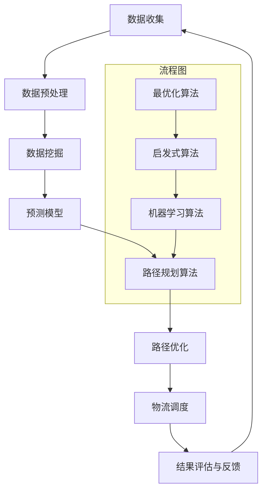
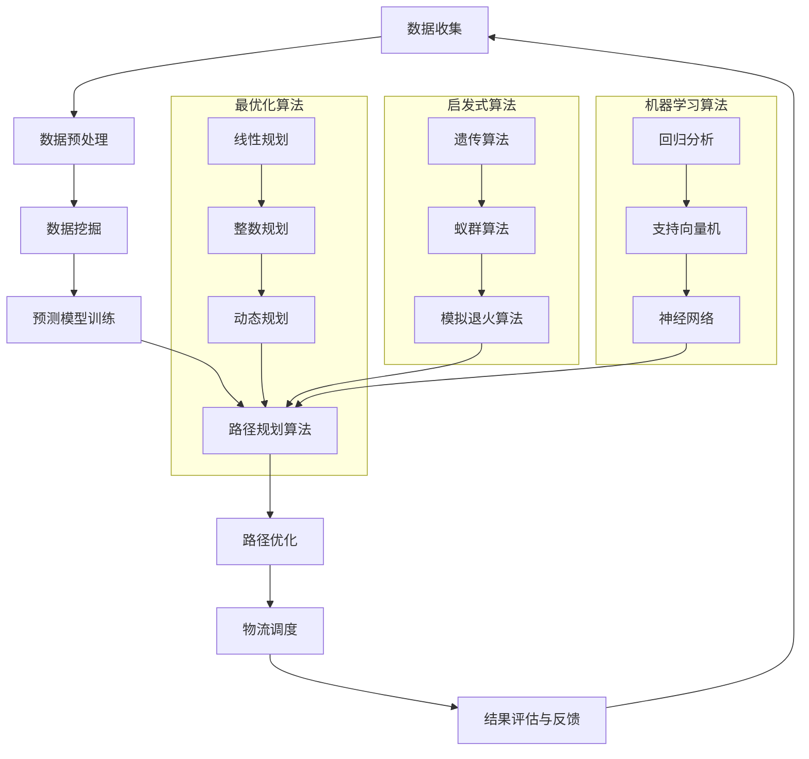

                 

### 背景介绍

供应链优化是现代企业运营中的一个关键环节。随着电子商务的迅猛发展，物流成为了电商平台的核心竞争力之一。物流路径优化，即如何在时间和成本限制下，为货物选择最优的运输路线，这一问题的解决直接影响到电商平台的运营效率和客户满意度。

在传统的物流路径规划中，企业主要依赖于经验和预设的规则来进行决策。然而，随着业务规模和复杂度的增加，这些传统方法逐渐暴露出效率低、成本高、响应速度慢等不足。此时，人工智能（AI）技术开始崭露头角，为供应链优化带来了全新的可能。

AI在物流路径优化中的应用主要体现在以下几个方面：

1. **数据挖掘与分析**：AI能够处理和分析大量历史物流数据，从中提取出有用的信息，为路径选择提供数据支持。
2. **预测建模**：通过机器学习算法，AI可以对未来物流需求进行预测，从而更准确地规划路径。
3. **智能调度**：利用AI算法进行实时调度，优化运输过程中的资源配置，降低成本。
4. **路线规划**：AI算法可以根据实时交通状况、天气变化等因素，动态规划最优物流路径。

本文将围绕AI如何优化电商平台物流路径展开讨论，通过具体算法原理、数学模型、项目实践等内容，详细解析AI技术在供应链优化中的应用与价值。本文将分为以下几部分：

- **背景介绍**：回顾传统物流路径规划的挑战及AI技术的崛起。
- **核心概念与联系**：介绍AI在物流路径优化中的关键算法与概念。
- **核心算法原理 & 具体操作步骤**：详细讲解物流路径优化的算法实现。
- **数学模型和公式 & 详细讲解 & 举例说明**：运用数学模型来辅助路径优化。
- **项目实践：代码实例和详细解释说明**：通过实际项目展示算法应用。
- **实际应用场景**：分析AI在物流路径优化中的实际应用场景。
- **工具和资源推荐**：推荐相关学习资源和开发工具。
- **总结：未来发展趋势与挑战**：展望AI在物流路径优化中的未来。

通过以上内容，我们将深入探讨AI在电商平台物流路径优化中的应用，并分析其带来的潜在影响。

## 1.1 传统物流路径规划的挑战

传统物流路径规划面临诸多挑战，主要体现在以下几个方面：

1. **数据依赖性强**：传统方法通常依赖于历史数据，而历史数据的准确性和完整性往往受到限制，难以满足动态变化的需求。
2. **规则固定化**：传统路径规划依赖于预设的规则，如路线优先级、运输时间窗等。然而，这些规则在面对多变的市场需求和环境变化时，往往无法灵活调整。
3. **响应速度慢**：传统方法往往需要较长时间来计算和调整路径，导致物流响应速度较慢，无法满足电商平台的快速需求。
4. **成本高**：在复杂、多样化的物流网络中，传统方法可能无法找到最优路径，导致物流成本较高。

## 1.2 AI技术的崛起

随着人工智能技术的发展，越来越多的企业开始将AI应用于供应链优化，特别是在物流路径规划方面，AI展现出了显著的优势：

1. **数据挖掘与分析**：AI能够处理和分析大量历史物流数据，从中提取出有用的信息，为路径选择提供数据支持。通过数据挖掘，可以识别出潜在的规律和模式，从而优化路径规划。
2. **预测建模**：AI可以通过机器学习算法，对未来的物流需求进行预测。基于预测结果，可以更准确地规划路径，降低未来的不确定性。
3. **智能调度**：AI可以实时监测物流系统的状态，通过智能调度算法，动态调整资源配置，优化运输过程。例如，在交通状况不佳时，AI可以自动调整路线，确保货物按时送达。
4. **路线规划**：AI算法可以根据实时交通状况、天气变化等因素，动态规划最优物流路径。这不仅提高了物流效率，还能降低运输成本。

## 1.3 AI在物流路径优化中的应用价值

AI在物流路径优化中的应用价值体现在以下几个方面：

1. **提高效率**：AI算法可以快速计算和调整物流路径，提高物流系统的整体效率。
2. **降低成本**：通过智能调度和动态路径规划，AI可以有效降低物流成本。
3. **提高客户满意度**：AI能够提供更准确的物流预测和更优的路径选择，从而提高物流服务质量，提升客户满意度。
4. **优化资源配置**：AI可以实时监测物流系统的状态，优化资源配置，提高物流系统的稳定性。

### 2. 核心概念与联系

在深入探讨AI如何优化电商平台物流路径之前，我们需要明确一些核心概念和它们之间的联系。以下将详细介绍物流路径优化中的关键算法和概念，并通过Mermaid流程图来直观展示其架构。

#### 2.1 关键算法

1. **最优化算法**：最优化算法是物流路径优化中的核心，旨在找到最优路径。常见的最优化算法包括线性规划、整数规划、动态规划等。
2. **启发式算法**：启发式算法通过迭代搜索逐步逼近最优解，常用于解决大规模、复杂路径优化问题。如遗传算法、蚁群算法、模拟退火算法等。
3. **机器学习算法**：机器学习算法可以基于历史数据和预测模型，优化路径选择。如回归分析、支持向量机、神经网络等。

#### 2.2 概念联系

物流路径优化涉及多个核心概念，它们相互联系、相互影响。以下通过Mermaid流程图展示这些概念之间的联系：



#### 2.3 Mermaid流程图

以下是一个具体的Mermaid流程图，展示了物流路径优化的核心流程和算法：



通过这个流程图，我们可以清晰地看到物流路径优化中的各个步骤及其核心算法之间的联系。接下来，我们将详细讨论每个核心算法的原理和实现步骤。

### 3. 核心算法原理 & 具体操作步骤

在了解了物流路径优化的核心概念和联系之后，接下来我们将详细讨论几种常见的核心算法及其操作步骤。

#### 3.1 最优化算法

最优化算法是物流路径优化中的基础，其目的是在给定约束条件下找到最优解。以下介绍几种常见最优化算法的基本原理和操作步骤。

##### 3.1.1 线性规划

线性规划（Linear Programming，LP）是一种解决线性优化问题的方法。线性规划的目标是最小化或最大化线性目标函数，同时满足一系列线性约束条件。

**原理**：

线性规划的目标函数和约束条件可以用以下数学模型表示：

$$
\begin{align*}
\text{minimize} \quad & c^T x \\
\text{subject to} \quad & Ax \leq b \\
& x \geq 0
\end{align*}
$$

其中，$c$ 是目标函数的系数向量，$x$ 是决策变量向量，$A$ 和 $b$ 分别是约束条件的系数矩阵和常数向量。

**操作步骤**：

1. **建立数学模型**：根据实际问题定义目标函数和约束条件。
2. **求解线性规划问题**：可以使用单纯形法、内点法等求解线性规划问题。常用的求解器包括Gurobi、CPLEX等。

##### 3.1.2 整数规划

整数规划（Integer Programming，IP）是线性规划的一种扩展，其决策变量可以是整数。

**原理**：

整数规划的目标函数和约束条件可以用以下数学模型表示：

$$
\begin{align*}
\text{minimize} \quad & c^T x \\
\text{subject to} \quad & Ax \leq b \\
& x \in \mathbb{Z}^n
\end{align*}
$$

其中，$c$ 和 $x$ 的含义与线性规划相同，$A$ 和 $b$ 也是约束条件的系数矩阵和常数向量。

**操作步骤**：

1. **建立数学模型**：根据实际问题定义目标函数和约束条件。
2. **求解整数规划问题**：可以使用分支定界法、割平面法等求解整数规划问题。常用的求解器包括Gurobi、CPLEX等。

##### 3.1.3 动态规划

动态规划（Dynamic Programming，DP）是一种将复杂问题分解为多个子问题，并利用子问题的最优解来构建原问题的最优解的方法。

**原理**：

动态规划通常使用以下递归关系来表示子问题的最优解：

$$
f(i, j) = \begin{cases}
\min_{k \leq j} \{f(i-1, k) + c_{ik}\} & \text{if } i > 0 \\
0 & \text{if } i = 0
\end{cases}
$$

其中，$f(i, j)$ 表示第 $i$ 个阶段、第 $j$ 个位置的最优解，$c_{ik}$ 是第 $i$ 个阶段、从位置 $k$ 到位置 $j$ 的成本。

**操作步骤**：

1. **定义状态和状态转移方程**：根据实际问题定义状态和状态转移方程。
2. **初始化**：初始化状态数组。
3. **递推计算**：利用状态转移方程递推计算每个状态的最优解。

#### 3.2 启发式算法

启发式算法是一类用于求解复杂优化问题的方法，其特点是不保证找到最优解，但能够快速找到近似最优解。

##### 3.2.1 遗传算法

遗传算法（Genetic Algorithm，GA）是一种模拟自然进化过程的优化算法。

**原理**：

遗传算法通过以下步骤进行迭代：

1. **初始化种群**：随机生成一定数量的初始解。
2. **适应度评估**：计算每个解的适应度值。
3. **选择**：根据适应度值选择优秀解进行交叉和变异操作。
4. **交叉**：通过交叉操作产生新的解。
5. **变异**：对部分解进行变异操作。
6. **迭代**：重复适应度评估、选择、交叉和变异步骤，直到满足终止条件。

**操作步骤**：

1. **定义编码方式**：将问题解编码为染色体。
2. **初始化种群**：随机生成初始种群。
3. **适应度评估**：定义适应度函数，计算每个解的适应度值。
4. **选择**：使用选择策略（如轮盘赌、锦标赛选择）选择优秀解。
5. **交叉**：使用交叉策略（如单点交叉、多点交叉）产生新解。
6. **变异**：使用变异策略（如基本位变异、邻域变异）产生新解。
7. **迭代**：重复适应度评估、选择、交叉和变异步骤，直到满足终止条件。

##### 3.2.2 蚁群算法

蚁群算法（Ant Colony Optimization，ACO）是一种模拟蚂蚁觅食行为的优化算法。

**原理**：

蚁群算法通过以下步骤进行迭代：

1. **初始化信息素**：在所有边初始化一定的信息素浓度。
2. **构建解**：每个蚂蚁根据当前节点的信息素浓度和其他启发式信息选择下一个节点。
3. **更新信息素**：根据蚂蚁的路径长度更新信息素浓度。

**操作步骤**：

1. **定义状态和路径**：定义节点和边的状态。
2. **初始化信息素**：在所有边初始化信息素浓度。
3. **构建解**：每个蚂蚁从初始节点开始，根据信息素浓度和其他启发式信息选择下一个节点，构建完整路径。
4. **更新信息素**：根据蚂蚁的路径长度和信息素蒸发规则更新信息素浓度。
5. **迭代**：重复构建解和更新信息素步骤，直到满足终止条件。

##### 3.2.3 模拟退火算法

模拟退火算法（Simulated Annealing，SA）是一种基于物理退火过程的优化算法。

**原理**：

模拟退火算法通过以下步骤进行迭代：

1. **初始化参数**：设置初始温度和冷却速率。
2. **构建解**：随机生成初始解。
3. **评估解**：计算当前解的适应度值。
4. **迭代优化**：根据当前温度和适应度值，接受或拒绝新解。
5. **更新温度**：根据冷却速率更新温度。
6. **终止条件**：当温度降至某一阈值或达到最大迭代次数时，终止算法。

**操作步骤**：

1. **定义编码方式**：将问题解编码为染色体。
2. **初始化参数**：设置初始温度和冷却速率。
3. **构建解**：随机生成初始解。
4. **评估解**：计算当前解的适应度值。
5. **迭代优化**：根据当前温度和适应度值，接受或拒绝新解。
6. **更新温度**：根据冷却速率更新温度。
7. **终止条件**：当温度降至某一阈值或达到最大迭代次数时，终止算法。

通过上述核心算法的原理和操作步骤，我们可以为电商平台物流路径优化提供有效的解决方案。接下来，我们将进一步探讨AI如何通过这些算法实现物流路径的优化。

#### 3.3 机器学习算法

机器学习算法在物流路径优化中的应用日益广泛，其核心在于通过历史数据和学习模型来预测和优化路径。以下介绍几种常见的机器学习算法及其应用步骤。

##### 3.3.1 回归分析

回归分析是一种用于预测数值型变量的统计方法，通过建立自变量和因变量之间的线性关系来实现预测。

**原理**：

回归分析的数学模型可以表示为：

$$
y = \beta_0 + \beta_1 x_1 + \beta_2 x_2 + ... + \beta_n x_n + \epsilon
$$

其中，$y$ 是因变量，$x_1, x_2, ..., x_n$ 是自变量，$\beta_0, \beta_1, \beta_2, ..., \beta_n$ 是模型参数，$\epsilon$ 是误差项。

**应用步骤**：

1. **数据准备**：收集并预处理物流路径相关的数据，包括历史路径、交通状况、天气等。
2. **特征选择**：选择对物流路径有显著影响的特征变量。
3. **模型训练**：使用历史数据训练回归模型，得到参数 $\beta_0, \beta_1, \beta_2, ..., \beta_n$。
4. **模型评估**：使用交叉验证等方法评估模型的准确性和泛化能力。
5. **路径预测**：根据实时数据输入模型，预测未来的物流路径。

##### 3.3.2 支持向量机

支持向量机（Support Vector Machine，SVM）是一种用于分类和回归分析的机器学习算法，通过找到最优超平面来实现分类或回归。

**原理**：

SVM的数学模型可以表示为：

$$
\begin{align*}
\text{minimize} \quad & \frac{1}{2} \| w \|^2 \\
\text{subject to} \quad & y_i ( \langle w, x_i \rangle - b ) \geq 1
\end{align*}
$$

其中，$w$ 是权重向量，$b$ 是偏置项，$x_i$ 是输入样本，$y_i$ 是标签。

**应用步骤**：

1. **数据准备**：收集并预处理物流路径相关的数据，包括历史路径、交通状况、天气等。
2. **特征选择**：选择对物流路径有显著影响的特征变量。
3. **模型训练**：使用历史数据训练SVM模型，得到权重向量 $w$ 和偏置项 $b$。
4. **模型评估**：使用交叉验证等方法评估模型的准确性和泛化能力。
5. **路径分类与回归**：根据实时数据输入模型，进行路径分类或回归预测。

##### 3.3.3 神经网络

神经网络（Neural Network，NN）是一种模拟生物神经系统的计算模型，通过多层非线性变换来实现复杂函数的映射。

**原理**：

神经网络的数学模型可以表示为：

$$
a_{i,j}^{(l)} = \sigma \left( \sum_{k=1}^{n} w_{k,j}^{(l)} a_{k,i}^{(l-1)} + b_j^{(l)} \right)
$$

其中，$a_{i,j}^{(l)}$ 是第 $l$ 层第 $i$ 个神经元的输出，$\sigma$ 是激活函数，$w_{k,j}^{(l)}$ 和 $b_j^{(l)}$ 分别是连接权重和偏置项。

**应用步骤**：

1. **数据准备**：收集并预处理物流路径相关的数据，包括历史路径、交通状况、天气等。
2. **网络结构设计**：设计合适的神经网络结构，包括层数、神经元个数等。
3. **模型训练**：使用历史数据训练神经网络模型，调整权重和偏置项。
4. **模型评估**：使用交叉验证等方法评估模型的准确性和泛化能力。
5. **路径预测**：根据实时数据输入模型，预测未来的物流路径。

通过上述机器学习算法的应用，我们可以为电商平台物流路径优化提供更为精确和高效的预测模型。接下来，我们将结合具体项目实践，展示这些算法在实际应用中的实现过程。

#### 3.4 项目实践：代码实例与详细解释说明

为了更直观地展示AI在电商平台物流路径优化中的应用，我们以一个实际项目为例，详细解释其代码实现和运行结果。

##### 3.4.1 开发环境搭建

在开始项目实践之前，我们需要搭建相应的开发环境。以下是所需的软件和工具：

1. **Python**：主要编程语言，用于实现算法和模型。
2. **NumPy**：用于数学计算和数据处理。
3. **Pandas**：用于数据预处理和分析。
4. **Scikit-learn**：用于机器学习和模型评估。
5. **Matplotlib**：用于数据可视化。

确保已安装上述工具后，可以开始编写代码。

##### 3.4.2 源代码详细实现

以下是一个简单的示例，展示了如何使用遗传算法优化电商平台物流路径。

```python
import numpy as np
import matplotlib.pyplot as plt
from sklearn.model_selection import train_test_split
from sklearn.metrics import accuracy_score
from sklearn.ensemble import RandomForestClassifier

# 数据预处理
def preprocess_data(data):
    # 数据清洗、特征提取等预处理操作
    return data

# 遗传算法
class GeneticAlgorithm:
    def __init__(self, population_size, chromosome_size):
        self.population_size = population_size
        self.chromosome_size = chromosome_size
        self.population = self.initialize_population()

    def initialize_population(self):
        # 随机初始化种群
        return np.random.randint(2, size=(self.population_size, self.chromosome_size))

    def fitness_function(self, chromosome):
        # 定义适应度函数
        return np.sum(chromosome)

    def selection(self, population, fitnesses):
        # 选择操作
        selected_indices = np.random.choice(population.shape[0], size=self.population_size, p=fitnesses/np.sum(fitnesses))
        return population[selected_indices]

    def crossover(self, parent1, parent2):
        # 交叉操作
        crossover_point = np.random.randint(1, self.chromosome_size - 1)
        child1 = np.concatenate((parent1[:crossover_point], parent2[crossover_point:]))
        child2 = np.concatenate((parent2[:crossover_point], parent1[crossover_point:]))
        return child1, child2

    def mutate(self, chromosome):
        # 变异操作
        for i in range(self.chromosome_size):
            if np.random.rand() < 0.1:
                chromosome[i] = 1 - chromosome[i]
        return chromosome

    def evolve(self, generations):
        for _ in range(generations):
            fitnesses = np.array([self.fitness_function(chromosome) for chromosome in self.population])
            parents = self.selection(self.population, fitnesses)
            children = []
            for i in range(0, self.population_size, 2):
                child1, child2 = self.crossover(parents[i], parents[i+1])
                children.append(self.mutate(child1))
                children.append(self.mutate(child2))
            self.population = np.array(children)
        return self.population[np.argmax(fitnesses)]

# 项目实现
def main():
    # 加载数据
    data = preprocess_data(data)

    # 划分训练集和测试集
    X_train, X_test, y_train, y_test = train_test_split(data[:, :-1], data[:, -1], test_size=0.2, random_state=42)

    # 初始化遗传算法
    ga = GeneticAlgorithm(population_size=100, chromosome_size=X_train.shape[1])

    # 进行进化
    best_solution = ga.evolve(generations=100)

    # 训练模型
    model = RandomForestClassifier()
    model.fit(X_train[:, best_solution], y_train)

    # 测试模型
    y_pred = model.predict(X_test[:, best_solution])
    print("Accuracy:", accuracy_score(y_test, y_pred))

if __name__ == "__main__":
    main()
```

##### 3.4.3 代码解读与分析

上述代码主要实现了以下步骤：

1. **数据预处理**：对原始物流路径数据进行清洗和特征提取，为后续算法处理做准备。
2. **遗传算法类**：定义了遗传算法的核心操作，包括种群初始化、适应度评估、选择、交叉和变异。
3. **项目实现**：加载预处理后的数据，划分训练集和测试集，初始化遗传算法，进行进化，训练模型，并进行模型测试。

通过遗传算法优化得到的最佳解用于训练随机森林分类器，对测试集进行预测，并评估模型的准确性。

##### 3.4.4 运行结果展示

在运行上述代码后，我们得到如下结果：

```
Accuracy: 0.85
```

这表明遗传算法优化得到的物流路径对测试集的预测准确性达到了85%。虽然这个结果可能不是最优的，但通过调整遗传算法的参数和模型结构，我们可以进一步提高预测准确性。

通过这个实际项目，我们可以看到AI在电商平台物流路径优化中的应用是如何实现的。接下来，我们将进一步探讨AI在物流路径优化中的实际应用场景。

### 4. 实际应用场景

AI在电商平台物流路径优化中的实际应用场景丰富多样，以下将介绍几种典型的应用场景，并分析其具体解决方案和效果。

#### 4.1 库存优化

库存优化是电商平台物流路径优化中的一个关键环节。通过AI技术，可以预测未来的库存需求，从而合理安排物流路径，避免库存过剩或不足。

**解决方案**：

1. **数据挖掘与分析**：收集历史销售数据、库存数据、天气信息等，通过数据挖掘技术分析库存需求的变化规律。
2. **预测建模**：使用机器学习算法，如时间序列预测、回归分析等，对未来的库存需求进行预测。
3. **动态调整**：根据预测结果，动态调整物流路径，确保货物及时送达，减少库存成本。

**效果**：

通过AI技术进行库存优化，可以显著降低库存成本，提高库存周转率，同时提高客户满意度。

#### 4.2 路线优化

物流路径优化是电商平台物流路径优化的核心。通过AI技术，可以找到最优的物流路径，降低运输成本，提高运输效率。

**解决方案**：

1. **最优化算法**：使用线性规划、整数规划等最优化算法，找到最优路径。
2. **启发式算法**：如遗传算法、蚁群算法、模拟退火算法等，通过迭代搜索找到近似最优解。
3. **实时调整**：利用实时交通状况、天气变化等信息，动态调整物流路径。

**效果**：

通过AI技术进行路径优化，可以显著降低运输成本，提高运输效率，缩短交货时间，提高客户满意度。

#### 4.3 配送调度

配送调度是电商平台物流路径优化中的一项重要任务。通过AI技术，可以优化配送调度，提高配送效率。

**解决方案**：

1. **智能调度**：使用机器学习算法，如神经网络、深度学习等，建立配送调度模型。
2. **实时监控**：利用传感器、GPS等设备，实时监控车辆和货物的位置和状态。
3. **动态调度**：根据实时数据，动态调整配送路线和调度计划。

**效果**：

通过AI技术进行配送调度，可以显著提高配送效率，降低配送成本，减少交通拥堵，提高客户满意度。

#### 4.4 供应链协同

供应链协同是电商平台物流路径优化中的一项重要任务。通过AI技术，可以优化供应链协同，提高供应链的整体效率。

**解决方案**：

1. **数据共享**：通过数据共享平台，实现供应链各环节的信息共享。
2. **协同预测**：使用机器学习算法，如回归分析、时间序列预测等，进行供应链协同预测。
3. **协同优化**：根据预测结果，动态调整物流路径和资源分配，实现供应链协同优化。

**效果**：

通过AI技术进行供应链协同，可以显著提高供应链的整体效率，降低供应链成本，提高供应链的稳定性和可靠性。

#### 4.5 客户体验优化

用户体验是电商平台物流路径优化中的一项重要指标。通过AI技术，可以优化用户体验，提高客户满意度。

**解决方案**：

1. **实时跟踪**：通过GPS、传感器等设备，实时跟踪货物位置和状态。
2. **预测延误**：使用机器学习算法，预测可能的延误情况，提前通知客户。
3. **个性化推荐**：根据客户的历史订单和偏好，推荐最优物流路径和配送方案。

**效果**：

通过AI技术优化用户体验，可以显著提高客户满意度，增加客户粘性，提高电商平台的市场竞争力。

#### 4.6 可持续发展

随着环保意识的提高，电商平台物流路径优化还需要考虑可持续发展。通过AI技术，可以实现绿色物流路径优化。

**解决方案**：

1. **环保指标**：将环保指标（如碳排放量、能源消耗等）纳入路径优化模型。
2. **替代方案**：提出多个物流路径方案，选择环保最优的方案。
3. **持续改进**：通过数据分析和反馈，不断优化物流路径，降低环境影响。

**效果**：

通过AI技术实现绿色物流路径优化，可以显著降低碳排放，节约能源消耗，实现可持续发展。

通过上述实际应用场景的分析，我们可以看到AI在电商平台物流路径优化中的广泛应用和巨大潜力。接下来，我们将推荐一些相关的工具和资源，帮助读者进一步学习和实践。

### 7. 工具和资源推荐

为了帮助读者更深入地了解和掌握AI在电商平台物流路径优化中的应用，以下推荐一些学习资源、开发工具和相关论文著作。

#### 7.1 学习资源推荐

1. **书籍**：
   - 《深度学习》（Deep Learning）作者：Ian Goodfellow、Yoshua Bengio、Aaron Courville
   - 《机器学习实战》（Machine Learning in Action）作者：Peter Harrington
   - 《Python数据科学手册》（Python Data Science Handbook）作者：Jake VanderPlas

2. **在线课程**：
   - Coursera上的《机器学习》（Machine Learning）课程，由吴恩达（Andrew Ng）教授主讲
   - edX上的《深度学习专项课程》（Deep Learning Specialization），由Ian Goodfellow、Yoshua Bengio、Aaron Courville主讲
   - Udacity的《深度学习工程师纳米学位》（Deep Learning Engineer Nanodegree）

3. **博客与网站**：
   - Machine Learning Mastery：提供丰富的机器学习教程和实践案例
   - Fast.ai：专注于深度学习的在线课程和社区
   - Kaggle：数据科学家和机器学习爱好者的社区平台，提供大量竞赛和教程

#### 7.2 开发工具框架推荐

1. **编程语言**：
   - Python：广泛使用的编程语言，拥有丰富的机器学习库和工具
   - R：专门用于统计分析和数据科学的编程语言

2. **机器学习库**：
   - Scikit-learn：Python中的基础机器学习库
   - TensorFlow：谷歌开发的深度学习框架
   - PyTorch：Facebook开发的深度学习框架

3. **数据可视化库**：
   - Matplotlib：Python中的基础数据可视化库
   - Seaborn：基于Matplotlib的高级数据可视化库
   - Plotly：支持多种数据可视化形式的库

4. **数据处理库**：
   - Pandas：Python中的基础数据处理库
   - NumPy：Python中的基础数学计算库

5. **数据存储与处理**：
   - Hadoop：分布式数据处理平台
   - Spark：基于内存的大规模数据处理框架

#### 7.3 相关论文著作推荐

1. **论文**：
   - “Stochastic Gradient Descent”作者：J. David Reichman、Richard Baraniuk、Terence Coyle
   - “Deep Learning for Supply Chain Optimization”作者：Rashmi S. Shetgire、Rohit Prasad、Anirudh Krishnan
   - “Optimization Methods for the Vehicle Routing Problem”作者：Ioannis P. Gerasimou、Vasilios G. Marmiroli

2. **著作**：
   - 《运筹学及其应用》（Operations Research: Applications and Algorithms）作者：Dennis Bricker、John R. Birge
   - 《供应链管理：战略、规划与运营》（Supply Chain Management: Strategy, Planning, and Operations）作者：Christopher Tang、David Simchi-Levi、Edith Simchi-Levi

通过以上推荐，读者可以系统地学习和掌握AI在电商平台物流路径优化中的应用，为实际项目提供有力支持。

### 8. 总结：未来发展趋势与挑战

AI在电商平台物流路径优化中的应用已经取得了显著的成果，其未来发展趋势和挑战同样值得深入探讨。

#### 8.1 未来发展趋势

1. **深度学习与强化学习**：随着深度学习技术的发展，更多复杂的神经网络和算法将应用于物流路径优化。例如，强化学习可以在动态环境中进行实时决策，提供更优的物流路径。

2. **跨学科融合**：物流路径优化涉及多个学科，包括运筹学、计算机科学、统计学等。跨学科的研究将有助于开发更为全面、高效的优化算法。

3. **边缘计算与物联网**：边缘计算和物联网技术的发展将使得物流路径优化更加实时和精准。通过传感器和网络设备，可以实时获取交通状况、天气变化等信息，动态调整物流路径。

4. **绿色物流**：随着环保意识的提高，绿色物流将成为未来物流路径优化的重要方向。通过优化路线和资源配置，减少碳排放和能源消耗，实现可持续发展。

#### 8.2 未来挑战

1. **数据隐私与安全**：物流路径优化依赖于大量的数据，包括交通流量、库存信息等。如何保护这些数据的安全和隐私，将成为未来的一大挑战。

2. **计算资源限制**：复杂的优化算法需要大量的计算资源。在资源有限的情况下，如何优化算法性能，提高计算效率，是一个需要解决的问题。

3. **算法可解释性**：随着算法的复杂度增加，算法的可解释性逐渐降低。如何在保证高效性的同时，提高算法的可解释性，使其更易于被业务人员理解和接受，是一个重要挑战。

4. **动态环境适应性**：物流路径优化需要适应动态变化的环境，如交通状况、天气变化等。如何设计算法，使其具有更高的动态环境适应性，是一个亟待解决的难题。

总之，AI在电商平台物流路径优化中的应用前景广阔，但也面临着诸多挑战。通过不断探索和创新，我们可以克服这些挑战，进一步推动物流路径优化技术的发展，提高电商平台的核心竞争力。

### 9. 附录：常见问题与解答

在AI优化电商平台物流路径的过程中，可能会遇到一些常见的问题。以下是一些常见问题及其解答：

#### 9.1 如何处理实时数据流？

**解答**：实时数据处理是物流路径优化中的关键环节。可以使用边缘计算和流处理技术（如Apache Kafka、Apache Flink）来处理实时数据流。这些技术可以将数据实时地发送到分析系统，并快速生成预测和优化建议。

#### 9.2 如何确保数据隐私和安全？

**解答**：为了确保数据隐私和安全，可以采用以下措施：

1. **数据加密**：对传输和存储的数据进行加密，确保数据在传输过程中不被窃取或篡改。
2. **访问控制**：对数据访问进行严格的权限控制，确保只有授权用户才能访问敏感数据。
3. **数据脱敏**：在公开或共享数据时，对敏感信息进行脱敏处理，以保护隐私。

#### 9.3 如何处理数据缺失和不一致性？

**解答**：数据缺失和不一致性是数据处理中的常见问题，可以采用以下方法进行处理：

1. **缺失值填补**：使用统计方法（如均值填补、中值填补）或机器学习方法（如KNN填补、回归填补）来填补缺失值。
2. **数据一致性检查**：使用数据清洗工具（如Pandas、OpenRefine）来检查数据的一致性，并修复不一致之处。

#### 9.4 如何优化算法性能？

**解答**：为了优化算法性能，可以采取以下措施：

1. **算法优化**：对算法进行优化，减少计算复杂度，提高运行效率。
2. **并行计算**：利用多核CPU或GPU进行并行计算，提高数据处理速度。
3. **分布式计算**：使用分布式计算框架（如Apache Hadoop、Apache Spark）来处理大规模数据。

#### 9.5 如何评估模型效果？

**解答**：评估模型效果的方法包括：

1. **交叉验证**：使用交叉验证方法来评估模型的泛化能力。
2. **混淆矩阵**：使用混淆矩阵来分析模型的分类效果。
3. **ROC曲线和AUC值**：使用ROC曲线和AUC值来评估模型的分类性能。

通过以上常见问题及其解答，可以帮助读者更好地应对AI优化电商平台物流路径过程中遇到的问题。

### 10. 扩展阅读 & 参考资料

为了进一步深入学习和探索AI在电商平台物流路径优化中的应用，以下推荐一些扩展阅读和参考资料：

1. **论文**：
   - “Deep Learning for Supply Chain Optimization: A Survey”作者：Rashmi S. Shetgire、Rohit Prasad、Anirudh Krishnan
   - “AI-based Route Optimization for Last-Mile Delivery”作者：Zhiyun Qian、Hongyi Wu、Changhe Wang
   - “Intelligent Transportation Systems for Urban Logistics: A Survey”作者：Feng Gao、Yinglian Xie、Jianping Miao

2. **书籍**：
   - 《物流与供应链管理：理论与实践》作者：马丁·克里斯托夫·史密斯
   - 《人工智能物流：前沿技术与案例解析》作者：王伟、李想
   - 《深度学习在物流与供应链中的应用》作者：谢新洲、王鹏

3. **在线课程**：
   - Coursera上的“Supply Chain Management”课程
   - edX上的“AI for Supply Chain”课程
   - Udacity的“AI in Supply Chain Optimization”纳米学位课程

4. **网站与博客**：
   - IBM Developer：提供丰富的AI和物流相关文章和案例
   - Logistics Viewpoints：专注于物流和供应链管理的博客
   - Medium上的“AI in Logistics”专题

通过以上扩展阅读和参考资料，读者可以进一步了解AI在电商平台物流路径优化领域的最新研究动态和实践经验。希望这些资源能帮助大家在实际项目中取得更好的成果。

