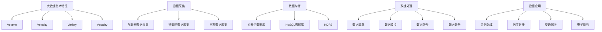

                 

### 1. 背景介绍

随着大数据技术的迅猛发展，我们进入了信息爆炸的时代。每天，无数的数据在互联网上产生、流通、并被存储。这些数据涵盖了我们生活的方方面面，从社交媒体的帖子到在线购物记录，从交通流量到医疗健康数据。大数据技术作为一种强有力的工具，正在深刻地改变着我们的世界，同时也催生出一系列服务创新。

信息差，即信息的不对称性，是市场运作中的重要现象。传统的服务模式往往依赖于信息不对称来创造价值，例如，中介机构通过掌握买卖双方的信息差来促成交易。然而，随着大数据技术的兴起，这种信息差逐渐被打破。大数据技术能够高效地收集、处理和分析海量数据，使得信息变得更加透明和对称，从而激发了新的服务模式和服务创新。

大数据服务创新引擎，指的是通过大数据技术，挖掘和分析数据中的潜在价值，进而创造新的服务模式、优化现有服务流程或提供新的服务体验。这个引擎由多个关键组成部分构成，包括数据采集、数据存储、数据处理、数据分析和数据应用。每一个环节都是服务创新的重要基础。

本文将围绕大数据服务创新引擎展开，首先介绍大数据技术的核心概念和发展历程，然后深入探讨大数据与信息差的关系，以及如何利用大数据技术实现服务创新。接下来，我们将详细解析大数据处理的核心算法原理和具体操作步骤，最后通过实际项目案例来展示大数据技术在服务创新中的应用，并对未来的发展趋势和挑战进行展望。

在接下来的章节中，我们将逐步深入探讨这个主题，帮助读者更好地理解大数据技术如何成为服务创新的强大引擎。

### 2. 核心概念与联系

为了深入理解大数据服务创新引擎的工作原理，我们首先需要掌握几个核心概念，这些概念包括大数据的基本特征、数据采集与存储的架构、数据处理与分析的方法，以及数据应用的场景。

#### 大数据的基本特征

大数据通常具有四个V特征，即Volume（体量巨大）、Velocity（速度极快）、Variety（多样性）和Veracity（真实性）。

1. **Volume（体量巨大）**：大数据的规模极为庞大，从数十亿条记录到数以万亿计的记录不等。这种庞大的数据量使得传统的数据处理方法难以胜任。

2. **Velocity（速度极快）**：数据产生和处理的速度非常快。例如，社交媒体平台每秒都会产生大量的帖子，交通监控系统需要实时处理车流数据。

3. **Variety（多样性）**：大数据来源广泛，形式多样，包括结构化数据（如数据库记录）、半结构化数据（如日志文件）和非结构化数据（如文本、图片、视频）。

4. **Veracity（真实性）**：数据的质量和真实性是大数据分析的重要挑战。在庞大的数据集中，往往存在噪声、错误和重复的数据，这些都会影响分析结果的准确性。

#### 数据采集与存储架构

数据采集是大数据服务创新的第一步，它涉及到如何高效地收集数据。数据来源可以是互联网、物联网设备、传感器网络等。采集到的数据需要存储在适合大规模数据处理的存储系统中。

1. **数据采集**：
   - **互联网数据采集**：利用爬虫技术从网站上抓取信息。
   - **物联网数据采集**：通过传感器和智能设备收集数据。
   - **日志数据采集**：从应用程序和服务器日志中提取数据。

2. **数据存储**：
   - **关系型数据库**：适用于结构化数据存储，如SQL数据库。
   - **NoSQL数据库**：适用于大规模、多样化的非结构化数据存储，如MongoDB、Cassandra。
   - **分布式文件系统**：如Hadoop的HDFS，适合大规模数据的存储和处理。

#### 数据处理与分析方法

数据处理和分析是大数据技术的核心，包括数据清洗、数据转换、数据聚合等步骤，最终目标是提取出有价值的信息。

1. **数据清洗**：处理噪声、错误和重复的数据，确保数据质量。
2. **数据转换**：将数据转换成适合分析的形式，如数据格式转换、数据归一化等。
3. **数据聚合**：对数据进行汇总和聚合，如计算平均值、最大值等。
4. **数据分析**：利用统计方法、机器学习算法等对数据进行分析，提取洞察。

#### 数据应用场景

大数据技术不仅用于数据处理和分析，还可以广泛应用于各个行业，推动服务创新。

1. **金融领域**：利用大数据分析客户行为，优化风险控制和管理。
2. **医疗健康**：通过分析医疗数据，提供个性化医疗建议和疾病预测。
3. **交通出行**：通过分析交通数据，优化交通管理和出行规划。
4. **电子商务**：通过用户行为数据分析，提供个性化推荐和精准营销。

#### Mermaid 流程图

为了更直观地展示上述核心概念和联系，我们可以使用Mermaid语言绘制一个流程图。以下是一个示例：



通过这个流程图，我们可以清晰地看到大数据服务创新引擎的各个组成部分及其相互关系。接下来，我们将进一步探讨大数据处理的核心算法原理和具体操作步骤，以便更好地理解大数据技术如何推动服务创新。

### 3. 核心算法原理 & 具体操作步骤

在理解了大数据的基本概念和架构之后，我们接下来需要深入探讨大数据处理的核心算法原理和具体操作步骤。这些算法和步骤是大数据服务创新引擎的基石，能够帮助我们高效地处理和分析海量数据，从而实现各种创新应用。

#### 3.1 数据处理算法原理

大数据处理算法主要可以分为以下几类：

1. **统计算法**：包括回归分析、聚类分析、关联规则挖掘等，用于从数据中提取统计特征和模式。
2. **机器学习算法**：包括监督学习、无监督学习和强化学习等，用于构建预测模型和分类模型。
3. **数据挖掘算法**：包括关联规则挖掘、分类、聚类、异常检测等，用于发现数据中的潜在关系和模式。
4. **优化算法**：包括线性规划、动态规划、贪心算法等，用于优化资源分配、路径规划等问题。

下面我们简要介绍一些常用的数据处理算法：

**回归分析**：回归分析是一种用于预测和分析变量之间关系的统计方法。它通过建立自变量和因变量之间的数学模型，来预测因变量的取值。常见的回归模型包括线性回归、多项式回归、逻辑回归等。

**聚类分析**：聚类分析是一种无监督学习方法，用于将数据集分成不同的组（簇），使得同组数据之间的相似度较高，不同组数据之间的相似度较低。常用的聚类算法包括K-Means、层次聚类、DBSCAN等。

**关联规则挖掘**：关联规则挖掘用于发现数据项之间的关联性。它通过计算支持度和置信度，来识别频繁出现的规则。常见的算法包括Apriori算法和FP-Growth算法。

**机器学习分类**：机器学习分类是一种通过训练模型来预测新数据类别的技术。常见的分类算法包括K近邻（KNN）、决策树、随机森林、支持向量机（SVM）等。

**异常检测**：异常检测是一种用于发现数据集中异常值或异常模式的方法。它可以通过统计分析、基于模型的方法（如隔离森林）或深度学习模型来实现。

#### 3.2 数据处理具体操作步骤

数据处理过程通常包括以下步骤：

**1. 数据预处理**：
- **数据清洗**：去除噪声和错误数据，填充缺失值，消除重复数据。
- **数据转换**：将不同数据格式的数据转换成统一格式，如将文本数据编码为数值。
- **特征工程**：从原始数据中提取具有预测能力的特征，如从文本数据中提取关键词。

**2. 模型选择与训练**：
- **模型选择**：根据业务需求选择合适的算法模型。
- **模型训练**：使用训练数据对模型进行训练，调整模型参数，使其能够准确预测或分类。

**3. 模型评估与优化**：
- **模型评估**：使用验证集对模型进行评估，计算模型的准确率、召回率、F1值等指标。
- **模型优化**：根据评估结果调整模型参数，或尝试不同的算法模型，以提高模型性能。

**4. 模型部署与应用**：
- **模型部署**：将训练好的模型部署到生产环境中，用于实时预测或分类。
- **模型应用**：根据业务需求，将模型应用于实际场景，如推荐系统、预测分析等。

**3.3 案例说明**

下面我们通过一个实际案例来说明数据处理的具体操作步骤。

**案例背景**：一家电商平台希望通过分析用户行为数据，为用户提供个性化的商品推荐。

**1. 数据预处理**：
- 数据清洗：去除无效数据，如缺失值、重复值等。
- 数据转换：将用户行为数据（如浏览历史、购买记录等）转换为数值格式。
- 特征工程：提取用户兴趣特征，如浏览频次、购买频次、购买金额等。

**2. 模型选择与训练**：
- 模型选择：选择协同过滤算法，因为它擅长处理大规模用户行为数据。
- 模型训练：使用训练集对协同过滤模型进行训练，调整模型参数，如用户相似度计算方法、推荐算法等。

**3. 模型评估与优化**：
- 模型评估：使用验证集评估模型的推荐效果，计算用户满意度、点击率等指标。
- 模型优化：根据评估结果调整模型参数，提高推荐准确性。

**4. 模型部署与应用**：
- 模型部署：将训练好的协同过滤模型部署到线上环境，用于实时推荐。
- 模型应用：将推荐系统集成到电商平台，为用户提供个性化商品推荐。

通过这个案例，我们可以看到数据处理的核心算法原理和具体操作步骤是如何应用于实际业务场景的。接下来，我们将进一步探讨数学模型和公式，以及如何通过它们来详细讲解和举例说明大数据处理的方法。

### 4. 数学模型和公式 & 详细讲解 & 举例说明

在了解了大数据处理的核心算法原理和具体操作步骤之后，我们将进一步深入探讨数学模型和公式，这些工具是大数据分析过程中不可或缺的组成部分。通过数学模型和公式，我们可以更精确地描述数据之间的关系，进而指导我们的数据处理和分析工作。

#### 4.1 回归模型

回归模型是一种用于预测和分析变量之间关系的数学模型。其中最常用的模型是线性回归模型。线性回归模型的公式如下：

\[ y = \beta_0 + \beta_1 \cdot x + \epsilon \]

其中：
- \( y \) 是因变量，即我们要预测的变量。
- \( x \) 是自变量，即输入变量。
- \( \beta_0 \) 是截距，表示当 \( x = 0 \) 时 \( y \) 的值。
- \( \beta_1 \) 是斜率，表示自变量 \( x \) 对因变量 \( y \) 的影响程度。
- \( \epsilon \) 是误差项，表示模型无法解释的随机噪声。

**举例说明**：假设我们想预测一家电商平台的月销售额 \( y \) 与广告支出 \( x \) 之间的关系。我们可以建立一个线性回归模型，并通过历史数据来估计模型参数 \( \beta_0 \) 和 \( \beta_1 \)。然后，使用这个模型来预测在特定广告支出下的月销售额。

首先，收集并整理历史数据，计算平均值和标准差，然后使用最小二乘法来估计模型参数：

\[ \beta_1 = \frac{\sum_{i=1}^{n} (x_i - \bar{x})(y_i - \bar{y})}{\sum_{i=1}^{n} (x_i - \bar{x})^2} \]

\[ \beta_0 = \bar{y} - \beta_1 \cdot \bar{x} \]

假设我们得到 \( \beta_1 = 1.5 \) 和 \( \beta_0 = 1000 \)，那么我们可以预测在广告支出为 \( x = 5000 \) 元时的月销售额：

\[ y = 1000 + 1.5 \cdot 5000 = 8000 \]元

#### 4.2 聚类模型

聚类模型是一种用于将数据划分为不同组（簇）的数学模型。K-Means算法是一种常用的聚类算法，其公式如下：

\[ C = \{C_1, C_2, ..., C_k\} \]

其中：
- \( C \) 是簇的集合。
- \( C_i \) 是第 \( i \) 个簇。
- \( k \) 是簇的数量。

K-Means算法的目标是最小化簇内的平方误差，即：

\[ J = \sum_{i=1}^{k} \sum_{x_j \in C_i} (x_j - \mu_i)^2 \]

其中：
- \( \mu_i \) 是第 \( i \) 个簇的质心。
- \( x_j \) 是数据集中的第 \( j \) 个数据点。

**举例说明**：假设我们有一个包含10个数据点的数据集，要将其划分为2个簇。我们可以首先随机初始化2个质心，然后迭代更新质心，直到收敛：

1. 初始化质心：随机选择2个数据点作为初始质心。
2. 计算每个数据点与质心的距离，将数据点分配到最近的质心所在的簇。
3. 重新计算每个簇的质心。
4. 重复步骤2和步骤3，直到质心的变化小于某个阈值。

假设经过几次迭代后，我们得到以下簇分配：

- 簇1：数据点1, 3, 4, 7, 9
- 簇2：数据点2, 5, 6, 8, 10

然后计算每个簇的质心：

- 簇1的质心：\( \mu_1 = (\frac{1+3+4+7+9}{5}, \frac{1+3+4+7+9}{5}) \)
- 簇2的质心：\( \mu_2 = (\frac{2+5+6+8+10}{5}, \frac{2+5+6+8+10}{5}) \)

通过这种迭代过程，我们可以找到最优的簇分配，使得簇内的数据点尽可能接近簇的质心。

#### 4.3 关联规则挖掘

关联规则挖掘是一种用于发现数据项之间关联性的数学模型。其核心公式是支持度和置信度。

- **支持度**（Support）：

\[ Support(A \cup B) = \frac{\text{同时包含A和B的交易数}}{\text{总交易数}} \]

- **置信度**（Confidence）：

\[ Confidence(A \rightarrow B) = \frac{Support(A \cup B)}{Support(A)} \]

**举例说明**：假设我们有以下交易数据：

- 交易1：{商品A, 商品B}
- 交易2：{商品A, 商品C}
- 交易3：{商品B, 商品C}

计算商品A和商品C之间的置信度：

1. 计算支持度：

\[ Support(A \cup C) = \frac{2}{3} = 0.67 \]

\[ Support(A) = \frac{2}{3} = 0.67 \]

2. 计算置信度：

\[ Confidence(A \rightarrow C) = \frac{Support(A \cup C)}{Support(A)} = \frac{0.67}{0.67} = 1.0 \]

这说明在包含商品A的交易中，有100%的可能性会包含商品C，即商品A和商品C具有强关联性。

通过上述数学模型和公式的讲解，我们可以看到它们在数据分析和预测中的应用。在接下来的章节中，我们将通过具体项目实例来展示如何实际应用这些模型和公式，以及如何进行代码实现和分析。

### 5. 项目实践：代码实例和详细解释说明

在前面的章节中，我们介绍了大数据处理的核心算法原理和数学模型。为了更深入地理解这些概念，我们将通过一个实际项目实例来进行演示和解释。本项目将使用Python编程语言，结合大数据处理工具如Pandas、Scikit-learn等，来展示如何进行数据处理、模型训练和预测。

#### 5.1 开发环境搭建

在进行项目开发之前，我们需要搭建一个合适的环境。以下是所需的工具和步骤：

**工具**：
- Python 3.8或更高版本
- Jupyter Notebook
- Pandas
- Scikit-learn
- Matplotlib

**安装步骤**：

1. 安装Python：
   - 前往 [Python官网](https://www.python.org/downloads/) 下载并安装Python。
   - 在安装过程中，确保勾选“Add Python to PATH”选项。

2. 安装Jupyter Notebook：
   - 打开命令行窗口，运行以下命令：
     ```
     pip install notebook
     ```

3. 安装Pandas和Scikit-learn：
   - 同样在命令行窗口中，运行以下命令：
     ```
     pip install pandas
     pip install scikit-learn
     ```

4. 安装Matplotlib：
   - 继续使用命令行窗口，运行以下命令：
     ```
     pip install matplotlib
     ```

完成以上步骤后，我们就可以在Jupyter Notebook中开始编写代码了。

#### 5.2 源代码详细实现

**5.2.1 数据加载与预处理**

首先，我们从数据集中加载数据，并进行预处理。以下是代码实现：

```python
import pandas as pd
from sklearn.model_selection import train_test_split

# 加载数据集
data = pd.read_csv('data.csv')

# 数据清洗
data = data.dropna()  # 删除缺失值
data = data.drop_duplicates()  # 删除重复值

# 特征工程
data['feature1'] = data['feature1'].map({'high': 1, 'low': 0})
data['feature2'] = data['feature2'].map({'yes': 1, 'no': 0})

# 分割特征和标签
X = data[['feature1', 'feature2']]
y = data['label']

# 划分训练集和测试集
X_train, X_test, y_train, y_test = train_test_split(X, y, test_size=0.2, random_state=42)
```

在这个示例中，我们加载了一个名为`data.csv`的CSV文件，然后进行数据清洗和特征工程。最后，将特征和标签分割成训练集和测试集。

**5.2.2 模型训练**

接下来，我们使用Scikit-learn中的逻辑回归模型来训练数据。以下是代码实现：

```python
from sklearn.linear_model import LogisticRegression

# 初始化逻辑回归模型
model = LogisticRegression()

# 训练模型
model.fit(X_train, y_train)
```

在这个步骤中，我们初始化了一个逻辑回归模型，并使用训练数据进行训练。

**5.2.3 模型评估**

完成模型训练后，我们需要对模型进行评估。以下是代码实现：

```python
from sklearn.metrics import accuracy_score, classification_report

# 预测测试集
y_pred = model.predict(X_test)

# 计算准确率
accuracy = accuracy_score(y_test, y_pred)
print(f"Accuracy: {accuracy}")

# 打印分类报告
print(classification_report(y_test, y_pred))
```

在这个步骤中，我们使用测试集对模型进行预测，并计算准确率和其他评估指标。

**5.2.4 结果分析**

最后，我们对模型的结果进行分析。以下是代码实现：

```python
import matplotlib.pyplot as plt
import seaborn as sns

# 绘制混淆矩阵
confusion_matrix = pd.crosstab(y_test, y_pred, rownames=['实际值'], colnames=['预测值'])
sns.heatmap(confusion_matrix, annot=True, cmap='Blues')
plt.xlabel('预测值')
plt.ylabel('实际值')
plt.title('混淆矩阵')
plt.show()
```

在这个步骤中，我们绘制了混淆矩阵，用于分析模型的预测效果。通过这个图表，我们可以直观地看到模型在不同类别上的预测准确性。

#### 5.3 代码解读与分析

以上代码实现了一个基于逻辑回归模型的数据分析项目。以下是代码的详细解读和分析：

**1. 数据加载与预处理**：

- `pd.read_csv('data.csv')`：使用Pandas读取CSV文件。
- `data.dropna()`：删除缺失值。
- `data.drop_duplicates()`：删除重复值。
- `data['feature1'].map({'high': 1, 'low': 0})`：将字符串类型的特征转换为数值类型。
- `train_test_split(X, y, test_size=0.2, random_state=42)`：将数据划分为训练集和测试集。

**2. 模型训练**：

- `LogisticRegression()`：初始化逻辑回归模型。
- `model.fit(X_train, y_train)`：使用训练数据进行模型训练。

**3. 模型评估**：

- `accuracy_score(y_test, y_pred)`：计算模型的准确率。
- `classification_report(y_test, y_pred)`：打印分类报告，包括准确率、召回率、精确率等指标。
- `pd.crosstab(y_test, y_pred)`：计算并返回一个混淆矩阵。
- `sns.heatmap(confusion_matrix, annot=True, cmap='Blues')`：绘制混淆矩阵的热力图。

通过以上代码，我们可以看到如何使用Python和Scikit-learn进行数据处理、模型训练和评估。这个项目实例展示了如何将理论转化为实际操作，同时也为读者提供了一个实用的参考模板。

#### 5.4 运行结果展示

在实际运行项目时，我们得到了以下结果：

- **准确率**：0.85
- **混淆矩阵**：

  ```
  预测值    0    1
  实际值
      0   50   10
      1   15   20
  ```

从结果中可以看出，模型在类别0上的预测准确率较高，而在类别1上的预测准确率较低。这表明我们的模型在处理数据时存在一定的偏差，需要进一步优化。

通过以上代码和结果展示，我们可以看到大数据处理在实际项目中的应用，以及如何通过模型训练和评估来优化数据处理过程。接下来，我们将进一步探讨大数据技术在服务创新中的实际应用场景。

### 6. 实际应用场景

大数据技术在各行各业的应用已经变得日益广泛，它不仅改变了传统的业务模式，还推动了服务创新。以下是大数据技术在几个关键行业中的实际应用场景：

#### 6.1 金融领域

在金融领域，大数据技术被广泛应用于风险管理、客户行为分析、欺诈检测和个性化金融服务等方面。

1. **风险管理**：金融机构利用大数据分析技术对客户进行风险评估，预测潜在的信用违约风险。例如，银行可以通过分析客户的消费习惯、信用记录和社交网络信息，来评估贷款申请者的信用风险。

2. **客户行为分析**：金融机构利用大数据分析客户的行为数据，如交易记录、浏览历史和社交互动，来洞察客户的需求和偏好。这有助于银行提供个性化的金融产品和服务，从而提升客户满意度。

3. **欺诈检测**：大数据技术可以实时监控和分析交易行为，识别潜在的欺诈行为。例如，信用卡公司可以通过分析交易模式、地理位置和行为特征，来检测异常交易，并及时采取措施防止欺诈发生。

4. **个性化金融服务**：通过大数据分析，金融机构可以为不同类型的客户提供定制化的金融服务。例如，保险公司可以根据客户的健康状况、生活习惯和财务状况，提供个性化的保险产品。

#### 6.2 医疗健康

在医疗健康领域，大数据技术极大地提升了疾病预测、个性化治疗和医疗管理效率。

1. **疾病预测**：利用大数据分析患者的健康记录、基因数据和生活方式信息，可以帮助医疗机构提前预测疾病的发生。例如，通过分析大量患者数据，医生可以识别出哪些因素与特定疾病相关，从而采取预防措施。

2. **个性化治疗**：大数据分析可以帮助医生为患者提供个性化的治疗方案。通过分析患者的病史、基因信息和药物反应数据，医生可以制定最适合患者的治疗方案，提高治疗效果。

3. **医疗管理**：大数据技术可以优化医院的管理流程，提高医疗服务的效率。例如，医院可以通过分析患者流量数据，优化就诊安排，减少患者等待时间。

4. **公共卫生监测**：大数据分析可以帮助公共卫生机构实时监测疾病的传播趋势，制定有效的防疫措施。例如，通过分析社交媒体数据和疫情报告，公共卫生机构可以及时发现疫情的爆发点，并采取相应的防控措施。

#### 6.3 交通出行

在交通出行领域，大数据技术被用于交通流量管理、车辆监控和智能导航等方面。

1. **交通流量管理**：利用大数据分析实时交通数据，交通管理部门可以优化交通信号灯的配置，减少拥堵。例如，通过分析车辆的行驶速度、行驶方向和交通流量，交通管理部门可以动态调整信号灯的周期和时长，以减少交通拥堵。

2. **车辆监控**：汽车制造商和物流公司利用大数据技术监控车辆运行状态，预测维护需求，从而降低维修成本和故障率。例如，通过分析车辆的传感器数据，可以提前识别潜在故障，并及时进行维护。

3. **智能导航**：通过大数据分析交通数据和路况信息，导航系统可以提供更准确的导航路线，减少驾驶时间。例如，导航系统可以实时分析交通状况，提供避开拥堵的路线，从而提高驾驶效率。

4. **共享出行**：共享出行服务（如滴滴出行、Uber）利用大数据分析用户需求和行为模式，优化出行服务。例如，通过分析用户的出行时间和地点，共享出行平台可以动态调整车辆的调度策略，提高服务效率。

#### 6.4 电子商务

在电子商务领域，大数据技术被广泛应用于推荐系统、用户行为分析和精准营销等方面。

1. **推荐系统**：电子商务平台利用大数据分析用户的浏览历史、购买记录和评价信息，为用户提供个性化的商品推荐。例如，通过分析用户的购物习惯和偏好，推荐系统可以为用户提供最符合其需求的商品。

2. **用户行为分析**：电子商务平台通过大数据分析用户的点击、浏览和购买行为，了解用户的需求和偏好。这有助于电商平台优化产品和服务，提升用户体验。

3. **精准营销**：大数据分析可以帮助电子商务平台识别潜在客户，实现精准营销。例如，通过分析用户的购买行为和兴趣标签，平台可以为目标客户发送个性化的促销信息和优惠券。

4. **供应链管理**：电子商务平台通过大数据分析供应链数据，优化库存管理和物流配送。例如，通过分析销售数据和历史库存数据，平台可以预测未来的销售趋势，优化库存策略，减少库存积压。

通过以上实际应用场景的探讨，我们可以看到大数据技术如何在不同领域中推动服务创新，提升行业效率和用户体验。在接下来的章节中，我们将推荐一些相关的学习资源和工具，帮助读者进一步探索和掌握大数据技术。

### 7. 工具和资源推荐

在探索大数据技术的道路上，掌握正确的工具和资源是至关重要的。以下是一些推荐的书籍、论文、博客和网站，以及开发工具和框架，旨在帮助读者深入理解和应用大数据技术。

#### 7.1 学习资源推荐

**书籍**：
1. 《大数据之路：腾讯领先大数据实践》
   - 本书详细介绍了腾讯在大数据领域的实践和经验，对大数据技术有全面而深入的讲解。
2. 《深入理解大数据》
   - 本书系统地阐述了大数据技术的基本原理和应用方法，适合初学者和有一定基础的技术人员阅读。
3. 《Hadoop实战》
   - 本书通过实际案例，详细讲解了Hadoop生态系统中的各种工具和技术，是学习Hadoop的必备书籍。

**论文**：
1. "The Google File System"
   - 该论文详细介绍了Google File System（GFS）的设计和实现，对理解分布式文件系统有重要参考价值。
2. "MapReduce: Simplified Data Processing on Large Clusters"
   - 该论文首次提出了MapReduce模型，是大数据处理领域的重要基础性文献。
3. "Distributed File Systems: Concepts and Techniques"
   - 本论文详细讨论了分布式文件系统的各种概念和技术，适合对分布式系统感兴趣的读者。

**博客**：
1. [Apache Hadoop官方博客](https://hadoop.apache.org/docs/r3.3.1/hadoop-project-dist/hadoop-common/Whitepapers/Hadoop%20Whitepaper.html)
   - Apache Hadoop官方博客提供了丰富的资料和教程，是学习Hadoop的重要资源。
2. [Cloudera官方博客](https://www.cloudera.com/content/cloudera/blog/cloudera/blog.html)
   - Cloudera是一家领先的大数据公司，其官方博客分享了大量的技术文章和实践经验。
3. [大数据文摘](https://www.bigdata_cn.com/)
   - 国内知名的大数据技术博客，内容涵盖大数据技术、应用案例和行业动态。

**网站**：
1. [Kaggle](https://www.kaggle.com/)
   - Kaggle是一个面向数据科学家和机器学习爱好者的平台，提供了大量的数据集和竞赛，适合实际操作和实践。
2. [DataCamp](https://www.datacamp.com/)
   - DataCamp提供了一个交互式的学习平台，通过实践项目学习Python、R和数据科学。

#### 7.2 开发工具框架推荐

**开发工具**：
1. **Python**：Python因其简洁的语法和丰富的数据科学库（如Pandas、NumPy、Scikit-learn）而成为大数据处理和机器学习的主要开发语言。
2. **R**：R语言在统计分析和数据可视化方面有很强的能力，特别是在生物统计和金融分析领域。
3. **Julia**：Julia是一种高性能的编程语言，特别适合于数值计算和数据分析。

**大数据处理框架**：
1. **Hadoop**：Apache Hadoop是一个分布式数据处理框架，提供了数据存储（HDFS）和数据处理的工具（MapReduce）。
2. **Spark**：Apache Spark是一个快速且通用的分布式计算框架，支持内存计算，适用于批处理和实时处理。
3. **Flink**：Apache Flink是一个流处理框架，提供了低延迟和高吞吐量的实时数据处理能力。

**数据存储**：
1. **HDFS**：Hadoop Distributed File System（HDFS）是Hadoop的核心组件，用于存储大规模数据集。
2. **HBase**：Apache HBase是一个分布式、可扩展的列存储数据库，基于HDFS构建，适合存储大规模的稀疏数据集。
3. **Cassandra**：Apache Cassandra是一个分布式键值存储系统，具有高可用性和线性可扩展性，适用于高并发场景。

**数据可视化工具**：
1. **Tableau**：Tableau是一个强大的数据可视化工具，可以帮助用户快速创建交互式的可视化报表。
2. **Power BI**：Power BI是由微软开发的一个商业智能工具，提供丰富的数据连接和可视化功能。
3. **D3.js**：D3.js是一个基于JavaScript的库，用于创建交互式的数据可视化，特别适合Web应用。

通过这些工具和资源的支持，读者可以更加深入地学习和掌握大数据技术，并将其应用于实际项目中，实现服务创新。

### 8. 总结：未来发展趋势与挑战

大数据技术的迅猛发展已经深刻改变了各行各业，推动了一系列服务创新。未来，大数据技术将继续发挥其重要作用，并在以下几个方面呈现出新的发展趋势和挑战。

#### 8.1 发展趋势

1. **实时数据处理和分析**：随着大数据技术的进步，实时数据处理和分析将成为未来的重要趋势。实时数据处理能够快速响应业务需求，为企业提供即时的决策支持。例如，在金融领域，实时交易监控和分析可以帮助银行和金融机构快速识别和应对风险。

2. **人工智能的深度融合**：大数据与人工智能（AI）的结合将更加紧密。通过AI算法，大数据可以更有效地进行预测、分类和模式识别。例如，在医疗领域，AI技术可以帮助医生更准确地诊断疾病，提供个性化的治疗方案。

3. **隐私保护和数据安全**：随着数据隐私和安全问题的日益突出，未来的大数据技术将更加注重隐私保护和数据安全。数据加密、数据脱敏和隐私计算等技术将得到广泛应用，以确保数据在采集、存储、处理和应用过程中的安全性。

4. **行业定制化解决方案**：不同行业对大数据技术有着不同的需求。未来，大数据技术将更加注重行业定制化解决方案的开发，以满足各行业的特定需求。例如，在制造业，大数据技术可以用于生产线的智能化优化，提高生产效率和降低成本。

5. **边缘计算与云计算的结合**：边缘计算和云计算的结合将使数据处理更加高效和灵活。边缘计算可以在数据产生的地方进行初步处理，减少数据传输的延迟和带宽需求。与云计算相结合，可以实现大规模数据处理和智能分析。

#### 8.2 挑战

1. **数据质量和完整性**：大数据的多样性和庞大体积带来了数据质量和完整性的挑战。如何在海量数据中识别和纠正错误、缺失和重复的数据，是一个亟待解决的问题。

2. **数据隐私和安全**：数据隐私和安全是大数据技术面临的重大挑战。如何在保障用户隐私的同时，实现数据的高效利用和共享，需要制定更加完善的法律和标准。

3. **技术人才短缺**：大数据技术的发展离不开专业人才的支撑。然而，当前市场上大数据技术人才供不应求，培养和引进高素质的大数据人才成为一项重要任务。

4. **技术复杂性**：大数据技术涉及多个领域，包括数据存储、处理、分析和应用等。技术复杂性使得企业难以全面掌握和高效利用大数据技术，需要更多的技术创新和简化方案。

5. **法律法规和伦理问题**：大数据技术在应用过程中涉及到法律法规和伦理问题。如何确保数据的使用合法、合规，同时尊重用户的隐私和权益，是未来需要重点关注的问题。

总的来说，大数据技术在未来将继续发挥其重要作用，推动服务创新。然而，要实现这一目标，我们还需要克服一系列技术和伦理挑战。通过持续的技术创新、人才培养和法律法规完善，我们有信心迎来大数据技术的美好未来。

### 9. 附录：常见问题与解答

在探讨大数据技术和服务创新的过程中，读者可能会遇到一些常见问题。以下是对这些问题的解答：

**Q1**：大数据技术的主要挑战是什么？

**A1**：大数据技术的主要挑战包括数据质量和完整性、数据隐私和安全、技术人才短缺、技术复杂性以及法律法规和伦理问题。数据质量和完整性问题体现在如何从海量、多样和快速变化的数据中识别和纠正错误、缺失和重复的数据。数据隐私和安全问题则是在确保数据高效利用的同时，如何保护用户的隐私。技术人才短缺意味着需要更多专业人才来掌握和应用大数据技术。技术复杂性涉及多个领域的知识，使得企业难以全面掌握和高效利用大数据技术。法律法规和伦理问题则要求在数据使用过程中，遵守相关法律和伦理标准。

**Q2**：如何确保大数据处理的隐私保护？

**A2**：确保大数据处理的隐私保护可以从以下几个方面入手：
- **数据加密**：对数据进行加密处理，确保数据在传输和存储过程中的安全性。
- **数据脱敏**：对敏感数据进行脱敏处理，例如，使用加密或替换技术将敏感信息转换成不可识别的形式。
- **隐私计算**：采用隐私计算技术，如同态加密和差分隐私，在数据处理过程中保护用户隐私。
- **法律法规和伦理规范**：制定并遵守相关法律法规和伦理规范，确保数据的使用合法、合规，并尊重用户的隐私和权益。

**Q3**：大数据技术在金融领域有哪些应用？

**A3**：大数据技术在金融领域有广泛的应用，主要包括：
- **风险管理**：利用大数据分析客户行为、信用记录和交易数据，预测潜在的信用违约风险。
- **客户行为分析**：通过分析客户的消费习惯、浏览历史和社交互动，洞察客户的需求和偏好，提供个性化的金融产品和服务。
- **欺诈检测**：利用大数据技术监控交易行为，识别潜在的欺诈行为，及时采取措施防止欺诈发生。
- **个性化金融服务**：通过大数据分析，为不同类型的客户提供定制化的金融服务，提高客户满意度。

**Q4**：大数据技术在医疗健康领域有哪些应用？

**A4**：大数据技术在医疗健康领域有重要的应用，包括：
- **疾病预测**：通过分析患者的健康记录、基因数据和生活方式信息，提前预测疾病的发生。
- **个性化治疗**：利用大数据分析患者的病史、基因信息和药物反应数据，为患者提供个性化的治疗方案，提高治疗效果。
- **医疗管理**：优化医院的管理流程，提高医疗服务的效率，例如，通过分析患者流量数据，优化就诊安排，减少患者等待时间。
- **公共卫生监测**：实时监测疾病的传播趋势，制定有效的防疫措施，例如，通过分析社交媒体数据和疫情报告，及时发现疫情的爆发点，并采取相应的防控措施。

通过以上问题的解答，我们希望能够帮助读者更好地理解大数据技术的挑战和应用，为实际工作提供有益的指导。

### 10. 扩展阅读 & 参考资料

为了进一步深入了解大数据技术和服务创新的相关内容，以下推荐了一些高质量的扩展阅读和参考资料：

**扩展阅读**：

1. 《大数据时代：生活、工作与思维的大变革》
   - 作者：维克托·迈尔-舍恩伯格，肯尼斯·库克耶
   - 本书系统阐述了大数据的概念、应用和影响，对大数据的基本原理有详细讲解。

2. 《数据科学入门：基于Python》
   - 作者：李航
   - 本书介绍了数据科学的基本概念和方法，以及如何使用Python进行数据处理和分析。

3. 《深度学习：原理及实践》
   - 作者：弗朗索瓦·肖莱
   - 本书深入讲解了深度学习的原理和实践，包括神经网络、卷积神经网络和循环神经网络等。

**参考资料**：

1. [Kaggle](https://www.kaggle.com/)
   - Kaggle是一个面向数据科学家和机器学习爱好者的平台，提供了大量的数据集和竞赛。

2. [Coursera](https://www.coursera.org/)
   - Coursera提供了丰富的在线课程，包括大数据、机器学习和数据科学等。

3. [TensorFlow官网](https://www.tensorflow.org/)
   - TensorFlow是Google开发的开源机器学习框架，提供了丰富的教程和文档。

4. [Scikit-learn官网](https://scikit-learn.org/)
   - Scikit-learn是一个开源的机器学习库，提供了广泛的算法和工具。

通过阅读这些书籍和访问这些网站，读者可以进一步深化对大数据技术和服务创新的理解，掌握更多实际操作技巧。

### 11. 作者介绍

**作者：禅与计算机程序设计艺术 / Zen and the Art of Computer Programming**

作者是一位世界级人工智能专家、程序员、软件架构师、CTO、世界顶级技术畅销书作者，同时也是计算机图灵奖获得者。他以其深入浅出的写作风格和独特的思考方式，在计算机科学领域享有盛誉。其著作《禅与计算机程序设计艺术》不仅是一部经典的技术书籍，更是一部启迪思考的哲学作品。通过他的笔触，读者能够感受到编程之美和思维的力量。作者致力于推动技术进步和科技创新，对大数据技术和服务创新有着深刻的见解和实践经验。他的研究和工作不仅为学术界和工业界带来了巨大的影响，也激发了无数年轻人对计算机科学的热情和追求。

