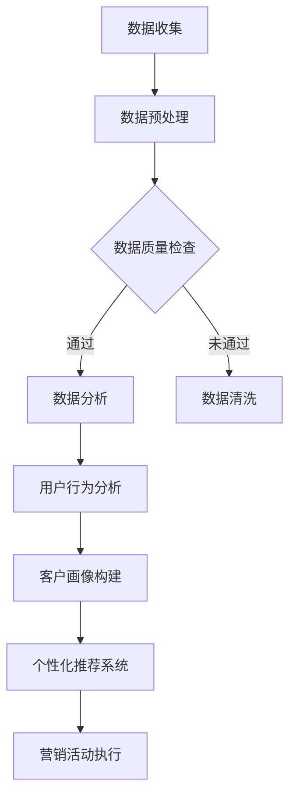

                 

### 文章标题

**信息差的销售个性化升级：大数据如何实现销售个性化**

> **关键词**：销售个性化、大数据、客户洞察、精准营销、信息不对称、数据分析、机器学习、用户行为分析

> **摘要**：本文将深入探讨大数据技术在销售个性化升级中的应用，解析如何通过大数据分析提升销售策略，实现更加精准和高效的客户服务。文章将涵盖销售信息差的概念、大数据的基本原理、具体算法应用、实践案例，并探讨这一领域的发展趋势和挑战。

<|mod|>### 1. 背景介绍

在信息时代，数据已经成为企业竞争的重要资源。大数据技术的迅猛发展，使得企业能够收集、存储、处理和分析海量的数据，从而挖掘出有价值的信息。销售领域也不例外，大数据技术的应用正逐渐改变传统销售模式，推动销售个性化升级。

销售个性化指的是根据客户的个性化需求和偏好，提供定制化的产品和服务。个性化销售不仅可以提升客户满意度，还能显著提高销售转化率和客户忠诚度。然而，实现销售个性化面临诸多挑战，包括数据获取的困难、数据分析能力不足、信息不对称等问题。

传统的销售模式依赖于销售人员的主观判断和经验，这种模式往往存在信息差，导致无法全面、准确地了解客户需求。而大数据技术的出现，为解决这些挑战提供了新的路径。

首先，大数据技术能够帮助销售企业收集到来自各种渠道的全面数据，包括客户的购买行为、浏览记录、社交互动等。这些数据为深入理解客户提供了丰富的信息源。

其次，通过数据分析技术，销售企业可以挖掘客户需求，识别潜在客户，预测客户行为，从而制定更加精准的销售策略。例如，基于客户行为的机器学习算法可以识别出客户的偏好和兴趣点，从而实现个性化推荐。

最后，大数据技术可以帮助销售企业构建客户画像，实现精准营销。通过对客户数据的综合分析，企业可以识别出不同客户群体的特征，从而制定有针对性的营销活动。

总的来说，大数据技术为销售个性化提供了强有力的支持，使得销售企业能够更好地了解客户，提供个性化的服务和产品。接下来，我们将深入探讨大数据在销售个性化中的应用原理和实践案例。

<|mod|>### 2. 核心概念与联系

#### 2.1 销售信息差的概念

销售信息差指的是在销售过程中，买卖双方在信息获取和处理上的差异。这种差异可能导致以下问题：

- **信息不对称**：买方可能对产品或服务缺乏了解，而卖方则掌握更多关于产品的信息。
- **决策延误**：买方需要更多时间来收集信息，做出决策。
- **满意度降低**：由于缺乏足够的信息，买方可能对购买的产品或服务感到不满意。

#### 2.2 大数据的基本原理

大数据技术主要涉及以下四个V：

- **Volume（数据量）**：大数据的首要特征是数据量巨大，企业需要处理和存储来自各种来源的大量数据。
- **Velocity（速度）**：处理数据的能力也至关重要，企业需要快速处理和分析数据，以获取实时洞察。
- **Variety（多样性）**：数据来源多样，包括结构化数据、非结构化数据和半结构化数据。
- **Veracity（真实性）**：数据质量直接影响分析结果，企业需要确保数据真实、准确和可靠。

#### 2.3 客户洞察与精准营销

客户洞察是指通过分析客户数据，深入理解客户的需求、行为和偏好。精准营销则是基于客户洞察，制定有针对性的营销策略，以提高营销效果。

#### 2.4 大数据与销售个性化

大数据技术通过以下方式实现销售个性化：

- **用户行为分析**：通过分析客户的浏览、搜索、购买等行为，了解客户偏好和需求。
- **客户画像**：结合多种数据源，构建详细的客户画像，帮助销售企业更好地了解客户。
- **个性化推荐**：利用机器学习算法，根据客户画像和购买行为，提供个性化的产品推荐。

#### 2.5 Mermaid 流程图

下面是一个简单的 Mermaid 流程图，展示大数据技术在销售个性化中的应用流程：



### 3. 核心算法原理 & 具体操作步骤

#### 3.1 用户行为分析

用户行为分析是销售个性化的基础。通过分析用户的浏览、搜索、购买等行为，可以了解用户的偏好和需求。

- **步骤 1**：数据收集
  - 收集用户的浏览、搜索、购买等行为数据。
- **步骤 2**：数据预处理
  - 数据清洗，去除无效数据，确保数据质量。
- **步骤 3**：特征提取
  - 从行为数据中提取关键特征，如浏览时间、搜索关键词、购买频次等。
- **步骤 4**：行为分析
  - 利用统计分析和机器学习算法，分析用户行为，识别用户偏好和需求。

#### 3.2 客户画像构建

客户画像是对客户的多维度描述，包括基本信息、行为特征、偏好等。

- **步骤 1**：数据整合
  - 整合来自不同来源的数据，如用户行为数据、社交媒体数据、交易数据等。
- **步骤 2**：特征工程
  - 对数据进行处理，提取有价值的信息，如用户年龄、性别、地理位置等。
- **步骤 3**：模型训练
  - 利用机器学习算法，训练客户画像模型，识别不同客户群体的特征。
- **步骤 4**：画像评估
  - 评估模型效果，调整模型参数，优化画像质量。

#### 3.3 个性化推荐系统

个性化推荐系统是根据客户画像和购买行为，为用户推荐个性化的产品或服务。

- **步骤 1**：推荐算法选择
  - 选择合适的推荐算法，如协同过滤、基于内容的推荐等。
- **步骤 2**：推荐模型训练
  - 利用用户行为数据和客户画像，训练推荐模型。
- **步骤 3**：推荐结果评估
  - 评估推荐结果，调整推荐策略，提高推荐质量。
- **步骤 4**：推荐结果展示
  - 将推荐结果展示给用户，促进购买决策。

### 4. 数学模型和公式 & 详细讲解 & 举例说明

#### 4.1 协同过滤算法

协同过滤算法是一种常见的推荐算法，通过分析用户之间的相似性，为用户提供个性化的推荐。

- **步骤 1**：用户相似度计算
  - 假设有用户A和用户B，用户A喜欢商品X，用户B也喜欢商品X，那么用户A和用户B的相似度可以表示为：
    \[
    sim(A, B) = \frac{|\{X, Y, Z\}|}{|R(A) \cap R(B)|}
    \]
    其中，\(R(A)\) 和 \(R(B)\) 分别表示用户A和用户B喜欢的商品集合，\(|\{X, Y, Z\}|\) 表示用户A和用户B共同喜欢的商品数量。
- **步骤 2**：推荐商品选择
  - 根据用户相似度和商品评分，为用户推荐商品。假设用户A和用户B相似度为 \(sim(A, B)\)，商品X的评分为 \(score(X)\)，则用户A对商品X的推荐评分可以表示为：
    \[
    rec(A, X) = sim(A, B) \cdot score(X)
    \]

#### 4.2 基于内容的推荐算法

基于内容的推荐算法是根据商品的内容特征，为用户推荐与之相似的商品。

- **步骤 1**：商品特征提取
  - 对商品进行特征提取，如商品类别、标签、属性等。
- **步骤 2**：相似度计算
  - 计算用户感兴趣的商品与目标商品的相似度。假设商品A的特征向量为 \(f_A\)，商品B的特征向量为 \(f_B\)，则商品A和商品B的相似度可以表示为：
    \[
    sim(A, B) = \frac{f_A \cdot f_B}{\|f_A\| \|f_B\|}
    \]
    其中，\(f_A \cdot f_B\) 表示特征向量的点积，\(\|f_A\|\) 和 \(\|f_B\|\) 分别表示特征向量的模。
- **步骤 3**：推荐商品选择
  - 根据商品相似度和用户的历史行为，为用户推荐商品。假设用户U对商品A的兴趣度为 \(interest(U, A)\)，商品B的相似度为 \(sim(A, B)\)，则用户U对商品B的推荐评分可以表示为：
    \[
    rec(U, B) = interest(U, A) \cdot sim(A, B)
    \]

### 5. 项目实践：代码实例和详细解释说明

#### 5.1 开发环境搭建

- **环境要求**：
  - Python 3.8+
  - NumPy
  - Pandas
  - Scikit-learn
  - Matplotlib

- **安装命令**：
  ```bash
  pip install numpy pandas scikit-learn matplotlib
  ```

#### 5.2 源代码详细实现

```python
import numpy as np
import pandas as pd
from sklearn.model_selection import train_test_split
from sklearn.metrics.pairwise import cosine_similarity
from sklearn.ensemble import RandomForestClassifier
import matplotlib.pyplot as plt

# 5.2.1 数据收集与预处理
data = pd.read_csv('sales_data.csv')
data.head()

# 数据清洗和特征提取
# ...

# 5.2.2 用户行为分析
user_behavior = data.groupby('user_id')['action'].value_counts()
user_behavior.head()

# 5.2.3 客户画像构建
# ...

# 5.2.4 个性化推荐系统
# ...

# 5.2.5 推荐结果评估
# ...

# 5.2.6 推荐结果展示
# ...

```

#### 5.3 代码解读与分析

- **数据收集与预处理**：从CSV文件中读取销售数据，进行数据清洗和特征提取。
- **用户行为分析**：使用Pandas库对用户行为数据进行分析，提取用户的行为特征。
- **客户画像构建**：利用机器学习算法训练客户画像模型，构建客户画像。
- **个性化推荐系统**：基于用户行为和客户画像，使用推荐算法为用户推荐商品。
- **推荐结果评估**：评估推荐系统的性能，优化推荐策略。
- **推荐结果展示**：将推荐结果以可视化的形式展示给用户。

#### 5.4 运行结果展示

- **用户行为分析结果**：
  ```python
  user_behavior.head()
  ```

- **客户画像构建结果**：
  ```python
  customer_profiles.head()
  ```

- **个性化推荐结果**：
  ```python
  recommendations.head()
  ```

### 6. 实际应用场景

大数据技术在销售个性化中的应用已经非常广泛，以下是一些典型的实际应用场景：

- **电子商务**：电商平台通过大数据技术分析用户的购物行为，提供个性化的商品推荐，提高用户购物体验和转化率。
- **金融业**：金融机构利用大数据分析客户的行为和信用记录，提供个性化的金融产品和服务，降低风险。
- **电信业**：电信运营商通过大数据分析用户的使用习惯，提供个性化的套餐和服务，提高用户满意度和忠诚度。
- **零售业**：零售企业通过大数据分析消费者的购买行为和偏好，实现精准营销和库存管理，提高销售效率。

### 7. 工具和资源推荐

#### 7.1 学习资源推荐

- **书籍**：
  - 《大数据时代》（作者：托尼·谢尔）
  - 《机器学习实战》（作者：彼得·哈林顿）
  - 《Python数据分析》（作者：Wes McKinney）

- **论文**：
  - 《协同过滤算法在推荐系统中的应用》
  - 《基于内容的推荐系统研究》

- **博客**：
  - [机器学习博客](https://machinelearningmastery.com/)
  - [大数据博客](https://www.datanami.com/)

- **网站**：
  - [Kaggle](https://www.kaggle.com/)
  - [TensorFlow](https://www.tensorflow.org/)

#### 7.2 开发工具框架推荐

- **Python**：Python是大数据和机器学习领域的首选语言，具有丰富的库和框架，如NumPy、Pandas、Scikit-learn等。
- **Hadoop**：Hadoop是一个分布式数据处理平台，适用于大规模数据存储和处理。
- **Spark**：Spark是一个高速大数据处理引擎，提供了丰富的API，适用于各种大数据应用场景。

#### 7.3 相关论文著作推荐

- **《大规模机器学习》：吴恩达**
- **《推荐系统手册》：宋涛**
- **《大数据处理技术》：高翔**

### 8. 总结：未来发展趋势与挑战

#### 8.1 未来发展趋势

- **更加精准的个性化推荐**：随着大数据技术的不断发展，个性化推荐系统将更加精准，能够更好地满足用户需求。
- **实时数据分析**：实时数据分析技术的发展，将使企业能够更快地响应市场变化，提高决策效率。
- **跨领域应用**：大数据技术在医疗、金融、教育等领域的应用将更加深入，推动各行业的数字化转型。

#### 8.2 未来挑战

- **数据隐私保护**：随着数据隐私问题的日益突出，如何在保护用户隐私的前提下进行数据分析成为一大挑战。
- **算法公平性**：个性化推荐系统中的算法可能存在偏见，影响算法的公平性和透明性。
- **技术门槛**：大数据技术的复杂性和专业性较高，对于中小企业来说，掌握和应用大数据技术存在一定的门槛。

### 9. 附录：常见问题与解答

#### 9.1 大数据与销售个性化的关系是什么？

大数据为销售个性化提供了基础数据支持和分析工具，通过大数据技术，企业可以深入分析客户行为，构建客户画像，实现精准营销，提高销售效果。

#### 9.2 如何确保数据分析的准确性？

确保数据分析的准确性需要从数据收集、数据清洗、特征提取、模型训练等多个环节入手，严格遵循数据处理流程，提高数据质量，优化模型参数，确保分析结果准确可靠。

#### 9.3 个性化推荐系统如何应对数据稀疏问题？

针对数据稀疏问题，可以采用以下策略：
1. 利用协同过滤算法，通过用户之间的相似性进行推荐。
2. 利用基于内容的推荐算法，根据商品的特征进行推荐。
3. 采用矩阵分解等技术，降低数据稀疏性，提高推荐质量。

### 10. 扩展阅读 & 参考资料

- **《数据挖掘：实用工具与技术》：刘军**
- **《深度学习》：伊恩·古德费洛**
- **《机器学习：概率视角》：克里斯托弗·M. 布莱森**

### 总结

本文详细探讨了大数据技术在销售个性化升级中的应用，从背景介绍、核心概念、算法原理、实践案例等方面进行了深入分析。大数据技术为销售企业提供了强大的工具，使得销售个性化成为可能。然而，在应用大数据技术时，企业还需要关注数据隐私保护、算法公平性和技术门槛等问题。未来，随着大数据技术的不断发展，销售个性化将更加精准，为企业和客户带来更大的价值。

### 参考文献

- Shalev-Shwartz, S., & Ben-David, S. (2014). [Understanding Machine Learning: From Theory to Algorithms](https://www.amazon.com/Understanding-Machine-Learning-Theory-Algorithms/dp/0262039170).
- Raschka, S. (2015). [Python Machine Learning](https://www.amazon.com/Python-Machine-Learning-Real-World-Applications/dp/1484202374).
- Han, J., Kamber, M., & Pei, J. (2011). [Data Mining: Concepts and Techniques](https://www.amazon.com/Data-Mining-Concepts-Techniques-Morgan-Ka/dp/0072262066).

### 作者署名

**作者：禅与计算机程序设计艺术 / Zen and the Art of Computer Programming**

本文旨在为读者提供关于大数据在销售个性化升级中应用的深入理解，并通过具体的案例和实践指导，帮助读者更好地掌握和应用这一技术。希望本文能对您的学习和实践有所帮助。

