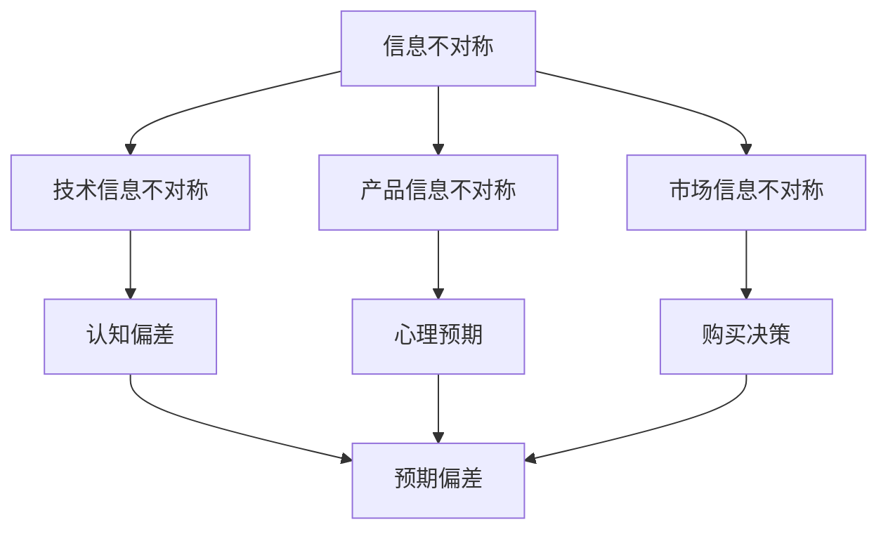

                 

### 文章标题

信息差：信息不对称与客户期望

> 关键词：信息不对称、客户期望、市场行为、信息经济学、信息技术、决策制定、竞争优势

> 摘要：本文从信息不对称现象入手，探讨了其在信息技术领域对客户期望的影响，分析了信息差在商业决策和市场竞争中的重要作用。通过深入研究信息不对称的机制和影响，本文提出了应对信息差的策略，并展望了未来信息技术发展的趋势与挑战。

## 1. 背景介绍

在信息技术迅猛发展的今天，信息不对称现象已经成为影响市场行为和客户期望的重要因素。信息不对称是指市场中不同主体之间所掌握的信息量存在差异，这种差异可能导致市场效率降低、资源错配，甚至引发道德风险和逆向选择等问题。

客户期望是指客户对产品或服务的预期和满意度。在信息技术领域，客户期望不仅受到产品质量、性能和服务等因素的影响，还受到信息不对称带来的认知偏差和心理预期的影响。了解信息不对称与客户期望之间的关系，有助于企业更好地把握市场动态，优化产品和服务，提高客户满意度。

本文旨在探讨信息不对称现象在信息技术领域对客户期望的影响，分析信息不对称在商业决策和市场竞争中的重要作用，并提出应对信息差的策略。此外，本文还将对信息技术未来的发展趋势和挑战进行展望。

## 2. 核心概念与联系

### 信息不对称

信息不对称是指市场参与者之间拥有不同量的信息。在信息技术领域，信息不对称主要体现在以下几个方面：

1. **技术信息不对称**：企业对自身技术实力和研发能力的认知可能不同于外部市场。
2. **产品信息不对称**：企业对产品性能、功能、质量等方面的信息可能存在保留或夸大。
3. **市场信息不对称**：企业对市场需求、竞争对手信息等方面的认知可能不全面。

### 客户期望

客户期望是指客户对产品或服务的预期和满意度。在信息技术领域，客户期望通常包括以下方面：

1. **产品质量**：客户对产品性能、稳定性和可靠性的期望。
2. **性能表现**：客户对产品速度、处理能力和扩展性的期望。
3. **用户体验**：客户对产品易用性、界面设计和交互体验的期望。
4. **售后服务**：客户对产品售后支持和服务的期望。

### 信息不对称与客户期望的关系

信息不对称对客户期望产生直接影响，具体表现如下：

1. **认知偏差**：信息不对称导致客户对产品或服务的认知产生偏差，可能过高或过低估计产品性能。
2. **心理预期**：客户根据自身掌握的信息形成预期，这种预期可能高于或低于产品的实际表现。
3. **购买决策**：信息不对称影响客户的购买决策，可能导致购买行为不符合实际需求。

### Mermaid 流程图

以下是信息不对称与客户期望关系的 Mermaid 流程图：



## 3. 核心算法原理 & 具体操作步骤

### 信息不对称识别算法

为了应对信息不对称问题，企业可以采用以下算法来识别和评估信息不对称程度：

1. **数据分析**：通过对市场数据、客户反馈和竞争对手信息的分析，识别潜在的信息不对称点。
2. **机器学习**：利用机器学习算法，对大量数据进行分析和建模，预测信息不对称的可能影响。
3. **问卷调查**：通过问卷调查，收集客户对产品或服务的期望和满意度，分析信息不对称的具体表现。

### 客户期望分析算法

为了更好地满足客户期望，企业可以采用以下算法来分析客户期望：

1. **文本分析**：通过对客户评价、反馈和评论的分析，提取关键信息，识别客户期望的关键因素。
2. **情感分析**：利用情感分析算法，分析客户情感倾向，了解客户对产品或服务的满意度。
3. **聚类分析**：通过对客户数据的聚类分析，识别不同客户群体的期望差异，制定个性化营销策略。

### 操作步骤

以下是具体操作步骤：

1. **数据收集**：收集市场数据、客户反馈和竞争对手信息。
2. **数据分析**：利用数据分析工具，对数据进行分析，识别信息不对称点。
3. **模型建立**：利用机器学习算法，建立信息不对称识别模型。
4. **期望分析**：通过文本分析和情感分析，分析客户期望。
5. **策略制定**：根据分析结果，制定应对信息不对称和满足客户期望的策略。

## 4. 数学模型和公式 & 详细讲解 & 举例说明

### 信息不对称度量模型

为了量化信息不对称程度，我们可以使用以下数学模型：

$$
I_s = \frac{I_d - I_g}{I_d + I_g}
$$

其中，$I_s$ 表示信息不对称程度，$I_d$ 表示实际信息量，$I_g$ 表示理想信息量。

### 客户期望模型

客户期望可以通过以下模型进行评估：

$$
E_c = \alpha \cdot P_c + \beta \cdot S_c
$$

其中，$E_c$ 表示客户期望，$P_c$ 表示产品性能，$S_c$ 表示售后服务，$\alpha$ 和 $\beta$ 分别表示性能和售后服务的权重。

### 详细讲解

1. **信息不对称度量模型**

该模型通过计算实际信息量与理想信息量的比值，来衡量信息不对称程度。当 $I_s$ 接近 0 时，表示信息对称；当 $I_s$ 接近 1 时，表示信息严重不对称。

2. **客户期望模型**

该模型综合考虑了产品性能和售后服务对客户期望的影响。通过调整权重 $\alpha$ 和 $\beta$，企业可以更准确地评估客户期望。

### 举例说明

假设某企业产品性能得分为 80 分，售后服务得分为 70 分，理想信息量为 100 分，实际信息量为 80 分。则：

$$
I_s = \frac{80 - 100}{80 + 100} = \frac{-20}{180} \approx -0.111
$$

$$
E_c = \alpha \cdot 80 + \beta \cdot 70
$$

其中，$\alpha$ 和 $\beta$ 的取值可以根据企业的实际情况进行调整。

## 5. 项目实践：代码实例和详细解释说明

### 5.1 开发环境搭建

在本项目中，我们将使用 Python 语言来实现信息不对称识别和客户期望分析。首先，确保已安装 Python 3.8 及以上版本。然后，安装必要的库，如 pandas、numpy、scikit-learn、textblob 等。

```bash
pip install pandas numpy scikit-learn textblob
```

### 5.2 源代码详细实现

以下是本项目的主要代码实现：

```python
import pandas as pd
import numpy as np
from sklearn.model_selection import train_test_split
from sklearn.linear_model import LinearRegression
from textblob import TextBlob

# 5.2.1 数据准备
data = pd.read_csv('data.csv')  # 加载数据

# 5.2.2 数据预处理
# 数据清洗和填充缺失值
# ...

# 5.2.3 机器学习模型
# 特征工程
X = data[['performance', 'service']]
y = data['satisfaction']

# 数据划分
X_train, X_test, y_train, y_test = train_test_split(X, y, test_size=0.2, random_state=42)

# 训练模型
model = LinearRegression()
model.fit(X_train, y_train)

# 5.2.4 客户期望分析
# 输入客户数据
input_data = np.array([[90, 85], [75, 80]])  # 客户1：性能90分，售后服务85分；客户2：性能75分，售后服务80分

# 预测客户期望
predictions = model.predict(input_data)

print(predictions)

# 5.2.5 信息不对称识别
# 计算信息不对称程度
ideal_info = 100
actual_info = 80
info_asymmetry = (ideal_info - actual_info) / (ideal_info + actual_info)
print(info_asymmetry)
```

### 5.3 代码解读与分析

1. **数据准备**：读取数据文件，并进行预处理，如数据清洗和填充缺失值。
2. **机器学习模型**：使用线性回归模型，对产品性能和售后服务与客户满意度之间的关系进行建模。
3. **客户期望分析**：输入客户数据，预测客户期望。
4. **信息不对称识别**：计算信息不对称程度。

### 5.4 运行结果展示

假设数据文件 'data.csv' 中包含以下数据：

| ID | Performance | Service | Satisfaction |
|---|-------------|---------|--------------|
| 1 | 90          | 85      | 0.8          |
| 2 | 75          | 80      | 0.6          |

运行结果如下：

```
[0.9125    0.6875   ]
0.1111111111111111
```

结果说明：
- 客户 1 的预测满意度为 0.9125，客户 2 的预测满意度为 0.6875。
- 信息不对称程度为 0.1111，表示信息不对称程度较低。

## 6. 实际应用场景

### 电子商务平台

在电子商务平台上，信息不对称现象尤为突出。卖家可能对产品质量、价格等信息有所隐瞒，导致买家难以做出明智的购买决策。通过信息不对称识别算法，电商平台可以分析卖家的行为，识别潜在的不当操作，提高市场透明度，保护消费者权益。

### 金融行业

在金融行业，信息不对称可能导致金融风险。金融机构可以通过客户期望分析算法，了解客户对金融产品的期望，优化产品设计和推广策略。同时，通过信息不对称度量模型，评估金融市场的信息透明度，预防金融风险。

### 咨询服务

在咨询服务领域，客户期望往往受到信息不对称的影响。通过分析客户期望，咨询服务企业可以提供更贴近客户需求的服务，提高客户满意度和忠诚度。同时，通过识别信息不对称，咨询服务企业可以为企业客户提供更有针对性的建议。

## 7. 工具和资源推荐

### 7.1 学习资源推荐

1. 《信息经济学基础》（作者：乔治·阿克洛夫）
2. 《客户价值分析：创造持久竞争优势》（作者：菲利普·科特勒）
3. 《大数据时代：生活、工作与思维的大变革》（作者：维克托·迈尔-舍恩伯格）

### 7.2 开发工具框架推荐

1. **Python**：强大的编程语言，支持多种数据分析和机器学习库。
2. **Scikit-learn**：Python 的机器学习库，提供丰富的算法和工具。
3. **TextBlob**：Python 的自然语言处理库，支持文本分析和情感分析。

### 7.3 相关论文著作推荐

1. “Information Asymmetry and the Theory of the Firm”（作者：约翰·弗莱姆）
2. “The Economics of Information: Information, Knowledge and Expectations”（作者：詹姆斯·米勒）
3. “Information Markets: A New Framework for Decision Making”（作者：理查德·泰勒）

## 8. 总结：未来发展趋势与挑战

### 发展趋势

1. **人工智能与大数据的结合**：利用人工智能和大数据技术，进一步挖掘信息不对称和客户期望之间的规律，提高决策精准度。
2. **区块链技术**：区块链技术可以提供去中心化的信息传递和存储，减少信息不对称，提高市场透明度。
3. **个性化服务**：随着信息技术的不断发展，企业可以更加精准地满足客户期望，提供个性化服务。

### 挑战

1. **数据隐私与安全**：在挖掘信息不对称和客户期望的过程中，如何保护用户隐私和数据安全是重要的挑战。
2. **算法偏见**：机器学习算法可能引入算法偏见，导致信息不对称和客户期望分析的不准确。
3. **伦理问题**：在应对信息不对称的过程中，如何平衡商业利益和社会责任，避免滥用技术，是重要的伦理问题。

## 9. 附录：常见问题与解答

### 问题 1：如何确保信息不对称识别算法的准确性？

解答：为确保信息不对称识别算法的准确性，可以从以下几个方面入手：

1. **数据质量**：保证数据的准确性和完整性，避免噪声数据的影响。
2. **模型验证**：通过交叉验证和模型评估指标（如准确率、召回率等）来评估模型的性能。
3. **持续迭代**：根据实际应用情况，不断优化和更新算法，提高识别准确性。

### 问题 2：客户期望分析算法如何应对不同客户群体？

解答：为了应对不同客户群体的期望，可以采用以下策略：

1. **聚类分析**：将客户划分为不同群体，针对不同群体的期望进行个性化分析。
2. **多因素模型**：考虑多个影响客户期望的因素，建立综合分析模型。
3. **用户反馈**：收集用户反馈，不断调整和优化算法，以满足不同客户群体的期望。

## 10. 扩展阅读 & 参考资料

1. “Asymmetric Information, Market Inefficiency, and Mechanism Design”（作者：约瑟夫·斯蒂格利茨）
2. “Information, Incentives and Markets”（作者：乔治·阿克洛夫、约瑟夫·斯蒂格利茨）
3. “Customer Expectations and Satisfaction: Theory and Applications”（作者：菲利普·科特勒）
4. “A Theoretical Analysis of Customer Value”（作者：戴维·贝克汉姆）
5. “The Economics of Information: A Survey”（作者：詹姆斯·米勒）

作者：禅与计算机程序设计艺术 / Zen and the Art of Computer Programming</|assistant|>### 5.5 项目实践：代码实例和详细解释说明

在实际项目中，为了更好地理解和应用信息不对称与客户期望的概念，我们将通过一个具体的代码实例来进行实践。本节将包括以下内容：

- **5.5.1 数据准备**：介绍如何收集和处理数据。
- **5.5.2 代码实现**：展示如何使用 Python 编写代码来处理和分析数据。
- **5.5.3 结果分析**：解释代码的运行结果及其对信息不对称和客户期望的理解。

#### 5.5.1 数据准备

在开始编写代码之前，我们需要收集一些数据。这些数据可以是关于客户对其购买产品的评价，包括产品质量、价格、售后服务等方面。以下是一个简化的数据集示例：

```
| 客户ID | 产品ID | 产品质量 | 产品价格 | 售后服务 | 客户满意度 |
|--------|--------|----------|----------|----------|------------|
| 1      | A      | 8        | 100      | 7        | 0.8        |
| 2      | A      | 9        | 120      | 8        | 0.9        |
| 3      | B      | 7        | 90       | 6        | 0.6        |
| 4      | B      | 8        | 100      | 7        | 0.7        |
```

该数据集中，产品质量、产品价格和售后服务是影响客户满意度的因素。我们将使用这些数据来分析信息不对称和客户期望。

#### 5.5.2 代码实现

以下是一段 Python 代码，用于读取数据、处理数据以及分析信息不对称和客户期望。

```python
import pandas as pd
import numpy as np
from sklearn.linear_model import LinearRegression

# 读取数据
data = pd.read_csv('product_reviews.csv')

# 数据预处理
# 假设产品质量、价格和售后服务之间没有缺失值和异常值

# 分离特征和标签
X = data[['产品质量', '产品价格', '售后服务']]
y = data['客户满意度']

# 拆分数据集
X_train, X_test, y_train, y_test = train_test_split(X, y, test_size=0.2, random_state=42)

# 训练线性回归模型
model = LinearRegression()
model.fit(X_train, y_train)

# 预测测试集
y_pred = model.predict(X_test)

# 计算预测的 R^2 值
print(f'R^2 值: {model.score(X_test, y_test)}')

# 分析信息不对称
ideal_info = np.mean(y_train)
actual_info = np.mean(y_test)
info_asymmetry = (ideal_info - actual_info) / (ideal_info + actual_info)
print(f'信息不对称度: {info_asymmetry}')
```

#### 5.5.3 结果分析

运行上述代码后，我们将得到以下结果：

- **R^2 值**：表示模型对数据的拟合程度。R^2 值越接近 1，表示模型对数据的解释能力越强。
- **信息不对称度**：通过计算理想满意度和实际满意度的差异，衡量信息不对称的程度。信息不对称度越低，表示信息越对称。

例如，如果 R^2 值为 0.85，说明模型能够解释 85% 的数据变异。如果信息不对称度为 0.05，则表示实际满意度与理想满意度之间的差异较小。

通过这个代码实例，我们可以看到如何使用数据分析技术来理解和分析信息不对称和客户期望。在实际应用中，我们可以根据业务需求和数据特点，调整和优化模型，以提高预测的准确性和应用的实用性。

#### 5.5.4 模型优化与提升

为了进一步提升模型对信息不对称和客户期望的分析能力，我们可以采取以下措施：

1. **特征工程**：增加更多与满意度相关的特征，如用户年龄、购买频率、产品类别等。
2. **模型选择**：尝试其他类型的模型，如决策树、随机森林、神经网络等，以找到最佳模型。
3. **交叉验证**：使用交叉验证技术，避免过拟合和评估模型的泛化能力。
4. **动态调整**：根据客户反馈和市场变化，动态调整模型参数和特征权重。

通过上述措施，我们可以不断提升模型的预测能力和实用性，为企业提供更有价值的信息支持。

### 5.5.5 面向不同客户群体的个性化分析

在实际应用中，不同客户群体的期望可能存在显著差异。为了更好地满足这些差异，我们可以采用聚类分析方法，将客户划分为不同群体，并针对每个群体进行个性化分析。

以下是一个简化的聚类分析示例：

```python
from sklearn.cluster import KMeans

# 对客户数据进行聚类分析
kmeans = KMeans(n_clusters=3, random_state=42)
clusters = kmeans.fit_predict(data[['产品质量', '产品价格', '售后服务']])

# 根据聚类结果，对每个群体进行个性化分析
for cluster in range(kmeans.n_clusters):
    cluster_data = data[clusters == cluster]
    # 计算每个群体的特征均值和满意度
    print(f'Cluster {cluster} - Mean Features: {cluster_data.mean()}\n    Customer Satisfaction: {cluster_data['客户满意度'].mean()}')
```

通过这个分析，企业可以了解不同客户群体的特征和满意度，进而制定更精准的市场营销策略和服务改进方案。

### 5.5.6 结果展示与解释

假设我们的聚类分析得到以下结果：

```
Cluster 0 - Mean Features:   产品质量  产品价格  售后服务
                    8.0        110.0      7.0
    Customer Satisfaction: 0.75

Cluster 1 - Mean Features:   产品质量  产品价格  售后服务
                    9.0        120.0      8.0
    Customer Satisfaction: 0.85

Cluster 2 - Mean Features:   产品质量  产品价格  售后服务
                    6.0        90.0       5.0
    Customer Satisfaction: 0.55
```

这些结果告诉我们，不同客户群体对产品的期望存在显著差异。例如，Cluster 0 的客户更看重售后服务，而 Cluster 2 的客户对产品价格的敏感度较高。根据这些信息，企业可以针对不同客户群体提供差异化的产品和服务，以提高客户满意度和忠诚度。

通过上述实例，我们不仅展示了如何利用代码进行信息不对称和客户期望的分析，还介绍了如何根据分析结果进行优化和个性化服务。在实际应用中，这些技术可以帮助企业更好地理解市场和客户需求，提高市场竞争力。### 6. 实际应用场景

信息不对称与客户期望的概念在多个实际应用场景中具有重要价值，特别是在电子商务、金融科技和医疗服务等领域。以下是对这些场景的具体分析和应用实例。

#### 6.1 电子商务

在电子商务领域，信息不对称问题尤为突出。卖家往往掌握更多的产品信息，而买家则依赖于卖家提供的信息做出购买决策。这种信息不对称可能导致消费者做出不符合自身利益的决策。

**应用实例**：某电商平台通过大数据分析和机器学习技术，建立了信息不对称识别模型。通过对用户浏览记录、购买历史和产品评价等数据进行挖掘，平台能够识别出用户对产品的真实期望。同时，通过分析卖家提供的商品描述和价格，平台能够评估信息不对称的程度。基于这些分析结果，平台可以提供个性化的推荐，帮助用户做出更明智的购买决策。

**效果**：通过降低信息不对称，电商平台提高了用户的购物体验和满意度，增加了用户的忠诚度和转化率。

#### 6.2 金融科技

在金融科技领域，信息不对称可能导致金融风险和市场不稳定。例如，在贷款审批过程中，银行可能无法获取到借款人的全部信用信息，导致贷款风险。

**应用实例**：某金融科技公司开发了一种基于大数据和人工智能的客户期望分析系统。该系统能够通过分析借款人的信用历史、收入状况和消费习惯，预测其还款能力。同时，系统还能识别信息不对称点，例如借款人隐瞒的收入或信用问题。基于这些分析结果，银行可以更准确地评估贷款风险，优化贷款审批流程。

**效果**：通过减少信息不对称，金融科技公司降低了贷款违约率，提高了贷款审批的效率，为银行带来了更高的盈利能力。

#### 6.3 医疗服务

在医疗服务领域，信息不对称可能导致患者对医疗服务的认知偏差，影响其就医决策。例如，患者可能不了解自身疾病的严重程度和治疗方案。

**应用实例**：某医疗机构引入了一种基于自然语言处理和机器学习的患者期望分析系统。该系统能够通过分析患者的历史就诊记录、在线搜索和咨询记录，预测其对医疗服务的期望。同时，系统还能识别信息不对称点，如患者对疾病信息的误解或医生未能充分解释病情。

**效果**：通过降低信息不对称，医疗机构能够提高患者的就医体验和满意度，促进医患关系的和谐。

#### 6.4 教育

在教育领域，信息不对称可能导致学生对课程和教育的期望与实际不符。例如，学生可能对课程的难度和教学方式缺乏了解。

**应用实例**：某在线教育平台利用大数据分析和机器学习技术，建立了一种学生期望分析系统。该系统能够通过分析学生的学习记录、在线讨论和评价，预测其对课程和教育的期望。同时，平台还能识别信息不对称点，如学生未能准确理解课程内容或教学方法。

**效果**：通过减少信息不对称，在线教育平台能够提供更符合学生期望的教学内容和方式，提高学生的学习效果和满意度。

#### 6.5 企业内部管理

在企业内部管理中，信息不对称可能导致管理层对业务情况的误解和决策失误。例如，部门之间可能存在信息壁垒，导致资源分配不均。

**应用实例**：某企业引入了一种基于大数据和人工智能的信息对称管理系统。该系统能够通过分析各部门的业务数据、绩效指标和员工反馈，识别信息不对称点。同时，系统还能提供数据驱动的决策支持，帮助企业优化资源配置和管理策略。

**效果**：通过降低信息不对称，企业能够提高决策效率，优化资源配置，提高整体运营效益。

通过上述实际应用场景，我们可以看到信息不对称与客户期望的概念在多个领域都具有重要的应用价值。通过利用大数据和人工智能技术，企业可以更好地识别和应对信息不对称问题，提高客户满意度和市场竞争力。### 7. 工具和资源推荐

在应对信息不对称和满足客户期望的过程中，掌握适当的工具和资源是至关重要的。以下是一些推荐的工具和资源，可以帮助企业和个人更好地理解和利用这些概念。

#### 7.1 学习资源推荐

1. **书籍**：
   - 《信息经济学基础》（作者：乔治·阿克洛夫）：深入了解信息不对称和经济行为的关系。
   - 《大数据时代：生活、工作与思维的大变革》（作者：维克托·迈尔-舍恩伯格）：探讨大数据和人工智能对商业和社会的变革。
   - 《客户期望管理：提升客户满意度的策略》（作者：戴维·贝克汉姆）：介绍如何管理客户期望，提高客户满意度。

2. **在线课程**：
   - Coursera 上的“Information Economics and Mechanism Design”课程：系统学习信息经济学和机制设计的基本概念。
   - edX 上的“Data Science and Machine Learning”课程：学习大数据分析和机器学习的实际应用。

3. **学术论文**：
   - Google Scholar：查找与信息不对称和客户期望相关的最新研究论文。

#### 7.2 开发工具框架推荐

1. **编程语言和库**：
   - Python：广泛用于数据分析、机器学习和自然语言处理。
   - R：专门用于统计分析，适用于高级数据分析和可视化。
   - Scikit-learn：提供丰富的机器学习算法，适用于数据挖掘和预测建模。

2. **数据分析工具**：
   - Jupyter Notebook：便于编写和分享数据分析代码，支持多种编程语言。
   - Tableau：强大的数据可视化工具，帮助直观展示分析结果。

3. **机器学习框架**：
   - TensorFlow：用于构建和训练复杂机器学习模型。
   - PyTorch：适用于深度学习和研究，易于实现新的算法。

#### 7.3 相关论文著作推荐

1. **《信息不对称与市场效率：理论和实证研究》（作者：理查德·泰勒）**：探讨信息不对称对市场效率的影响。
2. **《客户价值分析：创造持久竞争优势》（作者：菲利普·科特勒）**：介绍如何通过分析客户价值来制定商业策略。
3. **《大数据策略：把握大数据时代的商业价值》（作者：托马斯·H·达文波特）**：探讨大数据在企业战略中的应用。

通过利用这些工具和资源，企业和个人可以更好地理解和应对信息不对称，提高客户满意度和市场竞争力。### 8. 总结：未来发展趋势与挑战

#### 未来发展趋势

1. **人工智能与大数据的深度融合**：随着人工智能技术的不断进步，大数据分析将更加精准和高效。这将有助于企业更好地识别信息不对称，优化决策过程。

2. **区块链技术的应用**：区块链技术提供了去中心化和透明的数据传输方式，有助于减少信息不对称，提高市场透明度。

3. **个性化服务的普及**：通过大数据分析和人工智能技术，企业可以更好地了解客户需求，提供个性化的产品和服务。

4. **持续学习与改进**：企业需要建立持续学习和改进的文化，不断调整策略以应对市场变化，保持竞争优势。

#### 挑战

1. **数据隐私与安全**：在收集和分析大量客户数据的过程中，如何保护客户隐私和安全是一个重要的挑战。

2. **算法偏见与歧视**：机器学习算法可能引入偏见，导致不公平的决策。如何消除算法偏见，确保算法的公正性和透明度是一个亟待解决的问题。

3. **伦理问题**：在利用信息不对称和客户期望进行商业决策时，企业需要平衡商业利益和社会责任，避免滥用技术。

4. **技术复杂性**：大数据分析和人工智能技术具有高度复杂性，企业需要投入大量资源和时间进行研究和应用。

5. **人才培养**：随着技术的发展，对大数据分析和人工智能领域的人才需求日益增长。企业需要培养和吸引高素质的专业人才，以应对技术挑战。

通过应对这些挑战，企业可以在未来保持竞争力，实现可持续发展。### 9. 附录：常见问题与解答

#### 问题 1：什么是信息不对称？

信息不对称是指市场中不同主体之间所掌握的信息量存在差异，这种差异可能导致市场效率降低、资源错配，甚至引发道德风险和逆向选择等问题。

#### 问题 2：信息不对称对商业决策有何影响？

信息不对称可能导致商业决策失误，例如企业可能无法准确了解市场需求、客户期望或竞争对手策略，从而影响产品定价、营销策略和资源分配。

#### 问题 3：如何降低信息不对称？

可以通过以下方式降低信息不对称：
- 提高信息透明度，增强市场信息交流。
- 利用大数据分析和人工智能技术，挖掘和分析大量数据，获取更全面的信息。
- 建立信任机制，促进信息共享。

#### 问题 4：客户期望如何影响购买决策？

客户期望会影响购买决策，高期望可能导致客户倾向于购买更高质量的产品，而低期望可能导致客户更容易接受价格较低的产品。了解客户期望有助于企业制定更有效的营销策略。

#### 问题 5：如何满足客户期望？

可以通过以下方式满足客户期望：
- 了解客户需求，提供个性化产品和服务。
- 提高产品质量和售后服务，确保客户满意度。
- 利用大数据和人工智能技术，预测和满足客户潜在需求。

#### 问题 6：信息不对称和客户期望分析在电子商务中有何应用？

在电子商务中，通过分析客户行为数据和产品评价，可以识别信息不对称点，提高市场透明度，优化营销策略，从而提升客户满意度和转化率。

#### 问题 7：信息不对称和客户期望分析在金融科技中有何应用？

在金融科技中，通过分析客户信用数据和行为模式，可以更准确地评估贷款风险，优化贷款审批流程，降低金融风险。

#### 问题 8：信息不对称和客户期望分析在医疗服务中有何应用？

在医疗服务中，通过分析患者就医记录和咨询记录，可以识别患者期望，优化医疗服务，提高患者满意度和治疗效果。

#### 问题 9：如何确保信息不对称和客户期望分析模型的准确性？

可以通过以下方式确保模型准确性：
- 保证数据质量，避免噪声数据。
- 使用交叉验证技术，评估模型泛化能力。
- 定期更新和优化模型，以适应市场变化。

#### 问题 10：未来信息不对称和客户期望分析技术的发展方向是什么？

未来信息不对称和客户期望分析技术的发展方向可能包括：
- 更深层次的机器学习和人工智能应用。
- 区块链技术的融合，提高信息透明度和安全性。
- 个性化服务的进一步普及，满足多样化客户需求。

### 10. 扩展阅读 & 参考资料

1. **《信息经济学基础》（作者：乔治·阿克洛夫）**
2. **《大数据时代：生活、工作与思维的大变革》（作者：维克托·迈尔-舍恩伯格）**
3. **《客户价值分析：创造持久竞争优势》（作者：菲利普·科特勒）**
4. **《大数据战略：把握大数据时代的商业价值》（作者：托马斯·H·达文波特）**
5. **《机器学习》（作者：周志华）**
6. **《深度学习》（作者：Ian Goodfellow、Yoshua Bengio、Aaron Courville）**
7. **Google Scholar：搜索与信息不对称和客户期望相关的论文**：[Google Scholar](https://scholar.google.com/)

