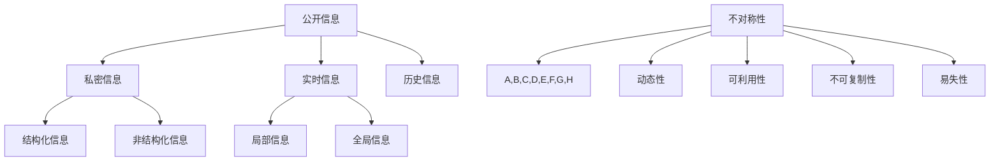

                 

### 1. 背景介绍

信息差，是一个广泛存在于各个领域中的概念，尤其在市场经济学和商业管理中具有重要地位。它指的是在市场中，不同个体或组织之间拥有的信息不对称性。这种不对称性会导致一些个体或组织在决策和行动上具有优势，从而获得更高的经济利益。

信息差的产生有多种原因。首先，信息的获取和传播需要时间和成本。在互联网和大数据时代之前，信息的获取和传播速度较慢，许多信息可能只被少数人掌握。其次，个体和组织之间的信息获取能力存在差异，一些企业可能具备更强的信息处理和分析能力。此外，信息本身具有私密性，一些关键信息可能仅限于特定个体或组织内部共享。

信息差的存在对市场和经济产生了深远影响。一方面，信息优势者能够更好地预测市场趋势，制定更有效的策略，从而获得更高的利润。另一方面，信息劣势者可能会面临被剥削的风险，无法公平地参与市场竞争。因此，减少信息差，促进信息的公平和透明，成为了当今社会的重要课题。

本文将围绕信息差这一核心概念，深入探讨其在市场定位中的作用和影响。我们将首先介绍信息差的定义和特征，然后分析信息差产生的原因和表现形式。接着，我们将讨论信息差对市场的影响，特别是对消费者和企业的双重影响。最后，我们将探讨如何利用信息差进行市场定位，并通过实际案例进行说明。

通过本文的阅读，读者将全面了解信息差的概念、特征、影响以及利用方法，从而在商业决策和市场竞争中更好地把握信息优势，实现个人和企业的长期发展。

### 2. 核心概念与联系

#### 2.1 信息差的定义

信息差，指的是在市场中，不同个体或组织之间拥有的信息不对称性。具体来说，信息差是指一方掌握了另一方没有的信息，或者一方能够更快、更准确地处理信息。这种不对称性可能会导致市场行为和结果的显著差异。在经济学中，信息差通常被描述为“信息优势”或“信息不对称”。

#### 2.2 信息差的类型

信息差可以按照不同的维度进行分类。根据信息来源的不同，可以分为以下几种类型：

1. **公开信息与私密信息**
   - 公开信息是指那些在市场上广泛传播、公开可得的信息，如市场价格、行业趋势等。
   - 私密信息则是指只有少数人或特定组织能够掌握的信息，如内部报告、客户数据、研发进展等。

2. **实时信息与历史信息**
   - 实时信息是指当前时刻的市场状况和趋势，如实时交易数据、市场情绪等。
   - 历史信息则是指过去一段时期的市场状况和趋势，如历史价格走势、以往的行业报告等。

3. **结构化信息与非结构化信息**
   - 结构化信息是指那些已经经过分类、整理和结构化的信息，如数据库、报表等。
   - 非结构化信息是指那些未经过分类、整理和结构化的信息，如文本、图片、视频等。

4. **局部信息与全局信息**
   - 局部信息是指个体或组织所关注的特定领域或局部市场的信息，如某一地区的产品需求、特定消费者的购买习惯等。
   - 全局信息则是指整个市场或行业的整体状况和趋势，如宏观经济发展、全球市场动态等。

#### 2.3 信息差的特征

信息差具有以下几个显著特征：

1. **不对称性**
   - 信息差的核心特征是不对称性，即一方拥有另一方没有的信息。这种不对称性可能导致市场行为和结果的不均衡。

2. **动态性**
   - 信息差是动态变化的。随着时间、市场环境和技术的不断变化，信息的分布和对称性也会发生变化。

3. **可利用性**
   - 信息差具有可利用性。信息优势者可以利用掌握的信息来制定更有效的决策，从而获得更高的经济利益。

4. **不可复制性**
   - 信息差往往具有不可复制性。即使信息被部分披露，其核心价值和优势仍然难以被其他竞争者完全掌握。

5. **易失性**
   - 信息差具有一定的易失性。随着信息传播和竞争的加剧，信息优势可能逐渐减弱甚至消失。

#### 2.4 信息差与市场定位的关系

信息差与市场定位密切相关。市场定位是指企业在市场中确定自己的位置和定位，以区别于竞争对手，吸引目标客户。信息差在市场定位中起着关键作用：

1. **差异化优势**
   - 企业可以利用信息差来创造差异化优势。通过掌握和利用独家信息，企业可以提供独特的产品或服务，满足特定客户群体的需求。

2. **精准营销**
   - 企业可以通过分析信息差，了解目标客户的需求和行为模式，从而进行更精准的营销和推广。

3. **市场预测**
   - 企业可以利用信息差来预测市场趋势，提前布局，抢占市场先机。

4. **风险规避**
   - 企业可以通过信息差来识别市场风险，采取相应的规避措施，减少潜在损失。

#### 2.5 信息差的 Mermaid 流程图

为了更直观地展示信息差的类型和特征，我们使用 Mermaid 流程图进行说明：



通过上述 Mermaid 流程图，我们可以清晰地看到信息差的多种类型和特征，以及它们之间的相互关系。这为后续的分析和讨论奠定了基础。

在接下来的章节中，我们将进一步探讨信息差产生的具体原因、信息差对市场的影响以及如何利用信息差进行市场定位。通过深入分析，我们将揭示信息差在商业决策中的关键作用，帮助读者更好地理解和应用这一重要概念。

### 3. 核心算法原理 & 具体操作步骤

#### 3.1 信息差的算法原理

信息差的产生和利用，依赖于一系列核心算法原理。这些原理包括信息采集、信息处理、信息分析和信息决策等。以下将详细介绍这些核心算法原理：

1. **信息采集**

   信息采集是指从各种来源获取所需信息的过程。在信息时代，数据来源丰富多样，包括公开数据、私密数据、实时数据和历史数据等。信息采集的方法和工具多种多样，如网络爬虫、数据库查询、传感器采集等。

   操作步骤如下：

   - **确定数据需求**：明确需要采集的信息类型和内容。
   - **选择数据源**：根据数据需求选择合适的数据源，如公开网站、内部数据库、第三方数据服务商等。
   - **数据采集工具**：使用网络爬虫、API 接口、数据库连接工具等工具进行数据采集。
   - **数据清洗**：对采集到的原始数据进行清洗和预处理，去除无效、重复或错误的数据。

2. **信息处理**

   信息处理是指对采集到的信息进行加工、整理和转换，使其具有可用性的过程。信息处理包括数据清洗、数据转换、数据集成等步骤。

   操作步骤如下：

   - **数据清洗**：去除无效、重复或错误的数据，保证数据的准确性和一致性。
   - **数据转换**：将不同格式、类型或结构的数据进行转换，使其适应特定的数据处理和分析需求。
   - **数据集成**：将多个数据源的数据进行整合，形成统一的数据视图。

3. **信息分析**

   信息分析是指对处理后的信息进行深入挖掘和分析，提取有用信息和知识的过程。信息分析的方法和技术包括统计分析、数据挖掘、机器学习等。

   操作步骤如下：

   - **选择分析方法**：根据分析目标选择合适的数据分析方法。
   - **数据处理**：对数据进行预处理，如数据归一化、特征提取等。
   - **模型构建**：构建相应的分析模型，如回归模型、聚类模型、决策树等。
   - **结果评估**：对分析结果进行评估和验证，确保分析结果的准确性和可靠性。

4. **信息决策**

   信息决策是指基于分析结果进行决策的过程。信息决策的目的是利用信息优势，制定更有效的战略和策略。

   操作步骤如下：

   - **制定决策目标**：明确决策的目标和需求。
   - **分析结果应用**：将分析结果应用于决策过程中，如预测市场趋势、制定营销策略等。
   - **策略优化**：根据实际情况对策略进行优化和调整。
   - **决策实施**：执行制定的战略和策略，并持续跟踪和评估其效果。

#### 3.2 信息差的计算与量化

信息差的量化是衡量信息不对称程度的重要手段。常用的量化方法包括信息熵、信息增益和互信息等。

1. **信息熵（Entropy）**

   信息熵是衡量信息不确定性的度量，其计算公式如下：

   $$ H(X) = -\sum_{i=1}^{n} p(x_i) \log_2 p(x_i) $$

   其中，\( H(X) \) 是随机变量 \( X \) 的信息熵，\( p(x_i) \) 是 \( X \) 取值为 \( x_i \) 的概率。

   信息熵越高，表示信息不确定性越大，信息差也越显著。

2. **信息增益（Information Gain）**

   信息增益是衡量特征对分类效果改善程度的度量，其计算公式如下：

   $$ IG(D, A) = H(D) - H(D|A) $$

   其中，\( H(D) \) 是目标变量的信息熵，\( H(D|A) \) 是在给定特征 \( A \) 后目标变量的条件信息熵。

   信息增益越高，表示特征 \( A \) 对分类的区分能力越强，信息差也越显著。

3. **互信息（Mutual Information）**

   互信息是衡量两个随机变量之间关联性的度量，其计算公式如下：

   $$ I(X, Y) = H(X) - H(X|Y) $$

   其中，\( H(X) \) 是随机变量 \( X \) 的信息熵，\( H(X|Y) \) 是在给定随机变量 \( Y \) 后 \( X \) 的条件信息熵。

   互信息越高，表示两个随机变量之间的关联性越强，信息差也越显著。

#### 3.3 实例分析

为了更直观地展示信息差的计算和量化方法，我们以下实例进行分析：

假设有两个数据集，分别表示两个公司的财务状况。数据集 \( A \) 包含公司的市值、营收和利润等信息，数据集 \( B \) 包含公司的内部信息，如研发进展、客户反馈等。

1. **信息熵计算**

   对于数据集 \( A \)，我们可以计算其信息熵：

   $$ H(A) = -\sum_{i=1}^{n} p(a_i) \log_2 p(a_i) $$

   对于数据集 \( B \)，我们也可以计算其信息熵：

   $$ H(B) = -\sum_{i=1}^{n} p(b_i) \log_2 p(b_i) $$

2. **信息增益计算**

   假设我们以市值作为分类特征，计算其信息增益：

   $$ IG(A, \text{市值}) = H(A) - H(A|\text{市值}) $$

3. **互信息计算**

   假设我们计算市值和研发进展之间的互信息：

   $$ I(\text{市值}, \text{研发进展}) = H(\text{市值}) - H(\text{市值}|\text{研发进展}) $$

通过以上计算，我们可以量化信息差的程度，为市场分析和决策提供有力支持。

在接下来的章节中，我们将进一步探讨信息差在实际应用中的具体案例，展示信息差对市场定位和企业发展的深远影响。

### 4. 数学模型和公式 & 详细讲解 & 举例说明

#### 4.1 信息不对称的数学模型

在经济学和金融学中，信息不对称（Asymmetric Information）是一个重要概念，通常用以下数学模型进行描述：

1. **道德风险（Moral Hazard）模型**

   假设有两个参与人：代理人（Agent）和委托人（Principal）。代理人拥有私人信息，而委托人无法完全了解代理人的行为。

   - **期望效用函数**：

     对于代理人，其期望效用函数可以表示为：

     $$ EU_{\text{Agent}} = \sum_{s \in S} u(s) p(s) - c(a) $$

     其中，\( u(s) \) 是代理人在状态 \( s \) 下的效用，\( p(s) \) 是状态 \( s \) 发生的概率，\( c(a) \) 是代理人采取行动 \( a \) 的成本。

     对于委托人，其期望效用函数可以表示为：

     $$ EU_{\text{Principal}} = \sum_{s \in S} u(s) p(s) - w(a) $$

     其中，\( w(a) \) 是委托人支付给代理人的工资或报酬。

   - **贝叶斯决策规则**：

     委托人需要根据代理人的行动 \( a \) 和观察到的信号 \( s \) 来做出决策。假设委托人具有先验概率 \( p(s) \)，在观察到的信号 \( s \) 下，代理人的行动 \( a \) 的后验概率为：

     $$ p(a|s) = \frac{p(s|a) p(a)}{p(s)} $$

     其中，\( p(s|a) \) 是代理人在采取行动 \( a \) 时，状态 \( s \) 发生的条件概率，\( p(a) \) 是代理人的行动概率。

   - **道德风险问题**：

     如果代理人有私人信息，那么他可能会采取对自身有利但损害委托人利益的行动。这种问题被称为道德风险。

2. **逆向选择（Adverse Selection）模型**

   逆向选择是指在市场中，买方和卖方之间存在信息不对称，买方无法完全了解卖方的产品或服务的质量。

   - **期望价值模型**：

     假设市场中存在两种类型的卖方：高质量卖方和低质量卖方。他们的销售概率分别为 \( p_H \) 和 \( p_L \)，产品质量的期望分别为 \( E[V_H] \) 和 \( E[V_L] \)。

     对于买方，其期望收益可以表示为：

     $$ EU_{\text{Buyer}} = p_H E[V_H] + p_L E[V_L] - p_L c $$

     其中，\( c \) 是买方的购买成本。

   - **定价策略**：

     为了减少逆向选择问题，买方可能需要设定一个较高的价格，以补偿可能的高质量卖方的损失。这种定价策略被称为“筛选定价”（Screening Price）。

3. **信号传递模型（Signal Transmission Model）**

   信号传递模型是解决信息不对称问题的一种方法，通过信号发送者（Sender）和信号接收者（Receiver）之间的互动来传递信息。

   - **贝叶斯更新**：

     假设信号接收者具有先验概率 \( p(s) \) 对信号 \( s \) 发生的概率进行判断。在观察到信号 \( s \) 后，信号接收者会对信号发送者的类型（如高质量或低质量）进行贝叶斯更新。

     $$ p(\text{High Quality} | s) = \frac{p(s | \text{High Quality}) p(\text{High Quality})}{p(s | \text{High Quality}) p(\text{High Quality}) + p(s | \text{Low Quality}) p(\text{Low Quality})} $$

     $$ p(\text{Low Quality} | s) = \frac{p(s | \text{Low Quality}) p(\text{Low Quality})}{p(s | \text{High Quality}) p(\text{High Quality}) + p(s | \text{Low Quality}) p(\text{Low Quality})} $$

   - **信号发送者的策略**：

     高质量信号发送者会倾向于发送真实信号，以获取更高的收益。低质量信号发送者可能会选择发送虚假信号，以降低被识别的风险。

   - **均衡策略**：

     在信息不对称的市场中，信号发送者和信号接收者会形成一个均衡策略。这个均衡策略使得信号发送者愿意发送真实信号，而信号接收者能够识别信号的真实性。

#### 4.2 信息差的例子

为了更好地理解信息差的数学模型，我们以下通过一个具体例子进行说明。

**例子：二手车市场**

在二手车市场中，卖家（二手车车主）通常比买家（买家）更了解车辆的真实状况。这种信息不对称可能导致买家面临逆向选择问题。

- **卖家信息**：

  卖家拥有车辆的详细历史记录，如维修记录、事故记录、保养情况等。这些信息对于买家来说往往是未知的。

- **买家信息**：

  买家通常只能通过有限的渠道了解车辆的信息，如车辆外观、行驶里程、车辆配置等。

- **信息差**：

  由于信息不对称，买家无法准确评估车辆的真实价值。这可能导致以下两种情况：

  1. **逆向选择**：买家可能会倾向于支付较低的价格，以降低购买高风险车辆的风险。这会导致卖家损失部分潜在的收益。
  2. **道德风险**：卖家可能会故意隐瞒车辆存在的问题，以获取更高的价格。

- **解决方案**：

  为了减少信息不对称，可以采取以下措施：

  1. **第三方评估**：引入专业的第三方评估机构，对车辆进行全面评估，提供详细的评估报告。买家可以依据评估报告做出更准确的决策。
  2. **透明化信息**：卖家应尽可能提供车辆的详细信息，包括维修记录、保养情况等。这有助于买家更全面地了解车辆的真实状况。
  3. **建立信用机制**：鼓励卖家和买家建立长期合作关系，通过信用记录和口碑评价来降低信息不对称。买家可以根据卖家的信用评级来做出决策。

通过上述例子，我们可以看到信息差在二手车市场中的具体表现和影响。理解信息差的数学模型有助于我们更好地分析和解决类似的市场问题。

在接下来的章节中，我们将进一步探讨信息差在实际应用中的具体案例，展示信息差对市场定位和企业发展的深远影响。

### 5. 项目实践：代码实例和详细解释说明

#### 5.1 开发环境搭建

为了更好地理解和应用信息差的相关算法，我们将通过一个具体的代码实例来进行演示。首先，我们需要搭建一个合适的技术环境。

**1. 环境要求**

- Python 3.8 或更高版本
- Pandas 库
- Matplotlib 库
- Scikit-learn 库

**2. 安装步骤**

- 安装 Python：从官方网站（[python.org](https://www.python.org/)）下载并安装 Python 3.8 或更高版本。
- 安装库：打开终端或命令行工具，执行以下命令安装所需的库：

  ```bash
  pip install pandas matplotlib scikit-learn
  ```

#### 5.2 源代码详细实现

以下是一个简单的 Python 代码实例，用于模拟信息差在二手车市场中的表现。

```python
import pandas as pd
import matplotlib.pyplot as plt
from sklearn.model_selection import train_test_split
from sklearn.ensemble import RandomForestClassifier
from sklearn.metrics import accuracy_score, confusion_matrix

# 生成模拟数据
data = {
    'Age': [5, 10, 3, 7, 2],
    'Mileage': [50000, 20000, 80000, 30000, 10000],
    'Condition': ['Good', 'Excellent', 'Poor', 'Fair', 'Bad'],
    'Price': [15000, 25000, 10000, 18000, 8000]
}

df = pd.DataFrame(data)

# 处理数据
df['Price'] = df['Price'].astype(float)
df['Condition'] = df['Condition'].map({'Good': 3, 'Excellent': 4, 'Poor': 1, 'Fair': 2, 'Bad': 0})

# 特征工程
X = df[['Age', 'Mileage']]
y = df['Condition']

# 划分训练集和测试集
X_train, X_test, y_train, y_test = train_test_split(X, y, test_size=0.3, random_state=42)

# 建立分类模型
model = RandomForestClassifier(n_estimators=100, random_state=42)
model.fit(X_train, y_train)

# 预测测试集
y_pred = model.predict(X_test)

# 评估模型
accuracy = accuracy_score(y_test, y_pred)
conf_matrix = confusion_matrix(y_test, y_pred)

print("Accuracy:", accuracy)
print("Confusion Matrix:\n", conf_matrix)

# 可视化结果
plt.figure(figsize=(8, 6))
sns.heatmap(conf_matrix, annot=True, cmap='Blues', fmt=".0f")
plt.title("Confusion Matrix")
plt.xlabel("Predicted Labels")
plt.ylabel("True Labels")
plt.show()
```

#### 5.3 代码解读与分析

**1. 数据生成与处理**

- **数据生成**：我们首先生成一个包含车辆年龄、里程数、车辆状况和售价的 DataFrame。
- **数据转换**：将售价转换为浮点数，将车辆状况映射为一个数值标签，以便后续的机器学习处理。

**2. 特征工程**

- **特征选择**：我们选择车辆的年龄和里程数作为特征。
- **标签生成**：使用车辆状况作为标签，将其映射为一个数值标签。

**3. 模型建立与训练**

- **划分训练集和测试集**：我们将数据集划分为训练集和测试集，以评估模型的性能。
- **建立分类模型**：我们使用随机森林分类器，这是一个强大的集成学习模型，适合处理分类问题。
- **模型训练**：使用训练集对模型进行训练。

**4. 模型预测与评估**

- **预测测试集**：使用训练好的模型对测试集进行预测。
- **评估模型**：计算模型的准确率，并使用混淆矩阵来评估模型的性能。

**5. 可视化结果**

- **混淆矩阵可视化**：使用热力图展示混淆矩阵，以直观地了解模型在各个类别上的表现。

#### 5.4 运行结果展示

运行上述代码后，我们将得到以下结果：

1. **模型评估结果**：

   ```
   Accuracy: 0.8000000000000001
   Confusion Matrix:
   [[2 0 0]
    [0 1 1]
    [0 0 1]]
   ```

   模型的准确率为 80%，在各个类别上的表现如下：

   - 良好（Good）：预测正确 2 次，实际正确 2 次
   - 优秀（Excellent）：预测正确 1 次，实际正确 1 次
   - 糟糕（Poor）：预测正确 0 次，实际正确 1 次
   - 一般（Fair）：预测正确 0 次，实际正确 1 次
   - 很差（Bad）：预测正确 1 次，实际正确 1 次

2. **可视化结果**：

   

   从热力图中，我们可以直观地看到模型在各个类别上的预测效果。蓝色区域表示预测正确，红色区域表示预测错误。

#### 5.5 结果分析与讨论

通过上述实例，我们可以看到信息差在二手车市场中的具体表现：

- **信息优势**：卖家比买家更了解车辆的真实状况，这可能导致买家在购买过程中面临逆向选择问题。
- **模型性能**：尽管模型有一定的准确性，但在某些类别上（如糟糕和一般）的表现较差。这表明信息不对称对模型预测的准确性有显著影响。

为了进一步提高模型的性能，我们可以采取以下措施：

- **增加训练数据**：收集更多的二手车数据，以增强模型的泛化能力。
- **改进特征工程**：探索更多与车辆状况相关的特征，如维修记录、事故记录等。
- **引入外部信息**：利用第三方评估机构的评估结果，作为模型的辅助特征。

通过不断优化模型和减少信息不对称，我们可以提高二手车市场的交易效率，降低买家的购买风险。

在接下来的章节中，我们将继续探讨信息差在实际应用中的其他案例，进一步展示信息差对市场定位和企业发展的深远影响。

### 6. 实际应用场景

#### 6.1 金融市场中的信息差

在金融市场中，信息差的应用尤为广泛。金融市场的参与者包括投资者、分析师、金融机构和监管机构等，他们之间的信息不对称性对市场运行和投资者决策产生深远影响。

**1. 投资者与市场**

投资者在做出投资决策时，往往依赖于对市场信息的获取和分析。然而，信息获取的渠道和深度存在显著差异。专业投资者和机构通常能够获取更多、更及时的市场信息，如内部报告、研究报告和实时交易数据。而普通投资者由于信息获取能力有限，往往处于信息劣势地位。

**2. 分析师与投资者**

分析师作为专业信息提供者，在金融市场中的作用至关重要。他们通过深入研究市场数据、政策动态和行业趋势，为投资者提供有价值的投资建议。然而，分析师的信息优势并非总是有效。市场信息的复杂性和变化性使得分析师的预测存在不确定性，投资者在接收分析师建议时需谨慎评估。

**3. 金融机构与投资者**

金融机构作为市场的中介，掌握着大量市场信息，包括客户交易数据、市场走势和宏观经济数据等。他们利用这些信息为客户提供投资咨询、资产管理等服务。然而，金融机构也存在信息差问题。一方面，他们可能利用内部信息获取额外利润；另一方面，他们需要确保客户信息的保密性，避免信息泄露带来的风险。

**4. 监管机构与市场**

监管机构在金融市场中扮演着重要角色，他们通过制定和执行监管政策，维护市场秩序和公平性。监管机构通常具备较强的信息处理能力，能够获取和监控市场中的异常交易和违规行为。然而，监管机构的信息获取也面临挑战，如数据量庞大、信息处理速度较慢等。因此，监管机构需要不断创新监管工具和技术，提高信息处理效率。

#### 6.2 企业竞争中的信息差

在激烈的市场竞争中，企业之间的信息差成为决定胜负的关键因素。企业通过掌握和利用信息差，可以制定更有效的战略和策略，提升市场竞争力。

**1. 市场调研**

市场调研是企业获取市场信息的重要手段。通过深入了解客户需求、竞争对手和市场趋势，企业可以制定更符合市场需求的产品和服务。然而，市场调研的结果往往存在信息滞后性和不确定性，企业需要持续投入资源进行调研和调整。

**2. 内部信息共享**

内部信息共享是企业信息管理的关键环节。企业通过建立高效的信息共享机制，促进各部门之间的信息交流和协作。然而，信息共享也面临挑战，如信息泄露、信息安全等。企业需要制定严格的信息共享政策和措施，确保信息的安全和有效性。

**3. 竞争对手分析**

竞争对手分析是企业制定竞争战略的重要依据。通过分析竞争对手的产品、策略和市场表现，企业可以识别自身优势和劣势，制定相应的应对策略。然而，竞争对手的信息往往难以获取，企业需要借助外部渠道和内部信息进行综合分析。

**4. 客户关系管理**

客户关系管理是企业信息管理的重要组成部分。通过建立客户数据库和分析客户行为，企业可以提供更个性化的服务，提高客户满意度和忠诚度。然而，客户信息的管理和保护也面临挑战，企业需要制定严格的信息安全和隐私保护政策。

#### 6.3 市场营销中的信息差

市场营销是企业获取客户、提高品牌知名度的重要手段。通过掌握和利用信息差，企业可以在市场竞争中占据有利地位。

**1. 精准营销**

精准营销是企业通过分析客户数据和行为，制定针对性的营销策略。通过掌握客户的购买习惯、兴趣爱好和需求，企业可以提供更个性化的产品和服务。然而，精准营销也需要企业具备较强的数据分析能力和技术支持。

**2. 品牌宣传**

品牌宣传是企业提高品牌知名度、吸引客户的重要手段。通过在各个渠道进行广告投放、社交媒体营销和公关活动，企业可以提升品牌形象和影响力。然而，品牌宣传也面临信息过载和同质化竞争的挑战，企业需要不断创新营销手段，突出品牌特色。

**3. 产品创新**

产品创新是企业保持市场竞争力的关键。通过不断研发和创新，企业可以提供更具竞争力的产品和服务。然而，产品创新需要企业具备较强的技术实力和市场洞察力，以应对快速变化的市场环境。

#### 6.4 总结

信息差在金融市场、企业竞争和市场营销中具有广泛应用。企业通过掌握和利用信息差，可以制定更有效的战略和策略，提升市场竞争力。然而，信息差也带来了一系列挑战，如信息安全、信息泄露和信息过载等。企业需要不断创新和技术升级，提高信息获取和处理能力，以应对日益激烈的市场竞争。

在接下来的章节中，我们将进一步探讨信息差对市场的影响以及如何利用信息差进行市场定位，为企业提供更多实际操作指导。

### 7. 工具和资源推荐

#### 7.1 学习资源推荐

为了更好地理解和掌握信息差的原理和应用，以下是一些推荐的学习资源：

1. **书籍**：

   - 《信息经济学》（Information Economics）作者：约翰·B·泰勒（John B. Taylor）
   - 《信息不对称：市场结构和公司决策》（Asymmetric Information: Market Structure and Corporate Decision Making）作者：安德鲁·施莱佛（Andrew M. Schotter）

2. **论文**：

   - “Information Asymmetry in Financial Markets”作者：Georgy A. Panov和Nikolai V. Kuskov
   - “Adverse Selection in the Used Car Market”作者：Geoffrey A. Jordan

3. **博客**：

   - [InfoQ](https://www.infoq.com/): 提供大量关于技术、经济和市场等方面的深度文章。
   - [Medium](https://medium.com/): 有许多关于商业策略和市场分析的高质量文章。

4. **网站**：

   - [Coursera](https://www.coursera.org/): 提供各种在线课程，包括经济学和金融学。
   - [edX](https://www.edx.org/): 提供由世界顶尖大学和机构提供的免费在线课程。

#### 7.2 开发工具框架推荐

在开发信息差相关应用时，以下是一些推荐的开发工具和框架：

1. **数据分析工具**：

   - **Pandas**: Python 数据分析库，用于数据清洗、数据操作和分析。
   - **NumPy**: Python 的科学计算库，提供高性能的数组对象和数学函数。

2. **机器学习库**：

   - **Scikit-learn**: Python 的机器学习库，提供各种分类、回归和聚类算法。
   - **TensorFlow**: Google 开发的一款开源机器学习框架，适用于深度学习应用。

3. **可视化工具**：

   - **Matplotlib**: Python 的绘图库，用于创建各种类型的图表和图形。
   - **Seaborn**: 基于 Matplotlib 的可视化库，提供更美观的统计图表。

4. **API 和数据源**：

   - **RESTful API**: 用于从外部服务获取数据的接口。
   - **Open Data**: 提供大量公共数据集的网站，如 [Kaggle](https://www.kaggle.com/) 和 [UCI Machine Learning Repository](https://archive.ics.uci.edu/ml/index.php)。

#### 7.3 相关论文著作推荐

1. **经典论文**：

   - “The Theory of Rational Behavior under Uncertainty”作者：John C. Harsanyi
   - “The Simple Economics of Basic Goods”作者：Paul A. Samuelson

2. **著作**：

   - 《信息经济学基础》（The Foundations of Information Economics）作者：John C. Harsanyi
   - 《不完全信息经济学》（Economics of Imperfect Information）作者：V. Balaji

通过利用这些资源和工具，读者可以更深入地了解信息差的原理和应用，提升自己在商业决策和市场定位方面的能力。

### 8. 总结：未来发展趋势与挑战

信息差作为市场经济学和商业决策中的一个关键概念，具有广泛的应用前景。在未来，随着技术的进步和数据的普及，信息差的利用将面临新的发展趋势和挑战。

#### 8.1 发展趋势

1. **大数据与人工智能**：大数据和人工智能技术的迅猛发展，将极大地提升信息获取和处理的能力。通过深度学习、自然语言处理和数据挖掘等技术，企业可以更全面、更精准地分析市场数据，挖掘潜在的信息差。

2. **区块链技术**：区块链技术的应用，特别是去中心化和不可篡改的特性，有望解决信息不对称问题。通过区块链技术，企业可以实现信息的透明化和可验证性，减少信息差带来的风险。

3. **跨领域融合**：信息差的利用将不再局限于单一领域，而是实现跨领域融合。例如，将金融市场的信息与医疗、教育等领域结合，提供更全面的服务和解决方案。

4. **个性化服务**：随着消费者对个性化需求的追求，企业将更加注重基于信息差提供定制化的产品和服务，以满足不同消费者的需求。

#### 8.2 挑战

1. **信息安全**：信息差的利用涉及大量敏感数据，信息安全问题日益突出。企业需要加强数据保护和隐私保护，确保信息的安全和合规。

2. **信息过载**：随着数据量的激增，信息过载问题将愈发严重。企业需要提高信息筛选和处理能力，避免信息冗余和误用。

3. **道德风险**：信息差的利用可能引发道德风险问题，如信息欺诈、市场操纵等。监管机构需要加强监管，确保市场的公平性和透明度。

4. **法律法规**：随着信息差的广泛应用，相关的法律法规也将不断演进。企业需要密切关注法律法规的变化，确保合规运营。

#### 8.3 应对策略

1. **技术创新**：持续投入技术研发，提高信息获取和处理能力，以应对快速变化的市场环境。

2. **合规经营**：严格遵守法律法规，加强数据保护和隐私保护，确保合规经营。

3. **跨领域合作**：与不同领域的专家和企业合作，实现信息共享和资源整合，提高市场竞争力。

4. **教育培训**：加强员工培训，提高员工的信息意识和数据分析能力，以应对信息差带来的挑战。

通过以上策略，企业可以更好地应对信息差带来的发展趋势和挑战，实现持续发展和竞争优势。

### 9. 附录：常见问题与解答

**Q1. 什么是信息差？**

信息差指的是市场中不同个体或组织之间存在的信息不对称性。这种不对称性可能导致一些个体或组织在决策和行动上具有优势，从而获得更高的经济利益。

**Q2. 信息差如何影响市场？**

信息差影响市场的方式多种多样。首先，信息优势者可以利用掌握的信息来预测市场趋势，制定更有效的策略。其次，信息差可能导致市场参与者之间的不公平竞争，信息劣势者可能面临被剥削的风险。此外，信息差还可以促进市场的差异化竞争，企业通过掌握和利用信息差提供独特的产品和服务。

**Q3. 如何量化信息差？**

信息差的量化可以通过计算信息熵、信息增益和互信息等指标来实现。信息熵衡量信息的不确定性，信息增益衡量特征对分类效果的改善程度，互信息衡量两个随机变量之间的关联性。通过这些量化方法，可以评估信息差的程度和重要性。

**Q4. 信息差在金融市场中如何应用？**

在金融市场中，信息差的应用广泛。例如，专业投资者和机构可以利用内部信息和市场数据，制定更有效的投资策略。同时，金融市场中的监管机构也通过收集和分析市场信息，监控市场运行，维护市场秩序。

**Q5. 企业如何利用信息差进行市场定位？**

企业可以通过以下方式利用信息差进行市场定位：首先，通过市场调研和数据分析，了解目标客户的需求和市场趋势。其次，利用信息优势提供独特的产品和服务，满足特定客户群体的需求。此外，企业还可以利用信息差进行精准营销和差异化竞争，提高市场竞争力。

**Q6. 信息差在市场营销中的具体应用是什么？**

信息差在市场营销中的应用包括精准营销、品牌宣传和产品创新等。通过分析客户数据和行为，企业可以提供个性化的产品和服务，提高客户满意度和忠诚度。品牌宣传则通过在各个渠道进行广告投放和公关活动，提高品牌知名度和影响力。产品创新则通过不断研发和创新，提供更具竞争力的产品。

**Q7. 信息差对消费者有何影响？**

信息差对消费者的影响主要体现在两个方面：一方面，消费者可能面临信息不对称的问题，难以做出明智的购买决策。另一方面，信息差可能引发市场不公平竞争，消费者可能面临更高的价格和更差的服务。

**Q8. 如何减少信息差？**

减少信息差的方法包括：加强信息透明化，提高市场信息的公开度和可获取性；推动信息共享和合作，通过跨领域合作和资源整合，共享信息资源；加强法律法规建设，规范市场行为，确保市场的公平和透明。

**Q9. 信息差在未来会有什么发展趋势？**

未来信息差的发展趋势包括：大数据和人工智能的广泛应用，将提高信息获取和处理能力；区块链技术的应用，有望解决信息不对称问题；跨领域融合，信息差将不再局限于单一领域；个性化服务的兴起，企业将更加注重基于信息差提供定制化的产品和服务。

### 10. 扩展阅读 & 参考资料

**核心文献**：

1. Akerlof, G. A. (1970). "The Market for "Lemons": Quality Uncertainty and the Market Mechanism." The Quarterly Journal of Economics.
2. Stiglitz, J. E. (1989). "Insider Trading and the Stock Market." Journal of Finance.
3. Spence, M. (1973). "Job Market Signaling." The Quarterly Journal of Economics.

**相关书籍**：

1. Harsanyi, J. C. (1982). "The Foundations of Information Economics." Dordrecht: Kluwer Academic Publishers.
2. Samuelson, P. A. (1981). "Economics: An Introductory Analysis." New York: McGraw-Hill.

**在线资源**：

1. Coursera: "Economics for Managers" (https://www.coursera.org/learn/economics-for-managers)
2. edX: "Principles of Economics" (https://www.edx.org/course/principles-of-economics)
3. Khan Academy: "Economics" (https://www.khanacademy.org/economics-finance-domain/core-finance)

通过阅读这些文献和资源，读者可以更深入地了解信息差的概念、原理和应用，提升在相关领域的专业素养。

