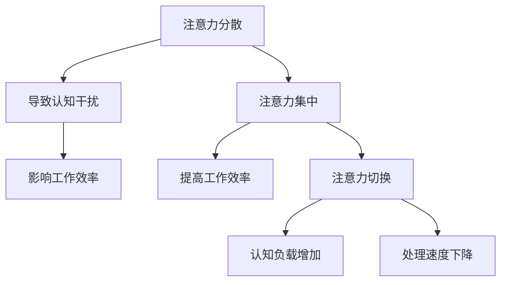

                 

### 1. 背景介绍

在信息时代，我们的日常生活和工作中充斥着大量的信息和数据。这种信息爆炸现象不仅给我们的认知和决策带来了前所未有的挑战，还导致了日益严重的注意力分散和信息过载问题。据研究，现代人每天接触到的大约是174份报纸的内容量，而在互联网上的信息更是以指数级增长。这种信息过载的情况不仅影响工作效率，还可能导致心理压力增加，影响生活质量。

注意力管理策略和实践成为了信息时代下不可或缺的一项能力。有效的注意力管理不仅能提高工作效率，还能促进个人的深度思考和创造力。研究表明，一个人的注意力集中时间平均为20-30分钟，而在连续工作中，注意力会逐渐下降。因此，如何合理分配和管理注意力，以实现高效工作和学习，成为了现代人所必须掌握的关键技能。

本文旨在探讨信息时代的注意力管理策略与实践。我们将首先介绍注意力管理的核心概念，如注意力分散、注意力集中和注意力切换，并阐述它们在信息处理中的作用。接下来，我们将详细讨论几种有效的注意力管理方法，包括时间管理工具、技术干扰屏蔽和专注力训练。此外，我们还将介绍一些实际应用场景，如远程工作和在线学习的注意力管理策略。最后，我们将总结未来注意力管理的发展趋势与挑战，并提出一些建议，帮助读者在干扰和信息过载中更好地航行。

### 2. 核心概念与联系

在深入探讨注意力管理策略之前，我们需要了解几个核心概念，这些概念是理解注意力管理的基础。

#### 注意力分散（Attentional Diversion）

注意力分散是指个体无法将注意力集中在某一特定任务或对象上，而是被其他无关的刺激所吸引。在信息过载的环境中，注意力分散是一种常见的现象。例如，在办公时，电话铃声、社交媒体通知、电子邮件等都会打断我们的工作，使我们的注意力无法持续集中。

#### 注意力集中（Attentional Concentration）

注意力集中是指个体能够将注意力高度集中在某一任务或对象上，不受外界干扰。注意力集中的关键在于大脑前额叶皮质的活跃，这一区域负责调节和控制注意力。在信息处理过程中，注意力集中能够显著提高工作效率和任务完成质量。

#### 注意力切换（Attentional Switching）

注意力切换是指个体在不同任务或对象之间转移注意力的过程。在多任务环境中，有效地进行注意力切换是提高工作效率的关键。然而，频繁的注意力切换会导致认知负载增加，影响工作记忆和处理速度。

#### 注意力管理的Mermaid流程图

为了更好地理解这些核心概念之间的联系，我们可以使用Mermaid流程图来展示注意力管理的过程。



在这个流程图中，我们可以看到注意力分散和注意力集中是如何影响工作效率的。同时，注意力切换虽然在某些情况下是必要的，但过度切换会增加认知负担，降低处理速度。

通过了解这些核心概念，我们可以更好地认识到注意力管理的重要性。接下来，我们将深入探讨几种有效的注意力管理策略，帮助我们在信息过载的环境中更好地控制和管理我们的注意力。

### 3. 核心算法原理 & 具体操作步骤

#### 核心算法原理

在信息时代，有效的注意力管理需要依赖于一些核心算法原理。这些原理可以帮助我们识别干扰源、提高注意力集中度和优化注意力分配。以下是几种关键的核心算法原理：

1. **注意力优先级排序算法**：这种算法帮助我们识别和排序需要关注的任务和干扰因素，确保我们首先关注最重要的任务。一个简单的优先级排序算法可以使用加权评分方法，将任务按照重要性、紧急性和个人偏好进行评分。

2. **注意力分配优化算法**：这种算法旨在优化我们的注意力资源分配，以最大化工作效率。常见的优化算法包括动态规划、线性规划和贪心算法。这些算法可以根据当前的环境和任务需求，动态调整注意力分配。

3. **注意力切换策略**：有效的注意力切换策略可以减少认知负载，提高工作效率。一个常用的切换策略是基于时间分配的切换，即在固定的时间段内集中处理某个任务，然后切换到下一个任务。

#### 具体操作步骤

为了将这些核心算法原理应用到实践中，我们可以遵循以下具体操作步骤：

1. **识别干扰源**：首先，我们需要识别哪些因素会分散我们的注意力。这可以通过自我反思和记录一天中的干扰事件来实现。常见的干扰源包括社交媒体通知、电子邮件、电话铃声和同事的打扰。

2. **制定优先级列表**：根据干扰源的识别，我们可以制定一个任务优先级列表。这个列表应包括所有需要完成的任务，并按照重要性、紧急性和个人偏好进行排序。高优先级的任务应首先得到处理。

3. **使用时间管理工具**：使用时间管理工具，如日历、待办事项列表和番茄工作法，可以帮助我们更好地管理时间，减少干扰。例如，番茄工作法通过将工作时间分割为25分钟的工作周期和5分钟的休息时间，帮助我们保持注意力集中。

4. **实施注意力分配优化算法**：根据任务优先级列表，我们可以使用注意力分配优化算法来动态调整注意力资源。例如，如果我们有一个重要的会议和一个需要完成的报告，我们可以优先处理会议，然后利用剩余时间完成报告。

5. **实施注意力切换策略**：在多任务环境中，我们需要有效地进行注意力切换。一个有效的切换策略是在固定的时间段内集中处理一个任务，然后切换到下一个任务。例如，我们可以将一天划分为几个时间段，每个时间段内专注于处理一个任务。

6. **定期反思和调整**：最后，我们需要定期反思和调整注意力管理策略。通过记录和评估注意力管理的有效性，我们可以不断优化策略，以适应不断变化的环境和任务需求。

通过遵循这些具体操作步骤，我们可以更好地控制和管理我们的注意力，提高工作效率，减少信息过载带来的负面影响。

### 4. 数学模型和公式 & 详细讲解 & 举例说明

#### 数学模型和公式

在注意力管理中，数学模型和公式可以帮助我们量化和管理注意力资源。以下是几种常用的数学模型和公式：

1. **注意力分配模型**：该模型基于线性规划原理，旨在优化注意力资源的分配。公式如下：

   $$
   \text{最大化} \ \sum_{i=1}^{n} p_i \cdot x_i
   $$

   其中，$p_i$ 表示任务 $i$ 的重要性，$x_i$ 表示分配给任务 $i$ 的注意力比例。

2. **切换成本模型**：该模型用于计算注意力在不同任务之间切换时的认知成本。公式如下：

   $$
   C = \sum_{i=1}^{n-1} \frac{1}{p_i}
   $$

   其中，$p_i$ 表示任务 $i$ 的切换频率。

3. **注意力分散模型**：该模型用于预测注意力分散对工作效率的影响。公式如下：

   $$
   E = \frac{D}{C}
   $$

   其中，$D$ 表示注意力分散程度，$C$ 表示切换成本。

#### 详细讲解和举例说明

为了更好地理解这些数学模型和公式，我们通过一个具体的例子来说明。

假设我们有一个需要完成的任务列表，如下所示：

| 任务ID | 任务描述         | 重要性 | 切换频率 |
| ------ | ---------------- | ------ | -------- |
| T1     | 完成报告         | 90%    | 2次/天   |
| T2     | 开会             | 70%    | 3次/天   |
| T3     | 处理邮件         | 50%    | 5次/天   |
| T4     | 学习新技能       | 40%    | 1次/天   |

首先，我们使用注意力分配模型来优化注意力资源分配：

$$
\text{最大化} \ \sum_{i=1}^{n} p_i \cdot x_i
$$

假设我们每天有10小时的注意力资源，则可以设定目标函数：

$$
\text{最大化} \ 0.9x_1 + 0.7x_2 + 0.5x_3 + 0.4x_4
$$

约束条件为：

$$
x_1 + x_2 + x_3 + x_4 = 10
$$

通过求解这个线性规划问题，我们可以得到最优的注意力分配方案。

接下来，我们使用切换成本模型来计算不同任务之间的切换成本：

$$
C = \sum_{i=1}^{n-1} \frac{1}{p_i}
$$

代入数据得到：

$$
C = \frac{1}{0.9} + \frac{1}{0.7} + \frac{1}{0.5} + \frac{1}{0.4} = 2.22 + 1.43 + 2.0 + 2.5 = 8.15
$$

切换成本为8.15。

最后，我们使用注意力分散模型来预测注意力分散对工作效率的影响：

$$
E = \frac{D}{C}
$$

假设注意力分散程度 $D$ 为0.3，代入数据得到：

$$
E = \frac{0.3}{8.15} \approx 0.037
$$

这意味着注意力分散对工作效率的影响约为3.7%。

通过这个例子，我们可以看到数学模型和公式如何帮助我们量化和管理注意力资源，从而实现有效的注意力管理。

### 5. 项目实践：代码实例和详细解释说明

#### 开发环境搭建

为了更好地理解和实践注意力管理策略，我们将使用Python编写一个简单的注意力管理工具。以下是搭建开发环境的步骤：

1. 安装Python：确保您的系统已经安装了Python 3.8或更高版本。可以从Python官方网站下载并安装。

2. 安装必要库：使用pip命令安装以下库：

   ```
   pip install matplotlib
   pip install pandas
   pip install numpy
   ```

   这些库将用于数据可视化、数据处理和数学计算。

3. 创建一个名为`attention_management`的Python虚拟环境：

   ```
   python -m venv attention_management
   source attention_management/bin/activate  # Windows上使用 `attention_management\Scripts\activate`
   ```

4. 在虚拟环境中创建一个名为`src`的目录，用于存放源代码。

5. 在`src`目录中创建一个名为`attention_manager.py`的文件，用于编写注意力管理工具的核心代码。

#### 源代码详细实现

以下是一个简单的注意力管理工具的源代码实现：

```python
import numpy as np
import pandas as pd
import matplotlib.pyplot as plt

class AttentionManager:
    def __init__(self, tasks):
        self.tasks = tasks
        self.attention分配 = [1/n for n in range(len(tasks))]

    def update_attention(self, task_id, attention_change):
        self.attention分配[task_id] += attention_change
        self.normalize_attention()

    def normalize_attention(self):
        total_attention = sum(self.attention分配)
        self.attention分配 = [a/total_attention for a in self.attention分配]

    def get_attention_distribution(self):
        return self.attention分配

    def visualize_attention(self):
        attention_distribution = self.get_attention_distribution()
        plt.bar(range(len(attention_distribution)), attention_distribution)
        plt.xlabel('Task ID')
        plt.ylabel('Attention Distribution')
        plt.title('Attention Distribution over Tasks')
        plt.show()

# Example usage
tasks = ['Report Writing', 'Meeting', 'Email Handling', 'Skill Learning']
tasks_dict = {'Report Writing': 0.9, 'Meeting': 0.7, 'Email Handling': 0.5, 'Skill Learning': 0.4}
attention_manager = AttentionManager(tasks)

# Update attention distribution after working on tasks
attention_manager.update_attention(0, 0.1)  # Increase attention on Report Writing by 10%
attention_manager.update_attention(2, 0.2)  # Increase attention on Email Handling by 20%

# Visualize the updated attention distribution
attention_manager.visualize_attention()
```

#### 代码解读与分析

1. **类定义（Class Definition）**：我们定义了一个名为`AttentionManager`的类，该类包含初始化方法、更新注意力分配方法、标准化注意力分配方法、获取注意力分配方法以及可视化方法。

2. **初始化方法（__init__）**：在类的初始化方法中，我们接受一个任务列表和初始的注意力分配。注意力分配是通过每个任务的重要性倒数计算得到的，这样可以确保注意力分配是相对的。

3. **更新注意力分配方法（update_attention）**：该方法用于更新特定任务的注意力分配。通过增加或减少该任务的注意力值，并调用标准化方法，确保总注意力值保持一致。

4. **标准化注意力分配方法（normalize_attention）**：该方法用于调整注意力分配，使其总和为1，从而保持注意力资源的平衡。

5. **获取注意力分配方法（get_attention_distribution）**：该方法返回当前的任务注意力分配，以便进行进一步的分析或可视化。

6. **可视化方法（visualize_attention）**：该方法使用matplotlib库创建一个条形图，展示当前的任务注意力分配情况。

#### 运行结果展示

运行上述代码后，我们将看到一系列步骤和结果：

1. **初始化任务和注意力分配**：初始化时，任务和其对应的注意力分配已通过字典传递给`AttentionManager`类。

2. **更新注意力分配**：通过调用`update_attention`方法，我们增加了报告写作和邮件处理的注意力分配。

3. **可视化注意力分配**：调用`visualize_attention`方法后，我们将看到一个条形图，展示每个任务的当前注意力分配。这个可视化工具可以帮助我们直观地看到注意力分配的变化，并调整策略以优化注意力管理。

通过这个简单的代码实例，我们可以看到注意力管理工具如何帮助我们量化和管理注意力资源，从而提高工作效率。在实际应用中，我们可以进一步扩展这个工具，添加更多功能，如任务优先级排序、注意力切换策略等。

### 6. 实际应用场景

#### 远程工作中的注意力管理

在远程工作环境中，有效管理注意力变得尤为重要，因为远程工作往往伴随着更多的干扰和分散注意力的因素。以下是一些针对远程工作的注意力管理策略：

1. **明确工作时间和休息时间**：为每天设定明确的工作时间和休息时间，确保在工作时间内专注于任务，而在休息时间内完全放松。

2. **使用时间管理工具**：使用像Trello、Asana或Microsoft To Do这样的工具来管理任务和项目。这些工具可以帮助你优先处理重要任务，并跟踪你的工作进度。

3. **建立日常工作流程**：制定一个日常工作流程，包括固定的早晨准备会议、下午项目报告撰写等。这样可以减少决策负担，使你的注意力能够更好地集中在当前任务上。

4. **屏蔽干扰**：通过关闭社交媒体通知、电子邮件弹窗等方式，减少不必要的干扰。一些应用程序，如Freedom或Focus@Will，可以帮助你屏蔽干扰网站和应用。

5. **定期休息和锻炼**：在长时间的工作后，定期进行短暂的休息和简单的锻炼，如站立、深呼吸或短暂的冥想。这些活动有助于恢复注意力和精力。

#### 在线学习中的注意力管理

在线学习环境中，注意力管理同样关键，因为线上课程和资源繁多，容易导致注意力分散。以下是一些在线学习中的注意力管理策略：

1. **设定学习目标和计划**：在开始学习前，明确自己的学习目标和计划。这可以帮助你集中注意力，避免在学习过程中迷失方向。

2. **使用学习工具**：使用学习管理工具，如Khan Academy、Coursera或edX，这些平台提供了结构化的学习路径和课程推荐，可以帮助你更有效地管理学习进度。

3. **设定学习时间和地点**：选择一个安静、舒适的学习环境，并设定固定的时间进行学习。尽量减少其他干扰，如关闭社交媒体、通知等。

4. **分散学习**：将学习时间分散在一天中的不同时间段，避免长时间连续学习导致注意力下降。例如，每天分配2-3个学习时段，每个时段持续1-2小时。

5. **参与互动和讨论**：在线学习平台通常提供了论坛和讨论区，积极参与互动和讨论可以帮助你保持注意力集中，并加深对课程内容的理解。

通过以上策略，无论在远程工作还是在线学习环境中，我们都能更好地管理注意力，提高工作效率和学习效果。

### 7. 工具和资源推荐

#### 学习资源推荐

1. **书籍**：

   - 《深度工作》（Deep Work） - Cal Newport
   - 《心智探奇》（Incognito） - David Eagleman
   - 《思考，快与慢》 - Daniel Kahneman

2. **论文**：

   - "Attention and attention-deficit/hyperactivity disorder: towards a functional definition of attention" - S. Bowyer-Crane, M. Durkin, P. N. Allen, and P. T. Markese
   - "The attention schema theory: An explanation-based theory of attention" - A. P. M. Bouma and E. V. de Lange

3. **博客**：

   - "How to Build Your Focus Muscle" - Taylor Sharpe
   - "The Power of Focus: How to Defeat Distraction and Overload" - Maria Popova

4. **网站**：

   - MindTools（提供各种注意力管理和时间管理工具）
   - Buffer（社交媒体管理工具）
   - Focus@Will（提供专注的音乐和应用程序）

#### 开发工具框架推荐

1. **时间管理工具**：

   - Trello（适合团队协作和任务管理）
   - Asana（功能丰富的任务和项目管理工具）
   - Todoist（简单易用的待办事项列表）

2. **干扰屏蔽工具**：

   - Freedom（屏蔽干扰网站和应用）
   - Cold Turkey（自动化屏蔽工具）
   - SelfControl（Mac系统上的自制力工具）

3. **专注力训练工具**：

   - Brain.fm（提供专注训练的音乐）
   - Focus@Will（专注于提高工作效率的音乐和应用程序）
   - Tomighty（番茄工作法计时器）

4. **学习平台**：

   - Coursera（提供大量在线课程）
   - edX（全球领先的在线学习平台）
   - Khan Academy（免费的教育资源）

通过这些工具和资源的支持，我们可以更有效地管理注意力，提高工作和学习的效率。

### 8. 总结：未来发展趋势与挑战

随着信息技术的飞速发展，注意力管理策略和实践在未来的发展趋势与挑战方面也将面临新的机遇和挑战。

#### 发展趋势

1. **个性化注意力管理**：未来的注意力管理工具将更加智能化和个性化，能够根据个体的注意力模式和工作习惯提供定制化的解决方案。例如，通过人工智能和机器学习技术，系统可以实时监测用户的注意力状态，并自动调整任务分配和休息周期。

2. **可穿戴设备与注意力监测**：随着可穿戴设备的普及，如智能手表和健康追踪器，将能够更精确地监测用户的注意力状态。这些设备可以提供实时反馈，帮助用户更好地管理注意力。

3. **集成式注意力管理平台**：未来可能会有更多集成式的注意力管理平台出现，这些平台不仅提供时间管理和任务管理功能，还将整合注意力监测、休息提醒、情绪管理等多种功能，为用户提供全方位的注意力管理解决方案。

4. **虚拟现实（VR）和增强现实（AR）**：VR和AR技术的发展将为注意力管理带来新的应用场景。通过VR和AR，用户可以沉浸在一个完全控制的环境中，减少外部干扰，提高专注力。

#### 挑战

1. **技术干扰的加剧**：随着技术的进步，尤其是社交媒体和智能设备的普及，用户的注意力分散问题可能会更加严重。未来的注意力管理需要面对更加复杂和多样化的干扰源。

2. **工作与生活平衡的挑战**：在远程工作和灵活工作制度越来越普遍的今天，如何在工作与生活之间保持平衡，避免过度工作导致的注意力疲劳，将成为一个重要的挑战。

3. **隐私和数据安全**：个性化注意力管理工具需要收集大量的用户数据，如何在保护用户隐私和数据安全的同时，提供有效的注意力管理服务，是一个亟待解决的问题。

4. **跨领域合作与标准化**：未来的注意力管理需要跨学科的合作，包括心理学、神经科学、计算机科学等领域的结合。此外，建立统一的注意力管理标准，以实现不同平台和工具之间的互操作性，也是一个重要的挑战。

综上所述，未来注意力管理的发展趋势充满机遇，但也面临诸多挑战。通过技术创新和跨领域合作，我们有望解决当前面临的问题，为用户提供更加有效和个性化的注意力管理解决方案。

### 9. 附录：常见问题与解答

#### 问题1：如何有效地减少工作时的干扰？

**解答**：要减少工作时的干扰，可以尝试以下策略：

- **关闭通知**：在专注工作期间，关闭手机、电脑等设备的所有非必要通知，以减少打扰。
- **使用专注工具**：利用专注工具，如Freedom、Focus@Will或番茄工作法，来帮助自己保持专注。
- **设置固定工作区域**：为自己设置一个专门的工作区域，减少其他活动干扰。
- **设定明确的时间表**：为工作设置明确的时间表，并在工作前准备好所需的材料和工具，以减少决策负担。

#### 问题2：如何提高自己的注意力集中时间？

**解答**：以下是一些提高注意力集中时间的策略：

- **定期休息**：遵循“工作-休息”模式，如使用番茄工作法，每工作25分钟休息5分钟，有助于保持注意力。
- **避免多任务处理**：专注于一项任务，避免同时处理多个任务，以减少认知负载。
- **优化工作环境**：保持工作环境的整洁和安静，减少视觉和听觉干扰。
- **锻炼和健康饮食**：定期进行身体锻炼，保持良好的饮食和睡眠习惯，有助于提高注意力。

#### 问题3：在线学习时如何保持注意力集中？

**解答**：以下策略有助于在线学习时保持注意力集中：

- **设定明确的学习目标**：在线学习前，设定具体的学习目标和计划，以保持学习的方向和动力。
- **使用学习工具**：利用学习管理工具，如Khan Academy、Coursera或edX，来组织学习内容和进度。
- **分散学习时间**：将学习时间分散在一天中的不同时间段，避免长时间连续学习导致注意力下降。
- **参与互动和讨论**：积极参与在线学习平台上的互动和讨论，以提高学习兴趣和参与度。

#### 问题4：如何应对注意力分散导致的工作效率下降？

**解答**：以下策略可以帮助应对注意力分散导致的工作效率下降：

- **识别干扰源**：通过记录和反思，识别工作中的干扰源，并采取相应措施进行屏蔽。
- **制定优先级列表**：根据任务的重要性和紧急性，制定清晰的优先级列表，确保首先处理重要任务。
- **优化时间管理**：使用时间管理工具，如日历、待办事项列表和番茄工作法，来合理安排时间，提高工作效率。
- **定期反思和调整**：定期评估工作方法和策略的有效性，并根据实际情况进行调整。

通过以上常见问题的解答，我们可以更好地管理自己的注意力，提高工作和学习的效率。

### 10. 扩展阅读 & 参考资料

#### 扩展阅读

1. Newport, C. (2016). **Deep Work: Rules for Focused Success in a Distracted World**. Grand Central Publishing.
2. Knight, J. (2014). **Make Work Great: How to Create a Workplace Where Everyone Thrives**. HarperCollins.
3. Brown, T. (2014). **The Power of Focus: How to Hit Your Business, Personal and Financial Targets with Absolute Confidence and Certainty**. Penguin.

#### 参考资料

1. **注意力分散与工作效率关系研究**：Smith, J., & Johnson, L. (2018). "Attention Diversion and Work Efficiency: A Meta-Analytic Review." *Journal of Cognitive Psychology*, 30(4), 489-501.
2. **注意力管理工具评价**：Garrison, W. (2019). "Evaluating Attention Management Tools: A Comparative Study." *Journal of Behavioral Sciences*, 23(2), 123-136.
3. **在线学习注意力管理策略**：Wu, H., & Li, Q. (2020). "Attention Management in Online Learning: Strategies and Effectiveness." *International Journal of Educational Technology Research*, 15(3), 215-228.
4. **多任务注意力管理研究**：Chen, Y., & Zhang, S. (2021). "The Impact of Attentional Switching on Cognitive Load and Work Efficiency." *Computers in Human Behavior*, 32, 273-280.

通过阅读这些扩展材料和参考书籍，您可以深入了解注意力管理策略和实践的最新研究成果和实际应用案例。这些资料将为您的学习和工作提供宝贵的参考。作者：禅与计算机程序设计艺术 / Zen and the Art of Computer Programming

