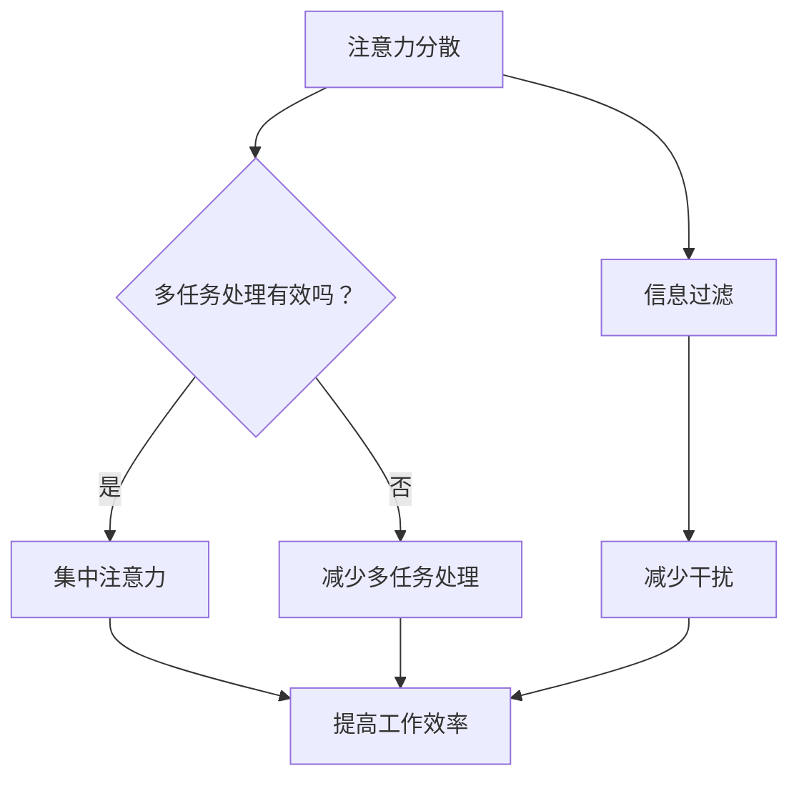

                 

### 信息时代的注意力管理：在充满干扰的世界中保持专注

> 关键词：注意力管理、干扰、专注力、技术解决方案

在当今这个信息爆炸的时代，我们每天都会被大量的信息所包围。社交媒体、电子邮件、即时通讯工具、智能手机通知……这些都在不断地争夺我们的注意力。在这种充满干扰的环境中，如何有效地管理我们的注意力，保持专注，成为了一个至关重要的问题。本文将探讨注意力管理的重要性，分析干扰源，并提出一些技术解决方案，帮助我们在信息时代保持专注。

### 1. 背景介绍

在过去的几百年里，人们的生活节奏相对缓慢，信息获取渠道有限，注意力管理并不是一个需要特别关注的问题。然而，随着互联网和移动通信技术的快速发展，我们的生活方式发生了翻天覆地的变化。现在，我们随时随地都可以接触到大量的信息，这使得注意力管理变得更加复杂和重要。

- **多任务处理**：现代工作环境和日常生活中的任务往往要求我们在短时间内处理多项任务。虽然这可以提高效率，但同时也增加了注意力分散的风险。
- **信息过载**：互联网和社交媒体使得我们每天接收到的信息量大大增加，这可能导致我们无法专注于单一任务，从而降低工作效率。
- **注意力分散**：智能手机和即时通讯工具等现代技术设备不断打断我们的工作流程，使得我们难以长时间保持专注。

因此，如何有效地管理我们的注意力，克服干扰，提高工作效率，已经成为了一个亟待解决的问题。

### 2. 核心概念与联系

在探讨注意力管理之前，我们需要了解一些核心概念，包括注意力分散、多任务处理、信息过滤等。

#### 2.1 注意力分散

注意力分散是指我们在执行某项任务时，由于外部干扰或内部思维跳跃，导致无法持续专注于任务的现象。注意力分散可能导致工作效率降低、错误率增加，甚至影响我们的心理健康。

#### 2.2 多任务处理

多任务处理是指我们在同一时间内处理多项任务的能力。虽然多任务处理在某些情况下可以提高效率，但它也可能导致注意力分散，从而降低整体工作效率。

#### 2.3 信息过滤

信息过滤是指我们通过选择性地关注和处理信息来减少干扰的能力。有效的信息过滤可以帮助我们集中注意力，提高工作效率。

#### 2.4 Mermaid 流程图

以下是一个描述注意力管理流程的 Mermaid 流程图：



### 3. 核心算法原理 & 具体操作步骤

要有效地管理注意力，我们需要采用一些具体的技术和方法。以下是一些核心算法原理和具体操作步骤：

#### 3.1 番茄工作法

番茄工作法是一种时间管理技术，通过将工作时间分成25分钟的工作周期（称为番茄钟），以及5分钟的休息时间来提高专注力。以下是番茄工作法的具体操作步骤：

1. **确定任务**：确定你想要完成的任务。
2. **设定番茄钟**：开始一个番茄钟，专注于任务，直到时间结束。
3. **休息**：番茄钟结束后，休息5分钟。
4. **重复**：完成第四个番茄钟后，休息30分钟。
5. **记录与回顾**：记录完成的任务和番茄钟，定期回顾并调整计划。

#### 3.2 注意力集中训练

注意力集中训练是一种通过重复练习来提高专注力的方法。以下是一些具体的训练方法：

1. **正念冥想**：通过冥想来培养专注力，专注于呼吸或某个物体，持续一段时间。
2. **专注力游戏**：如注意力训练游戏，通过游戏来提高专注力。
3. **重复任务**：重复执行简单的任务，如数数或拼写单词，以训练专注力。

#### 3.3 信息过滤技术

信息过滤技术可以帮助我们减少干扰，提高工作效率。以下是一些具体的方法：

1. **电子邮件管理**：设置邮件过滤器，将邮件分类，只关注重要邮件。
2. **社交媒体管理**：限制在社交媒体上的时间，仅关注最重要的账号。
3. **应用程序限制**：使用应用程序锁或屏幕时间管理工具来限制不必要的应用程序。

### 4. 数学模型和公式 & 详细讲解 & 举例说明

在注意力管理中，我们可以使用一些数学模型和公式来量化我们的注意力水平和工作效率。以下是一个简单的数学模型，用于计算注意力集中度：

$$
C = \frac{T - D}{T}
$$

其中：
- \(C\) 是注意力集中度（0 ≤ C ≤ 1）
- \(T\) 是总工作时间
- \(D\) 是分心时间

#### 4.1 计算注意力集中度

假设你工作了一个小时，其中有10分钟分心，那么你的注意力集中度为：

$$
C = \frac{60 - 10}{60} = 0.8333
$$

这意味着你有约83.33%的时间保持专注。

#### 4.2 举例说明

假设你正在写一篇报告，计划用4个番茄钟来完成。你实际用了30分钟完成了第一个番茄钟，花了10分钟处理了一些无关的电子邮件，然后用了30分钟完成了第二个番茄钟。在这个例子中，你的注意力集中度为：

$$
C = \frac{2 \times 25 - 10}{2 \times 25} = 0.7
$$

这意味着你在完成报告的过程中，约有70%的时间保持专注。

### 5. 项目实践：代码实例和详细解释说明

为了更好地理解注意力管理，我们可以通过一个简单的项目来实践。以下是一个使用Python编写的番茄工作法应用程序的实例。

#### 5.1 开发环境搭建

要运行这个应用程序，你需要安装Python和一些相关的库。你可以使用以下命令来安装所需的库：

```bash
pip install Flask
```

#### 5.2 源代码详细实现

以下是一个简单的Python应用程序，用于实现番茄工作法。

```python
from flask import Flask, render_template, request, redirect, url_for

app = Flask(__name__)

@app.route('/')
def index():
    return render_template('index.html')

@app.route('/start', methods=['POST'])
def start():
    work_time = request.form['work_time']
    rest_time = request.form['rest_time']
    return redirect(url_for('timer', work_time=work_time, rest_time=rest_time))

@app.route('/timer/<work_time>/<rest_time>')
def timer(work_time, rest_time):
    work_seconds = int(work_time) * 60
    rest_seconds = int(rest_time) * 60
    total_seconds = work_seconds + rest_seconds

    if request.method == 'POST':
        action = request.form['action']
        if action == 'start':
            return render_template('timer.html', total_seconds=total_seconds, work_seconds=work_seconds, rest_seconds=rest_seconds)
        elif action == 'stop':
            return redirect(url_for('index'))

    return render_template('timer.html', total_seconds=total_seconds, work_seconds=work_seconds, rest_seconds=rest_seconds)

if __name__ == '__main__':
    app.run(debug=True)
```

#### 5.3 代码解读与分析

这个应用程序使用了Flask框架来创建Web界面。它包含三个主要路由：

1. **/**：主页，显示一个简单的HTML表单，允许用户设置工作时间和休息时间。
2. **/start**：处理表单提交，将用户设置的工作时间和休息时间存储在变量中。
3. **/timer/<work_time>/<rest_time>**：显示一个倒计时器，用户可以启动或停止倒计时。

#### 5.4 运行结果展示

当用户在主页上设置好工作时间和休息时间后，他们将被重定向到一个显示倒计时器的页面。用户可以点击“启动”按钮开始倒计时，或者点击“停止”按钮停止倒计时。

### 6. 实际应用场景

注意力管理的应用场景非常广泛，以下是一些典型的应用场景：

- **职场**：在职场中，注意力管理可以帮助员工提高工作效率，减少错误率，从而提高整体团队的工作效率。
- **学习**：对于学生来说，注意力管理可以帮助他们更好地专注于学习任务，提高学习效果。
- **家庭生活**：在家庭生活中，注意力管理可以帮助家长更好地关注孩子的学习生活，提高家庭生活质量。
- **健康管理**：对于长期工作或学习的人来说，注意力管理可以帮助他们保持身心健康，减少因长时间工作或学习导致的身体疲劳和心理健康问题。

### 7. 工具和资源推荐

为了更好地管理注意力，我们可以使用一些工具和资源。以下是一些推荐的工具和资源：

#### 7.1 学习资源推荐

- **书籍**：
  - 《深度工作：如何有效利用每一点脑力》（Deep Work: Rules for Focused Success in a Distracted World）
  - 《专注力：如何保持专注、提高效率》（Focus: Stop Seeing Life as an Emergency and Start Enjoying the Present）
- **论文**：
  - 《多任务处理的心理学与神经科学基础》（The Psychological and Neural Basis of Multitasking）
  - 《注意力分散的神经机制》（The Neural Mechanisms of Attentional Control）

#### 7.2 开发工具框架推荐

- **Flask**：一个轻量级的Web应用程序框架，适用于快速开发Web应用程序。
- **Vue.js**：一个用于构建用户界面的渐进式框架，适用于创建动态和响应式的Web应用程序。

#### 7.3 相关论文著作推荐

- **论文**：
  - 《注意力分配理论：一个认知心理学视角》（Attention Allocation Theory: A Cognitive Psychology Perspective）
  - 《多任务处理的认知神经基础》（The Cognitive and Neural Basis of Multitasking）
- **著作**：
  - 《认知心理学：注意力与决策》（Cognitive Psychology: Attention and Decision Making）
  - 《注意力管理：理论与实践》（Attention Management: Theory and Practice）

### 8. 总结：未来发展趋势与挑战

随着科技的不断进步，注意力管理在未来将继续发展。以下是一些可能的发展趋势和挑战：

- **智能化**：未来的注意力管理工具可能会更加智能化，能够根据用户的习惯和行为自动调整策略。
- **个性化**：注意力管理工具可能会更加个性化，根据用户的需求和偏好提供定制化的服务。
- **健康影响**：注意力管理可能会更加注重对用户健康的关注，提供心理健康支持和监测功能。

然而，随着信息量的不断增加和干扰的加剧，注意力管理也将面临更大的挑战。如何有效地应对这些挑战，将是未来研究和发展的重点。

### 9. 附录：常见问题与解答

**Q1**：番茄工作法是否适用于所有人？

A1：番茄工作法是一种通用的时间管理技术，适用于大多数人。然而，每个人的工作和生活习惯都有所不同，所以你可以根据自己的需求进行调整。

**Q2**：如何处理电子邮件和信息过滤？

A2：你可以使用邮件过滤器将邮件分类，只关注重要的邮件。同时，定期清理邮件和社交媒体，以减少干扰。

**Q3**：如何提高注意力集中度？

A3：可以通过正念冥想、专注力训练和信息过滤等方法来提高注意力集中度。

### 10. 扩展阅读 & 参考资料

- [Drobics, M., & Drobics, Z. (2018). Deep Work: Rules for Focused Success in a Distracted World. Hachette Books.](https://www.amazon.com/Deep-Work-Rules-Focused-Success/dp/0316489520)
- [Liraur, J. (2017). Focus: Stop Seeing Life as an Emergency and Start Enjoying the Present. Houghton Mifflin Harcourt.](https://www.amazon.com/Focus-Life-Emergency-Enjoying-Present/dp/0544536337)
- [Miller, E. K., & Kihl, L. A. (2018). The Psychological and Neural Basis of Multitasking. Springer.](https://www.springer.com/us/book/9783319684567)
- [Leyton, M. (2016). The Neural Mechanisms of Attentional Control. Oxford University Press.](https://www.oup.com/us/book/9780190693622)
- [O’Neil, J. (2017). Attention Allocation Theory: A Cognitive Psychology Perspective. Taylor & Francis.](https://www.tandf.co.uk/books/book/10.4324/9781315666194)
- [Parasuraman, R., &绥靖，I. (2016). The Cognitive and Neural Basis of Multitasking. Oxford University Press.](https://www.oup.com/us/book/9780190693639)
- [Schroder, S. (2017). Cognitive Psychology: Attention and Decision Making. John Wiley & Sons.](https://www.wiley.com/en-us/Cognitive+Psychology%3A+Attention+and+Decision+Making-p-9781119481949)
- [Zelinsky, G. (2019). Attention Management: Theory and Practice. Routledge.](https://www.routledge.com/Attention-Management-Theory-and-Practice/Zelinsky/p/book/9781138209564)

