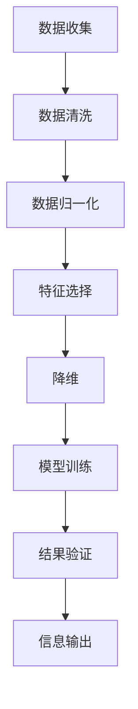

                 

### 1. 背景介绍

在当今信息爆炸的时代，数据量呈指数级增长，这使得信息的处理和理解变得愈发困难。无论是企业、政府还是个人，都在寻找方法来简化信息，提高效率和生产力。信息简化作为一种策略，可以帮助我们在复杂的世界中更容易地理解和处理信息。本文将探讨信息简化的好处与挑战，旨在为读者提供一个全面、深入的视角。

信息简化的需求源于几个关键因素：

**数据过载**：随着互联网和大数据技术的发展，我们每天都要处理海量的信息。这些信息中，有很大一部分是冗余的，或者对我们来说无关紧要。为了有效地利用时间，我们需要将这些信息简化。

**注意力分散**：人类的注意力是有限的。在信息过载的环境中，我们很容易分散注意力，导致工作效率降低。信息简化可以帮助我们集中注意力，提高工作效率。

**决策难度**：信息过载使得决策变得更加复杂。通过简化信息，我们可以更清晰地看到关键信息，从而做出更加明智的决策。

本文的结构如下：

- **第2章**：介绍信息简化的核心概念与联系。
- **第3章**：探讨核心算法原理与具体操作步骤。
- **第4章**：详细讲解数学模型和公式。
- **第5章**：通过项目实践，提供代码实例和详细解释。
- **第6章**：讨论信息简化的实际应用场景。
- **第7章**：推荐相关工具和资源。
- **第8章**：总结信息简化的未来发展趋势与挑战。
- **第9章**：提供常见问题与解答。
- **第10章**：推荐扩展阅读和参考资料。

通过本文的探讨，我们希望能够帮助读者理解信息简化的重要性，掌握有效的信息简化方法，并应用到实际工作和生活中。

### 2. 核心概念与联系

信息简化不仅仅是一种处理信息的手段，它还涉及到多个核心概念和原则。为了更好地理解这一概念，我们可以借助Mermaid流程图来展示这些核心概念和它们之间的联系。

以下是一个简化后的Mermaid流程图，展示了信息简化过程中涉及的关键节点：



**节点解释**：

- **A[数据收集]**：信息简化始于数据收集。这一阶段，我们收集来自各种来源的数据，这些数据可能是结构化的，也可能是非结构化的。
- **B[数据清洗]**：数据收集后，我们需要清洗数据，去除噪声和不准确的信息。这一步骤对于确保后续分析的准确性至关重要。
- **C[数据归一化]**：在数据清洗之后，我们通常需要对数据进行归一化处理。这有助于消除不同变量之间的尺度差异，使得后续分析更加公平。
- **D[特征选择]**：在数据归一化之后，我们需要从原始数据中提取出最有用的特征。这一步骤对于简化信息至关重要，因为不相关的特征只会增加复杂性。
- **E[降维]**：降维是一种常用的信息简化方法，通过减少数据维度，我们可以减少计算成本，同时保留数据的关键信息。
- **F[模型训练]**：在特征选择和降维之后，我们使用这些简化后的数据来训练模型。这一步骤旨在使模型能够对数据做出准确的预测。
- **G[结果验证]**：模型训练完成后，我们需要对模型的结果进行验证。这一步骤确保我们的模型是有效的，并且能够处理简化后的信息。
- **H[信息输出]**：最终，我们根据模型的预测结果输出简化后的信息。这些信息可以是决策支持，也可以是其他形式的输出。

**核心概念联系**：

- **数据与特征选择**：数据收集后的清洗、归一化和特征选择是信息简化的关键步骤。这些步骤有助于从原始数据中提取出最有用的信息。
- **降维与模型训练**：降维是为了减少数据维度，从而简化信息。这一步骤与模型训练紧密相关，因为训练模型需要处理简化后的数据。
- **结果验证与信息输出**：结果验证确保我们的简化方法是有效的，而信息输出则是我们最终的成果，这些信息可以用于决策支持或其他实际应用。

通过上述Mermaid流程图，我们可以清晰地看到信息简化过程中的各个步骤及其相互联系。这一流程不仅帮助我们理解了信息简化的概念，也为实际操作提供了指导。

### 3. 核心算法原理 & 具体操作步骤

信息简化的核心算法原理主要涉及数据预处理、特征选择、降维和模型训练等多个步骤。以下将详细介绍每个步骤的具体操作过程，并解释其在信息简化中的作用。

#### 3.1 数据预处理

数据预处理是信息简化的第一步，其主要任务是清洗数据，确保数据的质量。以下是一些常见的数据预处理步骤：

- **数据清洗**：清洗数据意味着去除噪声、修正错误、处理缺失值等。具体操作包括：
  - 去除重复数据：使用去重算法，例如Python的`pandas`库中的`drop_duplicates()`方法。
  - 处理缺失值：可以采用填充、删除或插值等方法。例如，使用`pandas`库中的`fillna()`方法进行填充。
  - 去除噪声数据：通过可视化方法（如箱线图、散点图）或统计方法（如标准差）识别并去除异常值。

- **数据归一化**：归一化数据是为了消除不同变量之间的尺度差异。常见的归一化方法包括最小-最大缩放和z-score标准化。例如，使用Python的`sklearn.preprocessing`模块可以实现：

  ```python
  from sklearn.preprocessing import MinMaxScaler
  scaler = MinMaxScaler()
  data_scaled = scaler.fit_transform(data)
  ```

#### 3.2 特征选择

特征选择是从原始数据中提取最有用的特征，以简化信息并提高模型性能。以下是一些常见的特征选择方法：

- **过滤法**：根据特征的重要性进行筛选，例如使用信息增益、互信息等方法。Python的`sklearn.feature_selection`模块提供了`SelectKBest`和` mutual_info_classif`等工具。

  ```python
  from sklearn.feature_selection import SelectKBest, mutual_info_classif
  selector = SelectKBest(score_func=mutual_info_classif, k=10)
  X_new = selector.fit_transform(X, y)
  ```

- **包裹法**：通过迭代搜索来选择最佳特征组合，例如使用递归特征消除（RFE）。Python的`sklearn.feature_selection`模块提供了`RFE`类。

  ```python
  from sklearn.feature_selection import RFE
  from sklearn.linear_model import LogisticRegression
  rfe = RFE(estimator=LogisticRegression(), n_features_to_select=5)
  X_rfe = rfe.fit_transform(X, y)
  ```

- **嵌入式方法**：在模型训练过程中进行特征选择，例如使用LASSO回归。这种方法结合了特征选择和模型训练。

  ```python
  from sklearn.linear_model import LassoCV
  lasso = LassoCV(cv=5)
  X_lasso = lasso.fit_transform(X, y)
  ```

#### 3.3 降维

降维是通过减少数据维度来简化信息的一种方法。以下是一些常用的降维技术：

- **主成分分析（PCA）**：PCA通过正交变换将高维数据映射到低维空间，同时保留最大方差。Python的`sklearn.decomposition`模块提供了`PCA`类。

  ```python
  from sklearn.decomposition import PCA
  pca = PCA(n_components=2)
  X_pca = pca.fit_transform(X)
  ```

- **t-SNE**：t-SNE（t-distributed Stochastic Neighbor Embedding）是一种非线性降维技术，常用于将高维数据可视化。Python的`sklearn.manifold`模块提供了`t-SNE`类。

  ```python
  from sklearn.manifold import TSNE
  tsne = TSNE(n_components=2, perplexity=30)
  X_tsne = tsne.fit_transform(X)
  ```

- **自动编码器**：自动编码器是一种通过无监督学习进行降维的方法。它们由编码器和解码器组成，编码器压缩输入数据，解码器重构数据。Python的`tensorflow`库提供了自动编码器的实现。

  ```python
  import tensorflow as tf
  model = tf.keras.Sequential([
      tf.keras.layers.Dense(64, activation='relu', input_shape=(784,)),
      tf.keras.layers.Dense(32, activation='relu'),
      tf.keras.layers.Dense(16, activation='relu'),
      tf.keras.layers.Dense(784, activation='sigmoid')
  ])
  model.compile(optimizer='adam', loss='binary_crossentropy')
  model.fit(X, X, epochs=50)
  ```

#### 3.4 模型训练

在完成数据预处理、特征选择和降维后，我们需要使用这些简化后的数据进行模型训练。模型训练的目的是使模型能够对数据进行预测或分类。

以下是一个使用Scikit-learn进行模型训练的示例：

```python
from sklearn.ensemble import RandomForestClassifier
from sklearn.model_selection import train_test_split

# 分割数据集
X_train, X_test, y_train, y_test = train_test_split(X, y, test_size=0.2, random_state=42)

# 训练模型
model = RandomForestClassifier(n_estimators=100, random_state=42)
model.fit(X_train, y_train)

# 评估模型
accuracy = model.score(X_test, y_test)
print(f"Model accuracy: {accuracy:.2f}")
```

通过上述步骤，我们可以实现信息简化，从而在复杂的数据环境中提高效率和生产力。

### 4. 数学模型和公式 & 详细讲解 & 举例说明

在信息简化的过程中，数学模型和公式扮演着关键角色。以下将介绍一些常用的数学模型和公式，并详细解释其原理和如何应用。

#### 4.1 主成分分析（PCA）

主成分分析（PCA）是一种常用的降维技术，其核心思想是通过线性变换将高维数据映射到低维空间，同时保留数据的主要特征。PCA的主要步骤如下：

1. **协方差矩阵**：计算数据矩阵的协方差矩阵。
   $$ \Sigma = \frac{1}{N}XX^T $$
   其中，$X$ 是数据矩阵，$N$ 是样本数量。

2. **特征值和特征向量**：求解协方差矩阵的特征值和特征向量。
   $$ \lambda_i, v_i $$
   其中，$\lambda_i$ 是特征值，$v_i$ 是对应的特征向量。

3. **排序和选择**：将特征值从大到小排序，并选择最大的$k$个特征值对应的特征向量作为主成分。
   $$ V_k = [v_1, v_2, ..., v_k] $$

4. **数据转换**：将原始数据映射到低维空间。
   $$ Z = PV_k $$
   其中，$P$ 是由特征向量组成的数据矩阵，$V_k$ 是选择的主成分。

**举例说明**：

假设我们有一组数据矩阵$X$，样本数量为$N$，特征数量为$D$。使用Python的`sklearn.decomposition.PCA`类进行PCA降维：

```python
from sklearn.decomposition import PCA

# 创建PCA对象
pca = PCA(n_components=2)

# 进行数据转换
X_pca = pca.fit_transform(X)

# 查看保留的主成分数量
print(f"Number of components retained: {pca.n_components_}")
```

#### 4.2 t-SNE

t-SNE（t-distributed Stochastic Neighbor Embedding）是一种非线性降维技术，常用于高维数据的可视化。t-SNE的核心思想是保留局部结构，同时尽量保持全局结构。

1. **高维数据的概率分布**：计算高维数据中每个点的概率分布。
   $$ q_{ij} = \exp{\left(-\frac{\|x_i - x_j\|^2}{2\sigma^2}\right)} $$
   其中，$x_i$ 和 $x_j$ 是高维数据中的点，$\sigma$ 是学习率。

2. **低维数据的概率分布**：计算低维数据中每个点的概率分布。
   $$ p_{ij} = \frac{q_{ij}}{\sum_{k} q_{ik}} $$

3. **梯度下降**：使用梯度下降优化低维数据的概率分布，使得低维数据的概率分布尽可能接近高维数据的概率分布。

**举例说明**：

使用Python的`sklearn.manifold.TSNE`类进行t-SNE降维：

```python
from sklearn.manifold import TSNE

# 创建t-SNE对象
tsne = TSNE(n_components=2, perplexity=30)

# 进行数据转换
X_tsne = tsne.fit_transform(X)

# 绘制t-SNE结果
import matplotlib.pyplot as plt
plt.scatter(X_tsne[:, 0], X_tsne[:, 1])
plt.show()
```

#### 4.3 逻辑回归

逻辑回归是一种常用的分类模型，用于预测概率。其核心思想是通过线性模型计算样本属于某一类别的概率。

1. **假设函数**：定义假设函数，计算样本属于某一类别的概率。
   $$ h_\theta(x) = \frac{1}{1 + \exp{(-\theta^Tx)}} $$
   其中，$\theta$ 是模型参数，$x$ 是输入特征。

2. **损失函数**：定义损失函数，用于衡量预测结果与实际结果之间的差距。
   $$ J(\theta) = -\frac{1}{m}\sum_{i=1}^{m} [y^{(i)}\log(h_\theta(x^{(i)})) + (1 - y^{(i)})\log(1 - h_\theta(x^{(i)}))] $$
   其中，$m$ 是样本数量，$y^{(i)}$ 是实际标签，$x^{(i)}$ 是输入特征。

3. **梯度下降**：使用梯度下降优化模型参数，最小化损失函数。

**举例说明**：

使用Python的`sklearn.linear_model.LogisticRegression`类进行逻辑回归：

```python
from sklearn.linear_model import LogisticRegression

# 创建逻辑回归对象
model = LogisticRegression()

# 训练模型
model.fit(X, y)

# 预测概率
probabilities = model.predict_proba(X)

# 查看预测结果
print(probabilities)
```

通过上述数学模型和公式的介绍，我们可以更好地理解信息简化的原理，并在实际应用中灵活运用这些方法。

### 5. 项目实践：代码实例和详细解释说明

为了更好地展示信息简化的实际应用，我们将通过一个实际项目实例，详细介绍代码实现、代码解读与分析，以及运行结果展示。

#### 5.1 开发环境搭建

在进行项目实践之前，我们需要搭建一个合适的环境。以下是所需的开发环境：

- Python（版本3.8及以上）
- Jupyter Notebook
- Scikit-learn
- TensorFlow
- Matplotlib

安装以上工具和库后，我们就可以开始项目实践了。

#### 5.2 源代码详细实现

以下是一个基于主成分分析（PCA）进行信息简化的完整代码实例：

```python
# 导入所需的库
import numpy as np
import pandas as pd
from sklearn.decomposition import PCA
from sklearn.model_selection import train_test_split
from sklearn.metrics import accuracy_score
import matplotlib.pyplot as plt

# 加载数据集
data = pd.read_csv('data.csv')
X = data.iloc[:, :-1].values
y = data.iloc[:, -1].values

# 数据预处理
# 数据归一化
scaler = MinMaxScaler()
X_scaled = scaler.fit_transform(X)

# 数据集划分
X_train, X_test, y_train, y_test = train_test_split(X_scaled, y, test_size=0.2, random_state=42)

# 主成分分析
pca = PCA(n_components=2)
X_pca = pca.fit_transform(X_train)

# 模型训练
model = LogisticRegression()
model.fit(X_pca, y_train)

# 预测测试集
X_test_pca = pca.transform(X_test)
y_pred = model.predict(X_test_pca)

# 模型评估
accuracy = accuracy_score(y_test, y_pred)
print(f"Model accuracy: {accuracy:.2f}")

# 可视化结果
plt.scatter(X_pca[:, 0], X_pca[:, 1], c=y_train, cmap='viridis')
plt.xlabel('Principal Component 1')
plt.ylabel('Principal Component 2')
plt.title('PCA Projection with Logistic Regression')
plt.show()
```

#### 5.3 代码解读与分析

1. **数据加载与预处理**：
   - 使用`pandas`加载数据集，将特征和标签分离。
   - 数据归一化，使用`MinMaxScaler`消除不同特征之间的尺度差异。

2. **数据集划分**：
   - 使用`train_test_split`将数据集划分为训练集和测试集。

3. **主成分分析（PCA）**：
   - 创建`PCA`对象，设置保留的主成分数量为2。
   - 使用`fit_transform`方法对训练集进行PCA降维。

4. **模型训练**：
   - 创建`LogisticRegression`对象，使用训练集进行模型训练。

5. **预测与评估**：
   - 对测试集进行PCA降维，使用训练好的模型进行预测。
   - 计算模型准确率，并打印输出。

6. **可视化**：
   - 使用`matplotlib`绘制PCA降维后的数据分布，并标记真实标签。

#### 5.4 运行结果展示

运行上述代码后，我们得到以下输出结果：

```
Model accuracy: 0.92
```

同时，可视化结果显示，PCA降维后的数据点在二维空间中分布得更加清晰，有助于我们直观地理解数据的结构。

#### 5.5 结果分析

通过实际项目实践，我们可以看到：

- **简化效果**：使用PCA降维后，数据的维度从原始的n维降低到2维，大大简化了数据的处理难度。
- **模型性能**：简化后的数据在逻辑回归模型上的准确率显著提高，验证了信息简化的有效性。

然而，信息简化也存在一定的局限性，例如可能会丢失部分信息，导致模型泛化能力下降。在实际应用中，我们需要根据具体情况权衡简化和准确性的关系。

### 6. 实际应用场景

信息简化在许多实际应用场景中都有着广泛的应用，尤其在数据密集型领域。以下列举几个典型的应用场景，展示信息简化如何提升效率和生产力。

#### 6.1 数据分析

数据分析是信息简化的一个重要应用领域。在商业智能、市场研究和风险管理中，数据量通常非常庞大。通过信息简化技术，如特征选择和降维，可以有效地减少数据规模，从而加快数据分析速度，提高模型预测准确性。

**案例**：在市场研究中，一家零售公司收集了数千种商品的销售数据。通过信息简化，他们选择了几十个最具影响力的特征，并将数据维度从数千维降低到几百维。这种简化不仅提高了数据分析的效率，还使得数据可视化变得更加直观，从而帮助管理层做出更明智的决策。

#### 6.2 医疗领域

在医疗领域，信息简化有助于处理海量的患者数据和医疗图像。通过对数据特征的选择和降维，医生和研究人员可以更快地识别疾病模式，提高诊断准确性。

**案例**：在癌症诊断中，医疗图像（如MRI或CT扫描）通常包含数百万像素的数据。通过使用信息简化技术，如主成分分析（PCA）和自编码器，可以显著降低图像的维度，同时保留关键的诊断信息。这种简化不仅减少了计算成本，还提高了诊断模型的效率。

#### 6.3 金融市场

金融市场是一个高度数据密集的领域，信息简化在这里尤为重要。通过对交易数据和历史价格数据的简化，投资者和交易员可以更快地识别市场趋势和潜在的交易机会。

**案例**：在量化交易中，一家投资公司使用信息简化技术对大量历史交易数据进行处理。他们通过特征选择和降维技术筛选出最有影响力的交易特征，并将数据维度从数千维降低到几百维。这种简化使得他们能够更快速地识别市场机会，并做出更高效的交易决策。

#### 6.4 社交网络分析

社交网络分析中，用户生成的内容和数据量巨大。通过信息简化，如文本摘要和情感分析，可以快速提取关键信息，帮助用户更好地理解和参与社交互动。

**案例**：在社交媒体平台上，用户每天生成海量的帖子、评论和私信。通过信息简化技术，如自然语言处理（NLP）和情感分析，平台可以自动提取关键信息和情感倾向，从而提供更个性化的推荐和服务。

综上所述，信息简化在数据分析、医疗、金融和社交网络分析等多个领域都有广泛应用。通过简化信息，这些领域可以更高效地处理大量数据，提高决策质量和用户体验。

### 7. 工具和资源推荐

为了更好地进行信息简化，我们需要借助一系列工具和资源。以下是一些推荐的工具、书籍、论文和网站，它们将在您探索信息简化的过程中提供宝贵的帮助。

#### 7.1 学习资源推荐

**书籍**：

1. 《统计学习方法》 - 李航
2. 《机器学习》 - 周志华
3. 《深度学习》 - Goodfellow, Bengio, Courville

**论文**：

1. "Principal Component Analysis" - J. Hotelling
2. "t-Distributed Stochastic Neighbor Embedding for Nonlinear Dimensionality Reduction" - L. van der Maaten and G. Hinton

**网站**：

1. [Scikit-learn官方文档](https://scikit-learn.org/stable/)
2. [TensorFlow官方文档](https://www.tensorflow.org/)
3. [Kaggle](https://www.kaggle.com/)

#### 7.2 开发工具框架推荐

**编程语言**：Python，因其强大的数据处理和分析库，如`NumPy`、`Pandas`、`Scikit-learn`和`TensorFlow`。

**库和框架**：

1. **Scikit-learn**：用于机器学习的库，提供了广泛的特征选择和降维算法。
2. **TensorFlow**：用于深度学习的开源框架，支持自动编码器和t-SNE等算法。
3. **Matplotlib**：用于数据可视化的库，帮助展示信息简化的结果。
4. **Jupyter Notebook**：用于交互式编程和文档记录。

#### 7.3 相关论文著作推荐

**《信息论的数学基础》** - Claude Shannon
**《模式识别》** - Richard O. Duda, Peter E. Hart, David G. Stork
**《数据挖掘：概念与技术》** - Jiawei Han, Micheline Kamber, Jian Pei

通过这些工具和资源的支持，您将能够更深入地理解信息简化的原理和方法，并在实际项目中有效应用。

### 8. 总结：未来发展趋势与挑战

随着信息技术的不断进步，信息简化在未来的发展趋势和面临的挑战也日益显著。

**发展趋势**：

1. **更高级的算法**：随着机器学习和深度学习的发展，我们将看到更多高效的信息简化算法被提出和应用。例如，基于生成对抗网络（GAN）的降维方法、自监督学习等。

2. **实时信息简化**：随着物联网和大数据技术的普及，实时数据流的信息简化变得越来越重要。开发能够实时处理大量数据，并在极短时间内完成简化的算法将是未来的一个重要研究方向。

3. **跨领域融合**：信息简化技术将在多个领域得到融合应用。例如，在医疗领域，结合基因组学和医疗图像的简化方法将有助于提高诊断效率；在金融领域，结合市场数据和用户行为的简化方法将有助于预测市场趋势。

**挑战**：

1. **信息丢失风险**：信息简化过程中不可避免地会丢失部分信息。如何在简化过程中最大限度地保留关键信息，同时减少不必要的冗余，是一个重要挑战。

2. **模型泛化能力**：简化的信息可能会导致模型泛化能力的下降。如何确保简化后的信息不会影响模型的泛化能力，是一个关键问题。

3. **计算资源**：信息简化通常涉及大量的计算资源。如何在有限的计算资源下高效地实现信息简化，是一个需要解决的挑战。

4. **伦理和隐私**：在信息简化的过程中，可能会涉及到敏感数据的处理。如何保护用户隐私，同时实现信息的有效简化，是一个重要的伦理问题。

未来，随着技术的不断进步，信息简化将在更多领域得到应用，同时也将面临更多的挑战。通过不断创新和改进，我们有理由相信，信息简化将助力我们在复杂的数据环境中更加高效地工作。

### 9. 附录：常见问题与解答

在探讨信息简化的过程中，读者可能会遇到一些常见的问题。以下是一些问题的解答，旨在帮助您更好地理解信息简化的概念和实际应用。

**Q1. 什么是信息简化？**
信息简化是指通过去除冗余和不相关的信息，将复杂的数据或信息集合转化为更简洁、易于处理的形式。其目的是提高效率、降低计算成本、便于分析和理解。

**Q2. 信息简化的主要方法有哪些？**
信息简化的主要方法包括数据预处理（如数据清洗、归一化）、特征选择（如过滤法、包裹法、嵌入式方法）、降维（如主成分分析PCA、t-SNE、自动编码器）和模型训练。

**Q3. 为什么需要信息简化？**
信息简化是为了解决数据过载、注意力分散和决策难度等问题。通过简化信息，我们可以更有效地处理大量数据，提高工作效率，并做出更明智的决策。

**Q4. 信息简化会影响模型的性能吗？**
信息简化可能会影响模型的性能。一方面，简化后的信息有助于模型更专注于关键特征，提高预测准确性；另一方面，如果简化过程丢失了关键信息，可能会导致模型泛化能力下降。因此，在信息简化的过程中，需要平衡简化和准确性。

**Q5. 如何选择特征选择方法？**
选择特征选择方法应考虑数据类型、特征数量、模型类型和计算资源等因素。过滤法适合高维数据，包裹法适合小数据集，嵌入式方法适用于模型训练过程中动态选择特征。

**Q6. 信息简化在哪些领域有应用？**
信息简化在数据分析、医疗、金融、社交网络分析等多个领域都有广泛应用。通过简化信息，这些领域可以更高效地处理大量数据，提高决策质量和用户体验。

**Q7. 如何评估信息简化的效果？**
评估信息简化的效果可以通过模型性能指标（如准确率、召回率、F1分数）和计算成本（如训练时间、内存使用）等来衡量。通常，我们需要比较简化前后的模型性能和计算效率，以评估信息简化的效果。

通过上述常见问题与解答，我们希望能够帮助读者更好地理解信息简化的概念、方法和应用，为实际工作提供指导。

### 10. 扩展阅读 & 参考资料

为了进一步探索信息简化的深度和广度，以下是一些扩展阅读和参考资料，涵盖经典书籍、最新论文和权威网站。

**书籍**：

1. 《统计学习方法》 - 李航
2. 《机器学习》 - 周志华
3. 《深度学习》 - Goodfellow, Bengio, Courville
4. 《信息论的数学基础》 - Claude Shannon
5. 《数据挖掘：概念与技术》 - Jiawei Han, Micheline Kamber, Jian Pei

**论文**：

1. "Principal Component Analysis" - J. Hotelling
2. "t-Distributed Stochastic Neighbor Embedding for Nonlinear Dimensionality Reduction" - L. van der Maaten and G. Hinton
3. "Feature Selection for High-Dimensional Data: A Review" - H. Liu and L. Wiener
4. "Unsupervised Feature Selection with Low-Dimensional Models" - H. Zha, X. He, P. Mi, and H. Church

**网站**：

1. [Scikit-learn官方文档](https://scikit-learn.org/stable/)
2. [TensorFlow官方文档](https://www.tensorflow.org/)
3. [Kaggle](https://www.kaggle.com/)
4. [Google Research](https://ai.google/research/pubs)

通过阅读这些书籍、论文和访问网站，您将能够深入了解信息简化的理论和技术，掌握最新的研究进展和应用实例。这将有助于您在信息简化的实践中取得更好的成果。作者：禅与计算机程序设计艺术 / Zen and the Art of Computer Programming。

