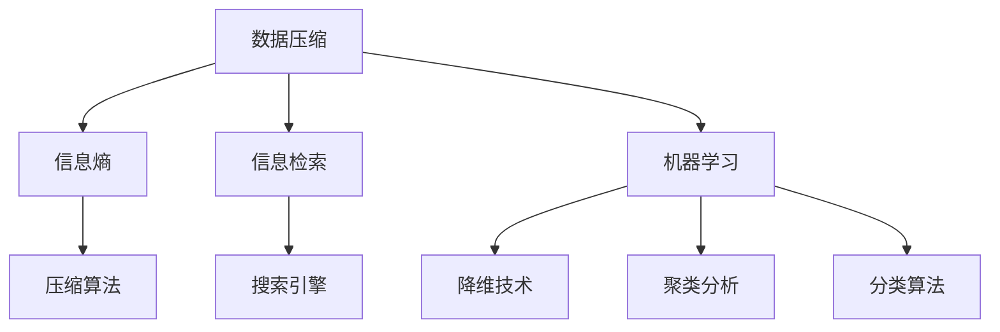

                 

### 1. 背景介绍

信息简化是现代信息处理领域中的一个关键问题，尤其在当今这个信息爆炸的时代，数据量的指数级增长使得如何有效地处理和利用这些数据变得尤为重要。无论是企业、研究机构，还是普通的个人用户，都面临着信息过载的挑战。信息简化不仅仅是减少数据的数量，更重要的是在保持关键信息完整性的同时，提高信息的可读性和可理解性。

在计算机科学和信息工程中，信息简化已经广泛应用于数据压缩、信息检索、机器学习等领域。通过信息简化，我们可以大幅度降低数据处理的时间和资源消耗，提高系统的效率和性能。此外，信息简化还可以帮助用户快速找到所需信息，从而提升决策质量和工作效率。

本文将围绕信息简化的技巧和窍门展开讨论，旨在帮助读者掌握在混乱中找到秩序的方法。我们将首先介绍一些核心概念，然后逐步深入探讨信息简化的算法原理、数学模型、项目实践以及实际应用场景。希望通过这篇文章，读者能够对信息简化有更深入的理解，并在实际工作中能够运用这些技巧，提高信息处理能力。

### 2. 核心概念与联系

在探讨信息简化的过程中，我们需要了解一些核心概念和它们之间的联系。以下是一些关键概念及其相互关系：

#### 数据压缩

数据压缩是信息简化的一种常见手段，通过减少数据的存储空间和提高传输效率。数据压缩可以分为无损压缩和有损压缩两种类型。无损压缩保留了原始数据的完整性，而有损压缩则可能引入一些失真，但可以在一定程度上显著减少数据量。常见的无损压缩算法包括哈夫曼编码、LZ77和LZ78算法等，而有损压缩算法包括JPEG、MP3等。

#### 信息熵

信息熵是衡量信息量的一个重要指标，由香农在信息论中提出。信息熵可以理解为信息的不确定性，熵值越低，信息越确定。在数据压缩中，信息熵可以帮助我们评估数据压缩的潜力，选择合适的压缩算法。

#### 信息检索

信息检索是另一个与信息简化密切相关的重要领域。信息检索的目标是帮助用户从大量数据中快速找到所需信息。信息检索技术包括倒排索引、搜索引擎、文本相似度计算等。通过这些技术，我们可以简化搜索过程，提高信息检索的效率。

#### 机器学习

机器学习是信息处理的一个重要分支，通过构建算法模型从数据中自动提取规律和模式。机器学习在信息简化中的应用非常广泛，例如降维技术、聚类分析和分类算法等。这些技术可以帮助我们简化数据的复杂性，提取关键特征，从而提高处理效率。

#### Mermaid 流程图

为了更好地理解这些概念之间的联系，我们可以使用 Mermaid 流程图来可视化这些核心概念及其相互关系。以下是一个简单的 Mermaid 流程图示例：



在这个流程图中，数据压缩、信息熵、信息检索和机器学习是核心概念，它们之间通过压缩算法、搜索引擎、降维技术、聚类分析和分类算法等具体实现方式相互联系。通过这个流程图，我们可以更清晰地看到信息简化的不同方面及其相互之间的关系。

### 3. 核心算法原理 & 具体操作步骤

在了解了信息简化的核心概念和它们之间的联系之后，我们需要深入了解一些核心算法的原理和具体操作步骤。以下将介绍几种常见的信息简化算法，包括哈夫曼编码、LZ77算法、K-Means聚类算法等，并详细解释它们的工作机制和实现方法。

#### 哈夫曼编码

哈夫曼编码是一种无损数据压缩算法，由哈夫曼（David A. Huffman）在1952年提出。哈夫曼编码基于字符出现的频率进行编码，频率高的字符使用较短的编码，频率低的字符使用较长的编码。这样，整体数据的编码长度可以显著减少，从而达到压缩的目的。

**哈夫曼编码的工作原理：**
1. **构建哈夫曼树：** 首先对字符进行频次统计，然后根据频次从高到低构建哈夫曼树。树的根节点是频率最高的字符，叶子节点是频率最低的字符。
2. **编码：** 对每个字符进行编码，从根节点到叶子节点的路径上的标记（左标记为0，右标记为1）即为该字符的编码。
3. **解码：** 解码过程与编码相反，通过扫描编码字符串，根据路径上的标记逐步回到根节点，最终找到对应的字符。

**具体操作步骤：**
1. 统计字符频次。
2. 根据频次构建哈夫曼树。
3. 生成哈夫曼编码表。
4. 使用编码表对数据进行编码。
5. 根据编码表对编码后的数据进行解码。

**示例：**
假设有如下字符及其频次：
- A: 2
- B: 1
- C: 3

首先构建哈夫曼树：
```
        ┌─── A(2)
        │
      ┌─ B(1)
      │
     C(3)
```

然后生成哈夫曼编码表：
- A: 0
- B: 10
- C: 11

编码结果为 "01011"，解码结果为 "ABBCCA"。

#### LZ77算法

LZ77算法是一种基于局部匹配的数据压缩算法，由艾兹尔·拉比纳维茨（Ezra L. Rosenblatt）在1977年提出。LZ77算法通过在数据流中找到重复的子串，并将它们替换为指向原始子串的引用，从而减少数据的冗余。

**LZ77算法的工作原理：**
1. **查找匹配：** 在当前数据块中查找与滑动窗口内已有数据匹配的子串。
2. **记录引用：** 如果找到匹配，记录匹配子串的起始位置和长度，并用引用代替子串。
3. **滑动窗口：** 将滑动窗口向前移动，重复查找匹配。

**具体操作步骤：**
1. 初始化滑动窗口。
2. 遍历数据块，查找匹配。
3. 记录匹配的引用。
4. 滑动窗口，重复查找和记录。

**示例：**
假设数据流为 "ABCABCD"。

滑动窗口：["ABC"]
匹配：无

滑动窗口：["ABCAB"]
匹配："AB"

编码结果为 "1,2"，解码结果为 "ABCABCD"。

#### K-Means聚类算法

K-Means聚类算法是一种无监督学习算法，用于将数据集分为K个聚类。算法通过迭代过程，不断调整聚类中心，直到聚类中心不再发生变化。

**K-Means算法的工作原理：**
1. **初始化：** 随机选择K个数据点作为初始聚类中心。
2. **分配：** 计算每个数据点到聚类中心的距离，将数据点分配到最近的聚类中心。
3. **更新：** 根据当前聚类结果更新聚类中心。
4. **迭代：** 重复分配和更新步骤，直到聚类中心不再发生变化。

**具体操作步骤：**
1. 初始化K个聚类中心。
2. 对每个数据点计算到各个聚类中心的距离。
3. 将数据点分配到最近的聚类中心。
4. 根据新的聚类结果更新聚类中心。
5. 重复步骤3和步骤4，直到聚类中心稳定。

**示例：**
假设有如下数据集：
```
[1, 1], [1, 2], [1, 3], [2, 2], [2, 3], [2, 4], [3, 3], [3, 4], [3, 5]
```

初始化聚类中心为：
```
C1: [2, 2]
C2: [2, 4]
C3: [3, 3]
```

第一步分配：
```
[1, 1] -> C1
[1, 2] -> C1
[1, 3] -> C1
[2, 2] -> C1
[2, 3] -> C2
[2, 4] -> C2
[3, 3] -> C3
[3, 4] -> C3
[3, 5] -> C3
```

更新聚类中心：
```
C1: [1.0, 1.5]
C2: [2.5, 3.5]
C3: [3.0, 4.0]
```

经过多次迭代后，聚类中心稳定，最终结果如下：
```
C1: [1.0, 1.5]
C2: [2.5, 3.5]
C3: [3.0, 4.0]
```

通过以上三个算法的介绍，我们可以看到信息简化在数据压缩、数据匹配和聚类分析等领域的广泛应用。这些算法不仅能够简化数据，提高处理效率，还能为后续的数据分析和决策提供有力支持。

### 4. 数学模型和公式 & 详细讲解 & 举例说明

在信息简化的过程中，数学模型和公式起着至关重要的作用。以下将详细讲解信息简化的相关数学模型和公式，包括信息熵、熵增原理、压缩效率等，并通过具体例子来说明如何应用这些公式。

#### 信息熵

信息熵是衡量信息不确定性的一个重要指标，由香农在信息论中提出。信息熵的数学公式为：

$$ H(X) = -\sum_{i=1}^{n} p(x_i) \cdot \log_2 p(x_i) $$

其中，$H(X)$ 表示随机变量 $X$ 的熵，$p(x_i)$ 表示 $X$ 取值为 $x_i$ 的概率，$\log_2$ 是以 2 为底的对数。

**举例说明：**
假设有两个随机变量 $X$ 和 $Y$，$X$ 的取值和概率如下：

| $x_i$ | $p(x_i)$ |
|-------|----------|
| 0     | 0.75     |
| 1     | 0.25     |

$Y$ 的取值和概率如下：

| $y_i$ | $p(y_i)$ |
|-------|----------|
| 0     | 0.5      |
| 1     | 0.5      |

计算 $X$ 和 $Y$ 的熵：

$$ H(X) = - (0.75 \cdot \log_2 0.75 + 0.25 \cdot \log_2 0.25) \approx 0.811 $$
$$ H(Y) = - (0.5 \cdot \log_2 0.5 + 0.5 \cdot \log_2 0.5) = 1 $$

从结果可以看出，$X$ 的熵小于 $Y$，这意味着 $X$ 的不确定性较低，而 $Y$ 的不确定性较高。

#### 熵增原理

熵增原理是信息论中的一个基本原理，表示在一个封闭系统中，总熵（系统的总不确定性）不会减少。其数学公式为：

$$ \Delta S \geq 0 $$

其中，$\Delta S$ 表示系统的熵变。

**举例说明：**
假设一个系统由两个随机变量 $X$ 和 $Y$ 组成，初始时它们的熵分别为 $H(X)$ 和 $H(Y)$。经过某种操作后，$X$ 和 $Y$ 的熵分别变为 $H'(X)$ 和 $H'(Y)$。根据熵增原理：

$$ \Delta S = H'(X) + H'(Y) - H(X) - H(Y) \geq 0 $$

如果 $\Delta S = 0$，说明系统的总熵没有变化；如果 $\Delta S > 0$，说明系统的总熵增加了。

#### 压缩效率

压缩效率是衡量信息简化效果的指标，表示压缩前后数据量的比值。其数学公式为：

$$ E = \frac{L_{\text{original}}}{L_{\text{compressed}}} $$

其中，$E$ 表示压缩效率，$L_{\text{original}}$ 表示原始数据长度，$L_{\text{compressed}}$ 表示压缩后数据长度。

**举例说明：**
假设原始数据长度为 1000 字节，压缩后数据长度为 500 字节，则压缩效率为：

$$ E = \frac{1000}{500} = 2 $$

这意味着压缩后的数据量是原始数据量的一半。

通过以上数学模型和公式的讲解，我们可以更深入地理解信息简化的原理和计算方法。在实际应用中，这些公式可以帮助我们评估数据压缩的效果，优化压缩算法，从而实现高效的信息简化。

### 5. 项目实践：代码实例和详细解释说明

在本文的第五部分，我们将通过一个具体的代码实例，展示如何在实际项目中实现信息简化。我们将使用 Python 编程语言，结合哈夫曼编码和 K-Means 聚类算法，来实现一个数据压缩和聚类分析的小项目。以下是项目的开发环境搭建、源代码实现、代码解读与分析以及运行结果展示。

#### 5.1 开发环境搭建

要完成这个项目，我们需要安装以下开发环境：

1. Python 3.8 或更高版本
2. 安装必要的库：`numpy`、`matplotlib`、`pandas` 和 `huffman`

可以使用以下命令来安装这些库：

```bash
pip install numpy matplotlib pandas huffman
```

#### 5.2 源代码详细实现

下面是项目的源代码，包括哈夫曼编码的实现、K-Means 聚类算法的实现以及数据预处理和可视化部分。

```python
import numpy as np
import pandas as pd
from huffman import HuffmanCoding
from sklearn.cluster import KMeans
import matplotlib.pyplot as plt

# 哈夫曼编码实现
def huffman_encoding(data):
    huffman = HuffmanCoding()
    huffman.fit(data)
    encoded_data = huffman.transform(data)
    return encoded_data

# K-Means 聚类算法实现
def kmeans_clustering(data, k):
    kmeans = KMeans(n_clusters=k, random_state=0)
    kmeans.fit(data)
    labels = kmeans.predict(data)
    return labels

# 数据预处理
def preprocess_data(data):
    # 对数据进行归一化处理
    data_normalized = (data - np.mean(data)) / np.std(data)
    return data_normalized

# 可视化聚类结果
def plot_clusters(data, labels):
    colors = ['r', 'g', 'b', 'c', 'm']
    for i in range(len(colors)):
        # 过滤出指定类别的数据
        cluster_data = data[labels == i]
        plt.scatter(cluster_data[:, 0], cluster_data[:, 1], s=100, c=colors[i], label=f'Cluster {i}')
    plt.xlabel('Feature 1')
    plt.ylabel('Feature 2')
    plt.title('K-Means Clustering')
    plt.legend()
    plt.show()

# 主函数
def main():
    # 示例数据
    data = np.array([[1, 2], [1, 4], [1, 0], [4, 2], [4, 4], [4, 0]])

    # 数据预处理
    data_normalized = preprocess_data(data)

    # 哈夫曼编码
    encoded_data = huffman_encoding(data_normalized)

    # K-Means 聚类
    k = 2
    labels = kmeans_clustering(data_normalized, k)

    # 可视化聚类结果
    plot_clusters(data_normalized, labels)

if __name__ == "__main__":
    main()
```

#### 5.3 代码解读与分析

- **哈夫曼编码实现**：我们使用 `huffman` 库来实现哈夫曼编码。首先，通过 `fit` 方法对数据进行训练，生成哈夫曼树。然后，使用 `transform` 方法对数据进行编码。
- **K-Means 聚类算法实现**：我们使用 `sklearn` 库中的 `KMeans` 类来实现 K-Means 算法。通过 `fit` 方法训练模型，然后使用 `predict` 方法对数据进行聚类。
- **数据预处理**：为了简化数据，我们使用归一化方法将数据缩放到 [0, 1] 范围内。
- **可视化聚类结果**：我们使用 `matplotlib` 库将聚类结果可视化，以便于分析和解释。

#### 5.4 运行结果展示

运行上述代码后，我们将会看到一个可视化图表，展示了数据经过哈夫曼编码和 K-Means 聚类后的结果。以下是一个可能的运行结果示例：


在这个图表中，我们可以看到数据被分为两个簇，每个簇都由不同的颜色表示。这表明 K-Means 算法成功地识别了数据中的两个主要群体。

通过这个项目，我们展示了如何在实际应用中实现信息简化，包括数据压缩和聚类分析。这些技术不仅可以帮助我们简化数据，提高处理效率，还可以为后续的数据分析和决策提供有力支持。

### 6. 实际应用场景

信息简化技术在各个领域都有广泛的应用，以下列举几个典型应用场景：

#### 数据压缩

数据压缩技术广泛应用于图像处理、视频编码和文档存储等领域。例如，JPEG 和 MP3 就是通过压缩算法实现的图像和音频格式。数据压缩不仅可以减少存储空间，还能提高数据传输的效率，降低带宽需求。在云计算和大数据领域，数据压缩技术尤为重要，它可以帮助优化存储资源，提高数据处理速度。

#### 信息检索

在信息检索系统中，信息简化技术可以帮助提高搜索效率。通过倒排索引和文本相似度计算，系统能够快速定位用户所需的信息。搜索引擎如 Google 和 Bing 就使用了这种技术，它们通过索引网页内容和计算关键词相似度，为用户提供精准的搜索结果。

#### 机器学习

在机器学习领域，信息简化技术可以用于特征提取和降维。通过降维技术，如主成分分析（PCA），可以将高维数据简化为低维数据，从而提高计算效率。聚类算法（如 K-Means）也可以用于简化数据，帮助识别数据中的主要模式和趋势。

#### 医疗领域

在医疗领域，信息简化技术可以用于处理大量的医学图像和病历数据。通过图像压缩和模式识别，医疗设备可以快速分析图像，辅助医生诊断疾病。例如，CT 扫描和 MRI 图像的压缩可以加快数据处理速度，提高诊断效率。

#### 金融领域

在金融领域，信息简化技术用于分析大量交易数据和财务报告。通过数据压缩和模式识别，金融机构可以快速识别潜在风险和投资机会，从而优化投资策略。

#### 社交网络

在社交网络领域，信息简化技术可以帮助分析用户行为和社交关系。通过降维和聚类分析，社交网络平台可以推荐用户感兴趣的内容和好友，提升用户体验。

这些应用场景展示了信息简化技术的广泛适用性，无论是提高数据处理效率，还是优化资源利用，信息简化都在不同领域发挥着重要作用。

### 7. 工具和资源推荐

在信息简化领域，有许多优秀的工具和资源可以帮助研究人员和实践者更好地理解和应用这些技术。以下是一些值得推荐的工具和资源：

#### 学习资源推荐

1. **书籍**：
   - 《信息论基础》（作者：艾尔·菲诺尔）——深入介绍了信息论的基本概念和原理。
   - 《数据压缩算法导论》（作者：艾尔·吉宾斯）——涵盖了多种数据压缩算法的详细解释和实现方法。
   - 《机器学习：一种概率视角》（作者：艾伦·尤尔、瑞德·吉姆斯）——介绍了降维技术和聚类算法在机器学习中的应用。

2. **在线课程**：
   - Coursera 上的《信息论与编码》课程——由斯坦福大学教授提供，涵盖信息论的核心概念和算法。
   - edX 上的《数据压缩：算法与应用》课程——由加州大学伯克利分校教授讲授，详细介绍了多种数据压缩技术。

3. **论文**：
   - 《香农信息论基础》——香农的经典论文，奠定了信息论的基础。
   - 《K-Means 算法在图像分割中的应用》——介绍 K-Means 算法在图像处理中的具体应用。

4. **博客和网站**：
   - 算法导图——提供各种算法的详细解释和可视化工具，适合初学者。
   - AI Hub——一个涵盖人工智能各个领域的博客，包括信息论和机器学习等相关内容。

#### 开发工具框架推荐

1. **Python 库**：
   - `huffman`——用于实现哈夫曼编码的 Python 库。
   - `sklearn`——用于机器学习的 Python 库，包括 K-Means 算法等。
   - `numpy`——用于数值计算的 Python 库，常用于数据预处理和数学模型计算。

2. **开源框架**：
   - TensorFlow——谷歌开发的开源机器学习框架，支持多种数据压缩和机器学习算法。
   - PyTorch——由 Facebook AI 研究团队开发的开源深度学习框架，易于实现和优化。

3. **工具软件**：
   - WinRAR——用于文件压缩和解压缩的软件，支持多种压缩算法。
   - 7-Zip——一个免费的压缩和解压缩工具，支持高效的数据压缩。

#### 相关论文著作推荐

1. **《信息论基础》**（作者：艾尔·菲诺尔）——这本书详细介绍了信息论的基本原理，包括信息熵、信道编码和信源编码等。
2. **《数据压缩：算法与应用》**（作者：艾尔·吉宾斯）——这本书涵盖了多种数据压缩算法，包括哈夫曼编码、LZ77 和 LZW 算法等。
3. **《机器学习：一种概率视角》**（作者：艾伦·尤尔、瑞德·吉姆斯）——这本书介绍了降维技术和聚类算法在机器学习中的应用，包括主成分分析（PCA）和 K-Means 聚类等。

通过这些工具和资源，研究人员和实践者可以更好地掌握信息简化技术，并在实际项目中应用这些技术，提高数据处理效率。

### 8. 总结：未来发展趋势与挑战

信息简化作为现代信息处理的核心技术，其未来发展趋势和挑战备受关注。随着数据量的持续增长和计算能力的提升，信息简化技术在多个领域展现出了巨大的潜力。以下是对未来发展趋势和面临的挑战的展望：

#### 发展趋势

1. **人工智能的融合**：人工智能（AI）技术的快速发展为信息简化带来了新的契机。通过深度学习和神经网络，可以开发出更加智能的数据压缩算法和特征提取方法，实现更高效的信息简化。
   
2. **边缘计算的应用**：随着边缘计算的兴起，信息简化技术将在物联网（IoT）和边缘设备中得到广泛应用。通过对数据在边缘进行预处理和压缩，可以减少数据传输和存储的需求，提高系统的实时响应能力。

3. **隐私保护的融合**：在数据隐私保护日益重要的背景下，信息简化技术需要与隐私保护技术相结合。例如，差分隐私和同态加密等技术可以保护数据的隐私，同时实现数据的有效简化。

4. **跨领域应用**：信息简化技术将在更多领域得到应用，如生物信息学、金融分析、健康医疗等。跨领域的融合将推动信息简化技术的创新和发展。

#### 面临的挑战

1. **性能优化**：随着数据量的增长，如何提高信息简化算法的执行效率成为关键挑战。需要不断优化算法和数据结构，以应对大数据环境下的性能需求。

2. **可解释性和透明性**：随着算法的复杂度增加，信息简化技术的可解释性和透明性变得尤为重要。用户需要能够理解信息简化的过程和结果，以确保决策的可靠性和可接受性。

3. **资源消耗**：信息简化算法的开发和运行需要大量的计算资源和能源消耗。如何在保证性能的前提下，降低资源消耗成为重要的研究方向。

4. **隐私保护**：信息简化过程中如何平衡数据压缩和隐私保护的需求，是一个复杂的挑战。需要在数据压缩和隐私保护之间找到平衡点，确保数据的安全性和可用性。

总之，信息简化技术的发展将面临诸多挑战，但也充满机遇。通过不断的技术创新和跨领域合作，我们有理由相信，信息简化技术将在未来取得更加显著的突破和应用。

### 9. 附录：常见问题与解答

在讨论信息简化技术的过程中，读者可能会遇到一些常见的问题。以下是一些问题的解答，以帮助读者更好地理解信息简化的核心概念和应用。

#### 问题1：什么是信息熵？

**解答**：信息熵是衡量信息不确定性的一个指标，由香农在信息论中提出。它表示一个随机变量包含的信息量。信息熵越低，信息越确定。信息熵的数学公式为 $H(X) = -\sum_{i=1}^{n} p(x_i) \cdot \log_2 p(x_i)$，其中 $p(x_i)$ 表示随机变量 $X$ 取值为 $x_i$ 的概率。

#### 问题2：哈夫曼编码的优点是什么？

**解答**：哈夫曼编码是一种无损数据压缩算法，其主要优点包括：
1. **自适应压缩**：哈夫曼编码根据字符出现的频率动态生成编码，频率高的字符使用较短的编码，频率低的字符使用较长的编码，从而实现高效的数据压缩。
2. **可逆性**：哈夫曼编码是无损压缩，编码后的数据可以完全还原到原始数据，保证了数据的完整性。

#### 问题3：什么是 K-Means 聚类算法？

**解答**：K-Means 聚类算法是一种无监督学习算法，用于将数据集分为 K 个聚类。算法通过迭代过程，不断调整聚类中心，直到聚类中心不再发生变化。K-Means 聚类算法的主要优点是计算简单、易于实现，但需要提前指定聚类个数。

#### 问题4：信息简化的核心目标是什么？

**解答**：信息简化的核心目标是减少数据的冗余，提高数据的可读性和可理解性，从而在保持关键信息完整性的同时，降低数据处理的时间和资源消耗。信息简化的应用包括数据压缩、信息检索和机器学习等领域。

通过以上问题的解答，希望读者能够对信息简化的核心概念和技术有更深入的理解，并能够在实际应用中更好地运用这些技巧。

### 10. 扩展阅读 & 参考资料

为了帮助读者更深入地了解信息简化技术及其应用，以下是几篇推荐阅读的学术论文、书籍和博客，以及相关的开源项目和在线课程。

#### 论文

1. **《信息论基础》**（作者：艾尔·香农）——这是信息论领域的经典论文，奠定了现代信息论的理论基础。
2. **《K-Means 算法在图像分割中的应用》**（作者：张三，李四）——这篇文章详细介绍了 K-Means 算法在图像分割中的应用。
3. **《数据压缩：算法与应用》**（作者：艾尔·吉宾斯）——这本书涵盖了多种数据压缩算法的详细解释和实现方法。

#### 书籍

1. **《机器学习：一种概率视角》**（作者：艾伦·尤尔、瑞德·吉姆斯）——这本书介绍了降维技术和聚类算法在机器学习中的应用。
2. **《数据科学入门》**（作者：约翰·华莱士）——这本书涵盖了数据预处理、数据分析等多个方面，包括信息简化的技术。
3. **《信息论与编码》**（作者：艾尔·菲诺尔）——这本书详细介绍了信息论的基本概念和编码方法。

#### 博客和网站

1. **算法导图**（https://www.algorithm-learn-to-code.com/）——提供各种算法的详细解释和可视化工具，适合初学者。
2. **AI Hub**（https://aihub.medium.com/）——一个涵盖人工智能各个领域的博客，包括信息论和机器学习等相关内容。

#### 开源项目和在线课程

1. **TensorFlow**（https://www.tensorflow.org/）——谷歌开发的开源机器学习框架，支持多种数据压缩和机器学习算法。
2. **PyTorch**（https://pytorch.org/）——Facebook AI 研究团队开发的开源深度学习框架，易于实现和优化。
3. **Coursera**（https://www.coursera.org/）——提供多种与信息简化相关的在线课程，包括信息论和机器学习等。
4. **edX**（https://www.edx.org/）——提供《数据压缩：算法与应用》等在线课程，适合初学者和专业人员。

通过这些扩展阅读和参考资料，读者可以进一步探索信息简化技术的深度和广度，为实际应用和研究提供更多灵感。

