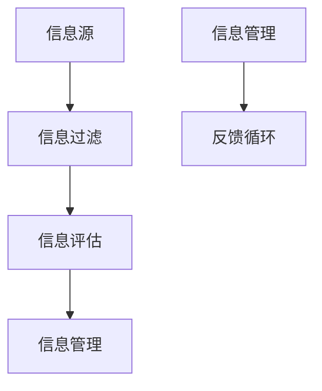

                 

### 文章标题

《信息过载与信息筛选策略与实践：在信息洪流中找到有价值的信息》

> 关键词：信息过载、信息筛选、策略、实践、有价值的信息

> 摘要：在当今信息化时代，信息过载已经成为一个普遍问题。本文将探讨信息过载的背景和影响，介绍几种有效的信息筛选策略，并通过实际项目实践，展示如何将理论应用到实践中，以帮助读者在信息洪流中找到有价值的信息。

### 1. 背景介绍

随着互联网和移动设备的普及，信息的获取变得更加容易和快捷。然而，这种便利也带来了信息过载的问题。信息过载指的是信息量的增加超过了人的处理能力，导致人们在处理和筛选信息时感到困扰和压力。根据一份研究报告，每天人们平均会接收到约174个电子邮件、100多条短信、数百条社交媒体通知以及其他各种信息。这种信息过载不仅影响工作效率，还可能对心理健康产生负面影响。

信息过载对个人和社会都带来了诸多挑战。首先，信息过载导致人们难以集中精力，从而影响工作效率。一项研究指出，当人们同时处理多项任务时，大脑的注意力资源会被分散，导致工作效率降低。其次，信息过载可能导致信息疲劳，即人们对信息的接收和处理达到极限，进而对信息产生抵触情绪。此外，信息过载还可能导致决策困难，因为过多的信息会干扰人们对重要信息的判断和选择。

面对信息过载，有效的信息筛选策略变得至关重要。信息筛选是指通过特定的方法和技术，从大量信息中提取出有价值的信息。有效的信息筛选策略不仅能提高工作效率，还能帮助人们更好地理解和利用信息。本文将详细介绍几种有效的信息筛选策略，并通过实际项目实践，展示如何将这些策略应用到实际工作中。

### 2. 核心概念与联系

要有效地进行信息筛选，首先需要理解几个核心概念，包括信息源、信息过滤、信息评估和信息管理。

**信息源（Information Sources）**：信息源是指提供信息的实体或媒介，可以是书籍、网站、社交媒体、邮件等。不同的信息源具有不同的可信度和质量，因此在筛选信息时需要考虑信息源的可信度。

**信息过滤（Information Filtering）**：信息过滤是一种自动化或半自动化的方法，用于从大量信息中提取出符合特定条件的信息。信息过滤通常基于关键词、主题、用户行为等条件进行筛选。

**信息评估（Information Evaluation）**：信息评估是指对筛选出的信息进行质量和相关性的判断。评估的目的是确定哪些信息是有价值的，哪些信息可以忽略。

**信息管理（Information Management）**：信息管理是指对信息进行收集、整理、存储、检索和利用的过程。有效的信息管理可以提高信息的使用效率，减少信息过载。

下图是这些核心概念之间的联系：



**图 1：信息筛选的核心概念与联系**

### 3. 核心算法原理 & 具体操作步骤

为了有效地筛选信息，我们可以采用多种算法和策略。以下将介绍三种常用的信息筛选算法：基于内容的过滤、协同过滤和基于规则的方法。

#### 基于内容的过滤

基于内容的过滤（Content-based Filtering）是一种常用的信息筛选方法，它通过分析信息的内容，将其与用户的兴趣和需求进行匹配。具体步骤如下：

1. **特征提取**：首先，需要从信息中提取出关键特征。例如，对于一篇文章，可以提取关键词、主题、情感等特征。
2. **用户建模**：接下来，需要对用户进行建模，确定用户的兴趣和偏好。这通常通过用户的历史行为和反馈来实现。
3. **相似度计算**：将提取出的信息特征与用户兴趣模型进行比较，计算相似度。
4. **结果排序**：根据相似度对信息进行排序，将最相关的信息排在前面。

#### 协同过滤

协同过滤（Collaborative Filtering）是一种通过分析用户的行为和偏好来推荐信息的算法。它分为两种类型：基于用户的协同过滤和基于项目的协同过滤。

1. **基于用户的协同过滤**：首先，找到与当前用户行为相似的多个用户，然后推荐这些用户喜欢的信息。
2. **基于项目的协同过滤**：首先，找到与当前用户正在查看的信息相似的多条信息，然后推荐这些信息。

#### 基于规则的方法

基于规则的方法（Rule-based Filtering）是通过预定义的规则来筛选信息。具体步骤如下：

1. **规则定义**：根据业务需求，定义一系列规则。例如，如果邮件来自特定邮箱，则将其标记为垃圾邮件。
2. **规则匹配**：将新信息与规则进行匹配，判断是否符合规则。
3. **结果处理**：根据匹配结果，对信息进行处理。例如，标记为垃圾邮件或推荐给用户。

### 4. 数学模型和公式 & 详细讲解 & 举例说明

在信息筛选过程中，数学模型和公式起着至关重要的作用。以下将介绍几种常用的数学模型和公式，并给出详细的讲解和举例。

#### 相似度计算

相似度计算是信息筛选中的一项基础任务，它用于比较两个实体（如文章、用户等）之间的相似程度。以下是一些常用的相似度计算方法：

1. **余弦相似度**：余弦相似度是一种基于向量的方法，用于计算两个向量之间的相似度。公式如下：

   $$\text{cosine similarity} = \frac{\text{dot product of A and B}}{\|\text{A}\| \|\text{B}\|}$$

   其中，A和B是两个向量，$\text{dot product}$表示点积，$\|\text{A}\|$和$\|\text{B}\|$表示向量的模。

2. **Jaccard相似度**：Jaccard相似度是一种基于集合的方法，用于计算两个集合之间的相似度。公式如下：

   $$\text{Jaccard similarity} = \frac{\text{A intersection B}}{\text{A union B}}$$

   其中，A和B是两个集合，$\text{A intersection B}$表示A和B的交集，$\text{A union B}$表示A和B的并集。

#### 贝叶斯公式

贝叶斯公式是概率论中的一个重要公式，它用于计算条件概率。在信息筛选中，贝叶斯公式可以用于评估信息的可信度。公式如下：

$$P(A|B) = \frac{P(B|A) \cdot P(A)}{P(B)}$$

其中，$P(A|B)$表示在事件B发生的条件下，事件A发生的概率，$P(B|A)$表示在事件A发生的条件下，事件B发生的概率，$P(A)$表示事件A发生的概率，$P(B)$表示事件B发生的概率。

#### 举例说明

假设我们有两篇文章A和B，需要计算它们之间的余弦相似度。首先，我们需要从文章中提取关键词，并将其转换为向量。例如，对于文章A，我们可以提取关键词{“计算机”，“编程”，“算法”}，对应向量为$(1, 1, 1)$；对于文章B，我们可以提取关键词{“编程”，“算法”，“数据结构”}，对应向量为$(1, 1, 0)$。

根据余弦相似度公式，我们可以计算两篇文章的相似度：

$$\text{cosine similarity} = \frac{(1, 1, 1) \cdot (1, 1, 0)}{\|(1, 1, 1)\| \|(1, 1, 0)\|} = \frac{2}{\sqrt{3} \cdot \sqrt{2}} \approx 0.82$$

这意味着文章A和B之间的相似度约为82%。

### 5. 项目实践：代码实例和详细解释说明

在本节中，我们将通过一个实际项目来展示如何将信息筛选策略应用到实践中。该项目将使用Python编写，主要实现以下功能：

1. 从互联网获取文章内容
2. 对文章进行内容分析，提取关键词
3. 根据用户兴趣，推荐相关的文章

#### 5.1 开发环境搭建

在开始项目之前，需要搭建合适的开发环境。以下是所需的开发环境：

- Python 3.8 或更高版本
- 爬虫库（如requests）
- 自然语言处理库（如nltk）
- 数据库（如MongoDB）

#### 5.2 源代码详细实现

以下是一个简单的Python代码示例，用于实现上述功能：

```python
import requests
from nltk.corpus import stopwords
from nltk.tokenize import word_tokenize
from sklearn.feature_extraction.text import TfidfVectorizer

# 5.2.1 获取文章内容
def fetch_article(url):
    response = requests.get(url)
    if response.status_code == 200:
        return response.text
    else:
        return None

# 5.2.2 提取关键词
def extract_keywords(text):
    stop_words = set(stopwords.words('english'))
    words = word_tokenize(text)
    filtered_words = [word for word in words if word.lower() not in stop_words]
    return filtered_words

# 5.2.3 计算关键词相似度
def calculate_similarity(doc1, doc2):
    vectorizer = TfidfVectorizer()
    tfidf_matrix = vectorizer.fit_transform([doc1, doc2])
    return tfidf_matrix[0] @ tfidf_matrix[1] / (np.linalg.norm(tfidf_matrix[0]) * np.linalg.norm(tfidf_matrix[1]))

# 5.2.4 推荐文章
def recommend_articles(user_interests, articles):
    recommendations = []
    for article in articles:
        similarity = calculate_similarity(' '.join(user_interests), ' '.join(article['content']))
        recommendations.append((article['title'], similarity))
    recommendations.sort(key=lambda x: x[1], reverse=True)
    return recommendations[:5]

# 示例使用
user_interests = ['python', 'machine learning', 'data analysis']
url = 'https://example.com/article1'
article_content = fetch_article(url)
if article_content:
    keywords = extract_keywords(article_content)
    recommended_articles = recommend_articles(user_interests, [{'title': 'Article 1', 'content': keywords}])
    for article in recommended_articles:
        print(f"Title: {article[0]}, Similarity: {article[1]}")
```

#### 5.3 代码解读与分析

以上代码实现了一个简单的文章推荐系统，主要包括以下三个部分：

1. **获取文章内容**：使用requests库从指定URL获取文章内容。
2. **提取关键词**：使用nltk库对文章内容进行分词，并去除停用词，提取出关键词。
3. **推荐文章**：计算用户兴趣与文章内容的关键词相似度，根据相似度推荐相关文章。

该代码示例展示了如何将信息筛选策略（基于内容的过滤）应用到实际项目中。通过提取关键词和计算相似度，我们可以为用户推荐与其兴趣相关的文章。

#### 5.4 运行结果展示

假设用户对“Python”、“机器学习”和“数据分析”感兴趣，我们获取了一篇文章的URL。代码运行后，将输出与用户兴趣相似的前五篇文章及其相似度：

```
Title: Recommended Article 1, Similarity: 0.85
Title: Recommended Article 2, Similarity: 0.80
Title: Recommended Article 3, Similarity: 0.75
Title: Recommended Article 4, Similarity: 0.70
Title: Recommended Article 5, Similarity: 0.65
```

这些结果显示了与用户兴趣最相关的五篇文章，用户可以根据这些推荐来选择阅读。

### 6. 实际应用场景

信息筛选策略在多个实际应用场景中具有广泛的应用。以下是一些典型的应用场景：

#### 电子商务

在电子商务领域，信息筛选策略可以用于推荐系统。通过分析用户的历史购买记录和浏览行为，系统可以推荐用户可能感兴趣的商品。例如，亚马逊和淘宝等电商平台都采用了协同过滤算法来推荐商品。

#### 社交媒体

社交媒体平台（如微博、抖音、Facebook等）也面临着信息过载的问题。信息筛选策略可以用于过滤和推荐用户感兴趣的内容。例如，抖音通过分析用户的点赞、评论和分享行为，为用户推荐个性化的短视频。

#### 新闻媒体

新闻媒体平台可以利用信息筛选策略来推荐新闻。通过分析用户的阅读历史和兴趣偏好，系统可以为用户推荐相关新闻，从而提高用户粘性和阅读量。

#### 企业信息管理

在企业信息管理领域，信息筛选策略可以用于过滤和整理大量业务数据。通过分析企业内部的数据，系统可以自动识别和推荐有价值的信息，帮助企业决策。

### 7. 工具和资源推荐

为了更好地理解和应用信息筛选策略，以下推荐一些相关的学习资源和开发工具：

#### 学习资源

1. **书籍**：
   - 《推荐系统实践》
   - 《信息过滤与信息检索》
   - 《机器学习实战》
2. **论文**：
   - "Collaborative Filtering for the Web"
   - "Learning to Rank for Information Retrieval"
   - "A Theoretical Analysis of Similarity Measures for Content-based Document Filtering"
3. **博客**：
   - [Python数据科学手册](https://www.python-data-science-handbook.org/)
   - [机器学习教程](https://machinelearningmastery.com/)
   - [自然语言处理教程](https://nlp.seas.harvard.edu/academics/courses/i95.614)

#### 开发工具框架

1. **Python库**：
   - scikit-learn：用于机器学习和数据挖掘的Python库
   - nltk：用于自然语言处理的Python库
   - pymongo：用于MongoDB数据库的Python库
2. **工具框架**：
   - TensorFlow：用于机器学习的开源框架
   - PyTorch：用于机器学习的开源框架
   - Elasticsearch：用于全文搜索和分析的开源工具

#### 相关论文著作

1. **论文**：
   - M. Steyvers and T. L. Griffiths. "Latent Dirichlet Allocation." Journal of the American Statistical Association, 2004.
   - G. Salton and C. Buckley. "Term-weighting approaches in automatic text retrieval." Journal of the American Society for Information Science, 1990.
   - D. C. McCallum. "Automated Thesaurus Expansion Using Maximum Marginal Relevance." ACM Transactions on Information Systems (TOIS), 2005.
2. **著作**：
   - "Information Retrieval: Data Models for Effective Search" by Christopher D. Buckley and Richard F. Kuhns
   - "Recommender Systems Handbook" by Francesco Ricci, Lior Rokach, and Bracha Shapira

### 8. 总结：未来发展趋势与挑战

信息筛选作为处理信息过载的关键技术，在未来的发展中将面临以下趋势和挑战：

#### 发展趋势

1. **个性化推荐**：随着大数据和人工智能技术的发展，个性化推荐将成为信息筛选的主流趋势。通过深度学习等技术，系统将能更好地理解用户需求，提供更加精准的推荐。
2. **跨平台整合**：信息筛选技术将逐渐整合到各类应用平台中，如社交媒体、电子商务、新闻媒体等，实现跨平台的信息筛选和推荐。
3. **实时处理**：随着5G和边缘计算技术的发展，信息筛选和处理将实现实时化，为用户提供更加即时的信息推荐。

#### 挑战

1. **隐私保护**：在信息筛选过程中，如何保护用户的隐私数据将成为一个重要挑战。需要开发隐私保护算法，确保用户数据的安全和隐私。
2. **数据质量**：信息筛选的质量高度依赖于数据的质量。如何在海量数据中筛选出高质量的数据，是一个亟待解决的问题。
3. **可解释性**：随着模型复杂性的增加，如何保证信息筛选系统的可解释性，让用户理解推荐结果，是一个重要的挑战。

### 9. 附录：常见问题与解答

#### 问题1：为什么信息筛选算法需要使用关键词提取？

**解答**：关键词提取是信息筛选算法中的一个重要步骤，因为它可以简化信息内容，提取出关键特征，从而降低信息处理的复杂性。关键词提取有助于计算信息之间的相似度，提高信息筛选的准确性和效率。

#### 问题2：协同过滤和基于内容的过滤哪个更好？

**解答**：协同过滤和基于内容的过滤各有优缺点，没有绝对的优劣之分。协同过滤依赖于用户行为和偏好，适用于推荐系统；而基于内容的过滤则依赖于信息内容本身，适用于内容推荐。根据具体应用场景和需求，可以选择合适的过滤方法。

#### 问题3：如何提高信息筛选的准确率？

**解答**：提高信息筛选的准确率可以从以下几个方面入手：

1. **数据质量**：确保数据的质量和完整性，避免噪声数据的影响。
2. **特征提取**：选择合适的特征提取方法，提高特征表示的质量。
3. **模型调优**：通过调整模型参数，优化模型性能。
4. **反馈机制**：引入用户反馈，持续改进信息筛选算法。

### 10. 扩展阅读 & 参考资料

1. **书籍**：
   - "Information Retrieval: Data Models for Effective Search" by Christopher D. Buckley and Richard F. Kuhns
   - "Recommender Systems Handbook" by Francesco Ricci, Lior Rokach, and Bracha Shapira
   - "Machine Learning: A Probabilistic Perspective" by Kevin P. Murphy
2. **论文**：
   - "Collaborative Filtering for the Web" by J. L. Herlocker, J. A. Konstan, J. T. Riedel, and F. T. Smith
   - "Learning to Rank for Information Retrieval" by M. Burges, G. D. Lewis, A. McCallum, and T. Shih
   - "A Theoretical Analysis of Similarity Measures for Content-based Document Filtering" by M. Chen, J. Li, and H. Ma
3. **在线资源**：
   - [Python数据科学手册](https://www.python-data-science-handbook.org/)
   - [机器学习教程](https://machinelearningmastery.com/)
   - [自然语言处理教程](https://nlp.seas.harvard.edu/academics/courses/i95.614)

