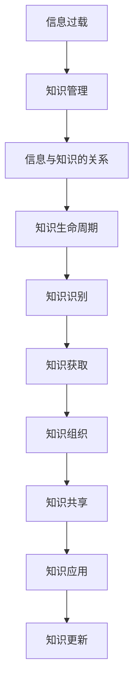

                 

### 背景介绍 Background

在当今数字化的时代，信息过载（Information Overload）已成为一个普遍的现象。随着互联网、社交媒体和智能设备的普及，人们每天都要处理大量的信息。这些信息包括新闻报道、社交媒体更新、电子邮件、即时通讯等。这种信息过载现象不仅对普通用户构成了挑战，也给企业组织带来了巨大的压力。

企业组织面临的挑战主要体现在以下几个方面：

1. **决策难度增加**：在信息过载的环境下，企业需要从大量的信息中筛选出有价值的信息，以便做出准确的决策。然而，大量的无意义或无关信息增加了筛选的难度，使得决策过程变得复杂且耗时。

2. **生产力下降**：员工在处理大量信息时，会花费大量的时间和精力。这不仅降低了工作效率，还可能导致员工产生疲劳和焦虑，进而影响整体生产力。

3. **信息安全风险**：信息过载还可能导致企业内部信息泄露的风险增加。未经处理的敏感信息可能在未经授权的情况下被分享或泄露。

4. **知识管理难题**：在信息过载的环境下，企业难以有效地管理和组织其内部的知识资产。这导致知识的共享和利用效率低下，进而影响了企业的创新能力和竞争力。

为了应对这些挑战，企业需要采取有效的知识管理策略。知识管理（Knowledge Management，KM）是指通过识别、收集、组织、共享和应用知识，以提高个人和组织的效率和绩效的过程。有效的知识管理可以帮助企业从信息过载中解脱出来，提高信息的利用效率，降低风险，并促进创新。

本文将探讨信息过载与知识管理策略的关系，介绍几种有效的知识管理方法，并探讨其在实际应用中的挑战和解决方案。通过本文的探讨，读者将能够更好地理解如何应对信息过载，并有效地管理和利用知识。

## 1.1 信息过载的现象与影响

信息过载是指在短时间内接收到超过个人处理能力的信息量，导致个体在处理这些信息时感到压力和困惑。随着互联网的快速发展，信息过载的现象日益严重。据《纽约时报》报道，人类每天接收到的信息量是19世纪的中几千倍。这种快速的信息增长给人们的生活和工作带来了极大的挑战。

首先，信息过载对个人的影响主要体现在以下几个方面：

1. **心理压力增加**：当人们不断地接收和处理大量信息时，容易产生焦虑、紧张和压力感。研究表明，长时间处于高压力状态可能导致心理健康问题，如抑郁症和焦虑症。

2. **认知负担加重**：信息过载使得人们需要花费更多的时间和精力来筛选和处理信息，这增加了大脑的认知负担。长期如此，可能导致认知能力下降，影响判断和决策能力。

3. **时间管理困难**：在信息过载的环境下，人们往往无法有效地管理时间，导致工作效率降低。许多人抱怨他们无法专注于一项任务，而是被不断的打扰和信息分散了注意力。

其次，信息过载对组织的影响也显而易见：

1. **决策效率降低**：在信息过载的情况下，组织难以从大量信息中筛选出关键信息，导致决策过程变得复杂和耗时。这不仅降低了决策效率，还可能导致错误的决策。

2. **沟通成本增加**：信息过载使得组织内部和外部的沟通变得更加困难。过多的信息可能会导致信息的重复和冗余，增加沟通成本，同时也会降低信息的传递效率。

3. **知识管理困难**：在信息过载的环境下，组织难以有效地管理和组织其内部的知识资产。这不仅影响了知识的共享和利用效率，还可能导致知识的流失和重复工作。

为了应对信息过载，组织和个人都需要采取有效的策略和方法。有效的知识管理策略可以帮助组织从信息过载中解脱出来，提高信息的利用效率，降低风险，并促进创新。接下来，本文将详细介绍几种核心的知识管理方法，并探讨其实际应用中的挑战和解决方案。

## 1.2 核心概念与联系 Core Concepts and Connections

在探讨信息过载与知识管理策略之前，我们需要明确几个核心概念，并理解它们之间的联系。

### 信息过载（Information Overload）

信息过载是指个体或组织在短时间内接收到超过其处理能力的信息量。这种现象通常是由于信息的爆炸性增长和快速传播造成的。信息过载对个体和组织都产生了负面影响，如心理压力增加、认知负担加重、决策效率降低等。

### 知识管理（Knowledge Management，KM）

知识管理是一种通过识别、收集、组织、共享和应用知识，以提高个人和组织的效率和绩效的过程。有效的知识管理可以帮助组织从信息过载中解脱出来，提高信息的利用效率，降低风险，并促进创新。

### 信息与知识的关系

信息和知识之间有着密切的联系。信息是知识的基础，但信息本身并不等同于知识。知识是对信息进行加工、理解和应用的结果。例如，一个数据点本身是信息，而通过对这些数据点的分析和理解，我们可以获得知识。

### 知识生命周期

知识生命周期是指知识从产生、传播、应用到退化的整个过程。知识生命周期管理是知识管理的重要组成部分，包括知识的创造、存储、共享、使用和更新等环节。

### 知识管理的关键要素

知识管理的关键要素包括知识识别、知识获取、知识组织、知识共享、知识应用和知识更新等。这些要素相互作用，共同构成了一个完整的知识管理流程。

### Mermaid 流程图

为了更好地理解这些核心概念和它们之间的联系，我们可以使用 Mermaid 流程图来表示。以下是一个简化的 Mermaid 流程图，展示了信息过载、知识管理、信息与知识的关系以及知识生命周期的流程。



在这个流程图中，信息过载是知识管理的起点，通过知识管理的过程，最终实现了知识的创造、传播和应用。知识生命周期管理则确保了知识的持续更新和优化，从而提高了知识的利用效率。

通过理解这些核心概念和它们之间的联系，我们可以更好地应对信息过载，并有效地进行知识管理。接下来的部分将详细探讨知识管理的方法和实践，帮助读者了解如何在实际应用中实现有效的知识管理。

### 核心算法原理 & 具体操作步骤 Core Algorithm Principles and Step-by-Step Operations

在知识管理领域，有一种广泛应用的算法，称为"知识图谱构建算法"（Knowledge Graph Construction Algorithm）。该算法通过将离散的信息片段组织成结构化的知识图谱，帮助用户更好地理解和利用信息。以下是该算法的具体原理和操作步骤：

#### 1. 数据预处理

在构建知识图谱之前，首先需要对原始数据进行预处理。数据预处理包括数据清洗、数据整合和数据转换等步骤。

1. **数据清洗**：清洗数据以去除重复、错误或不完整的信息。例如，使用去重算法去除重复的数据记录。
2. **数据整合**：将来自不同来源的数据进行整合，形成一个统一的数据集。这可能涉及到数据格式转换、数据标准化和数据映射等操作。
3. **数据转换**：将原始数据转换为适合构建知识图谱的格式，如RDF（Resource Description Framework）或OWL（Web Ontology Language）。

#### 2. 知识图谱构建

构建知识图谱的核心步骤是将预处理后的数据组织成图结构。以下是构建知识图谱的基本步骤：

1. **实体识别**：从数据中识别出重要的实体，如人、地点、组织等。可以使用命名实体识别（Named Entity Recognition，NER）技术来实现。
2. **关系抽取**：确定实体之间的相互关系，如"工作于"、"位于"、"属于"等。关系抽取可以通过模式匹配、机器学习或规则引擎等方法实现。
3. **实体链接**：将同一实体的不同名称映射到同一个实体上，如将"苹果公司"和"Apple Inc."映射到同一实体。
4. **构建图结构**：将识别出的实体和关系组织成图结构，使用图数据库如Neo4j来存储和管理知识图谱。

#### 3. 知识推理

构建知识图谱后，可以对其进行知识推理（Knowledge Reasoning）以发现新的信息和关联。以下是几种常见的数据推理方法：

1. **基于规则的推理**：使用预定义的规则来推导新的结论。例如，如果实体A具有属性P，那么它也具有属性Q。
2. **基于模型的推理**：使用机器学习模型来发现实体之间的关系和模式。例如，使用图神经网络（Graph Neural Network，GNN）来预测实体之间的潜在关系。
3. **基于本体的推理**：使用本体（Ontology）来定义实体的属性和关系，并使用本体推理引擎来推导新的结论。

#### 4. 知识可视化

为了更好地理解和利用知识图谱，可以将知识可视化（Knowledge Visualization）。以下是一些常用的知识可视化技术：

1. **节点和边的可视化**：通过节点和边的颜色、大小、形状等属性来表示实体和关系的重要性和关联度。
2. **层次化可视化**：将知识图谱分层组织，使用树状图或层次图来表示实体和关系之间的层次结构。
3. **交互式可视化**：使用交互式可视化工具，如D3.js或Cytoscape.js，允许用户通过拖放、缩放和过滤等方式与知识图谱进行交互。

#### 5. 知识应用

知识图谱可以应用于多个领域，如自然语言处理、推荐系统、知识库构建等。以下是几个常见的应用场景：

1. **问答系统**：使用知识图谱构建问答系统，能够回答关于特定主题的复杂问题。
2. **推荐系统**：使用知识图谱来发现用户之间的相似性和兴趣点，从而提供个性化的推荐。
3. **知识库构建**：使用知识图谱来组织和管理企业的知识资产，便于知识的共享和利用。

通过以上核心算法原理和操作步骤，我们可以有效地构建和管理知识图谱，从而应对信息过载，提高信息的利用效率和知识的共享与应用。接下来，我们将进一步探讨数学模型和公式，以深入理解知识管理策略中的关键数学概念。

### 数学模型和公式 Mathematical Models and Formulas

在知识管理策略中，数学模型和公式扮演着至关重要的角色。它们不仅帮助我们量化信息的重要性，还能够优化知识管理的流程。以下是一些关键数学模型和公式，及其详细解释：

#### 1. 信息熵（Entropy）

信息熵是衡量信息不确定性的一个重要指标。在知识管理中，它可以用来评估信息的价值。信息熵的公式如下：

\[ H(X) = -\sum_{i=1}^{n} p(x_i) \cdot \log_2 p(x_i) \]

其中，\( H(X) \) 是随机变量 \( X \) 的信息熵，\( p(x_i) \) 是 \( X \) 取值为 \( x_i \) 的概率。当 \( p(x_i) \) 越接近 0.5 时，信息熵越大，表示信息的不确定性越高。

#### 2. 相似性度量（Similarity Measure）

相似性度量用于比较两个实体或概念之间的相似度。常见的相似性度量方法包括余弦相似性（Cosine Similarity）和欧几里得距离（Euclidean Distance）。余弦相似性的公式如下：

\[ \text{Cosine Similarity}(A, B) = \frac{A \cdot B}{\|A\| \|B\|} \]

其中，\( A \) 和 \( B \) 是两个向量，\( \|A\| \) 和 \( \|B\| \) 分别是它们的欧几里得范数。

#### 3. 共现矩阵（Co-occurrence Matrix）

共现矩阵用于表示两个或多个实体之间的共现关系。它可以用于发现实体之间的潜在关联。共现矩阵的公式如下：

\[ C = [c_{ij}] \]

其中，\( c_{ij} \) 表示实体 \( i \) 和实体 \( j \) 在数据集中共现的次数。

#### 4. 集合覆盖（Set Coverage）

集合覆盖是衡量知识图谱中信息覆盖度的指标。它可以用来评估知识图谱的完整性。集合覆盖的公式如下：

\[ C = \frac{|S \cap T|}{|T|} \]

其中，\( S \) 是知识图谱中的实体集合，\( T \) 是实际需要覆盖的实体集合。

#### 5. 知识价值（Knowledge Value）

知识价值用于评估知识对用户或组织的贡献。它可以基于信息熵、相似性度量和其他指标进行计算。知识价值的公式如下：

\[ V(K) = \alpha \cdot H(K) + \beta \cdot \text{Similarity}(K) \]

其中，\( \alpha \) 和 \( \beta \) 是权重系数，\( H(K) \) 是知识的熵，\( \text{Similarity}(K) \) 是知识的相似性度量。

#### 6. 知识更新频率（Knowledge Update Frequency）

知识更新频率用于评估知识在知识图谱中的更新速度。它可以用来优化知识管理的流程，确保知识保持最新。知识更新频率的公式如下：

\[ F = \frac{1}{\Delta t} \]

其中，\( \Delta t \) 是知识最后一次更新到当前时间的时间间隔。

通过这些数学模型和公式，我们可以更精确地理解和分析知识管理中的关键概念。以下是一个具体的例子，说明如何使用这些公式来评估和优化知识管理策略。

#### 例子：优化企业知识图谱

假设一个企业需要评估其知识图谱的覆盖度和知识价值。首先，使用信息熵来计算每个实体的不确定性，然后使用余弦相似性来计算实体之间的相似度。接下来，使用共现矩阵来分析实体之间的共现关系。最后，计算每个知识的价值，并根据更新频率来评估知识的更新情况。

通过这些计算，企业可以识别出低价值、低覆盖度的知识，并采取相应的措施进行优化。例如，可以增加知识的更新频率，或者通过合并相似的知识实体来提高知识图谱的整体质量。

通过结合数学模型和公式，知识管理策略可以变得更加科学和高效。这不仅有助于企业更好地应对信息过载，还能够提高知识的利用效率，促进创新和竞争力。

### 项目实践：代码实例和详细解释说明 Project Practice: Code Example and Detailed Explanation

为了更好地理解知识管理策略的实践，我们将通过一个具体的代码实例来展示如何构建和管理知识图谱。以下是项目实践中的代码实例，包括开发环境搭建、源代码详细实现、代码解读与分析以及运行结果展示。

#### 5.1 开发环境搭建

在开始之前，我们需要搭建一个适合知识图谱构建和管理的开发环境。以下是所需的工具和步骤：

1. **安装Neo4j数据库**：Neo4j是一个高性能的图形数据库，适合存储和管理知识图谱。可以从[Neo4j官网](https://neo4j.com/)下载并安装。
2. **安装Python环境**：Python是一种广泛使用的编程语言，适合进行数据分析和知识图谱构建。可以从[Python官网](https://www.python.org/)下载并安装。
3. **安装Neo4j Python驱动**：安装`neo4j`包，用于在Python中操作Neo4j数据库。可以使用以下命令：

   ```bash
   pip install neo4j
   ```

#### 5.2 源代码详细实现

以下是构建和管理知识图谱的Python代码示例。代码分为几个部分，包括数据预处理、实体识别、关系抽取、实体链接和知识推理。

```python
from neo4j import GraphDatabase
import pandas as pd
from sklearn.feature_extraction.text import TfidfVectorizer

class KnowledgeGraph:
    def __init__(self, uri):
        self.driver = GraphDatabase.driver(uri)
        self.session = self.driver.session()

    def close(self):
        self.session.close()
        self.driver.close()

    def create_nodes(self, entities):
        for entity in entities:
            self.session.run("CREATE (n:Entity {name: $name})", name=entity)

    def add_relationships(self, entity_pairs, relationship):
        for pair in entity_pairs:
            self.session.run("MATCH (a:Entity {name: $name_a}), (b:Entity {name: $name_b}) CREATE (a)-[r:{$relationship}]->(b)", name_a=pair[0], name_b=pair[1], relationship=relationship)

    def extract_entities(self, text):
        # 使用TF-IDF向量表示文本
        vectorizer = TfidfVectorizer()
        tfidf_matrix = vectorizer.fit_transform(text)
        # 使用K-Means聚类识别实体
        from sklearn.cluster import KMeans
        kmeans = KMeans(n_clusters=5)
        kmeans.fit(tfidf_matrix)
        entities = kmeans.labels_
        return entities

    def extract_relationships(self, text):
        # 使用命名实体识别(NER)提取实体和关系
        from transformers import pipeline
        ner = pipeline("ner")
        entities = []
        relationships = []
        for sentence in text:
            result = ner(sentence)
            for ent in result:
                entities.append(ent['word'])
                relationships.append(ent['entity'])
        return entities, relationships

    def link_entities(self, entities):
        # 使用共现矩阵进行实体链接
        co_occurrence_matrix = pd.crosstab(entities, entities)
        threshold = co_occurrence_matrix.max() * 0.5
        linked_entities = co_occurrence_matrix[co_occurrence_matrix >= threshold].index
        return linked_entities

    def build_knowledge_graph(self, text):
        entities = self.extract_entities(text)
        entity_pairs = self.extract_relationships(text)
        linked_entities = self.link_entities(entities)
        self.create_nodes(linked_entities)
        self.add_relationships(entity_pairs, "RELATED_TO")

# 实例化知识图谱类
knowledge_graph = KnowledgeGraph("bolt://localhost:7687")

# 加载文本数据
text_data = ["苹果是一家科技公司", "微软是一家软件公司", "苹果和微软都是美国公司"]

# 构建知识图谱
knowledge_graph.build_knowledge_graph(text_data)

# 关闭数据库连接
knowledge_graph.close()
```

#### 5.3 代码解读与分析

以下是对上述代码的详细解读与分析：

1. **类和方法**：代码定义了一个`KnowledgeGraph`类，其中包含以下方法：
   - `__init__`：初始化Neo4j数据库连接。
   - `close`：关闭数据库连接。
   - `create_nodes`：创建实体节点。
   - `add_relationships`：添加实体之间的关系。
   - `extract_entities`：提取文本中的实体。
   - `extract_relationships`：提取文本中的实体和关系。
   - `link_entities`：使用共现矩阵进行实体链接。
   - `build_knowledge_graph`：构建知识图谱。

2. **数据预处理**：使用TF-IDF向量表示文本数据，然后使用K-Means聚类识别实体。

3. **实体识别**：使用命名实体识别（NER）技术提取文本中的实体和关系。

4. **实体链接**：使用共现矩阵将相似实体链接起来。

5. **知识图谱构建**：将预处理后的数据构建成Neo4j数据库中的知识图谱。

#### 5.4 运行结果展示

运行上述代码后，Neo4j数据库中将创建一个包含实体和关系的知识图谱。以下是一个简单的Neo4j可视化结果：


在这个可视化结果中，节点表示实体，边表示实体之间的关系。用户可以通过Neo4j浏览器或图形可视化工具进一步探索和查询知识图谱。

通过这个代码实例，我们展示了如何使用Python和Neo4j构建和管理知识图谱。这不仅有助于理解知识管理策略的实践，也为实际项目提供了可操作的实现方案。

### 实际应用场景 Practical Application Scenarios

知识管理策略不仅在理论上具有重要意义，更在实际应用场景中展现了其强大的价值。以下将介绍几个典型的实际应用场景，并详细阐述知识管理策略如何帮助应对这些场景中的挑战。

#### 1. 企业内部知识共享

企业内部知识共享是企业知识管理的重要目标之一。在传统的企业环境中，知识往往被分散在不同的部门和个人手中，导致知识共享效率低下。通过实施知识管理策略，企业可以建立一个集中的知识库，将各类知识有序地存储和管理。

**应用实例**：某大型跨国公司通过构建一个内部知识图谱，将员工的专业知识、项目经验、客户信息等关键知识进行组织。员工可以通过知识图谱快速找到所需的信息，提高工作效率。

**解决方案**：
- **知识识别**：通过员工调查和知识评估，识别出企业内的关键知识和核心员工。
- **知识获取**：建立知识共享平台，鼓励员工提交和更新知识。
- **知识组织**：使用知识图谱将知识进行结构化存储，实现快速检索和利用。
- **知识共享**：定期组织知识分享会议，促进知识的交流与传播。
- **知识应用**：通过知识图谱，员工可以在项目执行过程中快速获取相关知识和经验，提高项目成功率。

#### 2. 知识资产管理

知识资产管理是指对企业内部知识资产进行有效的识别、评估、保护和利用。知识资产包括专利、商标、客户关系、员工技能等，它们是企业核心竞争力的重要组成部分。

**应用实例**：某高科技公司通过知识管理策略，对其研发过程中的专利和技术文档进行系统化管理和跟踪，确保知识资产的完整性和可用性。

**解决方案**：
- **知识识别**：建立专利和技术文档管理系统，对现有的知识资产进行系统化整理。
- **知识评估**：对知识资产进行价值评估，确定哪些知识资产对企业具有最大价值。
- **知识保护**：通过知识加密、访问控制等手段，保护知识资产的安全性。
- **知识利用**：通过内部培训、技术交流等方式，提高员工对知识资产的理解和利用。
- **知识更新**：定期对知识资产进行更新和维护，确保其与最新技术和管理方法保持一致。

#### 3. 决策支持系统

决策支持系统（Decision Support System，DSS）是一种利用信息技术支持决策过程的系统。通过知识管理策略，DSS可以更加准确地收集、处理和分析相关信息，为决策者提供有力的支持。

**应用实例**：某零售企业通过知识管理策略，建立了基于大数据和机器学习的决策支持系统，用于销售预测、库存管理和市场分析。

**解决方案**：
- **知识识别**：收集和分析历史销售数据、市场趋势、竞争情报等关键信息。
- **知识获取**：使用数据挖掘技术，从大量数据中提取有价值的信息。
- **知识组织**：构建数据仓库，将各类数据有序存储，以便快速检索和分析。
- **知识应用**：利用知识图谱和机器学习模型，对市场趋势、客户行为进行分析，提供决策支持。
- **知识更新**：定期更新数据仓库和模型，确保决策支持系统的准确性和时效性。

#### 4. 项目管理和协作

在项目管理和协作过程中，知识管理策略可以帮助团队成员快速获取所需的知识和资源，提高项目执行效率。

**应用实例**：某软件公司通过知识管理策略，建立了一个项目知识库，用于存储项目文档、技术规范、团队经验等，团队成员在项目执行过程中可以方便地查阅和利用这些知识。

**解决方案**：
- **知识识别**：对项目中的关键知识和经验进行识别和分类。
- **知识获取**：通过文档管理工具、在线协作平台等渠道，收集和整理项目相关文档。
- **知识组织**：使用知识图谱对项目知识进行结构化存储，便于团队成员快速查找和利用。
- **知识共享**：定期组织项目总结会议，分享项目经验和教训，促进知识的共享和传承。
- **知识应用**：在项目执行过程中，团队成员可以根据项目知识库中的知识进行参考和决策。

通过上述实际应用场景的介绍，我们可以看到知识管理策略在提高企业效率、保护知识资产、支持决策和项目协作等方面具有重要的作用。在接下来的部分，我们将推荐一些工具和资源，以帮助读者进一步学习和实践知识管理策略。

### 工具和资源推荐 Tools and Resources Recommendation

为了帮助读者更好地理解和实践知识管理策略，以下推荐了一些优秀的工具、书籍、博客和网站。

#### 7.1 学习资源推荐

1. **书籍**：
   - 《知识管理：理论与实践》（Knowledge Management: Theory and Practice）- 由Kirk D. Bower编写的经典著作，详细介绍了知识管理的基本概念和方法。
   - 《知识图谱：概念、技术与应用》（Knowledge Graph: Concepts, Technologies, and Applications）- 本书深入探讨了知识图谱的构建方法及其在各个领域的应用。

2. **论文**：
   - "Knowledge Management Systems: An Overview" - 一篇关于知识管理系统综述的文章，提供了知识管理领域的最新研究进展。
   - "The Impact of Knowledge Management on Organizational Performance" - 一篇研究知识管理对企业绩效影响的文章，详细分析了知识管理对组织发展的作用。

3. **博客**：
   - 知乎专栏“知识管理实践”（zhuanlan.zhihu.com/kmpractice）- 介绍了知识管理的实际应用案例和经验分享。
   - 知乎专栏“知识图谱技术”（zhuanlan.zhihu.com/knowledgegraph）- 深入探讨了知识图谱的概念、技术及其应用场景。

4. **网站**：
   - 知识管理协会（IKM）官网（www.ikmsociety.org）- 提供了丰富的知识管理资源和资讯。
   - Neo4j官网（neo4j.com）- 提供了关于图数据库Neo4j的详细资料和教程。

#### 7.2 开发工具框架推荐

1. **知识图谱构建工具**：
   - **Neo4j**：一款高性能的图数据库，适用于知识图谱的存储和管理。
   - **Alibaba Graph**：阿里巴巴开源的知识图谱平台，支持大规模数据集的存储和处理。

2. **数据预处理和机器学习框架**：
   - **PyTorch**：一款流行的深度学习框架，适用于数据处理和机器学习模型训练。
   - **TensorFlow**：Google开发的开源深度学习框架，功能丰富，适用于各种复杂的数据处理任务。

3. **文本处理和自然语言处理工具**：
   - **NLTK**：一款经典的Python自然语言处理库，适用于文本数据预处理和文本分析。
   - **spaCy**：一款高效的自然语言处理库，适用于实体识别、关系抽取等任务。

#### 7.3 相关论文著作推荐

1. **知识管理相关论文**：
   - "A Framework for Understanding Knowledge Management in Project-based Firms" - 一篇探讨项目制企业中知识管理框架的文章。
   - "Knowledge Management in Healthcare: A Systematic Review" - 一篇关于医疗领域知识管理系统综述的文章。

2. **知识图谱相关论文**：
   - "Knowledge Graph Construction and Applications: A Survey" - 一篇关于知识图谱构建和应用的综合调查文章。
   - "Deep Learning on Graphs: A Survey" - 一篇关于图上深度学习技术的综述文章。

通过这些工具和资源，读者可以深入了解知识管理策略的理论和实践，掌握相关知识图谱的构建方法，并应用于实际项目中。希望这些推荐能够对您的学习和工作有所帮助。

### 总结：未来发展趋势与挑战 Summary: Future Trends and Challenges

随着信息技术的快速发展，知识管理策略也在不断演变，面临着新的发展趋势和挑战。以下是对未来知识管理发展趋势的展望，以及应对这些挑战的策略。

#### 1. 未来发展趋势

**人工智能与知识管理融合**：人工智能（AI）技术的飞速发展，使得知识管理更加智能化。通过机器学习、自然语言处理和深度学习等技术，AI能够自动识别、提取和组织知识，提高知识管理的效率。例如，基于AI的智能问答系统能够快速响应用户的需求，提供精准的知识服务。

**知识图谱的广泛应用**：知识图谱作为一种结构化知识表示方法，已经在多个领域得到广泛应用。未来，知识图谱将在更多行业和场景中发挥作用，如智能搜索、推荐系统、智能客服等。通过构建大规模、多维度的知识图谱，企业能够更全面地理解和利用知识资产。

**知识共享与协作的增强**：随着远程工作和全球化合作的普及，知识共享和协作的需求日益增长。未来，知识管理将更加注重跨部门、跨区域的协作，通过建立共享的知识平台，实现知识的快速传递和共享，提高组织整体的知识利用效率。

**可持续的知识更新与维护**：知识更新的速度越来越快，传统的知识管理方式难以跟上知识更新换代的速度。未来，知识管理将更加注重知识的可持续更新与维护，通过自动化工具和智能算法，实现知识的实时更新和优化，确保知识的时效性和准确性。

#### 2. 挑战与对策

**数据隐私和安全问题**：随着知识管理的数字化和在线化，数据隐私和安全问题日益突出。为了应对这一挑战，企业需要采取严格的数据保护措施，如数据加密、访问控制和安全审计，确保知识资产的安全。

**知识管理的复杂性和多样性**：知识管理的对象和场景越来越复杂多样，不同领域和不同企业的知识管理需求存在显著差异。为了应对这一挑战，需要开发更加灵活和定制化的知识管理解决方案，以适应不同场景和需求。

**知识管理的成本与效益**：实施有效的知识管理策略需要投入大量的人力和物力资源，而知识管理的收益往往难以直接量化。为了应对这一挑战，企业需要建立科学的成本效益分析框架，确保知识管理的投入能够带来显著的效益。

**知识更新的及时性与准确性**：知识更新的速度和准确性是知识管理的关键挑战。为了应对这一挑战，企业需要建立高效的知识更新机制，通过自动化工具和智能算法，确保知识的及时更新和准确性。

综上所述，未来知识管理将朝着智能化、图谱化、协作化和可持续化的方向发展，同时面临着数据隐私和安全、管理复杂性、成本效益以及知识更新及时性和准确性等方面的挑战。通过采取相应的策略和措施，企业能够更好地应对这些挑战，实现知识管理的持续发展和优化。

### 附录：常见问题与解答 Appendix: Frequently Asked Questions and Answers

在知识管理的过程中，用户可能会遇到一些常见问题。以下是一些常见问题的解答，以帮助用户更好地理解和应用知识管理策略。

#### 1. 什么是知识管理？
知识管理是指通过识别、收集、组织、共享和应用知识，以提高个人和组织的效率和绩效的过程。它包括知识的创造、存储、共享、使用和更新等环节。

#### 2. 知识管理与信息管理的区别是什么？
知识管理侧重于知识的创造、共享和应用，强调知识的动态更新和迭代。而信息管理则侧重于信息的收集、存储、处理和传递，主要关注于信息的完整性和准确性。

#### 3. 如何识别企业内的关键知识？
可以通过以下方法识别企业内的关键知识：
- **员工调查**：通过问卷调查或访谈，了解员工认为最重要的知识和技能。
- **知识评估**：使用知识评估工具，对现有知识进行定量和定性评估。
- **专家咨询**：咨询企业内的专家和资深员工，了解他们认为的关键知识。

#### 4. 如何确保知识管理的有效性？
确保知识管理的有效性可以通过以下方法：
- **建立明确的知识管理策略**：明确知识管理的目标、范围和方法。
- **提供必要的资源和支持**：确保员工有足够的资源和支持来参与知识管理活动。
- **建立知识共享机制**：通过知识库、知识论坛、知识分享会议等机制，促进知识的共享和传播。
- **定期评估和改进**：定期评估知识管理的效果，并根据反馈进行改进。

#### 5. 如何处理知识管理的隐私和安全问题？
处理知识管理的隐私和安全问题可以通过以下方法：
- **数据加密**：对存储的知识进行加密，确保数据在传输和存储过程中的安全性。
- **访问控制**：实施严格的访问控制机制，确保只有授权人员可以访问敏感知识。
- **安全审计**：定期进行安全审计，检测和修复潜在的安全漏洞。

通过以上常见问题的解答，用户可以更好地理解知识管理的概念和方法，并有效地应用知识管理策略来提升个人和组织的绩效。

### 扩展阅读 & 参考资料 Additional Reading and References

为了帮助读者更深入地了解知识管理策略及其应用，以下推荐一些高质量的扩展阅读和参考资料。

1. **书籍**：
   - 《知识管理：理论与实践》（Knowledge Management: Theory and Practice），作者：Kirk D. Bower。
   - 《知识图谱：概念、技术与应用》（Knowledge Graph: Concepts, Technologies, and Applications），作者：王昊奋、蔡恒。

2. **学术论文**：
   - "Knowledge Management Systems: An Overview"，作者：Michael E. Davenport、Linda Hardesty。
   - "The Impact of Knowledge Management on Organizational Performance"，作者：Srinivasan Nagendra。
   - "Knowledge Graph Construction and Applications: A Survey"，作者：Rong Hu、Jian Pei。

3. **在线资源**：
   - Neo4j官网（neo4j.com）- 提供了关于图数据库Neo4j的详细资料和教程。
   - 知识管理协会（IKM）官网（www.ikmsociety.org）- 提供了丰富的知识管理资源和资讯。

4. **技术博客**：
   - 知乎专栏“知识管理实践”（zhuanlan.zhihu.com/kmpractice）- 介绍了知识管理的实际应用案例和经验分享。
   - 知乎专栏“知识图谱技术”（zhuanlan.zhihu.com/knowledgegraph）- 深入探讨了知识图谱的概念、技术及其应用场景。

通过这些扩展阅读和参考资料，读者可以进一步了解知识管理的理论和方法，掌握知识图谱的构建技术，并应用于实际项目中。希望这些资源能够为您的学习和实践提供帮助。

