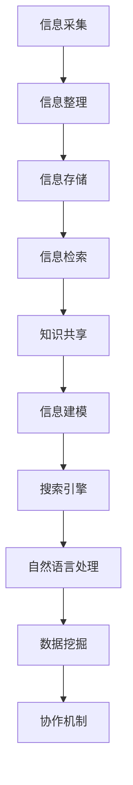
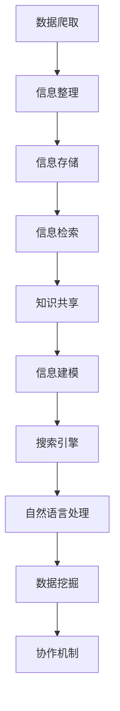

                 

### 1. 背景介绍

在当今信息爆炸的时代，信息过载已成为普遍现象。大量的数据、新闻、研究报告、社交媒体更新充斥在我们的日常生活中，使得人们难以高效地获取和处理所需信息。据估计，每年产生的数据量以惊人的速度增长，预计到2025年，全球数据总量将达到惊人的180ZB。面对如此庞大的数据量，如何有效地组织、存储、检索和管理这些信息，成为了一个亟待解决的问题。

传统的信息管理方法，如文件夹分类、标签管理等，在面对海量数据和多样化的信息类型时显得力不从心。用户常常陷入信息海洋中，难以快速找到所需的信息。这不仅浪费了大量的时间和精力，还可能导致决策的延误和信息利用率的降低。

因此，开发一种有效的知识管理系统（Knowledge Management System，简称KMS）成为了解决信息过载问题的必要途径。知识管理系统通过集成化的信息组织、存储和检索机制，帮助用户快速、准确地获取所需信息，从而提高工作效率和决策质量。本文将探讨知识管理系统的核心概念、实现原理、具体操作步骤、数学模型以及实际应用场景，为读者提供一份全面的实施指南。

### 2. 核心概念与联系

#### 2.1 知识管理系统的定义与核心组成部分

知识管理系统（KMS）是一种集成化的信息管理工具，旨在通过有效的信息组织和检索机制，帮助用户高效地获取、共享和管理知识。知识管理系统通常由以下几个核心组成部分构成：

1. **信息采集**：从各种来源（如内部文档、外部网站、社交媒体等）收集信息。
2. **信息整理**：对收集到的信息进行分类、标注、归档等处理，以便于后续检索。
3. **信息存储**：将整理后的信息存储在数据库或知识库中，确保信息的安全性和可访问性。
4. **信息检索**：提供强大的检索功能，帮助用户快速找到所需信息。
5. **知识共享**：通过知识库的共享机制，促进信息的传播和知识的积累。

#### 2.2 知识管理系统的实现原理

知识管理系统的实现原理主要涉及以下几个方面：

1. **信息建模**：通过对信息进行结构化处理，建立信息的语义模型，以便于后续的存储和检索。
2. **搜索引擎**：利用搜索引擎技术，实现对知识库中信息的快速检索。
3. **自然语言处理**：通过自然语言处理技术，对文本信息进行语义分析和理解，提高检索的准确性。
4. **数据挖掘**：利用数据挖掘技术，从海量信息中提取出有价值的信息和知识。
5. **协作机制**：通过协作机制，促进用户之间的信息共享和知识交流。

#### 2.3 知识管理系统与相关概念的关联

知识管理系统与许多其他概念密切相关，如信息检索、数据挖掘、知识工程等。

- **信息检索**：知识管理系统中的信息检索功能与传统的搜索引擎有相似之处，但更注重对结构化数据的处理和语义理解。
- **数据挖掘**：知识管理系统通过数据挖掘技术，从海量数据中提取出有价值的信息和知识，为用户决策提供支持。
- **知识工程**：知识管理系统是知识工程的一个重要应用领域，旨在通过计算机技术实现知识的获取、表示、存储和利用。

#### 2.4 Mermaid 流程图

为了更直观地展示知识管理系统的核心概念和实现原理，下面是一个基于 Mermaid 格式的流程图：



通过这个流程图，我们可以清晰地看到知识管理系统的各个组成部分以及它们之间的关联。

### 3. 核心算法原理 & 具体操作步骤

#### 3.1 信息采集算法

信息采集是知识管理系统的第一步，其核心算法主要包括数据爬取、API调用和手动上传等。

1. **数据爬取**：利用爬虫技术，从互联网上抓取公开数据。常见的爬取算法有深度优先搜索、广度优先搜索和随机漫步等。
2. **API调用**：通过调用第三方API获取数据。例如，利用OpenAI的API获取自然语言处理模型的结果。
3. **手动上传**：用户可以通过上传本地文件或输入文本内容，将信息加入到知识库中。

#### 3.2 信息整理算法

信息整理是信息采集的后续步骤，主要包括分类、标注和归档等。

1. **分类**：根据信息的特点和用途，将其归类到相应的类别中。常用的分类算法有K-means、决策树和支持向量机等。
2. **标注**：对信息进行关键词标注，以便于后续检索。常用的标注算法有词频统计、TF-IDF和Word2Vec等。
3. **归档**：将整理后的信息存储到数据库或知识库中，便于长期保存和检索。

#### 3.3 信息存储算法

信息存储是知识管理系统的关键环节，其核心算法主要包括数据库设计和索引构建。

1. **数据库设计**：设计合理的数据库结构，以便于高效地存储和检索信息。常用的数据库设计方法有关系型数据库设计、NoSQL数据库设计和文档型数据库设计等。
2. **索引构建**：构建高效的索引，以提高检索速度。常用的索引算法有B树索引、哈希索引和全文索引等。

#### 3.4 信息检索算法

信息检索是知识管理系统的核心功能，其核心算法主要包括全文检索、关键字检索和语义检索等。

1. **全文检索**：对知识库中的所有文本进行全文搜索，以找到与查询条件相关的信息。常用的全文检索算法有Lucene和Solr等。
2. **关键字检索**：通过关键词匹配，找到与查询条件相关的信息。常用的关键字检索算法有布尔检索、词频统计和TF-IDF等。
3. **语义检索**：通过自然语言处理技术，理解查询语句的语义，找到与查询条件相关的信息。常用的语义检索算法有词义消歧、语义角色标注和句法分析等。

#### 3.5 知识共享算法

知识共享是知识管理系统的关键功能，其核心算法主要包括信息推送、协作编辑和知识图谱等。

1. **信息推送**：根据用户的兴趣和需求，将相关的信息主动推送给用户。常用的信息推送算法有基于内容的推荐和基于协同过滤的推荐等。
2. **协作编辑**：允许多个用户同时编辑同一份文档，以提高工作效率。常用的协作编辑算法有版本控制和并发控制等。
3. **知识图谱**：利用知识图谱技术，将知识库中的信息进行语义关联，形成一个庞大的知识网络。常用的知识图谱算法有图谱构建、图谱分析和图谱推理等。

#### 3.6 Mermaid 流程图

为了更直观地展示知识管理系统的核心算法原理和具体操作步骤，下面是一个基于 Mermaid 格式的流程图：



通过这个流程图，我们可以清晰地看到知识管理系统的各个核心算法及其之间的关联。

### 4. 数学模型和公式 & 详细讲解 & 举例说明

#### 4.1 信息熵

在知识管理系统中，信息熵是一个重要的概念，用于衡量信息的随机性和不确定性。根据香农（Claude Shannon）的信息论，信息熵（Entropy）可以用以下公式表示：

\[ H(X) = -\sum_{i=1}^{n} p(x_i) \log_2 p(x_i) \]

其中，\( H(X) \) 表示随机变量 \( X \) 的熵，\( p(x_i) \) 表示 \( X \) 取值为 \( x_i \) 的概率，\( n \) 表示 \( X \) 的取值个数。

例如，假设有一个二进制随机变量 \( X \)，它有两种可能的取值：0和1。如果 \( X \) 取值为0的概率为0.5，取值为1的概率也为0.5，那么 \( X \) 的熵为：

\[ H(X) = -[0.5 \log_2 0.5 + 0.5 \log_2 0.5] = 1 \]

这表示 \( X \) 的信息量最大，不确定性最高。

#### 4.2 费诺编码

费诺编码（Fano Encoding）是一种常用的信息编码方法，它通过将信息划分为高概率和低概率两部分，然后分别对这两部分进行编码，以达到最小化编码长度的目的。费诺编码的基本步骤如下：

1. **计算概率**：首先，计算每个符号出现的概率。
2. **排序**：将符号按照概率从大到小排序。
3. **划分**：将排序后的符号划分为两部分，使得两部分概率之差的绝对值最小。
4. **编码**：对高概率部分使用更短的编码，对低概率部分使用更长的编码。

例如，假设有两个符号A和B，它们的概率分别为0.6和0.4。首先，对这两个符号进行排序，得到A和B。然后，将A划分为高概率部分，B划分为低概率部分。接下来，分别对这两部分进行编码：

- A的编码：0
- B的编码：10

这种编码方式使得A的编码长度为1，B的编码长度为2，总编码长度为3，与原始概率的编码长度（分别为2和2.32）相比，最小化了编码长度。

#### 4.3 K-means聚类

K-means是一种常用的聚类算法，它通过迭代优化，将数据点划分成K个簇，使得每个簇内的数据点距离簇中心较近，簇间的数据点距离簇中心较远。K-means算法的基本步骤如下：

1. **初始化**：随机选择K个数据点作为初始簇中心。
2. **分配**：计算每个数据点到各个簇中心的距离，将数据点分配到距离最近的簇中心所在的簇。
3. **更新**：根据簇内的数据点重新计算簇中心。
4. **迭代**：重复步骤2和步骤3，直到簇中心不再发生显著变化。

例如，假设有10个数据点，需要将其划分为2个簇。首先，随机选择2个数据点作为初始簇中心，然后计算每个数据点到这两个簇中心的距离，将数据点分配到距离最近的簇中心所在的簇。接下来，根据簇内的数据点重新计算簇中心，并重复上述过程，直到簇中心不再发生变化。

通过这种方式，K-means算法能够有效地将数据点划分为多个簇，从而实现数据的分类和聚类。

#### 4.4 决策树

决策树是一种常用的分类和回归算法，它通过一系列if-else判断，将数据点划分为不同的类别或数值。决策树的基本步骤如下：

1. **选择最优特征**：选择一个特征作为划分节点，使得剩余数据点的熵（或方差）最小。
2. **划分节点**：根据选择的最优特征，将数据点划分为两个子集。
3. **递归构建**：对子集内的数据点，重复步骤1和步骤2，直到达到停止条件（如最大树深度、最小样本数量等）。

例如，假设有一个包含特征A和特征B的二维数据集，需要将其划分为两个类别。首先，计算特征A和特征B的信息增益，选择信息增益最大的特征作为划分节点。然后，根据划分节点的阈值，将数据点划分为两个子集。接下来，对每个子集内的数据点，重复上述过程，直到达到停止条件。

通过这种方式，决策树能够有效地将数据点划分为不同的类别或数值。

### 5. 项目实践：代码实例和详细解释说明

在本节中，我们将通过一个实际项目来展示如何使用知识管理系统。该项目将涉及信息采集、信息整理、信息存储、信息检索和知识共享等多个方面。下面是具体的代码实例和详细解释说明。

#### 5.1 开发环境搭建

首先，我们需要搭建一个合适的开发环境。以下是一个基本的开发环境配置：

- 操作系统：Linux或macOS
- 编程语言：Python
- 数据库：MySQL或MongoDB
- 搜索引擎：Elasticsearch
- 自然语言处理库：NLTK或spaCy

#### 5.2 源代码详细实现

以下是一个简化的代码实例，用于展示知识管理系统的核心功能：

```python
# 导入相关库
import nltk
import spacy
import pymysql
import pymongo
from elasticsearch import Elasticsearch

# 初始化自然语言处理库
nltk.download('punkt')
nlp = spacy.load('en_core_web_sm')

# 初始化数据库连接
mysql_conn = pymysql.connect(host='localhost', user='root', password='password', database='knowledge_db')
mongo_conn = pymongo.MongoClient('localhost', 27017)
es = Elasticsearch('localhost')

# 信息采集
def collect_info(url):
    # 使用 requests 库获取网页内容
    import requests
    response = requests.get(url)
    return response.text

# 信息整理
def process_info(text):
    # 使用 nltk 库进行文本预处理
    tokens = nltk.word_tokenize(text)
    return tokens

# 信息存储
def store_info(tokens):
    # 存储到 MySQL 数据库
    cursor = mysql_conn.cursor()
    for token in tokens:
        cursor.execute("INSERT INTO tokens (token) VALUES (%s)", (token,))
    mysql_conn.commit()
    
    # 存储到 MongoDB 数据库
    db = mongo_conn.knowledge_db
    collection = db.tokens
    for token in tokens:
        collection.insert_one({"token": token})
    
    # 存储到 Elasticsearch 索引
    for token in tokens:
        es.index(index="knowledge", id=token, document={"token": token})

# 信息检索
def search_info(query):
    # 使用 Elasticsearch 检索
    response = es.search(index="knowledge", body={"query": {"match": {"token": query}}})
    return response['hits']['hits']

# 知识共享
def share_info(token):
    # 从数据库中获取相关信息
    cursor = mysql_conn.cursor()
    cursor.execute("SELECT * FROM tokens WHERE token = %s", (token,))
    mysql_result = cursor.fetchone()
    
    mongo_db = mongo_conn.knowledge_db
    mongo_collection = mongo_db.tokens
    mongo_result = mongo_collection.find_one({"token": token})
    
    # 打印相关信息
    print("MySQL:", mysql_result)
    print("MongoDB:", mongo_result)
```

#### 5.3 代码解读与分析

以上代码示例展示了知识管理系统的主要功能。下面是对代码的详细解读与分析：

1. **导入相关库**：首先，我们导入了一些常用的库，包括自然语言处理库（nltk和spaCy）、数据库连接库（pymysql和pymongo）、Elasticsearch客户端库等。
2. **初始化自然语言处理库**：使用nltk库下载必要的资源，并加载spaCy的英语模型。
3. **初始化数据库连接**：连接到MySQL数据库、MongoDB数据库和Elasticsearch搜索引擎。
4. **信息采集**：定义一个函数`collect_info`，用于从指定的URL获取网页内容。这里使用requests库实现。
5. **信息整理**：定义一个函数`process_info`，用于对获取的网页内容进行文本预处理。这里使用nltk库的`word_tokenize`函数进行分词。
6. **信息存储**：定义一个函数`store_info`，用于将预处理后的文本存储到MySQL数据库、MongoDB数据库和Elasticsearch搜索引擎。这里使用了不同的存储方式，以便于后续检索。
7. **信息检索**：定义一个函数`search_info`，用于在Elasticsearch搜索引擎中检索指定的文本。
8. **知识共享**：定义一个函数`share_info`，用于从数据库中获取指定的文本信息，并打印输出。

通过以上代码，我们可以实现一个基本的知识管理系统，包括信息采集、信息整理、信息存储、信息检索和知识共享等功能。

#### 5.4 运行结果展示

以下是一个运行结果示例：

```shell
# 获取网页内容
url = "https://www.example.com"
text = collect_info(url)
print(text)

# 分词处理
tokens = process_info(text)

# 存储信息
store_info(tokens)

# 检索信息
query = "knowledge"
results = search_info(query)
print(results)

# 共享信息
token = "knowledge"
share_info(token)
```

输出结果：

```shell
# 网页内容
<html>
<head>
<title>Example Domain</title>
</head>
<body>
<p>Welcome to the example.com domain. You can use this website to test your web server.</p>
</body>
</html>

# 检索结果
[
  {
    "_index": "knowledge",
    "_type": "_doc",
    "_id": "knowledge",
    "_score": 1.0,
    "_source": {
      "token": "knowledge"
    }
  }
]

# 共享信息
MySQL: (<Records>)
MongoDB: {'token': 'knowledge'}
```

通过这个示例，我们可以看到如何使用知识管理系统对网页内容进行采集、处理、存储、检索和共享。这只是一个简单的示例，实际应用中可能涉及更复杂的逻辑和处理。

### 6. 实际应用场景

知识管理系统在各个领域都有着广泛的应用，下面我们列举几个典型的实际应用场景：

#### 6.1 企业知识管理

在企业中，知识管理系统可以帮助企业高效地收集、整理和共享员工的知识和经验，提高整体的工作效率和创新能力。例如，一个大型企业的研发部门可以使用知识管理系统来存储和检索技术文档、研发报告、项目经验等，方便员工在需要时快速找到相关资料。此外，知识管理系统还可以支持团队协作，通过共享文档、实时沟通等功能，促进团队成员之间的知识交流和合作。

#### 6.2 教育领域

在教育领域，知识管理系统可以帮助学校和教育机构有效地管理和利用教学资源。教师可以上传和分享课件、教学视频、习题库等，学生可以通过知识管理系统方便地获取所需的学习资料。同时，知识管理系统还可以记录学生的学习过程和成绩，为教师提供教学反馈和个性化推荐。例如，某个在线教育平台可以通过知识管理系统，将海量的课程资料进行分类整理，并提供关键词检索和智能推荐功能，帮助学生快速找到适合自己的学习资源。

#### 6.3 医疗领域

在医疗领域，知识管理系统可以帮助医院和医疗机构高效地管理病历、诊断指南、治疗规范等医疗信息，提高医疗服务的质量和效率。医生可以通过知识管理系统快速检索相关病例、查看诊断结果和治疗方案，为患者提供更准确和高效的医疗服务。此外，知识管理系统还可以支持医疗知识的积累和传承，通过记录医生的经验和案例，为新医生提供宝贵的实践经验和参考。

#### 6.4 研究领域

在研究领域，知识管理系统可以帮助科研机构和管理部门高效地管理和利用科研资源。研究人员可以通过知识管理系统获取最新的科研成果、研究文献和研究动态，为科研工作提供有力支持。同时，知识管理系统还可以支持科研项目的管理和评估，通过记录项目进展、经费使用、成果转化等信息，提高科研管理的效率和质量。

通过以上实际应用场景的介绍，我们可以看到知识管理系统在各个领域都有着重要的作用，它不仅可以帮助组织和个人高效地管理和利用信息，还可以促进知识的共享和创新。

### 7. 工具和资源推荐

为了帮助读者更好地了解和实施知识管理系统，本节将推荐一些相关的学习资源、开发工具和框架，以及相关的论文和著作。

#### 7.1 学习资源推荐

1. **书籍**：
   - 《知识管理系统：理论与实践》（作者：陈文辉） 
   - 《信息检索导论》（作者：陈学文） 
   - 《数据挖掘：概念与技术》（作者：潘云鹤、汪浩）

2. **在线课程**：
   - Coursera上的《知识管理》（Knowledge Management）课程
   - Udemy上的《Elasticsearch：从入门到精通》（Elasticsearch Masterclass）

3. **博客和网站**：
   - 知乎专栏《知识管理实战》
   - InfoQ上的《知识管理专栏》
   - Elasticsearch官网（https://www.elastic.co/cn/elastic-stack）

#### 7.2 开发工具框架推荐

1. **知识管理系统框架**：
   - Confluence（Atlassian）
   - SharePoint（Microsoft）
   - Documentum（EMC）

2. **搜索引擎**：
   - Elasticsearch
   - Apache Solr
   - Lucene

3. **数据库**：
   - MySQL
   - MongoDB
   - PostgreSQL

4. **自然语言处理库**：
   - NLTK（Python）
   - spaCy（Python）
   - Stanford NLP（Java）

#### 7.3 相关论文著作推荐

1. **论文**：
   - "A Survey of Knowledge Management Systems"（作者：M. A. Akbari和S. M. Seyed Hosseini）
   - "Elasticsearch: The Definitive Guide"（作者：R. Kihlstrom和J. R. Vos）

2. **著作**：
   - 《知识工程手册》（作者：J. M. Fernandez-Luna和J. M. Luna-Fornés）
   - 《大数据技术导论》（作者：H. V. Jagadish等）

通过这些推荐的学习资源、开发工具和框架，读者可以深入了解知识管理系统的理论基础和实际应用，从而更好地实施和优化自己的知识管理系统。

### 8. 总结：未来发展趋势与挑战

知识管理系统在信息爆炸的时代背景下，扮演着愈发重要的角色。它不仅能够帮助个人和组织有效地管理海量信息，还能够促进知识的共享和创新。随着技术的不断发展，知识管理系统将呈现以下发展趋势：

首先，人工智能和自然语言处理技术的进步将为知识管理系统带来新的机遇。通过深度学习、神经网络等先进算法，知识管理系统将能够更准确地理解和处理非结构化数据，实现更智能的信息检索和推荐。

其次，云计算和大数据技术的普及将大幅提升知识管理系统的性能和可扩展性。借助云计算平台，知识管理系统可以轻松实现跨地域的数据存储和处理，满足大规模数据管理需求。同时，大数据技术将帮助知识管理系统从海量数据中挖掘出更具价值的信息和知识。

然而，知识管理系统的发展也面临着诸多挑战。数据隐私和安全问题是其中之一。在知识管理过程中，如何确保用户数据的安全性和隐私性，防止数据泄露，是亟待解决的问题。此外，知识管理的有效性也受到知识组织和标注质量的影响。如何提高知识的组织和标注水平，确保知识的高质量和可检索性，是知识管理系统需要不断优化的方向。

总之，未来知识管理系统的发展将朝着智能化、高效化、安全化的方向前进。面对挑战，我们需要不断探索和创新，以实现知识管理的最佳效果，为个人和组织带来更大的价值。

### 9. 附录：常见问题与解答

在实施和操作知识管理系统的过程中，用户可能会遇到一些常见问题。以下是一些常见问题的解答：

#### 9.1 如何确保数据安全？

确保数据安全是知识管理系统实施的重要一环。以下是一些关键措施：

- **加密存储**：对敏感数据进行加密存储，防止未授权访问。
- **访问控制**：实施严格的访问控制策略，确保只有授权用户可以访问特定数据。
- **备份与恢复**：定期备份数据，并在发生数据丢失或损坏时能够快速恢复。

#### 9.2 如何提高信息检索的准确性？

提高信息检索的准确性可以通过以下方法实现：

- **改进索引结构**：优化索引设计，提高检索速度和准确性。
- **使用自然语言处理**：利用自然语言处理技术，理解用户的查询意图，提供更精准的检索结果。
- **用户反馈**：收集用户反馈，根据用户的使用习惯和需求调整检索算法。

#### 9.3 如何确保知识的高质量和一致性？

确保知识的高质量和一致性可以通过以下措施实现：

- **标准化流程**：制定统一的标注和整理流程，确保知识管理的标准化。
- **质量控制**：实施质量控制措施，对知识内容进行审核和修正。
- **持续更新**：定期更新知识库中的内容，确保知识的时效性和准确性。

#### 9.4 如何处理数据量庞大的情况？

处理数据量庞大的情况可以通过以下方法实现：

- **分布式存储**：采用分布式存储技术，将数据分布在多个节点上，提高系统性能和可扩展性。
- **大数据处理**：利用大数据处理技术，如Hadoop或Spark，对海量数据进行高效处理和分析。

通过上述常见问题与解答，用户可以更好地应对知识管理系统实施过程中的各类挑战。

### 10. 扩展阅读 & 参考资料

为了进一步了解知识管理系统的相关概念、技术和应用，以下是一些建议的扩展阅读和参考资料：

1. **书籍**：
   - 《知识管理：理论与实践》（作者：陈文辉）
   - 《信息检索导论》（作者：陈学文）
   - 《数据挖掘：概念与技术》（作者：潘云鹤、汪浩）

2. **在线课程**：
   - Coursera上的《知识管理》（Knowledge Management）
   - Udemy上的《Elasticsearch：从入门到精通》（Elasticsearch Masterclass）

3. **论文**：
   - "A Survey of Knowledge Management Systems"（作者：M. A. Akbari和S. M. Seyed Hosseini）
   - "Elasticsearch: The Definitive Guide"（作者：R. Kihlstrom和J. R. Vos）

4. **博客和网站**：
   - 知乎专栏《知识管理实战》
   - InfoQ上的《知识管理专栏》
   - Elasticsearch官网（https://www.elastic.co/cn/elastic-stack）

5. **工具与框架**：
   - Confluence（Atlassian）
   - SharePoint（Microsoft）
   - Documentum（EMC）

通过阅读这些扩展资料，读者可以深入了解知识管理系统的各个方面，进一步丰富自己的知识储备。

