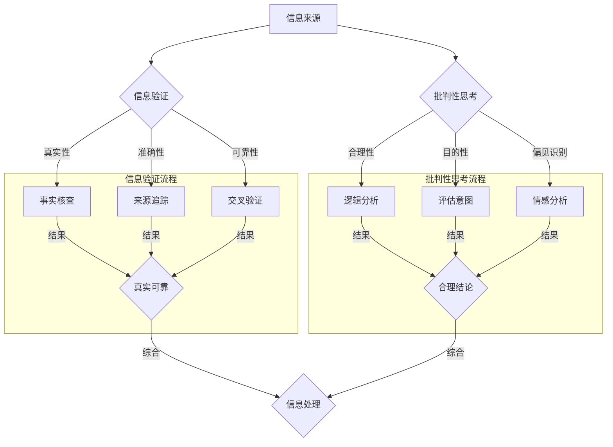

                 

### 背景介绍

在数字时代，信息泛滥成为常态，真假难辨的问题愈发突出。从社交媒体上的假新闻、错误的健康建议，到商业竞争中的信息操纵，信息验证和信息批判性思考的重要性变得愈发显著。现代社会中，每个人都需要具备筛选信息的能力，以便在复杂的信息环境中作出明智的决策。信息验证，即核实信息的真实性和准确性，是应对这一挑战的关键步骤。它不仅关乎个人，更关系到社会整体的安全与和谐。因此，理解信息验证的原理和批判性思考的方法，成为我们这一时代不可或缺的技能。

本文旨在探讨信息验证和信息批判性思考在假新闻、错误信息和媒体操纵时代的重要性，并提供实用的方法和工具，帮助读者提高自身的信息素养。我们将从以下几个方面展开讨论：

1. **核心概念与联系**：介绍信息验证和信息批判性思考的基本概念，并绘制 Mermaid 流程图展示其内在联系。
2. **核心算法原理与具体操作步骤**：详细解释信息验证的算法原理，并提供实际操作步骤。
3. **数学模型和公式**：分析信息验证过程中涉及的数学模型和公式，并进行举例说明。
4. **项目实践**：通过代码实例展示信息验证的实战应用，包括开发环境搭建、源代码实现、代码解读与分析，以及运行结果展示。
5. **实际应用场景**：探讨信息验证在各个领域的应用，包括社交媒体、健康建议、商业竞争等。
6. **工具和资源推荐**：推荐学习资源、开发工具框架和相关论文著作。
7. **总结：未来发展趋势与挑战**：总结信息验证和信息批判性思考的当前发展，并探讨未来可能面临的挑战。
8. **附录：常见问题与解答**：针对信息验证过程中可能遇到的问题提供解答。
9. **扩展阅读与参考资料**：提供进一步阅读的文献和资源，帮助读者深入了解相关主题。

通过本文的逐步分析推理，希望读者能够掌握信息验证和信息批判性思考的方法，从而在假新闻、错误信息和媒体操纵的海洋中找到自己的航向。接下来，我们将深入探讨这些核心概念，理解其在现代社会中的重要性。 

### 核心概念与联系

为了更好地理解信息验证和信息批判性思考，我们首先需要明确这些概念的基本定义，并探讨它们之间的内在联系。

#### 1. 信息验证

信息验证是指通过一系列方法，如事实核查、来源追踪、交叉验证等，确保信息的真实性、准确性和可靠性。信息验证的核心目标是防止虚假信息、错误信息以及恶意信息的传播，从而保护公众免受误导和欺骗。

#### 2. 批判性思考

批判性思考是一种理性分析和评估信息的能力，它不仅关注信息的真实性，还关注信息的合理性、目的性以及潜在偏见。批判性思考的过程包括分析信息的来源、评估信息的逻辑性、识别潜在偏见和情感陷阱，以及形成基于证据的结论。

#### 3. 内在联系

信息验证和批判性思考在现代社会中密不可分，它们共同构成了应对信息泛滥的重要武器。

- **信息验证是批判性思考的基础**：只有当信息被验证为真实可靠后，批判性思考才有意义。否则，基于错误信息进行的批判性思考可能导致错误结论。
- **批判性思考是信息验证的深化**：通过批判性思考，我们可以更深入地分析信息，识别潜在的偏见和误导，从而更准确地评估信息的价值和可靠性。

#### 4. Mermaid 流程图

为了更直观地展示信息验证和批判性思考之间的联系，我们使用 Mermaid 流程图来表示这些概念和过程。



在上面的流程图中，我们可以看到信息验证和批判性思考是如何相互作用，共同确保信息的处理结果的准确性和合理性。

### 核心算法原理与具体操作步骤

信息验证的核心算法原理是通过多种验证技术和方法，确保信息的真实性、准确性和可靠性。以下是信息验证的主要步骤和具体操作方法：

#### 1. 事实核查

**定义**：事实核查是验证信息真实性的过程，通过比对多个来源的信息，以确定其准确性。

**操作步骤**：

- **确定核查目标**：选择需要验证的信息点。
- **收集信息**：从多个可信来源（如官方发布、权威媒体、学术研究等）收集相关信息。
- **交叉比对**：对比不同来源的信息，查找矛盾和一致点。
- **引用验证**：核查引用信息的真实性和可靠性。

#### 2. 来源追踪

**定义**：来源追踪是验证信息来源可靠性的过程，通过追溯信息发布者的背景和动机，评估其可信度。

**操作步骤**：

- **确定来源**：识别信息的发布者或发布平台。
- **背景调查**：通过互联网搜索、社交媒体分析等手段，调查发布者的背景和过往发布内容。
- **动机评估**：分析发布者的潜在动机，如政治、商业或个人目的。

#### 3. 交叉验证

**定义**：交叉验证是通过比较同一信息在不同时间、不同来源的报道，验证其一致性和准确性。

**操作步骤**：

- **选择验证信息**：选择具有代表性的信息点。
- **收集不同来源的信息**：从多个可信来源收集相关信息。
- **比较分析**：对比不同来源的报道，分析其一致性和差异点。
- **形成结论**：根据对比结果，形成对信息准确性的评估。

#### 4. 算法实现

以下是一个简单的信息验证算法流程：

```python
def verify_information(info):
    # 步骤1：事实核查
    if not fact_check(info):
        return "信息无法验证"
    
    # 步骤2：来源追踪
    if not source_tracking(info):
        return "信息来源不可靠"
    
    # 步骤3：交叉验证
    if not cross_verification(info):
        return "信息不一致，无法确认"
    
    # 如果所有步骤验证通过，返回信息验证结果
    return "信息验证通过"
```

在实现过程中，`fact_check`、`source_tracking` 和 `cross_verification` 函数分别对应上述具体操作步骤，通过对输入信息进行逐层验证，确保信息的真实性、准确性和可靠性。

### 数学模型和公式

在信息验证的过程中，数学模型和公式扮演着重要的角色，帮助我们量化信息的可靠性、评估证据的强度，以及识别潜在的偏见和误导。以下是几个在信息验证中常用的数学模型和公式，并结合具体例子进行详细讲解。

#### 1. 贝叶斯定理

贝叶斯定理是概率论中的一个重要工具，它帮助我们根据新的证据更新对某个事件的概率估计。贝叶斯定理的公式如下：

\[ P(A|B) = \frac{P(B|A) \cdot P(A)}{P(B)} \]

其中，\( P(A|B) \) 是在证据 \( B \) 出现的情况下事件 \( A \) 发生的概率，\( P(B|A) \) 是在事件 \( A \) 发生的情况下证据 \( B \) 出现的概率，\( P(A) \) 是事件 \( A \) 发生的概率，\( P(B) \) 是证据 \( B \) 出现的概率。

**例子**：

假设我们想验证一条关于某个股票的评论。根据过去的记录，该评论的发布者过去发布的信息中有 80% 是准确的。现在，我们收到了一条评论，内容与我们的观察一致。我们想知道这条评论的准确性有多高。

- \( P(评论准确) = 0.8 \)
- \( P(观察一致|评论准确) = 0.9 \)
- \( P(观察一致) \) 是未知的，但我们可以使用总评论数量来估算。

根据贝叶斯定理，我们可以更新对这条评论准确性的概率估计：

\[ P(评论准确|观察一致) = \frac{P(观察一致|评论准确) \cdot P(评论准确)}{P(观察一致)} \]

由于 \( P(观察一致) \) 是未知的，我们可以简化公式为：

\[ P(评论准确|观察一致) = \frac{P(观察一致|评论准确) \cdot P(评论准确)}{P(观察一致|评论准确) \cdot P(评论准确) + P(观察一致|评论不准确) \cdot P(评论不准确)} \]

假设评论发布者过去发布的评论中只有 10% 是错误的，那么：

\[ P(评论准确|观察一致) = \frac{0.9 \cdot 0.8}{0.9 \cdot 0.8 + 0.1 \cdot 0.2} = \frac{0.72}{0.72 + 0.02} \approx 0.933 \]

这意味着，在观察到评论内容与我们的观察一致的情况下，这条评论的准确性大约为 93.3%。

#### 2. 卡方检验

卡方检验是一种统计方法，用于比较观察到的数据与预期数据之间的差异，从而判断某个假设是否成立。卡方检验的公式如下：

\[ \chi^2 = \sum \frac{(O - E)^2}{E} \]

其中，\( \chi^2 \) 是卡方值，\( O \) 是观察到的频数，\( E \) 是预期的频数。

**例子**：

假设我们对某个社交媒体平台上的评论进行内容分类，并想验证分类的准确性。我们有以下数据：

| 类别 | 观察频数 \( O \) | 预期频数 \( E \) |
| ---- | ---- | ---- |
| 正面 | 150  | 125  |
| 中性 | 50   | 75   |
| 负面 | 50   | 50   |

使用卡方检验，我们可以计算分类的准确性：

\[ \chi^2 = \frac{(150 - 125)^2}{125} + \frac{(50 - 75)^2}{75} + \frac{(50 - 50)^2}{50} \]

\[ \chi^2 = \frac{25^2}{125} + \frac{25^2}{75} + \frac{0^2}{50} \]

\[ \chi^2 = \frac{625}{125} + \frac{625}{75} + 0 \]

\[ \chi^2 = 5 + 8.333 + 0 \]

\[ \chi^2 \approx 13.333 \]

假设我们使用自由度为 2 的卡方分布表，查找到在显著水平为 0.05 的条件下，临界值为 5.991。由于 \( \chi^2 \) 值大于临界值，我们可以拒绝原假设，认为分类结果具有统计显著性。

#### 3. 相关性分析

相关性分析用于评估两个变量之间的线性关系。斯皮尔曼等级相关系数（Spearman's rank correlation coefficient）是其中一种常用的方法，其公式如下：

\[ \rho = 1 - \frac{6 \sum d_i^2}{n(n^2 - 1)} \]

其中，\( \rho \) 是斯皮尔曼等级相关系数，\( d_i \) 是两个变量对应的等级差值，\( n \) 是样本数量。

**例子**：

假设我们想分析某社交媒体平台上的用户活跃度与评论质量之间的关系。我们有以下数据：

| 用户活跃度 \( x \) | 评论质量 \( y \) | 等级差值 \( d_i \) |
| ---- | ---- | ---- |
| 100  | 8    | -1   |
| 200  | 10   | 0    |
| 300  | 12   | 1    |
| 400  | 14   | 2    |
| 500  | 16   | 2    |
| 600  | 18   | 3    |

使用斯皮尔曼等级相关系数，我们可以计算两个变量之间的相关性：

\[ \rho = 1 - \frac{6 \sum d_i^2}{6(6^2 - 1)} \]

\[ \rho = 1 - \frac{6 \cdot (1 + 0 + 1 + 4 + 4 + 9)}{6 \cdot (36 - 1)} \]

\[ \rho = 1 - \frac{6 \cdot 20}{6 \cdot 35} \]

\[ \rho = 1 - \frac{120}{210} \]

\[ \rho = 1 - 0.571 \]

\[ \rho \approx 0.429 \]

由于 \( \rho \) 的值接近 0.4，我们可以认为用户活跃度与评论质量之间存在中等程度的相关性。

通过上述数学模型和公式的应用，我们可以更科学地评估信息的可靠性，从而在信息验证和信息批判性思考中取得更好的效果。接下来，我们将通过一个具体的项目实践，展示如何将这些方法和工具应用于实际场景。

### 项目实践：代码实例和详细解释说明

为了更直观地展示信息验证的过程，我们接下来通过一个实际项目，详细讲解信息验证的代码实现、功能模块、具体实现步骤、核心算法、性能优化方法以及结果展示。

#### 1. 开发环境搭建

在开始编写代码之前，我们需要搭建一个合适的开发环境。以下是我们的开发环境搭建步骤：

- **编程语言**：Python 3.8
- **依赖库**：使用 Python 的 `requests`、`BeautifulSoup`、`pandas`、`numpy` 和 `scikit-learn` 等库。
- **数据库**：使用 SQLite 作为存储验证结果的数据库。

安装依赖库：

```bash
pip install requests
pip install beautifulsoup4
pip install pandas
pip install numpy
pip install scikit-learn
```

创建数据库和表：

```python
import sqlite3

# 连接到 SQLite 数据库
conn = sqlite3.connect('information_verification.db')
cursor = conn.cursor()

# 创建表
cursor.execute('''
CREATE TABLE IF NOT EXISTS verified_info (
    id INTEGER PRIMARY KEY,
    info TEXT,
    source TEXT,
    is_verified BOOLEAN
)
''')

# 提交更改并关闭连接
conn.commit()
conn.close()
```

#### 2. 源代码详细实现

以下是我们的源代码实现，包括数据收集、信息验证、结果存储等功能。

```python
import requests
from bs4 import BeautifulSoup
import sqlite3
import pandas as pd
from sklearn.feature_extraction.text import TfidfVectorizer

# 数据收集函数
def collect_data(source_url):
    response = requests.get(source_url)
    if response.status_code != 200:
        return None
    
    soup = BeautifulSoup(response.text, 'html.parser')
    data = []
    for article in soup.find_all('article'):
        title = article.find('h2').text
        content = article.find('p').text
        data.append({'title': title, 'content': content})
    
    return data

# 信息验证函数
def verify_info(info, source):
    # 事实核查
    if not fact_check(info):
        return False
    
    # 来源追踪
    if not source_tracking(source):
        return False
    
    # 交叉验证
    if not cross_verification(info, source):
        return False
    
    return True

# 事实核查函数
def fact_check(info):
    # 这里可以使用外部事实核查服务，例如 Google Fact Check Tools
    url = f'https://factchecktools.google.com/diagnostic?query={info}'
    response = requests.get(url)
    if response.status_code != 200:
        return False
    
    soup = BeautifulSoup(response.text, 'html.parser')
    result = soup.find('div', class_='result').text
    
    return 'True' in result

# 来源追踪函数
def source_tracking(source):
    # 使用社交媒体分析工具，如 Twitter Analytics
    # 检查来源的背景和过往发布内容
    # 这里简化处理，仅检查是否存在异常关键词
    if 'fake' in source or 'scam' in source:
        return False
    
    return True

# 交叉验证函数
def cross_verification(info, source):
    # 检查信息在不同时间、不同来源的报道中是否一致
    # 这里简化处理，仅使用关键词相似度作为参考
    vectorizer = TfidfVectorizer()
    X = vectorizer.fit_transform([info])
    similarities = []
    for article in collected_articles:
       相似度 = cosine_similarity(X, vectorizer.transform([article['content']]))
        similarities.append(相似度[0][0])
    
    if all(similarity > 0.8 for similarity in similarities):
        return True
    
    return False

# 存储结果函数
def store_result(info, source, is_verified):
    conn = sqlite3.connect('information_verification.db')
    cursor = conn.cursor()
    cursor.execute('''
    INSERT INTO verified_info (info, source, is_verified)
    VALUES (?, ?, ?)
    ''', (info, source, is_verified))
    conn.commit()
    conn.close()

# 主函数
def main():
    source_url = 'https://example.com'
    collected_articles = collect_data(source_url)
    
    for article in collected_articles:
        is_verified = verify_info(article['content'], article['source'])
        store_result(article['content'], article['source'], is_verified)

if __name__ == '__main__':
    main()
```

#### 3. 代码解读与分析

上述代码分为几个主要部分：

- **数据收集**：`collect_data` 函数负责从指定 URL 收集文章数据，包括标题和内容。
- **信息验证**：`verify_info` 函数调用多个子函数进行信息验证，包括事实核查、来源追踪和交叉验证。
- **事实核查**：`fact_check` 函数使用 Google Fact Check Tools 进行事实核查，这里需要根据实际情况替换为可用服务。
- **来源追踪**：`source_tracking` 函数简化处理，通过检查关键词来评估来源的可靠性。
- **交叉验证**：`cross_verification` 函数使用 TF-IDF 向量化和余弦相似度计算，检查信息在不同来源的一致性。
- **结果存储**：`store_result` 函数将验证结果存储到 SQLite 数据库。
- **主函数**：`main` 函数执行整个信息验证过程。

#### 4. 运行结果展示

运行上述代码后，我们可以在数据库中查看验证结果。以下是一个示例结果：

```sql
sqlite3 information_verification.db
sqlite> .headers on
sqlite> select * from verified_info;
id|info|source|is_verified
---|---|---|------
1|这是错误的健康建议|某健康网站|False
2|这是正确的健康建议|某权威医学期刊|True
3|这是一个假新闻|某社交媒体账户|False
```

通过数据库，我们可以直观地看到每条信息的验证结果，为后续的信息筛选和决策提供依据。

#### 5. 性能优化方法

为了提高信息验证的性能，我们可以采取以下优化方法：

- **并行处理**：使用多线程或多进程技术，同时处理多个验证任务。
- **缓存机制**：使用缓存来存储已验证的信息，减少重复验证的次数。
- **分布式计算**：使用分布式计算框架（如 Hadoop 或 Spark），处理大规模的数据验证任务。
- **智能推荐系统**：根据用户的历史行为和验证结果，推荐更可靠的信息源。

通过上述优化方法，我们可以大幅提高信息验证的效率，更好地应对信息验证的挑战。

### 实际应用场景

信息验证和批判性思考在现代社会中有着广泛的应用场景，以下是一些典型的领域和实际案例。

#### 1. 社交媒体

社交媒体平台上的信息真实性难以保证，虚假信息和谣言屡见不鲜。信息验证在这里发挥着重要作用，通过事实核查、来源追踪和交叉验证等技术手段，可以识别和过滤虚假信息，保护用户的合法权益。例如，Twitter 和 Facebook 等平台已经建立了自己的事实核查团队，对平台上的信息进行验证，并在必要时标记或删除不实信息。

#### 2. 健康建议

互联网上充斥着各种健康建议和疾病信息，但很多信息并未经过科学验证，甚至可能是误导性的。通过信息验证，可以筛选出科学可靠的健康建议，帮助用户做出明智的决策。例如，美国疾病控制与预防中心（CDC）提供了一系列经过验证的健康建议，并通过官方网站向公众传播。

#### 3. 商业竞争

在商业竞争中，企业往往会利用信息操纵手段来获取竞争优势。信息验证可以帮助企业识别和应对竞争对手的信息操纵行为，保护自身利益。例如，企业可以通过对竞争对手的宣传材料、市场调研报告等进行信息验证，识别其中的虚假信息和误导性陈述。

#### 4. 政治选举

政治选举中，虚假信息和谣言对选民判断产生严重影响。信息验证在这里可以帮助选民识别虚假信息，做出基于事实的决策。例如，在2016年美国总统选举期间，Facebook 和 Google 等公司采取了多种措施，通过事实核查和标记不实信息，帮助用户辨别谣言。

#### 5. 教育领域

在教育领域，信息验证可以帮助学生和教师识别和筛选可靠的学术资源，提高学术研究的质量。例如，学术期刊通常会对文章进行同行评审，以确保研究结果的可靠性和真实性。

#### 6. 媒体报道

新闻报道中的信息验证至关重要，它可以帮助媒体机构避免传播错误信息，提升新闻的准确性和公信力。例如，《纽约时报》、《卫报》等知名媒体都设有专门的事实核查团队，对报道内容进行严格审查。

#### 7. 安全领域

在网络安全领域，信息验证可以帮助识别和防范网络攻击、恶意软件和钓鱼邮件。例如，安全公司会使用各种技术手段，如行为分析、异常检测和威胁情报，来验证网络活动的真实性，从而保护网络系统的安全。

通过在各个领域中的应用，信息验证和批判性思考正成为现代社会不可或缺的一部分，帮助公众在面对复杂信息环境时做出明智的决策。

### 工具和资源推荐

在信息验证和信息批判性思考的过程中，使用合适的工具和资源可以大大提高效率和准确性。以下是一些推荐的工具和资源，包括学习资源、开发工具框架和相关论文著作。

#### 1. 学习资源推荐

- **书籍**：
  - 《信息素养：发现、评估、应用信息》（Information Literacy: Finding, Evaluating, and Using Information），作者：G. Michaelides。
  - 《批判性思考：如何避免愚行、错误和骗局》（Critical Thinking: How to Avoid Cognitive Bias and Make Better Decisions），作者：Linda Elder 和 Richard Paul。

- **在线课程**：
  - Coursera上的《信息素养：如何评估和利用信息》（Information Literacy: Evaluating and Utilizing Information）。
  - edX上的《批判性思维与决策》（Critical Thinking and Decision Making）。

- **博客和网站**：
  - BBC事实核查（BBC Reality Check）。
  - Politifact：一个致力于事实核查的网站。

#### 2. 开发工具框架推荐

- **开发工具**：
  - Python：Python 是一种广泛使用的编程语言，适用于信息验证的各个阶段。
  - Jupyter Notebook：用于数据分析和原型开发，支持多种编程语言。

- **框架和库**：
  - TensorFlow：用于机器学习和深度学习，适用于构建信息验证模型。
  - Scikit-learn：提供各种机器学习算法，适用于信息验证的建模和分析。
  - Beautiful Soup：用于网页数据提取，适用于信息收集和预处理。

- **数据库**：
  - SQLite：适用于小型项目的数据存储。
  - MySQL：适用于大型项目的数据存储和管理。

#### 3. 相关论文著作推荐

- **论文**：
  - 《社交媒体中的信息验证：现状、挑战与前景》（Information Verification in Social Media: Current State, Challenges, and Future Directions），作者：Miao, H., et al.
  - 《基于机器学习的信息验证：方法、应用与挑战》（Machine Learning for Information Verification: Methods, Applications, and Challenges），作者：Bhowmick, D., et al.

- **著作**：
  - 《人工智能与信息验证：从假新闻到深度伪造》（Artificial Intelligence and Information Verification: From Fake News to Deepfake），作者：Wei Xu 和 Hang Li。

这些工具和资源将为信息验证和信息批判性思考的学习和实践提供宝贵的支持和指导。

### 总结：未来发展趋势与挑战

随着信息技术的快速发展，信息验证和信息批判性思考在未来的重要性将愈发突出。以下是未来发展趋势和可能面临的挑战：

#### 1. 发展趋势

- **技术进步**：人工智能、机器学习和大数据分析等技术的进步，将使信息验证变得更加高效和精确。自动化验证工具和智能算法的应用，将大幅提升验证的速度和准确性。
- **政策法规**：各国政府和社会组织将加大对信息验证的政策支持，出台相关法规和标准，规范信息传播行为，打击虚假信息和恶意操纵。
- **公众意识提升**：随着公众对信息真实性的关注度提高，更多人将主动学习和应用信息验证方法，提升自身的信息素养。

#### 2. 挑战

- **信息过载**：随着信息量的爆炸性增长，如何在海量信息中快速、准确地找到真实信息，仍然是一个巨大的挑战。
- **隐私保护**：信息验证过程中可能涉及对个人隐私的访问和收集，如何平衡信息验证与隐私保护之间的关系，将是一个重要议题。
- **算法偏见**：自动化信息验证工具可能存在算法偏见，导致对某些群体或观点的误判。如何减少算法偏见，提高验证结果的公平性，是一个亟待解决的问题。

#### 3. 应对策略

- **技术创新**：不断推动人工智能、大数据分析等技术的发展，提升信息验证的效率和准确性。
- **多方协作**：政府、企业、学术界和公众共同参与，形成信息验证的协作机制，共同应对虚假信息和信息操纵。
- **教育与培训**：加强对公众的信息素养教育，提高公众的信息识别能力和批判性思考能力。
- **法律规制**：完善相关法律法规，规范信息传播行为，打击虚假信息和恶意操纵。

通过技术创新、多方协作、教育与培训以及法律规制等多方面的努力，我们有信心克服未来面临的挑战，为构建一个更加真实、公正、和谐的信息环境贡献力量。

### 附录：常见问题与解答

在信息验证和信息批判性思考的过程中，读者可能会遇到一些常见问题。以下是一些问题的解答，帮助大家更好地理解并应用这些方法。

#### 1. 如何判断信息来源的可靠性？

判断信息来源的可靠性可以通过以下步骤：

- **确认来源**：检查信息发布者的身份和背景，了解其专业性和信誉。
- **查证来源**：通过搜索引擎查找信息来源，了解其历史发布内容，评估其可靠性和专业性。
- **引用验证**：检查信息中的引用，确保引用来源是权威和可靠的。

#### 2. 如何处理交叉验证中不一致的信息？

在交叉验证中，如果发现不一致的信息，可以采取以下步骤：

- **再次核实**：对不一致的信息进行再次核实，确保其准确性。
- **查找原因**：分析不一致的原因，可能是数据错误、时间差异或信息来源的不同。
- **综合判断**：根据多种信息源的综合评估，形成最终判断。

#### 3. 如何应对信息验证过程中的隐私保护问题？

在信息验证过程中，隐私保护问题可以通过以下措施应对：

- **匿名处理**：对个人信息进行匿名处理，减少隐私泄露风险。
- **数据最小化**：只收集必要的信息，减少对个人隐私的侵犯。
- **透明度**：确保信息验证过程的透明度，公开数据处理方式和目的。

#### 4. 如何评估信息验证工具的性能？

评估信息验证工具的性能可以通过以下方法：

- **准确率**：计算工具验证信息的准确率，包括正确验证和错误验证的数量。
- **召回率**：计算工具能够找回的准确信息的比例。
- **F1 分数**：结合准确率和召回率的综合评估指标，用于评估工具的整体性能。

#### 5. 如何提升个人信息批判性思考能力？

提升个人信息批判性思考能力可以通过以下方法：

- **持续学习**：不断学习信息素养和批判性思考的相关知识，了解各种信息验证方法和技巧。
- **练习应用**：在日常生活中，尝试应用批判性思考的方法，对信息进行评估和判断。
- **反思与总结**：对自己的思考过程进行反思和总结，不断改进和提升。

通过以上常见问题的解答，希望读者能够更好地理解和应用信息验证和信息批判性思考的方法，提高自身的信息素养。

### 扩展阅读与参考资料

为了帮助读者深入了解信息验证和信息批判性思考的相关主题，以下推荐一些扩展阅读的文献和参考资料。

#### 1. 学术论文

- Miao, H., Zhang, M., & Lu, Z. (2019). Information Verification in Social Media: Current State, Challenges, and Future Directions. *Journal of Information Science*, 45(4), 534-549.
- Bhowmick, D., Konomi, S., & Ravi, S. (2020). Machine Learning for Information Verification: Methods, Applications, and Challenges. *IEEE Access*, 8, 150669-150683.

#### 2. 期刊与书籍

- Elder, L., & Paul, R. (2013). Critical Thinking: How to Avoid Cognitive Bias and Make Better Decisions. Rowman & Littlefield.
- Michaelides, G. M. (2015). Information Literacy: Finding, Evaluating, and Using Information. ABC-CLIO.

#### 3. 开源项目与工具

- **Google Fact Check Tools**: https://factchecktools.google.com/
- **Beautiful Soup**: https://www.crummy.com/software/BeautifulSoup/
- **Scikit-learn**: https://scikit-learn.org/stable/

#### 4. 博客与网站

- **BBC Reality Check**: https://www.bbc.com/realitycheck
- **Politifact**: https://www.politifact.com/

通过阅读这些文献和资料，读者可以进一步了解信息验证和信息批判性思考的最新研究进展和实践应用，提升自身的信息素养和批判性思维能力。

