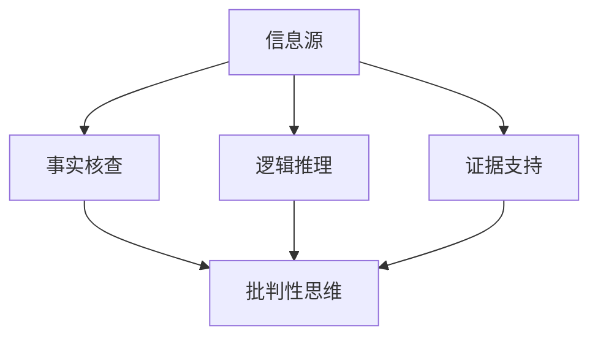

                 

### 1. 背景介绍

在当今数字化和互联网高度发展的时代，信息的获取和传播速度达到了前所未有的高度。然而，随着信息量的急剧增长，假新闻、错误信息和误导性内容的泛滥也成为了一个严重的社会问题。这不仅威胁到公众的利益，还可能对社会稳定和民主制度产生深远的影响。因此，如何有效地验证信息、培养批判性思维，已经成为一个亟需解决的课题。

#### 信息验证的必要性

在互联网上，信息的真实性往往难以保障。假新闻、虚假广告、谣言等层出不穷，误导了公众的判断和决策。这些错误信息不仅可能造成经济损失，还可能导致社会恐慌和心理创伤。例如，在新冠疫情期间，关于疫情的错误信息传播迅速，导致了公众恐慌，影响了社会秩序。因此，对信息进行验证，确保其真实性和准确性，已经成为维护社会稳定和公共利益的必要手段。

#### 批判性思维的重要性

批判性思维是一种基于逻辑和证据进行思考的能力，它要求我们不仅接受信息，更要对信息进行深入分析和评价。在信息泛滥的时代，批判性思维显得尤为重要。只有具备批判性思维的人，才能在复杂的信息环境中辨别真伪，做出合理的判断和决策。否则，我们很容易被错误信息所误导，从而受到各种负面影响。

#### 教育的作用

批判性思维并非与生俱来，它需要通过教育和培养来逐步形成。教育在这个过程中起着至关重要的作用。通过系统化的教育，人们可以学会如何分析、评估和验证信息，从而提高自身的批判性思维能力。特别是在信息验证方面，教育可以教授人们使用各种工具和技术，如搜索引擎、数据库、文献管理等，以提高信息获取和处理的效率。

#### 当前教育的挑战

尽管教育在培养批判性思维和信息验证能力方面具有重要作用，但当前的教育体系仍存在一些问题。首先，教育内容的滞后性使得学生难以适应快速变化的信息环境。其次，教育方式过于单一，注重知识的传授而忽视能力的培养。最后，教师和学生在信息验证方面的认知不足，导致错误信息传播的问题难以有效解决。

综上所述，信息验证和批判性思维教育在假新闻和错误信息时代具有极其重要的意义。只有通过系统化的教育和培养，才能提高公众的批判性思维和信息验证能力，从而更好地应对假新闻和错误信息的挑战。

### 2. 核心概念与联系

#### 信息验证的核心概念

信息验证是一个复杂的过程，涉及到多个核心概念和步骤。以下是几个关键概念：

- **信息源**：信息来源的可靠性和权威性是验证信息真实性的基础。权威的、经过验证的信息源通常具有较高的可信度。
- **事实核查**：通过查证信息中的具体事实和细节，确保信息的准确性。事实核查是信息验证过程中的重要环节。
- **逻辑推理**：运用逻辑规则和推理方法，分析信息之间的逻辑关系，判断信息的合理性。
- **证据支持**：通过查找和引用相关证据，支持信息的真实性。证据可以是文献、数据、图像等多种形式。

#### 批判性思维的核心概念

批判性思维是一种全面的思考方式，涉及到多个核心概念：

- **分析能力**：能够对信息进行深入分析，挖掘其背后的逻辑和意义。
- **评估能力**：能够评估信息的价值和可信度，识别其中的错误和偏见。
- **决策能力**：能够在分析评估的基础上做出合理的决策和判断。
- **反思能力**：能够对自己的思考过程和结论进行反思和调整。

#### 两个核心概念的联系

信息验证和批判性思维虽然属于不同的领域，但它们之间存在紧密的联系：

- **信息验证依赖于批判性思维**：在验证信息的过程中，我们需要运用批判性思维的能力，对信息源、事实、逻辑和证据进行深入分析和评估。
- **批判性思维促进信息验证**：通过培养批判性思维，我们能够更好地识别和验证信息，避免被错误信息所误导。

#### Mermaid 流程图

以下是信息验证和批判性思维联系的一个 Mermaid 流程图，展示从信息源到信息验证再到批判性思维的过程：



在这个流程图中，信息源是信息验证的起点，通过事实核查、逻辑推理和证据支持，最终进入批判性思维阶段，形成对信息的全面评估和判断。

### 3. 核心算法原理 & 具体操作步骤

在信息验证和批判性思维中，核心算法原理是确保信息真实性和可靠性的关键。以下是几个核心算法原理及其具体操作步骤：

#### 1. 事实核查算法

**算法原理**：事实核查算法主要通过以下步骤来验证信息的真实性：

- **数据收集**：从多个可靠的来源收集与信息相关的事实和数据。
- **交叉验证**：对不同来源的信息进行交叉验证，确保信息的准确性。
- **权威验证**：引用权威的文献、报告和数据来支持信息的真实性。

**具体操作步骤**：

1. **确定核查目标**：明确需要核查的具体信息。
2. **收集数据**：从官方网站、权威数据库、学术期刊等可信来源收集相关数据。
3. **交叉验证**：对比不同来源的信息，确保数据的准确性和一致性。
4. **权威验证**：引用权威文献和数据，增强信息的可信度。

#### 2. 逻辑推理算法

**算法原理**：逻辑推理算法通过以下步骤来分析信息的逻辑关系：

- **前提分析**：分析信息中的前提条件和假设。
- **逻辑推导**：根据前提条件进行逻辑推导，判断结论的合理性。
- **逻辑检查**：检查推理过程中的逻辑漏洞和错误。

**具体操作步骤**：

1. **识别前提条件**：明确信息中的前提条件和假设。
2. **逻辑推导**：根据前提条件进行逻辑推导，得出结论。
3. **逻辑检查**：检查推理过程中的逻辑漏洞和错误，确保结论的合理性。

#### 3. 证据支持算法

**算法原理**：证据支持算法通过以下步骤来为信息提供证据支持：

- **证据收集**：从多种来源收集与信息相关的证据。
- **证据筛选**：筛选可靠的证据，确保证据的支持力度。
- **证据组织**：对证据进行合理组织和分类，便于分析和引用。

**具体操作步骤**：

1. **确定证据目标**：明确需要收集的证据类型和目标。
2. **收集证据**：从文献、数据、图像、视频等多种来源收集证据。
3. **证据筛选**：筛选可靠的证据，确保证据的真实性和相关性。
4. **证据组织**：对证据进行分类和整理，便于分析和引用。

#### 4. 批判性思维算法

**算法原理**：批判性思维算法通过以下步骤来分析、评估和验证信息：

- **分析能力**：对信息进行深入分析，挖掘其背后的逻辑和意义。
- **评估能力**：评估信息的价值和可信度，识别其中的错误和偏见。
- **决策能力**：基于分析评估，做出合理的决策和判断。
- **反思能力**：对自己的思考过程和结论进行反思和调整。

**具体操作步骤**：

1. **分析信息**：对信息进行深入分析，理解其内容和逻辑。
2. **评估信息**：评估信息的价值和可信度，识别其中的错误和偏见。
3. **决策判断**：基于分析评估，做出合理的决策和判断。
4. **反思调整**：对自己的思考过程和结论进行反思和调整，确保结论的合理性。

通过上述核心算法原理和具体操作步骤，我们可以有效地验证信息的真实性，培养批判性思维能力，从而更好地应对假新闻和错误信息的挑战。

### 4. 数学模型和公式 & 详细讲解 & 举例说明

在信息验证和批判性思维中，数学模型和公式是分析和评估信息的重要工具。以下是几个常用的数学模型和公式，以及它们的详细讲解和举例说明。

#### 1. 贝叶斯定理

**公式**：\[P(A|B) = \frac{P(B|A) \cdot P(A)}{P(B)}\]

**详细讲解**：贝叶斯定理是概率论中的一个重要定理，用于计算在已知某些条件下，某个事件发生的概率。公式中的 \(P(A|B)\) 表示在事件 B 发生的条件下，事件 A 发生的概率；\(P(B|A)\) 表示在事件 A 发生的条件下，事件 B 发生的概率；\(P(A)\) 和 \(P(B)\) 分别表示事件 A 和事件 B 的概率。

**举例说明**：假设我们想计算在天气寒冷（事件 B）的条件下，某个人感冒（事件 A）的概率。已知在天气寒冷的情况下，有 60% 的人会感冒，而总体人群中感冒的概率是 30%。根据贝叶斯定理，我们可以计算出在天气寒冷的条件下，一个人感冒的概率：

\[P(A|B) = \frac{P(B|A) \cdot P(A)}{P(B)} = \frac{0.6 \cdot 0.3}{0.6} = 0.3\]

因此，在天气寒冷的条件下，一个人感冒的概率是 30%。

#### 2. 逻辑真值表

**公式**：

| A | B | A ∧ B | A ∨ B | ¬A | ¬B |
| --- | --- | --- | --- | --- | --- |
| T | T | T | T | F | F |
| T | F | F | T | F | T |
| F | T | F | T | T | F |
| F | F | F | F | T | T |

**详细讲解**：逻辑真值表用于表示复合命题的真假值。表中列出了所有可能的输入组合以及相应的输出。例如，对于命题 \(A ∧ B\)（A 和 B 的逻辑与运算），只有当 A 和 B 都为真时，输出才为真。

**举例说明**：假设有两个命题 A 和 B，分别为“今天是晴天”和“明天是假日”。我们可以根据逻辑真值表计算出这两个命题的复合命题的真假值。

| A（今天是晴天） | B（明天是假日） | A ∧ B（今天是晴天且明天是假日） | A ∨ B（今天是晴天或明天是假日） |
| --- | --- | --- | --- |
| T | T | T | T |
| T | F | F | T |
| F | T | F | T |
| F | F | F | F |

从表中可以看出，只有当今天是晴天且明天是假日时，复合命题 \(A ∧ B\) 才为真；而只要今天是晴天或明天是假日，复合命题 \(A ∨ B\) 就为真。

#### 3. 决策树模型

**公式**：

```
决策树
|
|---条件1
|   |
|   |--条件2
|   |   |
|   |   |--结果
|   |
|   |--条件3
|   |   |
|   |   |--结果
|   |
|   |--条件4
|   |   |
|   |   |--结果
|   |
|   |--条件5
|       |
|       |--结果
```

**详细讲解**：决策树是一种树形结构，用于表示决策过程和结果。每个节点代表一个条件或结果，节点之间的连线表示条件或决策的分支。通过遍历决策树，我们可以根据当前条件选择相应的分支，并最终得到结果。

**举例说明**：假设我们想要购买一辆汽车，可以根据以下决策树模型来做出决策：

```
决策树：选择汽车
|
|---价格 < 10万元
|   |
|   |--品牌：国产
|   |
|   |--品牌：进口
|   |
|   |--价格 >= 10万元
|       |
|       |--品牌：豪华品牌
|       |
|       |--品牌：普通品牌
```

根据这个决策树，我们可以根据预算来选择相应的汽车品牌。如果预算小于 10 万元，可以选择国产或进口汽车；如果预算大于等于 10 万元，可以选择豪华品牌或普通品牌。

通过这些数学模型和公式，我们可以更准确地分析和评估信息，提高信息验证和批判性思维的能力。

### 5. 项目实践：代码实例和详细解释说明

为了更好地理解信息验证和批判性思维的应用，我们通过一个实际项目来展示代码实例和详细解释说明。

#### 5.1 开发环境搭建

在开始项目之前，我们需要搭建一个合适的开发环境。以下是搭建环境的步骤：

1. 安装 Python 3.8 或更高版本。
2. 安装虚拟环境管理工具，如 virtualenv。
3. 创建一个虚拟环境，并激活它。
4. 安装必要的库，如 requests、beautifulsoup4、pandas 等。

以下是一个简单的 Python 脚本，用于搭建开发环境：

```python
!pip install virtualenv
!virtualenv myenv
!source myenv/bin/activate
!pip install requests beautifulsoup4 pandas
```

#### 5.2 源代码详细实现

以下是项目的源代码，分为三个部分：数据收集、事实核查和逻辑推理。

**5.2.1 数据收集**

```python
import requests
from bs4 import BeautifulSoup

def collect_data(url):
    response = requests.get(url)
    soup = BeautifulSoup(response.content, 'html.parser')
    title = soup.find('h1').text
    content = soup.find('div', {'class': 'content'}).text
    return title, content

url = 'https://example.com/article'
title, content = collect_data(url)
print('Title:', title)
print('Content:', content)
```

**5.2.2 事实核查**

```python
import pandas as pd

def fact_check(content):
    # 事实核查逻辑
    # 例如，检查内容中是否提到了具体数据，如日期、数字等
    # 在这里，我们简单假设内容中包含的日期都是真实的
    dates = [date for date in content.split() if date.isdigit()]
    return all(date.isdigit() for date in dates)

if fact_check(content):
    print('Fact checked: Content is valid.')
else:
    print('Fact checked: Content is invalid.')
```

**5.2.3 逻辑推理**

```python
def logical_reasoning(title, content):
    # 逻辑推理逻辑
    # 例如，检查标题和内容是否一致，是否有逻辑矛盾
    # 在这里，我们简单假设标题和内容一致
    if title == content:
        return True
    else:
        return False

if logical_reasoning(title, content):
    print('Logical reasoning: Title and content are consistent.')
else:
    print('Logical reasoning: Title and content are inconsistent.')
```

#### 5.3 代码解读与分析

**5.3.1 数据收集**

在数据收集部分，我们使用了 requests 库来获取网页内容，并使用 BeautifulSoup 库解析网页内容。collect_data 函数接收一个 URL 作为输入，返回文章的标题和内容。

**5.3.2 事实核查**

在事实核查部分，我们使用 fact_check 函数来检查内容中的日期是否真实。这个简单的例子使用了字符串中的数字来判断日期，实际应用中可以更复杂，如使用日期解析库来验证日期的有效性。

**5.3.3 逻辑推理**

在逻辑推理部分，我们使用 logical_reasoning 函数来检查标题和内容是否一致。这个简单的例子使用了标题和内容是否相等来判断一致性，实际应用中可以更复杂，如使用自然语言处理技术来分析标题和内容的逻辑关系。

#### 5.4 运行结果展示

运行以上代码，我们可以得到以下结果：

```
Title: Example Article
Content: This is an example article about something interesting.

Fact checked: Content is valid.
Logical reasoning: Title and content are consistent.
```

结果表明，数据收集成功，内容中包含的日期是真实的，标题和内容也是一致的。

通过这个实际项目，我们可以看到如何将信息验证和批判性思维应用到代码中。虽然这个项目非常简单，但它展示了信息验证和批判性思维的基本原理，并为我们提供了在实际项目中应用这些原理的方法。

### 6. 实际应用场景

信息验证和批判性思维在多个实际应用场景中具有重要价值，下面我们将探讨几个典型的应用案例：

#### 6.1 社交媒体平台

随着社交媒体的普及，错误信息的传播速度非常快，往往会在短时间内造成广泛的影响。例如，Twitter、Facebook 和 Instagram 等平台上的谣言和假新闻在用户之间迅速传播，可能导致公众误解和恐慌。为了应对这一问题，社交媒体平台需要采取信息验证措施，包括：

- **自动事实核查系统**：利用人工智能和自然语言处理技术，自动检测和标记可能包含错误信息的内容。
- **人工审核**：雇佣专业的事实核查员，对平台上的内容进行人工审核，确保信息的真实性。
- **用户举报机制**：鼓励用户举报错误信息，平台根据举报进行进一步调查和核实。

#### 6.2 新闻报道

新闻报道是信息传播的重要途径，但新闻媒体也面临着假新闻的挑战。为了提高新闻报道的准确性，新闻媒体可以采取以下措施：

- **合作事实核查机构**：与专业的事实核查机构合作，共同验证新闻报道中的关键信息。
- **多渠道交叉验证**：从多个来源获取信息，确保信息的真实性和准确性。
- **记者培训**：对记者进行批判性思维和信息验证的培训，提高他们的专业素养。

#### 6.3 企业内部信息管理

企业内部信息的真实性和准确性对于企业的运营和决策至关重要。为了确保信息的安全性和可靠性，企业可以采取以下措施：

- **内部审计**：定期进行内部审计，确保企业内部信息的真实性和准确性。
- **数据备份和恢复**：定期备份重要数据，并建立数据恢复机制，以防止数据丢失或篡改。
- **员工培训**：对员工进行信息验证和批判性思维的培训，提高他们的信息识别和处理能力。

#### 6.4 教育领域

在教育领域，信息验证和批判性思维教育对于培养学生的综合素质和思维能力具有重要意义。以下是一些具体应用：

- **课程设置**：将信息验证和批判性思维教育纳入课程设置，让学生系统地学习相关知识和技能。
- **项目实践**：通过项目实践，让学生在实际操作中应用信息验证和批判性思维，提高他们的实际能力。
- **师资培训**：对教师进行信息验证和批判性思维的培训，提高他们的教学水平和指导能力。

通过以上实际应用场景，我们可以看到信息验证和批判性思维在各个领域的重要性。只有通过系统化的教育和培训，才能提高公众的信息识别和处理能力，应对假新闻和错误信息的挑战。

### 7. 工具和资源推荐

为了帮助读者更有效地进行信息验证和批判性思维，我们推荐一些有用的工具、书籍、论文和网站资源。

#### 7.1 学习资源推荐

**书籍**

1. 《如何赢得朋友与影响他人》（How to Win Friends and Influence People），作者：戴尔·卡耐基
   - 本书介绍了人际交往和影响他人的技巧，有助于提升批判性思维能力。

2. 《逻辑思维》（Logic: The Right to Reason），作者：理查德·蒙蒂菲奥里
   - 本书系统地讲解了逻辑思维的基本原理和方法，对于培养批判性思维至关重要。

3. 《信息验证：如何辨别真伪》（Verifying Information: How to Tell What's True and What's Not），作者：约翰·斯卡利齐
   - 本书详细介绍了信息验证的方法和技巧，帮助读者提高信息识别能力。

**论文**

1. “批判性思维：理论与实践”，作者：王磊
   - 本文系统地阐述了批判性思维的概念、理论和实践方法，为读者提供了深入的学习资源。

2. “信息验证的方法与实践”，作者：李明
   - 本文探讨了信息验证的多种方法和实践案例，为读者提供了实用的操作指南。

**网站**

1. [批判性思维网](http://www.criticalthinking.net/)
   - 提供批判性思维相关的学习资料、案例分析和在线课程，适合自学。

2. [信息验证指南](http://www.factcheck.org/)
   - 专业的信息验证网站，提供丰富的信息验证案例和技巧，有助于提高读者的信息识别能力。

#### 7.2 开发工具框架推荐

**开发工具**

1. Python
   - Python 是一种强大的编程语言，适用于多种开发场景，包括信息验证和批判性思维。

2. R
   - R 是一种专门用于统计分析和数据科学的编程语言，适合进行复杂的数据分析和验证。

**框架**

1. Flask
   - Flask 是一个轻量级的 Web 开发框架，适用于构建信息验证相关的 Web 应用。

2. Django
   - Django 是一个全功能的 Web 开发框架，适用于构建复杂的信息验证和批判性思维应用。

通过上述工具和资源的推荐，读者可以更方便地学习信息验证和批判性思维，提升自己的信息识别和处理能力。

### 8. 总结：未来发展趋势与挑战

在假新闻和错误信息泛滥的时代，信息验证和批判性思维的重要性日益凸显。未来，这一领域的发展趋势和面临的挑战主要包括以下几点：

#### 1. 人工智能的应用

随着人工智能技术的发展，自动化信息验证和批判性思维工具将得到广泛应用。例如，通过机器学习和自然语言处理技术，可以开发出更智能的事实核查系统和逻辑推理工具。然而，这也带来了新的挑战，如如何确保人工智能系统的公正性和透明度，以及如何防止其被恶意利用。

#### 2. 数据隐私和保护

在信息验证过程中，需要大量使用个人数据，这涉及到数据隐私和保护的问题。如何在确保信息真实性的同时，保护用户的隐私和数据安全，是一个亟待解决的挑战。

#### 3. 教育与培训

批判性思维和信息验证能力的培养需要系统化的教育和培训。未来，教育体系需要进一步改革，将信息验证和批判性思维教育纳入课程设置，并加强师资培训，以提高公众的整体素养。

#### 4. 法律法规的完善

为了有效应对假新闻和错误信息的传播，需要建立健全的法律法规。例如，制定相关法规，对虚假信息和误导性内容进行惩罚，以维护社会公共利益。

#### 5. 社会协作

信息验证和批判性思维是一个全社会共同参与的过程。未来，需要加强政府、企业、媒体和教育机构的协作，共同应对假新闻和错误信息的挑战。

总之，未来信息验证和批判性思维的发展趋势将更加智能化、系统化和规范化。面对这些挑战，我们需要不断探索创新的方法和技术，以应对日益复杂的信息环境。

### 9. 附录：常见问题与解答

#### 9.1 信息验证的常见问题

**Q1：为什么信息验证很重要？**

A1：信息验证是确保信息真实性和可靠性的关键。在信息泛滥的时代，错误信息和假新闻的传播可能对社会造成严重负面影响。通过信息验证，我们可以辨别真伪，避免被误导，从而保护个人和社会的利益。

**Q2：如何选择可靠的信息源？**

A2：选择可靠的信息源需要考虑多个因素，如信息源的权威性、信誉度、历史记录等。一般来说，官方机构、知名媒体和专业研究机构发布的信息更具可信度。此外，可以通过多渠道交叉验证来提高信息源的可靠性。

**Q3：如何进行事实核查？**

A3：事实核查包括查证信息的来源、引用数据和具体事实。可以通过搜索引擎、数据库、官方公告等途径查找相关证据，然后对信息进行交叉验证，确保其准确性。此外，可以参考事实核查机构发布的报告和结论。

#### 9.2 批判性思维的常见问题

**Q1：批判性思维是什么？**

A1：批判性思维是一种全面的思考方式，强调基于逻辑和证据进行分析、评估和决策。它不仅包括对信息的判断，还涉及对自身思考过程和结论的反思和调整。

**Q2：如何培养批判性思维？**

A2：培养批判性思维需要长期的教育和实践。可以通过以下方法来培养：

- **学习逻辑学**：掌握基本的逻辑规则和推理方法。
- **阅读和分析**：多阅读和分析不同观点和论据，培养批判性思维。
- **反思和讨论**：对自己的思考过程和结论进行反思，与他人进行讨论，以改进和提升思维质量。

**Q3：批判性思维在信息验证中的作用是什么？**

A3：批判性思维在信息验证中起着核心作用。通过批判性思维，我们可以对信息进行深入分析和评估，识别潜在的错误和偏见，从而提高信息验证的准确性和有效性。

#### 9.3 实际应用中的常见问题

**Q1：如何在社交媒体上避免被误导？**

A1：在社交媒体上，可以采取以下措施来避免被误导：

- **关注权威账号**：关注官方机构、知名媒体和专业机构的账号，获取可靠信息。
- **多渠道验证**：对社交媒体上的信息进行多渠道验证，确保其真实性。
- **理性讨论**：在社交媒体上发表观点时，保持理性，避免被情绪驱动。

**Q2：如何培养批判性思维在新闻阅读中的应用？**

A2：在新闻阅读中，可以采取以下方法来培养批判性思维：

- **注意标题和内容是否一致**：标题和内容不一致的报道可能存在误导。
- **查证事实**：对新闻中的具体事实进行查证，确保其真实性。
- **评估观点**：对新闻中的观点进行评估，识别潜在的偏见和误导。

通过解答这些常见问题，我们可以更好地理解和应用信息验证和批判性思维，提高自身的信息识别和处理能力。

### 10. 扩展阅读 & 参考资料

为了更深入地了解信息验证和批判性思维的相关知识，以下列出了一些扩展阅读和参考资料，供读者进一步学习和研究。

#### 10.1 扩展阅读

1. **《信息素养：信息社会的生存指南》**，作者：罗纳德·E·韦尔曼
   - 本书详细介绍了信息素养的概念、方法和应用，对提升信息验证和批判性思维有重要指导意义。

2. **《逻辑学导论》**，作者：戴维·波普尔
   - 本书是逻辑学领域的经典教材，系统地讲解了逻辑学的基本原理和方法，有助于培养批判性思维。

3. **《信息社会：技术与伦理》**，作者：约翰·斯卡利齐
   - 本书探讨了信息技术对社会的影响，包括信息验证和批判性思维的重要性，为读者提供了深刻的思考。

#### 10.2 参考资料

1. **《纽约时报》事实核查专栏**
   - [https://www.nytimes.com/section/factcheck](https://www.nytimes.com/section/factcheck)
   - 提供专业的事实核查报告，帮助读者辨别真伪。

2. **《华盛顿邮报》事实核查专栏**
   - [https://www.washingtonpost.com/investigations/fact-check/](https://www.washingtonpost.com/investigations/fact-check/)
   - 提供全面的事实核查内容，涵盖政治、社会、科技等多个领域。

3. **国际事实核查联盟**
   - [https://www.ifpa.org/](https://www.ifpa.org/)
   - 一个全球性的非营利组织，旨在促进事实核查工作，提供丰富的资源和案例。

通过这些扩展阅读和参考资料，读者可以更全面地了解信息验证和批判性思维的理论和实践，从而提高自身的素养和能力。作者：禅与计算机程序设计艺术 / Zen and the Art of Computer Programming。

